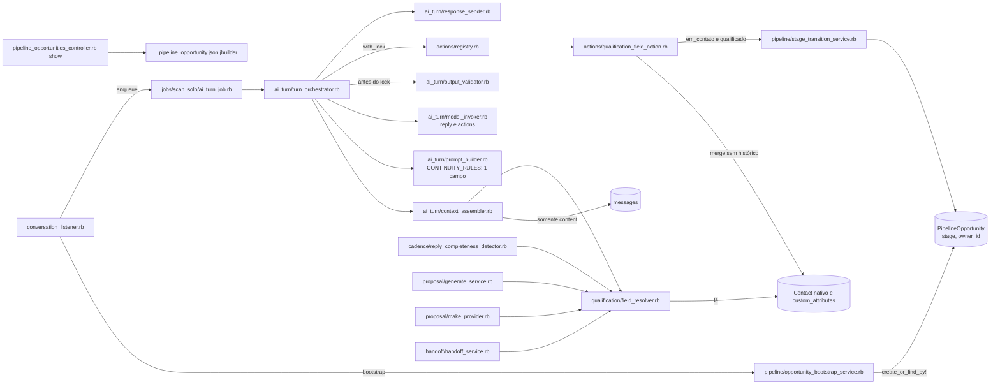
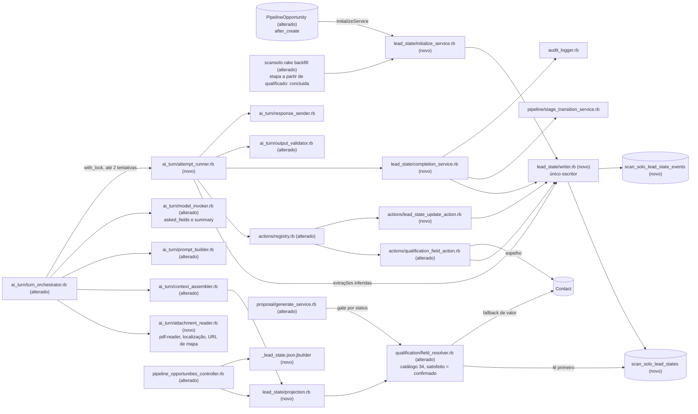

# Implementation Plan

## Request Summary
- Objective: criar o estado estruturado do lead por `PipelineOpportunity` (34 campos do catálogo RF-02 com valor, status `confirmado|inferido|faltante`, classificação derivada e histórico append-only; intenção, próxima ação, ações autorizadas e marco de qualificação concluída). O plano estende o `ScanSolo::Qualification::FieldResolver` para "satisfeito ⇔ confirmado" e reordena o turno de IA em tentativas transacionais (ações → conclusão → validador sobre o estado novo → rollback → 1 regeneração). Também torna anexos, localização, PDFs e links visíveis ao modelo e grava extrações como `inferido`, e expõe `lead_state` em `GET/PATCH /pipeline_opportunities/:id` e `POST .../stage_transitions`.
- Scope in: RF-01..RF-26 (inclui RF-01a, RF-11a, RF-18a), RNF-01..RNF-09, CT-01 (aditivo), CT-02, CT-03, CT-04 (conteúdo), gem `pdf-reader`, backfill aditivo (etapa ≥ `qualificado` → `concluida`).
- SPEC: v1.2 (delta da "Round 2" de `.handoff/clarifier-answers.md`: RF-01a, gate de proposta do RF-08, fail-closed do RF-15, RNF-09). Este plano foi atualizado em T05, T06, T08, T18, T19, T20 e T21; as demais tasks não mudaram.
- Scope out: slices 2–4 (e-mail de proposta, Make ponta a ponta, UI/Kanban, cadência); CT-05 (payload Make) inalterado; `GET /pipeline_opportunities` (index) inalterado; novas etapas do pipeline; OCR; busca HTTP de links; execução das próximas ações; variação de linguagem (§3.7) e §40.
- Tier: complete
- Architecture references: `AGENTS.md` (= `CLAUDE.md`), `docs/agents/architecture.md`, `docs/agents/domain_rules.md`, `docs/agents/data_model.md`, `docs/agents/coding_guidelines.md`; contratos base `.spec/features/scansolo-chatwoot-platform/openapi.yaml` (v1.1.0) e `.spec/features/scansolo-production-complete/openapi.yaml` (v1.2.0); feature estendida `.spec/features/scansolo-agent-qualification-continuity/` (resolvedor e 6 consumidores).

### Regras de arquitetura preservadas (valem para todas as tasks)
- `docs/agents/architecture.md` "Layer responsibilities": Services são donos de "all rules, transactions, locks, audit writes". Por isso toda regra do estado do lead mora em `app/services/scan_solo/lead_state/` (writer, inicialização, projeção, conclusão) e em `app/services/scan_solo/ai_turn/` (leitor de anexos, tentativa). O controller só pré-carrega, chama a projeção e renderiza (gate 404 e Pundit inalterados), e o jbuilder só define o formato.
- `docs/agents/architecture.md` "Actions … Sole path from model output to side effect": intenção, próxima ação, autorização e campos vindos do modelo só são gravados pelas ações registradas `qualification_field` (alterada) e `lead_state_update` (nova), via `ScanSolo::Actions::Registry` → `Executor`. `opportunity_id`/`conversation_id` continuam injetados pelo turno (`TURN_SCOPED_PARAMS`). As extrações de anexo não são saída do modelo: são gravadas pelo serviço do turno.
- `docs/agents/domain_rules.md` "Action registry", regra de extensão: a nova ação ganha `CLASSIFICATION` + `SCHEMA` fechado e entra em `Registry::HANDLERS`, `InputGuardrail::ALL_ACTIONS` e `PromptBuilder::ACTION_DESCRIPTIONS`. Continua valendo o tudo-ou-nada: exceção de ação → rollback de todas as ações e 0 mensagens.
- `docs/agents/domain_rules.md` "Pipeline stages" e `docs/agents/architecture.md` "Models": `ScanSolo::Pipeline::StageTransitionService` é o único escritor de etapa. A conclusão (RF-21) chama o serviço, e a IA só avança para `em_qualificacao`/`qualificado`.
- `docs/agents/domain_rules.md` "Qualification field resolution" e `docs/agents/coding_guidelines.md` §5 (single writer per state): `FieldResolver` continua o único leitor de "campo satisfeito?", com 6 consumidores, e ninguém mais decide satisfação. `ScanSolo::LeadState::Writer` é o único escritor das linhas `scan_solo_lead_states`/`scan_solo_lead_state_events`, com header comment "sole writer".
- `docs/agents/data_model.md`: extensão por tabela 1:1 `scan_solo_*`, sem colunas novas em tabelas do Chatwoot. Os eventos seguem o padrão append-only de `PipelineStageEvent` (`created_at` só, `readonly?` quando persistido).
- `docs/agents/architecture.md` Listener: o listener "delegates every write to services and holds no AI logic", por isso a leitura de anexos/PDF não entra no listener, e sim no `TurnOrchestrator`.
- `docs/agents/coding_guidelines.md` §1 (classe compacta `class ScanSolo::…`), §2 (uma classe por arquivo), §3 (≤150 colunas), §4 (`def self.call(**) = new(**).call`), §6 (header comment com RF/CT/RNF), §7 (Result Struct `keyword_init`), §8 (erros por handlers existentes: `ActiveRecord::RecordInvalid` → 422), §9 (idempotency key/correlation id).
- `AGENTS.md` "General Guidelines": regra no ponto de entrada compartilhado mais cedo (o estado nasce no `after_create` da oportunidade), sem guardas duplicadas nem fallbacks especulativos, falha alta em estado impossível (`opportunity.lead_state` ausente levanta), specs com `let` e setup direto. `docs/agents/architecture.md`: `enterprise/` "not used by ScanSolo" → 0 referências a `enterprise/`/`Captain::` (RNF-03).
- Validação: specs Ruby e rubocop rodam no container `scansolo-phase2-test` (bundle do host quebrado), com `docker exec scansolo-phase2-test sh -c 'cd /app && bundle exec rspec <paths>'` (rubocop idem). Após T01/T03, rodar `docker exec scansolo-phase2-test sh -c 'cd /app && bundle install && RAILS_ENV=test bundle exec rails db:migrate'`. O gate de regressão é `./scripts/ralph-test.sh` (compose `rails`).

## AS IS — Componentes impactados

Todos os nós foram verificados em `app/`. Hoje o resolvedor lê só o `Contact`, o validador roda antes do lock e das ações, a resposta é validada sobre o estado anterior à mensagem, os anexos chegam como `[mensagem sem texto]` e não há histórico, intenção nem marco de conclusão.

## TO BE — Componentes propostos

Tabelas e modelos novos: T01. Catálogo e aliases: T02. Gem: T03. `model_invoker.rb`/mock: T04. `writer.rb`: T05. Resolvedor estendido e predicado do gate de proposta usado por `generate_service.rb`: T06. `attachment_reader.rb`: T07. `initialize_service.rb`, callback e backfill (com `concluida` para etapas ≥ `qualificado`, RF-01a): T08. `projection.rb`: T09. `lead_state_update_action.rb` com registry e guardrail: T10. `qualification_field_action.rb`: T11. `completion_service.rb`: T12. `context_assembler.rb`: T13. `output_validator.rb`: T15. Controller e jbuilder: T17. `prompt_builder.rb`: T14 (e T10 para `ACTION_DESCRIPTIONS`). `turn_orchestrator.rb` e `attempt_runner.rb`: T16. As specs de consumidores e de integração ficam em T18/T19.

## Tasks

### T01 — Tabelas e modelos do estado do lead
- **Files**: `db/migrate/20260929000001_create_scan_solo_lead_states.rb` (novo), `db/migrate/20260929000002_create_scan_solo_lead_state_events.rb` (novo), `db/schema.rb`, `app/models/scan_solo/lead_state.rb` (novo), `app/models/scan_solo/lead_state_event.rb` (novo), `app/models/scan_solo/pipeline_opportunity.rb` (só associação), `spec/models/scan_solo/lead_state_spec.rb` (novo), `spec/models/scan_solo/lead_state_event_spec.rb` (novo)
- **Change**: as migrações são só aditivas (`create_table`). `scan_solo_lead_states` tem: `opportunity_id` (FK, índice único), `intent` string null, `qualification_status` integer default 0 (enum `em_andamento 0, concluida 1`), `qualification_completed_at`, `next_action` string null, `next_action_recorded_at`, `next_action_source_message_id` bigint null, `authorized_actions` jsonb default `[]`, `fields` jsonb default `{}` (chave canônica → `{value, status, updated_at, source_message_id, source_attachment_id}`) e timestamps. `scan_solo_lead_state_events` tem: `lead_state_id` (FK, índice), `subject` string (`field|intent|next_action`), `key` string null, `previous_value`, `previous_status`, `new_value`, `new_status`, `source_message_id`, `source_attachment_id` e `created_at` só.
  - Model `ScanSolo::LeadState`: constantes congeladas `INTENTS` (10 valores RF-14), `NEXT_ACTIONS` (5 valores RF-23), `FIELD_STATUSES` (`confirmado inferido faltante`) e `DEFAULT_NEXT_ACTION_BY_INTENT` (tabela RF-15, chave `nil` → `aguardar_cliente`). Tem `belongs_to :opportunity`, `has_many :events` (`dependent: :destroy`) e valida `opportunity_id` único, `intent` ∈ INTENTS (allow_nil) e `next_action` ∈ NEXT_ACTIONS (allow_nil).
  - Model `ScanSolo::LeadStateEvent`: `readonly?` → `persisted?` (padrão `PipelineStageEvent`) e `subject` ∈ 3 valores.
  - `PipelineOpportunity`: `has_one :lead_state, class_name: 'ScanSolo::LeadState', foreign_key: :opportunity_id, inverse_of: :opportunity, dependent: :destroy`.
- **Covers**: RF-01 (persistência), RF-06, RF-14, RF-21, RF-23, RF-24, RNF-01, RNF-06
- **Tests**: `spec/models/scan_solo/lead_state_spec.rb`: unicidade por oportunidade, enum de qualificação, `intent`/`next_action` fora da lista inválidos, tabela `DEFAULT_NEXT_ACTION_BY_INTENT` com 11 entradas. `spec/models/scan_solo/lead_state_event_spec.rb`: evento persistido não atualiza nem remove (`ActiveRecord::ReadOnlyRecord`).
- **Risk**: Medium — migração em produção. É aditiva, mas exige deploy com `db:migrate`.
- **Dependencies**: none

### T02 — Catálogo fechado RF-02 no `FieldResolver`
- **Files**: `app/services/scan_solo/qualification/field_resolver.rb`, `spec/services/scan_solo/qualification/field_resolver_spec.rb`
- **Change**:
  - Constante congelada `CATALOG`: array ordenado de 34 `{key:, block:, label:}` na ordem da tabela RF-02, com blocos `identificacao servico local escopo execucao comercial`, mais `CATALOG_KEYS` e `BLOCKS`.
  - `ALIASES`: acrescentar ao final as novas chaves com o rótulo RF-02 como alias (a ordem existente, que é a precedência RF-21, não muda). Cada rótulo novo de chave existente entra como alias dela: "Contato" → `nome`, "Empresa / razão social" → `empresa`, "E-mail principal" → `email`, "Objetivo" → `tipo_intervencao`, "Endereço" (já existe), "Link" → `link_local`, "Profundidade de investigação" → `profundidade`, "Prazo" (já existe), "Integração" → `integracao_seguranca`.
  - `MAKE_KEYS` e `NATIVE` inalterados. Header comment cita RF-02.
- **Covers**: RF-02
- **Tests**: `field_resolver_spec.rb`, spec de tabela: cada rótulo RF-02 → sua chave; `"Prazo para proposta"` ≠ `prazo_desejado`; `"E-mail para envio"` ≠ `email`; `"Objetivo do serviço"` → `tipo_intervencao`. Nenhuma grafia normalizada mapeia para 2 chaves (varrer `ALIASES` e verificar a unicidade antes do `to_h`). `CATALOG.size == 34`. Exemplos existentes verdes.
- **Risk**: Low — adição de constantes. Colisão de alias coberta por spec.
- **Dependencies**: none

### T03 — Dependência `pdf-reader`
- **Files**: `Gemfile`, `Gemfile.lock`
- **Change**: adicionar `gem 'pdf-reader'` (Ruby puro) ao grupo default e rodar `bundle install` no container (`docker exec scansolo-phase2-test sh -c 'cd /app && bundle install'`, volume `ss-aiagentsystem_bundle` compartilhado). Nenhuma outra gem.
- **Covers**: RF-19 (dependência), Dependências da SPEC
- **Tests**: `docker exec scansolo-phase2-test sh -c 'cd /app && bundle exec ruby -e "require %q(pdf-reader); puts PDF::Reader::VERSION"'` imprime versão.
- **Risk**: Low — gem pura; imagem de produção precisa do `bundle install` no build.
- **Dependencies**: none

### T04 — Saída do modelo exige `asked_fields` e `summary` (CT-02)
- **Files**: `app/services/scan_solo/ai_turn/model_invoker.rb`, `app/services/scan_solo/test_mode/mock_llm_provider.rb`, `spec/services/scan_solo/ai_turn/model_invoker_spec.rb`, `spec/services/scan_solo/test_mode/mock_llm_provider_spec.rb`
- **Change**:
  - `ModelInvoker#build_result`: `InvalidOutputError` quando `asked_fields` não é `Array` de `String` ou `summary` não é `true/false` (mensagem `{reply, actions, asked_fields, summary}`). `Result` ganha `asked_fields` e `summary`.
  - `MockLlmProvider.call` ganha `fixture_asked_fields: []` e `fixture_summary: false` e devolve `content` com as 4 chaves, para que os specs existentes que usam o mock continuem válidos.
  - O schema enviado ao modelo muda em T14 (PromptBuilder).
- **Covers**: RF-10, CT-02
- **Tests**: `model_invoker_spec.rb`: saída sem `asked_fields`, sem `summary` ou com `summary: "sim"` → `InvalidOutputError`; saída completa → `Result#asked_fields`/`summary`. `mock_llm_provider_spec.rb`: defaults `[]`/`false` e fixtures repassadas.
- **Risk**: Medium — toda saída real do modelo passa a precisar dos campos; mitigado porque T14 envia o schema com `required` antes do deploy.
- **Dependencies**: none

### T05 — `ScanSolo::LeadState::Writer` (único escritor)
- **Files**: `app/services/scan_solo/lead_state/writer.rb` (novo), `spec/services/scan_solo/lead_state/writer_spec.rb` (novo)
- **Change**: é o único escritor de `LeadState`/`LeadStateEvent` (header "sole writer"; RF-06, RF-07, RNF-06). É instanciado com `lead_state:`, faz `lead_state.lock!` e 1 `save!` por operação, e roda dentro da transação do chamador.
  - `apply_field!(key:, value:, status:, source_message_id:, source_attachment_id: nil)`, com `key` ∈ `FieldResolver::CATALOG_KEYS` (senão `ArgumentError`), `status` ∈ `confirmado|inferido` e valor `strip`; valor em branco → `:ignored`. Regras em ordem:
    1. vigente `confirmado` e novo `inferido` → `:kept_confirmed` (RF-07);
    2. mesmo valor e mesmo status → `:unchanged`;
    3. senão, grava valor, status, origem e `updated_at`, cria 1 evento `subject: field` com `previous_value/previous_status` (faltante → `previous_status: 'faltante'`), `new_*` e a origem, e retorna `:applied`.
  - `set_intent!(intent:, source_message_id:)`: igual → no-op; senão, 1 evento `intent`.
  - `record_next_action!(value:, source_message_id:)`: grava `next_action`, `recorded_at` e a origem, com 1 evento `next_action`. `source_message_id` nulo só vem do backfill (RF-01a, T08).
  - `authorize_action!(action:, source_message_id:)`: acrescenta `{action, source_message_id, recorded_at}` se ainda não estiver presente, sem evento (CT-01 não tem subject para autorização).
  - `complete!(at:)`: `concluida` + `completed_at`, e levanta `ActiveRecord::RecordInvalid` se já concluída.
  - `self.applicable?(current_status:, new_status:)`: regra pura RF-07, reutilizada pela projeção (T09).
  - Eventos só por `create!`, sem `update`/`destroy`.
- **Covers**: RF-06, RF-07, RF-14, RF-21 (marco), RF-23, RF-24, RNF-06
- **Tests**: `writer_spec.rb` — exemplo da integração (`tempo_integracao` "uma diária" confirmado → "30 minutos no mesmo dia": vigente novo confirmado, evento com previous "uma diária" e o evento anterior mantendo a origem original); inferido sobre confirmado "Rio/RJ" → inalterado; inferido sobre faltante → gravado; inferido→confirmado com mesmo valor → 1 evento de status; intenção `orcamento`→`convite_cotacao` → 2 eventos; autorização repetida → 1 entrada; `complete!` duas vezes → levanta; `record_next_action!(value: 'aguardar_cliente', source_message_id: nil)` → gravado com origem nula e 1 evento; cada mudança → exatamente 1 evento.
- **Risk**: Medium — núcleo da integridade do histórico; coberto por spec tabela-driven.
- **Dependencies**: T01, T02

### T06 — `FieldResolver` lê o estado do lead (satisfeito ⇔ confirmado)
- **Files**: `app/services/scan_solo/qualification/field_resolver.rb`, `spec/services/scan_solo/qualification/field_resolver_spec.rb`, `app/services/scan_solo/ai_turn/context_assembler.rb`, `app/services/scan_solo/actions/qualification_field_action.rb`, `app/services/scan_solo/cadence/reply_completeness_detector.rb`, `app/services/scan_solo/proposal/generate_service.rb`, `app/services/scan_solo/proposal/make_provider.rb`, `app/services/scan_solo/handoff/handoff_service.rb` (só as linhas de chamada)
- **Change**:
  - Assinatura `self.call(opportunity:, config:)`: o contato vem de `opportunity.contact`, e `opportunity.lead_state` é obrigatório (sem guarda; ausência levanta).
  - `Field` ganha `status` e `classification`. `satisfied` = status `confirmado` no estado para a chave canônica do rótulo. Rótulo fora do catálogo → nunca satisfeito (status `faltante`; ver Open Questions Q2).
  - Precedência de valor RF-08: valor do estado (se não `faltante`) → nativo → `custom_attributes` (precedência RF-21 existente).
  - Novo `self.contact_value(contact:, canonical_key:)` público, com a leitura nativa/custom atual, usado por T08 para semear.
  - `make_qualification` continua baseado em valor presente (CT-05 inalterado) com a nova precedência.
  - `required_canonical_keys` inalterado.
  - Novo `proposal_gate_missing_labels` (gate de proposta, RF-08 v1.2): com `lead_state.concluida?` → rótulos obrigatórios com status `faltante` (rótulo fora do catálogo conta como `faltante`, fail-closed RF-15); com `em_andamento` → `missing_labels` (qualquer obrigatório não `confirmado`). Não muda `satisfied`/`missing_labels`: `inferido` continua não satisfeito (RF-03, RF-04).
  - `GenerateService#missing_required_fields` passa a usar `proposal_gate_missing_labels` (as demais verificações do gate não mudam).
  - Os 6 call sites passam a `FieldResolver.call(opportunity: …, config: …)`. `HandoffService` resolve `ScanSolo::PipelineOpportunity.find_by(conversation_id: conversation.id)`; sem oportunidade → `nenhum`. As mudanças semânticas e specs dos consumidores ficam em T11/T13/T18.
  - Header comment atualizado (continua "only reader of satisfied").
- **Covers**: RF-04, RF-08 (inclui gate de proposta v1.2), RF-15 (fail-closed), RNF-02
- **Tests**: `field_resolver_spec.rb`: `name` nativo + `nome` inferido → "Nome" não satisfeito, valor "Milena (WhatsApp)"; `nome` confirmado "Milena Souza" no estado com `contact.name` diferente → valor "Milena Souza" e satisfeito; rótulo sem catálogo (`budget`) → insatisfeito; determinismo (2 chamadas iguais, LLM/HTTP stubados para levantar). Gate (config exige `Área`): `concluida` + `area` `inferido` → `proposal_gate_missing_labels == []` e `missing_labels == ['Área']`; `concluida` + `area` `faltante` → `['Área']`; `em_andamento` + `area` `inferido` → `['Área']`; `concluida` + rótulo `budget` → `['budget']`.
- **Risk**: High — muda o gate de proposta, a completude de cadência e a nota de handoff para todas as oportunidades (tudo que vem só do contato deixa de satisfazer). O gate de oportunidades `concluida` (backfill) aceita `inferido`, o que limita o impacto nas oportunidades avançadas.
- **Dependencies**: T01, T02

### T07 — Leitor de anexos, localização, PDF e URL de mapa
- **Files**: `app/services/scan_solo/ai_turn/attachment_reader.rb` (novo), `spec/services/scan_solo/ai_turn/attachment_reader_spec.rb` (novo), `spec/fixtures/files/scansolo/lead_state_company.pdf` (novo), `spec/fixtures/files/scansolo/lead_state_scanned.pdf` (novo), `spec/fixtures/files/scansolo/lead_state_11_pages.pdf` (novo), `spec/fixtures/files/scansolo/lead_state_corrupt.pdf` (novo)
- **Change**: `ScanSolo::AiTurn::AttachmentReader.call(message:)` é pura (sem escrita, sem LLM, sem HTTP; RF-19, RF-18a) e retorna `Result(updates:, evidence:, urls:)`.
  - `updates`: `[{key, value, source_attachment_id}]`, sempre com status `inferido`.
  - Anexo `location`: `link_local` = `external_url` ou `https://www.google.com/maps?q=<lat>,<long>`.
  - Anexo `file` com content type `application/pdf`: `byte_size` ≤ 10 MB antes de baixar, `PDF::Reader` com `page_count` ≤ 10 e texto extraído. Padrões: CNPJ `\d{2}\.?\d{3}\.?\d{3}/?\d{4}-?\d{2}` → `cnpj`; linha após rótulo `raz[aã]o social` → `empresa`; linha após rótulo `endere[cç]o` → `endereco_obra`.
  - URLs do `message.content` (regex `https?://\S+`): host de mapa (`google.*/maps`, `maps.google.*`, `goo.gl/maps`, `maps.app.goo.gl`) → `link_local` sem `source_attachment_id`; as outras só entram em `urls`.
  - `evidence`: por anexo `{attachment_id, file_type, file_name, extracted: true|false, reason}`, com `reason` ∈ `unsupported_type`, `too_large`, `too_many_pages`, `no_extractable_text`, `extraction_error: <classe>` (RF-20). Erros de `PDF::Reader` são capturados.
  - Os fixtures PDF são escritos à mão (PDF 1.4 mínimo, com stream de texto; o escaneado tem página sem texto e o corrompido tem bytes inválidos).
- **Covers**: RF-17, RF-18, RF-18a, RF-19, RF-20, RNF-02
- **Tests**: `attachment_reader_spec.rb`:
  - localização lat -22.9/long -43.2 sem `external_url` → `link_local` com o id do anexo;
  - PDF com "12.345.678/0001-90", razão social e endereço → 3 updates;
  - PDF escaneado → 0 updates e `no_extractable_text`; 11 páginas → `too_many_pages`; corrompido → `extraction_error`;
  - "segue o local https://maps.app.goo.gl/abc" → update sem anexo; `https://exemplo.com.br/edital` → 0 updates e URL em `urls`;
  - `WebMock` sem requisições (`a_request(:any, //)` não feito).
- **Risk**: Medium — parsing de PDF de terceiros. Limites de tamanho e páginas e rescue localizado evitam derrubar o turno.
- **Dependencies**: T02, T03

### T08 — Estado nasce com a oportunidade + backfill aditivo
- **Files**: `app/services/scan_solo/lead_state/initialize_service.rb` (novo), `app/models/scan_solo/pipeline_opportunity.rb`, `lib/tasks/scansolo.rake`, `spec/services/scan_solo/lead_state/initialize_service_spec.rb` (novo), `spec/services/scan_solo/pipeline/opportunity_bootstrap_service_spec.rb`, `spec/lib/tasks/scansolo_rake_spec.rb`
- **Change**:
  - `InitializeService.call(opportunity:)`: `ScanSolo::LeadState.create_or_find_by!(opportunity_id:)`. Só quando insere, semeia os 34 campos: `FieldResolver.contact_value` presente → `inferido` (sem origem de mensagem), senão `faltante` sem valor. Cada campo semeado com valor gera 1 evento via `Writer` (RNF-06). Estado já existente → nada muda.
  - `PipelineOpportunity`: `after_create { ScanSolo::LeadState::InitializeService.call(opportunity: self) }`. É o ponto de criação compartilhado mais cedo (bootstrap, seeds e specs); há precedente de callback em `proposal_version.rb`/`knowledge_source.rb`.
  - `InitializeService.call(opportunity:, backfilled_at: nil)`: o callback não passa `backfilled_at`, então todo estado criado na criação da oportunidade começa `em_andamento`, qualquer que seja a etapa (RF-01).
  - Rake `scansolo:backfill_lead_states`: fixa `backfilled_at = Time.current` uma vez, `PipelineOpportunity.where.missing(:lead_state).find_each` → `InitializeService.call(opportunity:, backfilled_at:)` e imprime o total criado. Não escreve em `contacts` (RNF-01).
  - Regra do backfill (RF-01a), só quando o estado é inserido e `backfilled_at` está presente: se `opportunity.stage` ∈ `BACKFILL_CONCLUDED_STAGES = %w[qualificado proposta_enviada negociacao ganho perdido]` → `Writer#complete!(at: backfilled_at)` + `Writer#record_next_action!(value: LeadState::DEFAULT_NEXT_ACTION_BY_INTENT[nil], source_message_id: nil)` (`aguardar_cliente`, 1 evento `next_action` por RNF-06); senão `em_andamento` sem próxima ação. Os campos seguem a mesma semeadura (`inferido`/`faltante`, nenhum `confirmado`). O backfill não chama `StageTransitionService` nem `CompletionService`, não cria `PipelineStageEvent` e não grava `AuditEvent`.
- **Covers**: RF-01, RF-01a, RNF-01, RNF-06, RNF-08(1)(9)
- **Tests**: `initialize_service_spec.rb`: contato `name = "Milena (WhatsApp)"` → 34 campos, `nome` inferido, 33 faltantes; invariante sem `faltante` com valor e sem `confirmado`/`inferido` sem valor. `opportunity_bootstrap_service_spec.rb`: 2 bootstraps da mesma conversa → 1 estado. `initialize_service_spec.rb`: oportunidade criada em `ganho` (callback, sem `backfilled_at`) → `em_andamento`. `scansolo_rake_spec.rb`: oportunidades sem estado → 100% com 1 estado e 0 campos `confirmado`; `negociacao` com contato `name = "Ana"` → `nome` `inferido`, `concluida`, `completed_at` = instante do backfill, próxima ação `aguardar_cliente` com `source_message_id` nulo, 0 `PipelineStageEvent` e 0 `AuditEvent` novos; `perdido` → `concluida`; `em_qualificacao` → `em_andamento` e próxima ação nula; 2ª execução → 0 criados e `updated_at`/eventos inalterados; `contact.custom_attributes` inalterado.
- **Risk**: High — o backfill transforma todo dado de contato existente em `inferido`. Oportunidades antes de `qualificado` voltam a ter dados confirmados pelo agente (decisão M6); as de etapa ≥ `qualificado` ficam `concluida` e não são requalificadas (RF-01a).
- **Dependencies**: T01, T05, T06

### T09 — Projeção do estado (`lead_state`, elegíveis, bloco Status)
- **Files**: `app/services/scan_solo/lead_state/projection.rb` (novo), `spec/services/scan_solo/lead_state/projection_spec.rb` (novo)
- **Change**: `Projection.call(opportunity:, config:, pending_updates: [])` é pura (RNF-02) e retorna Struct com: `intent`, `qualification {status, completed_at}`, `next_action`, `authorized_actions`, `blocks` (6 blocos na ordem RF-02, cada campo com `key, label, value, status, classification, updated_at, source_message_id, source_attachment_id`), `status {stage, confirmed_fields, missing_fields, next_action, owner_id, last_customer_interaction_at, next_follow_up_at}` e `history` (eventos em ordem de `created_at`, do association carregado, sem query extra).
  - `classification`: `obrigatorio` sse a chave ∈ `FieldResolver#required_canonical_keys`; independe de intenção e etapa (RF-15).
  - `confirmed_fields`/`missing_fields` vêm de `FieldResolver` (RF-08: nenhum outro leitor de satisfação). `missing_fields` = obrigatórias ≠ confirmado.
  - `next_follow_up_at` = `opportunity.cadence_enrollments.active.minimum(:next_attempt_at)`, o mesmo cálculo do jbuilder.
  - `eligible_keys`: só `faltante`, obrigatórias antes de complementares, ordem RF-02; `[]` quando `concluida` (RF-22).
  - `pending_updates` (T07) são sobrepostos em memória com `Writer.applicable?` (RF-17: preenchidos não são elegíveis).
- **Covers**: RF-03, RF-04, RF-09 (lista), RF-15, RF-17, RF-22 (lista), RNF-02
- **Tests**: `projection_spec.rb`: `area` obrigatório + `cnpj`, `empresa` complementares faltantes → elegíveis `area, empresa, cnpj`; obrigatória inferida em `missing_fields` e fora de `confirmed_fields`; mudar `owner_id` muda `status.owner_id` sem escrita no estado; `concluida` → elegíveis `[]`; `pending_updates` com `link_local` → fora dos elegíveis; mudar intenção não altera classificação.
- **Risk**: Low — leitura pura.
- **Dependencies**: T05, T06

### T10 — Ação registrada `lead_state_update` (CT-03)
- **Files**: `app/services/scan_solo/actions/lead_state_update_action.rb` (novo), `app/services/scan_solo/actions/registry.rb`, `app/services/scan_solo/ai_turn/input_guardrail.rb`, `app/services/scan_solo/ai_turn/prompt_builder.rb` (só `ACTION_DESCRIPTIONS`), `spec/services/scan_solo/actions/lead_state_update_action_spec.rb` (novo), `spec/services/scan_solo/actions/registry_spec.rb`, `spec/services/scan_solo/ai_turn/input_guardrail_spec.rb`
- **Change**:
  - `CLASSIFICATION = :automatic`. `SCHEMA` fechado: `opportunity_id` integer (required, turn-scoped), `intent` enum `LeadState::INTENTS`, `next_action` enum `NEXT_ACTIONS`, `authorized_action` enum `NEXT_ACTIONS`, `interpretation_risk` boolean; `additionalProperties: false`.
  - `call(params:, actor:, turn:)` usa `Writer` com `source_message_id = turn.message_id` para `set_intent!`, `record_next_action!` e `authorize_action!`. `interpretation_risk` só volta no resultado (evidência; RF-25 é só prompt). Nenhum efeito colateral de proposta, handoff ou e-mail, e `ai_control_state` inalterado (RF-23).
  - Retorno `{opportunity_id, intent, next_action, authorized_action, interpretation_risk}` com o que foi aplicado.
  - Registrar em `Registry::HANDLERS` e `InputGuardrail::ALL_ACTIONS` (fora de `CONFIRMATION_ONLY_ACTIONS`), mais `ACTION_DESCRIPTIONS['lead_state_update']` ("registrar a intenção do cliente, a próxima ação, uma ação que o cliente pediu ou autorizou e se há risco de interpretação").
- **Covers**: RF-14, RF-23, RF-24, RF-25 (sinal), CT-03
- **Tests**: `lead_state_update_action_spec.rb` via `Registry.call`: `intent: "orcamento"` e depois `"convite_cotacao"` → 2 eventos; `intent: "xyz"` → `InvalidParamsError`; `next_action: "proposta"` → registrado com origem; `authorized_action: "proposta"` → em `authorized_actions`; `next_action: "atendimento_humano"` → `ai_control_state` inalterado; parâmetro extra → `InvalidParamsError`. `registry_spec`/`input_guardrail_spec`: nova ação registrada e ofertada.
- **Risk**: Low — ação nova sem efeito externo.
- **Dependencies**: T05

### T11 — `QualificationFieldAction` grava no estado com status, histórico e espelho
- **Files**: `app/services/scan_solo/actions/qualification_field_action.rb`, `spec/services/scan_solo/actions/qualification_field_action_spec.rb`
- **Change**:
  - `SCHEMA.fields` = `{type: object, additionalProperties: {oneOf: [{type: string}, {type: object, properties: {value: {type: string}, status: {enum: [confirmado, inferido]}}, required: [value, status], additionalProperties: false}]}}`; o schema da ação continua fechado. String → `confirmado`.
  - Cada chave → `canonical_key`. Chave ∈ catálogo → `Writer#apply_field!` com `source_message_id = turn.message_id`. Aplicado → espelho no `Contact` como hoje: nativo só se em branco e válido, senão `native_already_present`/erro; não nativo → merge em `custom_attributes[canonical]`. `:kept_confirmed` → `not_applied_fields` `{reason: 'confirmed_value_kept'}`, sem espelho.
  - Rótulo obrigatório fora do catálogo → só espelho em `custom_attributes`, como hoje. Outras chaves → `unrecognized_fields`.
  - Mantém 1 `contact.save!` e a transição `em_contato → em_qualificacao` (chave obrigatória aceita). Remove o ramo `qualificado`, que passa a ser de `CompletionService` (T12).
  - Retorno ganha `state_changes: [{key, outcome}]`. Header atualizado.
- **Covers**: RF-06, RF-07, RF-08 (espelho), CT-03
- **Tests**: `qualification_field_action_spec.rb`:
  - `{area: "800 m²"}` → `area` confirmado no estado e `custom_attributes["area"]`;
  - `name="Milena (WhatsApp)"` + `{nome: "Milena Souza"}` → estado "Milena Souza" confirmado e `contact.name` inalterado;
  - `{cidade_uf: {value: "RJ", status: "inferido"}}` sobre confirmado → inalterado com `confirmed_value_kept`;
  - `{x: {value: 1}}` → `InvalidParamsError`;
  - `em_contato` + chave obrigatória → `em_qualificacao`; nunca `qualificado` pela ação;
  - exemplos existentes ajustados à nova semântica.
- **Risk**: High — caminho principal de captura de dados. Muda a transição de `qualificado` de lugar.
- **Dependencies**: T05, T06

### T12 — `CompletionService` (conclusão única, RF-21)
- **Files**: `app/services/scan_solo/lead_state/completion_service.rb` (novo), `spec/services/scan_solo/lead_state/completion_service_spec.rb` (novo)
- **Change**: `call(opportunity:, turn:)`:
  - retorna se `lead_state.concluida?` (nunca reabre, M1-d) ou se `FieldResolver` não tem campos ou tem faltantes (guarda existente "lista vazia nunca conclui");
  - senão: (1) `Writer#complete!(at: Time.current)`; (2) etapa via `StageTransitionService` (`novo_lead`/`em_contato` → `em_qualificacao` → `qualificado`, com 1 `PipelineStageEvent` cada; `em_qualificacao` → `qualificado`; já em `qualificado` ou além → sem transição); (3) se `next_action_source_message_id != turn.message_id` → `Writer#record_next_action!(value: DEFAULT_NEXT_ACTION_BY_INTENT[intent], source_message_id: turn.message_id)`; (4) `ScanSolo::AuditLogger.record!(subject: lead_state, event_type: 'lead_state.qualification_completed', correlation_id: turn.correlation_id, payload: {opportunity_id, next_action, stage})`.
- **Covers**: RF-21, RF-23, RF-04
- **Tests**: `completion_service_spec.rb`:
  - `em_qualificacao` com o último obrigatório confirmado → `concluida`, `qualificado`, 1 evento de etapa, próxima ação e 1 `AuditEvent`;
  - 2ª chamada → nada;
  - `em_contato` → 2 eventos;
  - intenção `visita` sem next_action do turno → `avaliacao_tecnica`; intenção nula → `aguardar_cliente`; next_action do turno `proposta` preservada;
  - `cnpj` obrigatório inferido → não conclui;
  - `proposta_enviada` → sem transição;
  - concluída + config exige campo faltante → continua `concluida`.
- **Risk**: Medium — move etapas automaticamente; sempre via o serviço único.
- **Dependencies**: T05, T06

### T13 — `ContextAssembler`: estado do lead e histórico com anexos
- **Files**: `app/services/scan_solo/ai_turn/context_assembler.rb`, `spec/services/scan_solo/ai_turn/context_assembler_spec.rb`
- **Change**:
  - `self.call(message:, config:, attachment_reading:, retrieval_service:, memory_provider:)`.
  - Nova chave `lead_state_context` = `Projection.call(opportunity:, config:, pending_updates: attachment_reading.updates).to_h` + `summary_allowed` (ver T14 e Q4: há `PipelineStageEvent`, `qualification_completed_at` ou `next_action_recorded_at` posterior à última mensagem outgoing com `scansolo_origin = 'ai'`) + `attachment_extraction: attachment_reading.evidence`. Sem oportunidade → `NOT_APPLICABLE`.
  - `conversation_history` com `includes(:attachments)` (sem N+1): cada entrada ganha `attachments: [{id, type (location|pdf|image|…), file_name, lat, long, link, extracted}]` e `urls`. `extracted` vem da evidência do reader para a mensagem atual; nas anteriores, é true sse algum campo/evento do estado tem `source_attachment_id` = id.
  - `pipeline_context` continua via resolvedor, que agora usa o estado.
- **Covers**: RF-09 (dados), RF-16 (dados), RF-17, RF-20 (evidência no snapshot), RF-25 (indicador)
- **Tests**: `context_assembler_spec.rb`: mensagem só com localização → entrada com tipo e coordenadas; só com PDF → tipo e nome; `lead_state_context` presente com elegíveis; `summary_allowed` false sem eventos e true com `PipelineStageEvent` após a última resposta de IA; número de queries constante com 1 e 5 anexos.
- **Risk**: Medium — o snapshot cresce (jsonb) em cada turno.
- **Dependencies**: T07, T09

### T14 — `PromptBuilder`: estado, regras fixas, roteiro, resumo, histórico com anexos, schema, correção
- **Files**: `app/services/scan_solo/ai_turn/prompt_builder.rb`, `spec/services/scan_solo/ai_turn/prompt_builder_spec.rb`
- **Change**:
  - `CONTINUITY_RULES`:
    - regra 2 → "Responda primeiro à pergunta/intenção atual do cliente; só depois pergunte no máximo 2 campos, apenas entre os campos elegíveis (faltantes)." (RF-09);
    - novas regras fixas, antes de `## Regras do agente`: "Se a mensagem do cliente contiver uma pergunta direta, responda-a antes de qualquer pergunta de qualificação." (RF-13), "Não peça nova confirmação para ação já pedida ou autorizada." (RF-24) e "Liste em asked_fields as chaves dos campos que a resposta pergunta.";
    - nenhuma regra com "no máximo um campo".
  - Nova seção `## Estado do lead` (de `context[:lead_state_context]`): etapa; status da qualificação; intenção; exatamente 1 linha `Roteiro da intenção:` (constante `INTENT_SCRIPTS`, 10 intenções + nula, em pt-BR); próxima ação; ações autorizadas (ou "nenhuma"); campos confirmados `rótulo: valor`; inferidos `rótulo: valor (inferido)`; obrigatórios não confirmados; `Próximos campos elegíveis: chave (rótulo)` em ordem, ou "nenhum" com a linha "Qualificação concluída: não faça perguntas de qualificação." quando `concluida` (RF-22).
  - Seção `## Resumo dos dados`: "resumo permitido" se `summary_allowed`, senão "resumo não permitido", seguido da exceção fixa "exceto se esta resposta concluir a qualificação, registrar next_action, pedir human_handoff, mudar a etapa ou declarar interpretation_risk" (Q4).
  - `chat_messages`: `content` + descrição dos anexos ("[Anexo localização: lat …, long …, link …]", "[Anexo PDF: <nome>, extração: sim/não]") + "[Links: …]". `'[mensagem sem texto]'` só para mensagem sem texto e sem anexo.
  - `output_schema`: `asked_fields: {type: array, items: {type: string}}` e `summary: {type: boolean}` em `properties` e `required`. O texto de `Formato da resposta` cita os 4 campos.
  - `self.call(..., previous_violation: nil)`: quando presente, acrescenta a seção `## Correção obrigatória` com o nome da violação e a instrução de não repetir (RF-11a).
- **Covers**: RF-09, RF-13, RF-15 (roteiro), RF-16, RF-22 (prompt), RF-24 (prompt), RF-25, RF-10 (schema), RF-11a (payload), CT-02
- **Tests**: `prompt_builder_spec.rb`:
  - confirmados, inferidos rotulados e elegíveis sem confirmado/inferido; regra 2 com "no máximo 2" e nenhuma com "no máximo um campo";
  - regra RF-13 com índice < `## Regras do agente`;
  - 1 linha de roteiro, que troca entre `orcamento` e `envio_documentos`;
  - `concluida` → elegíveis "nenhum";
  - "resumo não permitido"/"resumo permitido";
  - `proposta` listada como autorizada + regra;
  - localização/PDF no histórico, nunca `[mensagem sem texto]`;
  - schema `required` com 4 chaves; `previous_violation: 'confirmed_field_question'` presente no system.
- **Risk**: Medium — muda o comportamento do modelo em produção (desejado); texto fixo coberto por spec.
- **Dependencies**: T10, T13

### T15 — `OutputValidator`: violações sobre o estado do lead
- **Files**: `app/services/scan_solo/ai_turn/output_validator.rb`, `spec/services/scan_solo/ai_turn/output_validator_spec.rb`
- **Change**:
  - `call(content:, validated_claims: {}, restricted_information: [], asked_fields: [], lead_state: nil)`, onde `lead_state` é a projeção T09. As checagens de estado só rodam com `lead_state`, porque os chamadores existentes do validador sem estado continuam.
  - Ordem de avaliação: existentes (`restricted_information`, `price`, `proposal_sent`, `delivery_status`) → `qualification_closed` (`concluida` e `asked_fields` não vazio) → `question_limit` (> 2) → `confirmed_field_question` → `field_not_missing` (fora do catálogo ou status ≠ `faltante`, confirmado já tratado).
  - `confirmed_field_question`: (a) chave confirmada em `asked_fields`; ou (b) detecção lexical, que divide `content` em frases terminadas em "?", remove a pontuação, aplica `FieldResolver.normalize` e procura, como sequência de tokens (`"_#{frase}_".include?("_#{grafia}_")`), cada grafia normalizada (rótulo do catálogo + `SPELLINGS`) de campo confirmado com ≥ 2 tokens.
  - Constante `REGENERABLE_VIOLATIONS = %i[confirmed_field_question question_limit field_not_missing qualification_closed]`.
  - Pura, sem LLM e sem HTTP (RNF-02).
- **Covers**: RF-11, RF-12, RF-17, RF-22, RF-24 (sem violação), RF-25 (sem violação), RNF-02
- **Tests**: `output_validator_spec.rb`:
  - `data_desejada` confirmado + "Qual a data desejada?" com `[]` → `confirmed_field_question`; `area` confirmado + "Qual a área aproximada?" → aceita; `["area"]` → rejeitada; "Para 800 m² indicamos o GPR." → aceita;
  - 3 faltantes → `question_limit`; 2 → aceita; 1 inferido → `field_not_missing`; `"cor_favorita"` → `field_not_missing`; `["link_local"]` após localização → `field_not_missing`;
  - `concluida` + `["bairro"]` → `qualification_closed`; `[]` → aceita;
  - `summary: true` e pedido de confirmação de ação autorizada → aceitos;
  - exemplos existentes verdes.
- **Risk**: Medium — falso positivo lexical bloquearia respostas válidas; mitigado pelo corte ≥ 2 tokens (M5) e 1 regeneração.
- **Dependencies**: T02, T09

### T16 — Turno em tentativas transacionais com regeneração (RF-05, RF-11a)
- **Files**: `app/services/scan_solo/ai_turn/turn_orchestrator.rb`, `app/services/scan_solo/ai_turn/attempt_runner.rb` (novo), `spec/services/scan_solo/ai_turn/turn_orchestrator_spec.rb`, `spec/services/scan_solo/ai_turn/turn_orchestrator_actions_spec.rb`, `spec/services/scan_solo/ai_turn/attempt_runner_spec.rb` (novo)
- **Change**:
  - Orchestrator:
    - `AttachmentReader.call(message:)` antes do `ContextAssembler` (passa `attachment_reading:`), e o snapshot persiste a evidência de extração (RF-20) mesmo em turno `failed`/`suppressed`.
    - Remove o `OutputValidator` pré-lock.
    - Loop de no máximo 2 tentativas: `PromptBuilder` (2ª com `previous_violation:`) → `ModelInvoker` (falha → `fail!`) → `send_response`, que dentro de `extension.with_lock` faz recheck (motivo → rollback e `suppress!`) e chama `AttemptRunner`.
  - `AttemptRunner.call(turn:, message:, config:, result:, opportunity:, pending_updates:)` roda em `ActiveRecord::Base.transaction(requires_new: true)`:
    1. `Writer#apply_field!` de cada `pending_update` (`inferido`, origem mensagem e anexo);
    2. `execute_actions` (movido do orchestrator, mesma idempotency key e `action_params`);
    3. `CompletionService.call(opportunity:, turn:)`;
    4. `Projection` sobre o estado recarregado;
    5. `OutputValidator.call(content:, restricted_information:, asked_fields: result.asked_fields, lead_state:)`; bloqueado → `raise ActiveRecord::Rollback` e retorna `Result(blocked, violation)`;
    6. aprovado → `ResponseSender` → `Result(sent)`.
  - Orchestrator depois do bloco:
    - violação em `REGENERABLE_VIOLATIONS` na 1ª tentativa → grava `context_snapshot['output_regeneration'] = {first_attempt_violation}` (fora da transação) e regenera;
    - 2ª bloqueada ou violação não regenerável → `fail!("output validation blocked: <violação>")`.
  - Exceção de ação continua levando a rollback + `failed` (tudo-ou-nada). Headers atualizados.
- **Covers**: RF-05, RF-11a, RF-17, RF-18, RF-18a, RF-19, RF-20, RF-21 (mesmo turno), CT-04
- **Tests**:
  - `attempt_runner_spec.rb`: bloqueio → 0 mudanças no estado (inclui campos de PDF), 0 `AgentActionExecution`, 0 mensagens; aprovado → evento de histórico com `created_at` ≤ resposta.
  - `turn_orchestrator_spec.rb`: 1ª `confirmed_field_question` e 2ª ok → 2 chamadas, 1 mensagem, `succeeded`, só as ações da 2ª persistidas, violação da 1ª em `context_snapshot`; 2 rejeições → 2 chamadas, 0 mensagens, `failed` com `output validation blocked: <v2>`; `price` → 1 chamada e `failed`; aprovado → 1 chamada; PDF corrompido → `succeeded` e motivo no snapshot; intenção inválida → `failed` e 0 alterações.
  - `turn_orchestrator_actions_spec.rb` ajustado.
- **Risk**: High — reordena o núcleo do turno (lock, transação e envio).
- **Dependencies**: T04, T07, T11, T12, T13, T14, T15

### T17 — API: `lead_state` em show/update/stage_transitions (CT-01)
- **Files**: `app/controllers/api/v1/accounts/scan_solo/pipeline_opportunities_controller.rb`, `app/views/api/v1/accounts/scan_solo/pipeline_opportunities/show.json.jbuilder`, `app/views/api/v1/accounts/scan_solo/pipeline_opportunities/update.json.jbuilder`, `app/views/api/v1/accounts/scan_solo/pipeline_opportunities/_lead_state.json.jbuilder` (novo), `spec/requests/api/v1/accounts/scan_solo/pipeline_opportunities_lead_state_spec.rb` (novo)
- **Change**:
  - Controller: `set_opportunity` com `includes(:contact, :stage_events, lead_state: :events)`. Em `show`, `update` e `stage_transitions` (antes do `render :show`, inclusive no replay idempotente), `@lead_state = ScanSolo::LeadState::Projection.call(opportunity: @opportunity, config: ScanSolo::AiAgentConfig.published_for(Current.account))`. Sem regra nova, com o mesmo `authorize` e o gate 404 do `BaseController`.
  - `show`/`update` jbuilder: partial existente + `json.lead_state { json.partial! '…/lead_state', lead_state: @lead_state }`. `_pipeline_opportunity` e `index` intocados.
  - `_lead_state` só formata a Struct no formato CT-01 (`intent, qualification, next_action, authorized_actions, blocks, status, history`).
- **Covers**: RF-26, RF-03 (exposição), CT-01, RNF-04, RNF-05
- **Tests**: `pipeline_opportunities_lead_state_spec.rb`:
  - `show` retorna `lead_state` com 6 blocos, `status`, `intent`, `qualification`, `next_action`, `authorized_actions` e `history`, e os campos atuais inalterados;
  - `scansolo_enabled = false` → 404; `PATCH owner_id` → `lead_state.status.owner_id` novo;
  - `stage_transitions` inclui `lead_state`; `index` sem `lead_state`;
  - contagem de queries (`sql.active_record`) igual com 1 e 50 eventos;
  - `pipeline_opportunities_spec.rb` existente sem modificação.
- **Risk**: Low — aditivo, só no detalhe.
- **Dependencies**: T09

### T18 — Consumidores sob a nova semântica + consistência (RF-08)
- **Files**: `spec/services/scan_solo/qualification/consumer_consistency_spec.rb`, `spec/services/scan_solo/cadence/reply_completeness_detector_spec.rb`, `spec/services/scan_solo/proposal/generate_service_spec.rb`, `spec/services/scan_solo/proposal/make_provider_spec.rb`, `spec/services/scan_solo/handoff/handoff_service_spec.rb`, `spec/requests/api/v1/accounts/scan_solo/proposals_spec.rb` (só o exemplo `generates a proposal version`, ver Q1), `app/services/scan_solo/cadence/reply_completeness_detector.rb`, `app/services/scan_solo/proposal/generate_service.rb`, `app/services/scan_solo/handoff/handoff_service.rb` (só header comments)
- **Change**:
  - Setup dos specs dos 4 consumidores: os campos que devem satisfazer passam a ser confirmados no estado via `ScanSolo::LeadState::Writer` (dado só no `Contact` = inferido = faltante).
  - `consumer_consistency_spec.rb`: para a mesma oportunidade, os satisfeitos e faltantes de `ContextAssembler`, `QualificationFieldAction` (retorno/efeito), `ReplyCompletenessDetector`, `GenerateService`, `MakeProvider` (chaves ∩ canônicas) e `HandoffService` são idênticos e iguais a `Projection#status` (`confirmed_fields`/`missing_fields`). O assert estático passa a ser: nenhum dos 6 arquivos lê `lead_state.fields`/`.status` diretamente.
  - `generate_service_spec.rb`: ACs do gate (RF-08 v1.2) — config exige `Área`; `concluida` + `area` `inferido` → versão gerada, sem erro de campo, e `Projection#status.missing_fields` contém `area`; `concluida` + `area` `faltante` → bloqueia; `em_andamento` + `area` `inferido` → bloqueia.
  - No `consumer_consistency_spec`, a igualdade de satisfeitos/faltantes usa `satisfied`/`missing_labels` de cada consumidor (inclusive `GenerateService` via resolvedor); o predicado do gate (`proposal_gate_missing_labels`) é afirmado à parte, porque com `concluida` ele difere de `missing_fields` por definição.
  - `proposals_spec.rb`, só o exemplo `generates a proposal version` (exceção declarada a RNF-04, Q1 resolvida): `budget` está fora do catálogo (Q2), então o setup desse exemplo passa a publicar `required_qualification_fields: ['Área']` e confirmar `area` no estado via `Writer`. O exemplo `rejects generation…` e os demais ficam intocados.
  - Headers atualizados ("satisfied = confirmado no estado do lead").
- **Covers**: RF-08 (inclui gate v1.2), RNF-08(3)(9)
- **Tests**: os próprios arquivos; `MakeProvider` com CT-05 inalterado (chaves e present-only).
- **Risk**: Medium — toca uma request spec protegida por RNF-04 (exceção declarada, Q1 resolvida com o padrão planejado).
- **Dependencies**: T06, T08, T11, T12

### T19 — Integração ponta a ponta com `MockLlmProvider`
- **Files**: `spec/integration/scan_solo/lead_state_turn_spec.rb` (novo), `spec/integration/scan_solo/qualification_continuity_spec.rb`
- **Change**: turnos reais via `TurnOrchestrator.call(message:, llm_provider: ->(**kw) { MockLlmProvider.call(**kw, fixture_actions:, fixture_asked_fields:, fixture_summary:) })`, no padrão de `turn_orchestrator_actions_spec.rb`, com asserções em `MockLlmProvider.last_payload` e no estado. Cenários:
  - (a) cliente corrige `tempo_integracao` → o payload seguinte mostra só o valor novo;
  - (b) pergunta técnica do cliente → está no histórico e a regra RF-13 no system;
  - (c) oportunidade concluída → elegíveis "nenhum" e `asked_fields: ["bairro"]` rejeitado;
  - (d) regeneração via provider sequencial (lambda com contador): 1ª pergunta campo confirmado, 2ª ok; o payload da 2ª contém a violação;
  - (e) PDF com CNPJ + 2 rejeições → 0 campos de PDF persistidos;
  - (f) URL de mapa → `link_local` inferido e 0 HTTP (WebMock);
  - (g) conclusão em `em_contato` → 2 eventos de etapa + `AuditEvent`;
  - (h) "pode mandar a proposta" com `lead_state_update authorized_action` → próximo prompt lista `proposta` autorizada;
  - (i) oportunidade em `negociacao` com estado criado pelo backfill (rake de T08) → turno seguinte com elegíveis "nenhum" e `asked_fields: ["nome"]` rejeitado `qualification_closed` nas 2 tentativas (RF-01a + RF-22).
  - `qualification_continuity_spec.rb` (feature anterior) ajustado: nativo sozinho deixa de satisfazer (RF-08).
- **Covers**: RF-01a, RF-05, RF-06, RF-11a, RF-13, RF-18a, RF-19, RF-21, RF-22, RF-24, RNF-08(8)(9)
- **Tests**: o próprio arquivo.
- **Risk**: Low — só spec.
- **Dependencies**: T08, T16, T17

### T20 — Documentação e contrato
- **Files**: `docs/agents/domain_rules.md`, `docs/agents/data_model.md`, `docs/agents/api_contracts.md`
- **Change**:
  - `domain_rules.md`: seções "Qualification field resolution" (satisfeito = confirmado; catálogo 34), "Prompt construction" (≤ 2 perguntas, `asked_fields`/`summary`, histórico com anexos), "Input and output guardrails" (4 violações novas + 1 regeneração), "Action registry" (9 ações, `lead_state_update`), "Qualification writes" (status/histórico; `qualificado` via `CompletionService`) e nova seção "Lead state" (inclui a regra do backfill RF-01a e o gate de proposta por status do RF-08).
  - `data_model.md`: 2 tabelas novas + relação `PipelineOpportunity 1-1 LeadState 1-* LeadStateEvent`.
  - `api_contracts.md:61`: `lead_state` em show/update/stage_transitions (ponteiro para `.spec/features/scansolo-agent-lead-state/openapi.yaml`).
  - Os arquivos estão modificados e não commitados no working tree: editar só as seções citadas, sem reverter mudanças alheias.
- **Covers**: FLEXIBLE (docs), CT-01 (documentação)
- **Tests**: `docker exec scansolo-phase2-test sh -c 'cd /app && bundle exec rspec spec/lib/scansolo_*_spec.rb'` verde; `grep -n "no máximo um\|≤1 missing" docs/agents/domain_rules.md` vazio.
- **Risk**: Low — docs.
- **Dependencies**: T16, T17

### T21 — Gates de qualidade e regressão
- **Files**: nenhum arquivo novo (verificação; corrige só quebras residuais causadas pela mudança intencional de semântica, fora de `spec/requests` salvo Q1)
- **Change**: rodar e corrigir:
  - rubocop em todos os `.rb` alterados;
  - `./scripts/ralph-test.sh`;
  - RNF-01: `grep -nE "remove_column|rename_column|drop_table|change_column" db/migrate/20260929*` vazio e `git diff main -- db/schema.rb` só com `create_table "scan_solo_lead_state*"`;
  - RNF-03: `grep -rnE "enterprise/|Captain::"` nos arquivos alterados vazio;
  - RNF-04: `git diff --stat main -- spec/requests` só `proposals_spec.rb` (Q1) e o arquivo novo de T17;
  - a verificação RNF-09 (rótulos de `required_qualification_fields` da config publicada → catálogo RF-02) é passo pré-deploy do Rollout, não spec nem código.
- **Covers**: RNF-01, RNF-03, RNF-04, RNF-05, RNF-07, RNF-08 (RNF-09 no Rollout)
- **Tests**: `docker exec scansolo-phase2-test sh -c 'cd /app && bundle exec rubocop <arquivos alterados>'` → 0 offenses; `./scripts/ralph-test.sh` → exit 0.
- **Risk**: Low — verificação.
- **Dependencies**: T01..T20

## Execution Phases
| Phase | Tasks | Parallel-safe? |
|-------|-------|----------------|
| 1 — Fundação: tabelas, catálogo, gem, schema de saída | T01, T02, T03, T04 | Yes (arquivos disjuntos) |
| 2 — Escritor, resolvedor estendido e leitor de anexos | T05, T06, T07 | Yes (T05/T07 são arquivos novos; T06 é o único a tocar o resolvedor e os 6 call sites) |
| 3 — Inicialização, projeção, ações e conclusão | T08, T09, T10, T11, T12 | Yes (arquivos disjuntos; T10 toca só `ACTION_DESCRIPTIONS` do PromptBuilder) |
| 4 — Contexto, validador, API e consumidores | T13, T15, T17, T18 | Yes (arquivos disjuntos; todos dependem só das fases 1–3) |
| 5 — Prompt | T14 | No (depende do formato de contexto de T13 e do arquivo tocado em T10) |
| 6 — Orquestração do turno | T16 | No (integra T04, T07, T11–T15) |
| 7 — Provas de integração e documentação | T19, T20 | Yes (arquivos disjuntos) |
| 8 — Gates de qualidade | T21 | No (depende de tudo) |

## Contracts emitted
| Artifact | Path | RFs covered | Compatibility |
|---|---|---|---|
| OpenAPI 3.1 (delta CT-01 + CT-04), v1.5.0 | `.spec/features/scansolo-agent-lead-state/openapi.yaml` | RF-01, RF-01a, RF-03, RF-06, RF-14, RF-23, RF-24, RF-26 (CT-01); RF-11, RF-11a, RF-12, RF-20, RF-22 (CT-04) | Aditivo sobre `.spec/features/scansolo-chatwoot-platform/openapi.yaml` v1.1.0 (`PipelineOpportunity`) e `.spec/features/scansolo-production-complete/openapi.yaml` v1.2.0 (`AiTurn`). `show`/`update`/`stage_transitions` ganham só a propriedade `lead_state`, e os campos atuais ficam idênticos. `index` não muda. v1.5.0 (SPEC v1.2): `LeadNextAction.source_message_id` passa a aceitar `null` (só estados do backfill RF-01a), mudança sobre este próprio delta ainda não implementado, sem cliente existente afetado. `AiTurn.failure_reason` ganha 4 valores documentados (string livre, formato inalterado). As chaves `attachment_extraction`/`output_regeneration` entram em `context_snapshot`, que o contrato anterior já declara diagnóstico fora do contrato; ficam documentadas sem virar obrigatórias. Divergência sinalizada: o `PipelineOpportunity` v1.1.0 exige `stale`, que o jbuilder atual não emite (drift pré-existente, não introduzido aqui). |

CT-02 (schema `scansolo_turn` enviado ao LLM) e CT-03 (schemas das ações registradas) são contratos internos in-process, sem API nem canal assíncrono, e ficam inline em T04/T14 e T10/T11. CT-05 (payload Make, asyncapi) está inalterado, sem artefato novo.

## Risks
| Risk | Blast radius | Mitigation | Rollback |
|------|-------------|------------|----------|
| Satisfeito ⇔ confirmado + backfill inferido: oportunidades em andamento perdem campos satisfeitos. O gate de proposta (`GenerateService`) bloqueia, a completude de cadência não dispara e o agente volta a pedir confirmação | Oportunidades antes de `qualificado` das contas ScanSolo | Decisão M6 do desenvolvedor; comunicar operadores antes do deploy; etapas ≥ `qualificado` ficam `concluida` no backfill e o gate aceita `inferido` para elas (RF-01a, RF-08 v1.2) | Reverter o commit de T06 volta a leitura para o contato; as tabelas ficam (aditivas) |
| Rótulo obrigatório publicado fora do catálogo nunca satisfaz: conclusão e proposta travadas | Contas cuja config tem rótulo sem alias no catálogo | Verificação pré-deploy RNF-09 (0 rótulos sem chave); fail-closed explícito (RF-15) | Ajustar `required_qualification_fields` na config (sem deploy) ou reverter T06 |
| Reordenação do turno (validador dentro do lock/transação, 2 chamadas de modelo) | Todo turno de IA; lock de `ConversationExtension` segura a transação por mais tempo | Chamadas de modelo ficam fora de transação e lock (Q3); specs T16/T19 | Reverter T16 isoladamente (as ações voltam ao caminho antigo) |
| Falso positivo lexical de `confirmed_field_question` → mais turnos `failed` sem resposta | Respostas que citam rótulos de 2+ tokens em pergunta | Corte ≥ 2 tokens (M5); 1 regeneração; `failure_reason` auditável em `GET /ai_turns` | Reverter T15 (validador) |
| Custo e latência: até 2 chamadas de modelo por turno | Custo de LLM e tempo de resposta | Regeneração só nas 4 violações novas | Reverter T16 |
| Parsing de PDF malicioso ou grande | Worker Sidekiq do turno | Limites 10 MB/10 páginas antes de processar; rescue por anexo; sem OCR nem HTTP | Reverter T07 (anexos voltam a só descrição) |
| Callback `after_create` em `PipelineOpportunity` adiciona escrita na criação | Bootstrap no listener (síncrono) | 1 insert + ≤ 34 eventos; mesmo transaction scope do `create_or_find_by!` | Reverter T08 (o backfill recria depois) |
| Migração em produção | Deploy | Só `create_table`; sem lock em tabelas existentes | `rails db:rollback STEP=2` (tabelas novas, sem dados de terceiros) |

Rollout:
1. Antes do deploy (RNF-09), com o código novo numa imagem de staging ou no container de produção após o build: `bundle exec rails runner 'Account.find_each.select(&:scansolo_enabled?).each { |a| labels = Array(ScanSolo::AiAgentConfig.published_for(a)&.required_qualification_fields); bad = labels.reject { |l| ScanSolo::Qualification::FieldResolver::CATALOG_KEYS.include?(ScanSolo::Qualification::FieldResolver.canonical_key(l)) }; puts "#{a.id}: #{bad.inspect}" }'`. Toda conta deve imprimir `[]`; registrar a saída na evidência do deploy. Com rótulo sem chave, ajustar a config publicada antes de seguir.
2. Deploy com `db:migrate` e `bundle install` (imagem).
3. Rodar `bundle exec rails scansolo:backfill_lead_states` no container de produção e conferir o total contra `ScanSolo::PipelineOpportunity.count`, e a contagem de `concluida` contra as oportunidades com etapa ≥ `qualificado`.
4. Teste controlado com contato de teste (correção de dado, localização, PDF, pergunta direta) e conferência em `GET /scan_solo/ai_turns/:correlation_id` e `GET /pipeline_opportunities/:id`.

## Open Questions
Nenhuma em aberto. Resolvidas (SPEC v1.2, "Round 2" de `.handoff/clarifier-answers.md`):
- Q1 (RNF-04 × RF-08/M6): aplicado o padrão planejado. RF-08 prevalece, e T18 altera só o setup do exemplo `generates a proposal version` de `spec/requests/api/v1/accounts/scan_solo/proposals_spec.rb` (config com `Área` + `area` confirmado no estado), como exceção declarada a RNF-04. T21 aceita esse arquivo no diff de `spec/requests`.
- Q2 (RF-15 × config): aceito o fail-closed (rótulo fora do catálogo = obrigatório nunca confirmado), com a verificação pré-deploy RNF-09 no passo 1 do Rollout.
- Q3 (RF-05/RF-19): aceito. Extração antes da chamada de modelo e gravação na transação da tentativa (T07, T13, T16).
- Q4 (RF-25): aceito. Indicador por evento registrado desde a última resposta de IA + regra fixa de exceção (T13, T14).
- Q5 (RF-21): aceito. `novo_lead → em_qualificacao → qualificado`, 2 eventos (T12).
- Q6 (RF-21 × "Actions sole path"): aceito. `CompletionService` avaliado após todas as ações da tentativa, na mesma transação (T12, T16).
- Q7 (RF-01 backfill): resolvida pelo RF-01a. Etapa ≥ `qualificado` → `concluida` + `aguardar_cliente` sem origem e sem eventos de etapa ou auditoria; o gate de proposta dessas oportunidades bloqueia só por `faltante` (T06, T08, T18, T19).

## Assumptions
- A única criação de `PipelineOpportunity` em produção é `OpportunityBootstrapService` (verificado: `grep -rn "PipelineOpportunity.create" app lib` só aponta o bootstrap); ~50 specs criam com `create!` direto, o que motiva o `after_create` (T08).
- `extension.with_lock` abre a transação externa e o `AttemptRunner` usa `transaction(requires_new: true)` + `ActiveRecord::Rollback` para desfazer só a tentativa. `ResponseSender` já roda aninhado (verificado em `response_sender.rb:231`). `AiTurnJob` não envolve o orchestrator em transação [UNVERIFIED — conferir em `app/jobs/scan_solo/ai_turn_job.rb` durante T16].
- `ScanSolo::AuditLogger.record!` e `Executor` escrevem na mesma conexão e transação, portanto são revertidos na tentativa bloqueada (verificado: `AuditEvent.create!` simples em `audit_logger.rb:3`).
- A evidência RF-20/RF-11a fica em `AiTurn.context_snapshot`, já renderizado por `_ai_turn.json.jbuilder` e declarado diagnóstico no contrato v1.2.0. Não há coluna nova em `scan_solo_ai_turns`.
- `Registry.call` repassa `turn:` ao handler (verificado em `registry.rb:36`), então as ações obtêm `turn.message_id` como origem.
- A flag `extracted` para anexos de mensagens anteriores é inferida da origem registrada no estado (`source_attachment_id`), sem persistir evidência por anexo.
- `make_qualification` segue enviando valores presentes (não só confirmados): o CT-05 é declarado inalterado e o resolvedor só troca a precedência de valor.
- `Metrics/ClassLength` (175) justifica extrair `AttemptRunner` do `TurnOrchestrator` (≈ 190 linhas com comentários hoje).
- O container `scansolo-phase2-test` monta o repo em `/app` e usa o volume `ss-aiagentsystem_bundle` (verificado via `docker inspect`); `bundle install` e `db:migrate` (RAILS_ENV=test) nele cobrem T01/T03.
- Os arquivos `docs/agents/*.md` têm modificações locais não commitadas (git status); T20 edita só as seções citadas.
- Rótulo obrigatório fora do catálogo conta como `faltante` também no gate de oportunidade `concluida` (T06). O RF-15 só descreve o bloqueio em `em_andamento`, mas manter o fail-closed nos dois estados segue "obrigatório nunca confirmado". Com RNF-09, o caso não ocorre em produção.
- O evento `next_action` gravado pelo backfill (origem nula) atende RNF-06 ("100% das mudanças de próxima ação geram 1 entrada") e não conflita com RF-01a, que proíbe só `PipelineStageEvent`, `AuditEvent` e escrita em `Contact`.
- `Account#scansolo_enabled?` vem de `has_flags 1 => :scansolo_enabled` (verificado em `app/models/account.rb:47`), e `ScanSolo::AiAgentConfig.published_for` existe (verificado em `app/models/scan_solo/ai_agent_config.rb:67`), o que sustenta o comando do passo 1 do Rollout.
