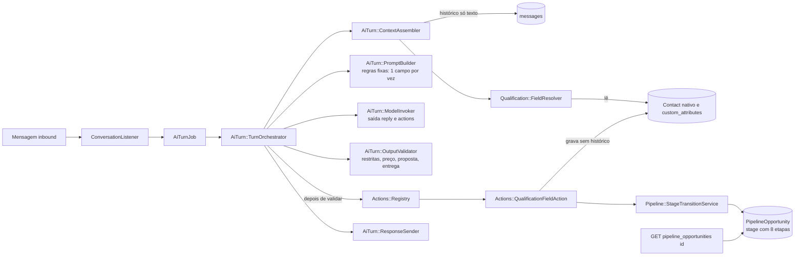
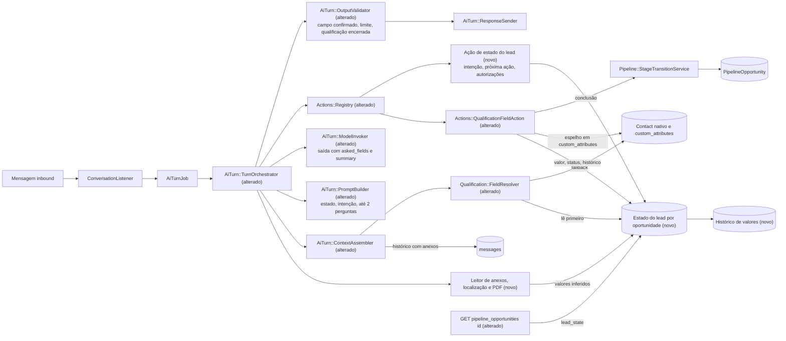

# SPEC: scansolo-agent-lead-state

## Metadata
- Source: developer description via /plan ("Documentação Unificada de Ajustes Desejados — Agente e Sistema ScanSOLO"), com 9 ACs confirmados pelo desenvolvedor em `.spec/features/scansolo-agent-lead-state/.handoff/confirmed-input.md`
- Service: ss-aiagentsystem (fork do Chatwoot, namespace `ScanSolo::`, monólito Rails)
- Tier: complete
- Version: 1.2 (v1.1: markers M1–M7 resolvidos; v1.2: "Round 2" de `.handoff/clarifier-answers.md`, 2026-09-29 — backfill `concluida` para etapas ≥ `qualificado` (PLAN Q7) e Open Questions Q2–Q6 do PLAN aceitas com os padrões planejados)
- Slice: 1 de 4 (os slices 2 a 4 ficam fora; ver Scope)
- Dependências novas: gem `pdf-reader` (Ruby puro, extração de texto de PDF; RF-19). Nenhuma outra dependência nova.
- Architecture references: `AGENTS.md` (idêntico a `CLAUDE.md`), `docs/agents/architecture.md`, `docs/agents/domain_rules.md`, `docs/agents/data_model.md`
- Feature anterior estendida (não duplicada): `.spec/features/scansolo-agent-qualification-continuity/SPEC.md` (resolvedor `ScanSolo::Qualification::FieldResolver`, verified at `app/services/scan_solo/qualification/field_resolver.rb:16`)
- Init chain: ausente

### Regras de arquitetura aplicadas (citadas)
- `docs/agents/architecture.md` "Layer responsibilities": Actions (`ScanSolo::Actions::Registry` + `Executor`) são o "sole path from model output to side effect". Portanto, toda escrita de estado do lead originada na saída do modelo passa por uma ação registrada, nunca por escrita direta do orquestrador. Pela mesma tabela, Services são donos de "all rules, transactions, locks, audit writes", Controllers ficam só com o gate 404 `scansolo_enabled`, o Pundit e a validação 422, e Views (jbuilder) só definem o formato do JSON. Com isso, a exposição do estado na API é apenas jbuilder, sem regra no controller.
- `docs/agents/architecture.md`: o Listener "delegates every write to services and holds no AI logic" (também verified at `app/services/scan_solo/conversation_listener.rb:24`). A leitura de anexos e PDFs, portanto, não mora no listener.
- `docs/agents/architecture.md` "Models": ninguém muda de etapa, exceto via `StageTransitionService`. `docs/agents/domain_rules.md` "Pipeline stages": `ScanSolo::Pipeline::StageTransitionService` é o único escritor da etapa, e a IA só avança para `em_qualificacao`/`qualificado` (verified at `app/services/scan_solo/actions/stage_transition_action.rb:11`). O avanço de etapa da conclusão (RF-21) usa esse serviço.
- `docs/agents/domain_rules.md` "Qualification field resolution": `FieldResolver` é o "only reader of 'field satisfied?'", com 6 consumidores. Esta SPEC estende o resolvedor (RF-08) e não cria um segundo leitor.
- `docs/agents/domain_rules.md` "Action registry", regra de extensão: "add handler class with `CLASSIFICATION` + `SCHEMA`, add to `HANDLERS`, `InputGuardrail::ALL_ACTIONS`, `PromptBuilder::ACTION_DESCRIPTIONS`" (verified at `app/services/scan_solo/actions/registry.rb:8`, `app/services/scan_solo/ai_turn/input_guardrail.rb:11`). Os schemas são fechados (`additionalProperties: false`).
- `docs/agents/data_model.md`: "ScanSolo extends core records by 1:1 extension tables, not columns", com tabelas `scan_solo_*`. O estado do lead fica em tabela(s) `scan_solo_*` própria(s), sem colunas novas em tabelas do Chatwoot.
- `AGENTS.md` "General Guidelines": "Enforce eligibility and exclusivity rules at the earliest shared entry point" e "Validate request parameters at the controller or request boundary … 422". `docs/agents/architecture.md`: `enterprise/` "not used by ScanSolo" (RNF-03).

## Context

Hoje o "estado" de qualificação de um lead é só o conjunto de valores em `Contact` (colunas nativas `name/email/phone_number` e `custom_attributes`), resolvido por `FieldResolver` sobre a lista única `required_qualification_fields` da config publicada. Não há status por campo (confirmado/inferido/faltante), histórico de correções, intenção do contato, marco de "qualificação concluída" nem próxima ação registrada. O agente não tem como saber quando parar de qualificar, e o operador não tem um resumo estruturado da oportunidade.

Achados no código (AS IS):
- O estado é por contato, não por oportunidade. `FieldResolver#resolve` lê só o contato (verified at `app/services/scan_solo/qualification/field_resolver.rb:100-108`). `PipelineOpportunity` tem apenas `stage`, `owner_id` e `last_customer_interaction_at` (verified at `app/models/scan_solo/pipeline_opportunity.rb:3-13`).
- A correção não é possível para campos nativos. `QualificationFieldAction` nunca sobrescreve nativo já preenchido (`native_already_present`, verified at `app/services/scan_solo/actions/qualification_field_action.rb:85`), e os `custom_attributes` são sobrescritos por merge sem histórico (linha 67).
- A ordem da resposta é esta: o modelo gera `reply` e `actions` numa única chamada. O `OutputValidator` roda antes das ações (verified at `app/services/scan_solo/ai_turn/turn_orchestrator.rb:92`), e as ações executam e a resposta é enviada na mesma transação (linhas 109-110). A resposta é gerada a partir do estado anterior à mensagem.
- O `OutputValidator` só bloqueia informação restrita, preço, "proposta enviada" e status de entrega (verified at `app/services/scan_solo/ai_turn/output_validator.rb:13-15`). Não detecta pergunta sobre campo já informado.
- A regra fixa 2 atual limita a "no máximo um campo faltante" (verified at `app/services/scan_solo/ai_turn/prompt_builder.rb:20-24`). O AC5 confirmado fixa **no máximo 2**, e o AC vence (RF-09 substitui o texto).
- Anexos e links são invisíveis ao modelo. O histórico usa só `content`, e uma mensagem sem texto vira `'[mensagem sem texto]'` (verified at `app/services/scan_solo/ai_turn/prompt_builder.rb:142`, `context_assembler.rb:55-57`). Não há leitura de PDF no repositório: nenhuma gem de PDF no `Gemfile` e nenhum uso de `attachments` em `app/services/scan_solo/ai_turn/`. Anexos de localização existem nativamente (`file_type` `location`, `coordinates_lat`, `coordinates_long`, `external_url`; verified at `app/models/attachment.rb:6-9,47`).
- Etapas: o enum atual tem 8 (`novo_lead … perdido`, verified at `app/models/scan_solo/pipeline_opportunity.rb:48-57`), e a descrição (§3.13) lista 11. Decisão (M2): as 8 etapas atuais permanecem; nenhuma etapa nova neste slice.
- "Responsável", "última interação" e "próximo follow-up" já existem na API (`owner_id`, `last_customer_interaction_at`, `next_follow_up_at`, verified at `app/views/api/v1/accounts/scan_solo/pipeline_opportunities/_pipeline_opportunity.json.jbuilder:6,8,11`) e são reaproveitados, não duplicados.

## AS IS — Estado atual



Hoje a qualificação vive no contato, sem status por campo, histórico, intenção ou próxima ação. O validador de saída não detecta pergunta sobre campo já informado, e anexos ou PDFs chegam ao modelo como "[mensagem sem texto]".

## TO BE — Estado proposto



O estado do lead por oportunidade (RF-01..RF-04) e seu histórico (RF-06) são escritos pelas ações registradas (RF-07, RF-14, RF-23, RF-24; CT-03) e pelo leitor de anexos (RF-17..RF-20). O `FieldResolver` passa a ler esse estado primeiro (RF-08). O validador passa a checar o estado já atualizado pela mensagem (RF-05, RF-11, RF-12, RF-22; CT-02, CT-04), e a API expõe o bloco `lead_state` (RF-26, CT-01).

## Scope
- **In**:
  - Estado estruturado por oportunidade: 6 blocos de campos com valor, status (`confirmado|inferido|faltante`), classificação (`obrigatorio|complementar`) e histórico. O bloco Status é derivado.
  - Atualização do estado a cada mensagem inbound, antes da resposta, com correção e histórico.
  - Extensão do `FieldResolver` (leitor único) para o estado do lead e a semântica "satisfeito ⇔ confirmado".
  - Intenção do contato (10 valores), próxima ação (5 valores), ações autorizadas, marco "qualificação concluída" e avanço de etapa pela via existente.
  - Regras de prompt (até 2 perguntas, só faltantes, pergunta do cliente primeiro, sem nova confirmação, resumo só em eventos) e validação de saída (campo confirmado, limite de perguntas, qualificação encerrada).
  - Anexos de localização, PDFs e links visíveis ao modelo, e extração de CNPJ, razão social e endereço para o estado (inferido).
  - Exposição do estado em `GET /api/v1/accounts/:account_id/scan_solo/pipeline_opportunities/:id`.
- **Out**:
  - Slice 2 `scansolo-proposal-request-e2e` (§12–15, 34–37): e-mail interno de proposta, identidade de e-mail do agente, Make ponta a ponta, falhas. O payload Make (CT-05 da feature anterior, `MAKE_KEYS`) **não muda** neste slice.
  - Slice 3 `scansolo-operator-console-ux` (§17–23, 29–33): menu, Kanban, badges, modal de handoff. **Nenhuma UI nova** (sem seção UI nesta SPEC), e `GET /pipeline_opportunities` (index) não muda.
  - Slice 4 `scansolo-followup-reliability` (§24–28): nenhuma mudança de cadência.
  - §16 formulário RFQ, §38 migração de domínio, §39.2 validação manual com lead real.
  - Execução das próximas ações (enviar proposta, agendar avaliação, handoff automático): este slice só **registra** a próxima ação (AC9). O handoff continua pela ação existente `human_handoff`.
  - Variação de linguagem (§3.7: evitar "Perfeito", "Já entendi", repetir o nome) e "nunca informar falha técnica ao lead" (§40): aparecem nos trechos da descrição, mas não nos ACs confirmados, por isso não viram RF (se forem desejados, entram por nova confirmação).
  - Busca HTTP do conteúdo de links (decisão M3: nenhum link é buscado).
  - OCR de PDF escaneado (decisão M3).
  - Novas etapas do §3.13 no enum do pipeline e roteiro por etapa (decisão M2): as 8 etapas atuais permanecem, e o roteiro varia só por intenção (RF-15).

## RIGID (Non-Negotiable)

### Functional Requirements

#### Estado do lead

- RF-01 [Ubíquo] (AC1): O SISTEMA DEVE manter, para cada `PipelineOpportunity`, exatamente um estado do lead, existente desde a criação da oportunidade. Para cada campo do catálogo RF-02, o estado guarda: chave canônica, bloco, valor vigente, status ∈ {`confirmado`, `inferido`, `faltante`}, classificação ∈ {`obrigatorio`, `complementar`}, instante da última alteração e origem do valor vigente (id da mensagem inbound e, quando vier de anexo, id do anexo). Campo sem valor tem status `faltante`, e campo com status `faltante` não tem valor. Na criação do estado, cada campo do catálogo cujo valor exista no `Contact` (coluna nativa `name/email/phone_number` ou `custom_attributes`, inclusive o nome do perfil do WhatsApp) entra com esse valor e status `inferido`; os demais entram `faltante` (decisão M6-a). Um estado criado na criação da oportunidade começa com qualificação `em_andamento`.
- RF-01a [Evento] (backfill, decisão Round 2 / PLAN Q7): QUANDO o backfill aditivo (rake ou migração) rodar, O SISTEMA DEVE criar o estado do lead para cada oportunidade existente que ainda não tem estado, com os campos semeados pela mesma regra do RF-01 (valores do `Contact` → `inferido`; demais → `faltante`, nenhum `confirmado`), e com a qualificação definida só pela etapa atual da oportunidade no momento do backfill:
  - etapa ∈ {`qualificado`, `proposta_enviada`, `negociacao`, `ganho`, `perdido`} → qualificação `concluida`, `completed_at` = instante do backfill, próxima ação = padrão da intenção nula pela tabela do RF-15 (`aguardar_cliente`), com `source_message_id` nulo;
  - etapa ∈ {`novo_lead`, `em_contato`, `em_qualificacao`} → qualificação `em_andamento`, sem próxima ação.
  O backfill não chama `StageTransitionService`, não cria `PipelineStageEvent`, não grava `AuditEvent` `lead_state.qualification_completed` (o RF-21 não dispara para esses estados) e não escreve em `Contact`. Uma oportunidade que recebeu `concluida` pelo backfill segue o RF-22 (sem campos elegíveis, `asked_fields` não vazio rejeitado): o agente não requalifica.
  - AC: uma oportunidade criada por `OpportunityBootstrapService` para um contato com `name = "Milena (WhatsApp)"` e sem outros dados tem 1 estado do lead com os 34 campos do RF-02: `nome` = "Milena (WhatsApp)" `inferido`, os outros 33 `faltante`, qualificação `em_andamento`. Um segundo bootstrap da mesma conversa continua com 1 estado. Nenhum campo tem `faltante` com valor ou `confirmado`/`inferido` sem valor.
  - AC (backfill): após o backfill, 100% das oportunidades existentes têm exatamente 1 estado e 0 campos `confirmado`; oportunidade em `negociacao` com contato `name = "Ana"` → `nome` `inferido`, qualificação `concluida`, próxima ação `aguardar_cliente`, 0 `PipelineStageEvent` e 0 `AuditEvent` novos; oportunidade em `perdido` → `concluida`; oportunidade em `em_qualificacao` → `em_andamento`, próxima ação nula; turno seguinte na oportunidade em `negociacao` → lista de elegíveis "nenhum" e `asked_fields: ["nome"]` rejeitado `qualification_closed`; rodar o backfill 2 vezes não cria estado adicional nem altera estados existentes.

- RF-02 [Ubíquo] (AC1): O SISTEMA DEVE usar este catálogo fechado de campos por bloco. As chaves marcadas "existente" reutilizam a chave canônica já usada em produção (verified at `app/services/scan_solo/qualification/field_resolver.rb:19-31`) e seus aliases; as demais são novas e definidas por esta SPEC.

  | Bloco | Rótulo (§4) | Chave canônica |
  |---|---|---|
  | Identificação | Contato | `nome` (existente) |
  | Identificação | Empresa / razão social | `empresa` (existente) |
  | Identificação | Cargo | `cargo` |
  | Identificação | CNPJ | `cnpj` |
  | Identificação | Telefone | `telefone` (existente) |
  | Identificação | E-mail principal | `email` (existente) |
  | Identificação | E-mails em cópia | `emails_copia` |
  | Serviço | Tipo de serviço | `tipo_servico` |
  | Serviço | Objetivo | `tipo_intervencao` (existente, alias "Objetivo do serviço") |
  | Serviço | Tecnologia | `tecnologia` |
  | Serviço | Interferências buscadas | `interferencias_buscadas` |
  | Local | Cliente / local final | `cliente_final` |
  | Local | Cidade / UF | `cidade_uf` (existente) |
  | Local | Endereço | `endereco_obra` (existente) |
  | Local | Bairro | `bairro` |
  | Local | Link | `link_local` |
  | Escopo | Área | `area` (existente) |
  | Escopo | Metragem | `metragem` |
  | Escopo | Quantidade de pontos | `quantidade_pontos` |
  | Escopo | Profundidade de investigação | `profundidade` (existente, alias "Profundidade de interesse") |
  | Escopo | Profundidade da intervenção | `profundidade_intervencao` |
  | Escopo | Superfície | `superficie` |
  | Escopo | Observações técnicas | `observacoes_tecnicas` |
  | Execução | Data desejada | `data_desejada` |
  | Execução | Prazo | `prazo_desejado` (existente) |
  | Execução | Diárias | `diarias` |
  | Execução | Integração | `integracao_seguranca` (existente) |
  | Execução | Tempo de integração | `tempo_integracao` |
  | Execução | Restrições de acesso | `restricoes_acesso` |
  | Execução | Documentações necessárias | `documentacoes_necessarias` |
  | Comercial | Prazo para proposta | `prazo_proposta` |
  | Comercial | E-mail para envio | `email_envio_proposta` |
  | Comercial | Cópias | `emails_copia_proposta` |
  | Comercial | Condições especiais | `condicoes_especiais` |

  Toda chave, rótulo e alias passa pela normalização existente (`FieldResolver.normalize`, verified at `field_resolver.rb:44-46`). Nenhuma chave nova pode colidir, após normalização, com um alias existente de outra chave.
  - AC: spec de tabela: cada rótulo acima resolve para sua chave; `"Prazo para proposta"` não resolve para `prazo_desejado`; `"E-mail para envio"` não resolve para `email`; `"Objetivo do serviço"` continua resolvendo para `tipo_intervencao`.

- RF-03 [Ubíquo] (AC1): O SISTEMA DEVE derivar o bloco Status sem armazenar cópias:
  - etapa atual = `PipelineOpportunity.stage`;
  - dados confirmados = chaves com status `confirmado`;
  - dados faltantes = chaves `obrigatorio` com status ≠ `confirmado`;
  - próxima ação = RF-23;
  - responsável = `owner_id`;
  - última interação = `last_customer_interaction_at`;
  - próximo follow-up = o mesmo cálculo já exposto em `next_follow_up_at` (verified at `_pipeline_opportunity.json.jbuilder:11`).
  - AC: ao alterar `owner_id` via `PATCH`, o responsável exibido em `lead_state` muda sem nenhuma escrita no estado do lead; uma chave obrigatória `inferido` aparece em "dados faltantes" e não em "dados confirmados".

- RF-04 [Indesejado] (AC1, §6): SE um valor tiver status `inferido`, ENTÃO O SISTEMA NÃO DEVE contá-lo como campo satisfeito, listá-lo como confirmado ou usá-lo para concluir a qualificação. Um valor só passa de `inferido` a `confirmado` quando uma mensagem inbound do cliente o afirma ou confirma.
  - AC: `cnpj` inferido de PDF + todos os demais obrigatórios confirmados → qualificação não concluída e `cnpj` listado em dados faltantes; após o cliente responder confirmando o CNPJ → `cnpj` `confirmado` e origem = id da mensagem de confirmação.

#### Atualização a cada mensagem

- RF-05 [Evento] (AC2): QUANDO uma mensagem inbound elegível gerar um turno, O SISTEMA DEVE usar uma única chamada de modelo por tentativa, que devolve resposta e ações juntas (decisão M4-b), e, para cada tentativa: (1) executar as ações dentro de uma transação; (2) rodar o validador de saída (RF-11, RF-12, RF-22 e as violações existentes) sobre o estado do lead já com essas alterações; (3) se o validador bloquear, desfazer a transação (0 alterações da tentativa persistidas); (4) se aprovar, confirmar a transação e criar a mensagem de resposta. As alterações do estado vindas de anexos e links da mensagem (RF-18, RF-19) são extraídas antes da chamada de modelo, apresentadas ao modelo nessa chamada como valores do estado, e gravadas dentro da transação da tentativa, antes das ações e da mensagem de resposta, sem transação aberta durante a chamada de modelo (PLAN Q3, aceito na Round 2); elas seguem o mesmo tudo-ou-nada do turno: se o turno terminar `failed` ou `suppressed`, elas também são revertidas (regra tudo-ou-nada existente, `docs/agents/domain_rules.md` "Action registry"). O número máximo de tentativas por turno é 2 (RF-11).
  - AC: turno com cliente informando "área 800 m²" → a entrada de histórico de `area` tem instante ≤ `created_at` da resposta; turno cuja resposta é bloqueada nas 2 tentativas → turno `failed`, 0 mensagens enviadas e 0 alterações no estado do lead, incluindo os campos extraídos de PDF dessa mensagem; turno aprovado → exatamente 1 chamada de modelo (spec com `MockLlmProvider`).

- RF-06 [Evento] (AC2): QUANDO uma mensagem do cliente informar, para um campo que já tem valor vigente, um valor diferente, O SISTEMA DEVE tornar o novo valor o vigente com status `confirmado` e origem nessa mensagem, e acrescentar ao histórico do campo o valor anterior (valor, status, origem, instante). Entradas de histórico nunca são editadas nem apagadas. Isso vale também para `nome`, `email` e `telefone`: a correção muda o valor vigente no estado do lead, e as colunas nativas do `Contact` seguem a regra existente de não sobrescrever (verified at `qualification_field_action.rb:84-85`).
  - AC: `tempo_integracao` = "uma diária" (confirmado); o cliente escreve "na verdade a integração é de 30 minutos no mesmo dia" → valor vigente "30 minutos no mesmo dia", `confirmado`, e o histórico contém "uma diária" com a origem original; o prompt do turno seguinte mostra apenas o valor novo como vigente. Contato com `name = "Milena (WhatsApp)"` corrigido para "Milena Souza" → `nome` vigente "Milena Souza" no estado e `contact.name` inalterado.

- RF-07 [Ubíquo] (AC1, AC2): O SISTEMA DEVE atribuir o status conforme a origem do valor: valor afirmado pelo cliente em texto → `confirmado`; valor deduzido pelo modelo sem afirmação literal do cliente (declarado como inferido na ação, CT-03) → `inferido`; valor extraído de anexo, localização ou link → `inferido` (RF-18, RF-19). Um valor `inferido` nunca substitui um valor `confirmado`.
  - AC: ação com `{cidade_uf: {value: "RJ", status: "inferido"}}` sobre `cidade_uf` confirmado "Rio/RJ" → valor vigente e status inalterados; sobre `cidade_uf` faltante → gravado como `inferido`.

- RF-08 [Ubíquo] (extensão de RF-01/RF-07 da feature anterior): O SISTEMA DEVE manter `ScanSolo::Qualification::FieldResolver` como único leitor de "campo satisfeito?". Um campo passa a ser satisfeito se e somente se tem status `confirmado` no estado do lead da oportunidade. Para o valor, a precedência é: estado do lead → coluna nativa do contato → `custom_attributes` (regra RF-21 anterior). Os 6 consumidores atuais (`ContextAssembler`, `QualificationFieldAction`, `ReplyCompletenessDetector`, `GenerateService`, `MakeProvider`, `HandoffService`) continuam obtendo satisfação e valores só pelo resolvedor.
  Valores vindos só do `Contact` nunca tornam um campo satisfeito (entram `inferido`, RF-01), e o agente pede a confirmação deles como campo faltante enquanto a qualificação estiver `em_andamento` (com `concluida`, vale o RF-22 e nada é perguntado). Toda escrita de valor feita pela ação `qualification_field` continua espelhada no `Contact` como hoje (merge em `custom_attributes`; colunas nativas só quando vazias) (decisão M6-b).
  Gate de proposta (`GenerateService`, decisão Round 2): ENQUANTO a qualificação da oportunidade estiver `concluida`, o gate de campos obrigatórios bloqueia só por obrigatório com status `faltante`; obrigatório com status `inferido` não bloqueia. ENQUANTO estiver `em_andamento`, o gate bloqueia por qualquer obrigatório não `confirmado` (`inferido` ou `faltante`). Esse predicado do gate é fornecido pelo `FieldResolver` (leitor único) e não altera a semântica de satisfação: o campo `inferido` continua não satisfeito e listado em "dados faltantes" (RF-03, RF-04). As demais verificações do gate não mudam.
  - AC: consistency spec — para a mesma oportunidade, os conjuntos de satisfeitos e faltantes derivados dos 6 consumidores são idênticos e iguais aos de `lead_state` (RF-03); nenhum consumidor lê o estado do lead diretamente para decidir satisfação. Contato com `name` nativo preenchido e `nome` `inferido` no estado → "Nome" não satisfeito. Ação `qualification_field` com `{area: "800 m²"}` → `area` `confirmado` no estado e `contact.custom_attributes` contém o valor gravado, como hoje.
  - AC (gate): config exige `Área`; oportunidade `concluida` (backfill) com `area` `inferido` → gate de proposta não bloqueia por campo e `area` aparece em `lead_state.status.missing_fields`; oportunidade `concluida` com `area` `faltante` → gate bloqueia; oportunidade `em_andamento` com `area` `inferido` → gate bloqueia.

#### Perguntas e validação de saída

- RF-09 [Ubíquo] (AC5, AC3): O SISTEMA DEVE incluir na mensagem de sistema de todo turno o estado do lead: campos confirmados com valores, campos inferidos marcados como "inferido", campos obrigatórios não confirmados, intenção atual, etapa atual, status da qualificação e ações autorizadas. Deve incluir também a lista ordenada de próximos campos elegíveis para pergunta: somente status `faltante`, obrigatórios antes de complementares e, dentro de cada grupo, na ordem das linhas da tabela do RF-02. Deve incluir ainda a linha de roteiro da intenção atual (RF-15). A regra fixa 2 de `CONTINUITY_RULES` (verified at `app/services/scan_solo/ai_turn/prompt_builder.rb:22`) DEVE passar a dizer que o agente responde primeiro à pergunta ou intenção atual do cliente e só depois pergunta **no máximo 2** campos, apenas entre os faltantes.
  - AC: spec do PromptBuilder — a mensagem de sistema contém os campos confirmados, os inferidos rotulados, a lista ordenada de elegíveis sem nenhum `confirmado`/`inferido`, e a regra 2 com "no máximo 2"; nenhuma regra fixa menciona "no máximo um campo". Com `area` (obrigatório) e `cnpj`, `empresa` (complementares) faltantes, a lista é `area`, `empresa`, `cnpj`.

- RF-10 [Ubíquo] (AC3, AC5): O SISTEMA DEVE exigir na saída estruturada do modelo a lista das chaves canônicas que a resposta pergunta (`asked_fields`) e o indicador de resumo completo (`summary`) (CT-02).
  - AC: uma saída do modelo sem `asked_fields` ou sem `summary` → turno `failed` pela validação de schema existente, 0 mensagens enviadas.

- RF-11 [Indesejado] (AC3): SE a resposta perguntar um campo com status `confirmado` (após as alterações da mensagem atual, RF-05), ENTÃO O SISTEMA DEVE rejeitá-la com a violação `confirmed_field_question`. "Perguntar" vale quando: (a) a chave está em `asked_fields`; ou (b) uma frase da resposta terminada em "?" contém, após a normalização do `FieldResolver`, o rótulo ou um alias registrado desse campo que tenha 2 ou mais tokens após a normalização (rótulos e aliases de 1 token não são detectados lexicalmente) (decisão M5).
  - AC: `data_desejada` confirmado; resposta "Qual a data desejada?" com `asked_fields: []` → rejeitada `confirmed_field_question`; `area` confirmado e resposta "Qual a área aproximada?" com `asked_fields: []` → aceita (rótulo de 1 token); `asked_fields: ["area"]` → rejeitada; resposta "Para 800 m² indicamos o GPR." → aceita.
- RF-11a [Indesejado] (AC3, decisão M5): SE uma tentativa for rejeitada com `confirmed_field_question`, `question_limit`, `field_not_missing` ou `qualification_closed`, ENTÃO O SISTEMA DEVE desfazer a tentativa (RF-05) e fazer exatamente 1 nova chamada de modelo no mesmo turno, informando ao modelo a violação ocorrida. SE a 2ª tentativa também for rejeitada, ENTÃO o turno termina `failed`, sem mensagem enviada, com `failure_reason` da violação da 2ª tentativa (CT-04). As violações já existentes (informação restrita, preço, "proposta enviada", status de entrega) mantêm o comportamento atual, sem regeneração.
  - AC: 1ª tentativa rejeitada `confirmed_field_question` e 2ª aceita → 2 chamadas de modelo, 1 mensagem enviada, turno `succeeded`, só as ações da 2ª tentativa persistidas; 2 tentativas rejeitadas → 2 chamadas, 0 mensagens, turno `failed`; o payload da 2ª chamada contém o nome da violação; violação de preço → 1 chamada, turno `failed`.

- RF-12 [Indesejado] (AC5): SE `asked_fields` tiver mais de 2 chaves, ENTÃO O SISTEMA DEVE rejeitar a resposta com a violação `question_limit`. SE `asked_fields` contiver chave fora do catálogo ou com status diferente de `faltante`, ENTÃO O SISTEMA DEVE rejeitá-la com `field_not_missing` (salvo quando `confirmado`, que cai no RF-11).
  - AC: `asked_fields` com 3 faltantes → `question_limit`; com 2 faltantes → aceita; com 1 `inferido` → `field_not_missing`; com `"cor_favorita"` → `field_not_missing`.

- RF-13 [Evento] (AC5): QUANDO a mensagem do cliente contiver uma pergunta direta, O SISTEMA DEVE instruir o modelo, por regra fixa não editável pela config, a respondê-la antes de qualquer pergunta de qualificação.
  - AC: spec do PromptBuilder — a regra está presente em todo turno e antes de `## Regras do agente`. Spec de integração com `ScanSolo::TestMode::MockLlmProvider` (verified at `app/services/scan_solo/test_mode/mock_llm_provider.rb:17`): o `last_payload` do turno com a pergunta técnica do cliente contém a pergunta no histórico e a regra no sistema.

#### Intenção do contato

- RF-14 [Evento] (AC7): QUANDO uma mensagem inbound for processada, O SISTEMA DEVE manter a intenção atual do contato como um valor ∈ {`orcamento`, `avaliacao_tecnica`, `convite_cotacao`, `envio_documentos`, `duvida`, `verificar_capacidade`, `localizar_rede`, `visita`, `acompanhar_proposta`, `outro`}, nula até a primeira classificação. A intenção é atualizada quando o modelo a classifica diferente (CT-03), e cada mudança entra no histórico com a mensagem de origem.
  - AC: a 1ª mensagem "preciso de um orçamento de GPR" gera intenção `orcamento`; a mensagem seguinte "na verdade é convite para cotação" gera `convite_cotacao`, e o histórico tem `orcamento` → `convite_cotacao`; um valor fora da lista é rejeitado pelo schema (`InvalidParamsError`) e o turno é revertido.

- RF-15 [Ubíquo] (AC7, AC4, decisão M1): O SISTEMA DEVE classificar como `obrigatorio` exatamente os campos do catálogo resolvidos a partir de `required_qualification_fields` da config publicada, e como `complementar` todos os demais, para qualquer intenção (inclusive nula) e qualquer etapa. A intenção define apenas (a) a próxima ação padrão e (b) uma linha de roteiro na mensagem de sistema, conforme a tabela abaixo. A etapa não altera classificação nem roteiro. Um rótulo de `required_qualification_fields` que não resolve para chave do catálogo RF-02 é tratado como obrigatório nunca confirmado (fail-closed): impede a conclusão (RF-21) e bloqueia o gate de proposta enquanto a qualificação estiver `em_andamento` (PLAN Q2, aceito na Round 2; ver RNF-09).

  | Intenção | Próxima ação padrão |
  |---|---|
  | `orcamento`, `convite_cotacao` | `proposta` |
  | `avaliacao_tecnica`, `visita`, `localizar_rede` | `avaliacao_tecnica` |
  | `envio_documentos` | `solicitar_documentos` |
  | `acompanhar_proposta`, `duvida`, `verificar_capacidade`, `outro`, nula | `aguardar_cliente` |

  - AC: mudar a intenção de `orcamento` para `envio_documentos` não altera nenhuma classificação, valor ou status, e troca a linha de roteiro da mensagem de sistema; mudar a etapa não altera classificação; a mensagem de sistema contém exatamente 1 linha de roteiro de intenção.

#### Anexos, localização, PDF e links

- RF-16 [Evento] (AC6): QUANDO uma mensagem do histórico tiver anexos ou URLs, O SISTEMA DEVE apresentá-la ao modelo com a descrição de cada anexo (tipo; nome do arquivo quando houver; para localização, latitude, longitude e link; para arquivo, se houve extração) e com as URLs presentes, e não como `'[mensagem sem texto]'`.
  - AC: mensagem só com anexo de localização → a entrada de histórico no payload contém o tipo "localização" e as coordenadas; mensagem só com PDF → contém o tipo "PDF" e o nome do arquivo; nenhuma mensagem com anexo aparece como `[mensagem sem texto]`.

- RF-17 [Indesejado] (AC6): SE a mensagem atual trouxer localização, PDF com texto extraído ou link de mapa, ENTÃO O SISTEMA DEVE tratá-la como informação recebida: cada campo preenchido a partir dela (RF-18, RF-18a, RF-19) deixa de ser `faltante` e não entra na lista de elegíveis para pergunta (RF-09). Links que não são de mapa não preenchem nenhum campo e só ficam visíveis ao modelo (RF-16).
  - AC: após o cliente enviar a localização, `link_local` não aparece nos elegíveis do turno; `asked_fields: ["link_local"]` → rejeitada (`field_not_missing`); mensagem com `https://exemplo.com.br/edital` → 0 campos alterados e a URL presente no histórico do payload.

- RF-18 [Evento] (AC6): QUANDO chegar um anexo de localização (`file_type` `location`, verified at `app/models/attachment.rb:47`), O SISTEMA DEVE gravar em `link_local` um link derivado de `external_url` ou, na ausência dele, de `coordinates_lat`/`coordinates_long`, com status `inferido` e origem no anexo, respeitando o RF-07.
  - AC: localização com lat -22.9, long -43.2 e sem `external_url` → `link_local` preenchido, `inferido`, origem = id do anexo.

- RF-18a [Evento] (AC6, decisão M3-d): QUANDO o texto de uma mensagem inbound contiver uma URL cujo host seja de mapa (Google Maps, `goo.gl/maps`, `maps.app.goo.gl`), O SISTEMA DEVE gravar essa URL em `link_local` com status `inferido` e origem na mensagem (sem id de anexo), respeitando o RF-07, sem nenhuma requisição HTTP a essa URL. Nenhuma URL de mensagem é buscada por HTTP.
  - AC: mensagem "segue o local https://maps.app.goo.gl/abc" com `link_local` faltante → `link_local` = essa URL, `inferido`, origem = id da mensagem; 0 requisições HTTP no turno (WebMock); com `link_local` `confirmado` → inalterado.

- RF-19 [Evento] (AC6, decisão M3-a/b/c): QUANDO chegar um PDF de até 10 MB e até 10 páginas, O SISTEMA DEVE extrair o texto com a gem `pdf-reader`, sem nenhuma chamada de modelo para a extração, e preencher `cnpj`, `empresa` (razão social) e `endereco_obra` com os valores encontrados, status `inferido` e origem no anexo, respeitando o RF-07. A extração ocorre antes da chamada de modelo do turno disparado por essa mensagem, e a gravação segue o RF-05. PDF acima de 10 MB ou de 10 páginas, ou sem texto extraível (escaneado), cai no RF-20; não há OCR.
  - AC: fixture de PDF contendo CNPJ "12.345.678/0001-90", razão social e endereço → os 3 campos `inferido` com esses valores antes da criação da resposta, com 0 chamadas de modelo além da chamada do turno; `empresa` já `confirmado` → inalterado; PDF escaneado sem texto → 0 campos alterados e motivo registrado (RF-20); PDF com 11 páginas → 0 campos alterados e motivo registrado.

- RF-20 [Indesejado] (AC6): SE a extração de um anexo falhar ou o tipo não for suportado, ENTÃO O SISTEMA DEVE seguir o turno sem alterar o estado a partir desse anexo e registrar o motivo na evidência do turno (`AiTurn`), mantendo a descrição do anexo no histórico (RF-16).
  - AC: PDF corrompido → turno `succeeded`, 0 campos alterados por esse anexo, motivo presente na evidência do turno. Casos cobertos por este RF: extração com erro, tipo não suportado, PDF sem texto extraível, PDF acima de 10 MB ou de 10 páginas.

#### Conclusão da qualificação e próxima ação

- RF-21 [Evento] (AC4): QUANDO todos os campos `obrigatorio` (RF-15) estiverem `confirmado` pela primeira vez, O SISTEMA DEVE, no mesmo turno:
  1. marcar a qualificação como `concluida`, com instante;
  2. avançar a etapa para `qualificado` somente pelo `Pipeline::StageTransitionService` (se estiver em `novo_lead` ou `em_contato`, passar por `em_qualificacao`, com um `PipelineStageEvent` por transição; PLAN Q5, aceito na Round 2);
  3. registrar a próxima ação (RF-23): a informada pelo modelo no turno (CT-03) ou, se nenhuma for informada, a próxima ação padrão da intenção atual (tabela do RF-15). A conclusão nunca é adiada por falta de próxima ação;
  4. gravar `AuditEvent` `lead_state.qualification_completed` com o `correlation_id` do turno via `ScanSolo::AuditLogger.record!` (verified at `app/services/scan_solo/audit_logger.rb:2`).

  Isso acontece uma única vez por oportunidade; a qualificação `concluida` nunca reabre, nem por mudança de intenção nem de config (decisão M1-d). A etapa alvo é sempre `qualificado`, qualquer que seja a próxima ação (decisão M2). A etapa não retrocede se a oportunidade já estiver além de `qualificado`. A conclusão é avaliada uma vez por tentativa, depois de todas as ações da tentativa e na mesma transação, como consequência determinística do estado (não é uma ação escolhida pelo modelo); isso não conflita com "Actions são o único caminho" (PLAN Q6, aceito na Round 2).
  - AC: oportunidade `em_qualificacao` cujo último obrigatório é confirmado → `concluida`, etapa `qualificado`, 1 `PipelineStageEvent`, próxima ação registrada e 1 `AuditEvent`; nova mensagem depois disso → nenhum evento adicional; oportunidade `em_contato` concluída numa só mensagem → 2 eventos (`em_contato→em_qualificacao`, `em_qualificacao→qualificado`); oportunidade `novo_lead` concluída numa só mensagem → 2 eventos (`novo_lead→em_qualificacao`, `em_qualificacao→qualificado`); conclusão com `next_action` informada numa ação posterior à `qualification_field` na mesma saída → essa próxima ação é a registrada; conclusão com intenção `visita` e sem `next_action` na saída → próxima ação `avaliacao_tecnica` e etapa `qualificado`; conclusão com intenção nula e sem `next_action` → `aguardar_cliente`; oportunidade `concluida` cuja config passa a exigir um campo `faltante` → continua `concluida`.

- RF-22 [Estado] (AC4): ENQUANTO a qualificação estiver `concluida`, O SISTEMA DEVE informar isso ao modelo na mensagem de sistema, não oferecer campos elegíveis para pergunta e rejeitar qualquer resposta com `asked_fields` não vazio (violação `qualification_closed`).
  - AC: oportunidade `concluida` + saída com `asked_fields: ["bairro"]` → rejeitada `qualification_closed`; com `asked_fields: []` → aceita; a lista de elegíveis no prompt é "nenhum".

- RF-23 [Ubíquo] (AC9): O SISTEMA DEVE registrar a próxima ação como um valor ∈ {`proposta`, `avaliacao_tecnica`, `solicitar_documentos`, `atendimento_humano`, `aguardar_cliente`}, com instante e origem, e manter as anteriores no histórico. A qualificação só fica `concluida` com uma próxima ação registrada. Registrar a próxima ação não executa nenhum efeito colateral (proposta, handoff, e-mail).
  - AC: conclusão com próxima ação `proposta` → `lead_state.next_action.value = "proposta"`; um valor fora da lista é rejeitado pelo schema; registrar `atendimento_humano` não muda `ai_control_state`.

#### Confirmações e resumo

- RF-24 [Evento] (AC8): QUANDO o cliente pedir ou autorizar uma ação do conjunto do RF-23 (ex.: "pode mandar a proposta"), O SISTEMA DEVE registrar a autorização no estado do lead (ação, mensagem de origem, instante), apresentá-la ao modelo como já autorizada, com a regra fixa "não peça nova confirmação para ação já pedida ou autorizada", e não oferecer essa ação como assunto de confirmação em turnos seguintes.
  O AC8 é garantido só pelo prompt (regra fixa + lista de ações autorizadas); o validador de saída não ganha violação para isso (decisão M7).
  - AC: após "pode mandar a proposta", `lead_state.authorized_actions` contém `proposta` com a mensagem de origem; o prompt do turno seguinte lista `proposta` como autorizada e contém a regra; uma resposta que pede confirmação de `proposta` não é rejeitada pelo validador.

- RF-25 [Estado] (AC8): ENQUANTO o turno não tiver nenhum destes eventos: mudança de etapa; ação `human_handoff`; registro de próxima ação (encaminhamento); qualificação concluída; ou risco de interpretação declarado pelo modelo (CT-03), O SISTEMA DEVE instruir o modelo a não enviar resumo completo dos dados. A mensagem de sistema indica, de forma determinística, se o resumo é permitido no turno.
  A garantia é só pelo prompt: `summary: true` nunca é violação do validador (decisão M7).
  Indicador (PLAN Q4, aceito na Round 2; 1 chamada por tentativa, M4-b): "resumo permitido" SE e somente SE algum dos eventos acima foi registrado depois da última resposta de IA da conversa; caso contrário "resumo não permitido", acompanhado de uma regra fixa de exceção que permite o resumo quando a própria resposta produzir um desses eventos.
  - AC: turno sem nenhum evento registrado desde a última resposta de IA → a mensagem de sistema diz "resumo não permitido" e contém a regra de exceção; turno imediatamente seguinte a uma resposta que concluiu a qualificação, sem resposta de IA entre eles → "resumo permitido"; saída com `summary: true` em turno sem evento → aceita pelo validador.

#### Exposição via API

- RF-26 [Evento] (escopo do slice): QUANDO `GET /api/v1/accounts/:account_id/scan_solo/pipeline_opportunities/:id` for atendido (verified at `config/routes.rb:463`), O SISTEMA DEVE incluir o bloco `lead_state` (CT-01), com a mesma autorização atual (`PipelineOpportunityPolicy`, verified at `app/policies/scan_solo/pipeline_opportunity_policy.rb`) e o mesmo gate `scansolo_enabled` (404).
  - AC: request spec — `show` retorna `lead_state` com os 6 blocos, `status`, `intent`, `qualification`, `next_action`, `authorized_actions` e `history`; conta com `scansolo_enabled = false` → 404; os campos atuais da resposta ficam inalterados.

### Contracts
- CT-01 (alterado, aditivo): `GET /api/v1/accounts/:account_id/scan_solo/pipeline_opportunities/:id` e as respostas que usam o mesmo partial (`update`, `stage_transitions`) ganham `lead_state`:
  ```
  lead_state: {
    intent: <RF-14 value> | null,
    qualification: { status: "em_andamento" | "concluida", completed_at: <iso8601> | null },
    next_action: { value: <RF-23 value>, recorded_at: <iso8601>, source_message_id: <int> | null } | null,  # null só no backfill (RF-01a)
    authorized_actions: [ { action: <RF-23 value>, source_message_id: <int>, recorded_at: <iso8601> } ],
    blocks: {
      identificacao | servico | local | escopo | execucao | comercial: [
        { key: <RF-02 key>, label: <RF-02 rótulo>, value: <string> | null,
          status: "confirmado" | "inferido" | "faltante",
          classification: "obrigatorio" | "complementar",
          updated_at: <iso8601> | null, source_message_id: <int> | null, source_attachment_id: <int> | null }
      ]
    },
    status: { stage, confirmed_fields: [key], missing_fields: [key], next_action, owner_id,
              last_customer_interaction_at, next_follow_up_at },
    history: [ { subject: "field" | "intent" | "next_action", key: <string> | null, previous_value, previous_status,
                 new_value, new_status, source_message_id, source_attachment_id, changed_at } ]
  }
  ```
  Os campos existentes (`id … stage_history`, `docs/agents/api_contracts.md:61`) não mudam. `GET /pipeline_opportunities` (index) não muda. Realiza RF-01, RF-03, RF-06, RF-14, RF-23, RF-24, RF-26.
- CT-02 (alterado): o schema de saída do modelo `scansolo_turn` (verified at `app/services/scan_solo/ai_turn/prompt_builder.rb`, `output_schema`) passa a exigir `asked_fields: string[]` (chaves RF-02) e `summary: boolean`, além de `reply` e `actions`. Uma saída sem esses campos falha como hoje (`InvalidOutputError`). Realiza RF-10, RF-11, RF-12, RF-22, RF-25.
- CT-03 (alterado + novo, ações registradas):
  - `qualification_field` (existente): cada entrada de `fields` aceita string (tratada como `confirmado`) ou `{ value: string, status: "confirmado" | "inferido" }`; o schema continua fechado.
  - Nova ação registrada de estado do lead (`action_id` a definir no PLAN; classificação `automatic`; schema fechado) com parâmetros opcionais `intent` (enum RF-14), `next_action` (enum RF-23), `authorized_action` (enum RF-23) e `interpretation_risk` (boolean). `opportunity_id` é injetado pelo turno, nunca escolhido pelo modelo (`TURN_SCOPED_PARAMS`).
  - Realiza RF-07, RF-14, RF-23, RF-24, RF-25.
- CT-04 (conteúdo, formato inalterado): `AiTurn.failure_reason` ganha os valores `output validation blocked: confirmed_field_question | question_limit | field_not_missing | qualification_closed` (violação da 2ª tentativa, RF-11a); `GET /ai_turns/:correlation_id` expõe na evidência existente as falhas de extração de anexo (RF-20) e a violação da 1ª tentativa quando houve regeneração. Realiza RF-11, RF-11a, RF-12, RF-20, RF-22.
- CT-05 da feature anterior (payload Make `qualification`): **inalterado** neste slice.

### Non-Functional Requirements
- RNF-01 (segurança de dados): 0 migrações destrutivas (0 `remove_column`, `rename_column`, `drop_table`, `change_column` com estreitamento); migrações só aditivas em tabelas `scan_solo_*`; 0 chaves existentes de `contact.custom_attributes` reescritas ou apagadas pela migração ou pelo backfill (RF-01); 0 colunas novas em tabelas do Chatwoot.
- RNF-02 (determinismo): dados o mesmo estado do lead, a mesma config e a mesma saída do modelo, a projeção do estado (RF-03), a lista de elegíveis (RF-09) e o veredito do validador (RF-11, RF-12, RF-22) são idênticos em 100% das execuções, com 0 chamadas de LLM ou HTTP.
- RNF-03 (isolamento): 0 referências a `enterprise/` ou ao namespace `Captain::` em arquivos novos ou alterados.
- RNF-04 (estabilidade de contrato): as specs de request existentes de `pipeline_opportunities`, `ai_turns`, `proposals` e `ai_agent_config` passam sem modificação; as únicas mudanças de contrato são CT-01..CT-04.
- RNF-05 (consultas): `GET .../pipeline_opportunities/:id` executa o mesmo número de queries SQL para uma oportunidade com 1 e com 50 entradas de histórico (sem N+1).
- RNF-06 (histórico íntegro): 100% das mudanças de valor, status, intenção e próxima ação geram exatamente 1 entrada de histórico; 0 entradas de histórico são atualizadas ou removidas por qualquer caminho do sistema.
- RNF-07 (gates de qualidade): `bundle exec rubocop` nos arquivos Ruby alterados → 0 ofensas; `pnpm eslint` sem ofensas nos arquivos JS alterados, se houver; `./scripts/ralph-test.sh` (verified at `scripts/ralph-test.sh`) → exit code 0.
- RNF-08 (cobertura de testes): specs existem e passam para:
  1. estado criado no bootstrap, catálogo e status (RF-01..RF-04);
  2. correção com histórico, incluindo o exemplo da integração (RF-06);
  3. resolvedor estendido e consistência dos 6 consumidores (RF-08);
  4. validador: `confirmed_field_question`, `question_limit`, `field_not_missing`, `qualification_closed` (RF-11, RF-12, RF-22);
  5. conclusão uma única vez com transições e auditoria (RF-21);
  6. anexos: localização, PDF e falha de extração (RF-16..RF-20);
  7. request spec de `lead_state` (RF-26);
  8. integração com `MockLlmProvider` sobre `last_payload`, cobrindo cliente que corrige um dado, cliente que faz pergunta direta, oportunidade concluída e regeneração (RF-11a);
  9. backfill do estado para oportunidades existentes, incluindo `concluida` por etapa (RF-01a), gate de proposta com `concluida` + `inferido` (RF-08) e link de mapa em texto (RF-18a).
- RNF-09 (verificação pré-deploy, PLAN Q2): antes do deploy, para toda conta com `scansolo_enabled = true`, 100% dos rótulos de `required_qualification_fields` da config publicada resolvem para uma chave do catálogo RF-02; o resultado (0 rótulos sem chave) é registrado na evidência do deploy. Com 1 ou mais rótulos sem chave, a config é ajustada antes do deploy (não há tratamento em código além do fail-closed do RF-15).

### Dependências
- Nova gem: `pdf-reader` (Ruby puro), usada só para extrair texto de PDF (RF-19). Adicionada ao `Gemfile`/`Gemfile.lock`. Nenhuma outra dependência nova; sem OCR e sem cliente HTTP para links.

## FLEXIBLE (Implementation Suggestions)
- Persistência: tabela `scan_solo_lead_states` 1:1 com `scan_solo_pipeline_opportunities` (intenção, qualificação, próxima ação, `jsonb` de campos) e tabela append-only `scan_solo_lead_state_events` para o histórico, seguindo o padrão de `PipelineStageEvent` (`created_at` só). Criar o estado dentro de `Pipeline::OpportunityBootstrapService`, o ponto de entrada compartilhado mais cedo.
- Catálogo RF-02 como constante congelada ao lado de `FieldResolver::ALIASES`. Adicionar aliases novos só onde não colidam (ex.: `"razão social"` já é alias de `empresa`).
- `FieldResolver` recebe `opportunity:` (ou o estado já carregado) além de `contact:`/`config:`, para que os consumidores que já têm a oportunidade não refaçam a query.
- Ordem no `TurnOrchestrator`: executar as ações dentro de uma transação/savepoint, recarregar o estado e só então chamar o `OutputValidator` com o estado atualizado. Se o validador bloquear, fazer rollback da tentativa e regenerar uma vez (RF-11a).
- Leitor de anexos como service em `app/services/scan_solo/ai_turn/` (ou `qualification/`), chamado pelo orquestrador antes do `ContextAssembler`, nunca pelo listener.
- Detecção lexical do RF-11: dividir `reply` em frases por `?`, normalizar com `FieldResolver.normalize` e procurar as grafias normalizadas (rótulo + aliases) dos campos confirmados como sequência de tokens.
- Nome sugerido para a nova ação: `lead_state_update`, com handler `ScanSolo::Actions::LeadStateUpdateAction`. Registrar em `HANDLERS`, `InputGuardrail::ALL_ACTIONS` e `PromptBuilder::ACTION_DESCRIPTIONS`.
- jbuilder: partial `_lead_state.json.jbuilder` incluído em `_pipeline_opportunity.json.jbuilder` somente no `show`, se o index precisar ficar leve; pré-carregar estado e eventos em `set_opportunity`.
- Atualizar `docs/agents/domain_rules.md` e `docs/agents/data_model.md` via `/ai-context` depois da implementação.

## Acceptance Criteria Summary
| ID | Criterion | Testable? |
|----|-----------|-----------|
| RF-01 | 1 estado por oportunidade desde o bootstrap; valores do Contact entram `inferido`; 34 campos com status coerente | Sim (model/service spec) |
| RF-01a | Backfill: etapa ≥ `qualificado` → `concluida` + `aguardar_cliente`, sem eventos; antes → `em_andamento`; idempotente | Sim (backfill spec) |
| RF-02 | Catálogo por bloco; chaves existentes reutilizadas; sem colisão de alias | Sim (spec de tabela) |
| RF-03 | Bloco Status derivado; responsável, interação e follow-up sem cópia | Sim (service + request spec) |
| RF-04 | Inferido nunca satisfaz nem conclui | Sim (service spec) |
| RF-05 | Estado persistido antes da resposta; validador vê o estado novo; rollback em bloqueio | Sim (orchestrator spec); 1 chamada por tentativa |
| RF-06 | Correção vira vigente; anterior no histórico; nativo do Contact intocado | Sim (action spec) |
| RF-07 | Status pela origem; inferido não sobrescreve confirmado | Sim (action spec) |
| RF-08 | FieldResolver único leitor; satisfeito ⇔ confirmado; 6 consumidores consistentes; gate de proposta com `concluida` bloqueia só por `faltante` | Sim (consistency + gate spec); espelho em `custom_attributes` mantido |
| RF-09 | Prompt com estado, elegíveis ordenados e limite de 2 | Sim (builder spec) |
| RF-10 | Saída exige `asked_fields` e `summary` | Sim (invoker spec) |
| RF-11 | Pergunta sobre campo confirmado rejeitada (lexical só para rótulo/alias com 2+ tokens) | Sim (validator spec) |
| RF-11a | 1 regeneração com a violação; 2ª rejeição → `failed` sem mensagem | Sim (orchestrator + integração mock) |
| RF-12 | Mais de 2 perguntas ou campo não faltante rejeitados | Sim (validator spec) |
| RF-13 | Regra fixa de responder a pergunta do cliente primeiro | Sim (builder + integração mock) |
| RF-14 | Intenção entre 10 valores, com histórico | Sim (action spec) |
| RF-15 | Obrigatórios = config publicada para toda intenção; intenção define próxima ação padrão e linha de roteiro | Sim (builder + service spec) |
| RF-16 | Anexos e URLs descritos no histórico do modelo | Sim (builder spec) |
| RF-17 | Anexo conta como informação recebida | Sim (builder + validator spec) |
| RF-18 | Localização vira `link_local` inferido | Sim (service spec) |
| RF-18a | URL de mapa no texto vira `link_local` inferido; 0 HTTP | Sim (service spec + WebMock) |
| RF-19 | PDF (≤10 MB, ≤10 páginas) extraído com `pdf-reader` preenche CNPJ, razão social e endereço como inferidos antes da chamada de modelo | Sim (service spec) |
| RF-20 | Falha de extração não interrompe o turno e é registrada | Sim (service spec) |
| RF-21 | Conclusão única: status, etapa via serviço, próxima ação, auditoria | Sim (action spec); alvo sempre `qualificado`, sem reabertura |
| RF-22 | Qualificação encerrada bloqueia perguntas | Sim (validator spec) |
| RF-23 | Próxima ação entre 5 valores, sem efeito colateral | Sim (action spec) |
| RF-24 | Autorização registrada e sinalizada no prompt | Sim (action + builder spec); só prompt |
| RF-25 | Resumo permitido só em eventos (indicador determinístico) | Sim (builder spec); só prompt |
| RF-26 | `lead_state` em `show` com policy e gate | Sim (request spec) |
| RNF-01..RNF-09 | Migração aditiva, determinismo, isolamento, contratos, sem N+1, histórico íntegro, gates, cobertura, verificação pré-deploy da config | Sim |

## Distribution by Repo (if multi-repo)
| Repo | RFs | Contracts |
|------|-----|-----------|
| ss-aiagentsystem (único) | RF-01..RF-26 (inclui RF-01a, RF-11a, RF-18a) | CT-01..CT-04 |

## Open markers
Nenhum. Resolvidos na v1.1 (respostas do desenvolvedor em `.handoff/clarifier-answers.md`):
- M1 (RF-15, RF-21, RF-23): obrigatórios = `required_qualification_fields` para toda intenção; intenção define próxima ação padrão e linha de roteiro; sem roteiro por etapa; próxima ação padrão aplicada na conclusão; sem reabertura.
- M2 (RF-21): 8 etapas atuais mantidas; alvo da conclusão sempre `qualificado`.
- M3 (RF-17, RF-18a, RF-19, RF-20): `pdf-reader`, 10 MB/10 páginas, sem OCR; nenhum link buscado por HTTP; URL de mapa vira `link_local` inferido.
- M4 (RF-05): 1 chamada por tentativa; ações em transação; validador sobre o estado novo; rollback em bloqueio.
- M5 (RF-11, RF-11a): 1 regeneração com a violação; 2ª rejeição → `failed` sem mensagem; lexical só para rótulo/alias com 2+ tokens.
- M6 (RF-01, RF-08): backfill aditivo; valores do `Contact` entram `inferido`; espelho em `custom_attributes` mantido.
- M7 (RF-24, RF-25): garantia só por prompt, sem violação nova.
- Defaults aceitos: ordem dos elegíveis pela tabela do RF-02 (RF-09); campos de PDF revertidos em turno `failed` (RF-05/RF-19).

Resolvidos na v1.2 ("Round 2" em `.handoff/clarifier-answers.md`):
- PLAN Q7 (RF-01a, RF-08, CT-01): backfill marca `concluida` para etapas ≥ `qualificado`; valores do `Contact` seguem `inferido`; sem requalificação; gate de proposta de oportunidade `concluida` não bloqueia por `inferido`. A próxima ação do backfill (`aguardar_cliente`, origem nula) deriva da regra M1 (sem `next_action` → padrão da intenção, aqui nula), porque o RF-23 exige próxima ação para `concluida`.
- Open Questions Q2–Q6 do PLAN reconhecidas e aceitas com os padrões planejados:
  - Q2 → RF-15 (fail-closed para rótulo fora do catálogo) + RNF-09 (verificação pré-deploy da config publicada).
  - Q3 → RF-05/RF-19 (extração antes da chamada; gravação na transação da tentativa).
  - Q4 → RF-25 (indicador pelo evento registrado desde a última resposta de IA + regra fixa de exceção).
  - Q5 → RF-21 (`novo_lead → em_qualificacao → qualificado`, 2 eventos).
  - Q6 → RF-21 (conclusão avaliada após todas as ações da tentativa, na mesma transação).
