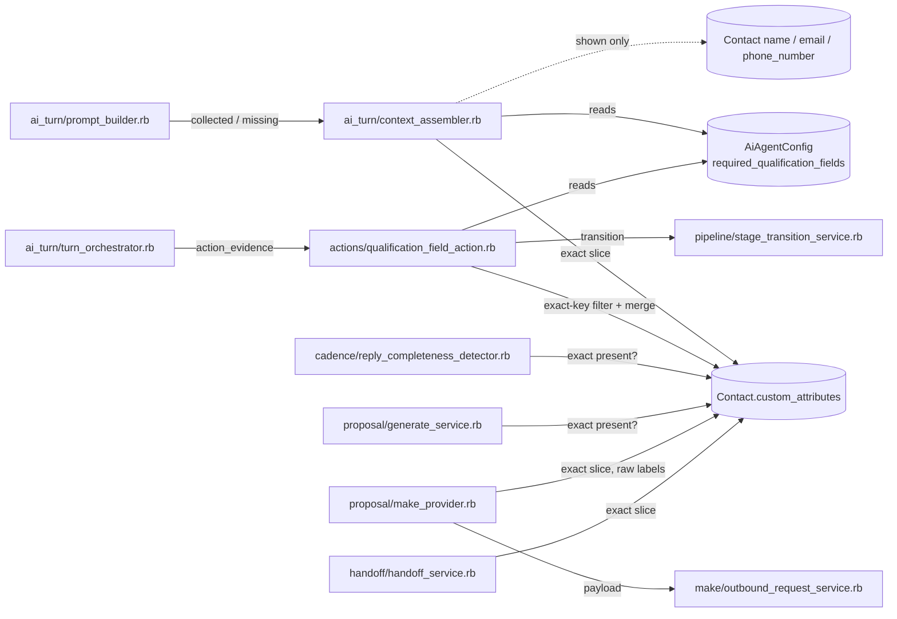
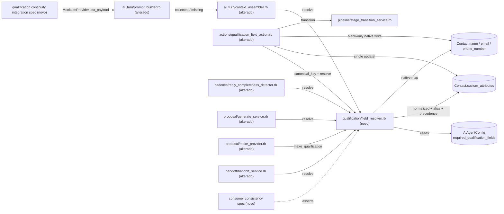

# Implementation Plan

## Request Summary
- Objective: introduzir um resolvedor canônico e determinístico de campos de qualificação (`ScanSolo::Qualification::FieldResolver`) como único leitor da regra "campo satisfeito?", migrar os 6 consumidores para ele, tornar a ação `qualification_field` tolerante a aliases/normalização com captura múltipla sem sobrescrever nativos, adicionar 3 regras fixas de continuidade ao `PromptBuilder` e enviar ao Make o objeto `qualification` com chaves canônicas (CT-05 refinado).
- Scope in: RF-01..RF-18, RF-20, RF-21 (RF-19 removido), RNF-01..RNF-06, CT-05 (refinado), CT-08 (conteúdo de `result`, mesma forma).
- Scope out: Kanban/UX, templates, cenários do Make, RAG, ocultar "Campos faltantes" por etapa, aumento de `RECENT_MESSAGE_LIMIT`, extração por regex/LLM do histórico, linhas "Objetivo do cliente"/"Objeções" da nota de handoff, migrations, exposição de origem no detalhe da oportunidade, passos operacionais pós-deploy.
- Tier: complete
- Architecture references: `AGENTS.md` (= `CLAUDE.md`), `docs/agents/architecture.md`, `docs/agents/domain_rules.md`, `docs/agents/coding_guidelines.md`, `docs/agents/api_contracts.md`; contrato base `.spec/features/scansolo-production-complete/asyncapi.yaml`.

### Regras de arquitetura preservadas (valem para todas as tasks)
- `docs/agents/architecture.md` "Layer responsibilities": Services possuem todas as transições de estado; controllers/views não ganham regra. → O resolvedor é um service em `app/services/scan_solo/qualification/`; nenhum controller, jbuilder ou model muda.
- `docs/agents/domain_rules.md` "Pipeline stage transitions": `ScanSolo::Pipeline::StageTransitionService` é o único writer de etapa. → `QualificationFieldAction` continua delegando `em_contato → em_qualificacao` e `em_qualificacao → qualificado` a ele; só muda a entrada de satisfação.
- `docs/agents/domain_rules.md` "Registered actions": `Actions::Executor` valida o schema e grava `AuditEvent agent_action.<id>` com `result`; Registry/Executor sem chamador fora de `actions/`. → chaves não reconhecidas / não aplicadas saem no hash de retorno da ação (auditado pelo Executor e guardado em `action_evidence` pelo `TurnOrchestrator#execute_actions`), sem caminho novo; `SCHEMA` da ação não muda.
- `AGENTS.md`/`CLAUDE.md` "General Guidelines": regra aplicada no ponto de entrada compartilhado mais cedo, sem guardas duplicadas; menor mudança pronta para produção; sem helpers de uso único; specs com `let` e setup direto. → um único resolvedor; consumidores não reimplementam presença.
- `docs/agents/coding_guidelines.md` §1 (classe compacta `class ScanSolo::Qualification::FieldResolver`), §2 (`.call` + `Struct keyword_init` com predicados), §4 (rejeição de regra de negócio via `ActiveRecord::RecordInvalid` → 422, mantido no `GenerateService`), §9 (specs nunca chamam provider real; usar `MockLlmProvider`).
- `docs/agents/architecture.md`: `enterprise/` "not used by ScanSolo" → 0 referências a `enterprise/` ou `Captain::` em arquivos novos/alterados (RNF-03); `spec/lib/scansolo_no_enterprise_dependency_spec.rb` já cobre `app/**/scan_solo/**`.
- Testes Ruby rodam no container `scansolo-phase2-test`: `docker exec scansolo-phase2-test sh -c 'cd /app && bundle exec rspec <paths>'` (rubocop idem). Gate de regressão: `./scripts/ralph-test.sh` (usa o compose `rails`).

## AS IS — Componentes impactados

Hoje os seis consumidores (verificados em `app/services/scan_solo/`) leem `required_qualification_fields` e comparam a chave exata em `custom_attributes`, cada um com sua lógica; os campos nativos do contato nunca satisfazem campo obrigatório e o `MakeProvider` usa os rótulos crus como chaves (viola o `propertyNames` do CT-05). O `PromptBuilder` não tem regras fixas de continuidade.

## TO BE — Componentes propostos

O `field_resolver.rb` (T01) passa a ser o único leitor da regra de satisfação e a fonte do `qualification` do Make; `context_assembler.rb` (T03), `qualification_field_action.rb` (T04), `reply_completeness_detector.rb` (T05), `generate_service.rb` (T06), `make_provider.rb` (T07) e `handoff_service.rb` (T08) delegam a ele. `prompt_builder.rb` (T09) recebe as regras fixas; a consistência entre consumidores (T10) e a integração com mock LLM (T11) são provadas por specs novas.

## Tasks

### T01 — Resolvedor canônico `ScanSolo::Qualification::FieldResolver`
- **Files**: `app/services/scan_solo/qualification/field_resolver.rb` (novo), `spec/services/scan_solo/qualification/field_resolver_spec.rb` (novo)
- **Change**: classe compacta (novo namespace `ScanSolo::Qualification`, `coding_guidelines.md` §1). Conteúdo:
  - `ALIASES` (Hash congelado, na ordem da tabela RF-04): `nome => ['Nome','nome completo','name']`, `telefone => ['Telefone','WhatsApp']`, `email => ['E-mail','email']`, `tipo_intervencao => ['Objetivo do serviço','tipo de intervenção','escopo']`, `cidade_uf => ['Cidade / UF','cidade']`, `endereco_obra => ['Endereço da obra','endereço']`, `area => ['Área ou extensão','área','area_total']`, `profundidade => ['Profundidade de interesse','profundidade']`, `prazo_desejado => ['Prazo desejado','prazo','urgência']`, `empresa => ['Empresa','razão social','company']`, `integracao_seguranca => ['Integração de segurança']`; a própria chave canônica é grafia aceita. Lookup pré-computado `normalized spelling → canonical`.
  - `NATIVE = { 'nome' => :name, 'email' => :email, 'telefone' => :phone_number }`; `MAKE_KEYS = %w[empresa endereco_obra cidade_uf tipo_intervencao area profundidade prazo_desejado email nome telefone]`.
  - `self.normalize(str)`: `I18n.transliterate(str.to_s.strip).downcase`, separadores `_`, `-`, espaço e `/` equivalentes, consecutivos colapsados, bordas ignoradas, juntados por `_` (ex.: `"Cidade / UF"` → `cidade_uf`). `self.canonical_key(str)`: lookup do alias ou, sem alias (RF-05), o próprio normalizado.
  - `Field = Struct.new(:label, :canonical_key, :value, :origin, :satisfied, keyword_init: true)` com `satisfied?`.
  - `self.call(contact:, config:)` / instância com `fields` (um por entrada de `config.required_qualification_fields`, na ordem da config; `config` nil → lista vazia; `contact` nil → todos insatisfeitos), `missing_labels`, `collected` (`label => value` dos satisfeitos), `required_canonical_keys`, `make_qualification` (avalia as 10 `MAKE_KEYS` independentemente da config; só valores presentes; nunca `integracao_seguranca` nem chaves RF-05).
  - Leitura de valor: chave nativa → valor nativo presente = origem `native`; senão `custom_attributes` com precedência RF-21: (1) chave canônica exata; (2) rótulo exato da config publicada; (3) chaves cujo normalizado casa com as grafias do alias na ordem da tabela (empate lexicográfico); (4) demais chaves cujo `canonical_key` casa, em ordem lexicográfica. Só valores `present?` satisfazem; origem `custom_attribute`.
  - Lê apenas config, campos nativos e `custom_attributes`: sem `messages`, sem LLM, sem HTTP, sem regex sobre texto livre (RF-06/RNF-01). Sem escrita.
- **Covers**: RF-01, RF-02, RF-03, RF-04, RF-05, RF-06, RF-21 (leitura), RNF-01, RNF-03, RNF-06(1)
- **Tests**: `spec/services/scan_solo/qualification/field_resolver_spec.rb` — `name="Leonardo"` satisfaz `"Nome"` (`nome`, `native`); RF-02 (a)(b)(c); variantes de `"Cidade / UF"` e `"Área ou extensão"` normalizam igual; tabela-driven de todas as grafias do RF-04 (inclusive `NOME`, `nome completo`, `name`); RF-05 `"Orçamento"` + `{"orcamento"=>"50k"}`; chaves do Make (`cidade_uf`, `endereco_obra`, …) satisfazem rótulos da config v2; precedência RF-21 (`cidade_uf` vence `"Cidade / UF"`; `"Cidade / UF"` vence `cidade`); `make_qualification` só com as 10 chaves e sem `nil`; determinismo com `ScanSolo::TestMode::MockLlmProvider`/`RubyLLM`/`Net::HTTP` stubados para levantar, `Message` não consultado, duas chamadas iguais.
- **Risk**: Medium — base de todos os consumidores; erro de normalização muda satisfação em 6 lugares. Mitigado por spec tabela-driven.
- **Dependencies**: none

### T02 — Diretiva rubocop inline no spec de ingestão (CRLF)
- **Files**: `spec/services/scan_solo/knowledge/ingestion_service_spec.rb`
- **Change**: acrescentar `# rubocop:disable Rails/SkipsModelValidations` ao final da linha 39 (`source.update_columns(content: "Pergunta 1?\r\n…")`), no mesmo formato das linhas 81/90/100.
- **Covers**: RF-20
- **Tests**: `docker exec scansolo-phase2-test sh -c 'cd /app && bundle exec rubocop spec/services/scan_solo/knowledge/ingestion_service_spec.rb'` — 0 offenses; spec continua verde.
- **Risk**: Low — só comentário.
- **Dependencies**: none

### T03 — `ContextAssembler#pipeline_context` via resolvedor
- **Files**: `app/services/scan_solo/ai_turn/context_assembler.rb`, `spec/services/scan_solo/ai_turn/context_assembler_spec.rb`
- **Change**: `pipeline_context` usa `ScanSolo::Qualification::FieldResolver.call(contact: opportunity.contact, config: config)` (config já carregado, sem nova query): `collected_fields = resolver.collected`, `missing_fields = resolver.missing_labels`. Remove `attributes.slice`/`attributes[field].blank?`. Atualizar o comentário do topo (regra deixa de ser chave exata). `RECENT_MESSAGE_LIMIT` inalterado.
- **Covers**: RF-07, RF-08, RNF-06(3)(5)
- **Tests**: `spec/services/scan_solo/ai_turn/context_assembler_spec.rb` — contato com `name`/`email` nativos e config com `"Nome"`/`"E-mail"` → nenhum em `missing_fields`, ambos em `collected_fields` com os valores nativos; `{"cidade_uf"=>"Rio/RJ"}` com rótulo `"Cidade / UF"` → fora de `missing_fields`.
- **Risk**: Medium — muda o que o modelo vê como faltante; efeito desejado.
- **Dependencies**: T01

### T04 — `QualificationFieldAction`: aliases, captura múltipla, nativos sem sobrescrita, evidência
- **Files**: `app/services/scan_solo/actions/qualification_field_action.rb`, `spec/services/scan_solo/actions/qualification_field_action_spec.rb`
- **Change**: 
  - Carrega a config publicada uma vez; para cada chave submetida, `canonical = FieldResolver.canonical_key(key)`: se `canonical` ∈ `FieldResolver::NATIVE` → candidato nativo (mesmo fora de `required_qualification_fields`); senão se ∈ `resolver.required_canonical_keys` → `custom_attributes[canonical] = value` (grava na chave canônica, nunca reescreve/apaga chave existente — RF-21); senão → `unrecognized_fields << key` verbatim, não persistido.
  - Nativo: valor nativo já presente → não altera, registra em `not_applied_fields` `{ field:, reason: 'native_already_present' }`; em branco → `assign_attributes`. Antes da escrita, `contact.valid?`; para cada atributo nativo atribuído com erro (formato/unicidade de `email`, formato E.164/unicidade de `phone_number` — `app/models/contact.rb:51-56`) restaura o valor persistido e registra `{ field:, reason: <errors.full_messages_for> }`.
  - Uma única `contact.save!` com nativos válidos + `custom_attributes.merge(...)` quando houver mudança (1 UPDATE).
  - Transições (sempre via `StageTransitionService`, `domain_rules.md`): `em_contato → em_qualificacao` quando a chamada aceitou ≥1 chave que resolve para campo obrigatório publicado (ver Open Questions Q1); `em_qualificacao → qualificado` quando a config tem campos obrigatórios e um resolvedor recalculado sobre o contato salvo não tem `missing_labels`. Chaves nativas fora da lista obrigatória nunca disparam transição.
  - Retorno: `{ opportunity_id:, contact_id:, updated_fields: [...], not_applied_fields: [{ field:, reason: }], unrecognized_fields: [...] }` — o Executor audita em `agent_action.qualification_field` e o orquestrador guarda em `action_evidence[].result` (CT-08, forma inalterada). `SCHEMA` inalterado. Atualizar o comentário do topo.
- **Covers**: RF-07, RF-09, RF-10, RF-11, RF-12, RF-21 (escrita), CT-08, RNF-02, RNF-06(2)
- **Tests**: `spec/services/scan_solo/actions/qualification_field_action_spec.rb` — AC de RF-09 (4 campos, config v2 + `"Nome"`, 1 UPDATE contado via `ActiveSupport::Notifications` `sql.active_record` `UPDATE "contacts"`); config v2 sem `"Nome"` + `{nome: "Leonardo"}` → `contact.name` gravado, não listado como desconhecido, etapa inalterada; RF-10 (nome preenchido não muda e aparece em `not_applied_fields`; nome em branco é gravado; `email: "invalido"` + `cidade_uf` → email em branco, motivo de validação, `cidade_uf` salvo, 1 UPDATE, sem exceção); RF-11 (`cor_favorita` em `unrecognized_fields`, ausente do contato, presente no payload do `AuditEvent agent_action.qualification_field` via `Actions::Registry.call`); RF-12 (único faltante satisfeito por nativo → `qualificado` 1x; um faltante → inalterado; asserção de que `Proposal::GenerateService` continua exigindo todos os campos); RF-21 (`{"Cidade / UF": "Macaé/RJ"}` grava `custom_attributes["cidade_uf"]`, mantém `"Cidade / UF"`, leitura seguinte devolve `"Macaé/RJ"`). Exemplos existentes (`budget`/`timeline`) continuam verdes via RF-05.
- **Risk**: High — escreve em `Contact` (upstream) e dispara transições; risco de sobrescrever `contact.name` do WhatsApp e de antecipar `qualificado`. Mitigado por RF-10 e specs de transição.
- **Dependencies**: T01

### T05 — `ReplyCompletenessDetector` via resolvedor
- **Files**: `app/services/scan_solo/cadence/reply_completeness_detector.rb`, `spec/services/scan_solo/cadence/reply_completeness_detector_spec.rb`
- **Change**: `missing_fields` = `FieldResolver.call(contact: opportunity.contact, config: ScanSolo::AiAgentConfig.published_for(opportunity.account)).missing_labels`; remove `required_fields` e o `custom_attributes[field].blank?`. Regra de cancelamento (tudo vs. imediata) inalterada via `LifecycleService`/`AttemptEvidenceRecorder`. Atualizar comentário do topo.
- **Covers**: RF-07, RF-13
- **Tests**: `spec/services/scan_solo/cadence/reply_completeness_detector_spec.rb` — campos restantes satisfeitos só por nativo/alias → `complete? == true` e todas as tentativas agendadas canceladas; um insatisfeito → só a primeira agendada por enrollment ativo cancelada.
- **Risk**: Medium — passa a cancelar mais tentativas de cadência (efeito esperado).
- **Dependencies**: T01

### T06 — `GenerateService` (gate de proposta) via resolvedor
- **Files**: `app/services/scan_solo/proposal/generate_service.rb`, `spec/services/scan_solo/proposal/generate_service_spec.rb`
- **Change**: `missing_required_fields` = `FieldResolver.call(contact: opportunity.contact, config: published_for(...)).missing_labels`; mantém `reject_if_incomplete!` com a mesma mensagem 422 `campos obrigatórios da proposta incompletos: <labels>` via `ActiveRecord::RecordInvalid` (`coding_guidelines.md` §4). Atualizar comentário.
- **Covers**: RF-07, RF-14, RNF-04
- **Tests**: `spec/services/scan_solo/proposal/generate_service_spec.rb` — `email` nativo + `"E-mail"` obrigatório + demais via alias → gera versão; um insatisfeito → `ActiveRecord::RecordInvalid` citando exatamente esse rótulo, 0 `ProposalVersion`. `spec/requests/api/v1/accounts/scan_solo/proposals_spec.rb` passa sem modificação.
- **Risk**: Medium — gate de proposta pode liberar mais cedo (desejado).
- **Dependencies**: T01

### T07 — `MakeProvider`: `qualification` canônico (CT-05)
- **Files**: `app/services/scan_solo/proposal/make_provider.rb`, `spec/services/scan_solo/proposal/make_provider_spec.rb`
- **Change**: `qualification = FieldResolver.call(contact: opportunity.contact, config: config).make_qualification` — 10 chaves fixas avaliadas independentemente da config, só presentes, sem `null`, sem `integracao_seguranca`/RF-05. Demais campos do payload inalterados. Atualizar comentário (referenciar `.spec/features/scansolo-agent-qualification-continuity/asyncapi.yaml`).
- **Covers**: RF-07, RF-15, CT-05, RNF-04
- **Tests**: `spec/services/scan_solo/proposal/make_provider_spec.rb` — config v2 publicada com valores sob os rótulos em português + `name`/`email` nativos → `qualification` só com chaves da lista, todas `^[a-z0-9_]+$`, valores iguais aos gravados; config v2 sem `"Nome"`/`"Telefone"` + nativos → `nome` e `telefone` enviados; chave sem valor ausente (sem `nil`). Os exemplos existentes que esperam `{ 'budget' => '5000' }` são reescritos (comportamento substituído por CT-05 refinado: `budget` não é chave canônica).
- **Risk**: High — muda o payload externo do Make; um cenário do Make que lê rótulos crus deixaria de recebê-los ([UNVERIFIED], HG-03).
- **Dependencies**: T01

### T08 — `HandoffService`: linha "Campos de qualificação coletados" via resolvedor
- **Files**: `app/services/scan_solo/handoff/handoff_service.rb`, `spec/services/scan_solo/handoff/handoff_service_spec.rb`
- **Change**: `qualification_fields` usa `FieldResolver.call(contact:, config: published_for(conversation.account)).collected` → `"<rótulo>: <valor>"` na ordem da config, `nenhum` quando vazio/sem contato. As outras 8 linhas (inclusive `objective`/`objections`) inalteradas.
- **Covers**: RF-07, RF-16
- **Tests**: `spec/services/scan_solo/handoff/handoff_service_spec.rb` — `email` nativo + `{"cidade_uf"=>"Rio/RJ"}` + config v2 → linha contém `E-mail: <email>` e `Cidade / UF: Rio/RJ`; demais linhas inalteradas.
- **Risk**: Low — texto de nota interna.
- **Dependencies**: T01

### T09 — `PromptBuilder`: regras fixas de continuidade + instrução de registro
- **Files**: `app/services/scan_solo/ai_turn/prompt_builder.rb`, `spec/services/scan_solo/ai_turn/prompt_builder_spec.rb`
- **Change**: constante congelada `CONTINUITY_RULES` com as 3 frases verbatim do RF-17; seção `'Regras fixas de atendimento'` como primeira chave de `rule_sections` (antes de `'Regras do agente'`), não lida da config. `ACTION_DESCRIPTIONS['qualification_field']` passa a instruir registrar todos os dados de qualificação informados na mensagem do cliente numa única chamada de `qualification_field` com todos os campos (aparece só quando a ação é oferecida — RF-18).
- **Covers**: RF-17 (unit), RF-18, RNF-06(3)
- **Tests**: `spec/services/scan_solo/ai_turn/prompt_builder_spec.rb` — system message contém as 3 frases verbatim com índice menor que `## Regras do agente`; alterar campos da config não as muda; instrução de registro presente quando `qualification_field` ofertada e ausente quando não.
- **Risk**: Low — texto de prompt; muda comportamento do modelo em produção (desejado).
- **Dependencies**: none

### T10 — Spec de consistência dos 6 consumidores + dados sob rótulos antigos
- **Files**: `spec/services/scan_solo/qualification/consumer_consistency_spec.rb` (novo)
- **Change**: para o mesmo contato (nativos + custom sob chave canônica, rótulo e alias) e config v2 + `"Nome"` publicada, derivar satisfeitos/faltantes de: `ContextAssembler` (`pipeline_context`), `ReplyCompletenessDetector` (`missing_fields`), `GenerateService` (mensagem 422 ou sucesso), `HandoffService` (linha da nota), `MakeProvider` (chaves de `qualification` ∩ canônicas do resolvedor, stub de `Make::OutboundRequestService`), `QualificationFieldAction` (transição `qualificado` sse nada falta) — conjuntos idênticos. Asserção estática: os 6 arquivos consumidores não contêm `required_qualification_fields` nem `custom_attributes[field]`. Cenário "oportunidade com dados sob rótulos antigos/alternativos" reconhecida via alias em todos.
- **Covers**: RF-07, RNF-06(4)(5)
- **Tests**: o próprio arquivo.
- **Risk**: Low — só spec.
- **Dependencies**: T03, T04, T05, T06, T07, T08

### T11 — Integração com mock LLM (continuidade ponta a ponta)
- **Files**: `spec/integration/scan_solo/qualification_continuity_spec.rb` (novo)
- **Change**: turnos reais via `ScanSolo::AiTurn::TurnOrchestrator.call(message:, llm_provider: ->(**kw) { ScanSolo::TestMode::MockLlmProvider.call(**kw, fixture_actions: [...]) })` (padrão de `turn_orchestrator_actions_spec.rb`), asserindo em `MockLlmProvider.last_payload` e no que a ação fixture salvou: (a) 3 regras fixas no system; (b) contato com `name` → `missing_fields`/"Campos faltantes" sem `Nome`; (c) pergunta técnica (tubo de PVC) presente no histórico do payload; resposta parcial (fixture grava parte dos campos → próximo payload só lista o restante); dados fora de ordem (fixture `{prazo_desejado, cidade_uf, area}` → todos salvos); (d) retorno após handoff (`HandoffService` → `ReturnToAiService` → nova mensagem: `missing_fields` exclui todos já satisfeitos); chave desconhecida da fixture aparece em `AiTurn#action_evidence` e em `GET /api/v1/accounts/:account_id/scan_solo/ai_turns/:correlation_id`. Texto de resposta do mock não é assertado.
- **Covers**: RF-17 (integração), RF-08, RF-11, RNF-06(6)
- **Tests**: o próprio arquivo.
- **Risk**: Low — só spec; depende de elegibilidade (`allowed_inbox_ids`) como em `full_test_mode_spec.rb`.
- **Dependencies**: T03, T04, T09

### T12 — Documentação e contrato base (sem drift do `/ai-context`)
- **Files**: `docs/agents/domain_rules.md`, `.spec/features/scansolo-production-complete/asyncapi.yaml`
- **Change**: `domain_rules.md` "Reply completeness" e "Proposal lifecycle" citam o `ScanSolo::Qualification::FieldResolver` no lugar de `contact.custom_attributes[field].present?`; `asyncapi.yaml` do ciclo anterior: `qualification.description` passa a "fixed canonical key set, present-only" com ponteiro para o asyncapi desta feature. Nenhuma outra linha.
- **Covers**: CT-05 (documentação), FLEXIBLE
- **Tests**: `grep -n "custom_attributes\[field\]" docs/agents/domain_rules.md` vazio; `spec/lib/scansolo_*doc*_spec.rb` verdes.
- **Risk**: Low — docs.
- **Dependencies**: T07

### T13 — Gates de qualidade e regressão
- **Files**: nenhum arquivo novo (verificação)
- **Change**: rubocop em todos os `.rb` alterados; `./scripts/ralph-test.sh`; probes RNF-02 (`git diff --stat main -- db/` vazio), RNF-03 (`grep -rnE "enterprise/|Captain::"` nos arquivos alterados vazio), RNF-04 (`git diff main -- spec/requests` vazio).
- **Covers**: RNF-02, RNF-03, RNF-04, RNF-05
- **Tests**: `docker exec scansolo-phase2-test sh -c 'cd /app && bundle exec rubocop <arquivos alterados>'` → 0 offenses; `./scripts/ralph-test.sh` → exit 0.
- **Risk**: Low — verificação.
- **Dependencies**: T01..T12

## Execution Phases
| Phase | Tasks | Parallel-safe? |
|-------|-------|----------------|
| 1 — Fundação: resolvedor, prompt, housekeeping | T01, T02, T09 | Yes (arquivos disjuntos) |
| 2 — Migração dos 6 consumidores | T03, T04, T05, T06, T07, T08 | Yes (um arquivo de serviço + spec por task; todos dependem só de T01) |
| 3 — Provas cruzadas e documentação | T10, T11, T12 | Yes (arquivos disjuntos) |
| 4 — Gates de qualidade | T13 | No (depende de tudo) |

## Contracts emitted
| Artifact | Path | RFs covered | Compatibility |
|---|---|---|---|
| AsyncAPI 3.0 (delta CT-05) | `.spec/features/scansolo-agent-qualification-continuity/asyncapi.yaml` | RF-15 (CT-05) | Compatível com o schema publicado em `.spec/features/scansolo-production-complete/asyncapi.yaml` v1.2.0: envelope, canal, operação, headers e demais campos idênticos; `qualification` restringido (10 chaves fixas `^[a-z0-9_]+$`, `additionalProperties: false`, valores sem `null`) — subconjunto do que o schema anterior aceitava. Divergência de runtime sinalizada: produção hoje envia rótulos crus (que já violavam o schema); consumidor Make que dependa deles precisa ser remapeado (Open Questions Q2). |

CT-08 (`action_evidence[].result`) mantém a forma livre documentada no openapi do ciclo anterior — nenhum artefato novo. CT-01..CT-04, CT-06, CT-07, CT-09..CT-11 inalterados.

## Risks
| Risk | Blast radius | Mitigation | Rollback |
|------|-------------|------------|----------|
| Sobrescrever `contact.name` do WhatsApp com valor pior | Todos os contatos de contas ScanSolo com agente ativo | RF-10: nativo só é escrito quando em branco; spec T04 | Reverter commit; nomes já gravados só em contatos que estavam em branco |
| Satisfação mais ampla antecipa `em_qualificacao → qualificado` e libera gate de proposta | Pipeline e propostas de oportunidades abertas | Transição só via `StageTransitionService` com resolvedor completo; spec T04 RF-12 + T06 | Reverter commit; transições já feitas ficam registradas em `PipelineStageEvent` (ajuste manual via API de stage) |
| `ReplyCompletenessDetector` cancela mais tentativas de cadência | Cadências ativas de oportunidades com dados sob alias/nativos | Spec T05; efeito esperado (lead já respondeu) | Reverter; tentativas canceladas não são reescritas (reenrollment manual) |
| Payload do Make muda de rótulos crus para chaves canônicas | Cenário Make de geração/envio de proposta | Contrato emitido; comunicar operador antes do deploy (Q2) | Reverter commit do `MakeProvider` (T07) isoladamente |
| Escrita de `email` nativo dispara callbacks upstream (`Enterprise::Concerns::Contact#associate_company_from_email` quando feature `companies` ativa) | Contato/empresa na conta | Comportamento intrínseco do model `Contact`, não referenciado pelo ScanSolo (RNF-03); validação antes do save | Reverter commit |
| Normalização/alias incorreta muda satisfação nos 6 consumidores | Todo o fluxo de qualificação | Resolvedor único + spec tabela-driven (T01) + consistência (T10) | Reverter commit |
| Mudança de texto do prompt altera comportamento do modelo | Respostas do agente em produção | Regras fixas verbatim do SPEC; teste controlado pós-deploy (operador) | Reverter T09 isoladamente |

Rollout: deploy com `deploy-release.sh fix/agent-qualification-continuity <commit>` (sem recarregar cadências); sem migration. Pós-deploy (operador, fora do escopo do sistema): recolocar "Nome" em `required_qualification_fields`, repetir teste real (nome + PVC + "Boa tarde" duas vezes) com contato controlado, conferir `GET /scan_solo/ai_turns/:correlation_id`.

## Open Questions
- Q1 (RF-12 × comportamento atual): hoje `em_contato → em_qualificacao` dispara em qualquer chamada da ação, mesmo sem campo aceito. O plano passa a dispará-la só quando a chamada aceita ≥1 chave que resolve para campo obrigatório publicado (aplicada ou já preenchida), para cumprir "chaves nativas fora da lista nunca disparam transição" (RF-09/RF-12). Impacto: chamada só com chaves desconhecidas deixa de mover a etapa. Se a regra antiga deve ser mantida para esse caso, T04 muda só a condição.
- Q2 (CT-05, runtime): o cenário do Make em produção lê as chaves de `qualification` pelos rótulos crus da config v2 (`Cidade / UF`, …)? [UNVERIFIED — cenário externo, HG-03]. Se sim, precisa ser remapeado para as chaves canônicas antes/junto do deploy; o plano não altera cenários (fora de escopo).
- Q3 (RF-09, duplicidade na mesma chamada): quando duas chaves da mesma chamada resolvem para a mesma canônica (ex.: `cidade_uf` e `"Cidade / UF"`), o plano grava o último valor na ordem do hash recebido. O SPEC não define; sem impacto em contratos.

## Assumptions
- Os 6 consumidores são os únicos leitores de satisfação: `grep required_qualification_fields app` só mostra, além deles, `prompt_builder.rb:68` (lista de rótulos, não satisfação), o model e o controller de config (verificado).
- `Actions::Executor#serialize_result` grava o hash de retorno no payload do `AuditEvent` e `TurnOrchestrator#execute_actions` o guarda em `action_evidence` (verificado em `executor.rb:100-116`, `turn_orchestrator.rb:175-185`); `_ai_turn.json.jbuilder:16` expõe `action_evidence` sem transformação.
- `Contact` valida `email` (formato + unicidade por conta) e `phone_number` (E.164 + unicidade por conta) e normaliza `email` para minúsculas em `before_validation` (verificado em `app/models/contact.rb:51-56,218-225`); `contact.valid?` antes do save identifica atributos nativos inválidos.
- `I18n.transliterate` remove acentos pt-BR (`ç`, `ã`, `é`) sem gem nova [UNVERIFIED no container; coberto pela spec de T01].
- A guarda existente "lista obrigatória vazia nunca transiciona para `qualificado`" de `QualificationFieldAction` é preservada (não é checagem de presença de campo).
- `RECENT_MESSAGE_LIMIT = 20` é suficiente: a falha reproduzida vinha da regra de satisfação e da ausência de regras fixas, não da janela; não há evidência de truncamento nos casos reportados.
- Specs Ruby rodam no container `scansolo-phase2-test` (host bundle quebrado); `./scripts/ralph-test.sh` usa o compose `rails` — ambos disponíveis localmente (containers listados em `docker ps`).
- Nenhum arquivo em `enterprise/` sobrescreve os 6 consumidores ou o `PromptBuilder` (namespace `ScanSolo::` exclusivo do fork).
