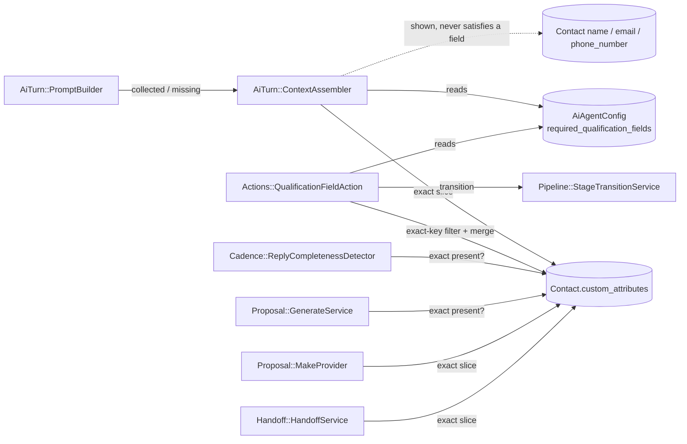
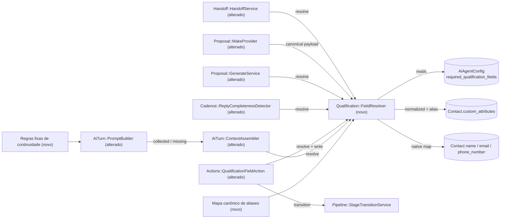

# SPEC: scansolo-agent-qualification-continuity

## Metadata
- Source: developer description via /plan (`.spec/inputs/scansolo-agent-qualification-continuity.md`) + developer-confirmed ACs (`.spec/features/scansolo-agent-qualification-continuity/.handoff/confirmed-input.md`)
- Service: ss-aiagentsystem (Chatwoot fork, `ScanSolo::` namespace, Rails monolith)
- Tier: complete
- Version: 1.1
- Architecture references: `AGENTS.md`, `docs/agents/architecture.md`, `docs/agents/domain_rules.md` (auxiliary: `docs/agents/api_contracts.md`, `CLAUDE.md`, `.spec/features/scansolo-production-complete/SPEC.md` + `asyncapi.yaml` for CT-01..CT-11)

### Architecture rules applied (cited)
- `docs/agents/architecture.md` "Layer responsibilities": Services own all state transitions and "sole path" writers; Controllers own no business rules; Views/jbuilder own only JSON shape. → The resolver is a service (`app/services/scan_solo/`), and every consumer delegates the "field satisfied?" rule to it (single reader/writer rule, AC3).
- `docs/agents/domain_rules.md` "Pipeline": `ScanSolo::Pipeline::StageTransitionService` is the sole stage writer. → `qualification_field` keeps delegating `em_contato → em_qualificacao` / `em_qualificacao → qualificado` to it; only the satisfaction input changes.
- `docs/agents/domain_rules.md` "Registered actions": `Actions::Executor` JSON-schema-validates params and records `AuditEvent agent_action.<id>`; Registry/Executor have no caller outside `actions/`. → Unrecognized keys are reported through the action result (which the Executor audits and the orchestrator stores as `action_evidence`), not a new path.
- `AGENTS.md` / `CLAUDE.md` "General Guidelines": "Enforce eligibility and exclusivity rules at the earliest shared entry point. Do not repeat backup guards across downstream …" → one resolver, no per-consumer re-implementations.
- `docs/agents/architecture.md`: `enterprise/` is "upstream proprietary overlay (not used by ScanSolo)" → no `enterprise/` / `Captain::` dependency (RNF-03).

## Context

Production (2026-09-25) reproduced four continuity failures of the ScanSolo AI agent: (1) lead answers "Leonardo" and the agent asks the name again (then "nome completo"); (2) a technical question (PVC pipe) is ignored in favor of asking the name; (3) several data points given in one message ("obra no Rio, 800 m², escavar amanhã") are not all recorded; (4) the agent greets twice ("Boa tarde, Milena!" on the 1st and 2nd reply). An interim mitigation (Agent Center config v2) removed "Nome" and "Telefone" from `required_qualification_fields`; published required fields today: `Objetivo do serviço`, `Cidade / UF`, `Endereço da obra`, `Área ou extensão`, `Profundidade de interesse`, `Prazo desejado`, `Integração de segurança`, `Empresa`, `E-mail`.

Root cause, confirmed in code:
- `ContextAssembler#pipeline_context` computes `missing_fields` only from `contact.custom_attributes` with exact-key lookup (verified at `app/services/scan_solo/ai_turn/context_assembler.rb:83-84`); native `contact.name/email/phone_number` never satisfy a required field; no key normalization or aliasing.
- `QualificationFieldAction` silently drops any key that is not an exact member of `required_qualification_fields` (verified at `app/services/scan_solo/actions/qualification_field_action.rb:37`).
- The "field satisfied?" rule is duplicated in 6 places, each exact-key over `custom_attributes`: `context_assembler.rb:84`, `qualification_field_action.rb:65`, `cadence/reply_completeness_detector.rb:52`, `proposal/generate_service.rb:54`, `proposal/make_provider.rb:22`, `handoff/handoff_service.rb:109`.
- `PromptBuilder#rule_sections` contains only config-driven sections; there are no fixed non-repetition / answer-first / single-greeting rules (verified at `app/services/scan_solo/ai_turn/prompt_builder.rb:60-70`).
- Contract finding: CT-05 (asyncapi `qualification.propertyNames.pattern: '^[a-z0-9_]+$'`, verified at `.spec/features/scansolo-production-complete/asyncapi.yaml:218-225`) is already violated by config v2 labels such as `Cidade / UF`, because `MakeProvider` uses the raw config labels as keys. RF-15 restores conformance.

## AS IS — Estado atual

Hoje cada um dos seis consumidores lê `required_qualification_fields` e compara a chave exata em `custom_attributes`, com lógica própria. Os campos nativos do contato só aparecem no prompt como contexto e nunca satisfazem um campo obrigatório; o `PromptBuilder` não tem regras fixas de continuidade.

## TO BE — Estado proposto

O novo resolvedor (RF-01..RF-06) com o mapa canônico de aliases (RF-04) passa a ser o único leitor da regra "campo satisfeito?", consumido pelo `ContextAssembler` (RF-08), `QualificationFieldAction` (RF-09..RF-12), `ReplyCompletenessDetector` (RF-13), `GenerateService` (RF-14), `MakeProvider` (RF-15, CT-05) e `HandoffService` (RF-16). O `PromptBuilder` recebe as regras fixas de continuidade (RF-17, RF-18); a transição de etapa continua exclusiva do `StageTransitionService`.

## Scope
- **In**:
  - Deterministic canonical qualification-field resolver (value + origin + satisfied) over published `required_qualification_fields`, native contact fields and `custom_attributes`, with key normalization and a canonical alias map.
  - Migration of the 6 consumers to the resolver (single reader rule).
  - `qualification_field` action: normalized/alias keys, multi-field capture, no overwrite of filled native fields, unrecognized keys reported in the action evidence.
  - `PromptBuilder`: 3 fixed continuity rules + instruction to register every informed datum via `qualification_field`.
  - `MakeProvider` CT-05 `qualification` payload with canonical keys.
  - Inline `# rubocop:disable Rails/SkipsModelValidations` on `spec/services/scan_solo/knowledge/ingestion_service_spec.rb:39` (verified: the CRLF test's `update_columns` line, the only one of four without the directive).
  - Specs listed in RNF-06 and the regression gate `./scripts/ralph-test.sh` (verified at `scripts/ralph-test.sh`).
- **Out**:
  - Kanban/UX changes, templates, Make scenarios, RAG, hiding "Campos faltantes" per stage (cycle 2).
  - Increasing the history window `RECENT_MESSAGE_LIMIT = 20` (verified at `context_assembler.rb:20`) — only if PLAN proves it necessary.
  - Extracting qualification data from conversation history by regex/LLM inside the resolver.
  - `HandoffService` "Objetivo do cliente"/"Objeções" lines (read `custom_attributes['objective'|'objections']`, not required-field satisfaction).
  - Any destructive migration; any change to CT-01..CT-11 other than the ones listed under Contracts.
  - Post-deploy operational steps (re-adding "Nome" to the Agent Center config; controlled production test) — operator actions, not system requirements.

## RIGID (Non-Negotiable)

### Functional Requirements

#### Resolver

- RF-01 [Ubiquitous] (AC1): THE SYSTEM SHALL provide a single qualification-field resolver that, given an account's published agent config and a contact, returns for each entry of `required_qualification_fields` (in config order): the config label, its canonical key, the current value, the origin (`native` | `custom_attribute`, or none when unsatisfied) and a boolean `satisfied`.
  - AC: for a contact with `name = "Leonardo"` and config containing `"Nome"`, the resolver returns for `"Nome"`: canonical key `nome`, value `"Leonardo"`, origin `native`, `satisfied = true`; for a required field with no data it returns `satisfied = false` and no value.

- RF-02 [State-driven] (AC1): WHILE resolving a field whose canonical key is `nome`, `email` or `telefone`, THE SYSTEM SHALL read `contact.name`, `contact.email` or `contact.phone_number` respectively; WHEN that native value is present THE SYSTEM SHALL report origin `native`; WHEN it is blank THE SYSTEM SHALL fall back to `custom_attributes` keys matching the field (RF-03/RF-04) and report origin `custom_attribute`.
  - AC: (a) `contact.email = "a@b.com"` satisfies `"E-mail"` with origin `native`; (b) `contact.name` blank and `custom_attributes = {"Nome" => "Ana"}` satisfies `"Nome"` with origin `custom_attribute`; (c) all three blank and no matching custom attribute → `satisfied = false`.

- RF-03 [Ubiquitous] (AC2): THE SYSTEM SHALL compare config labels, alias entries and `custom_attributes` keys by a normalized form: leading/trailing whitespace trimmed, case-insensitive, diacritics removed, and `_`, `-`, whitespace and `/` treated as equivalent separators (consecutive separators collapse into one; leading/trailing separators ignored).
  - AC: `"Cidade / UF"`, `"cidade_uf"`, `" CIDADE/UF "`, `"cidade-uf"` and `"cidade uf"` all normalize to the same form; `"Área ou extensão"` and `"area_ou_extensao"` normalize to the same form.

- RF-04 [Ubiquitous] (AC2): THE SYSTEM SHALL resolve labels and keys through this canonical alias map (any listed spelling, after RF-03 normalization, maps to the canonical key):

  | Config v2 label / aliases | Canonical key | Source |
  |---|---|---|
  | "Nome" / "nome completo" / "name" | `nome` | native `contact.name` |
  | "Telefone" / "WhatsApp" | `telefone` | native `contact.phone_number` |
  | "E-mail" / "email" | `email` | native `contact.email` |
  | "Objetivo do serviço" / "tipo de intervenção" / "escopo" | `tipo_intervencao` | `custom_attributes` |
  | "Cidade / UF" / "cidade" | `cidade_uf` | `custom_attributes` |
  | "Endereço da obra" / "endereço" | `endereco_obra` | `custom_attributes` |
  | "Área ou extensão" / "área" / "area_total" | `area` | `custom_attributes` |
  | "Profundidade de interesse" / "profundidade" | `profundidade` | `custom_attributes` |
  | "Prazo desejado" / "prazo" / "urgência" | `prazo_desejado` | `custom_attributes` |
  | "Empresa" / "razão social" / "company" | `empresa` | `custom_attributes` |
  | "Integração de segurança" | `integracao_seguranca` | `custom_attributes` (qualification only; no Make key) |

  The canonical key itself is also an accepted spelling of its own entry. The map is a frozen code constant: it is not persisted, not editable through the agent config draft/publish flow or any other runtime path, and requires no migration (CT-01 unchanged).
  - AC: each spelling in the table, in any casing/accent/separator variant, resolves to its canonical key; `"NOME"`, `"nome completo"` and `"name"` all resolve to `nome`; the change adds 0 migrations for the alias map.

- RF-05 [Conditional] (AC2): IF a required config label matches no alias-map entry, THEN THE SYSTEM SHALL use the label's normalized form as its canonical key and consider it satisfied only when a `custom_attributes` key with the same normalized form holds a present value.
  - AC: config label `"Orçamento"` and `custom_attributes = {"orcamento" => "50k"}` → satisfied, origin `custom_attribute`; `custom_attributes = {}` → unsatisfied.

- RF-06 [Unwanted] (constraint "resolvedor é determinístico"): IF resolution is requested, THEN THE SYSTEM SHALL derive values only from the published config, the contact's native fields and `custom_attributes`, and SHALL NOT read conversation messages or invoke any regex extraction over free text, LLM or external HTTP service.
  - AC: resolver spec with the LLM provider and HTTP stubbed to raise → resolution succeeds; two consecutive calls with unchanged inputs return equal results.

- RF-07 [Ubiquitous] (AC3): THE SYSTEM SHALL make `ai_turn/context_assembler`, `actions/qualification_field_action`, `cadence/reply_completeness_detector`, `proposal/generate_service`, `proposal/make_provider` and `handoff/handoff_service` obtain field satisfaction and values exclusively from the RF-01 resolver.
  - AC: consistency spec — for the same contact and published config, the set of satisfied labels and the set of missing labels derived from each of the 6 consumers' outputs are identical; no consumer file contains its own `custom_attributes[field]` presence check over `required_qualification_fields`.

#### Consumers

- RF-08 [Event-driven] (AC3, AC6): WHEN the turn context is assembled for a conversation with an opportunity, THE SYSTEM SHALL set `pipeline_context.collected_fields` to the satisfied fields (config label → value) and `pipeline_context.missing_fields` to the unsatisfied config labels, both from the resolver.
  - AC: contact with native `name` and `email` present and config containing `"Nome"` and `"E-mail"` → `missing_fields` contains neither; `collected_fields` contains both with the native values. An opportunity whose data sits under old/alternative keys (e.g. `custom_attributes = {"cidade_uf" => "Rio/RJ"}` for label `"Cidade / UF"`) does not list that label in `missing_fields`.

- RF-09 [Event-driven] (AC4): WHEN the `qualification_field` action receives `fields`, THE SYSTEM SHALL resolve each submitted key through RF-03/RF-04/RF-05 and accept it when it resolves to a published required field OR to one of the native canonical keys `nome`, `email`, `telefone` (even if not in `required_qualification_fields`; native writes follow RF-10), and persist every accepted key/value pair of that call in a single contact update.
  - AC: with config v2 plus `"Nome"`, `fields = {nome: "Leonardo", cidade_uf: "Rio/RJ", area: "800 m²", prazo_desejado: "amanhã"}` on a contact with blank name → after the call the resolver reports `Nome`, `Cidade / UF`, `Área ou extensão`, `Prazo desejado` as satisfied with those values, and exactly 1 contact update was issued. With config v2 (no `"Nome"`/`"Telefone"` required) and a contact with blank name, `fields = {nome: "Leonardo"}` → `contact.name = "Leonardo"`, the key is not reported as unrecognized, and the opportunity stage is not changed by this key alone.

- RF-10 [Unwanted] (AC4, risk "sobrescrever contact.name"): IF a submitted key resolves to a native field (`nome`, `email`, `telefone`) whose native value is already present, THEN THE SYSTEM SHALL NOT change that native value; IF the native value is blank, THEN THE SYSTEM SHALL write the submitted value to the native field. IF a submitted native value would fail `Contact` model validation (`email` format/uniqueness per account, `phone_number` E.164 format — verified at `app/models/contact.rb:51-56`), THEN THE SYSTEM SHALL validate it before the write, drop only that native attribute, report it in the action result as not applied with the reason, and still save all other accepted pairs in exactly one contact update (the action does not fail).
  - AC: contact `name = "Milena (WhatsApp)"` + `fields = {nome: "Milena Souza"}` → `contact.name` unchanged and the key is reported as not applied in the action result; contact with blank `name` + same call → `contact.name = "Milena Souza"`; contact with blank `email` + `fields = {email: "invalido", cidade_uf: "Rio/RJ"}` → `contact.email` stays blank, `email` listed as not applied with a validation reason, `cidade_uf` persisted, exactly 1 contact update issued, action result is success.

- RF-11 [Conditional] (AC4): IF a submitted key does not resolve to any published required field nor to a native canonical key (`nome`, `email`, `telefone`), THEN THE SYSTEM SHALL not persist it and SHALL list it verbatim in the action result, which is stored in the turn's `action_evidence` (verified at `app/services/scan_solo/ai_turn/turn_orchestrator.rb:175`) and in the `agent_action.qualification_field` audit payload (verified at `app/services/scan_solo/actions/executor.rb:100-106`).
  - AC: `fields = {cidade_uf: "Rio/RJ", cor_favorita: "azul"}` → `cidade_uf` persisted; `cor_favorita` absent from the contact and present in the action result's unrecognized-keys list; `GET /ai_turns/:correlation_id` `action_evidence` shows it.

- RF-12 [Event-driven] (AC4, risk "antecipar qualificado"): WHEN the `qualification_field` action completes, THE SYSTEM SHALL keep the existing stage rules — `em_contato → em_qualificacao`, and `em_qualificacao → qualificado` only when the resolver reports every published required field satisfied (native keys accepted under RF-09 but absent from `required_qualification_fields` never drive a transition) — executed through `Pipeline::StageTransitionService`.
  - AC: `em_qualificacao` opportunity whose only missing field becomes satisfied by a native value → transitions to `qualificado` once; any required field still unsatisfied → stage unchanged; a `qualificado` transition via this path is covered by a spec that also asserts the proposal gate behavior is unchanged.

- RF-13 [Event-driven] (AC3, risk "ReplyCompletenessDetector"): WHEN reply completeness is evaluated for an opportunity, THE SYSTEM SHALL compute `missing_fields` from the resolver, cancelling all pending cadence attempts when none is missing and only the immediate pending attempt otherwise.
  - AC: opportunity whose remaining fields are satisfied only via native/alias values → `complete? == true` and all scheduled attempts cancelled; one field unsatisfied → only the earliest scheduled attempt per active enrollment cancelled.

- RF-14 [Conditional] (AC3): IF proposal generation is requested and the resolver reports any required field unsatisfied, THEN THE SYSTEM SHALL reject with the existing 422 error `campos obrigatórios da proposta incompletos: <labels>` listing the unsatisfied config labels, creating no `ProposalVersion`.
  - AC: native `email` present, `"E-mail"` required, all else satisfied via aliases → generation proceeds; one field unsatisfied → 422 naming exactly that label, 0 versions created.

- RF-15 [Event-driven] (AC7): WHEN a Make generate/send request is built, THE SYSTEM SHALL fill `qualification` from the fixed canonical key set `empresa`, `endereco_obra`, `cidade_uf`, `tipo_intervencao`, `area`, `profundidade`, `prazo_desejado`, `email`, `nome`, `telefone`, evaluating all 10 keys regardless of whether they appear in the published `required_qualification_fields`, with values resolved by the resolver rules (RF-02..RF-04, RF-21 read precedence; including native name/email/phone) regardless of the label spelling in the published config. Only keys with a present value SHALL be sent; unsatisfied keys SHALL be omitted (never `null`). `integracao_seguranca` and RF-05 unmapped keys SHALL NOT be sent.
  - AC: with config v2 published (Portuguese labels) and values stored under those labels plus native name/email → the Make payload `qualification` object has only keys from the list above, every key matches `^[a-z0-9_]+$`, and each value equals the stored value; with config v2 (no `"Nome"`/`"Telefone"` required) and native `name`/`phone_number` present, `nome` and `telefone` are sent; a canonical key with no value is absent from the object (no `null` values).

- RF-16 [Event-driven] (AC3): WHEN the handoff private note is built, THE SYSTEM SHALL fill the "Campos de qualificação coletados" line with the resolver's satisfied fields as `<config label>: <value>` in config order, or `nenhum` when none is satisfied.
  - AC: contact with native `email` and `custom_attributes = {"cidade_uf" => "Rio/RJ"}`, config v2 → the line contains `E-mail: <email>` and `Cidade / UF: Rio/RJ`; the other 8 note lines are unchanged.

#### Prompt

- RF-17 [Ubiquitous] (AC5): THE SYSTEM SHALL include in every turn's system message a fixed-rules section, not sourced from and not editable through the agent config, positioned before the config-driven "Regras do agente" section (verified at `app/services/scan_solo/ai_turn/prompt_builder.rb:62`), containing these three rules:
  1. "Nunca pergunte novamente informação já presente no contato, nos campos coletados ou no histórico."
  2. "Responda primeiro à pergunta/intenção atual do cliente; só depois peça no máximo um campo faltante."
  3. "Cumprimente apenas na primeira resposta da conversa; não repita saudação depois."
  - AC: PromptBuilder spec — the system message contains the three sentences verbatim, and their index is lower than the index of `## Regras do agente`; changing any config field does not alter them.
  - AC (integration, `ScanSolo::TestMode::MockLlmProvider`): assertions are made on `MockLlmProvider.last_payload` and on what the fixture `qualification_field` action saved — (a) the 3 fixed rules are present in the system message; (b) for a contact with `name` present, `missing_fields` does not include `"Nome"`; (c) a lead's technical question (e.g. PVC pipe) is present in the payload history; (d) "return after handoff": for a conversation resumed after handoff, `missing_fields` in `last_payload` excludes every field already satisfied (the agent is not prompted to re-ask them). Reply-text content of the mock is not asserted.

- RF-18 [Ubiquitous] (AC5): THE SYSTEM SHALL instruct the model, in the system message, to register every qualification datum informed in the customer's message through `qualification_field`, all fields in one action call.
  - AC: PromptBuilder spec — the system message contains the registration instruction whenever `qualification_field` is among the offered actions.

#### Removed

- RF-19 — removed in v1.1 (developer decision): origin exposure in the opportunity detail is out of scope for this cycle and moves to cycle 2 with Kanban/UX. ID kept to preserve numbering.

#### Housekeeping

- RF-20 [Ubiquitous] (AC9): THE SYSTEM SHALL carry an inline `# rubocop:disable Rails/SkipsModelValidations` on the `update_columns` line of the CRLF test in `spec/services/scan_solo/knowledge/ingestion_service_spec.rb` (verified at line 39).
  - AC: `bundle exec rubocop spec/services/scan_solo/knowledge/ingestion_service_spec.rb` reports 0 offenses.

#### Write key and read precedence

- RF-21 [Ubiquitous] (AC2, AC4): THE SYSTEM SHALL persist recognized non-native fields under their canonical key (e.g. `cidade_uf`, or the RF-05 normalized key for unmapped labels) in `custom_attributes`, without rewriting or deleting any existing key. WHEN more than one `custom_attributes` key matches the same field, THE SYSTEM SHALL read the value with this precedence: (1) exact canonical key; (2) exact published config label; (3) other alias matches in alias-table (RF-04) order; (4) remaining matches in lexicographic order of the key.
  - AC: `custom_attributes = {"Cidade / UF" => "Niterói/RJ", "cidade_uf" => "Rio/RJ"}` → resolver returns `"Rio/RJ"` on every call; `{"Cidade / UF" => "Niterói/RJ", "cidade" => "Rio"}` → `"Niterói/RJ"`; action `fields = {"Cidade / UF": "Macaé/RJ"}` writes `custom_attributes["cidade_uf"] = "Macaé/RJ"`, leaves `"Cidade / UF"` untouched, and a subsequent read returns `"Macaé/RJ"`.

### Contracts
- CT-05 (refined, envelope unchanged; asyncapi `sendMakeIntegrationRequest`): `qualification` object keys become the fixed canonical key set of RF-15 (`^[a-z0-9_]+$`, already required by the published schema at `.spec/features/scansolo-production-complete/asyncapi.yaml:223-224`), present-only (unsatisfied keys omitted, no `null`), values from the resolver; description "Keys = the published config's `required_qualification_fields`" becomes "fixed canonical key set, present-only". No other field of the request changes. Realizes RF-15.
- CT-08 (unchanged shape): `GET /ai_turns/:correlation_id` `action_evidence[].result` for `qualification_field` gains the list of unrecognized / not-applied keys inside the existing free-form `result` hash. Realizes RF-11, RF-10.
- CT-01, CT-02, CT-03, CT-04, CT-06, CT-07, CT-09, CT-10, CT-11: unchanged.
- Opportunity detail `GET /pipeline_opportunities/:id`: unchanged (RF-19 removed).

### Non-Functional Requirements
- RNF-01 (determinism): given identical config and contact state, the resolver returns identical results on 100% of calls, performs 0 LLM calls, 0 HTTP calls and 0 reads of `messages`.
- RNF-02 (data safety): the change introduces 0 destructive migrations (0 `remove_column`, `rename_column`, `drop_table`, `change_column` type narrowing); if a migration is added it is additive only, and 0 existing `custom_attributes` keys are rewritten or deleted by the change.
- RNF-03 (isolation): new and changed files contain 0 references to `enterprise/` code or the `Captain::` namespace.
- RNF-04 (contract stability): request/response shapes of CT-01..CT-11 are unchanged except CT-05 `qualification` keys and CT-08 `result` content listed above; existing request specs for those endpoints pass unmodified.
- RNF-05 (quality gates): `bundle exec rubocop` on changed Ruby files → 0 offenses; `./scripts/ralph-test.sh` → exit code 0.
- RNF-06 (test coverage, AC10): specs exist and pass for: (1) resolver — native `name` satisfies `"Nome"`; `"nome completo"`/`"NOME"`/`"name"` resolve by alias; custom attribute with different accent/case; Make keys (`cidade_uf`, `endereco_obra`, …) satisfy config v2 labels; (2) action — multi-field capture, no native overwrite, unknown key in evidence; (3) context/prompt — the 3 fixed rules present; `missing_fields` without `Nome`/`E-mail` when natives exist; (4) 6-consumer consistency; (5) opportunity with data under old/alternative labels recognized via alias; (6) mock-LLM integration via `ScanSolo::TestMode::MockLlmProvider` (verified at `app/services/scan_solo/test_mode/mock_llm_provider.rb`): lead with name + technical question; partial answer; out-of-order data; return after handoff — asserted on `MockLlmProvider.last_payload` and fixture-saved fields per RF-17 integration AC.

## FLEXIBLE (Implementation Suggestions)
- Class name `ScanSolo::Qualification::FieldResolver` in `app/services/scan_solo/qualification/field_resolver.rb` (namespace does not exist yet; compact `class ScanSolo::Qualification::FieldResolver` style per CLAUDE.md). Return a small value object/Struct per field (`label, canonical_key, value, origin, satisfied`) plus helpers `missing_labels`, `collected`, `make_payload`.
- Normalization: `I18n.transliterate(key.to_s.strip).downcase.tr('_/', '  ').squish` — reuses Rails, no new gem.
- Alias map constant shape: `ALIASES = { 'nome' => %w[nome nome\ completo name], ... }` with a precomputed normalized-spelling → canonical lookup; `NATIVE = { 'nome' => :name, 'email' => :email, 'telefone' => :phone_number }`.
- Let the resolver accept an already-loaded `config` to avoid re-querying `AiAgentConfig.published_for` when the consumer has it (ContextAssembler, QualificationFieldAction).
- `QualificationFieldAction` result suggestion: `{ opportunity_id, contact_id, updated_fields: [...], skipped_native_fields: [...], unrecognized_fields: [...] }`; apply native + custom writes in one `contact.update!`.
- Fixed rules as a frozen constant `CONTINUITY_RULES` in `PromptBuilder`, rendered as `## Regras fixas de atendimento` prepended to `rule_sections`; add the registration instruction to the `qualification_field` line of `ACTION_DESCRIPTIONS` or to the fixed section.
- Update the doc comments of the 6 consumers (they currently describe the exact-key rule) and `docs/agents/domain_rules.md` lines referencing `contact.custom_attributes[field].present?` so `/ai-context` does not drift.
- Update `.spec/features/scansolo-production-complete/asyncapi.yaml` `qualification.description` to reference canonical keys.

## Acceptance Criteria Summary
| ID | Criterion | Testable? |
|----|-----------|-----------|
| RF-01 | Resolver returns label, canonical key, value, origin, satisfied per required field in config order | Yes (unit) |
| RF-02 | Native name/email/phone satisfy nome/email/telefone with origin `native`; blank native falls back to custom attribute | Yes (unit) |
| RF-03 | Trim/case/accent/`_`-`-`-space-`/` normalization makes listed variants equal | Yes (unit) |
| RF-04 | Every alias spelling in the canonical map resolves to its canonical key | Yes (unit, table-driven) |
| RF-05 | Unmapped label matched by normalized custom-attribute key | Yes (unit) |
| RF-06 | No history/LLM/HTTP access; repeat calls equal | Yes (unit with raising stubs) |
| RF-07 | 6 consumers yield identical satisfied/missing sets | Yes (consistency spec) |
| RF-08 | `missing_fields` excludes Nome/E-mail with natives; alias-stored data not missing | Yes (service spec) |
| RF-09 | Multi-field capture in one update; native keys accepted even when not required | Yes (action spec) |
| RF-10 | Filled native never overwritten; blank native written | Yes (action spec) — invalid native value dropped and reported, rest saved in one update |
| RF-11 | Unrecognized (non-required, non-native) key not persisted and listed in evidence/audit | Yes (action + orchestrator spec) |
| RF-12 | Stage rules unchanged, fed by resolver | Yes (action spec) |
| RF-13 | Completeness detector uses resolver; full vs. partial cancellation | Yes (service spec) |
| RF-14 | Proposal gate 422 lists resolver-unsatisfied labels | Yes (service/request spec) |
| RF-15 | Make `qualification` uses canonical keys matching `^[a-z0-9_]+$` with stored values | Yes (provider spec) — all 10 canonical keys evaluated, present-only |
| RF-16 | Handoff note collected-fields line from resolver | Yes (service spec) |
| RF-17 | 3 fixed rules verbatim, before config rules, not config-editable; mock-LLM integration on `last_payload` | Yes (builder + integration spec) |
| RF-18 | Registration instruction present when `qualification_field` offered | Yes (builder spec) |
| RF-19 | Removed (cycle 2) | N/A |
| RF-20 | rubocop 0 offenses on ingestion_service_spec.rb | Yes (lint) |
| RF-21 | Canonical write key; read precedence canonical > label > alias order > lexicographic | Yes (unit + action spec) |
| RNF-01..RNF-06 | Determinism, no destructive migration, no enterprise/Captain, contract stability, lint + ralph-test green, spec coverage list | Yes |

## Resolution log (v1.1)
Resolved from developer answers Q-01..Q-08: RF-04 (constant), RF-10 (drop invalid native, report), RF-15/CT-05 (10 keys, present-only), RF-19 (removed), RF-21 (canonical write, precedence), RF-09/RF-11/RF-12 (native keys accepted), RF-17 (integration AC), RF-03 (`-` separator), Tier complete. Open markers: 0.
