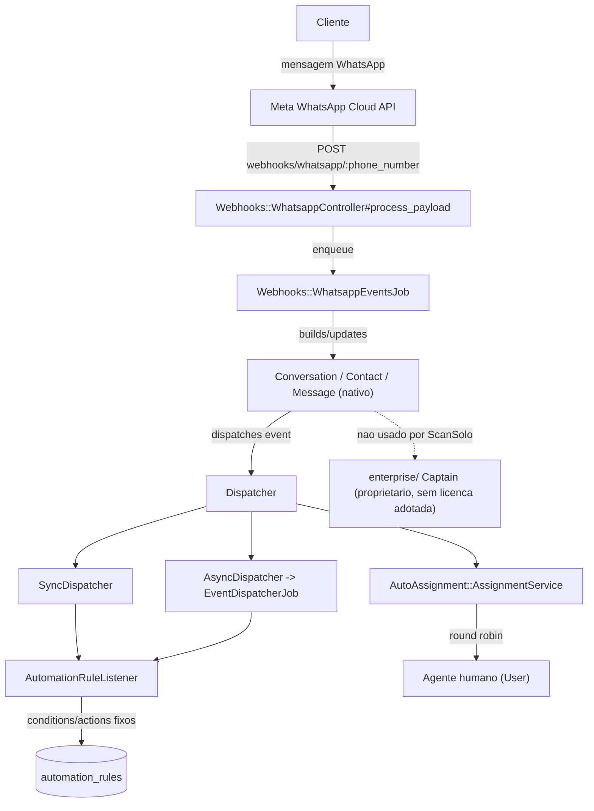
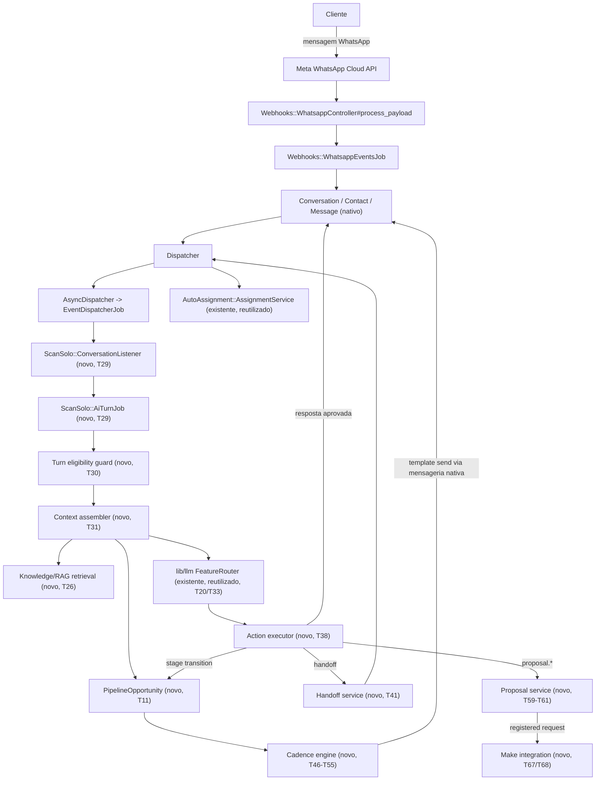

# Implementation Plan

## Request Summary

- **Objective**: Build the ScanSolo extension layer (pipeline/Kanban, AI Agent Center, Knowledge/RAG, canonical guarded AI turn flow, agent actions/authorization, human handoff/control, follow-up cadence engine, WhatsApp-template reuse, proposal automation, Make integration, security/privacy hardening, isolated test mode, deployment documentation, upstream-maintainability documentation, Lexus migration design) as an isolated, additive-only namespace on top of the imported Chatwoot Community codebase, with every deferred production-activation item (RF-100) behind its own explicit human-approval gate.
- **Scope**:
  - **In**: `ScanSolo::` backend namespace (models/services/jobs/policies/controllers), `dashboard/routes/dashboard/scansolo/*` frontend, new additive migrations, formal contracts for the 9 SPEC `Contracts` entries, isolated test mode (RSpec + Vitest, zero production credentials), Docker Compose deployment documentation, upstream high-risk-customization documentation, Lexus migration/cutover design document.
  - **Out**: Any change to native Chatwoot conversation/contact/messaging/assignment behavior beyond additive extension points; any dependency on `enterprise/` Captain; any production credential/DNS/WhatsApp-number/Make-scenario/proposal-API activation; any Lexus production write; any production deploy or migration run.
- **Tier**: complete
- **Architecture references**: `AGENTS.md`, `docs/agents/architecture.md`, `docs/agents/domain_rules.md`, `docs/agents/tech_stack.md`, `docs/agents/data_model.md`, `docs/agents/api_contracts.md`, `docs/agents/dependencies.md` (all present, read in full for this plan).

## AS IS — Componentes impactados

Fluxo atual (verificado em `app/controllers/webhooks/whatsapp_controller.rb`, `app/models/conversation.rb`, `app/dispatchers/`, `app/listeners/`, `docs/agents/architecture.md`) cobre apenas mensagem inbound do WhatsApp nativo ate `Conversation`/`Message`, `AutomationRule` (vocabulario fechado) e atribuicao humana round-robin. Nao existem pipeline comercial, AI Agent Center, RAG, engine de cadencia ou automacao de proposta; o unico backend de IA existente (`Captain`) esta sob `enterprise/` proprietario e nao pode ser reaproveitado sem licenca (`README.md` "Licensing boundary").

## TO BE — Componentes propostos

O novo `ScanSolo::AiTurnJob` (T29) e consumido a partir do `Dispatcher`/`AsyncDispatcher` nativo existente (RF-96), monta contexto via `PipelineOpportunity` (T11) e retrieval RAG (T26), so executa acoes registradas via o executor deterministico (T38) e so envia resposta pelo caminho nativo de mensagens. Handoff (T41), engine de cadencia (T46-T55) e propostas via Make (T59-T68) sao modulos novos e isolados sob `ScanSolo::` que reaproveitam `Conversation`/`Message`/`Dispatcher`/`AutoAssignment` nativos em vez de duplica-los, conforme RF-95/RF-96.

## Tasks

### Phase 1 — Foundation & platform shell

#### T01 — Feature flag + `ScanSolo::` namespace scaffold
- **Files**: `app/models/account.rb` (additive `FlagShihTzu` bit `scansolo_enabled`), `app/models/scan_solo/.keep`, `app/services/scan_solo/.keep`, `app/jobs/scan_solo/.keep`, `app/policies/scan_solo/.keep`, `db/migrate/XXXXXXXXXXXXXX_add_scansolo_enabled_flag_to_accounts.rb`
- **Change**: Add `scansolo_enabled` as a new additive `FlagShihTzu` bit on `Account` (pattern verified `docs/agents/data_model.md`) and create the empty `ScanSolo::` directory scaffold so no ScanSolo file lives outside its own namespace (RF-95).
- **Covers**: RF-95
- **Tests**: `spec/models/account_spec.rb` — new spec context asserting `scansolo_enabled?` defaults to `false` and toggles per account without touching pre-existing flags.
- **Risk**: Low — additive column only, no behavior change for non-ScanSolo accounts.
- **Dependencies**: none

#### T02 — Routes namespace + base API controller/policy
- **Files**: `config/routes.rb` (additive `namespace :scan_solo do ... end` under `api/v1/accounts/:account_id`), `app/controllers/api/v1/accounts/scan_solo/base_controller.rb`
- **Change**: Register the `api/v1/accounts/:account_id/scan_solo/*` route namespace (mirrors existing `api/v1/accounts/:account_id/*` convention, verified `config/routes.rb`) and a `BaseController` enforcing `current_account.scansolo_enabled?` (404 otherwise) plus existing `userApiKey`/`agentBotApiKey` auth.
- **Covers**: RF-95, RF-96
- **Tests**: `spec/controllers/api/v1/accounts/scan_solo/base_controller_spec.rb` — request against a disabled account returns `404`; against an enabled account passes through to auth.
- **Risk**: Medium — `config/routes.rb` is shared; every later controller task adds routes here, so this task must land first and stay minimal.
- **Dependencies**: T01

#### T03 — i18n scaffold for ScanSolo namespace
- **Files**: `app/javascript/dashboard/i18n/locale/en/scansolo.json`, `app/javascript/dashboard/i18n/locale/en/index.js` (additive registration)
- **Change**: Create the `en.json` ScanSolo locale namespace and register it in the locale index so every subsequent ScanSolo Vue task has an i18n target to add keys into (RF-02, RNF-08).
- **Covers**: RF-02, RNF-08
- **Tests**: `app/javascript/dashboard/i18n/locale/en/specs/scansolo.spec.js` — asserts the namespace loads and a lint rule (`pnpm eslint`) flags any bare string added later under `dashboard/routes/dashboard/scansolo/`.
- **Risk**: Low.
- **Dependencies**: none

#### T04 — Branding & hostname hygiene verification
- **Files**: `spec/lib/scansolo_branding_spec.rb` (new, repository-search assertion), `.env.example` (additive documentation comment only)
- **Change**: Add a spec that renders installation branding purely from `config/installation_config.yml` (verified lines 17/21/25/29/33/37/41, RF-03) with zero ScanSolo domain-logic edits, and a repo-search spec asserting no `scansolo.com.br` literal exists outside configuration/env-example/documentation (RF-04).
- **Covers**: RF-03, RF-04
- **Tests**: `spec/lib/scansolo_branding_spec.rb` — `Dir.glob` search for `scansolo.com.br` limited to `app/`, `lib/`, `config/routes.rb` returns zero matches; installation-config round-trip check.
- **Risk**: Low.
- **Dependencies**: none

#### T05 — Dashboard shell: 11-module navigation
- **Files**: `app/javascript/dashboard/routes/dashboard/scansolo/index.js` (route table), `app/javascript/dashboard/components/layout/sidebarComponents/PrimaryNavItems.js` (additive entries for Pipeline/Agente de IA/Conhecimento/Follow-ups/Propostas/Execucoes e auditoria)
- **Change**: Register the 11 required modules as navigable entries (RF-01): 5 are net-new ScanSolo routes stubbed here (Pipeline, Agente de IA, Conhecimento, Follow-ups, Propostas, Execucoes e auditoria) with placeholder components that later phase tasks (T16, T22, T27, T56, T65, T75) fill in; Conversas/Contatos/Equipe/Templates/Automacao e integracoes reuse existing native nav entries unmodified.
- **Covers**: RF-01
- **Tests**: `app/javascript/dashboard/routes/dashboard/scansolo/specs/navigation.spec.js` — for a `scansolo_enabled` account, all 11 entries render and route without a full page reload.
- **Risk**: Low — additive Vue route table entries only.
- **Dependencies**: T02, T03

### Phase 2 — Shared core models

#### T06 — Migration: `scan_solo_conversation_extensions` + `scan_solo_audit_events`
- **Files**: `db/migrate/XXXXXXXXXXXXXX_create_scan_solo_conversation_extensions.rb`, `db/migrate/XXXXXXXXXXXXXX_create_scan_solo_audit_events.rb`
- **Change**: Pure additive `create_table` migrations: `scan_solo_conversation_extensions` (1:1 `conversation_id`, `ai_control_state` enum) and `scan_solo_audit_events` (polymorphic `subject`, `event_type`, `actor`, `correlation_id`, `payload` jsonb, `created_at`, immutable — no `updated_at`/update path).
- **Covers**: RF-95, RNF-04
- **Tests**: `spec/db/scansolo_migrations_spec.rb` — asserts both migrations contain only `create_table` (no `remove_column`/`change_column` on pre-existing tables).
- **Risk**: Low.
- **Dependencies**: T01

#### T07 — Model: `ScanSolo::ConversationExtension`
- **Files**: `app/models/scan_solo/conversation_extension.rb`
- **Change**: `belongs_to :conversation`; `ai_control_state` enum with values `ai_active`, `handoff_requested`, `awaiting_human`, `human_active`, `paused`, `closed` (RF-50), resolvable for every conversation (auto-created on first access, defaulting `ai_active`).
- **Covers**: RF-50
- **Tests**: `spec/models/scan_solo/conversation_extension_spec.rb` — every conversation resolves a control state; each enum value has a covering transition test stub (filled by T41/T42).
- **Risk**: Low.
- **Dependencies**: T06

#### T08 — Model/service: `ScanSolo::AuditEvent` + `AuditLogger` concern
- **Files**: `app/models/scan_solo/audit_event.rb`, `app/services/scan_solo/audit_logger.rb`
- **Change**: Immutable audit-event model (no update/destroy allowed at the model layer) plus a shared `AuditLogger.record!(subject:, event_type:, actor:, correlation_id:, payload:)` service used by every later side-effect task (RNF-02).
- **Covers**: RNF-02
- **Tests**: `spec/services/scan_solo/audit_logger_spec.rb` — `record!` persists exactly one row; attempting `update`/`destroy` on an existing `AuditEvent` raises.
- **Risk**: Low.
- **Dependencies**: T06

#### T09 — Policy base: `ScanSolo::ApplicationPolicy`
- **Files**: `app/policies/scan_solo/application_policy.rb`
- **Change**: Base Pundit policy for the `ScanSolo::` namespace defaulting every check to `false` (fail-closed) unless explicitly authorized, mirroring the existing Pundit pattern (`docs/agents/architecture.md` layer responsibilities) (RF-89).
- **Covers**: RF-89
- **Tests**: `spec/policies/scan_solo/application_policy_spec.rb` — an unauthorized/ambiguous user context is denied by default.
- **Risk**: Low.
- **Dependencies**: T02

### Phase 3 — Pipeline / Kanban

#### T10 — Migration: `scan_solo_pipeline_opportunities` + `scan_solo_pipeline_stage_events`
- **Files**: `db/migrate/XXXXXXXXXXXXXX_create_scan_solo_pipeline_opportunities.rb`, `db/migrate/XXXXXXXXXXXXXX_create_scan_solo_pipeline_stage_events.rb`
- **Change**: Additive tables: `scan_solo_pipeline_opportunities` (`account_id`, `contact_id`, `conversation_id`, `owner_id`, `stage` enum, `last_customer_interaction_at`, timestamps) and `scan_solo_pipeline_stage_events` (`opportunity_id`, `from_stage`, `to_stage`, `actor_type`/`actor_id`, `created_at`, immutable, no `updated_at`).
- **Covers**: RF-05, RF-06, RF-07
- **Tests**: `spec/db/scansolo_migrations_spec.rb` — additive-only assertion extended for these two tables.
- **Risk**: Low.
- **Dependencies**: T01

#### T11 — Model: `PipelineOpportunity` + `StageEvent`
- **Files**: `app/models/scan_solo/pipeline_opportunity.rb`, `app/models/scan_solo/pipeline_stage_event.rb`
- **Change**: `belongs_to :account, :contact, :conversation`; `stage` enum restricted to exactly `novo_lead, em_contato, em_qualificacao, qualificado, proposta_enviada, negociacao, ganho, perdido` in that order (RF-06); stage reads only from this column, independent of labels/custom attributes (RF-05); `has_many :stage_events`.
- **Covers**: RF-05, RF-06
- **Tests**: `spec/models/scan_solo/pipeline_opportunity_spec.rb` — persisting an out-of-vocabulary stage raises a validation error surfaced as `422`; a fixture that only changes labels/custom attributes leaves `stage` unchanged.
- **Risk**: Low.
- **Dependencies**: T10

#### T12 — Service: `ScanSolo::Pipeline::StageTransitionService`
- **Files**: `app/services/scan_solo/pipeline/stage_transition_service.rb`
- **Change**: Deterministic transition service: appends exactly one `PipelineStageEvent` per transition (RF-07); rejects transitions leaving stage unchanged on authorization/rule failure (RF-09); only accepts `negociacao` via an explicit authorized-action caller flag, never from an automated-rule caller (RF-18); treats `ganho`/`perdido` as terminal — rejects any further transition and short-circuits cadence enrollment calls (RF-19); this is the single call path other services must use (RF-19 "no other code path").
- **Covers**: RF-07, RF-09, RF-18, RF-19
- **Tests**: `spec/services/scan_solo/pipeline/stage_transition_service_spec.rb` — rejected transition returns `4xx`-mappable error and leaves the DB column unchanged; a non-authorized attempt to reach `negociacao` is rejected; a transition attempt out of `ganho`/`perdido` is rejected; every transition produces exactly one new history row.
- **Risk**: Medium — central authorization chokepoint reused by RF-14–18, T39, T53, T63; a bug here fans out broadly.
- **Dependencies**: T08, T09, T11

#### T13 — Controller/routes: opportunities CRUD + stage transitions (CT-01)
- **Files**: `config/routes.rb` (additive `resources :pipeline_opportunities`), `app/controllers/api/v1/accounts/scan_solo/pipeline_opportunities_controller.rb`, `app/policies/scan_solo/pipeline_opportunity_policy.rb`
- **Change**: `GET`/`PATCH` opportunity (owner reassignment, RF-10), `POST .../stage_transitions` implementing CT-01 (idempotent per `(opportunity_id, target_stage, actor)` within a short window, `4xx` on invalid/unauthorized transition); serializer exposes `last_customer_interaction_at` (native `Conversation`/`Message` activity, RF-11 first half) and a placeholder `next_follow_up_at` field wired to cadence data in T50.
- **Covers**: CT-01, RF-08, RF-09, RF-10, RF-11 (partial — last-interaction half)
- **Tests**: `spec/requests/api/v1/accounts/scan_solo/pipeline_opportunities_spec.rb` — drag confirmation only applies after server `200`; a rejected request returns `4xx` and leaves the stage unchanged; owner reassignment persists and is visible in the response body; duplicate stage-transition requests within the idempotency window return the same result without a second history row.
- **Risk**: Medium — shared `config/routes.rb` edit; keep additive-only.
- **Dependencies**: T02, T12

#### T14 — Stale indicator + Kanban/list filters
- **Files**: `app/services/scan_solo/pipeline/opportunity_query.rb`, `config/initializers/scansolo_constants.rb` (48h constant)
- **Change**: Query object computing the stale flag from `last_customer_interaction_at` using a fixed 48h constant (not account-configurable, RF-12), and supporting filters by stage, owner, and stale state (RF-13).
- **Covers**: RF-12, RF-13
- **Tests**: `spec/services/scan_solo/pipeline/opportunity_query_spec.rb` — a fixture exactly 48h stale is flagged; one second under 48h is not; applying each filter narrows the result set at the query level.
- **Risk**: Low.
- **Dependencies**: T11

#### T15 — Deterministic transition rule: Novo Lead → Em Contato
- **Files**: `app/services/scan_solo/conversation_listener.rb` (initial subscription, extended in T29), `app/services/scan_solo/pipeline/inbound_message_transition_rule.rb`
- **Change**: On a real inbound message with no prior qualifying interaction, transition a `novo_lead` opportunity to `em_contato` via T12's service exactly once (RF-14).
- **Covers**: RF-14
- **Tests**: `spec/services/scan_solo/pipeline/inbound_message_transition_rule_spec.rb` — a fake inbound message moves the opportunity once; a second message does not re-trigger it.
- **Risk**: Low — first consumer of the `Dispatcher`/`AsyncDispatcher` seam (RF-96), fully replaced by T29's canonical listener.
- **Dependencies**: T12

#### T16 — Frontend: Kanban board (UI-01)
- **Files**: `app/javascript/dashboard/routes/dashboard/scansolo/pipeline/KanbanBoard.vue`, `app/javascript/dashboard/store/scansolo/pipelineOpportunities.js` (Pinia)
- **Change**: Drag-and-drop Kanban grouped by stage; a dragged card only visually moves after server confirmation (`200`), reverts on rejection; renders stage, owner, last interaction, next follow-up, and stale indicator per card (RF-11 full, once T50 exists).
- **Covers**: UI-01, RF-08, RF-09, RF-11 (frontend half)
- **Tests**: `app/javascript/dashboard/routes/dashboard/scansolo/pipeline/specs/KanbanBoard.spec.js` — reverts card position on a mocked `4xx` response; renders all five required data points for a seeded opportunity.
- **Risk**: Medium — optimistic-UI revert logic is easy to get subtly wrong.
- **Dependencies**: T05, T13, T14, T50

#### T17 — Frontend: opportunity detail view (UI-02)
- **Files**: `app/javascript/dashboard/routes/dashboard/scansolo/pipeline/OpportunityDetail.vue`
- **Change**: Shows chronological stage-history list (RF-07 records), related contact, and related conversation link.
- **Covers**: UI-02
- **Tests**: `app/javascript/dashboard/routes/dashboard/scansolo/pipeline/specs/OpportunityDetail.spec.js` — history list order matches seeded `PipelineStageEvent` records.
- **Risk**: Low.
- **Dependencies**: T13

### Phase 4 — AI Agent Center

#### T18 — Migration: `scan_solo_ai_agent_configs`
- **Files**: `db/migrate/XXXXXXXXXXXXXX_create_scan_solo_ai_agent_configs.rb`
- **Change**: Additive table with all RF-20 fields (name, enabled, model_provider, model_selection, role, objective, persona, tone, instructions, service_rules, qualification_playbook jsonb, required_qualification_fields jsonb, restricted_information, forbidden_subjects, transfer_criteria, response_limits, service_hours jsonb) plus `status` enum (`draft`/`published`) and `published_version_id` self-reference for atomic swap.
- **Covers**: RF-20, RF-22
- **Tests**: `spec/db/scansolo_migrations_spec.rb` — additive-only assertion extended.
- **Risk**: Low.
- **Dependencies**: T01

#### T19 — Model + versioning service: draft/publish
- **Files**: `app/models/scan_solo/ai_agent_config.rb`, `app/services/scan_solo/ai_agent/publish_service.rb`
- **Change**: Draft edits never affect the live conversation (RF-22 first half); `PublishService#call` atomically swaps the account's active published version in a single transaction (RF-22 second half).
- **Covers**: RF-20, RF-22
- **Tests**: `spec/services/scan_solo/ai_agent/publish_service_spec.rb` — editing a draft leaves a concurrently running fixture turn's behavior unchanged; publish is atomic (no interleaved read sees a partial config).
- **Risk**: Medium — atomicity bug here would leak a half-published config into a live turn.
- **Dependencies**: T18

#### T20 — Provider resolution via `lib/llm::FeatureRouter`
- **Files**: `app/services/scan_solo/ai_agent/model_resolver.rb`
- **Change**: Resolve the configured agent's model/provider strictly through the existing `Llm::FeatureRouter`-equivalent resolution path (verified `lib/llm/feature_router.rb`, `config/llm.yml`) — no second hand-rolled HTTP client (RF-21); code-review-level verification that no ScanSolo class requires/inherits/calls `Captain::` (RF-26).
- **Covers**: RF-21, RF-26
- **Tests**: `spec/services/scan_solo/ai_agent/model_resolver_spec.rb` — resolution is traceable to `Llm::FeatureRouter`; `spec/lib/scansolo_no_enterprise_dependency_spec.rb` — repo-search assertion that no file under `app/**/scan_solo/` references `Captain::`.
- **Risk**: Medium — licensing-boundary risk (RF-26) if a future contributor copies Captain patterns; the repo-search spec is the durable guardrail.
- **Dependencies**: T19

#### T21 — Test mode scaffold: mock LLM responses
- **Files**: `app/services/scan_solo/test_mode/mock_llm_provider.rb`, `spec/support/scansolo_test_mode.rb`
- **Change**: Agent test mode executing configured behavior against fake/mock conversations with zero outbound sends to any real transport (RF-23); the full agent-config/test-mode suite passes with no production LLM credential set (RF-25).
- **Covers**: RF-23, RF-25
- **Tests**: `spec/services/scan_solo/test_mode/mock_llm_provider_spec.rb` — a fixture conversation produces a simulated response and zero real-transport sends (enforced via `webmock`); suite green with `OPENAI_API_KEY` unset.
- **Risk**: Low.
- **Dependencies**: T20

#### T22 — Controller/routes (CT-02) + Frontend AI Agent Center (UI-03)
- **Files**: `config/routes.rb` (additive), `app/controllers/api/v1/accounts/scan_solo/ai_agent_configs_controller.rb`, `app/javascript/dashboard/routes/dashboard/scansolo/agent/AgentCenter.vue`
- **Change**: `GET`/`PUT .../draft`/`POST .../publish` implementing CT-02 (draft vs published exposed distinctly, publish explicit and atomic); frontend screen exposing every RF-20 field with a visible draft-vs-published indicator that blocks accidental publish without explicit confirmation.
- **Covers**: CT-02, UI-03, RF-20, RF-22
- **Tests**: `spec/requests/api/v1/accounts/scan_solo/ai_agent_configs_spec.rb`; `app/javascript/dashboard/routes/dashboard/scansolo/agent/specs/AgentCenter.spec.js` — publish requires an explicit confirmation dialog interaction.
- **Risk**: Low.
- **Dependencies**: T02, T05, T19

### Phase 5 — Knowledge / RAG

#### T23 — Migration: `scan_solo_knowledge_sources` + `scan_solo_knowledge_chunks`
- **Files**: `db/migrate/XXXXXXXXXXXXXX_create_scan_solo_knowledge_sources.rb`, `db/migrate/XXXXXXXXXXXXXX_create_scan_solo_knowledge_chunks.rb`, `db/migrate/XXXXXXXXXXXXXX_add_embedding_to_scan_solo_knowledge_chunks.rb`
- **Change**: Additive tables: `scan_solo_knowledge_sources` (`type` enum [document/faq/company_info], `origin`, `added_by_id`, `enabled` bool, timestamps) and `scan_solo_knowledge_chunks` (`source_id`, `content`, `embedding` vector column via `pgvector`, `neighbor`/`pgvector` gems already Community-tier per `docs/agents/tech_stack.md`).
- **Covers**: RF-27, RF-28
- **Tests**: `spec/db/scansolo_migrations_spec.rb` — additive-only assertion extended; asserts `embedding` uses the existing `vector` column type, not a new extension.
- **Risk**: Low.
- **Dependencies**: T01

#### T24 — Model: `KnowledgeSource`/`KnowledgeChunk` with `has_neighbors`
- **Files**: `app/models/scan_solo/knowledge_source.rb`, `app/models/scan_solo/knowledge_chunk.rb`
- **Change**: `has_neighbors :embedding` on `KnowledgeChunk` (`neighbor` gem, directly, never through a `Captain::` model, RF-28); source metadata (type, origin, added-by, timestamp) required on every entry (RF-27).
- **Covers**: RF-27, RF-28
- **Tests**: `spec/models/scan_solo/knowledge_source_spec.rb` — one entry of each type persists with source metadata and is listable.
- **Risk**: Low.
- **Dependencies**: T23

#### T25 — Ingestion service: chunking/embedding, idempotent reindex, attachment reuse
- **Files**: `app/services/scan_solo/knowledge/ingestion_service.rb`, `app/services/scan_solo/knowledge/reindex_service.rb`
- **Change**: Chunk + embed content through the existing PostgreSQL + `pgvector`/`neighbor` stack (RF-28); idempotent reindex/retry — running twice does not duplicate chunks/embeddings (RF-31); knowledge-document upload routes through the existing native attachment storage/validation mechanism, no parallel unvalidated upload path (RF-90).
- **Covers**: RF-28, RF-31, RF-90
- **Tests**: `spec/services/scan_solo/knowledge/ingestion_service_spec.rb` — retrieval query after ingest returns at least one matching chunk with a similarity score; `spec/services/scan_solo/knowledge/reindex_service_spec.rb` — triggering reindex twice does not duplicate rows; `spec/services/scan_solo/knowledge/ingestion_service_spec.rb` also asserts uploads use `ActiveStorage`/existing attachment path (no new controller writing directly to disk/S3).
- **Risk**: Medium — embedding-generation cost/latency; mitigated by T21's mock-provider pattern reused here for tests.
- **Dependencies**: T24

#### T26 — Retrieval service: evidence, disabled-source exclusion, outage-safe fallback
- **Files**: `app/services/scan_solo/knowledge/retrieval_service.rb`
- **Change**: Every retrieved chunk carries a source/evidence id traceable to its originating entry (RF-29); disabling a source excludes its chunks from retrieval without deleting data (RF-30); if the vector provider/index is unavailable, the turn continues without RAG evidence rather than failing (RF-34, caught exception → empty evidence + failure-reason telemetry entry).
- **Covers**: RF-29, RF-30, RF-34
- **Tests**: `spec/services/scan_solo/knowledge/retrieval_service_spec.rb` — retrieval-test call returns a source-entry reference per result; disabling a source removes its chunks from subsequent results; a simulated vector-store outage (stubbed `Neighbor` raise) yields empty evidence plus a recorded failure-reason entry, not an unhandled exception.
- **Risk**: Medium — RF-34's "never fail the whole turn" guarantee is safety-critical for T31/T34; needs an explicit rescue boundary, not a broad `rescue StandardError`.
- **Dependencies**: T24

#### T27 — Controller/routes (CT-03) + Frontend Knowledge screen (UI-05)
- **Files**: `config/routes.rb` (additive), `app/controllers/api/v1/accounts/scan_solo/knowledge/retrieval_tests_controller.rb`, `app/controllers/api/v1/accounts/scan_solo/knowledge/sources_controller.rb`, `app/javascript/dashboard/routes/dashboard/scansolo/knowledge/KnowledgeCenter.vue`
- **Change**: `POST .../retrieval_tests` implementing CT-03 (ranked chunks with source/evidence ids, operator-submitted query outside a live conversation, RF-32); `DELETE` on a source removes its content from future retrieval (RF-33); frontend screen covering upload/FAQ/enable-disable/reindex/retrieval-simulator (RF-27–RF-33).
- **Covers**: CT-03, UI-05, RF-32, RF-33
- **Tests**: `spec/requests/api/v1/accounts/scan_solo/knowledge/retrieval_tests_spec.rb`; `spec/requests/api/v1/accounts/scan_solo/knowledge/sources_spec.rb` — deletion removes chunks from a subsequent retrieval-test query; `app/javascript/dashboard/routes/dashboard/scansolo/knowledge/specs/KnowledgeCenter.spec.js` — each listed operation is reachable and functional.
- **Risk**: Low.
- **Dependencies**: T02, T05, T25, T26

### Phase 6 — Canonical guarded AI turn flow

#### T28 — Migration: `scan_solo_ai_turns` telemetry table
- **Files**: `db/migrate/XXXXXXXXXXXXXX_create_scan_solo_ai_turns.rb`
- **Change**: Additive table: `message_id` (unique, backs dedupe RF-36), `conversation_id`, `invocation_status`, `model_provider`, `input_tokens`, `output_tokens`, `cost_estimate`, `latency_ms`, `guardrail_outcome` jsonb, `knowledge_evidence` jsonb, `action_evidence` jsonb, `failure_reason`, `correlation_id` (unique).
- **Covers**: RF-24, RF-35, RF-36
- **Tests**: `spec/db/scansolo_migrations_spec.rb` — additive-only assertion extended; a unique index spec confirms `message_id` uniqueness at the DB level.
- **Risk**: Low.
- **Dependencies**: T01

#### T29 — `ScanSolo::ConversationListener` + `AiTurnJob` dedupe
- **Files**: `app/services/scan_solo/conversation_listener.rb` (canonical version, supersedes T15's stub), `app/jobs/scan_solo/ai_turn_job.rb`
- **Change**: Subscribed to `message_created`/`conversation_updated` through the existing `Dispatcher` (RF-96, no polling); `AiTurnJob` only runs after the triggering message is persisted through native `Conversation`/`Message` (RF-35); enqueuing twice for the same message id produces exactly one outbound AI message and one turn record via the `message_id` unique constraint from T28 (RF-36), safe under Sidekiq retry.
- **Covers**: RF-35, RF-36, RF-96
- **Tests**: `spec/jobs/scan_solo/ai_turn_job_spec.rb` — enqueuing the job twice for the same message id produces exactly one `AiTurn` row and one outbound message (retry simulated via `perform_now` called twice).
- **Risk**: High — the dedupe guarantee is the single most safety-critical property of the whole turn flow; must be enforced at the DB unique-constraint level, not only in-process.
- **Dependencies**: T11, T28

#### T30 — Turn eligibility guard (human-control check)
- **Files**: `app/services/scan_solo/ai_turn/eligibility_guard.rb`
- **Change**: If the conversation is in a human-controlled or opted-out state (`ScanSolo::ConversationExtension#ai_control_state` from T07), suppress the automatic AI turn for that inbound message (RF-37).
- **Covers**: RF-37
- **Tests**: `spec/services/scan_solo/ai_turn/eligibility_guard_spec.rb` — an inbound message on a human-owned conversation produces zero AI-authored outbound messages.
- **Risk**: Medium — a missed suppression path directly violates RF-37/RF-52.
- **Dependencies**: T07, T29

#### T31 — Context assembler
- **Files**: `app/services/scan_solo/ai_turn/context_assembler.rb`
- **Change**: Assembles turn context from, at minimum: recent canonical Chatwoot conversation history, contact context, pipeline/opportunity context, proposal context, and RAG retrieval results (RF-39); durable semantic memory, where configured, is included as an auxiliary layer subordinate to canonical history — disabling it never removes canonical history (RF-40).
- **Covers**: RF-39, RF-40
- **Tests**: `spec/services/scan_solo/ai_turn/context_assembler_spec.rb` — the context snapshot references all five sources or an explicit "not applicable" marker per source; disabling durable memory leaves canonical history present.
- **Risk**: Medium — this service touches five different data sources (T11, T26, proposal module T58); ordering/nil-handling bugs are easy to introduce.
- **Dependencies**: T11, T26, T30

#### T32 — Input guardrail + output-claim validation
- **Files**: `app/services/scan_solo/ai_turn/input_guardrail.rb`, `app/services/scan_solo/ai_turn/output_validator.rb`
- **Change**: Input guardrail applied to inbound content before model invocation, recorded on the turn's evidence; action list bounded to less than "all registered actions" per the agent's configured autonomy policy (RF-38); output validator blocks any outbound message containing an unvalidated transactional claim (price, delivery status, proposal-send confirmation) not produced by a deterministic registered action/service result (RF-41).
- **Covers**: RF-38, RF-41
- **Tests**: `spec/services/scan_solo/ai_turn/input_guardrail_spec.rb` — turn evidence shows a recorded guardrail outcome and a bounded action list; `spec/services/scan_solo/ai_turn/output_validator_spec.rb` — a model attempt to state a price without an approved `proposal.generate`/`proposal.send` result is blocked before send.
- **Risk**: High — RF-41 is the primary anti-hallucination safety boundary for commercial claims; must be a hard block, not a warning.
- **Dependencies**: T31

#### T33 — Model invocation via `lib/llm` + provider-failure handling
- **Files**: `app/services/scan_solo/ai_turn/model_invoker.rb`
- **Change**: Invokes the resolved provider (T20) through the existing `lib/llm/` routing abstraction; on timeout/error/malformed output, preserves already-persisted inbound history unchanged and does not send a customer-facing message for that turn (RF-42).
- **Covers**: RF-42
- **Tests**: `spec/services/scan_solo/ai_turn/model_invoker_spec.rb` — a simulated provider failure (stubbed `Llm` raise) leaves prior history intact, produces zero new outbound customer messages, records a failure-reason telemetry entry.
- **Risk**: Medium.
- **Dependencies**: T20, T32

#### T34 — Approved-response send via native path + evidence persistence
- **Files**: `app/services/scan_solo/ai_turn/response_sender.rb`, `app/services/scan_solo/ai_turn/turn_orchestrator.rb`
- **Change**: Sends the model's approved final response only through native Chatwoot outbound messaging (same path as human replies), persists a usage/evidence/audit record whose content matches exactly what was sent (RF-43); executes a turn's registered tool/action requests through T38's deterministic executor before/at the same transaction boundary as persisting the final response, updating pipeline/handoff operational state as required (RF-44).
- **Covers**: RF-43, RF-44, RF-24
- **Tests**: `spec/services/scan_solo/ai_turn/response_sender_spec.rb` — persisted outbound `Message` content is identical to the delivered content; matching evidence record references that message id; `spec/services/scan_solo/ai_turn/turn_orchestrator_spec.rb` — an action result (e.g. stage transition) is visible in the opportunity record no later than the outbound message being queued.
- **Risk**: High — transaction-boundary ordering between action execution and message send is safety-critical (RF-44); get this wrong and pipeline state can desync from what the customer was told.
- **Dependencies**: T12, T33, T38

#### T35 — Frontend: per-turn telemetry/evidence viewer (UI-04)
- **Files**: `app/javascript/dashboard/routes/dashboard/scansolo/agent/TurnEvidenceViewer.vue`
- **Change**: Shows RF-24 telemetry fields plus RF-38/RF-39 guardrail and context evidence per turn, queryable by correlation id.
- **Covers**: UI-04
- **Tests**: `app/javascript/dashboard/routes/dashboard/scansolo/agent/specs/TurnEvidenceViewer.spec.js` — selecting a turn shows guardrail outcome, knowledge evidence, and action evidence.
- **Risk**: Low.
- **Dependencies**: T22, T34

### Phase 7 — Agent actions and tool authorization

#### T36 — Migration: `scan_solo_agent_actions` + `scan_solo_agent_action_executions`
- **Files**: `db/migrate/XXXXXXXXXXXXXX_create_scan_solo_agent_actions.rb`, `db/migrate/XXXXXXXXXXXXXX_create_scan_solo_agent_action_executions.rb`
- **Change**: Additive tables: `scan_solo_agent_actions` (`action_id` unique, `classification` enum [read_only/automatic/requires_confirmation/disabled], `schema` jsonb) and `scan_solo_agent_action_executions` (`action_id`, `turn_id`/`correlation_id`, `idempotency_key` unique per action, `params` jsonb, `status`, `confirmed_at`, `audit_event_id`).
- **Covers**: RF-45, RF-46
- **Tests**: `spec/db/scansolo_migrations_spec.rb` — additive-only assertion extended; unique-index spec on `idempotency_key`.
- **Risk**: Low.
- **Dependencies**: T01

#### T37 — Model: registered action definitions + classification enum
- **Files**: `app/models/scan_solo/agent_action.rb`
- **Change**: Every action definition has exactly one classification from the fixed set; an unclassified action cannot be registered (validation error) (RF-45), mirroring `AutomationRule`'s closed-vocabulary style (verified `app/models/automation_rule.rb`) without touching `AutomationRule` itself.
- **Covers**: RF-45
- **Tests**: `spec/models/scan_solo/agent_action_spec.rb` — registering an action with no classification is rejected.
- **Risk**: Low.
- **Dependencies**: T36

#### T38 — Deterministic action executor (CT-04)
- **Files**: `app/services/scan_solo/actions/executor.rb`
- **Change**: Accepts only a registered action id plus schema-validated structured parameters — a free-form URL/command/SQL parameter is rejected by the schema (RF-47); each side-effect action carries a server-side schema, explicit authorization check, idempotency key, correlation id, and audit record (via T08), executed by this deterministic executor, never free-form model code (RF-46); invoking the same action twice with the same idempotency key produces the side effect exactly once (RNF-01).
- **Covers**: CT-04, RF-46, RF-47, RNF-01
- **Tests**: `spec/services/scan_solo/actions/executor_spec.rb` — invoking the same action twice with the same idempotency key produces the side effect exactly once and the audit log links it to the originating turn's correlation id; a free-form URL/command/SQL parameter is rejected by schema validation before any execution.
- **Risk**: High — this is the sole gate between model output and any side effect (RF-47); must be defense-in-depth (schema + allowlist + policy), not a single check.
- **Dependencies**: T08, T09, T37

#### T39 — Register minimum commercial action set
- **Files**: `app/services/scan_solo/actions/registry.rb`, `app/services/scan_solo/actions/qualification_field_action.rb`, `app/services/scan_solo/actions/stage_transition_action.rb`, `app/services/scan_solo/actions/private_note_action.rb`, `app/services/scan_solo/actions/proposal_actions.rb`, `app/services/scan_solo/actions/cadence_signal_action.rb`, `app/services/scan_solo/actions/handoff_action.rb`
- **Change**: Registers: locate/update allowed contact qualification fields, request a pipeline stage transition (delegates to T12, covering RF-14–RF-18 auto-transition triggers RF-15/RF-16 when the qualification-field-update action detects all-required-fields-satisfied or the configured playbook's start signal), create a private handoff/operational note, request proposal generation, request proposal approval/send where allowed, emit a cadence/workflow signal, request human handoff (RF-48).
- **Covers**: RF-48, RF-15, RF-16
- **Tests**: `spec/services/scan_solo/actions/registry_spec.rb` — each listed action exists, is classified, schema-validated, exercised by at least one test; `spec/services/scan_solo/actions/qualification_field_action_spec.rb` — completing all required fields auto-transitions to `qualificado` (RF-16), one missing field leaves the stage unchanged; a fixture starting qualification moves `em_contato` → `em_qualificacao` exactly once (RF-15).
- **Risk**: Medium.
- **Dependencies**: T12, T38

#### T40 — Confirmation-gating for requires-confirmation actions
- **Files**: `app/services/scan_solo/actions/confirmation_gate.rb`
- **Change**: An action classified `requires_confirmation` does not execute its side effect until an explicit confirming authorization is recorded; a requires-confirmation action invoked without a recorded confirmation stays pending and produces no side effect (RF-49).
- **Covers**: RF-49
- **Tests**: `spec/services/scan_solo/actions/confirmation_gate_spec.rb` — invocation without confirmation stays pending with zero side effects.
- **Risk**: Low.
- **Dependencies**: T38

### Phase 8 — Human handoff and control (core)

#### T41 — Handoff service: private note builder + AI-reply suppression
- **Files**: `app/services/scan_solo/handoff/handoff_service.rb`
- **Change**: On handoff request (model action or human), creates exactly one private note with transfer reason, concise summary, customer objective, collected qualification fields, objections, pipeline stage, proposal status, pending actions, and recommended next step (RF-51); sets `ConversationExtension#ai_control_state` to `handoff_requested`/`awaiting_human`/`human_active`, suppressing further automatic AI replies (RF-52 — no code path other than the explicit return-to-AI action in T42 clears this state).
- **Covers**: RF-50, RF-51, RF-52
- **Tests**: `spec/services/scan_solo/handoff/handoff_service_spec.rb` — exactly one private note with all nine elements exists after handoff; a subsequent inbound message produces zero further AI-authored replies until an authorized return to AI.
- **Risk**: High — RF-52's "no other code path" guarantee must be enforced by making `ai_active` reachable only through T42's return-to-AI method (private setter elsewhere).
- **Dependencies**: T07, T08, T30

#### T42 — Idempotent takeover/return-to-AI commands (CT-05)
- **Files**: `app/services/scan_solo/handoff/takeover_service.rb`, `app/services/scan_solo/handoff/return_to_ai_service.rb`, `app/controllers/api/v1/accounts/scan_solo/conversations/handoff_controller.rb`, `config/routes.rb` (additive), `app/policies/scan_solo/handoff_policy.rb`
- **Change**: Duplicate takeover/return-to-AI commands are idempotent — issuing the same command twice leaves the same resulting state with no duplicate audit entry beyond the first (RF-53); return-to-AI requires the same role/permission level authorized to take over (assigned agent or account administrator), symmetric with takeover authorization, no separate authorization concept (RF-54).
- **Covers**: CT-05, RF-53, RF-54
- **Tests**: `spec/requests/api/v1/accounts/scan_solo/conversations/handoff_controller_spec.rb` — a return-to-AI attempt by a user who is neither the assigned agent nor an account administrator is rejected; either is applied; issuing the same command twice produces the same state with no duplicate audit entry.
- **Risk**: Medium.
- **Dependencies**: T02, T09, T41

#### T43 — Native-history verification (human replies)
- **Files**: `spec/models/scan_solo/conversation_extension_spec.rb` (extended)
- **Change**: Confirms human outbound messages during a human-active conversation stay in the same native `Message` timeline as AI/customer messages — no parallel human-message store (RF-55). No new production code required; this is a verification task guarding against accidental future duplication.
- **Covers**: RF-55
- **Tests**: `spec/models/scan_solo/conversation_extension_spec.rb` — a human reply during a human-active conversation appears in `conversation.messages`, not a ScanSolo-owned table.
- **Risk**: Low.
- **Dependencies**: T41

#### T44 — Frontend: conversation handoff/control indicator (UI-06)
- **Files**: `app/javascript/dashboard/components-next/conversation/HandoffControlBanner.vue`
- **Change**: Shows current AI-control state and takeover/return actions; updates immediately after a takeover/return action; reflects RF-53 idempotency (no duplicate state flicker on repeated clicks).
- **Covers**: UI-06
- **Tests**: `app/javascript/dashboard/components-next/conversation/specs/HandoffControlBanner.spec.js` — repeated clicks produce no duplicate state flicker.
- **Risk**: Low.
- **Dependencies**: T42

### Phase 9 — Follow-up cadence engine

#### T45 — Migration: `scan_solo_cadence_definitions` + `scan_solo_cadence_enrollments` + `scan_solo_cadence_attempts`
- **Files**: `db/migrate/XXXXXXXXXXXXXX_create_scan_solo_cadence_definitions.rb`, `db/migrate/XXXXXXXXXXXXXX_create_scan_solo_cadence_enrollments.rb`, `db/migrate/XXXXXXXXXXXXXX_create_scan_solo_cadence_attempts.rb`
- **Change**: Additive tables: `scan_solo_cadence_definitions` (`stage`, `version`, `offsets` jsonb, `active`), `scan_solo_cadence_enrollments` (`opportunity_id`, `cadence_definition_id`, unique `(opportunity_id, cadence_definition_id)` per RF-59, `status` enum [active/paused/cancelled/completed], `current_step`, `next_attempt_at`), `scan_solo_cadence_attempts` (`enrollment_id`, `step`, `template_reference`, `scheduled_at`, `sent_at`, `result`, immutable once terminal).
- **Covers**: RF-57, RF-59, RF-62
- **Tests**: `spec/db/scansolo_migrations_spec.rb` — additive-only assertion extended; unique-index spec on `(opportunity_id, cadence_definition_id)`.
- **Risk**: Low.
- **Dependencies**: T01

#### T46 — Model: `CadenceDefinition` with seeded schedules
- **Files**: `app/models/scan_solo/cadence_definition.rb`, `db/seeds/scansolo_cadence_definitions.rb`
- **Change**: Seeds the three initial versioned definitions: Novo Lead — 4 attempts at +2h/+24h/+48h/+96h from enrollment; Em Contato — 5 attempts, 24h apart; Em Qualificação — 7 attempts, 24h apart (RF-57).
- **Covers**: RF-57
- **Tests**: `spec/models/scan_solo/cadence_definition_spec.rb` — enrolling a fixture opportunity in each stage's cadence schedules exactly the attempt count/offsets above.
- **Risk**: Low.
- **Dependencies**: T45

#### T47 — Native template-send wrapper
- **Files**: `app/services/scan_solo/messaging/native_template_sender.rb`
- **Change**: Cadence/proposal-send steps reference provider templates available/approved for the connected inbox and send through the existing conversation message-create path supporting `template_params` (verified `app/models/message.rb:51`, `swagger/paths/application/conversation/messages/create.yml`) — no parallel WhatsApp client (RF-70); supports fake/test template references so cadence/proposal flows are fully testable before a real number is connected (RF-71); never marks a send as successful before native Chatwoot's transport accepts the operation, and captures later delivery/read/failure status when exposed by native events, updating the same evidence record rather than creating a duplicate (RF-72).
- **Covers**: RF-70, RF-71, RF-72
- **Tests**: `spec/services/scan_solo/messaging/native_template_sender_spec.rb` — constructs a native message-create request using the documented `template_params` shape with no parallel WhatsApp client; full cadence/proposal test suite passes using fake template identifiers with zero calls reaching a real Meta endpoint (`webmock`); a simulated transport rejection leaves the evidence record non-"sent"; a simulated acceptance followed by a delivery-status webhook updates the same record.
- **Risk**: Medium — shared by cadence (T49) and proposal (T61); a bug duplicates messages across two modules at once.
- **Dependencies**: T02

#### T48 — Enrollment service: idempotent enrollment
- **Files**: `app/services/scan_solo/cadence/enrollment_service.rb`
- **Change**: Calling enrollment twice with identical inputs results in exactly one active enrollment record (RF-59), enforced by T45's unique index plus an application-level `find_or_create_by!`.
- **Covers**: RF-59
- **Tests**: `spec/services/scan_solo/cadence/enrollment_service_spec.rb` — calling enrollment twice with identical inputs results in exactly one active enrollment record.
- **Risk**: Low.
- **Dependencies**: T45, T46

#### T49 — Due-attempt processor: sidekiq-cron registration + sending-window + no-duplicate-on-retry
- **Files**: `app/jobs/scan_solo/cadence_due_attempt_job.rb`, `config/schedule.yml` (additive entry), `app/services/scan_solo/cadence/sending_window.rb`
- **Change**: Registers a `sidekiq-cron` entry (verified `config/schedule.yml`, `config/sidekiq.yml`) at a 5-minute cadence, reusing the existing `trigger_scheduled_items_job`-style pattern — not an external scheduling process (RF-60); sends only within 09:00–20:00 `America/Sao_Paulo`, deferring a due attempt outside the window to the next in-window moment (RF-58); re-running a cadence-step job for an already-sent step produces zero additional sends (RF-61, guarded by `status` check + row lock before calling T47).
- **Covers**: RF-58, RF-60, RF-61
- **Tests**: `spec/jobs/scan_solo/cadence_due_attempt_job_spec.rb` — an attempt computed for 21:00 `America/Sao_Paulo` is not sent before the next 09:00; due-attempt processing is triggered by the registered `config/schedule.yml` job; re-running the job for an already-sent step produces zero additional sends.
- **Risk**: High — timezone/DST edge cases around `America/Sao_Paulo` plus retry-safety are both safety-critical and easy to get subtly wrong.
- **Dependencies**: T47, T48

#### T50 — Attempt evidence persistence + next-attempt/current-step exposure
- **Files**: `app/services/scan_solo/cadence/attempt_evidence_recorder.rb`, `app/serializers/scan_solo/cadence_enrollment_serializer.rb`
- **Change**: Persists an immutable execution evidence/snapshot per cadence attempt (cadence version, template reference, scheduled time, actual send time, result), never updated after a terminal result (RF-62); exposes current step and next-attempt time per active enrollment, consumed by T13/T16's Kanban display (RF-63).
- **Covers**: RF-62, RF-63
- **Tests**: `spec/services/scan_solo/cadence/attempt_evidence_recorder_spec.rb` — each attempt has exactly one evidence record, never updated after a terminal result; the serialized `next_attempt_at` matches the enrollment's persisted value.
- **Risk**: Low.
- **Dependencies**: T49

#### T51 — Pause/resume/cancel + authorized manual enrollment + test-mode acceleration
- **Files**: `app/services/scan_solo/cadence/lifecycle_service.rb`, `app/policies/scan_solo/cadence_enrollment_policy.rb`
- **Change**: Pausing prevents the next attempt from firing; resuming re-arms at the correct offset; cancelling permanently stops all remaining attempts (RF-64); manual enrollment only when explicitly authorized (rejected `4xx` otherwise), with a test/simulation mode advancing through all configured attempts without real wall-clock waiting (RF-68).
- **Covers**: RF-64, RF-68
- **Tests**: `spec/services/scan_solo/cadence/lifecycle_service_spec.rb` — pause/resume/cancel each behave as specified; an unauthorized manual-enrollment request is rejected `4xx`; test-mode enrollment advances through all attempts without real wall-clock waiting.
- **Risk**: Medium.
- **Dependencies**: T48, T09

#### T52 — Full/partial customer-reply detection service
- **Files**: `app/services/scan_solo/cadence/reply_completeness_detector.rb`
- **Change**: Deterministic field-completeness detection only (no NLP/intent classifier): a reply completing all required qualification fields for the current stage is a "full customer reply" — stop/recalculate all pending cadence work; a reply leaving at least one required field unsatisfied is a "partial customer reply" — cancel only the immediate pending send, recalculating remaining eligibility (RF-65).
- **Covers**: RF-65
- **Tests**: `spec/services/scan_solo/cadence/reply_completeness_detector_spec.rb` — a fixture reply completing all required fields stops/recalculates the full pending schedule; a fixture leaving at least one field unsatisfied cancels only the immediate pending send.
- **Risk**: Medium.
- **Dependencies**: T51

#### T53 — Unified stop/recalculate policy service (stage change/won/lost/opt-out/manual pause/replacement + human takeover)
- **Files**: `app/services/scan_solo/cadence/stop_recalculate_policy.rb`
- **Change**: Single policy service triggered by stage change, won, lost, opt-out, manual pause, cadence replacement/cancellation (RF-66), and by human takeover (RF-56) — a scheduled-but-unsent step is paused/cancelled within the same processing window as the takeover; an already-sent step is not retroactively altered. Reuses T12's stage-transition hook and T41's takeover event so both RF-56 and RF-66 share one implementation, avoiding policy drift.
- **Covers**: RF-56, RF-66
- **Tests**: `spec/services/scan_solo/cadence/stop_recalculate_policy_spec.rb` — each of the six listed triggers (stage change, won, lost, opt-out, manual pause, replacement) has a passing assertion that pending schedule is stopped/recalculated; a takeover fixture pauses/cancels a scheduled-but-unsent step within the same processing window, leaving an already-sent step untouched.
- **Risk**: High — this service is the single point where RF-19's "Ganho/Perdido cadence jobs are no-ops" guarantee and RF-56/RF-66 both live; must call through T12, never duplicate its terminal-state check.
- **Dependencies**: T12, T41, T51, T52

#### T54 — Template-unavailable/automation-disabled safe-skip
- **Files**: `app/services/scan_solo/cadence/template_availability_guard.rb`
- **Change**: If the mapped WhatsApp template for a due attempt is unavailable/not approved, or automation is disabled for the account/inbox, does not send the attempt and records a safe-failure/skip result instead of raising an unhandled error (RF-67).
- **Covers**: RF-67
- **Tests**: `spec/services/scan_solo/cadence/template_availability_guard_spec.rb` — a fixture with a missing/unapproved template produces a recorded skip/failure evidence entry and zero send attempts.
- **Risk**: Low.
- **Dependencies**: T47, T49

#### T55 — No-LLM-timing verification
- **Files**: `spec/services/scan_solo/cadence/no_llm_timing_spec.rb`
- **Change**: Code/spec review assertion that no cadence scheduling calculation depends on an LLM call — all offsets are deterministic configuration values (RF-69). No new production code; static/dependency-graph verification only.
- **Covers**: RF-69
- **Tests**: `spec/services/scan_solo/cadence/no_llm_timing_spec.rb` — repo-search assertion that `app/services/scan_solo/cadence/**/*.rb` contains no reference to `Llm::` or `ScanSolo::AiAgent`.
- **Risk**: Low.
- **Dependencies**: T49

#### T56 — Controller/routes (CT-06) + Frontend Follow-ups screen (UI-07)
- **Files**: `config/routes.rb` (additive), `app/controllers/api/v1/accounts/scan_solo/cadence_enrollments_controller.rb`, `app/javascript/dashboard/routes/dashboard/scansolo/followups/FollowUps.vue`
- **Change**: `POST`/`.../pause`/`.../resume`/`.../cancel` implementing CT-06 (idempotency key = `(opportunity_id, cadence_definition_version)`, authorization required for manual enrollment); frontend showing active enrollments, current step, next attempt, pause/resume/cancel controls (RF-63–RF-64), reflected in persisted state within the same request/response cycle.
- **Covers**: CT-06, UI-07
- **Tests**: `spec/requests/api/v1/accounts/scan_solo/cadence_enrollments_spec.rb`; `app/javascript/dashboard/routes/dashboard/scansolo/followups/specs/FollowUps.spec.js` — pausing from the screen is reflected in persisted state within the same request/response cycle.
- **Risk**: Low.
- **Dependencies**: T02, T05, T50, T51

### Phase 10 — Proposal automation

#### T57 — Migration: `scan_solo_proposals` + `scan_solo_proposal_versions`
- **Files**: `db/migrate/XXXXXXXXXXXXXX_create_scan_solo_proposals.rb`, `db/migrate/XXXXXXXXXXXXXX_create_scan_solo_proposal_versions.rb`
- **Change**: Additive tables: `scan_solo_proposals` (`opportunity_id`, `current_version_id`) and `scan_solo_proposal_versions` (`proposal_id`, `version_number`, `status` enum [generating/generated/approved/sent/failed], `is_current` bool, `value`, `currency`, `artifact_url`, `make_correlation_id`).
- **Covers**: RF-77
- **Tests**: `spec/db/scansolo_migrations_spec.rb` — additive-only assertion extended.
- **Risk**: Low.
- **Dependencies**: T01

#### T58 — Model: `Proposal`/`ProposalVersion` with current-version integrity
- **Files**: `app/models/scan_solo/proposal.rb`, `app/models/scan_solo/proposal_version.rb`
- **Change**: Only one version is `is_current: true` per opportunity, enforced by a DB partial-unique index plus model callback; generating a new version marks the previous non-current (RF-77).
- **Covers**: RF-77
- **Tests**: `spec/models/scan_solo/proposal_version_spec.rb` — generating a new version marks the previous non-current.
- **Risk**: Low.
- **Dependencies**: T57

#### T59 — `proposal.generate` service
- **Files**: `app/services/scan_solo/proposal/generate_service.rb`
- **Change**: Rejects a `proposal.generate` request if required proposal fields are not all deterministically validated as complete — no proposal record created (RF-74); requests generation exclusively through the registered Make integration (or mock outside production), persisting proposal version/reference/value/artifact metadata only after a validated result/callback, never from the request alone (RF-75); never allows the model to invent/compute an authoritative price/discount/total/payment condition — those values originate only from the deterministic Make/proposal integration result handler (RF-76); `proposal.generate` alone never sends anything (RF-73 first half).
- **Covers**: RF-73, RF-74, RF-75, RF-76
- **Tests**: `spec/services/scan_solo/proposal/generate_service_spec.rb` — a fixture missing one required field is rejected, no proposal record created; a mock-provider flow persists proposal fields only after the mock callback is validated; a test confirms the model's raw output is never written directly to price/discount/total fields; calling `proposal.generate` alone sends nothing.
- **Risk**: High — RF-76's "no invented price" guarantee is a core commercial-integrity requirement; the write path to `value`/`currency` must be reachable only from the callback handler (T61), never from `GenerateService` directly.
- **Dependencies**: T58, T67

#### T60 — `proposal.approve` service
- **Files**: `app/services/scan_solo/proposal/approve_service.rb`
- **Change**: Where human approval is configured as required, blocks `proposal.send` until an explicit approval is recorded on the current version; where not required, send proceeds directly from a generated proposal (RF-78).
- **Covers**: RF-78
- **Tests**: `spec/services/scan_solo/proposal/approve_service_spec.rb` — with approval required, a send without recorded approval is rejected; with approval not required, send proceeds directly.
- **Risk**: Low.
- **Dependencies**: T58

#### T61 — `proposal.send` service + idempotent callback handling
- **Files**: `app/services/scan_solo/proposal/send_service.rb`, `app/services/scan_solo/proposal/callback_handler.rb`
- **Change**: `proposal.send` cannot execute without a prior successful `proposal.generate` (and approval where required) result for the same version (RF-73 second half); protects version integrity — `send` against a stale (non-current) version is rejected (RF-77 second half); never reports a proposal as successfully sent before a validated send-integration/transport result is received (RF-79); delivering the same mock callback payload twice results in exactly one persisted state change (RF-80).
- **Covers**: RF-73, RF-77, RF-79, RF-80
- **Tests**: `spec/services/scan_solo/proposal/send_service_spec.rb` — `proposal.send` cannot execute without a prior successful generate result; a send against a stale version is rejected; a simulated send failure leaves proposal status as not-sent; delivering the same mock callback payload twice results in exactly one persisted state change.
- **Risk**: High — shares the same idempotent-callback safety property as T68's Make callback handler; must reuse the same correlation-id uniqueness guarantee (RNF-06), not a second ad hoc check.
- **Dependencies**: T47, T58, T60, T68

#### T62 — Safe-retry policy for proposal-integration failures
- **Files**: `app/services/scan_solo/proposal/retry_policy.rb`
- **Change**: Retries only safely-retryable proposal-integration failures (no partial/unknown side effect); never auto-retries an operation left in unsafe side-effect state (RF-81).
- **Covers**: RF-81
- **Tests**: `spec/services/scan_solo/proposal/retry_policy_spec.rb` — a retryable failure is retried without duplicating a proposal/send; an unsafe failure is left for manual review, not auto-retried.
- **Risk**: Medium.
- **Dependencies**: T61

#### T63 — On-success stage transition + cadence enrollment
- **Files**: `app/services/scan_solo/proposal/success_handler.rb`
- **Change**: When a proposal send is validated as successful, transitions the opportunity's stage to `proposta_enviada` (RF-17/RF-82 first half) via T12, and enrolls it in the configured post-proposal cadence via T48 (RF-82 second half).
- **Covers**: RF-17, RF-82
- **Tests**: `spec/services/scan_solo/proposal/success_handler_spec.rb` — a mock successful-send fixture produces both the stage transition and a new active cadence enrollment.
- **Risk**: Medium.
- **Dependencies**: T12, T48, T61

#### T64 — Mock proposal provider
- **Files**: `app/services/scan_solo/proposal/mock_provider.rb`
- **Change**: Usable without any real proposal API/Make production credential; the full proposal test suite passes with only the mock provider configured (RF-83).
- **Covers**: RF-83
- **Tests**: `spec/services/scan_solo/proposal/mock_provider_spec.rb` — full proposal suite (T59–T63) passes with only this provider configured, zero production credential.
- **Risk**: Low.
- **Dependencies**: T61

#### T65 — Controller/routes (CT-07) + Frontend Propostas screen (UI-08)
- **Files**: `config/routes.rb` (additive), `app/controllers/api/v1/accounts/scan_solo/proposals_controller.rb`, `app/javascript/dashboard/routes/dashboard/scansolo/proposals/Proposals.vue`
- **Change**: `POST .../generate`/`.../approve`/`.../send` implementing CT-07 (each independently schema-validated, correlation-id required, version-guarded against the current proposal version); frontend showing versions, current/non-current status, approval state, with the send action disabled when the current version is unapproved and approval is required.
- **Covers**: CT-07, UI-08
- **Tests**: `spec/requests/api/v1/accounts/scan_solo/proposals_spec.rb`; `app/javascript/dashboard/routes/dashboard/scansolo/proposals/specs/Proposals.spec.js` — send action is disabled in the UI when unapproved and approval is required.
- **Risk**: Low.
- **Dependencies**: T02, T05, T59, T60, T61

### Phase 11 — Make integration platform

#### T66 — Migration: `scan_solo_make_requests` + `scan_solo_make_callbacks`
- **Files**: `db/migrate/XXXXXXXXXXXXXX_create_scan_solo_make_requests.rb`, `db/migrate/XXXXXXXXXXXXXX_create_scan_solo_make_callbacks.rb`
- **Change**: Additive tables: `scan_solo_make_requests` (`correlation_id` unique, `idempotency_key`, `action`, `payload` jsonb, `status`, `retry_count`) and `scan_solo_make_callbacks` (`correlation_id` — **permanent unique index, no TTL/expiry** per RNF-06, `signature_valid` bool, `payload` jsonb, `applied` bool).
- **Covers**: RNF-06
- **Tests**: `spec/db/scansolo_migrations_spec.rb` — additive-only assertion extended; a dedicated spec asserts the `correlation_id` unique index on `scan_solo_make_callbacks` has no expiry/TTL mechanism attached.
- **Risk**: Low.
- **Dependencies**: T01

#### T67 — Outbound Make request service
- **Files**: `app/services/scan_solo/make/outbound_request_service.rb`, `config/credentials.yml.enc` (additive encrypted entries only, via `EncryptedCredentials`)
- **Change**: Registers Make integration configuration (scenario endpoint reference, secrets) server-side only, secrets encrypted at rest via Rails encrypted credentials, never placing a Make call in the default message-response path unless a registered action explicitly requires it (RF-84); attaches a correlation ID and idempotency key to every outbound Make request (RF-85 outbound half).
- **Covers**: CT-08, RF-84, RF-85
- **Tests**: `spec/services/scan_solo/make/outbound_request_service_spec.rb` — no Make HTTP call occurs during a standard AI turn absent a proposal/Make-backed action (assert via `webmock` no-request expectation on a plain turn fixture); Make credentials never appear in a client-facing serializer payload.
- **Risk**: Medium.
- **Dependencies**: T02

#### T68 — Inbound Make callback controller (CT-09)
- **Files**: `config/routes.rb` (additive `webhooks/scan_solo/make`), `app/controllers/webhooks/scan_solo/make_controller.rb`, `app/services/scan_solo/make/callback_verifier.rb`
- **Change**: Validates signed/authenticated inbound callbacks, rejecting callbacks that fail signature/authenticity/replay checks without applying a state change (RF-85 inbound half); validates every callback payload against a registered response schema before persisting any result (RF-86 first half); rejects a callback referencing an action/correlation id it was not issued for — no generic/arbitrary callback command can mutate account/proposal/pipeline state outside the registered, schema-validated contract for the specific action that initiated the request (RF-87). A validly-signed callback reusing a prior idempotency key does not reapply its side effect, enforced by T66's permanent unique constraint (RNF-06).
- **Covers**: CT-09, RF-85, RF-86, RF-87, RNF-06
- **Tests**: `spec/requests/webhooks/scan_solo/make_controller_spec.rb` — an inbound callback with invalid/replayed signature is rejected without applying a state change; a validly-signed callback reusing a prior idempotency key does not reapply its side effect; a malformed callback is rejected and recorded as an error without mutating proposal/pipeline state; a callback referencing an action/correlation id it was not issued for is rejected.
- **Risk**: High — this is the sole unauthenticated-caller-reachable endpoint in the whole ScanSolo layer; signature/replay/schema checks must fail closed (RF-89) and be tested adversarially.
- **Dependencies**: T02, T09, T66

#### T69 — Rack::Attack throttle scoped to Make callback endpoint
- **Files**: `config/initializers/rack_attack.rb` (additive throttle rule only)
- **Change**: Applies rate limiting to the Make inbound-callback endpoint only, via the existing `Rack::Attack` pattern, sized within the existing throttle ranges in that initializer (5–3000/min); no rate limiting added to AI-turn invocation frequency or manual cadence-enrollment frequency (RNF-05).
- **Covers**: RNF-05
- **Tests**: `spec/requests/webhooks/scan_solo/make_controller_spec.rb` (extended) — a throttle rule scoped to `webhooks/scan_solo/make` is present and triggers a `429` past threshold; no throttle rule exists on AI-turn or cadence-enrollment endpoints.
- **Risk**: Low.
- **Dependencies**: T68

#### T70 — Dead-letter/error visibility model + query
- **Files**: `app/models/scan_solo/make_request.rb` (failure-state query scopes), `app/services/scan_solo/make/dead_letter_query.rb`
- **Change**: Provides retry/dead-letter/error visibility for failed outbound integration requests (RF-86 second half), feeding T74/T75's Execuções e auditoria screen.
- **Covers**: RF-86
- **Tests**: `spec/services/scan_solo/make/dead_letter_query_spec.rb` — a repeatedly-failing outbound request is visible via this query.
- **Risk**: Low.
- **Dependencies**: T67

### Phase 12 — Security & privacy hardening (cross-cutting verification)

#### T71 — Secret redaction: logs + LLM prompt payloads
- **Files**: `config/initializers/scansolo_log_redaction.rb`, `app/services/scan_solo/ai_turn/prompt_redactor.rb`
- **Change**: Stores all ScanSolo-specific integration secrets server-side only, never in client-facing responses, model prompts, or logs (RF-88); a redaction test confirms secret-shaped values are absent/redacted from application logs and from any prompt/context payload sent to the LLM provider (RNF-07).
- **Covers**: RF-88, RNF-07
- **Tests**: `spec/services/scan_solo/ai_turn/prompt_redactor_spec.rb` — a fixture secret-shaped value (API-key pattern) is absent/redacted from a rendered log line and from a rendered prompt payload.
- **Risk**: Medium.
- **Dependencies**: T31, T67

#### T72 — Pundit fail-closed coverage audit
- **Files**: `spec/policies/scan_solo/coverage_audit_spec.rb`
- **Change**: Enforces least-privilege authorization on every new ScanSolo endpoint/action using the existing Pundit policy pattern, failing closed on ambiguous authorization or unverifiable callback identity (RF-89). No new production code; a repo-wide audit spec asserting every `ScanSolo::` controller has a corresponding policy class inheriting `ScanSolo::ApplicationPolicy`.
- **Covers**: RF-89
- **Tests**: `spec/policies/scan_solo/coverage_audit_spec.rb` — every controller under `app/controllers/api/v1/accounts/scan_solo/` and `app/controllers/webhooks/scan_solo/` has a matching Pundit policy.
- **Risk**: Low.
- **Dependencies**: T13, T22, T27, T42, T56, T65, T68

#### T73 — Attachment upload path reuse audit
- **Files**: `spec/services/scan_solo/knowledge/upload_path_audit_spec.rb`
- **Change**: Confirms the Knowledge module's document upload (T25) is the only new file-write path in the ScanSolo layer and that it delegates to the existing native attachment storage/validation mechanism (RF-90), with no other new unvalidated upload path introduced elsewhere in the plan.
- **Covers**: RF-90
- **Tests**: `spec/services/scan_solo/knowledge/upload_path_audit_spec.rb` — repo-search assertion that no `app/**/scan_solo/**` file calls `File.write`/`IO.write`/a raw S3 client outside `ActiveStorage`.
- **Risk**: Low.
- **Dependencies**: T25

### Phase 13 — Execuções e auditoria

#### T74 — Controller/routes: audit/execution listing
- **Files**: `config/routes.rb` (additive), `app/controllers/api/v1/accounts/scan_solo/executions_controller.rb`
- **Change**: Surfaces cadence evidence (T50), Make request/callback error/dead-letter visibility (T70), and action audit records (T38) in one queryable endpoint.
- **Covers**: UI-09 (backend half)
- **Tests**: `spec/requests/api/v1/accounts/scan_solo/executions_spec.rb` — a simulated failed Make callback appears in the response.
- **Risk**: Low.
- **Dependencies**: T02, T50, T70, T38

#### T75 — Frontend: Execuções e auditoria screen (UI-09)
- **Files**: `app/javascript/dashboard/routes/dashboard/scansolo/executions/Executions.vue`
- **Change**: Renders cadence evidence, Make error/dead-letter view, and action audit records; a simulated failed Make callback appears in this screen's error view.
- **Covers**: UI-09
- **Tests**: `app/javascript/dashboard/routes/dashboard/scansolo/executions/specs/Executions.spec.js` — failed callback fixture renders in the error view.
- **Risk**: Low.
- **Dependencies**: T05, T74

### Phase 14 — Test mode consolidation

#### T76 — Full isolated test-mode integration suite + webmock enforcement
- **Files**: `spec/support/scansolo_webmock_enforcement.rb`, `spec/integration/scan_solo/full_test_mode_spec.rb`
- **Change**: Covers fake conversations/messages, mock LLM responses, RAG retrieval, action/tool evidence, pipeline transitions, human takeover and return, cadence scheduling with accelerated/simulated timing, fake Meta template references, mock Make request/callback, mock proposal artifact/value, and retry/duplicate-event behavior — zero real WhatsApp sends, zero real customer data requirement, zero production secrets (RF-91).
- **Covers**: RF-91, RNF-03
- **Tests**: `bundle exec rspec spec/integration/scan_solo/` and `pnpm test -- scansolo` — full ScanSolo suite runs to completion with no production credential present (`spec/support/scansolo_webmock_enforcement.rb` disables all real HTTP via `WebMock.disable_net_connect!`) and zero outbound requests to a real external endpoint.
- **Risk**: Medium — this is the capstone integration task; depends on every prior module being individually green first.
- **Dependencies**: T21, T29, T34, T42, T51, T64, T68

#### T77 — Section-20 acceptance-outcome traceability matrix
- **Files**: `docs/architecture/SCANSOLO_ACCEPTANCE_TRACEABILITY.md`
- **Change**: Maps each of the description's §20 items 1–19 to its corresponding automated test(s), demonstrating independent reproducibility without any production token/key/phone number (RF-92).
- **Covers**: RF-92
- **Tests**: `spec/integration/scan_solo/acceptance_traceability_spec.rb` — asserts every referenced spec file in the matrix document exists and passes.
- **Risk**: Low.
- **Dependencies**: T76

### Phase 15 — Deployment documentation

#### T78 — Docker Compose deployment + rollback documentation
- **Files**: `docs/architecture/SCANSOLO_DEPLOYMENT.md`, `docker-compose.scansolo.yaml` (additive service definitions only, building on existing `docker-compose.yaml`/`docker-compose.production.yaml`)
- **Change**: Documents web, Sidekiq worker(s), PostgreSQL, Redis, S3-compatible storage, reverse proxy/TLS, health checks, persistent volumes, migrations, restart policy, backup/restore, environment variable management, log rotation/observability, and rollback (RF-93); no actual production deploy, DNS cutover, or provider activation occurs as part of this task — this is documentation only (RF-94).
- **Covers**: RF-93, RF-94
- **Tests**: `spec/lib/scansolo_deployment_doc_spec.rb` — asserts the documented compose files exist and `docker compose -f docker-compose.yaml -f docker-compose.scansolo.yaml config` validates without error (config lint only, no actual `up`).
- **Risk**: Low — documentation/config-lint only, explicitly no live deploy (RF-94, enforced further by T83's gate).
- **Dependencies**: T02

### Phase 16 — Upstream maintainability

#### T79 — Additive-migration/isolated-namespace verification
- **Files**: `spec/db/scansolo_migrations_spec.rb` (consolidated final assertion across all migrations from T06/T10/T18/T23/T28/T36/T45/T57/T66)
- **Change**: A diff against the upstream baseline shows zero modified lines in pre-existing non-ScanSolo core files for a representative ScanSolo feature; every new migration is a pure `create_table`/additive `add_column` — no `remove_column`/`change_column` on pre-existing Community tables (RF-95).
- **Covers**: RF-95, RNF-04
- **Tests**: `spec/db/scansolo_migrations_spec.rb` — parses every migration file under `db/migrate/` created by this plan and asserts only `create_table`/additive `add_column` statements are present.
- **Risk**: Low — consolidation of checks already partially present per-migration task; this is the final cross-cutting gate.
- **Dependencies**: T06, T10, T18, T23, T28, T36, T45, T57, T66

#### T80 — High-risk customization documentation
- **Files**: `docs/architecture/SCANSOLO_UPSTREAM_RISK.md`
- **Change**: Documents every customization carrying high expected merge-conflict risk against `chatwoot/chatwoot` upstream (per `docs/architecture/ADR-001-chatwoot-scansolo-platform.md` Upstream strategy) — e.g. the `Account` `FlagShihTzu` bit addition (T01), any future edit approaching `app/models/conversation.rb`/`app/models/message.rb`/`config/routes.rb`, with rationale; confirms every new ScanSolo domain event is dispatched through the existing `Dispatcher`/`AsyncDispatcher`, not a new pub/sub mechanism (RF-96).
- **Covers**: RF-96, RF-97
- **Tests**: `spec/lib/scansolo_dispatcher_reuse_spec.rb` — repo-search assertion that no `app/**/scan_solo/**` file defines a new pub/sub/event-bus class; asserts `docs/architecture/SCANSOLO_UPSTREAM_RISK.md` exists and lists at least `config/routes.rb` and the `Account` flag addition.
- **Risk**: Low.
- **Dependencies**: T02, T29

### Phase 17 — Lexus migration design

#### T81 — Migration/cutover design document
- **Files**: `docs/migration/SCANSOLO_LEXUS_CUTOVER_DESIGN.md`
- **Change**: Documents, before cutover, the migration/cutover design for contact identity, active pipeline state, qualification fields, proposal state/reference, cadence state or re-enrollment strategy, agent configuration, knowledge sources, approved template mappings, human ownership/handoff state — per `docs/migration/LEXUS_REFERENCE_MAP.md` and `docs/migration/RUNTIME_DATA_INVENTORY.md` — with an explicit decision (migrate / re-derive / explicitly discard) per category (RF-98); no implementation task in this plan performs a live write against the Lexus production system; the design stays a document until the human cutover gate (RF-99, enforced further by T89).
- **Covers**: RF-98, RF-99
- **Tests**: `spec/lib/scansolo_migration_design_doc_spec.rb` — asserts the document exists and contains an explicit decision line for every listed category.
- **Risk**: Low — document-only; the actual cutover is gated at T89.
- **Dependencies**: T11, T19, T24, T46, T58

### Phase 18 — Deferred production activation: human-approval gates (RF-100)

Each gate below is a **non-code, non-autonomous** checkpoint. No prior or later task in this plan may perform the action a gate covers. A gate task's only "acceptance criteria" is a recorded human approval; ralph (or any agent) must never check its box — it is checked only by a human, outside the automated run, after reviewing the preceding phases' passing test suite.

#### T82 — GATE: Provider activation (real OpenAI production credential)
- **Files**: none (no code change — approval record only, e.g. a comment on the tracking issue/PR referenced by this plan)
- **Change**: Blocks setting a production OpenAI/model-provider secret in any environment until a human explicitly approves, per RF-100/§19.
- **Covers**: RF-100
- **Tests**: n/a — no automated test applies; verification is a recorded human approval (e.g. issue/PR sign-off) before any deploy pipeline may set the credential.
- **Risk**: High if bypassed — direct production-cost/safety exposure; mitigation is the gate itself.
- **Dependencies**: T21, T76

#### T83 — GATE: VPS production deployment
- **Files**: none
- **Change**: Blocks any production deploy using T78's Docker Compose documentation until explicit human approval, per RF-94/RF-100.
- **Covers**: RF-94, RF-100
- **Tests**: n/a — verification is a recorded human approval; `spec/lib/scansolo_deployment_doc_spec.rb` (T78) only validates the compose config, never executes `up` against a production host.
- **Risk**: High if bypassed.
- **Dependencies**: T78

#### T84 — GATE: Production database migrations execution
- **Files**: none
- **Change**: Blocks running `bin/rails db:migrate` against any production database until explicit human approval, per RF-100.
- **Covers**: RF-100
- **Tests**: n/a — verification is a recorded human approval; T79's migration-safety spec only validates migration *content*, never runs them against production.
- **Risk**: High if bypassed.
- **Dependencies**: T79, T83

#### T85 — GATE: DNS cutover under `scansolo.com.br`
- **Files**: none
- **Change**: Blocks switching final DNS under `scansolo.com.br` until explicit human approval, per RF-100.
- **Covers**: RF-04, RF-100
- **Tests**: n/a — verification is a recorded human approval; T04's hostname-hygiene spec only confirms no hardcoded hostname exists in application logic.
- **Risk**: High if bypassed.
- **Dependencies**: T83

#### T86 — GATE: Real WhatsApp number connection / Meta production webhook
- **Files**: none
- **Change**: Blocks connecting the real ScanSolo WhatsApp number and changing the current Meta production webhook until explicit human approval, per RF-100/§19.
- **Covers**: RF-100
- **Tests**: n/a — verification is a recorded human approval; T47/T76 confirm the full cadence/proposal suite passes on fake template references with zero real Meta calls beforehand.
- **Risk**: High if bypassed — sends a real customer message prematurely.
- **Dependencies**: T47, T76, T85

#### T87 — GATE: Real Make production scenarios/callbacks
- **Files**: none
- **Change**: Blocks enabling production Make scenarios/callbacks (pointing T67/T68 at real Make endpoints/secrets) until explicit human approval, per RF-100/§19.
- **Covers**: RF-100
- **Tests**: n/a — verification is a recorded human approval; T64/T76 confirm the full proposal/Make suite passes on the mock provider beforehand.
- **Risk**: High if bypassed.
- **Dependencies**: T67, T68, T76

#### T88 — GATE: Real proposal API production credentials
- **Files**: none
- **Change**: Blocks configuring real proposal API production credentials until explicit human approval, per RF-100/§19.
- **Covers**: RF-100
- **Tests**: n/a — verification is a recorded human approval; T64/T76 confirm the full proposal suite passes on the mock provider beforehand.
- **Risk**: High if bypassed.
- **Dependencies**: T64, T76, T87

#### T89 — GATE: Lexus production cutover (migrate data + disable Lexus)
- **Files**: none
- **Change**: Blocks migrating production Lexus data and disabling ScanSolo-in-Lexus until explicit human approval, per RF-99/RF-100/§19.
- **Covers**: RF-99, RF-100
- **Tests**: n/a — verification is a recorded human approval; T81's design document is the only artifact produced before this gate.
- **Risk**: High if bypassed — irreversible data/operational cutover.
- **Dependencies**: T81, T84, T86, T87, T88

#### T90 — GATE: Production secrets provisioning
- **Files**: none
- **Change**: Blocks provisioning any production secret referenced by T82/T86/T87/T88 (OpenAI key, Meta production token, Make production credentials, proposal-API production credentials) into the deployment's secret store until explicit human approval, per RF-100/§19. This gate is the umbrella checkpoint preceding the individually-scoped provider gates above — no production secret enters any environment variable, credential store, or `config/credentials.yml.enc` production key without it.
- **Covers**: RF-88, RF-100
- **Tests**: n/a — verification is a recorded human approval; T71's redaction spec confirms no secret-shaped value leaks in logs/prompts regardless of which secrets are eventually provisioned.
- **Risk**: High if bypassed.
- **Dependencies**: T67, T71, T83

## Execution Phases

| Phase | Tasks | Parallel-safe? |
|-------|-------|----------------|
| 1 — Foundation & platform shell | T01–T05 | No — T02/T05 share route/nav files with sequential deps |
| 2 — Shared core models | T06–T09 | No — T06 precedes T07–T09; T07/T08/T09 touch distinct files and are parallel-safe once T06 lands |
| 3 — Pipeline / Kanban | T10–T17 | No — sequential chain through `StageTransitionService` |
| 4 — AI Agent Center | T18–T22 | No — sequential versioning/provider chain |
| 5 — Knowledge / RAG | T23–T27 | No — sequential ingestion/retrieval chain |
| 6 — Canonical AI turn flow | T28–T35 | No — strict pipeline through context assembly, guardrails, send |
| 7 — Agent actions / tool authorization | T36–T40 | No — executor (T38) gates all action tasks |
| 8 — Human handoff / control (core) | T41–T44 | No — suppression state chain |
| 9 — Follow-up cadence engine | T45–T56 | No — shared `stop_recalculate_policy` (T53) integrates multiple prior tasks |
| 10 — Proposal automation | T57–T65 | No — version-integrity and callback chain |
| 11 — Make integration platform | T66–T70 | No — T68 (inbound) depends on T66/T67 |
| 12 — Security & privacy hardening | T71–T73 | Yes — three independent audit/verification tasks on disjoint files |
| 13 — Execuções e auditoria | T74–T75 | No — frontend depends on backend endpoint |
| 14 — Test mode consolidation | T76–T77 | No — traceability matrix depends on the full suite existing |
| 15 — Deployment documentation | T78 | Yes (single task) |
| 16 — Upstream maintainability | T79–T80 | Yes — independent audit/documentation tasks on disjoint files |
| 17 — Lexus migration design | T81 | Yes (single task) |
| 18 — Deferred production activation gates | T82–T90 | Yes — independent human-approval checkpoints, no shared files, no code side effects |

## Contracts emitted

| Artifact | Path | RFs/CTs covered | Compatibility |
|---|---|---|---|
| OpenAPI 3.1 | `.spec/features/scansolo-chatwoot-platform/openapi.yaml` | CT-01, CT-02, CT-03, CT-05, CT-06, CT-07 (backs RF-08–RF-10, RF-22, RF-29, RF-32, RF-50–RF-54, RF-59, RF-64, RF-68, RF-73, RF-77, RF-80) | New paths only, under the existing `api/v1/accounts/{account_id}/*` convention and `userApiKey`/`agentBotApiKey` auth scheme (verified `swagger/index.yml`); zero modification to existing `swagger/paths/*` files — additive, no incompatibility. |
| AsyncAPI 3.0 | `.spec/features/scansolo-chatwoot-platform/asyncapi.yaml` | CT-08, CT-09 (backs RF-84–RF-87) | New integration surface (Make outbound request + inbound callback); no pre-existing AsyncAPI spec in the repo to conflict with — greenfield for this integration. |

CT-04 (registered agent-action execution) is **not emitted as a formal contract file** — it is explicitly internal-only, invoked in-process by `ScanSolo::AiTurnJob` (T29/T34) through `ScanSolo::Actions::Executor` (T38), never directly client-callable per the SPEC's own CT-04 text. It is documented as an internal service interface inside T38 instead.

## Risks

| Risk | Blast radius | Mitigation | Rollback |
|------|-------------|------------|----------|
| RF-36/T29 turn-dedupe failure under Sidekiq retry produces a duplicate AI-authored customer message | Customer-facing, one conversation per incident, reputational | DB-level unique constraint on `ai_turns.message_id` (not only in-process guard); adversarial retry test in T29 | Feature-flag off `scansolo_enabled` for the affected account; the duplicate message itself cannot be unsent (native Chatwoot has no message recall) — documented as a known limitation, not solved by this plan |
| RF-41/RF-76 unvalidated transactional-claim leak (model states a price/confirmation not backed by a deterministic result) | Customer-facing commercial-integrity failure, potential financial exposure | Hard output-validator block (T32) before send; price/discount/total write path restricted to the callback handler only (T59/T61) | Same as above — cannot unsend; mitigated pre-send only, so the validator must be treated as release-blocking, not best-effort |
| T68 Make inbound-callback endpoint is the only unauthenticated-caller-reachable surface in the whole layer | Account-wide (proposal/pipeline state mutation) if signature/replay checks are weak | Signature verification + permanent DB-level replay-protection uniqueness constraint (RNF-06) + registered-schema validation + Rack::Attack throttle (T69), all fail-closed | Disable the `webhooks/scan_solo/make` route (comment out in `config/routes.rb`) and rotate the Make webhook secret |
| RF-26 licensing-boundary drift — a future contributor copies `enterprise/Captain` patterns into `ScanSolo::` | Legal/licensing exposure for the whole AI Agent Center module | Durable repo-search spec (T20) run in CI on every change, not a one-time review | Remove the offending file(s); re-run T20's spec to confirm clean |
| Cadence sending-window (`America/Sao_Paulo`) DST/edge-case bugs (T49) | Customer-facing — messages sent outside allowed hours, or missed entirely | Explicit timezone-boundary tests (09:00/20:00/21:00 fixtures) in T49; reuse Rails' built-in `ActiveSupport::TimeZone`, no hand-rolled offset math | Pause all active cadence enrollments (`ScanSolo::Cadence::LifecycleService`, T51) account-wide via a rake task until fixed |
| RF-100 accidental premature production activation (any of the 9 gate items) | Irreversible — real customer contact, DNS, or Lexus cutover | Nine distinct, non-code, human-only gate tasks (T82–T90) with zero automated checkbox-marking path; `PHASES.md` structurally isolates them in the final phase | Not applicable if the gate holds; if bypassed, immediate rollback per the specific gate's own established rollback procedure (documented, not automated, per RF-94) |
| Scope size (100 RF / 9 UI / 9 CT / 8 RNF, ~90 tasks) — cross-module dependency chains (turn flow ↔ pipeline ↔ handoff ↔ cadence ↔ proposal) increase integration risk | Whole ScanSolo layer — a defect in a shared service (T12, T38, T41) fans out to many downstream tasks | Shared core services (T12 stage transitions, T38 action executor, T41 handoff) built once in early phases and reused, never duplicated, per RF-95/RF-96; T76 capstone integration suite exercises all cross-module paths together before any gate opens | Roll back to the last passing phase boundary; `scansolo_enabled` flag (T01) allows disabling the entire layer per-account without a code revert |

## Open Questions

None — the SPEC carries 0 open `[NEEDS CLARIFICATION]` markers and the FLEXIBLE section resolves every implementation-level ambiguity this plan encountered (namespace, table naming, control-state representation, action-classification representation, feature-flag gating).

## Assumptions

- RF-15's "qualification interaction begins" trigger is assumed to be signaled by the first invocation of the registered "locate/update allowed contact qualification fields" action (T39) against an `em_contato` opportunity, since the SPEC defines the qualification playbook (RF-20) but not a distinct "interaction begins" event separate from a qualification-field action. `[UNVERIFIED]` — confirm during T39 implementation against the final AI Agent Center playbook shape.
- The "short window" for CT-01's idempotency key `(opportunity_id, target_stage, actor)` is left unspecified by the SPEC; T13 assumes a fixed short window (implementation detail, not a RIGID value) consistent with CT-06's explicit idempotency-key pattern. `[UNVERIFIED]` — implementer should pick a concrete duration (e.g. a few seconds) and document it in the endpoint's own code comment, not re-litigate this plan.
- `docs/architecture/ADR-001-chatwoot-scansolo-platform.md`, `docs/upstream/CHATWOOT_CAPABILITY_NOTES.md`, `docs/migration/LEXUS_REFERENCE_MAP.md`, and `docs/migration/RUNTIME_DATA_INVENTORY.md` are referenced by the SPEC as grounding documents; this plan treats their contents as already reflected in the SPEC's RIGID/FLEXIBLE sections and does not re-derive requirements from them directly (SPEC is the binding source per this agent's constraints).
- Evidence: all architecture references (`AGENTS.md`, `docs/agents/*.md`) were read in full for this plan; no contradiction was found between the SPEC's RIGID requirements and the current codebase's verified seams (`Dispatcher`, `lib/llm/feature_router.rb`, `message.rb:51` `template_params`, `config/schedule.yml`, `config/installation_config.yml`).
