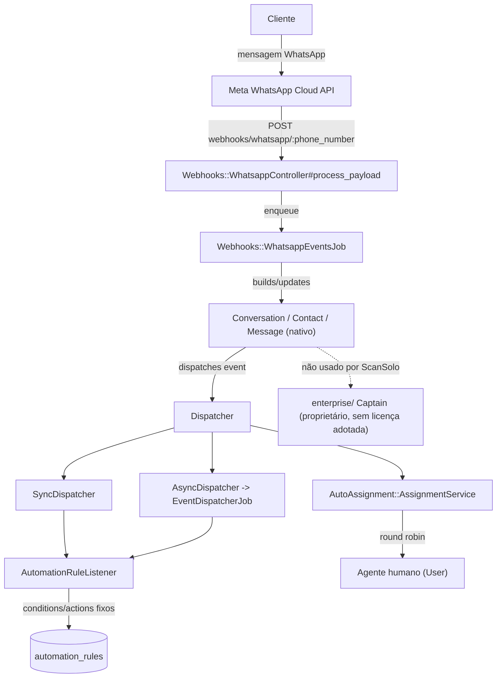
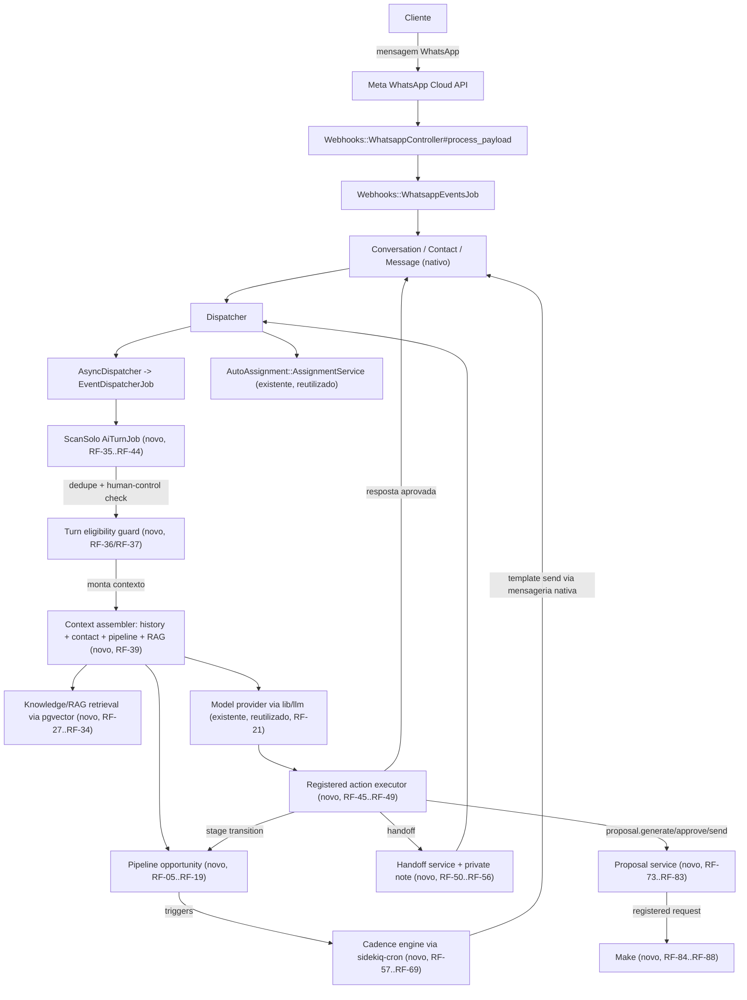

# SPEC: scansolo-chatwoot-platform

## Metadata
- Source: developer description via /plan (`.spec/inputs/scansolo-chatwoot-platform.md`)
- Service: ss-aiagentsystem (Chatwoot Community fork, ScanSolo extension layer)
- Tier: complete
- Version: 1.1
- Architecture references: `AGENTS.md`, `docs/agents/architecture.md`, `docs/agents/domain_rules.md`, `docs/agents/tech_stack.md`, `docs/agents/data_model.md`, `docs/agents/api_contracts.md`, `docs/agents/project_overview.md` (present, current). Behavior-preservation reference (not architecture authority): `docs/migration/LEXUS_REFERENCE_MAP.md`, `docs/migration/RUNTIME_DATA_INVENTORY.md`. Prior planning artifacts consulted for grounding: `docs/architecture/ADR-001-chatwoot-scansolo-platform.md`, `docs/architecture/END_TO_END_FLOW.md`, `docs/upstream/CHATWOOT_CAPABILITY_NOTES.md`.

## Context

ScanSolo needs one operational system — conversations, human service, contact context, AI-assisted qualification, commercial pipeline, proposal automation, deterministic follow-up cadences, and knowledge/RAG — replacing the legacy Lexus CRM runtime, built as an isolated extension layer on the imported Chatwoot Community codebase. Production integrations (real WhatsApp number, OpenAI key, Make scenarios, proposal API, DNS) stay disconnected until an explicit human cutover gate.

Codebase inspection (per the description's own Planning Authority section) confirms:

- Native Chatwoot already owns conversations/messages/contacts/agents/teams/assignment/labels/custom attributes/WhatsApp transport/REST API/webhooks/Sidekiq jobs, exactly as required to be reused (`docs/agents/architecture.md`, `docs/agents/api_contracts.md`).
- The inbound-message macro flow is: `Webhooks::WhatsappController#process_payload` → `Webhooks::WhatsappEventsJob` → `Conversation`/`Contact`/`Message` persistence → `Rails.configuration.dispatcher.dispatch` → `Dispatcher` → `SyncDispatcher`/`AsyncDispatcher` → listeners (`AutomationRuleListener`, `CaptainListener`, `WebhookListener`, `NotificationListener`) → `AutoAssignment::AssignmentService` (verified `app/controllers/webhooks/whatsapp_controller.rb`, `app/models/conversation.rb`, `app/dispatchers/`, `docs/agents/architecture.md`). This is the reuse seam the new AI turn flow must attach to, not a parallel pipeline.
- **Licensing boundary is already resolved, not a decision for this SPEC to reopen**: upstream `enterprise/` (including `enterprise/app/models/captain/assistant.rb`, verified present) is proprietary Chatwoot Enterprise-licensed code. `README.md` ("Licensing boundary"), `docs/architecture/ADR-001-chatwoot-scansolo-platform.md`, and `docs/upstream/CHATWOOT_CAPABILITY_NOTES.md` all independently confirm: the ScanSolo AI Agent Center, RAG, pipeline, cadence, proposal and Make modules must be **independently implemented Community/MIT code**, not copied/derived from `enterprise/` Captain. Only generic, license-clear Community UI/JS patterns (e.g. `app/javascript/dashboard/store/captain/assistant.js` structure) may inspire the new frontend, never the enterprise Ruby backend.
- A self-hosted, Community-compatible RAG design is achievable without the proprietary Captain backend: `pgvector`/`neighbor` gems are already Community-tier Gemfile dependencies (verified `docs/agents/tech_stack.md`, `docs/agents/data_model.md`), so the knowledge/RAG module is specified to use new, non-enterprise ScanSolo-owned tables on the existing PostgreSQL + pgvector stack.
- `AgentBot` (`app/models/agent_bot.rb`, verified) and the `message_created`/`conversation_*` event surface (`app/listeners/agent_bot_listener.rb`, verified) are reusable Community seams for triggering asynchronous bot-like behavior; the ScanSolo AI turn flow is specified to attach to the same `Dispatcher`/Sidekiq seam rather than inventing a new event bus.
- `AutomationRule` (`app/models/automation_rule.rb`, verified `actions_attributes` at line 54) is a fixed, closed vocabulary of conditions/actions and is **not** extended with ScanSolo-specific actions (that would violate its closed validation); ScanSolo pipeline/cadence/proposal automation is specified as new deterministic services, not new `AutomationRule` action types.
- WhatsApp template sending already has a native contract: `POST /api/v1/accounts/:account_id/conversations/:conversation_id/messages` accepts a `template_params` payload (verified `app/models/message.rb:51`, `swagger/paths/application/conversation/messages/create.yml`) — the cadence/proposal-send modules are specified to reuse this path, not a new WhatsApp client.
- Installation branding is already a native configuration seam: `config/installation_config.yml` defines `INSTALLATION_NAME`, `LOGO`, `LOGO_DARK`, `LOGO_THUMBNAIL`, `BRAND_URL`, `BRAND_NAME` (verified at lines 17, 21, 25, 29, 33, 37, 41).
- Background scheduling already has a native seam: `config/schedule.yml` (`sidekiq-cron`) plus `config/sidekiq.yml` (verified) — the cadence engine's due-attempt re-evaluation is specified to register there, not run an external cron process.
- Docker Compose topology already exists (`docker-compose.yaml`, `docker-compose.production.yaml`, `docker-compose.test.yaml`, verified present) as the base for the deployment documentation requirement.

## AS IS — Estado atual

Fluxo atual cobre apenas mensagem inbound do WhatsApp nativo até `Conversation`/`Message`, `AutomationRule` (vocabulário fechado) e atribuição humana round-robin. Não existem pipeline comercial, AI Agent Center, RAG, engine de cadência ou automação de proposta; o único backend de IA existente (`Captain`) está sob `enterprise/` proprietário e não pode ser reaproveitado sem licença.

## TO BE — Estado proposto

O novo `AiTurnJob` (RF-35–RF-44) é consumido a partir do `Dispatcher` nativo existente, monta contexto a partir do módulo de pipeline (RF-05–RF-19) e de conhecimento/RAG (RF-27–RF-34), só executa ações registradas (RF-45–RF-49) e só envia resposta pelo caminho nativo de mensagens (`Conversation`/`Message`). Handoff (RF-50–RF-56), engine de cadência (RF-57–RF-69) e propostas via Make (RF-73–RF-88) são módulos novos e isolados que reaproveitam `Conversation`/`Message`/`Dispatcher`/`AutoAssignment` nativos em vez de duplicá-los.

## Scope

- **In**: ScanSolo-specific extension modules — pipeline/Kanban, AI Agent Center configuration + telemetry, knowledge/RAG, the canonical guarded AI turn flow, registered agent actions/tool authorization, human handoff/AI-control state, follow-up cadence engine, WhatsApp-template reuse for cadence/proposal sends, proposal automation lifecycle, Make integration layer, security/privacy hardening for the new modules, isolated test mode, deployment documentation (Docker Compose), upstream-maintainability practices, Lexus migration/cutover design (document only), and explicit human-approval gates for every deferred production activation item.
- **Out**: modifying native Chatwoot conversation/contact/messaging/assignment behavior beyond additive extension points; copying or depending on proprietary `enterprise/` Captain implementation; connecting any real production credential/number/DNS; executing the Lexus production migration/cutover; performing a production deploy; final branding assets/hostname (deferred by the description itself, not by this SPEC).

## RIGID (Non-Negotiable)

### Functional Requirements

#### Product surface & branding

- RF-01 [Event-driven]: WHEN an authenticated ScanSolo account user opens the dashboard, THE SYSTEM SHALL present the 11 required modules (Conversas, Contatos, Pipeline, Agente de IA, Conhecimento, Follow-ups, Propostas, Equipe, Templates, Automação e integrações, Execuções e auditoria) as navigable entries built on the existing Vue 3 dashboard SPA routing.
  - AC: all 11 module entries render in navigation for an account with the ScanSolo extension enabled and each routes without a full page reload.
- RF-02: THE SYSTEM SHALL render all new ScanSolo-specific interface copy in pt-BR, with English source strings/tests/docs per `AGENTS.md` i18n rule (`en.json` for frontend).
  - AC: no bare/hardcoded string exists in a new ScanSolo Vue template; every new string resolves through the i18n mechanism with a pt-BR value present.
- RF-03: THE SYSTEM SHALL support ScanSolo branding (installation name, logo, dark-mode logo, favicon/thumbnail, brand name/URL, login branding, page title) exclusively through the existing `config/installation_config.yml`-backed settings (verified at lines 17, 21, 25, 29, 33, 37, 41), requiring zero domain-logic code changes.
  - AC: setting `INSTALLATION_NAME`/`LOGO`/`LOGO_DARK`/`LOGO_THUMBNAIL`/`BRAND_URL`/`BRAND_NAME` changes rendered branding with no edit to any ScanSolo domain-logic file.
- RF-04 [Unwanted]: THE SYSTEM SHALL NOT hardcode a production hostname under `scansolo.com.br` in application logic.
  - AC: a repository search for `scansolo.com.br` outside configuration/env-example/documentation returns zero matches.

#### Sales pipeline / Kanban

- RF-05: THE SYSTEM SHALL persist a new ScanSolo-owned entity (conceptually a "pipeline opportunity") holding the authoritative stage value, associated with exactly one `Account`, one `Contact`, and the originating `Conversation`, independent of labels/custom attributes.
  - AC: a test that only changes labels/custom attributes leaves the opportunity's stage column unchanged; stage reads always come from the opportunity's own column.
- RF-06: THE SYSTEM SHALL restrict the persisted stage to exactly: Novo Lead, Em Contato, Em Qualificação, Qualificado, Proposta Enviada, Negociação, Ganho, Perdido, in that order.
  - AC: persisting any other value raises a validation error surfaced as `422` at the API boundary.
- RF-07 [State-driven]: WHILE an opportunity's stage changes, THE SYSTEM SHALL append an immutable stage-history record (previous stage, new stage, actor, timestamp).
  - AC: every transition produces exactly one new history row; existing history rows are never updated/deleted by application code.
- RF-08: THE SYSTEM SHALL provide a Kanban view grouping opportunities by current stage with drag-and-drop stage-transition requests.
  - AC: a dragged card only visually moves after server confirmation; a rejected request reverts the card.
- RF-09 [Conditional]: IF a manual drag-and-drop transition fails server-side authorization/transition rules, THEN THE SYSTEM SHALL reject it and leave the persisted stage unchanged.
  - AC: a rejected transition returns a `4xx` and the database stage column is unchanged.
- RF-10: THE SYSTEM SHALL record an owner/responsible user per opportunity, reassignable by an authorized user.
  - AC: owner reassignment persists and is visible on the Kanban card/detail view.
- RF-11: THE SYSTEM SHALL display, per opportunity, the last customer interaction timestamp (from native Conversation/Message data) and the next scheduled follow-up timestamp (from the cadence engine, RF-63).
  - AC: both displayed values match the underlying native conversation activity timestamp and the cadence enrollment's next-attempt record respectively.
- RF-12: THE SYSTEM SHALL compute and display an inactivity/stale indicator per opportunity once no customer interaction has occurred for 48 hours, a fixed constant not configurable per account in this phase.
  - AC: an opportunity with its last customer interaction timestamp exactly 48 hours in the past is flagged stale; one second under 48 hours it is not.
- RF-13: THE SYSTEM SHALL provide Kanban/list filters including at minimum stage, owner, and stale state.
  - AC: applying a filter narrows the visible set to only matching opportunities in a query-level test.
- RF-14 [Event-driven]: WHEN a customer sends a real inbound message on a "Novo Lead" opportunity with no prior qualifying interaction, THE SYSTEM SHALL transition it to "Em Contato".
  - AC: a fake inbound message moves a Novo Lead opportunity to Em Contato exactly once; a second message does not re-trigger it.
- RF-15 [Event-driven]: WHEN a qualification interaction begins (per the agent's configured qualification playbook, RF-20) on an "Em Contato" opportunity, THE SYSTEM SHALL transition it to "Em Qualificação".
  - AC: a fixture that starts qualification moves the opportunity to Em Qualificação exactly once.
- RF-16 [Event-driven]: WHEN all configured required qualification fields are recorded as satisfied, THE SYSTEM SHALL transition the opportunity to "Qualificado".
  - AC: completing all required fields auto-transitions; one missing field leaves the stage unchanged.
- RF-17 [Event-driven]: WHEN a proposal send is validated as successful (RF-79), THE SYSTEM SHALL transition the opportunity to "Proposta Enviada".
  - AC: only a validated success event (not a send request) triggers the transition.
- RF-18 [Conditional]: IF an authorized human action explicitly requests moving an opportunity to "Negociação", THEN THE SYSTEM SHALL apply it; no automated rule may select "Negociação" on its own.
  - AC: no automated-rule test path produces the Negociação stage; only the explicit authorized action does.
- RF-19 [Unwanted]: THE SYSTEM SHALL NOT transition an opportunity's stage without either a registered deterministic rule (RF-14/RF-15/RF-16/RF-17) or an explicit authorized action, and WHILE an opportunity is in "Ganho" or "Perdido", THE SYSTEM SHALL treat the stage as terminal — no automatic transition rule and no new cadence enrollment fires on it.
  - AC: a review/test confirms no other code path calls the stage-transition service; cadence jobs against a Ganho/Perdido opportunity are no-ops; a non-authorized transition attempt out of Ganho/Perdido is rejected.

#### AI Agent Center

- RF-20: THE SYSTEM SHALL provide a per-account AI agent configuration record holding: name, enabled/disabled state, model provider, model selection, role, objective, persona/identity, tone, general instructions, service rules, qualification playbook, required qualification fields, restricted information, forbidden subjects, transfer criteria, response limits, service hours/channel behavior.
  - AC: creating a configuration with all listed fields persists and round-trips through the configuration API/UI.
- RF-21: THE SYSTEM SHALL resolve the agent's model/provider through the existing `lib/llm/` routing abstraction (verified `lib/llm/feature_router.rb`, `config/llm.yml`) supporting at minimum an OpenAI-compatible provider, without a second hand-rolled provider HTTP client.
  - AC: agent model invocation is traceable to the existing `Llm::FeatureRouter`-equivalent resolution path in code review; no duplicate OpenAI client class is introduced.
- RF-22: THE SYSTEM SHALL support draft and published configuration versions (or an equivalent safe-versioning mechanism) so an in-progress edit never affects a live conversation until published.
  - AC: editing a draft does not change live-conversation behavior; publishing atomically swaps the active version.
- RF-23: THE SYSTEM SHALL support an agent test mode that executes configured behavior against fake/mock conversations with zero outbound sends to any real transport (see RF-93).
  - AC: running test mode against a fixture conversation produces a simulated response and zero real-transport sends.
- RF-24: THE SYSTEM SHALL record, per AI turn, telemetry including invocation status, model/provider, input/output token counts where available, cost estimate where configured, latency, guardrail outcome, knowledge-retrieval evidence, action/tool evidence, failure reason, and correlation identifiers.
  - AC: after one turn, a telemetry record with all applicable fields exists and is queryable by correlation id.
- RF-25 [Unwanted]: THE SYSTEM SHALL NOT require a production OpenAI-equivalent API key to exercise the AI Agent Center or its test mode.
  - AC: the full agent-configuration/test-mode suite passes with no production LLM credential set.
- RF-26 [Unwanted]: THE SYSTEM SHALL NOT copy or depend on proprietary `enterprise/` Captain implementation (e.g. `enterprise/app/models/captain/assistant.rb`, verified present) to deliver ScanSolo agent behavior; the AI Agent Center SHALL be independently implemented Community/MIT code in a new non-enterprise namespace.
  - AC: no new ScanSolo agent class lives under `enterprise/`, requires, inherits from, or calls a `Captain::` enterprise class.

#### Knowledge / RAG

- RF-27: THE SYSTEM SHALL provide a knowledge center supporting document upload, FAQ entries, and service/company knowledge entries, each carrying source metadata (type, origin, added-by, timestamp).
  - AC: creating one entry of each type persists with source metadata and is listable in the Conhecimento module.
- RF-28: THE SYSTEM SHALL chunk and index knowledge content and generate vector embeddings using the existing PostgreSQL + `pgvector`/`neighbor` gem stack (verified `docs/agents/tech_stack.md`, `docs/agents/data_model.md`) via new non-enterprise ScanSolo tables, not a proprietary/managed vector store.
  - AC: after ingesting a document, a retrieval query against its content returns at least one matching chunk with a similarity score from a ScanSolo-owned pgvector-backed table.
- RF-29: THE SYSTEM SHALL capture source/evidence identifiers on every retrieved chunk traceable to its originating document/FAQ entry.
  - AC: a retrieval-test call returns, per result, a reference to the source entry id.
- RF-30: THE SYSTEM SHALL support enabling/disabling a knowledge source, excluding disabled sources from retrieval without deleting their data.
  - AC: disabling a source removes its chunks from subsequent retrieval-test results.
- RF-31: THE SYSTEM SHALL support idempotent reindex/retry of a knowledge source.
  - AC: triggering reindex twice does not duplicate chunks/embeddings.
- RF-32: THE SYSTEM SHALL provide a retrieval test/simulator returning ranked chunks/evidence for an operator-submitted query outside a live conversation.
  - AC: the simulator returns results for a query against indexed content in the UI.
- RF-33: THE SYSTEM SHALL support deletion/revocation of a knowledge source, removing its content from future retrieval.
  - AC: after deletion, a retrieval-test query no longer returns chunks from the deleted source.
- RF-34 [Unwanted]: IF the vector provider/index is unavailable when the AI turn flow requests retrieval, THEN THE SYSTEM SHALL continue the turn without RAG evidence rather than failing the whole turn.
  - AC: a simulated vector-store outage yields a turn result with empty RAG evidence and a recorded failure-reason entry, not an unhandled exception reaching the send path.

#### Canonical guarded AI turn flow

- RF-35: THE SYSTEM SHALL execute an AI turn only after its triggering inbound message is persisted through native Chatwoot conversation/message models (verified `app/models/conversation.rb`, `Webhooks::WhatsappEventsJob`).
  - AC: no AI-turn record exists for a message id without a corresponding persisted native `Message` row.
- RF-36 [Unwanted]: THE SYSTEM SHALL NOT produce more than one AI turn/response for the same inbound message id, including under Sidekiq job retry.
  - AC: enqueuing the AI-turn job twice for the same message id produces exactly one outbound AI message and one turn record.
- RF-37 [Conditional]: IF the conversation is in a human-controlled or opted-out state (RF-50), THEN THE SYSTEM SHALL suppress the automatic AI turn for that inbound message.
  - AC: an inbound message on a human-owned conversation produces zero AI-authored outbound messages.
- RF-38: THE SYSTEM SHALL apply an input guardrail to inbound content before model invocation and SHALL bound the actions available to the model for that turn per the agent's configured autonomy policy (RF-45).
  - AC: a turn's evidence record shows a recorded guardrail outcome and an action list distinct from "all registered actions."
- RF-39: THE SYSTEM SHALL assemble turn context from, at minimum: recent canonical Chatwoot conversation history, contact context, pipeline/opportunity context, proposal context, and RAG retrieval results, before model invocation.
  - AC: the turn's context snapshot references all five sources or an explicit "not applicable" marker per source.
- RF-40 [Optional]: WHERE durable semantic memory is configured, THE SYSTEM SHALL include it as an auxiliary context layer subordinate to canonical Chatwoot conversation history.
  - AC: disabling durable memory does not remove canonical conversation history from the turn context.
- RF-41 [Unwanted]: THE SYSTEM SHALL NOT send an outbound message containing an unvalidated transactional claim (price, delivery status, proposal-send confirmation) not produced by a deterministic registered action/service (RF-46, RF-73–RF-83).
  - AC: a model attempt to state a price without an approved `proposal.generate`/`proposal.send` result is blocked by output validation before send.
- RF-42 [Conditional]: IF model provider invocation fails (timeout/error/malformed output), THEN THE SYSTEM SHALL preserve already-persisted inbound history unchanged and SHALL NOT send a customer-facing message for that turn.
  - AC: a simulated provider failure leaves prior history intact, produces zero new outbound customer messages, and records a failure-reason telemetry entry.
- RF-43: THE SYSTEM SHALL send the model's approved final response only through native Chatwoot outbound messaging (same path as human replies), and SHALL persist a usage/evidence/audit record whose content matches exactly what was sent.
  - AC: the persisted outbound `Message` content is identical to the content delivered through the native send path; a matching evidence record references that message id.
- RF-44: THE SYSTEM SHALL execute a turn's registered tool/action requests through the deterministic action layer (RF-45) before/at the same transaction boundary as persisting the final response, updating pipeline/handoff operational state as required by the action results.
  - AC: an action result (e.g. stage transition) is visible in the opportunity record no later than the outbound message being queued.

#### Agent actions and tool authorization

- RF-45: THE SYSTEM SHALL classify every registered agent action into exactly one of: read-only, automatic, requires-confirmation, disabled.
  - AC: every action definition has exactly one classification from this fixed set; an unclassified action cannot be registered.
- RF-46: THE SYSTEM SHALL define each side-effect action (automatic or requires-confirmation) with a server-side schema, explicit authorization check, idempotency key, correlation id, and audit record, executed by a deterministic executor, never free-form model code.
  - AC: invoking the same action twice with the same idempotency key produces the side effect exactly once; the audit log links it to its originating turn's correlation id.
- RF-47 [Unwanted]: THE SYSTEM SHALL NOT allow the model to select an arbitrary URL, HTTP method, secret, token, SQL statement, shell command, or webhook destination for any action.
  - AC: the action executor accepts only a registered action id plus schema-validated structured parameters; a free-form URL/command/SQL parameter is rejected by the schema.
- RF-48: THE SYSTEM SHALL provide at minimum the following registered commercial actions: locate/update allowed contact qualification fields, request a pipeline stage transition (RF-14–RF-18), create a private handoff/operational note, request proposal generation, request proposal approval/send where allowed, emit a cadence/workflow signal, request human handoff.
  - AC: each listed action exists, is classified, schema-validated, and exercised by at least one test.
- RF-49 [Conditional]: IF an action is classified "requires-confirmation", THEN THE SYSTEM SHALL NOT execute its side effect until an explicit confirming authorization is recorded.
  - AC: a requires-confirmation action invoked without a recorded confirmation stays pending and produces no side effect.

#### Human handoff and control

- RF-50: THE SYSTEM SHALL represent, per conversation, an explicit AI-control state distinguishing at minimum: AI active, handoff requested, awaiting human, human active, paused, closed/resolved — mapped onto native Chatwoot status/assignment (`Conversation#bot_handoff!`, verified `app/models/conversation.rb:183`) plus an added field only where native status is insufficient.
  - AC: every conversation exposes a resolvable AI-control state; each value has a covering state-transition test.
- RF-51 [Event-driven]: WHEN a handoff is requested (model action or human), THE SYSTEM SHALL create a private note with transfer reason, concise summary, customer objective, collected qualification fields, objections, pipeline stage, proposal status, pending actions, and recommended next step, and SHALL suppress further automatic AI replies on that conversation.
  - AC: exactly one private note with all nine elements exists after handoff; a subsequent inbound message produces zero further AI-authored replies until an authorized return to AI.
- RF-52 [Unwanted]: THE SYSTEM SHALL NOT resume automatic AI replies on a human-active/paused conversation without an explicit authorized "return to AI" action.
  - AC: no code path other than the explicit return-to-AI action clears human-active/paused control state.
- RF-53: THE SYSTEM SHALL make duplicate takeover/return-to-AI commands idempotent.
  - AC: issuing the same command twice leaves the same resulting state as issuing it once, with no duplicate audit entry beyond the first.
- RF-54: THE SYSTEM SHALL require the same role/permission level authorized to take over a conversation (the assigned agent or an account administrator) to authorize a "return to AI" action — symmetric with the takeover authorization policy, with no separate authorization concept introduced for return-to-AI.
  - AC: a return-to-AI attempt by a user who is neither the assigned agent nor an account administrator is rejected; an attempt by either is applied.
- RF-55: THE SYSTEM SHALL keep all human outbound messages in native Chatwoot conversation history — no parallel human-message store.
  - AC: a human reply during a human-active conversation appears in the same `Message` timeline as AI/customer messages.
- RF-56 [Event-driven]: WHEN human takeover occurs, THE SYSTEM SHALL pause or cancel applicable pending cadence work for that opportunity per the cadence stop-condition policy (RF-66).
  - AC: a scheduled-but-unsent cadence step is paused/cancelled within the same processing window as the takeover; an already-sent step is not retroactively altered.

#### Follow-up cadence engine

- RF-57: THE SYSTEM SHALL provide a versioned/configurable cadence definition per stage, initially: Novo Lead — 4 attempts at +2h/+24h/+48h/+96h from enrollment; Em Contato — 5 attempts, 24h apart by default; Em Qualificação — 7 attempts, 24h apart by default.
  - AC: enrolling a fixture opportunity in each stage's cadence schedules exactly the attempt count/offsets above.
- RF-58: THE SYSTEM SHALL send cadence messages only within 09:00–20:00 `America/Sao_Paulo`, any day of the week, deferring a due attempt that falls outside the window to the next in-window moment.
  - AC: an attempt computed for 21:00 `America/Sao_Paulo` is not sent before the next 09:00 `America/Sao_Paulo`.
- RF-59: THE SYSTEM SHALL make cadence enrollment idempotent — enrolling the same opportunity in the same cadence definition twice does not create two active enrollments.
  - AC: calling enrollment twice with identical inputs results in exactly one active enrollment record.
- RF-60: THE SYSTEM SHALL schedule cadence attempts through the native background-job architecture (Sidekiq + `sidekiq-cron`, verified `config/schedule.yml`, `config/sidekiq.yml`), not an external scheduling process.
  - AC: due-attempt processing is triggered by a registered job visible in `config/schedule.yml`.
- RF-61 [Unwanted]: THE SYSTEM SHALL NOT send a duplicate cadence attempt on job retry once a step is already marked sent.
  - AC: re-running a cadence-step job for an already-sent step produces zero additional sends.
- RF-62: THE SYSTEM SHALL persist an immutable execution evidence/snapshot per cadence attempt (cadence version, template reference, scheduled time, actual send time, result) sufficient for audit.
  - AC: each attempt has exactly one evidence record, never updated after a terminal result is recorded.
- RF-63: THE SYSTEM SHALL expose current step and next-attempt time per active enrollment, consumed by RF-11's Kanban display.
  - AC: the Kanban "next scheduled follow-up" value matches the enrollment's persisted next-attempt timestamp.
- RF-64: THE SYSTEM SHALL support pause/resume/cancel on an active enrollment.
  - AC: pausing prevents the next attempt from firing; resuming re-arms at the correct offset; cancelling permanently stops all remaining attempts.
- RF-65 [Conditional]: IF a customer reply leaves all required qualification fields for the opportunity's current stage satisfied (the RF-16 "all required fields satisfied" detection rule), THEN THE SYSTEM SHALL treat it as a "full customer reply" and stop/recalculate all pending cadence work; IF any required qualification field remains unsatisfied, THEN THE SYSTEM SHALL treat it as a "partial customer reply" and cancel only the immediate pending send, recalculating remaining eligibility. This detection is deterministic field-completeness only, with no NLP/intent-classifier dependency.
  - AC: a fixture reply that completes all required fields for the current stage stops/recalculates the full pending schedule; a fixture reply leaving at least one required field unsatisfied cancels only the immediate pending send and leaves subsequent eligibility to be recalculated.
- RF-66 [Conditional]: IF stage change, won, lost, opt-out, manual pause, or cadence replacement/cancellation occurs, THEN THE SYSTEM SHALL stop and/or recalculate applicable pending cadence work per the policy for the new state.
  - AC: each listed trigger has at least one test asserting the pending schedule is stopped or recalculated as specified.
- RF-67 [Unwanted]: IF the mapped WhatsApp template for a due attempt is unavailable/not approved, or automation is disabled for the account/inbox, THEN THE SYSTEM SHALL NOT send the attempt and SHALL record a safe-failure/skip result instead of raising an unhandled error.
  - AC: a fixture with a missing/unapproved template produces a recorded skip/failure evidence entry and zero send attempts.
- RF-68: THE SYSTEM SHALL support manual enrollment only when explicitly authorized, and SHALL support a test/simulation mode with accelerated/simulated timing.
  - AC: an unauthorized manual-enrollment request is rejected (`4xx`); test-mode enrollment can advance through all configured attempts without real wall-clock waiting.
- RF-69 [Unwanted]: THE SYSTEM SHALL NOT use LLM-based waiting/timing to compute cadence schedules — all offsets are deterministic configuration values.
  - AC: code/spec review confirms no cadence scheduling calculation depends on an LLM call.

#### Meta WhatsApp templates

- RF-70: THE SYSTEM SHALL keep native Chatwoot as the sole WhatsApp transport owner; cadence/proposal-send steps reference provider templates available/approved for the connected inbox and send through the existing conversation message-create path supporting `template_params` (verified `app/models/message.rb:51`).
  - AC: a cadence/proposal send constructs a native message-create request using the documented `template_params` shape, with no parallel WhatsApp client.
- RF-71: THE SYSTEM SHALL support fake/test template references so cadence and proposal-send flows are fully testable before a real WhatsApp number is connected.
  - AC: the full cadence/proposal test suite passes using fake template identifiers with zero calls reaching a real Meta endpoint.
- RF-72 [Unwanted]: THE SYSTEM SHALL NOT mark a cadence/proposal send as successfully sent before native Chatwoot's transport accepts the send operation, and SHALL capture later delivery/read/failure status when exposed by native Chatwoot events.
  - AC: a simulated transport rejection leaves the attempt's evidence record non-"sent"; a simulated acceptance followed by a delivery-status webhook updates the same record rather than creating a duplicate.

#### Proposal automation

- RF-73: THE SYSTEM SHALL expose three separable actions — `proposal.generate`, `proposal.approve`, `proposal.send` — invocable independently and never collapsed into one implicit step.
  - AC: calling `proposal.generate` alone sends nothing; `proposal.send` cannot execute without a prior successful `proposal.generate` (and approval where required) result for the same version.
- RF-74 [Conditional]: IF an opportunity's required proposal fields are not all deterministically validated as complete, THEN THE SYSTEM SHALL reject a `proposal.generate` request.
  - AC: a fixture missing one required field is rejected; no proposal record is created.
- RF-75: THE SYSTEM SHALL request proposal generation exclusively through the registered Make integration (or its mock provider outside production) and persist proposal version/reference/value/artifact metadata only after a validated result/callback.
  - AC: a mock-provider flow persists proposal fields only after the mock callback is validated, not from the request alone.
- RF-76 [Unwanted]: THE SYSTEM SHALL NOT allow the AI model to invent or compute an authoritative price, discount, total, or payment condition; those values originate only from the deterministic Make/proposal integration result.
  - AC: a test confirms the model's raw output is never written directly to price/discount/total fields — only the integration-result handler sets them.
- RF-77: THE SYSTEM SHALL protect proposal version/current-reference integrity — only one version is "current" per opportunity, and approval/send operate against the current version.
  - AC: generating a new version marks the previous non-current; a send against a stale version is rejected.
- RF-78 [Optional]: WHERE human approval is configured as required, THE SYSTEM SHALL block `proposal.send` until an explicit approval is recorded.
  - AC: with approval required, a send without recorded approval is rejected; with approval not required, send proceeds directly from a generated proposal.
- RF-79 [Unwanted]: THE SYSTEM SHALL NOT report a proposal as successfully sent before a validated send-integration/transport result is received (per RF-72).
  - AC: a simulated send failure leaves proposal status as not-sent; only a validated success result sets sent status.
- RF-80: THE SYSTEM SHALL make `proposal.generate`/`proposal.send` callback handling idempotent — duplicate callbacks for the same correlation id never create duplicate versions/sends.
  - AC: delivering the same mock callback payload twice results in exactly one persisted state change.
- RF-81: THE SYSTEM SHALL retry only safely-retryable proposal-integration failures (no partial/unknown side effect) and SHALL NOT auto-retry an operation with unsafe side-effect state.
  - AC: a retryable failure is retried without duplicating a proposal/send; an unsafe failure is left for manual review, not auto-retried.
- RF-82 [Event-driven]: WHEN a proposal send is validated as successful, THE SYSTEM SHALL transition the opportunity's stage to "Proposta Enviada" (RF-17) and enroll it in the configured post-proposal cadence.
  - AC: a mock successful-send fixture produces both the stage transition and a new active cadence enrollment.
- RF-83: THE SYSTEM SHALL support a mock proposal provider usable without any real proposal API/Make production credential.
  - AC: the full proposal test suite passes with only the mock provider configured.

#### Make integration platform

- RF-84: THE SYSTEM SHALL register Make integration configuration (scenario endpoint reference, secrets) server-side only, with secrets encrypted at rest, and SHALL NOT place Make calls in the default message-response path unless a registered action explicitly requires it.
  - AC: no Make HTTP call occurs during a standard AI turn absent a proposal/Make-backed action; Make credentials never appear in a client-facing payload.
- RF-85: THE SYSTEM SHALL attach a correlation ID and idempotency key to every outbound Make request and validate signed/authenticated inbound callbacks where technically supported, rejecting callbacks that fail signature/authenticity/replay checks.
  - AC: an inbound callback with invalid/replayed signature is rejected without applying a state change; a validly-signed callback reusing a prior idempotency key does not reapply its side effect.
- RF-86: THE SYSTEM SHALL validate every Make callback payload against a registered response schema before persisting any result, and SHALL provide retry/dead-letter/error visibility for failed integration requests.
  - AC: a malformed callback is rejected and recorded as an error without mutating proposal/pipeline state; a repeatedly-failing outbound request is visible in an error/dead-letter view under Execuções e auditoria.
- RF-87 [Unwanted]: THE SYSTEM SHALL NOT expose a generic/arbitrary callback command letting an external caller mutate account/proposal/pipeline state outside the registered, schema-validated contract for the specific action that initiated the request.
  - AC: a callback referencing an action/correlation id it was not issued for is rejected.

#### Security and privacy

- RF-88: THE SYSTEM SHALL store all ScanSolo-specific integration secrets (Make, proposal API, future production keys) server-side only, never in client-facing responses, model prompts, or logs.
  - AC: a redaction test confirms secret-shaped values are absent/redacted from application logs and from any prompt/context payload sent to the LLM provider.
- RF-89: THE SYSTEM SHALL enforce least-privilege authorization on every new ScanSolo endpoint/action using the existing Pundit policy pattern (`docs/agents/architecture.md` layer responsibilities), failing closed (deny) on ambiguous authorization or unverifiable callback identity.
  - AC: a request/callback whose authorization/identity cannot be positively verified is denied by default.
- RF-90: THE SYSTEM SHALL route knowledge-base attachment uploads through the existing native attachment storage/validation mechanism, introducing no parallel unvalidated upload path.
  - AC: a knowledge-document upload uses the existing attachment path; a test asserts no new unvalidated file-write path exists.

#### Test mode

- RF-91: THE SYSTEM SHALL provide an isolated test mode covering fake conversations/messages, mock LLM responses, RAG retrieval, action/tool evidence, pipeline transitions, human takeover and return, cadence scheduling with accelerated/simulated timing, fake Meta template references, mock Make request/callback, mock proposal artifact/value, and retry/duplicate-event behavior — with zero real WhatsApp sends, zero real customer data requirement, and zero production secrets.
  - AC: the full ScanSolo test suite (RSpec + Vitest) runs to completion with no production credential present and zero outbound requests to a real external endpoint (enforced by `webmock`, already in the Gemfile per `docs/agents/tech_stack.md`).
- RF-92: THE SYSTEM SHALL make description §20 acceptance-outcome items 1–19 independently reproducible via the automated test suite without any production token/key/phone number.
  - AC: each of the 19 non-deployment §20 items has at least one corresponding automated test passing without production credentials.

#### Deployment target

- RF-93: THE SYSTEM SHALL document a Docker Compose topology (web, Sidekiq worker(s), PostgreSQL, Redis, S3-compatible storage, reverse proxy/TLS, health checks, persistent volumes, migrations, restart policy, backup/restore, environment variable management, log rotation/observability, rollback), building on the existing `docker-compose.yaml`/`docker-compose.production.yaml` (verified present).
  - AC: a staging deployment procedure using these compose files plus any additive ScanSolo service definitions, plus a rollback procedure, is documented (§20 item 20) without an actual production deploy occurring.
- RF-94 [Unwanted]: THE SYSTEM SHALL NOT perform a production deployment, DNS cutover, or provider activation as part of autonomous implementation.
  - AC: no `PHASES.md` task includes a production-deploy or DNS-change side effect without its own explicit human-approval gate.

#### Upstream maintainability

- RF-95: THE SYSTEM SHALL implement all ScanSolo-specific backend code under an isolated, dedicated namespace distinct from pre-existing `app/` core files and from `enterprise/`, using additive migrations only (no destructive change to pre-existing Chatwoot tables/columns).
  - AC: a diff against the upstream baseline shows zero modified lines in pre-existing non-ScanSolo core files for a representative ScanSolo feature; every new migration is a pure `create_table`/additive `add_column` (no `remove_column`/`change_column` on pre-existing Community tables).
- RF-96: THE SYSTEM SHALL reuse existing events/hooks/jobs/Vue components (`Dispatcher`/`AsyncDispatcher`, Sidekiq, Pundit, existing dashboard routing pattern) instead of introducing parallel infrastructure, per `docs/upstream/CHATWOOT_CAPABILITY_NOTES.md` "upstream-first" rule.
  - AC: every new ScanSolo domain event is dispatched through the existing `Dispatcher`/`AsyncDispatcher`, not a new pub/sub mechanism.
- RF-97: THE SYSTEM SHALL document every customization carrying high expected merge-conflict risk against `chatwoot/chatwoot` upstream (per `docs/architecture/ADR-001-chatwoot-scansolo-platform.md` Upstream strategy).
  - AC: a maintained document lists each high-risk customization (e.g. any edit to `app/models/conversation.rb`, `app/models/message.rb`, `config/routes.rb`) with rationale.

#### Migration from Lexus

- RF-98: THE SYSTEM SHALL produce, before cutover, a documented migration/cutover design for the minimum ScanSolo continuity data (contact identity, active pipeline state, qualification fields, proposal state/reference, cadence state or re-enrollment strategy, agent configuration, knowledge sources, approved template mappings, human ownership/handoff state), per `docs/migration/LEXUS_REFERENCE_MAP.md` and `docs/migration/RUNTIME_DATA_INVENTORY.md`.
  - AC: a migration/cutover design document covers every listed category with an explicit decision (migrate / re-derive / explicitly discard) per category.
- RF-99 [Unwanted]: THE SYSTEM SHALL NOT migrate production Lexus data or disable Lexus for ScanSolo during implementation.
  - AC: no implementation task performs a live write against the Lexus production system; the migration design stays a document until the human cutover gate.

#### Deferred final activation

- RF-100 [Unwanted]: THE SYSTEM SHALL NOT connect the real ScanSolo WhatsApp number, change the production Meta webhook, set a production Meta/OpenAI/Make/proposal credential, switch final DNS under `scansolo.com.br`, send a real customer message, migrate/cut over production data, or disable ScanSolo in Lexus, without an explicit separate human-approval gate per item (§19, §21).
  - AC: `PHASES.md` generated from this SPEC places each of these actions behind its own explicit human-approval gate, none bundled into an unattended task.

### UI Requirements

- UI-01: THE SYSTEM SHALL provide a Kanban board (Pipeline module) with drag-and-drop cards showing stage, owner, last interaction, next follow-up, and stale indicator.
  - AC: all five data points render per card for a seeded opportunity.
- UI-02: THE SYSTEM SHALL provide an opportunity detail view showing stage history, related contact, and related conversation link.
  - AC: opening a card shows a chronological stage-history list matching RF-07 records.
- UI-03: THE SYSTEM SHALL provide an AI Agent Center configuration screen exposing every RF-20 field with draft/published state indication.
  - AC: the screen shows a visible draft-vs-published indicator and blocks accidental publish without explicit confirmation.
- UI-04: THE SYSTEM SHALL provide a per-turn telemetry/evidence viewer showing the RF-24 fields and RF-38/RF-39 guardrail and context evidence.
  - AC: selecting a turn shows guardrail outcome, knowledge evidence, and action evidence for that turn.
- UI-05: THE SYSTEM SHALL provide a Knowledge/RAG management screen (upload, FAQ, enable/disable, reindex, retrieval simulator) per RF-27–RF-33.
  - AC: each listed operation is reachable and functional from this screen.
- UI-06: THE SYSTEM SHALL provide a conversation-level handoff/control indicator showing the current AI-control state (RF-50) and takeover/return actions.
  - AC: the indicator updates immediately after a takeover/return action and reflects RF-53 idempotency (no duplicate state flicker on repeated clicks).
- UI-07: THE SYSTEM SHALL provide a Follow-ups screen showing active cadence enrollments, current step, next attempt, and pause/resume/cancel controls per RF-63–RF-64.
  - AC: pausing an enrollment from this screen is reflected in the persisted enrollment state within the same request/response cycle.
- UI-08: THE SYSTEM SHALL provide a Propostas screen showing proposal versions, current/non-current status, approval state, and generate/approve/send actions gated per RF-73–RF-78.
  - AC: the send action is disabled in the UI when the current version is unapproved and approval is required.
- UI-09: THE SYSTEM SHALL provide an Execuções e auditoria screen surfacing cadence evidence (RF-62), Make request/callback error/dead-letter visibility (RF-86), and action audit records (RF-46).
  - AC: a simulated failed Make callback appears in this screen's error view.

### Contracts

Exact route/path naming is an implementation decision (see FLEXIBLE); the following define the binding request/response and safety semantics.

- CT-01: Pipeline stage-transition request — account-scoped, authenticated via existing Chatwoot session/API-token auth, idempotent per `(opportunity_id, target_stage, actor)` within a short window, returns a `4xx` on an invalid/unauthorized transition (backs RF-08, RF-09, RF-18).
- CT-02: AI agent configuration read/write — account-scoped, authenticated, exposes draft vs published state distinctly, publish is an explicit atomic operation (backs RF-22, UI-03).
- CT-03: Knowledge retrieval-test request — account-scoped, authenticated, returns ranked chunks with source/evidence ids (backs RF-29, RF-32).
- CT-04: Registered agent-action execution — internal contract invoked by the AI turn service only (not directly client-callable), requires a registered action id, schema-validated structured parameters, and an idempotency key for side-effect actions (backs RF-46, RF-47).
- CT-05: Handoff / return-to-AI action — authenticated, authorization-checked, idempotent per conversation, creates the RF-51 private-note contract on handoff (backs RF-50–RF-54).
- CT-06: Cadence enrollment / pause / resume / cancel — idempotency key = `(opportunity_id, cadence_definition_version)`, authorization required for manual enrollment (backs RF-59, RF-64, RF-68).
- CT-07: Proposal actions (`proposal.generate` / `proposal.approve` / `proposal.send`) — each independently schema-validated, correlation-id required, version-guarded against the current proposal version (backs RF-73, RF-77, RF-80).
- CT-08: Outbound Make integration request — correlation id + idempotency key + structured request schema, no arbitrary caller-supplied URL/command (backs RF-84, RF-85, RF-87).
- CT-09: Inbound Make callback — signature/authenticity verification, replay protection, response-schema validation, idempotent per correlation id (backs RF-85, RF-86, RF-87).

### Non-Functional Requirements

- RNF-01: Idempotency — every side-effect action (RF-46), cadence send (RF-61), and Make callback (RF-85, RF-86) SHALL be safe to retry: identical key → identical result, no duplicate side effect.
- RNF-02: Auditability — every pipeline transition (RF-07), handoff event (RF-51), cadence attempt (RF-62), and proposal state change (RF-80) SHALL produce an immutable, queryable audit/evidence record.
- RNF-03: No production secret required for the ScanSolo test suite (binary; description §20 item 19, RF-91).
- RNF-04: Additive-only schema changes for ScanSolo tables — no destructive change to a pre-existing Chatwoot column/table (RF-95).
- RNF-05: Rate limiting — THE SYSTEM SHALL apply rate limiting to the Make inbound-callback endpoint only (the unauthenticated external caller), implemented via the existing `Rack::Attack` pattern (`config/initializers/rack_attack.rb`); the numeric threshold is left to the planner/implementer to size within the existing throttle ranges in that initializer (5–3000/min), with no rate limiting mandated on AI-turn invocation frequency or manual cadence-enrollment frequency by this SPEC (binary: throttle rule present and scoped to that endpoint; RF-85).
- RNF-06: Replay protection — THE SYSTEM SHALL enforce replay protection via a permanent database-level uniqueness constraint on the Make callback correlation id, with no TTL/expiry; a replayed callback is rejected indefinitely (binary: uniqueness constraint present and enforced; RF-85, RF-86).
- RNF-07: Log/prompt redaction — no secret-shaped value (API key/token pattern) SHALL appear in application logs or in any payload sent to the LLM provider (binary; RF-88).
- RNF-08: pt-BR UI copy coverage — 100% of new ScanSolo-facing interface strings SHALL resolve through the i18n mechanism with a pt-BR value present (binary; RF-02).

## FLEXIBLE (Implementation Suggestions)

- Backend namespace: `ScanSolo::` module under new directories mirroring existing layout — `app/models/scan_solo/`, `app/services/scan_solo/`, `app/jobs/scan_solo/`, `app/policies/scan_solo/`, controllers under an `api/v1/accounts/:account_id/scan_solo/*` route namespace (mirrors the existing `api/v1/accounts/:account_id/*` convention, verified `config/routes.rb`).
- Table naming: prefix new tables `scan_solo_` (e.g. `scan_solo_pipeline_opportunities`, `scan_solo_pipeline_stage_events`, `scan_solo_ai_agent_configs`, `scan_solo_ai_turns`, `scan_solo_knowledge_sources`, `scan_solo_knowledge_chunks`, `scan_solo_cadence_definitions`, `scan_solo_cadence_enrollments`, `scan_solo_cadence_attempts`, `scan_solo_proposals`, `scan_solo_proposal_versions`, `scan_solo_make_requests`, `scan_solo_make_callbacks`, `scan_solo_agent_actions`, `scan_solo_agent_action_executions`).
- Use the `neighbor` gem's `has_neighbors` directly on a new `ScanSolo::KnowledgeChunk` pgvector column instead of any `Captain::` model dependency.
- Trigger the AI turn via a new `ScanSolo::ConversationListener` (mirroring `AutomationRuleListener`) subscribed to `message_created`/`conversation_updated` through the existing `Dispatcher`, enqueuing a `ScanSolo::AiTurnJob` — no polling.
- Represent AI-control state as a new enum column on a 1:1 `ScanSolo::ConversationExtension` model rather than modifying the core `conversations.status` enum.
- Mirror existing Pundit policy naming (`ScanSolo::PipelineOpportunityPolicy`, `ScanSolo::ProposalPolicy`, etc.) under `app/policies/scan_solo/`.
- Register cadence re-evaluation in `config/schedule.yml` via `sidekiq-cron`, reusing the existing `trigger_scheduled_items_job`-style pattern at a 5-minute cadence.
- Vue routes under `app/javascript/dashboard/routes/dashboard/scansolo/{pipeline,agent,knowledge,followups,proposals,executions}` with Pinia stores, taking only structural inspiration from `app/javascript/dashboard/store/captain/assistant.js` (JS pattern only, never the enterprise Ruby backend).
- Use the already-present `ai-agents`/`ruby_llm` gems for model invocation instead of a hand-rolled HTTP client (per `AGENTS.md` "prefer existing repo dependencies").
- Gate the entire ScanSolo layer behind an account feature flag (`FlagShihTzu` bit on `Account`, verified pattern in `docs/agents/data_model.md`) so upstream merges cannot accidentally expose it on non-ScanSolo accounts.
- Represent the fixed action-classification set (`read-only`/`automatic`/`requires_confirmation`/`disabled`) as a Rails enum on the new action-registration model, mirroring `AutomationRule`'s closed-vocabulary validation style (verified `app/models/automation_rule.rb`) without touching `AutomationRule` itself.

## Acceptance Criteria Summary

| ID | Criterion | Testable? |
|----|-----------|-----------|
| RF-01 | All 11 modules navigable in dashboard | Yes |
| RF-02 | 100% new UI strings i18n-covered, pt-BR present | Yes |
| RF-03 | Branding via `installation_config.yml` only | Yes |
| RF-04 | No hardcoded `scansolo.com.br` in app logic | Yes |
| RF-05 | Stage authoritative on new entity, independent of labels | Yes |
| RF-06 | Stage restricted to 8 confirmed values | Yes |
| RF-07 | Immutable stage-history record per transition | Yes |
| RF-08 | Kanban drag-and-drop confirmed server-side | Yes |
| RF-09 | Invalid transition rejected, stage unchanged | Yes |
| RF-10 | Owner recorded and reassignable | Yes |
| RF-11 | Last interaction + next follow-up displayed accurately | Yes |
| RF-12 | Stale threshold (48h) defined and applied | Yes |
| RF-13 | Kanban filters (stage/owner/stale) functional | Yes |
| RF-14–RF-17 | Deterministic auto-transitions fire exactly once | Yes |
| RF-18 | Negociação only via authorized action | Yes |
| RF-19 | No arbitrary stage; Ganho/Perdido terminal | Yes |
| RF-20–RF-24 | Agent config, provider reuse, versioning, test mode, telemetry | Yes |
| RF-25 | No production LLM key required | Yes |
| RF-26 | No enterprise Captain code copied/depended on | Yes |
| RF-27–RF-33 | Knowledge CRUD, indexing, evidence, reindex, retrieval test | Yes |
| RF-34 | Safe failure on vector-provider outage | Yes |
| RF-35–RF-39 | Turn ordering, dedupe, suppression, guardrail, context assembly | Yes |
| RF-40 | Durable memory subordinate to canonical history | Yes |
| RF-41 | No unvalidated transactional claims sent | Yes |
| RF-42 | Provider failure preserves history, no send | Yes |
| RF-43 | Send only via native path; evidence matches sent content | Yes |
| RF-44 | Actions executed before/at response persistence | Yes |
| RF-45–RF-49 | Action classification, schema/idempotency/audit, no arbitrary exec, minimum action set, confirmation gating | Yes |
| RF-50–RF-53 | AI-control state, handoff note + suppression, no auto-resume, idempotent commands | Yes |
| RF-54 | Return-to-AI authorization role (assigned agent/admin, symmetric with takeover) | Yes |
| RF-55–RF-56 | Human messages in native history; takeover pauses cadence | Yes |
| RF-57–RF-64 | Cadence definitions, window, idempotent enrollment, native scheduling, no duplicate sends, evidence, visibility, pause/resume/cancel | Yes |
| RF-65 | Full-vs-partial reply detection rule (qualification-field completeness) | Yes |
| RF-66–RF-69 | Stop/recalc triggers, safe template-skip, authorized manual enrollment + simulation, no LLM timing | Yes |
| RF-70–RF-72 | Native template transport reuse, fake templates, no premature success | Yes |
| RF-73–RF-83 | Proposal lifecycle separation, validation, generation via Make/mock, no invented price, version protection, approval gate, no premature success, idempotent callbacks, safe retry, stage+cadence on success, mock provider | Yes |
| RF-84–RF-87 | Make config server-side, correlation/idempotency/replay checks, callback schema validation + dead-letter, no arbitrary callback command | Yes |
| RF-88–RF-90 | Secret redaction, fail-closed authorization, native attachment path reuse | Yes |
| RF-91–RF-92 | Full isolated test mode; §20 items 1–19 reproducible without production credentials | Yes |
| RF-93–RF-94 | Docker Compose deployment + rollback documented; no autonomous production deploy | Yes |
| RF-95–RF-97 | Additive migrations/isolated namespace, native event/job reuse, high-risk customization documentation | Yes |
| RF-98–RF-99 | Migration/cutover design document; no Lexus production write during implementation | Yes |
| RF-100 | Every deferred production action behind its own human gate | Yes |
| UI-01–UI-09 | Module-specific screens render required data/actions | Yes |
| CT-01–CT-09 | Contract-level auth/idempotency/schema/replay semantics | Yes |
| RNF-01–RNF-04, RNF-07–RNF-08 | Idempotency, auditability, no production secret in tests, additive schema, redaction, i18n coverage | Yes |
| RNF-05–RNF-06 | Rate-limit scope (Make callback, Rack::Attack); replay protection (permanent uniqueness constraint) | Yes |

## Distribution by Repo (Module breakdown — single monorepo)

| Module | Backend namespace (suggested) | Frontend routes (suggested) | RF range |
|---|---|---|---|
| Product surface & branding | `config/installation_config.yml` (existing) | `dashboard/routes/dashboard/scansolo/*` shell | RF-01–RF-04 |
| Pipeline / Kanban | `app/models/scan_solo/pipeline_*`, `app/services/scan_solo/pipeline/*` | `dashboard/routes/dashboard/scansolo/pipeline` | RF-05–RF-19 |
| AI Agent Center | `app/models/scan_solo/ai_agent_*`, `app/services/scan_solo/ai_agent/*` | `dashboard/routes/dashboard/scansolo/agent` | RF-20–RF-26 |
| Knowledge / RAG | `app/models/scan_solo/knowledge_*`, `app/services/scan_solo/knowledge/*` | `dashboard/routes/dashboard/scansolo/knowledge` | RF-27–RF-34 |
| Canonical AI turn flow | `app/services/scan_solo/ai_turn/*`, `app/jobs/scan_solo/ai_turn_job.rb` | n/a (backend only) | RF-35–RF-44 |
| Agent actions / authorization | `app/services/scan_solo/actions/*` | n/a (backend only) | RF-45–RF-49 |
| Human handoff / control | `app/models/scan_solo/conversation_extension.rb`, `app/services/scan_solo/handoff/*` | control banner in `dashboard/routes/dashboard/conversation` | RF-50–RF-56 |
| Cadence engine | `app/models/scan_solo/cadence_*`, `app/jobs/scan_solo/cadence_*` | `dashboard/routes/dashboard/scansolo/followups` | RF-57–RF-69 |
| WhatsApp templates (reuse) | native `Message`/`template_params` (existing) | `dashboard/routes/dashboard/scansolo/templates` | RF-70–RF-72 |
| Proposal automation | `app/models/scan_solo/proposal_*`, `app/services/scan_solo/proposal/*` | `dashboard/routes/dashboard/scansolo/proposals` | RF-73–RF-83 |
| Make integration | `app/services/scan_solo/make/*`, `app/controllers/webhooks/scan_solo/make_controller.rb` | n/a (backend only) | RF-84–RF-87 |
| Security / privacy | `app/policies/scan_solo/*`, `app/models/scan_solo/audit_event.rb` | `dashboard/routes/dashboard/scansolo/executions` | RF-88–RF-90 |
| Test mode | `spec/**`, `app/services/scan_solo/test_mode/*` | n/a | RF-91–RF-92 |
| Deployment | `docker-compose*.yaml` (additive services) | n/a | RF-93–RF-94 |
| Upstream maintainability | whole tree | whole tree | RF-95–RF-97 |
| Lexus migration | `docs/migration/*`, `app/services/scan_solo/migration/*` (design-only) | n/a | RF-98–RF-99 |
| Deferred final activation | `PHASES.md` human gates | n/a | RF-100 |
