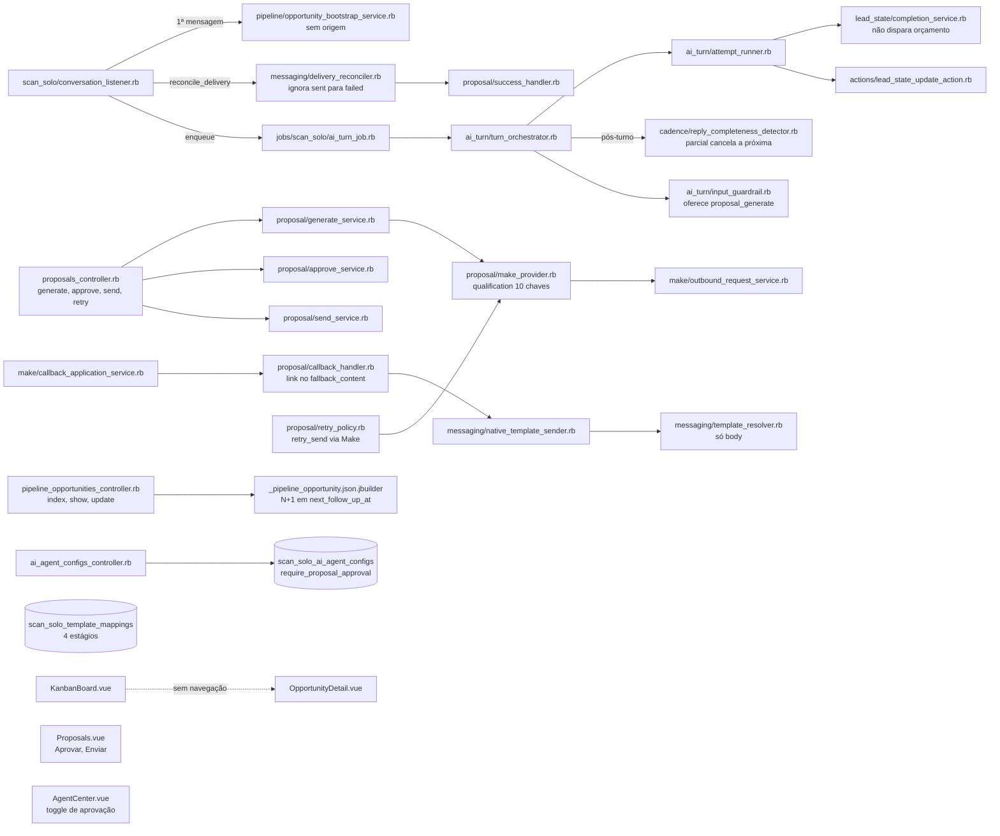
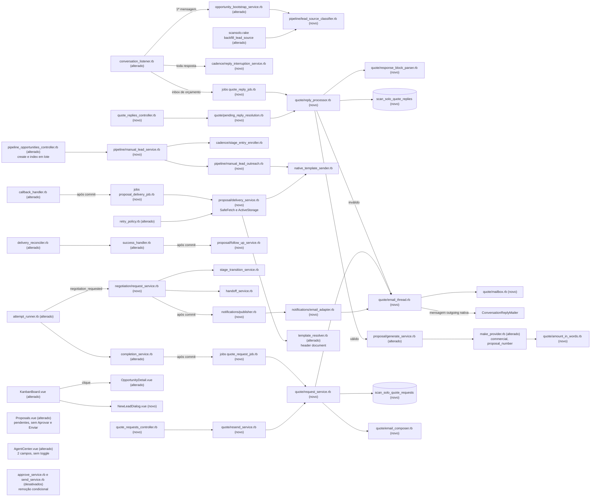

# Implementation Plan

## Request Summary
- Objective: ligar as pontas do ciclo comercial ScanSolo dentro do Chatwoot sem mexer no agente publicado. O plano grava a origem do lead (com backfill por evidência) e cria a ação "Novo lead" (Contact → Conversation → `PipelineOpportunity`, template inicial e cadência sem repetir o 1º contato). Na conclusão da qualificação com próxima ação `proposta`, o sistema pede o orçamento ao Luciano pelo inbox de e-mail nativo. A resposta é lida de forma determinística pelo bloco CT-04, e a geração vai ao Make com os dados comerciais, sem segunda aprovação. A entrega ao lead sai pelo WhatsApp com o PDF guardado no ActiveStorage, seguida da mensagem de acompanhamento. Completam o escopo: a negociação com handoff e o notificador substituível, a interrupção da tentativa de cadência pendente a cada resposta do cliente, o card e a tela do lead, os pendentes de vínculo, o reenvio manual auditado da solicitação de orçamento (RF-56), a saída do aprovar/enviar legado em 2 etapas (desativação e remoção condicionada a evidência de não uso) e as tarefas operacionais no Make.
- Scope in: RF-01..RF-56, UI-01..UI-07, CT-01..CT-12, RNF-01..RNF-11, HG-A, HG-B, HG-C, HG-03, HG-D.
- Scope out: lista "Leads", tarefas operacionais, relatórios, editor de cadências, cadências novas, campos por tipo de serviço, SLA do Luciano, aplicação de resposta tardia como revisão de proposta, outros canais de notificação além da interface, reorganização do menu, fotos/KMZ/OCR, migração de domínio, envio de e-mail/PDF ao cliente pelo Make, e-mail obrigatório do lead e geração automática na conclusão.
- Tier: complete
- SPEC: v1.3 (0 marcadores). Checkpoint do PLAN respondido em `.handoff/plan-checkpoint-answers.md`: rodada 2 confirmada e Q1–Q6 resolvidas (ver Open Questions). Delta v1.3 aplicado neste plano: T01, T04, T06, T11, T15, T19, T20, T22, T24, T27, T29, T30, T31, T32, T33, T34, T35, T17 e as tasks novas T40 (reenvio manual, RF-56/CT-12) e T41 (verificação de não uso do legado, RF-55 Etapa 2).
- Architecture references: `AGENTS.md` (= `CLAUDE.md`), `docs/agents/architecture.md`, `docs/agents/domain_rules.md` (também consultados: `docs/agents/data_model.md`, `docs/agents/coding_guidelines.md`). Contratos base: `.spec/features/scansolo-chatwoot-platform/openapi.yaml` (v1.1.0), `.spec/features/scansolo-production-complete/openapi.yaml` (v1.2.0) e `asyncapi.yaml` (v1.2.0), `.spec/features/scansolo-agent-qualification-continuity/asyncapi.yaml` (v1.3.0, CT-05 `qualification`) e `.spec/features/scansolo-agent-lead-state/openapi.yaml` (v1.5.0, `lead_state`).

### Regras de arquitetura preservadas (valem para todas as tasks)
- `docs/agents/architecture.md` "Layer responsibilities":
  - Controllers ficam com o gate 404 `scansolo_enabled` (herdado do `BaseController`), o Pundit (403) e a validação de formato da requisição (422). Exemplos: CT-01 (telefone/nome/e-mail/responsável/inbox), CT-08 e RF-54.
  - Services ficam com regras, transações, locks e auditoria: `ManualLeadService`, `Quote::*`, `Negotiation::RequestService`, `Proposal::DeliveryService` e `Cadence::ReplyInterruptionService`.
  - O listener só classifica e delega: roteia o e-mail de orçamento para um job e chama o serviço de interrupção.
  - Models ficam só com enums, associações e validações. Nenhuma task muda etapa fora de `ScanSolo::Pipeline::StageTransitionService`.
- `docs/agents/domain_rules.md` "Eligibility gate": o inbox de orçamento fica fora de `allowed_inbox_ids`. O roteamento das respostas de e-mail (T21) roda antes do gate, no mesmo padrão do `reconcile_delivery` já existente, e nunca cria oportunidade, turno, matrícula nem takeover (RF-16).
- `docs/agents/domain_rules.md` "Proposal lifecycle":
  - A chamada HTTP ao Make sai depois de todos os commits.
  - Só o callback escreve `value`, `currency` e `artifact_url` (`CallbackHandler`, sole writer).
  - O RNF-01 estende a regra ao download do PDF, às mensagens WhatsApp novas e às mensagens de e-mail: todas via `ActiveRecord.after_all_transactions_commit` ou job enfileirado depois do commit.
- `docs/agents/domain_rules.md` "Pipeline stages": a IA continua sem alcançar `negociacao` por `stage_transition` (RF-36). A única via automática é `Negotiation::RequestService` com `authorized: true` (RF-35).
- `docs/agents/domain_rules.md` "Handoff and AI control": `HandoffService`, `TakeoverService` e `ReturnToAiService` são reaproveitados. Não entra estado nem tabela de controle nova (RF-46).
- `docs/agents/domain_rules.md` "Action registry": a negociação é sinalizada por um parâmetro booleano novo na ação existente `lead_state_update` (`negotiation_requested`), devolvido como evidência. Não entra ação nova, e `INTENTS`/`DEFAULT_NEXT_ACTION_BY_INTENT` não mudam (justificativa em T26). `proposal_generate` sai das ações oferecidas, mas o handler continua no `Registry` (RF-25).
- `docs/agents/domain_rules.md` "Qualification field resolution": `FieldResolver` continua o único leitor de "satisfeito". A conclusão segue em `LeadState::CompletionService`. O e-mail de orçamento lê os campos pela `LeadState::Projection` existente, sem ler `lead_state.fields` direto.
- `docs/agents/data_model.md`: extensão por tabelas `scan_solo_*` aditivas. Colunas novas só em tabelas ScanSolo (`scan_solo_pipeline_opportunities`, `scan_solo_proposal_versions`, `scan_solo_ai_agent_configs`). Não entram colunas em tabelas do Chatwoot.
- `AGENTS.md` "General Guidelines":
  - Regra no ponto de entrada compartilhado mais cedo. A origem é gravada na escrita do bootstrap. A solicitação nasce da conclusão e é revalidada no job. A interrupção da cadência fica no listener, antes do turno.
  - Falha alta em configuração impossível: inbox de orçamento ausente ou mal configurado → auditoria + `ChatwootExceptionTracker`, RF-14.
  - Validação na borda (422) e reuso de bibliotecas existentes: `ContactInboxBuilder`/`ContactInboxWithContactBuilder`, `ConversationBuilder`, `ConversationReplyMailer`, `SafeFetch`, ActiveStorage e `NativeTemplateSender`. Nada de SMTP/IMAP/HTTP próprio com a Meta.
  - Sem helpers privados de uso único, sem specs com helpers de setup.
- `AGENTS.md` Enterprise: `docs/agents/architecture.md` declara `enterprise/` "not used by ScanSolo". Nenhuma task toca `enterprise/`, e T35 confere 0 referências.
- Testes existentes (RNF-11): um spec existente só muda de expectativa quando reflete mudança intencional do SPEC, e cada alteração cita na task o requisito que a justifica. Nunca se flexibiliza, remove ou pula (`skip`/`pending`/`xit`) um teste para fazê-lo passar.
- `AGENTS.md` i18n: textos novos de backend em `config/locales/en.yml` (T06). Textos de frontend no arquivo de locale ScanSolo existente `app/javascript/dashboard/i18n/locale/en/scansolo.json` (T27), que é o `en` do módulo. Não se editam outros idiomas.
- Estilo (`docs/agents/coding_guidelines.md`): classe compacta `class ScanSolo::…`, 1 classe por arquivo, ≤150 colunas, `def self.call(**) = new(**).call`, header comment com RF/CT/RNF, Result `Struct keyword_init`. No Vue: `<script setup>` no topo, Tailwind only, `components-next/`, sem strings soltas.
- Validação:
  - Specs Ruby e rubocop rodam no container `scansolo-phase2-test`: `docker exec scansolo-phase2-test sh -c 'cd /app && bundle exec rspec <paths>'` (rubocop idem).
  - Depois de T01: `docker exec scansolo-phase2-test sh -c 'cd /app && RAILS_ENV=test bundle exec rails db:migrate'`.
  - Vitest: `pnpm test <paths>`.
  - ESLint: passar os arquivos `.vue` explicitamente (`pnpm eslint <arquivos>`), porque a varredura de diretório ignora `.vue`.
  - Gate de regressão: `./scripts/ralph-test.sh`.

### Componentes reaproveitados (resumo; cada task cita os seus)
- Chatwoot nativo: `Contact`, `ContactInboxBuilder`, `ContactInboxWithContactBuilder`, `ConversationBuilder`, `Message` (`after_create_commit` → `SendReplyJob` → `Email::SendOnEmailService` → `ConversationReplyMailer`, com `content_attributes.email.html_content.reply` renderizado em `email_reply.html.erb`), `Mailbox::ConversationFinder` (threading), `Conversation#assignee`, ActiveStorage, `SafeFetch`, `ChatwootExceptionTracker` e `Whatsapp::TemplateProcessorService` (cabeçalho de documento).
- ScanSolo:
  - Pipeline: `OpportunityBootstrapService`, `InboundMessageTransitionRule`, `StageTransitionService`.
  - Cadência: `StageEntryEnroller`, `EnrollmentService`, `AttemptEvidenceRecorder`, `StopRecalculatePolicy`, `ReplyCompletenessDetector`, `TemplateAvailabilityGuard`.
  - Mensagens: `NativeTemplateSender`, `TemplateResolver`, `TemplateMapping`, `TemplateAvailabilityReport`, `DeliveryReconciler`.
  - Proposta e Make: `Proposal::GenerateService`, `MakeProvider`, `Make::OutboundRequestService`, `Make::CallbackVerifier`/`CallbackApplicationService`, `Proposal::CallbackHandler`, `SuccessHandler`, `RetryPolicy`.
  - Estado do lead e turno: `LeadState::CompletionService`, `LeadState::Projection`, `FieldResolver`, `Handoff::HandoffService`, `AuditLogger`, `AiAgentConfig` (draft/publish), `AttemptRunner`, `PromptBuilder`, `InputGuardrail`, `LeadStateUpdateAction`.
  - Telas: `KanbanBoard.vue`, `OpportunityDetail.vue`, `Proposals.vue`, `AgentCenter.vue`, `TemplatesPanel.vue`.

## AS IS — Componentes impactados

Todos os nós foram verificados em `app/` e `db/schema.rb`. Hoje a oportunidade não guarda origem, e o `index` do pipeline já faz 1 query de `next_follow_up_at` e 1 de `stage_history` por oportunidade. A conclusão não dispara nada comercial, e a proposta depende de `approve`/`send` e do `proposal.send` no Make. O reconciliador ignora a falha posterior a `sent`, e o detector cancela a próxima tentativa só depois do turno.

## TO BE — Componentes propostos

Origem: T01 (coluna), T02 (validação) e T08 (`lead_source_classifier.rb`, bootstrap e rake). Lead manual: T09 (`manual_lead_service.rb`), T10 (`manual_lead_outreach.rb`, listener e reconciliador) e T12 (`create`). CT-02 em lote: T11. Interrupção da cadência: T13. E-mail e orçamento: T14 (`email_composer.rb`), T15 (`mailbox.rb`, `email_thread.rb`), T16 (`response_block_parser.rb`), T19 (`request_service.rb`, job e `completion_service.rb`), T21 (`reply_processor.rb`, job e listener) e T23 (`quote_replies_controller.rb`, `pending_reply_resolution.rb`). Geração: T07 (`amount_in_words.rb`) e T20 (`generate_service.rb`, `make_provider.rb`). Entrega: T05 (`template_resolver.rb`), T24 (`callback_handler.rb`, `delivery_service.rb`, job e `retry_policy.rb`) e T25 (`delivery_reconciler.rb`, `success_handler.rb`, `follow_up_service.rb`). Negociação: T22 (`publisher.rb`, `email_adapter.rb`) e T26 (`request_service.rb`, `attempt_runner.rb`). Frontend: T28–T31. Reenvio manual: T40. Legado aprovar/enviar: T30 (desativação na UI), T41 (verificação) e T32 (remoção condicional). Make e gates: T17, T18 e T36–T39.

## Tasks

### T01 — Migrações aditivas da feature
- **Files**:
  - `db/migrate/20261001000001_add_lead_source_to_scan_solo_pipeline_opportunities.rb` (novo)
  - `db/migrate/20261001000002_create_scan_solo_quote_requests.rb` (novo)
  - `db/migrate/20261001000003_create_scan_solo_quote_replies.rb` (novo)
  - `db/migrate/20261001000004_add_delivery_columns_to_scan_solo_proposal_versions.rb` (novo)
  - `db/migrate/20261001000005_add_commercial_settings_to_scan_solo_ai_agent_configs.rb` (novo)
  - `db/schema.rb`
- **Change**: só `add_column`, `create_table`, `add_index` e `add_check_constraint`. Nenhum `remove_*`, `rename_*` ou `change_column`, e nenhum valor existente é tocado (RNF-05, RNF-10).
  - `scan_solo_pipeline_opportunities.lead_source`: string nullable, com `check_constraint "lead_source IN ('website','manual')"` (nulo permitido).
  - `scan_solo_quote_requests`:
    - `account_id`, `opportunity_id` (FK, **índice único**, RF-15 e RNF-02), `email_conversation_id` (bigint, índice único, nullable até o envio);
    - `request_message_id`, `reply_message_id`, `customer_notice_message_id` (bigint);
    - `status` integer default 0, `correlation_id` string not null (índice único), `commercial` jsonb default `{}`, `sent_at`, `replied_at` e timestamps.
  - `scan_solo_quote_replies`: `account_id`, `message_id` (not null, índice único), `conversation_id`, `quote_request_id` (nullable, índice), `kind` integer, `status` integer default 0, `resolved_by_id` (users, nullable), `resolved_at`, timestamps e índice `(account_id, status)`.
  - `scan_solo_proposal_versions`: `proposal_number` string (índice único), `valid_until` datetime, `follow_up_message_id` bigint e `quote_request_id` bigint (FK, **índice único**, RNF-02 "1 versão por resposta validada").
  - `scan_solo_ai_agent_configs`: `quote_inbox_id` bigint null e `commercial_user_id` bigint null, sem default, e `quote_recipient_email` string `null: false, default: 'comercial@scansolo.com.br'` (RF-54 v1.3). O default preenche rascunho e versões publicadas existentes com o valor inicial exigido; nenhum valor existente é alterado (RNF-05).
  - Não entra migração para ActiveStorage, cujas tabelas já existem.
- **Reuso/justificativa**: as tabelas novas seguem a análise do FLEXIBLE. `Proposal` é 1 por oportunidade e `ProposalVersion` é uma geração, então nenhuma das duas guarda solicitação, resposta ou pendente. `Conversation.additional_attributes` não serve como vínculo consultável com unicidade. As colunas novas ficam em tabelas ScanSolo (`docs/agents/data_model.md`).
- **Covers**: RF-01 (persistência), RF-15, RF-19, RF-22, RF-23, RF-26 (`proposal_number`, `valid_until`), RF-29 (vínculo), RF-31 (idempotência), RF-54 (persistência), RNF-02, RNF-05, RNF-10
- **Tests**: `docker exec scansolo-phase2-test sh -c 'cd /app && RAILS_ENV=test bundle exec rails db:migrate'` sem erro. `grep -nE "remove_column|rename_column|drop_table|change_column|remove_index" db/migrate/20261001*` vazio.
- **Risk**: Medium — migração em produção. É aditiva, com 2 tabelas vazias e colunas nullable sem default em tabelas pequenas.
- **Dependencies**: none

### T02 — Modelos `QuoteRequest`/`QuoteReply` e associações da oportunidade
- **Files**: `app/models/scan_solo/quote_request.rb` (novo), `app/models/scan_solo/quote_reply.rb` (novo), `app/models/scan_solo/pipeline_opportunity.rb`, `spec/models/scan_solo/quote_request_spec.rb` (novo), `spec/models/scan_solo/quote_reply_spec.rb` (novo), `spec/models/scan_solo/pipeline_opportunity_spec.rb`
- **Change**:
  - `ScanSolo::QuoteRequest`:
    - enum `status: { awaiting_reply: 0, correction_requested: 1, replied: 2 }` (valores do CT-02);
    - `belongs_to :opportunity`, `:account`, `:email_conversation` (Conversation, optional), `:reply_message` (Message, optional);
    - `has_one :proposal_version` (`foreign_key: :quote_request_id`);
    - `open?` = `awaiting_reply? || correction_requested?`;
    - valida `correlation_id` presente.
  - `ScanSolo::QuoteReply`: enums `kind: { unmatched: 0, late_reply: 1 }` e `status: { pending: 0, linked: 1, discarded: 2 }`, mais `belongs_to :message`, `:quote_request` (optional) e `:resolved_by` (User, optional).
  - `PipelineOpportunity`:
    - `LEAD_SOURCES = %w[website manual]`;
    - `validates :lead_source, inclusion: { in: LEAD_SOURCES }, allow_nil: true`;
    - `has_one :quote_request` (`foreign_key: :opportunity_id`);
    - `has_one :conversation_extension, class_name: 'ScanSolo::ConversationExtension', primary_key: :conversation_id, foreign_key: :conversation_id`. Essa associação existe só para pré-carregar o `ai_control_state` no `index` (RNF-06), sem tocar o model `Conversation` do Chatwoot.
- **Covers**: RF-01, RF-15, RF-19, RF-22, RF-23, CT-02 (`ai_control_state`)
- **Tests**:
  - `quote_request_spec.rb`: 2ª solicitação na mesma oportunidade → `ActiveRecord::RecordNotUnique`; `open?` por status.
  - `quote_reply_spec.rb`: `message_id` duplicado → `RecordNotUnique`.
  - `pipeline_opportunity_spec.rb`: `lead_source: 'site'` → inválido; `nil`, `website` e `manual` são válidos; `conversation_extension` resolve pela conversa.
- **Risk**: Low — modelos novos e associações de leitura.
- **Dependencies**: T01

### T03 — `ProposalVersion`: número, validade, PDF e vínculo com a solicitação
- **Files**: `app/models/scan_solo/proposal_version.rb`, `spec/models/scan_solo/proposal_version_spec.rb`
- **Change**:
  - `has_one_attached :document` (ActiveStorage nativo, padrão de `knowledge_source.rb:44`), `belongs_to :quote_request` (optional) e `belongs_to :follow_up_message` (Message, optional).
  - `after_create :assign_proposal_number`: `update_column(:proposal_number, format('SS-%<year>d-%<id>06d', year: created_at.year, id: id))`, na mesma transação da criação. O número é único globalmente (índice), portanto único por conta (RF-26). Versões legadas ficam com número nulo, sem backfill.
  - `document_url`: `Rails.application.routes.url_helpers.rails_blob_url(document, host: ENV.fetch('FRONTEND_URL'))` quando `document.attached?`, senão `nil`. É a URL servida pelo Chatwoot (CT-09 b).
  - O header comment acrescenta RF-26/RF-29 e mantém o "sole writer" de `value`/`currency`/`artifact_url` no `CallbackHandler`.
- **Covers**: RF-26 (número), RF-29 (armazenamento), CT-02 (`document_url`), CT-09 (b)
- **Tests**: `proposal_version_spec.rb`: 2 versões na mesma conta → 2 números distintos no formato `SS-AAAA-NNNNNN`; anexar um PDF de fixture → `document_url` começa com `FRONTEND_URL` e é diferente de `artifact_url`; uma versão sem documento → `document_url` nulo.
- **Risk**: Low — callback de escrita de 1 coluna na criação.
- **Dependencies**: T01

### T04 — Configuração RF-54 no backend (inbox de orçamento, usuário comercial e destinatário)
- **Files**: `app/models/scan_solo/ai_agent_config.rb`, `app/controllers/api/v1/accounts/scan_solo/ai_agent_configs_controller.rb`, `app/views/api/v1/accounts/scan_solo/ai_agent_configs/_ai_agent_config.json.jbuilder`, `spec/requests/api/v1/accounts/scan_solo/ai_agent_configs_spec.rb`
- **Change**:
  - `AiAgentConfig::FIELDS` ganha `quote_inbox_id`, `commercial_user_id` e `quote_recipient_email`. Os 3 entram no snapshot de publicação, como `allowed_inbox_ids`, e os fluxos leem só a config publicada (`published_for`); uma edição no rascunho só vale depois do publish (RF-54).
  - `draft_params` passa a permitir `:quote_inbox_id`, `:commercial_user_id` e `:quote_recipient_email`. `require_proposal_approval` continua aceito e serializado: a coluna fica e só a UI esconde o toggle (UI-06, RNF-10). Assim o contrato da API não quebra.
  - `validate_draft_params!` (borda, 422):
    - `quote_inbox_id`, quando presente, tem de ser um inbox da conta com `channel_type == 'Channel::Email'` e fora de `allowed_inbox_ids`. A lista considerada é a efetiva: a do parâmetro, quando enviado, ou a do draft;
    - `commercial_user_id`, quando presente, tem de ser usuário da conta (`Current.account.users.exists?`);
    - `allowed_inbox_ids` que passe a incluir o `quote_inbox_id` do draft → 422;
    - `quote_recipient_email` vazio ou fora de `URI::MailTo::EMAIL_REGEXP` → 422.
  - jbuilder: as 3 chaves novas.
- **Covers**: RF-54 (backend), RF-14 (prevenção na borda), RF-16 (inbox fora da allowlist), RNF-05
- **Tests**: `ai_agent_configs_spec.rb`:
  - salvar os 3 campos e publicar → presentes em `draft` e `published`;
  - depois da migração, rascunho e publicada com `quote_recipient_email` = `comercial@scansolo.com.br`;
  - destinatário vazio ou malformado → 422;
  - usuário de outra conta → 422;
  - inbox WhatsApp → 422; inbox de e-mail em `allowed_inbox_ids` → 422;
  - `allowed_inbox_ids` contendo o `quote_inbox_id` → 422;
  - exemplos existentes verdes, inclusive `require_proposal_approval`.
- **Risk**: Low — campos novos opcionais.
- **Dependencies**: T01

### T05 — Slots de template CT-09 e cabeçalho de documento
- **Files**: `app/models/scan_solo/template_mapping.rb`, `app/services/scan_solo/messaging/template_resolver.rb`, `app/services/scan_solo/messaging/template_availability_report.rb`, `app/controllers/api/v1/accounts/scan_solo/cadence_templates_controller.rb`, `spec/models/scan_solo/template_mapping_spec.rb`, `spec/services/scan_solo/messaging/template_resolver_spec.rb`, `spec/requests/api/v1/accounts/scan_solo/cadence_templates_spec.rb`
- **Change**:
  - `TemplateMapping::SINGLE_TEMPLATES = { 'proposta_enviada' => 'scansolo_proposal_send', 'lead_manual_inicial' => 'scansolo_lead_manual_inicial', 'proposta_acompanhamento' => 'scansolo_proposta_acompanhamento' }`. O slot `proposta_enviada`/`step: nil` (template de proposta) é o existente.
  - Validação: `stage` ∈ `STAGES` + `SINGLE_TEMPLATES.keys`. `step` nulo só para os slots e obrigatório para estágios de cadência. Isso substitui `proposal_step`.
  - `TemplateResolver`:
    - `convention_name(stage, nil)` → `SINGLE_TEMPLATES.fetch(stage)`;
    - `call(..., document: nil)`: com `document: { url:, name: }`, acrescenta `processed_params['header'] = { 'media_url' => url, 'media_type' => 'document', 'media_name' => name }`, formato lido por `Whatsapp::TemplateProcessorService` (`template_processor_service.rb:52-76`). Sem documento, a saída fica idêntica à de hoje.
  - `TemplateAvailabilityReport#call`: linhas de cadência + 1 linha por slot, na ordem de `SINGLE_TEMPLATES`.
  - `CadenceTemplatesController#valid_step?`: `step` nulo aceito para os 3 slots.
  - Os nomes reais dos templates (a) e (c) vêm do mapeamento, configurado pela tela de Templates existente (HG-B, T18). Não há nome fixo além da convenção.
- **Reuso/justificativa**: estende o mecanismo `TemplateMapping`/`TemplateResolver` exigido pelo CT-09 em vez de criar configuração nova. O `TemplateAvailabilityGuard` continua checando aprovação e parâmetros de body.
- **Covers**: CT-09 (a)(b)(c), RF-07 (resolução), RF-29 (cabeçalho), RF-31 (resolução)
- **Tests**:
  - `template_resolver_spec.rb`: `lead_manual_inicial` sem mapeamento → `scansolo_lead_manual_inicial`; com mapeamento → nome mapeado; `document:` → header com os 3 campos; `proposta_enviada` sem `document:` → `processed_params` inalterado.
  - `template_mapping_spec.rb`: `lead_manual_inicial` com `step: 1` → inválido; `novo_lead` sem step → inválido.
  - `cadence_templates_spec.rb`: `GET` inclui as 3 linhas de slot; `PUT` de `proposta_acompanhamento` com `step: null` → 200.
- **Risk**: Low — aditivo. O caminho de cadência não muda.
- **Dependencies**: none

### T06 — Textos backend (`en.yml`)
- **Files**: `config/locales/en.yml`, `spec/lib/scansolo_locale_spec.rb` (novo)
- **Change**: nova seção `en.scan_solo`, com os textos em pt-BR aprovados pelo SPEC. Seguindo o `CLAUDE.md`, só o `en.yml` é atualizado.
  - `quote.email.subject` (`Solicitação de orçamento #%{opportunity_id} — %{name}`), `quote.email.sections.*` (identificação, dados coletados, instruções), `quote.email.to_confirm` ("(a confirmar)"), `quote.email.origin.{website,manual,none}`;
  - `quote.block.{start,end}` (`=== RESPOSTA DO ORÇAMENTO ===`, `=== FIM ===`) e `quote.block.labels.{total_value,schedule,scope,payment_terms,notes}`, com os 5 rótulos aprovados do CT-04;
  - `quote.correction.{subject,intro,field_problem}`;
  - `quote.customer_notice` com o texto exato do RF-53: "Recebi todas as informações, obrigado! Nosso comercial já está preparando seu orçamento. Assim que estiver pronto, envio por aqui.";
  - `quote.resend.*` (assunto/linha de reenvio, se houver) e códigos de erro do CT-12 para logs;
  - `negotiation.standard_reply` ("Vou verificar isso com nosso comercial. Só um momento.");
  - `negotiation.email.{subject,labels.*,no_proposal}`;
  - `amount_in_words.*` (unidades, dezenas, centenas, "real/reais", "centavo/centavos").
- **Covers**: RNF-08, CT-03, CT-04 (rótulos), RF-35 (texto), RF-53 (texto)
- **Tests**: `scansolo_locale_spec.rb`: `I18n.t('scan_solo.quote.block.labels')` tem exatamente os 5 rótulos do CT-04 na ordem; `I18n.t('scan_solo.negotiation.standard_reply')` é igual ao texto do RF-35; `I18n.t('scan_solo.quote.customer_notice')` é igual ao texto exato do RF-53.
- **Risk**: Low — textos.
- **Dependencies**: none

### T07 — Valor por extenso determinístico (`AmountInWords`)
- **Files**: `app/services/scan_solo/quote/amount_in_words.rb` (novo), `spec/services/scan_solo/quote/amount_in_words_spec.rb` (novo)
- **Change**: `ScanSolo::Quote::AmountInWords.call(amount)` é pura, recebe `BigDecimal` > 0 até 999.999.999,99 (fora disso, `ArgumentError`) e devolve o extenso pt-BR com "reais"/"centavos". Cobre "um real", "mil reais" (sem "um mil") e o conector "e" entre centenas e dezenas. Os textos vêm de `scan_solo.amount_in_words.*` (T06).
- **Reuso/justificativa**: o RF-47 exige extenso determinístico e nunca por IA. O Make não tem função nativa de extenso em pt-BR, e o repositório não tem gem para isso. Gerar no Rails e enviar em `commercial.total_value_in_words` (CT-05 v1.3; Q2 resolvida) mantém a regra testável por spec. A `Entrada` usa o campo como recebido.
- **Covers**: RF-47 (extenso, lado Rails), CT-05
- **Tests**: `amount_in_words_spec.rb`, tabela: `12500.00` → "doze mil e quinhentos reais"; `1.00` → "um real"; `1000.00` → "mil reais"; `1234567.89` → "um milhão, duzentos e trinta e quatro mil, quinhentos e sessenta e sete reais e oitenta e nove centavos"; `0.50` → "cinquenta centavos"; `0` → `ArgumentError`.
- **Risk**: Low — função pura.
- **Dependencies**: T06

### T08 — Origem do lead: classificador, bootstrap e backfill
- **Files**: `app/services/scan_solo/pipeline/lead_source_classifier.rb` (novo), `app/services/scan_solo/pipeline/opportunity_bootstrap_service.rb`, `lib/tasks/scansolo.rake`, `spec/services/scan_solo/pipeline/lead_source_classifier_spec.rb` (novo), `spec/services/scan_solo/pipeline/opportunity_bootstrap_service_spec.rb`, `spec/lib/tasks/scansolo_rake_spec.rb`
- **Change**:
  - `ScanSolo::Pipeline::LeadSourceClassifier.call(conversation:)` é pura e faz 1 query: `conversation.messages.where(private: false, message_type: %i[incoming outgoing]).order(:created_at, :id).first`. Mensagens `activity`, `template` e notas privadas ficam de fora. Resultado: `incoming` → `'website'`; `outgoing` com `sender_type == 'User'` → `'manual'`; qualquer outro caso, inclusive conversa sem mensagens → `nil`. É a regra única para RF-02 e RF-03.
  - `OpportunityBootstrapService#call`: no bloco do `create_or_find_by!`, `record.lead_source = ScanSolo::Pipeline::LeadSourceClassifier.call(conversation: conversation)`, na mesma escrita (RF-02). O payload da auditoria `pipeline.opportunity_created` ganha `lead_source`.
  - Rake `scansolo:backfill_lead_source`: `PipelineOpportunity.where(lead_source: nil).includes(:conversation).find_each`, classifica e, só quando o resultado não é nulo, faz `update_columns(lead_source:)`. Isso preserva `updated_at` e não chama callbacks. Imprime o total alterado. Não toca etapa, cadência nem `LeadState`.
- **Covers**: RF-01 (não altera cadência), RF-02, RF-03
- **Tests**:
  - `lead_source_classifier_spec.rb`: 1ª `incoming` → `website`; 1ª `outgoing` de `User` → `manual`; 1ª `outgoing` de campanha/`AgentBot`/sem remetente → `nil`; nota privada e `activity` antes da 1ª incoming são ignoradas; sem mensagens → `nil`.
  - `opportunity_bootstrap_service_spec.rb`: conversa nova com 1ª mensagem recebida → `website`; agente abriu com outgoing nativa e o cliente respondeu → `manual`; RF-01: 2 oportunidades `website` × `manual` levadas a `em_contato` → mesma `CadenceDefinition` e mesmos `scheduled_at` relativos.
  - `scansolo_rake_spec.rb`: os 4 casos do RF-03; 2ª execução → 0 alterações; contagens de `PipelineStageEvent`, `CadenceEnrollment` e `LeadStateEvent` iguais antes e depois; `updated_at` inalterado.
- **Risk**: Medium — escreve no caminho síncrono do bootstrap (1 query a mais por oportunidade nova).
- **Dependencies**: T02

### T09 — `ManualLeadService` (cadastro "Novo lead")
- **Files**: `app/services/scan_solo/pipeline/manual_lead_service.rb` (novo), `lib/custom_exceptions/scan_solo.rb`, `spec/services/scan_solo/pipeline/manual_lead_service_spec.rb` (novo)
- **Change**:
  - `ManualLeadService.call(account:, actor:, name:, phone_number:, email:, company:, owner_id:, inbox:)` recebe a entrada já validada no formato pelo controller (T12) e devolve `Result(opportunity:, contact_created:)`.
  - Exceção nova `CustomExceptions::ScanSolo::ManualLeadRejected` com `code` e `opportunity_id`. Os códigos são `contact_opted_out`, `contact_conflict` e `opportunity_exists`, que dependem do banco.
  - Numa única `ActiveRecord::Base.transaction`:
    1. `SELECT pg_advisory_xact_lock(hashtext('scansolo_manual_lead:<account_id>:<phone>'))` serializa cadastros concorrentes do mesmo telefone (RF-04; precedente de advisory lock em `app/services/data_imports/importer.rb:898`).
    2. Contato:
       - `by_phone = account.contacts.find_by(phone_number:)` e `by_email = account.contacts.where('LOWER(email) = ?', email.downcase).first` (quando há e-mail);
       - os dois presentes e diferentes → `contact_conflict`;
       - nenhum → `account.contacts.create!(name:, phone_number:, email:, custom_attributes: { 'empresa' => company }.compact)`, com `contact_created: true`. O `InitializeService` semeia `empresa` como `inferido`.
    3. `ScanSolo::ContactExtension.opted_out?(contact)` → `contact_opted_out`.
    4. Oportunidade do contato fora de `ganho`/`perdido` → `opportunity_exists` com o `id` (RF-09).
    5. Conversa: aberta do contato no inbox informado sem oportunidade (`where.not(id: PipelineOpportunity.select(:conversation_id))`) → reaproveitada (rodada 2). Senão, `ContactInboxBuilder.new(contact:, inbox:, source_id: phone_number.delete('+')).perform` + `ConversationBuilder.new(params: ActionController::Parameters.new({}), contact_inbox:).perform`. Com `owner_id`, `conversation.update!(assignee_id: owner_id)` (coerente com o bootstrap, que deriva `owner_id` do `assignee`).
    6. `PipelineOpportunity.create!(account:, contact:, conversation:, stage: :novo_lead, lead_source: 'manual', owner_id:, last_customer_interaction_at: nil)`. O `after_create` existente cria o `LeadState` `em_andamento`.
    7. `AuditLogger.record!(subject: opportunity, event_type: 'pipeline.opportunity_created', actor:, correlation_id: SecureRandom.uuid, payload: { source: 'manual', conversation_id:, contact_created: })`.
    8. `ScanSolo::Cadence::StageEntryEnroller.call(opportunity:)`. Em seguida, se a matrícula `novo_lead` foi criada, `AttemptEvidenceRecorder.new(step1).record!(result: :skipped, last_block_reason: 'manual_initial_template')` na tentativa do passo 1, sem `message_id` (RF-10). Os passos 2..n mantêm o `scheduled_at` da matrícula.
  - O envio do template fica em T10 (depois do commit).
  - Nenhum outro registro: não há entidade "Lead".
- **Reuso/justificativa**: reaproveita os builders nativos de contato, contact inbox e conversa, o `after_create` do `LeadState`, `StageEntryEnroller`/`EnrollmentService` e `AttemptEvidenceRecorder` (único escritor de tentativa). O service é novo porque nenhum serviço existente cria oportunidade sem mensagem recebida; o bootstrap depende de `message`.
- **Covers**: RF-04, RF-05 (códigos `contact_opted_out`, `contact_conflict`), RF-06, RF-09, RF-10, RF-11 (pré-condições), RF-46
- **Tests**: `manual_lead_service_spec.rb`, com relógio congelado:
  - telefone existente → 0 contatos novos; só o e-mail existente → idem; nenhum → 1 contato;
  - 2 threads com o mesmo telefone → 1 contato;
  - telefone → A e e-mail → B → `contact_conflict` e contagens inalteradas;
  - opt-out → `contact_opted_out`;
  - oportunidade `em_qualificacao` → `opportunity_exists` com o id; única oportunidade `perdido` → cria;
  - conversa aberta sem oportunidade → 0 conversas novas e oportunidade ligada a ela;
  - falha simulada no `create!` da oportunidade → 0 contatos e 0 conversas novos;
  - matrícula `novo_lead` com passo 1 `skipped` sem `message_id` e passos 2–4 em T+24 h/48 h/96 h; `CadenceDueAttemptJob` em T+2 h → 0 mensagens;
  - 1 `LeadState` `em_andamento` e 1 `AuditEvent` com `source: manual`.
- **Risk**: Medium — cria registros nativos (contato e conversa) fora do fluxo de mensagem; tudo numa transação.
- **Dependencies**: T02

### T10 — Template inicial do lead manual e falha visível (RF-07, RF-08)
- **Files**: `app/services/scan_solo/pipeline/manual_lead_outreach.rb` (novo), `app/services/scan_solo/pipeline/manual_lead_service.rb`, `app/services/scan_solo/conversation_listener.rb`, `app/services/scan_solo/messaging/delivery_reconciler.rb`, `spec/services/scan_solo/pipeline/manual_lead_outreach_spec.rb` (novo), `spec/services/scan_solo/messaging/delivery_reconciler_spec.rb`
- **Change**:
  - `ManualLeadOutreach.call(opportunity:)`:
    - `template = TemplateResolver.call(account:, stage: 'lead_manual_inicial', step: nil, opportunity:)` e `guard = TemplateAvailabilityGuard.check(inbox: conversation.inbox, template:)`;
    - bloqueado → `AuditLogger.record!(event_type: 'pipeline.manual_lead_template_blocked', payload: { reason: guard.reason })`, sem mensagem (RF-08);
    - senão → `NativeTemplateSender.call(conversation:, template_reference: template.name, origin: 'manual_lead', template_params: template.sender_params)`.
  - `ManualLeadService`: depois da transação (`ActiveRecord.after_all_transactions_commit`), chama `ManualLeadOutreach.call(opportunity:)` (RNF-01). Não há rollback nem reenvio.
  - `ConversationListener::TEMPLATE_ORIGINS` = `%w[cadence proposal manual_lead]`. O marcador `scansolo_origin` impede o takeover (RF-07).
  - `DeliveryReconciler#call`: para mensagem `failed` com origem `manual_lead`, 1 `AuditLogger.record!(subject: opportunity da conversa, event_type: 'pipeline.manual_lead_template_failed', payload: { message_id:, external_error: })`. É idempotente: só grava se ainda não houver auditoria com o mesmo `message_id`.
- **Covers**: RF-07, RF-08, RNF-01
- **Tests**:
  - `manual_lead_outreach_spec.rb` (WebMock): guard livre → 1 `Message` outgoing de template com `scansolo_origin: 'manual_lead'` e `template_params.name` mapeado, 0 HTTP direto e `ai_control_state` `ai_active`; guard bloqueado → 0 mensagens e 1 auditoria com `reason`; spec RNF-01: `transaction_open?` falso no ponto do `NativeTemplateSender`.
  - `delivery_reconciler_spec.rb`: mensagem `manual_lead` `failed` → 1 auditoria com `external_error`; 2º `message_updated` → continua 1.
- **Risk**: Low — envio nativo isolado; a falha só audita.
- **Dependencies**: T05, T09

### T11 — Leitura CT-02 (index/show/proposals) com queries constantes
- **Files**:
  - `app/controllers/api/v1/accounts/scan_solo/pipeline_opportunities_controller.rb`
  - `app/views/api/v1/accounts/scan_solo/pipeline_opportunities/_pipeline_opportunity.json.jbuilder`, `show.json.jbuilder`, `index.json.jbuilder`
  - `app/views/api/v1/accounts/scan_solo/proposals/_proposal.json.jbuilder`, `_proposal_version.json.jbuilder`
  - `app/controllers/api/v1/accounts/scan_solo/proposals_controller.rb` (só `includes` do `index`)
  - `spec/requests/api/v1/accounts/scan_solo/pipeline_opportunities_centralized_spec.rb` (novo), `spec/requests/api/v1/accounts/scan_solo/proposals_spec.rb`
- **Change**:
  - Controller:
    - `index`: `includes(:contact, :stage_events, :lead_state, :quote_request, :conversation_extension, proposal: :current_version)`;
    - `@next_follow_ups = ScanSolo::CadenceEnrollment.active.where(opportunity_id: ids).group(:opportunity_id).minimum(:next_attempt_at)`, 1 query para a lista (RNF-06);
    - `set_opportunity` acrescenta `:quote_request, :conversation_extension, proposal: { current_version: { document_attachment: :blob } }`.
  - `_pipeline_opportunity`:
    - `next_follow_up_at` vem de `local_assigns[:next_follow_up_at]` quando passado (index), senão do cálculo atual (show, 1 registro);
    - `stage_history` é ordenado em Ruby (`stage_events.sort_by(&:created_at)`) sobre o association carregado;
    - campos novos: `lead_source`, `company`/`service`/`city_uf` (valor de `empresa`/`tipo_servico`/`cidade_uf` no `lead_state.fields` quando o status ≠ `faltante`, senão `null`), `ai_control_state` (`conversation_extension&.ai_control_state || 'ai_active'`), `quote_request_status` (`quote_request&.status`) e `proposal_status` (`proposal&.current_version&.status`).
  - A leitura de `lead_state.fields` aqui é só exibição de valor, não decide satisfação. O `FieldResolver` continua o único leitor de "satisfeito".
  - `show.json.jbuilder` ganha:
    - `quote_request { id, status, sent_at, replied_at, email_conversation_id }` ou `null`;
    - `proposal { version_number, proposal_number, status, value, currency, valid_until, document_url, failure_reason }` da versão atual ou `null`;
    - `initial_template_failure { reason, status, occurred_at }` ou `null`, da última auditoria `pipeline.manual_lead_template_blocked` (`status: blocked`, `reason` = motivo do guard) ou `pipeline.manual_lead_template_failed` (`status: failed`, `reason` = `external_error`) da oportunidade (RF-08/UI-04, CT-02 v1.3).
    - `quote_request_resend_available` entra em T40 (depende do serviço de reenvio).
  - Proposals:
    - `_proposal_version` ganha `proposal_number`, `valid_until` e `document_url`;
    - `_proposal` ganha `quote_request_status` (UI-05: status da solicitação de cada oportunidade listada);
    - `index` inclui `opportunity: :quote_request` e `versions: { document_attachment: :blob }`.
  - Os campos atuais ficam com nome, tipo e sentido inalterados.
- **Covers**: CT-02, RF-01 (exposição), RF-33 (status `generated` exposto como tal), RNF-06, RNF-10, UI-02/UI-04/UI-05 (dados)
- **Tests**:
  - `pipeline_opportunities_centralized_spec.rb`:
    - `index` com 5 e com 50 oportunidades (com contato, estado, solicitação, proposta, extensão e matrícula) → mesma contagem de `sql.active_record`;
    - cada campo novo com o valor esperado; empresa `faltante` → `company: null`; sem extensão → `ai_active`;
    - `show` com `quote_request`, `proposal` (com `document_url` ≠ `artifact_url`) e `initial_template_failure` (`status: blocked` com o `reason` do guard; `status: failed` com o `external_error`; sem falha → `null`);
    - fixtures legadas (versão `approved` com `approved_at`, `MakeCallback` `proposal.send`) → 0 erros e campos atuais iguais (RNF-10).
  - `proposals_spec.rb`: `proposal_number`/`valid_until`/`document_url`/`quote_request_status` presentes, e versão histórica `approved` com status e `approved_at` inalterados.
  - `pipeline_opportunities_spec.rb` existente verde, sem alteração. `pipeline_opportunities_lead_state_spec.rb` existente verde; a asserção `eq` das chaves do `show` passa a listar, na ordem emitida, os campos do CT-02 (`lead_source`, `company`, `service`, `city_uf`, `ai_control_state`, `quote_request_status`, `proposal_status`, `quote_request`, `proposal`, `initial_template_failure`), sem afrouxar para `include` (expectativa alterada pelo CT-02, conforme RNF-11).
- **Risk**: Medium — muda o partial compartilhado por index/show/update/stage_transitions. A cobertura vem dos specs existentes intocados e da contagem de queries.
- **Dependencies**: T02, T03

### T12 — Endpoint `POST /pipeline_opportunities` (CT-01)
- **Files**: `config/routes.rb`, `app/controllers/api/v1/accounts/scan_solo/pipeline_opportunities_controller.rb`, `app/policies/scan_solo/pipeline_opportunity_policy.rb`, `app/views/api/v1/accounts/scan_solo/pipeline_opportunities/create.json.jbuilder` (novo), `spec/requests/api/v1/accounts/scan_solo/pipeline_opportunities_create_spec.rb` (novo)
- **Change**:
  - Rota: `resources :pipeline_opportunities, only: [:index, :show, :update, :create]`.
  - Policy: `create?` → `account_user.present?` (usuário autorizado da conta, mesmo critério de `ProposalPolicy#generate?`).
  - Controller `create`, depois de `authorize(::ScanSolo::PipelineOpportunity)`:
    - validação de borda, 422 `{ error: <code> }` antes de qualquer escrita: `name` vazio → `missing_name`; `phone_number` fora de `/\A\+[1-9]\d{1,14}\z/` (mesma regex de `Contact`) → `invalid_phone`; `email` presente e malformado (`URI::MailTo::EMAIL_REGEXP`) → `invalid_email`; `owner_id` presente e fora de `Current.account.users` → `invalid_owner`;
    - inbox: `allowlisted = Current.account.inboxes.where(id: published.allowed_inbox_ids, channel_type: 'Channel::Whatsapp')`. Com `inbox_id`, ele tem de estar em `allowlisted`; sem `inbox_id`, exatamente 1 em `allowlisted`. Fora disso → `invalid_inbox`;
    - `ManualLeadService.call(...)`. `rescue CustomExceptions::ScanSolo::ManualLeadRejected` → 422 `{ error: e.code }` + `opportunity_id` quando `opportunity_exists`;
    - sucesso → `project_lead_state` + `render :create, status: :created`, com o JSON do show + `contact_created`.
  - Strong params: `params.permit(:name, :phone_number, :email, :company, :owner_id, :inbox_id)`.
- **Covers**: CT-01, RF-05, RF-09, UI-01 (backend)
- **Tests**: `pipeline_opportunities_create_spec.rb`:
  - cada uma das 7 condições do RF-05 → 422 com o código e contagens de `Contact`/`Conversation`/`PipelineOpportunity`/`Message` inalteradas;
  - `opportunity_exists` → 422 com `opportunity_id`;
  - 201 com `lead_source: 'manual'`, `stage: 'novo_lead'`, `contact_created` e `lead_state`;
  - `scansolo_enabled` desligado → 404;
  - 1 inbox allowlisted e sem `inbox_id` → usa o único; 2 inboxes sem `inbox_id` → `invalid_inbox`.
- **Risk**: Medium — endpoint novo de escrita; a validação fica toda na borda e no service.
- **Dependencies**: T09, T10, T11

### T13 — Interrupção da tentativa pendente a cada resposta (RF-43)
- **Files**: `app/services/scan_solo/cadence/reply_interruption_service.rb` (novo), `app/services/scan_solo/conversation_listener.rb`, `app/services/scan_solo/cadence/reply_completeness_detector.rb`, `app/services/scan_solo/ai_turn/turn_orchestrator.rb` (só o header comment de `apply_reply_completeness`), `spec/services/scan_solo/cadence/reply_interruption_service_spec.rb` (novo), `spec/services/scan_solo/cadence/reply_completeness_detector_spec.rb`, `spec/services/scan_solo/conversation_listener_spec.rb`
- **Change**:
  - `ReplyInterruptionService.call(opportunity:, message:)`: para cada `opportunity.cadence_enrollments.active.where('created_at < ?', message.created_at)`, dentro de `enrollment.with_lock`:
    1. `cycle_start` = instante da última mensagem `outgoing` não privada da conversa anterior a `message.created_at`;
    2. se já houver `AuditEvent` `cadence.attempt_interrupted_by_reply` dessa matrícula com `created_at` > `cycle_start` (ou qualquer um, sem saída), retorna (≤ 1 por ciclo);
    3. senão, pega a primeira `attempts.scheduled.order(:scheduled_at)`, faz `AttemptEvidenceRecorder.record_cancelled!` e grava 1 auditoria com `{ enrollment_id, attempt_id, message_id }`.
  - O marcador do ciclo é a própria auditoria, sem coluna nova. As demais tentativas mantêm `scheduled_at`.
  - `ConversationListener#handle_incoming`: no ramo `unless bootstrap.created?`, depois de `InboundMessageTransitionRule`, chama `ReplyInterruptionService.call(opportunity: bootstrap.opportunity, message:)`. Roda antes e independente do turno (RF-43: `succeeded`, `failed`, `suppressed`, `superseded`). Se a regra de entrada mudou a etapa, a matrícula já foi cancelada e não há ativa.
  - `ReplyCompletenessDetector`: remove `cancel_immediate_pending!`. Só "completa → `cancel_all_for_opportunity!`" continua, e o `Result` não muda.
  - `TurnOrchestrator#apply_reply_completeness`: lógica inalterada; só o comentário passa a citar que a interrupção parcial é do listener.
  - `db/seeds/scansolo_cadence_definitions.rb` não é tocado (RF-44).
- **Covers**: RF-43, RF-44
- **Tests**:
  - `reply_interruption_service_spec.rb`: resposta parcial → próxima `scheduled` → `cancelled` + 1 auditoria; rajada de 3 mensagens sem saída → 1 cancelada, as demais com `scheduled_at` inalterado e tentativas `sent` intactas; cliente → saída da IA → cliente → 2 cancelamentos; matrícula criada depois da mensagem → 0.
  - `conversation_listener_spec.rb`: turno `superseded` ou `failed` não impede o cancelamento.
  - `reply_completeness_detector_spec.rb`: completa → cancela tudo; parcial → 0 cancelamentos (expectativa alterada pelo RF-43, conforme RNF-11).
  - `git diff --stat main -- db/seeds/scansolo_cadence_definitions.rb` vazio.
- **Risk**: Medium — muda o comportamento da cadência em produção (correção pedida). O lock por matrícula evita cancelamento duplo em rajada.
- **Dependencies**: none

### T14 — Composição dos e-mails (CT-03): solicitação, correção e negociação
- **Files**: `app/services/scan_solo/quote/email_composer.rb` (novo), `spec/services/scan_solo/quote/email_composer_spec.rb` (novo)
- **Change**: `ScanSolo::Quote::EmailComposer` é puro e devolve `Email = Struct(:subject, :text, :html)`. O HTML usa ` ` e `ERB::Util.html_escape` em cada valor, com cada rótulo e cada campo em linha própria (CT-03). Todos os textos vêm de `scan_solo.*` (T06).
  - `.request(opportunity:, projection:)`, para RF-13 nesta ordem:
    1. identificação: id, `contact.name`, empresa (`projection` `empresa` ≠ faltante), `contact.phone_number`, `contact.email`, origem (i18n), nome do responsável, etapa (`HandoffService::STAGE_LABELS`) e link `"#{ENV.fetch('FRONTEND_URL')}/app/accounts/#{account_id}/conversations/#{conversation.display_id}"` (padrão de `linear_controller.rb:106`);
    2. todos os campos dos 6 blocos da `LeadState::Projection` com status ≠ `faltante`, `rótulo: valor`, com `inferido` seguido de "(a confirmar)";
    3. o bloco vazio do CT-04 com as instruções.
    - Assunto: `Solicitação de orçamento #<id> — <empresa ou nome>`. Sem tokens, segredos nem URLs de API.
  - `.correction(problems:)`: lista cada rótulo do CT-04 com problema (RF-18) e repete o bloco vazio.
  - `.negotiation(payload:)`: recebe o payload CT-07 e devolve os 9 itens do RF-37. Sem proposta → texto `no_proposal`.
  - `.empty_block`: bloco vazio, reutilizado por `request` e `correction` e pelos specs do parser.
- **Covers**: CT-03, RF-13, RF-18 (texto), RF-37 (texto), RNF-07, RNF-08
- **Tests**: `email_composer_spec.rb`:
  - `request` contém o id, rótulos e valores dos campos `confirmado`/`inferido` ("(a confirmar)" só nos inferidos) e as 5 linhas de rótulo entre os delimitadores; não contém valor de campo `faltante` nem `api_access_token`;
  - o HTML tem ` ` entre os campos;
  - `correction` com `[:payment_terms]` contém "Condições de pagamento" e o bloco;
  - `negotiation` contém os 9 itens e o link no formato `/app/accounts/<id>/conversations/<display_id>`.
- **Risk**: Low — pura.
- **Dependencies**: T06

### T15 — Caixa de orçamento e thread de e-mail nativa
- **Files**: `app/services/scan_solo/quote/mailbox.rb` (novo), `app/services/scan_solo/quote/email_thread.rb` (novo), `lib/custom_exceptions/scan_solo.rb`, `spec/services/scan_solo/quote/mailbox_spec.rb` (novo), `spec/services/scan_solo/quote/email_thread_spec.rb` (novo)
- **Change**:
  - `ScanSolo::Quote::Mailbox`:
    - sem destinatário fixo no código (RF-54 v1.3);
    - `.resolve!(account)` → `Settings = Struct(:inbox, :recipient)` lido da config publicada (`quote_inbox_id`, `quote_recipient_email`), ou `CustomExceptions::ScanSolo::QuoteInboxMisconfigured` com `reason` ∈ `quote_inbox_missing` (config publicada sem `quote_inbox_id` ou inbox inexistente), `quote_inbox_not_email` e `quote_inbox_allowlisted`. Falha alta (`AGENTS.md`).
  - `ScanSolo::Quote::EmailThread`:
    - `.open!(inbox:, recipient:, subject:, marker:)` cria a conversa sem mensagem e pode rodar dentro de transação. Faz `ContactInboxWithContactBuilder.new(inbox:, source_id: recipient, contact_attributes: { name: 'Comercial', email: recipient }).perform` e `ConversationBuilder.new(params: ActionController::Parameters.new(additional_attributes: { mail_subject: subject, scansolo_thread: marker }), contact_inbox:).perform`, com `marker` ∈ `quote_request`, `negotiation_notification`.
    - `.post!(conversation:, recipient:, email:)` cria a mensagem e só roda depois do commit (RNF-01): `conversation.messages.create!(message_type: :outgoing, content: email.text, content_attributes: { to_emails: [recipient], email: { html_content: { reply: email.html } } })`. O envio é o nativo (`SendReplyJob` → `Email::SendOnEmailService` → `ConversationReplyMailer#email_reply`, From = e-mail do canal, Message-ID nativo).
- **Reuso/justificativa**: usa o canal de e-mail nativo e o `html_content.reply` já renderizado por `email_reply.html.erb`. Não há cliente SMTP/IMAP próprio (`AGENTS.md`, "Prefer existing repo dependencies"). A conversa é criada sem mensagem para que o vínculo com a solicitação fique na mesma transação da solicitação.
- **Covers**: CT-03 (transporte e threading), RF-12 (envio nativo), RF-14 (detecção), RF-16 (inbox fora da allowlist), RF-37 (transporte), RF-42 (marcador), RNF-01, RNF-04
- **Tests**:
  - `mailbox_spec.rb`: as 3 condições do RF-14 → exceção com o `reason`; inbox de e-mail válido → `Settings` com o destinatário publicado; destinatário alterado só no rascunho → continua o publicado.
  - `email_thread_spec.rb`, com ActionMailer `:test` e `perform_enqueued_jobs`: `post!` → 1 e-mail com From = e-mail do canal, To = `[recipient]`, Subject = `mail_subject` e corpo HTML com ` `; 2ª chamada de `open!` para o mesmo destinatário reusa o contato (1 `Contact`); spec RNF-01: `post!` não roda com `transaction_open?`.
- **Risk**: Medium — depende do envio SMTP do inbox configurado (HG-A). Sem configuração, falha visível (RF-14).
- **Dependencies**: T01, T14

### T16 — Leitura determinística do bloco (CT-04)
- **Files**: `app/services/scan_solo/quote/response_block_parser.rb` (novo), `spec/services/scan_solo/quote/response_block_parser_spec.rb` (novo)
- **Change**: `ScanSolo::Quote::ResponseBlockParser.call(content:, html: nil)` é puro (sem LLM, sem I/O; RF-21) e devolve `Result(valid?, values: { total_value: BigDecimal, schedule:, scope:, payment_terms:, notes: }, problems: [:total_value, …])`.
  - Entrada: `content` (texto da mensagem). Quando vazio, o `html` é convertido em texto, com ` `/`
`/`</li>`/`
` virando quebra de linha e as outras tags removidas.
  - Pré-processamento:
    - descarta linhas iniciadas por `>`;
    - normaliza cada linha para comparação (`FieldResolver.normalize`, sem acentos, caixa baixa, espaços colapsados) e remove `*`, `_`, `-` e `•` no início;
    - rótulos vêm de `I18n.t('scan_solo.quote.block.labels')`, normalizados;
    - separador `:` com ou sem espaços;
    - delimitadores opcionais (CT-04).
  - Segmentação: cada valor vai do fim do rótulo até o próximo rótulo, o `=== FIM ===` ou a 1ª linha que começa a citação (`>` ou "Em … escreveu:"/"On … wrote:"). Pode ter várias linhas e é aparado.
  - Bloco considerado: o primeiro, de cima para baixo, com ≥ 1 rótulo preenchido. O bloco vazio citado é ignorado (CT-04).
  - Valor: `/\A(R\$\s*)?(\d{1,3}(\.\d{3})*(,\d{2})?|\d+(,\d{2})?)\z/`, com `.` como milhar e `,` como decimal, resultado > 0. Fora disso → `:total_value` em `problems`.
  - Obrigatórios vazios → seus símbolos em `problems`. Bloco ausente → todos os 4.
- **Covers**: CT-04, RF-17 (leitura), RF-18 (classificação), RF-21
- **Tests**: `response_block_parser_spec.rb`, tabela:
  - resposta no topo + citação com o bloco vazio → 4 campos aparados e `R$ 12.500,00` → `12500.00`;
  - variações (caixa, acentos removidos, espaços extras, linhas em branco, delimitadores ausentes, `**Valor total:**` vindo do HTML, marcador `- `) → mesmos valores;
  - escopo em 3 linhas → preservado;
  - `12500.00` → `problems: [:total_value]`; `0,00` → idem;
  - sem "Condições de pagamento" → `[:payment_terms]`; só o bloco citado → os 4;
  - só HTML (`content` vazio) → mesmos valores;
  - `ModelInvoker` e `RubyLLM` não recebem chamada (stubs que levantam).
- **Risk**: Medium — e-mail real tem formatação imprevisível. A cobertura por tabela e o caminho de correção (RF-18) limitam o efeito.
- **Dependencies**: T06

### T17 — GATE HUMANO HG-A/HG-C: inbox de e-mail e configuração publicada
- **Files**: nenhum arquivo de código (operacional na instância Chatwoot de produção)
- **Change**: tarefa humana, não executável pelo agente. Só marcar concluída com a evidência registrada no PR/deploy.
  1. Criar o inbox de e-mail `atendimento.comercial@scansolo.com.br` (IMAP + SMTP) no Chatwoot, sem bot.
  2. Pela API existente (`PUT /scan_solo/ai_agent_config/draft` com `quote_inbox_id`, opcional `commercial_user_id` do usuário do Luciano (HG-C) e, só se for outro, `quote_recipient_email`), depois `POST /scan_solo/ai_agent_config/publish`. A tela (T31) só chega na Phase 13.
  3. Confirmar que o inbox não está em `allowed_inbox_ids`.
  - Esta fase precede o deploy da Phase 8. Sem ela, cada conclusão com próxima ação `proposta` geraria `quote_request.misconfigured` + exceção (RF-14); essas oportunidades ficam recuperáveis pelo reenvio manual (RF-56, T40).
- **Covers**: HG-A, HG-C, RF-54 (dados), RF-16
- **Tests**: `bundle exec rails runner 'c = ScanSolo::AiAgentConfig.published_for(Account.find(<id>)); i = Inbox.find(c.quote_inbox_id); puts [i.channel_type, c.allowed_inbox_ids.include?(i.id), c.commercial_user_id, c.quote_recipient_email].inspect'` → `["Channel::Email", false, <id ou nil>, "<destinatário>"]`; um e-mail de teste ao inbox aparece como conversa no Chatwoot em ≤ 1 min.
- **Risk**: Medium — configuração operacional de produção.
- **Dependencies**: T04 (deploy das Phases 1–6)

### T18 — GATE HUMANO HG-B: templates Meta e mapeamento
- **Files**: nenhum arquivo de código (operacional: Meta WhatsApp Business + tela de Templates existente)
- **Change**: tarefa humana, não executável pelo agente. Só marcar concluída com evidência.
  1. O desenvolvedor define o texto e submete à Meta 3 templates:
     - (a) abordagem inicial do lead manual (body com parâmetros da allowlist);
     - (b) proposta com cabeçalho `DOCUMENT` + body;
     - (c) acompanhamento pós-proposta (body).
  2. Depois da aprovação e do sync de `message_templates`, mapear os slots `lead_manual_inicial`, `proposta_enviada` (step nulo) e `proposta_acompanhamento` por `PUT /scan_solo/cadence_templates`.
  - Não bloqueia as Phases 8–15 (o guard bloqueia e audita), mas bloqueia a ativação da Phase 18.
- **Covers**: HG-B, CT-09
- **Tests**: `GET /scan_solo/cadence_templates` → as 3 linhas de slot com `availability: "available"` e `mapped: true`.
- **Risk**: Medium — prazo de aprovação da Meta fora do controle do time.
- **Dependencies**: T05 (deploy da Phase 2)

### T19 — Solicitação de orçamento na conclusão + aviso único ao cliente
- **Files**: `app/services/scan_solo/quote/request_service.rb` (novo), `app/jobs/scan_solo/quote_request_job.rb` (novo), `app/services/scan_solo/lead_state/completion_service.rb`, `spec/services/scan_solo/quote/request_service_spec.rb` (novo), `spec/services/scan_solo/lead_state/completion_service_spec.rb`
- **Change**:
  - `CompletionService#call`, depois de `record_audit!`: se `lead_state.next_action == 'proposta'`, então `ActiveRecord.after_all_transactions_commit { ScanSolo::QuoteRequestJob.perform_later(opportunity.id) }`. Uma tentativa revertida não enfileira. O job também revalida no banco; ver Assumptions.
  - `QuoteRequestJob` (fila `medium`) → `RequestService.call(opportunity:)`. O service expõe também `RequestService#deliver!(quote_request:, settings:)` (passos 4–5), reaproveitado pelo reenvio manual (T40):
    1. Elegibilidade no ponto de entrada: `lead_state.concluida?` e `next_action == 'proposta'` (Q-05), senão retorna. Uma solicitação existente com `request_message_id` presente → pula para o passo 5 (retomada idempotente).
    2. `settings = Quote::Mailbox.resolve!(account)` (inbox + destinatário publicado). `QuoteInboxMisconfigured` → `AuditLogger.record!(subject: opportunity, event_type: 'quote_request.misconfigured', payload: { reason: })` + `ChatwootExceptionTracker` e retorna, sem solicitação e sem mensagens (RF-14). Conclusão e etapa ficam como estão.
    3. Transação: `QuoteRequest.create!(account:, opportunity:, status: :awaiting_reply, correlation_id: SecureRandom.uuid)` (índice único → `RecordNotUnique` → retorna, RF-15) + `EmailThread.open!(inbox:, recipient:, ..., marker: 'quote_request')` + `update!(email_conversation_id:)`. A transação trava a oportunidade (`opportunity.lock!`), o mesmo lock usado pelo reenvio (T40), para serializar com ele.
    4. Depois do commit: `EmailThread.post!(conversation:, recipient:, email: EmailComposer.request(opportunity:, projection: LeadState::Projection.call(...)))`, depois `update!(request_message_id:, sent_at:)` e 1 auditoria `quote_request.sent` com o `correlation_id` da solicitação (RF-22, RNF-09).
    5. Aviso RF-53, só quando a solicitação está `awaiting_reply` com `request_message_id` presente: sob `quote_request.with_lock`, se `customer_notice_message_id` é nulo, `opportunity.conversation.messages.create!(message_type: :outgoing, content: I18n.t('scan_solo.quote.customer_notice'), additional_attributes: { 'scansolo_origin' => 'quote_notice' })` depois do commit, e grava o id. Texto exato do i18n (T06). Nunca repetido: nem em novos turnos, nem em reprocessamento do job, nem em reenvio (T40). O marcador evita o takeover e não muda o `ai_control_state`.
  - O agente segue respondendo pelo turno atual. Não há mudança de prompt.
- **Reuso/justificativa**: o disparo sai da `CompletionService` existente (ponto único da conclusão) com o padrão `after_all_transactions_commit` de `proposal_actions.rb:31-38`. A projeção alimenta o e-mail e a idempotência fica no índice único (RNF-02).
- **Covers**: RF-12, RF-13 (uso), RF-14, RF-15, RF-16, RF-22, RF-53, RNF-01, RNF-02, RNF-03, RNF-09
- **Tests**:
  - `request_service_spec.rb`, com ActionMailer `:test`:
    - próxima ação `proposta` → 1 solicitação, 1 conversa no inbox de e-mail, 1 mensagem com `to_emails` = [destinatário publicado], o assunto do CT-03 e From = e-mail do canal; destinatário publicado trocado → `to_emails` = [novo endereço]; trocado só no rascunho → o publicado;
    - `duvida`/`avaliacao_tecnica`/`localizar_rede` → 0;
    - as 3 condições do RF-14 → 0 mensagens, 1 auditoria, 1 exceção capturada e `LeadState` `concluida`;
    - 2 jobs concorrentes → 1 solicitação e 1 e-mail;
    - aviso: 1 mensagem com `content` igual ao texto exato do RF-53, `scansolo_origin: 'quote_notice'` e `ai_active`; 2 turnos seguintes → continua 1; job repetido → 1 aviso; mal configurado → 0 avisos;
    - RNF-01: nenhum `create!` de mensagem com `transaction_open?`.
  - `completion_service_spec.rb`: conclusão com `proposta` → job enfileirado depois do commit; tentativa com `ActiveRecord::Rollback` → 0 jobs; `rake scansolo:backfill_lead_states` → 0 solicitações.
- **Risk**: High — primeiro fluxo comercial automático saindo de um turno em produção. Mitigado pela fase HG-A antes do deploy (T17), pelo índice único e pela revalidação no job.
- **Dependencies**: T02, T14, T15, T17

### T20 — Geração com dados comerciais (CT-05) e IA sem `proposal_generate`
- **Files**:
  - `app/services/scan_solo/proposal/generate_service.rb`, `app/services/scan_solo/proposal/make_provider.rb`, `app/services/scan_solo/qualification/field_resolver.rb` (só `make_qualification`)
  - `app/services/scan_solo/ai_turn/input_guardrail.rb`, `app/services/scan_solo/actions/proposal_actions.rb`, `app/controllers/api/v1/accounts/scan_solo/proposals_controller.rb` (só `generate`)
  - Specs: `spec/services/scan_solo/proposal/generate_service_spec.rb`, `spec/services/scan_solo/proposal/make_provider_spec.rb`, `spec/services/scan_solo/ai_turn/input_guardrail_spec.rb`, `spec/requests/api/v1/accounts/scan_solo/proposals_spec.rb`
- **Change**:
  - `GenerateService.call(opportunity:, quote_request:, correlation_id:, actor: nil, provider: nil)`, com `quote_request:` obrigatório:
    - `reject_if_no_validated_reply!`: `quote_request` nulo, de outra oportunidade, fora de `replied` ou já com `proposal_version` → `ActiveRecord::RecordInvalid` com "sem resposta de orçamento validada" (→ 422 pelo handler existente, RF-25). O gate de campos atual (`proposal_gate_missing_labels`) continua;
    - a versão é criada com `quote_request_id:` (índice único, RNF-02).
  - `ProposalsController#generate`: passa `quote_request: @opportunity.quote_request`. O endpoint existente só gera para resposta validada sem versão; o resto vira 422.
  - `ProposalActions::Generate`: passa `quote_request: opportunity.quote_request`. O handler fica no `Registry` para auditoria histórica e não é mais oferecido.
  - `InputGuardrail#allowed_actions`: `ALL_ACTIONS - CONFIRMATION_ONLY_ACTIONS - ['proposal_generate']`. `ALL_ACTIONS` não muda e as demais ofertas ficam idênticas (RF-25, RNF-05).
  - `MakeProvider.request`, com o payload CT-05:
    - acrescenta `proposal_number: proposal_version.proposal_number`;
    - `commercial: { total_value: commercial['total_value'].to_f, total_value_in_words: Quote::AmountInWords.call(BigDecimal(total_value)), currency: 'BRL', schedule:, scope:, payment_terms:, notes: (só se presente), quote_request_id: }`, lido de `proposal_version.quote_request`;
    - topo e transporte inalterados.
  - `FieldResolver#make_qualification`: acrescenta `'projeto'` com o valor resolvido de `cliente_final`, só quando presente (CT-05, `{{PROJETO_CLIENTE_FINAL}}`). `MAKE_KEYS` não muda.
  - Auditoria `proposal.generation_requested` com o `correlation_id` da solicitação e `payload: { generate_correlation_id:, proposal_version_id: }` (RF-22, RNF-09). Fica em T21, que chama o service.
- **Covers**: RF-24, RF-25, RF-26 (número no pedido), RF-28 (sem consulta a aprovação), CT-05, RNF-02, RNF-05
- **Tests**:
  - `generate_service_spec.rb`: sem solicitação → `RecordInvalid` e 0 versões; solicitação `awaiting_reply` → idem; `replied` → 1 versão `generating` com `quote_request_id`; 2ª chamada com a mesma solicitação → `RecordInvalid`; 2 threads → 1 versão.
  - `make_provider_spec.rb` (WebMock): `payload.commercial.total_value` = valor lido, `total_value_in_words` (`12500.00` → "doze mil e quinhentos reais", 0 chamadas LLM; RF-47 v1.3), `proposal_number` da versão, `idempotency_key` = `correlation_id`, `qualification.projeto` quando `cliente_final` existe; chaves atuais iguais.
  - `input_guardrail_spec.rb`: `proposal_generate` fora das ofertadas, mesmo com a integração configurada; as outras iguais.
  - `proposals_spec.rb`: `POST .../proposals/generate` sem resposta validada → 422 e 0 versões. O exemplo `generates a proposal version` passa a criar uma solicitação `replied` (expectativa alterada pelo RF-25, conforme RNF-11).
- **Risk**: High — muda o contrato com o Make e retira uma ação do agente em produção. Mitigado porque a `Entrada` só é ativada na Phase 18, depois de adaptada ao CT-05, e porque hoje o cenário está inativo.
- **Dependencies**: T02, T03, T07

### T21 — Processamento da resposta do Luciano e roteamento no listener
- **Files**: `app/services/scan_solo/quote/reply_processor.rb` (novo), `app/jobs/scan_solo/quote_reply_job.rb` (novo), `app/services/scan_solo/conversation_listener.rb`, `spec/services/scan_solo/quote/reply_processor_spec.rb` (novo), `spec/services/scan_solo/conversation_listener_spec.rb`
- **Change**:
  - `ConversationListener#message_created`: depois de `reconcile_delivery` e antes do gate de elegibilidade, `route_quote_reply(message)`. A condição é `message.incoming? && message.inbox.channel_type == 'Channel::Email' && message.account.scansolo_enabled? && ScanSolo::AiAgentConfig.published_for(message.account)&.quote_inbox_id == message.inbox_id`, e então `ScanSolo::QuoteReplyJob.perform_later(message.id)`. Mensagens fora do canal de e-mail custam 0 queries a mais. O gate de elegibilidade segue ignorando o inbox (RF-16), e o job é enfileirado pela própria criação nativa, sem cron (RNF-03).
  - `QuoteReplyJob` → `ReplyProcessor.call(message:)`:
    1. `request = QuoteRequest.find_by(email_conversation_id: message.conversation_id)`;
    2. sem solicitação e `conversation.additional_attributes['scansolo_thread'] == 'negotiation_notification'` → retorna sem registro (RF-42);
    3. sem solicitação → `QuoteReply.create!(kind: :unmatched, …)` (RF-19; `RecordNotUnique` → retorna);
    4. `request.replied?` → `QuoteReply.create!(kind: :late_reply, quote_request: request, …)`, sem leitura comercial (RF-23);
    5. senão → `.apply(quote_request: request, message:)`.
    - Cada ramo grava 1 auditoria `quote_reply.pending|accepted|rejected` com o `correlation_id` da solicitação, quando houver.
  - `.apply(quote_request:, message:)` também é usado pelo vínculo em T23:
    - roda `ResponseBlockParser.call(content: message.content, html: message.content_attributes.dig('email', 'html_content', 'full'))`;
    - válido: em `quote_request.with_lock`, `update!(status: :replied, commercial: values.as_json, reply_message_id: message.id, replied_at: Time.current)` + auditoria `quote_reply.accepted`. Depois do commit, `GenerateService.call(opportunity:, quote_request:, correlation_id: SecureRandom.uuid)` e auditoria `proposal.generation_requested` (RF-24). Um `RecordInvalid` do gate de campos → auditoria `proposal.generation_rejected` + exceção capturada;
    - inválido: `update!(status: :correction_requested)` + auditoria `quote_reply.rejected` com os `problems`. Depois do commit, `EmailThread.post!(conversation: quote_request.email_conversation, email: EmailComposer.correction(problems:))`, sempre na conversa da solicitação (RF-18, RF-20). 0 versões e 0 `MakeRequest`.
- **Covers**: RF-16, RF-17, RF-18, RF-19, RF-21, RF-22, RF-23, RF-24 (disparo), RF-42, RNF-01, RNF-03, RNF-09
- **Tests**:
  - `reply_processor_spec.rb`, com WebMock e ActionMailer `:test`:
    - bloco válido acima da citação → `replied`, 4 campos, `12500.00`, `reply_message_id`, 1 versão `generating`, 1 `MakeRequest` com `commercial.total_value` e 0 HTTP antes do commit;
    - sem "Condições de pagamento" → `correction_requested`, 0 versões e 1 mensagem outgoing na mesma conversa contendo "Condições de pagamento" e o bloco;
    - `12500.00` → mesma reação; resposta válida depois → gera;
    - e-mail sem cabeçalhos conhecidos → 1 pendente `unmatched` e 0 versões;
    - `replied` com versão `generating` + nova resposta válida → 1 pendente `late_reply`, 0 versões, 0 `MakeRequest` e versão `generating`; idem com `sent` → 0 mensagens WhatsApp;
    - reply no e-mail de negociação → 0 pendentes, 0 versões e solicitações inalteradas;
    - 0 chamadas a `ModelInvoker`/`RubyLLM`;
    - consulta de RF-22: a partir do id da oportunidade chega-se à solicitação, à conversa de e-mail, à mensagem aceita, à `ProposalVersion` e ao `MakeRequest`, e as auditorias de envio, resposta e geração têm o mesmo `correlation_id`.
  - `conversation_listener_spec.rb`: incoming no inbox de orçamento → job enfileirado e 0 `PipelineOpportunity`/`AiTurn`/`ConversationExtension`; outgoing no inbox → nada; incoming WhatsApp → sem query de config (contagem).
- **Risk**: High — conecta e-mail externo a geração no Make. Mitigado por leitura determinística, idempotência por índice e pendentes manuais.
- **Dependencies**: T15, T16, T19, T20

### T22 — Publicador de notificação (CT-07) e adaptador de e-mail
- **Files**: `app/services/scan_solo/notifications/publisher.rb` (novo), `app/services/scan_solo/notifications/email_adapter.rb` (novo), `app/services/scan_solo/notifications/negotiation_payload.rb` (novo), `spec/services/scan_solo/notifications/publisher_spec.rb` (novo), `spec/services/scan_solo/notifications/email_adapter_spec.rb` (novo), `spec/services/scan_solo/notifications/negotiation_payload_spec.rb` (novo)
- **Change**:
  - `NegotiationPayload.build(opportunity:, trigger_message:, correlation_id:)` é pura e monta exatamente o CT-07:
    - `account_id`, `opportunity_id`, `conversation_id` e `conversation_url` (padrão do T14);
    - `contact { name, company (lead state empresa ≠ faltante), phone }`, `stage` e `request_summary` (= `trigger_message.content`);
    - `proposal { version_number, proposal_number, status, document_url }` da versão atual ou `null`, e `current_value { amount: value, currency }` ou `null`;
    - `recent_messages` = últimas 3 mensagens `chat`, mesma consulta de `HandoffService#summary`, como `{ sender: customer|agent, content, created_at }`;
    - `correlation_id`.
  - `Publisher.call(event:, payload:, adapters: ADAPTERS)`, com `ADAPTERS = [ScanSolo::Notifications::EmailAdapter].freeze`. Cada adaptador responde `call(event:, payload:) → Result(success?, reason)`. Exceção ou falha → `AuditLogger.record!(event_type: 'negotiation.notification_failed', payload: { adapter:, reason: })` + `ChatwootExceptionTracker`, sem propagar (RF-39). Sucesso → auditoria `negotiation.notification_sent`.
  - `EmailAdapter.call(event: 'negotiation.requested', payload:)`: `settings = Quote::Mailbox.resolve!(account)`, `EmailThread.open!(inbox:, recipient: settings.recipient, ..., marker: 'negotiation_notification')` e `post!` com `EmailComposer.negotiation(payload:)` para o destinatário publicado, numa conversa própria (RF-37 v1.3). `QuoteInboxMisconfigured` → `Result(success: false, reason:)`.
- **Reuso/justificativa**: a interface fica num ponto único com array de adaptadores, para trocar ou acrescentar canal sem mudar o RF-35 (RF-41). O adaptador padrão reaproveita a thread de e-mail nativa (T15).
- **Covers**: CT-07, RF-37, RF-39, RF-41, RF-42 (marcador)
- **Tests**:
  - `negotiation_payload_spec.rb`: chaves e tipos do CT-07; sem proposta → `proposal: nil`, `current_value: nil`; `recent_messages` ≤ 3.
  - `publisher_spec.rb`: adaptador de teste recebe payload idêntico; adaptador que levanta → 1 auditoria de falha + 1 exceção capturada, sem propagar.
  - `email_adapter_spec.rb`: 1 mensagem outgoing no inbox com os 9 itens e o link; inbox ausente → `success: false`.
- **Risk**: Low — isolado; a falha nunca propaga.
- **Dependencies**: T14, T15

### T40 — Reenvio manual auditado e idempotente da solicitação de orçamento (RF-56, CT-12)
> Numerada T40 para não renumerar as tasks já revisadas; executa na Phase 9.
- **Files**: `app/services/scan_solo/quote/resend_service.rb` (novo), `app/controllers/api/v1/accounts/scan_solo/quote_requests_controller.rb` (novo), `app/policies/scan_solo/quote_request_policy.rb` (novo), `config/routes.rb`, `app/views/api/v1/accounts/scan_solo/pipeline_opportunities/show.json.jbuilder`, `lib/custom_exceptions/scan_solo.rb`, `spec/services/scan_solo/quote/resend_service_spec.rb` (novo), `spec/requests/api/v1/accounts/scan_solo/quote_request_resend_spec.rb` (novo)
- **Change**:
  - Rota: dentro de `resources :pipeline_opportunities`, `member { post 'quote_request/resend', to: 'quote_requests#resend' }`.
  - `QuoteRequestPolicy#resend?` → `administrator?` (403 para os demais).
  - `ResendService.available?(opportunity)` (puro, usado pelo `show`): `true` quando a solicitação está `awaiting_reply`/`correction_requested`, ou quando não há solicitação, o `LeadState` está `concluida` com próxima ação `proposta` e existe auditoria `quote_request.misconfigured` da oportunidade. Senão `false`.
  - `ResendService.call(opportunity:, actor:)`:
    1. `settings = Quote::Mailbox.resolve!(account)`; `QuoteInboxMisconfigured` → mesma auditoria/exceção do RF-14 e `QuoteRequestResendRejected('quote_inbox_misconfigured')`;
    2. sob `opportunity.lock!` (mesmo lock do T19, serializa reenvios e o job): solicitação `replied` → `quote_request_closed`; solicitação aberta → reusa a mesma linha, conversa e `correlation_id` (abre a thread só se `email_conversation_id` for nulo); sem solicitação e elegível (caso 2) → cria a única solicitação permitida pelo mesmo caminho do T19 (índice único, RF-15); fora disso → `quote_request_not_eligible`;
    3. depois do commit: `RequestService#deliver!(quote_request:, settings:)` (T19) com o e-mail recomposto, para o destinatário publicado no momento do reenvio. O status da solicitação não muda. O aviso RF-53 só sai se `customer_notice_message_id` for nulo (nunca repetido);
    4. 1 auditoria `quote_request.resent` com ator, destinatário e o `correlation_id` da solicitação.
  - Controller `resend`: 200 `{ quote_request_id, status, correlation_id, recipient, resent_at }`; `QuoteRequestResendRejected` → 422 `{ error: code }`.
  - `show.json.jbuilder`: `quote_request_resend_available: ScanSolo::Quote::ResendService.available?(@opportunity)` (CT-02 v1.3).
- **Reuso/justificativa**: reaproveita `RequestService` (criação e envio), `Mailbox`, `EmailThread`, `EmailComposer` e o lock da oportunidade; o service novo só decide a elegibilidade do reenvio e audita o ator. Não há rake: a ação na tela (UI-07) e o endpoint cobrem o caso.
- **Covers**: RF-56, CT-12, CT-02 (`quote_request_resend_available`), RF-15, RF-53, RNF-01, RNF-02, RNF-09
- **Tests**:
  - `quote_request_resend_spec.rb`: `awaiting_reply` → 1 nova mensagem na mesma conversa, 0 solicitações novas, mesmo `correlation_id`, 1 auditoria `quote_request.resent` com o ator; destinatário publicado trocado antes → `to_emails` = novo; `quote_request.misconfigured` + config corrigida → 1 solicitação, 1 e-mail e 1 aviso; `replied` → 422 `quote_request_closed` e 0 mensagens; concluída antes do deploy sem solicitação nem auditoria → 422 `quote_request_not_eligible`; config ainda inválida → 422 `quote_inbox_misconfigured`; agente não admin → 403; flag off → 404.
  - `resend_service_spec.rb`: 2 reenvios concorrentes sem solicitação → 1 solicitação; reenvio de solicitação que já teve aviso → continua 1 aviso; `available?` nos 4 casos.
- **Risk**: Medium — ação humana que reenvia e-mail comercial; serializada e auditada.
- **Dependencies**: T19

### T23 — API de pendentes de vínculo (CT-08)
- **Files**: `config/routes.rb`, `app/controllers/api/v1/accounts/scan_solo/quote_replies_controller.rb` (novo), `app/policies/scan_solo/quote_reply_policy.rb` (novo), `app/services/scan_solo/quote/pending_reply_resolution.rb` (novo), `app/views/api/v1/accounts/scan_solo/quote_replies/index.json.jbuilder` (novo), `app/views/api/v1/accounts/scan_solo/quote_replies/_quote_reply.json.jbuilder` (novo), `spec/requests/api/v1/accounts/scan_solo/quote_replies_spec.rb` (novo), `spec/services/scan_solo/quote/pending_reply_resolution_spec.rb` (novo)
- **Change**:
  - Rotas: `resources :quote_replies, only: [:index] do member { post :link; post :discard } end`.
  - `QuoteReplyPolicy`: `index?`/`link?`/`discard?` → `administrator? || quote inbox membership`. A associação é verificada com `Inbox.find_by(id: published.quote_inbox_id)&.members&.exists?(user.id)` (membros nativos do inbox).
  - Controller:
    - `index` exige `status=pending` (outro valor → 422) e lista os pendentes da conta com `includes(:message, :quote_request)`, mais recentes primeiro;
    - `link` exige `quote_request_id` inteiro (borda → 422 `invalid_quote_request_id`) → `PendingReplyResolution.link!(quote_reply:, quote_request: account.quote_requests.find, actor:)` → 200 `{ quote_request_id, status }`;
    - `discard` → `PendingReplyResolution.discard!(quote_reply:, actor:)` → 200 `{ id, status: "discarded" }`.
  - `PendingReplyResolution`, que levanta `CustomExceptions::ScanSolo::QuoteReplyRejected(code)`, mapeado a 422 `{ error: code }`:
    - `link!`: sob `quote_reply.with_lock`. Já `linked` → `already_linked`. `discarded` ou `late_reply` → `quote_request_closed`. Solicitação fora de `open?` → `quote_request_closed`. Senão: `update!(status: :linked, quote_request:, resolved_by: actor, resolved_at:)` + auditoria `quote_reply.linked` com ator e `correlation_id` da solicitação; depois do commit, `ReplyProcessor.apply(quote_request:, message: quote_reply.message)` (RF-20).
    - `discard!`: `discarded` → `already_discarded`. `unmatched` → **`not_discardable`** (ponto aberto resolvido neste plano: descartar um `unmatched` → 422). Senão: `update!(status: :discarded, resolved_by:, resolved_at:)` + auditoria `quote_reply.discarded` com ator. Solicitação e versão ficam como estão.
  - jbuilder `_quote_reply`: `id`, `conversation_id`, `message_id`, `sender_email` (`message.sender.email`), `subject` (`conversation.additional_attributes['mail_subject']`), `received_at`, `excerpt` (200 primeiros caracteres de `message.content`), `kind` e `quote_request_id`.
- **Covers**: CT-08, RF-19 (lista), RF-20, RF-23 (descarte), RNF-09
- **Tests**:
  - `quote_replies_spec.rb`: `GET ?status=pending` lista `unmatched` e `late_reply` com os campos; agente sem acesso ao inbox → 403; admin → 200; `scansolo_enabled` off → 404.
  - Vínculo com bloco válido → `replied` e 1 versão. Vínculo com bloco inválido → `correction_requested` e e-mail de correção na conversa da solicitação. Vincular de novo → 422 `already_linked`. Vincular `late_reply` → 422 `quote_request_closed`. Vincular a uma solicitação `replied` → 422 `quote_request_closed`.
  - `discard` de `late_reply` → 200, fora da lista, 1 auditoria com ator e 0 versões; repetido → 422 `already_discarded`; `discard` de `unmatched` → 422 `not_discardable`.
  - `pending_reply_resolution_spec.rb`: 2 vínculos concorrentes → 1 processamento.
- **Risk**: Medium — ação humana que dispara geração; travada por lock e estados.
- **Dependencies**: T21

### T24 — Entrega da proposta pelo WhatsApp com PDF e reenvio sem Make (RF-29, RF-32, CT-10)
- **Files**:
  - `app/services/scan_solo/proposal/callback_handler.rb`, `app/services/scan_solo/make/callback_application_service.rb`, `app/services/scan_solo/proposal/delivery_service.rb` (novo), `app/jobs/scan_solo/proposal_delivery_job.rb` (novo), `app/services/scan_solo/proposal/retry_policy.rb`
  - Specs: `spec/services/scan_solo/proposal/delivery_service_spec.rb` (novo), `spec/services/scan_solo/proposal/callback_handler_spec.rb`, `spec/services/scan_solo/proposal/retry_policy_spec.rb`, `spec/requests/webhooks/scan_solo/make_spec.rb`
- **Change**:
  - `CallbackApplicationService#apply_generate!` passa também `valid_until: callback_result['valid_until']`.
  - `CallbackHandler.apply_generate_result!(…, valid_until: nil)`, no sucesso:
    - `update!` inclui `valid_until`;
    - `ActiveRecord.after_all_transactions_commit { ScanSolo::ProposalDeliveryJob.perform_later(proposal_version.id) }` (RNF-01);
    - auditoria `proposal.generated` com o `correlation_id` da solicitação;
    - o caminho de falha não muda (RF-27), e nenhum e-mail sai ao Luciano.
  - O `MockProvider` passa pelo mesmo método, então dev/test entregam igual.
  - `DeliveryService.call(proposal_version:, retry: false)`, sob `proposal_version.with_lock`:
    - só `generated`, ou `failed` com `retry: true`. Com `sent_message_id` presente e sem `retry` → retorna (1 template por versão, RNF-02);
    - fora do lock: sem `document.attached?`, `SafeFetch.fetch(artifact_url, allowed_content_types: ['application/pdf'])` → `document.attach(io:, filename: "#{proposal_number}.pdf", content_type: 'application/pdf')`. Um `SafeFetch::Error` → `failed`/`artifact_download_failed`;
    - template: `TemplateResolver.call(stage: 'proposta_enviada', step: nil, document: { url: proposal_version.document_url, name: "#{proposal_number}.pdf" })` + `TemplateAvailabilityGuard`. Bloqueado → `failed`/`guard.reason`;
    - envio: `NativeTemplateSender.call(origin: 'proposal', template_params: template.sender_params)` → `update!(sent_message: message)`. Se a mensagem já nasce `failed` → `failed`/`external_error`;
    - toda falha grava 1 auditoria `proposal.delivery_failed` e mantém `value`, `artifact_url` e PDF. Não há mudança de etapa nem acompanhamento.
    - Não chama `ApproveService`, não consulta `require_proposal_approval` e não faz `proposal.send` (RF-28).
  - `RetryPolicy`:
    - `delivery_stage?` = `generate_callback_applied_at.present? && value.present?` (substitui `send_stage?`);
    - `retryable?` = `failed? && (delivery_stage? || SAFE_RETRYABLE_REASONS.include?(failure_reason))`;
    - no estágio de entrega: auditoria `proposal.retry_requested` com `operation: 'delivery'`, `update!(status: :generated, failure_reason: nil)` e `DeliveryService.call(proposal_version:, retry: true)`. Não há novo `MakeRequest` e o limite de dead letter não se aplica (não há operação Make);
    - `retry_send!` deixa de ser alcançado (toda falha com `value` presente é de entrega e vai ao `DeliveryService`; CT-10) e é removido desta classe. `MakeProvider.request_send`, `SendService`, `ApproveService`, `CallbackHandler.apply_send_result!`/`apply_successful_send!` ficam intactos (RF-55 Etapa 1); a remoção é só em T32, condicionada a T41.
- **Reuso/justificativa**: reaproveita `CallbackHandler` (sole writer), `SafeFetch` (proteção SSRF e checagem de content type), ActiveStorage, `TemplateResolver`/`TemplateAvailabilityGuard`/`NativeTemplateSender` e o endpoint `retry` existente. O `DeliveryService` replica o caminho de `apply_successful_send!` (resolver + guard + `NativeTemplateSender`) com o PDF no cabeçalho; o método legado não é tocado nesta etapa. O job existe para tirar download e mensagem da transação do callback.
- **Covers**: RF-26 (`valid_until`), RF-27, RF-28, RF-29, RF-32, RF-33, CT-06, CT-10, RNF-01, RNF-02
- **Tests**:
  - `delivery_service_spec.rb` (WebMock no `artifact_url`):
    - depois do callback: 1 blob `application/pdf` ligado à versão; 1 mensagem com header `media_url` = URL do blob (≠ `artifact_url`), `media_type: document` e `media_name` = `<número>.pdf`; `sent_message_id` = mensagem; 0 `MakeRequest` `proposal.send`; 0 chamadas a `ApproveService` com `require_proposal_approval = true` e `approved_at` nulo;
    - HTTP 500 ou `text/html` → `failed`/`artifact_download_failed`, 1 auditoria e etapa inalterada;
    - guard bloqueado → `failed`/motivo, etapa `qualificado` e 0 acompanhamentos;
    - 2 jobs → 1 mensagem;
    - RNF-01: download e `create!` fora de transação.
  - `retry_policy_spec.rb`: versão `failed` por guard → `retry!` → 1 nova mensagem usando o mesmo blob, 0 downloads e 0 `MakeRequest`; sem PDF → refaz só o download; falha de geração `provider_unavailable` → caminho de geração inalterado.
  - `callback_handler_spec.rb`/`make_spec.rb`: callback válido → `generated`, `value` = `total_value` e `valid_until` persistido; assinatura, schema ou `MakeRequest` inválidos → `generating`; `generated` não move etapa nem matricula (RF-33).
- **Risk**: High — envio ao cliente final com documento. Mitigado por guard, idempotência por lock e `sent_message_id`, download protegido e reenvio manual.
- **Dependencies**: T03, T05

### T25 — Aceite real, falha posterior e acompanhamento (RF-30, RF-31)
- **Files**: `app/services/scan_solo/messaging/delivery_reconciler.rb`, `app/services/scan_solo/proposal/success_handler.rb`, `app/services/scan_solo/proposal/follow_up_service.rb` (novo), `spec/services/scan_solo/messaging/delivery_reconciler_spec.rb`, `spec/services/scan_solo/proposal/success_handler_spec.rb`, `spec/services/scan_solo/proposal/follow_up_service_spec.rb` (novo)
- **Change**:
  - `DeliveryReconciler#reconcile_version`:
    - aceito com versão não `sent`/`failed` → `sent` + `SuccessHandler` (comportamento atual);
    - **novo**: versão `sent` e saída `failed` → `update!(status: :failed, failure_reason: external_error)` + 1 auditoria `proposal.delivery_failed_after_sent`, sem etapa nem matrícula (RF-30). É idempotente porque uma versão já `failed` é ignorada.
  - `SuccessHandler#call`: depois da transição, `ActiveRecord.after_all_transactions_commit { ScanSolo::Proposal::FollowUpService.call(proposal_version:) }`.
  - `FollowUpService`, sob `proposal_version.with_lock`: só `sent` e `follow_up_message_id` nulo. Resolve o slot `proposta_acompanhamento` + guard. Bloqueado → auditoria `proposal.follow_up_blocked`. Senão, `NativeTemplateSender.call(origin: 'proposal_follow_up', …)` e grava `follow_up_message_id` (RF-31, RNF-02).
- **Covers**: RF-30, RF-31, RF-33, RNF-01, RNF-02
- **Tests**:
  - `delivery_reconciler_spec.rb`: sem `source_id` → `generated` e etapa inalterada; `source_id` → `sent`, `proposta_enviada`, 1 `PipelineStageEvent` e 1 matrícula `proposta_enviada` com os offsets ativos; depois `failed` → versão `failed`, 1 auditoria, etapa `proposta_enviada` e 0 eventos novos.
  - `follow_up_service_spec.rb`: depois de `sent` → 1 acompanhamento com `scansolo_origin`; 2º `message_updated` → continua 1; versão `failed` → 0.
- **Risk**: Medium — muda o reconciliador compartilhado com a cadência. O ramo novo só atua em `ProposalVersion` `sent`.
- **Dependencies**: T03, T05

### T26 — Negociação: sinal, resposta padrão, etapa, handoff, notificação e atribuição (RF-35..RF-40)
- **Files**:
  - `app/services/scan_solo/negotiation/request_service.rb` (novo), `app/services/scan_solo/actions/lead_state_update_action.rb`, `app/services/scan_solo/ai_turn/attempt_runner.rb`, `app/services/scan_solo/ai_turn/prompt_builder.rb`
  - Specs: `spec/services/scan_solo/negotiation/request_service_spec.rb` (novo), `spec/services/scan_solo/actions/lead_state_update_action_spec.rb`, `spec/services/scan_solo/ai_turn/attempt_runner_spec.rb`, `spec/services/scan_solo/ai_turn/prompt_builder_spec.rb`, `spec/services/scan_solo/actions/stage_transition_action_spec.rb`
- **Change**:
  - `LeadStateUpdateAction::SCHEMA` ganha `'negotiation_requested' => { 'type' => 'boolean' }`, devolvido no resultado como evidência, sem escrita.
  - Justificativa contra a sugestão do FLEXIBLE (intenção `negociacao`): uma intenção nova muda `DEFAULT_NEXT_ACTION_BY_INTENT`. Uma pergunta de preço durante a qualificação poderia concluir com próxima ação ≠ `proposta` e suprimir a solicitação de orçamento (RF-12), e ainda alteraria `INTENTS`, que é contrato do estado do lead.
  - `PromptBuilder`: só `ACTION_DESCRIPTIONS['lead_state_update']` (acrescenta "negotiation_requested quando o cliente pedir preço, desconto, condição, prazo comercial, forma de pagamento ou decisão comercial humana") + 1 linha em `CONTINUITY_RULES` ("Se o cliente pedir negociação comercial, marque negotiation_requested em lead_state_update e não negocie."). Nada mais muda (RNF-05).
  - `AttemptRunner#call`, depois de `CompletionService` e antes de `validate_reply`:
    - se alguma evidência de `lead_state_update` tem `negotiation_requested: true` e `opportunity` está em `proposta_enviada`/`negociacao`, chama `negotiation = Negotiation::RequestService.call(opportunity:, turn:, message:)` e troca `result` por uma cópia com `content = I18n.t('scan_solo.negotiation.standard_reply')` e `asked_fields = []`;
    - nas etapas anteriores não faz nada (RF-35/Q-06).
  - `Negotiation::RequestService` roda na transação da tentativa (rollback junto se o validador bloquear):
    1. em `proposta_enviada`: `StageTransitionService.new(opportunity:, target_stage: 'negociacao', authorized: true).call`; em `negociacao`, nenhum evento;
    2. `HandoffService.call(conversation:, reason: 'Pedido de negociação comercial')` + `StopRecalculatePolicy.call(opportunity:, trigger: 'handoff')`, mesmo par do `HandoffAction`;
    3. auditoria `negotiation.requested` com o `correlation_id` do turno;
    4. `ActiveRecord.after_all_transactions_commit`:
       - `Notifications::Publisher.call(event: 'negotiation.requested', payload: NegotiationPayload.build(...))`;
       - atribuição RF-38: quando `config.commercial_user_id` é membro do inbox WhatsApp da conversa, `conversation.update!(assignee_id:)` (nativo). Exceção → auditoria `negotiation.assignment_failed` + exceção capturada. Sem configuração, nada muda.
  - `StageTransitionAction` não muda (RF-36).
- **Covers**: RF-34 (regressão), RF-35, RF-36, RF-37 (disparo), RF-38, RF-39, RF-40, RF-41 (independência), RF-46, RNF-05
- **Tests**:
  - `attempt_runner_spec.rb` (LLM mock):
    - sinal em `proposta_enviada` → 1 mensagem com o texto padrão exato, `negociacao`, 1 `PipelineStageEvent`, `awaiting_human`, 1 nota privada, matrículas pausadas e 1 publicação depois do commit;
    - em `negociacao` com `ai_active` → texto, handoff e notificação, 0 `PipelineStageEvent`;
    - em `em_qualificacao` → etapa, controle e cadência inalterados, 0 notificações e resposta do modelo;
    - texto com preço + sinal → enviado o texto padrão (sem `price`).
  - `request_service_spec.rb`: com `commercial_user_id` membro → `assignee_id`; sem configuração → inalterado e e-mail enviado; inbox de e-mail ausente → `negociacao`, `awaiting_human`, 1 auditoria de falha e 1 exceção capturada; adaptador de teste → payload CT-07 idêntico, sem mudar este service (RF-41).
  - `stage_transition_action_spec.rb`: `target_stage: negociacao` → `rejected`/`stage_not_allowed_for_ai`.
  - RF-40 (regressão): `awaiting_human`/`human_active` → turno `suppressed`/`human_controlled`.
  - `prompt_builder_spec.rb`: a regra nova presente e as demais seções iguais.
- **Risk**: High — muda o turno em produção (prompt e substituição da resposta). O efeito fica restrito às 2 etapas pós-proposta, e a regressão é coberta pela suíte do turno.
- **Dependencies**: T22

### T27 — Frontend base: textos, API e stores
- **Files**:
  - `app/javascript/dashboard/i18n/locale/en/scansolo.json`
  - `app/javascript/dashboard/api/scansoloPipelineOpportunities.js`, `app/javascript/dashboard/api/scansoloQuoteReplies.js` (novo)
  - `app/javascript/dashboard/store/scansolo/pipelineOpportunities.js`, `app/javascript/dashboard/store/scansolo/quoteReplies.js` (novo)
  - `app/javascript/dashboard/routes/dashboard/scansolo/scansoloLabels.js`, `app/javascript/dashboard/routes/dashboard/scansolo/pipeline/pipelineConstants.js`
  - Specs: `app/javascript/dashboard/store/scansolo/specs/quoteReplies.spec.js` (novo), `app/javascript/dashboard/store/scansolo/specs/pipelineOpportunities.spec.js`
- **Change**:
  - `scansolo.json`: chaves de UI-01 a UI-06, RF-54 e os slots de template:
    - formulário "Novo lead", erros por código (`MISSING_NAME`, `INVALID_PHONE`, `INVALID_EMAIL`, `INVALID_OWNER`, `INVALID_INBOX`, `CONTACT_OPTED_OUT`, `CONTACT_CONFLICT`, `OPPORTUNITY_EXISTS`, `OPEN_EXISTING`);
    - tags "SITE"/"COMERCIAL", origem "Site/WhatsApp"/"Comercial"/"Não informada", "Sem interação há {days} dias", "Atendimento humano";
    - os 7 rótulos de status de orçamento/proposta, seções "Coletado"/"A confirmar"/"Faltante", "Respostas pendentes de vínculo", "Vincular", "Descartar", "Reenviar", estado vazio;
    - campos "Inbox de e-mail de orçamento", "Usuário comercial responsável" e "E-mail do destinatário comercial", e rótulos dos slots `lead_manual_inicial`/`proposta_acompanhamento`;
    - UI-07: "Reenviar solicitação de orçamento", sucesso e erros `QUOTE_REQUEST_CLOSED`, `QUOTE_REQUEST_NOT_ELIGIBLE`, `QUOTE_INBOX_MISCONFIGURED`; falha do template inicial com status `BLOCKED`/`FAILED`.
  - API:
    - `scansoloPipelineOpportunities.create(payload)` usa o `ApiClient#create` herdado, sem método novo se o herdado servir;
    - `scansoloQuoteReplies`: `getPending()`, `link(id, quoteRequestId)`, `discard(id)`;
    - `scansoloPipelineOpportunities.resendQuoteRequest(id)` → `POST {url}/{id}/quote_request/resend` (CT-12).
  - Stores:
    - `pipelineOpportunities.createOpportunity(payload)` → `upsertOpportunity(camelize(data))`, com erro propagado;
    - `useScansoloQuoteRepliesStore` com `fetchPending`, `link`, `discard` (remove a linha no sucesso).
  - Labels (`scansoloLabels.js`/`pipelineConstants.js`):
    - `LEAD_SOURCE_TAGS`, `LEAD_SOURCE_LABELS`;
    - `FIELD_STATUS_LABELS` (`confirmado` → Coletado, `inferido` → A confirmar, `faltante` → Faltante);
    - `commercialStatusKey(quoteRequestStatus, proposalStatus)`, com precedência da proposta: `generating` → Gerando proposta, `generated`/`approved` → Proposta gerada, `sent` → Proposta enviada, `failed` → Falha na proposta. Sem proposta: `awaiting_reply` → Aguardando orçamento, `correction_requested` → Correção solicitada, `replied` → Orçamento recebido. Senão `null`;
    - `MS_PER_DAY`.
  - Os métodos `approve`/`send` de API e store não são tocados aqui nem em T30 (RF-55 Etapa 1); só saem em T32, se T41 comprovar ausência de uso.
- **Covers**: RNF-08, UI-01..UI-06 (base), RF-33 (rótulo "Gerada"), RF-45 (mapeamento só de exibição)
- **Tests**: `quoteReplies.spec.js`: `link`/`discard` removem a linha; `fetchPending` popula. `pipelineOpportunities.spec.js`: `createOpportunity` insere o card; `commercialStatusKey` em tabela (`generated` → "Proposta gerada", nunca "enviada").
- **Risk**: Low — aditivo.
- **Dependencies**: T11, T12, T23, T40

### T28 — Kanban: card enxuto, navegação e formulário "Novo lead" (UI-01, UI-02, UI-03)
- **Files**: `app/javascript/dashboard/routes/dashboard/scansolo/pipeline/KanbanBoard.vue`, `app/javascript/dashboard/routes/dashboard/scansolo/pipeline/NewLeadDialog.vue` (novo), `app/javascript/dashboard/routes/dashboard/scansolo/pipeline/specs/KanbanBoard.spec.js`, `app/javascript/dashboard/routes/dashboard/scansolo/pipeline/specs/NewLeadDialog.spec.js` (novo)
- **Change**:
  - `KanbanBoard.vue`:
    - botão "Novo lead" no cabeçalho existente (`ScanSoloPageLayout`), que abre `NewLeadDialog`;
    - o card acrescenta: tag de origem; `company || contactName`; `service`; `cityUf` (só se houver); "Sem interação há X dias" (dias inteiros desde `lastCustomerInteractionAt || createdAt`, só se X ≥ 1); rótulo de `commercialStatusKey`; indicador "Atendimento humano" quando `aiControlState !== 'ai_active'`;
    - clique no card → `router.push({ name: 'scansolo_pipeline_opportunity_detail', params: { accountId, opportunityId } })`. O drag mantém `draggedOpportunityId`/`onDrop` e, ao terminar um arrasto, não dispara a navegação.
    - Os itens do menu não mudam.
  - `NewLeadDialog.vue` (componente novo porque o formulário não existe; dialog e inputs de `components-next/`, `<script setup>`, Tailwind):
    - campos nome*, telefone E.164*, e-mail, empresa, responsável (`agents/getAgents`) e inbox WhatsApp. Ele vem pré-selecionado quando há exatamente 1 inbox WhatsApp em `allowed_inbox_ids` da config publicada, lida do store `aiAgentConfig` existente, e é obrigatório quando há mais de 1;
    - validação local: telefone vazio ou fora do E.164 → erro de campo e 0 requisições;
    - `store.createOpportunity` → 422 por código (i18n); `opportunity_exists` → ação "Abrir oportunidade existente" (`router.push` com o `opportunity_id`); 201 → fecha (o card entra em "Novo Lead" pelo store).
- **Covers**: UI-01, UI-02, UI-03, RF-33 (exibição)
- **Tests**:
  - `NewLeadDialog.spec.js`: sem telefone → erro e 0 chamadas; 422 `contact_conflict` → mensagem i18n; 422 `opportunity_exists` com `opportunity_id: 7` → ação que faz `router.push` para o detalhe 7; 201 → emite fechamento; 1 inbox → pré-selecionado.
  - `KanbanBoard.spec.js`: botão no cabeçalho; cada campo novo; sem empresa → nome do contato; agora − 49 h → "Sem interação há 2 dias"; `awaiting_human` → indicador e `ai_active` → oculto; clique → `router.push` com `opportunityId`; arrastar → `transitionStage` como hoje; versão `generated` → "Proposta gerada"; card criado com tag "COMERCIAL" em `novo_lead`.
- **Risk**: Low — UI aditiva.
- **Dependencies**: T27

### T29 — Tela do lead (`OpportunityDetail`, UI-04, UI-07)
- **Files**: `app/javascript/dashboard/routes/dashboard/scansolo/pipeline/OpportunityDetail.vue`, `app/javascript/dashboard/routes/dashboard/scansolo/pipeline/specs/OpportunityDetail.spec.js`
- **Change**: acrescenta ao que a tela já mostra:
  - origem (`LEAD_SOURCE_LABELS`) e responsável (nome via `agents/getAgents`, padrão do Kanban);
  - campos de qualificação de `leadState.blocks` agrupados em "Coletado", "A confirmar" e "Faltante" (RF-45: só exibição);
  - status do orçamento (`quoteRequest.status`, `sentAt`, `repliedAt`);
  - status da proposta (versão, número e status; valor e validade quando `generated`/`sent`; link `documentUrl`);
  - aviso de falha do template inicial com motivo e status (`initialTemplateFailure.reason`/`.status`), oculto quando `null`;
  - UI-07: ação "Reenviar solicitação de orçamento" só para administrador (`useScanSoloRole` existente) e com `quoteRequestResendAvailable: true`; clique → `resendQuoteRequest`, mensagem de sucesso ou erro 422 pelo código (i18n) e recarga do `show` para atualizar o status do orçamento.
  - Tudo via i18n, com componentes de `components-next/`.
- **Covers**: UI-04, UI-07, RF-45, RF-08 (exibição), RF-56 (UI)
- **Tests**: `OpportunityDetail.spec.js`, com fixture do `show`: as 3 seções com os campos certos; origem, orçamento e proposta exibidos; `generated` com valor e validade; `initialTemplateFailure` → motivo e status visíveis, `null` → bloco oculto; admin com `quoteRequestResendAvailable: true` → ação visível e clique faz o POST do CT-12 + mensagem de sucesso; não admin ou `false` → oculta; 422 `quote_request_closed` → mensagem i18n; nenhum texto literal fora do i18n.
- **Risk**: Low.
- **Dependencies**: T27

### T30 — Tela de Propostas: pendentes de vínculo e desativação de Aprovar/Enviar (UI-05, UI-06, RF-55 Etapa 1)
- **Files**: `app/javascript/dashboard/routes/dashboard/scansolo/proposals/Proposals.vue`, `app/javascript/dashboard/routes/dashboard/scansolo/proposals/QuoteRepliesPending.vue` (novo), `app/javascript/dashboard/routes/dashboard/scansolo/proposals/specs/Proposals.spec.js`, `app/javascript/dashboard/routes/dashboard/scansolo/proposals/specs/QuoteRepliesPending.spec.js` (novo)
- **Change**:
  - `QuoteRepliesPending.vue` é seção nova da tela existente, sem rota nem menu:
    - lista os pendentes (remetente, assunto, data, trecho e link da conversa de e-mail via `inbox_conversation`);
    - `unmatched` → "Vincular", com seleção entre as solicitações abertas (`quoteRequestStatus` ∈ `awaiting_reply`/`correction_requested` das propostas carregadas e das oportunidades do store do pipeline);
    - `late_reply` → mostra a solicitação de origem e "Descartar";
    - lista vazia → estado vazio i18n.
  - `Proposals.vue`:
    - inclui a seção;
    - deixa de exibir os botões "Aprovar"/"Enviar" e de chamar `approve`/`send`/`requestSend` (sai do template e do `defineExpose`); o diálogo de confirmação continua só para "reprocessar" o dead letter;
    - mostra `quoteRequestStatus` por oportunidade, `proposalNumber`, `validUntil` e o link `documentUrl`;
    - "Reenviar" só em versão `failed`;
    - versões históricas `approved`/`sent` continuam listadas, só leitura.
  - `store/scansolo/proposals.js` e `scansoloProposals.js` não mudam nesta etapa (RF-55 Etapa 1: o código legado continua existindo; nenhuma tela o chama).
- **Covers**: UI-05, UI-06, RF-55 (UI), RF-19/RF-20/RF-23 (UI)
- **Tests**:
  - `QuoteRepliesPending.spec.js`: 2 pendentes → 2 linhas; "Vincular" → POST com os ids certos e a linha some; vazio → estado vazio; `late_reply` → solicitação de origem e "Descartar" → POST `discard` e a linha some.
  - `Proposals.spec.js`: versões `generated`, `approved` e `sent` → 0 botões "Aprovar"/"Enviar" e status exibidos; `failed` → "Reenviar"; exemplos de clique em aprovar/enviar substituídos pela asserção de ausência dos botões (expectativa alterada por RF-55/UI-06, conforme RNF-11).
- **Risk**: Medium — a UI deixa de chamar endpoints que continuam existindo (Etapa 1); a remoção só ocorre em T32, depois da evidência de T41.
- **Dependencies**: T27

### T31 — Configuração e Templates: 3 campos, sem toggle, rótulos dos slots (RF-54, UI-06)
- **Files**: `app/javascript/dashboard/routes/dashboard/scansolo/agent/AgentCenter.vue`, `app/javascript/dashboard/routes/dashboard/scansolo/agent/agentCenterFields.js`, `app/javascript/dashboard/routes/dashboard/scansolo/followups/TemplatesPanel.vue`, `app/javascript/dashboard/routes/dashboard/scansolo/agent/specs/AgentCenter.spec.js`, `app/javascript/dashboard/routes/dashboard/scansolo/followups/specs/TemplatesPanel.spec.js`
- **Change**:
  - `agentCenterFields.js`: remove o campo `requireProposalApproval` da seção. Acrescenta `quoteInboxId` (select dos inboxes de e-mail da conta, via store nativo de inboxes) `commercialUserId` (select de agentes, opcional) e `quoteRecipientEmail` (texto, obrigatório, validação de e-mail no form), na tela existente. O toggle só sai da tela; a coluna e o parâmetro da API ficam.
  - `AgentCenter.vue`: o form envia `quote_inbox_id`/`commercial_user_id`/`quote_recipient_email` e deixa de enviar `require_proposal_approval`. O valor persistido não muda, porque o parâmetro omitido não é tocado.
  - `TemplatesPanel.vue`: rótulos i18n para as linhas `lead_manual_inicial` e `proposta_acompanhamento`.
  - Os itens do menu ScanSolo ficam idênticos.
- **Covers**: RF-54 (UI), UI-06, CT-09 (configuração)
- **Tests**: `AgentCenter.spec.js`: 0 toggles de aprovação; os 3 campos visíveis; destinatário vazio → erro de campo e 0 requisições; salvar envia os 3 e não envia `require_proposal_approval`; itens do menu iguais (snapshot de `scansoloSidebarItems`). `TemplatesPanel.spec.js`: as 2 linhas novas com rótulo.
- **Risk**: Low.
- **Dependencies**: T27

### T32 — Remoção condicional do aprovar/enviar legado (RF-55 Etapa 2, CT-11)
- **Files** (só se o `REGISTRO-LEGADO.md` de T41 concluir "sem uso"; senão, nenhum arquivo muda):
  - Rotas, controller e policy: `config/routes.rb`, `app/controllers/api/v1/accounts/scan_solo/proposals_controller.rb`, `app/policies/scan_solo/proposal_policy.rb`
  - Removidos: `app/services/scan_solo/proposal/approve_service.rb`, `app/services/scan_solo/proposal/send_service.rb`, `app/views/api/v1/accounts/scan_solo/proposals/approve.json.jbuilder`, `app/views/api/v1/accounts/scan_solo/proposals/send_proposal.json.jbuilder`, `spec/services/scan_solo/proposal/approve_service_spec.rb`, `spec/services/scan_solo/proposal/send_service_spec.rb`
  - Alterados: `app/services/scan_solo/proposal/make_provider.rb`, `app/services/scan_solo/proposal/mock_provider.rb`, `app/services/scan_solo/proposal/callback_handler.rb`, `app/javascript/dashboard/store/scansolo/proposals.js`, `app/javascript/dashboard/api/scansoloProposals.js`, `docs/agents/api_contracts.md`, `docs/agents/domain_rules.md`
  - Specs: `spec/requests/api/v1/accounts/scan_solo/proposals_spec.rb`, `spec/services/scan_solo/proposal/make_provider_spec.rb`, `spec/services/scan_solo/proposal/mock_provider_spec.rb`, `spec/services/scan_solo/proposal/callback_handler_spec.rb`, `spec/integration/scan_solo/full_test_mode_spec.rb`, `app/javascript/dashboard/store/scansolo/specs/proposals.spec.js`
- **Change**:
  - Pré-condição: `.spec/features/scansolo-operacao-centralizada/make/REGISTRO-LEGADO.md` (T41) com conclusão "sem uso". Com "dependência encontrada" ou registro incompleto, a task é concluída sem mudança de código: o legado fica desativado (RF-55), e o motivo é anotado no próprio registro.
  - Com "sem uso":
    - rotas: `member { post :retry }` (sem `approve` e `send`); controller sem `approve`/`send_proposal`; policy sem `approve?`/`send?`;
    - remove `ApproveService`, `SendService`, `MakeProvider.request_send`, `MockProvider.request_send`, as 2 views e os métodos `approve`/`send` do store e da API do frontend (código morto, `CLAUDE.md`);
    - `CallbackHandler.apply_send_result!` continua para callbacks `proposal.send` históricos (schema CT-06 inalterado); o ramo de sucesso passa a marcar `send_callback_applied_at` e chamar `DeliveryService.call(proposal_version:)` (idempotente por `sent_message_id`); `apply_successful_send!` sai;
    - `ProposalActions::Approve`/`Send` ficam no `Registry` (só registram "requested" e nunca são oferecidos);
    - `docs/agents/*`: CT-11 passa de "desativado" a "removido".
  - Em qualquer caso, preservados: coluna `require_proposal_approval`, enum `approved`, `approved_at`, `approval_required` no JSON e `MakeCallback` históricos (RNF-10).
  - Depois da mudança, reexecutar os gates do T35 (rubocop, eslint, `./scripts/ralph-test.sh`).
- **Covers**: RF-55 (Etapa 2), CT-11, RNF-10, RNF-11
- **Tests**:
  - com "sem uso": `proposals_spec.rb` — `POST .../proposals/:id/approve` e `.../send` → 404; versão histórica `approved` com `approved_at` → `GET` inalterado; callback `proposal.send` histórico válido → aplicado sem erro; specs de `approve`/`send` removidos junto do código (RF-55 Etapa 2, conforme RNF-11);
  - sem "sem uso": `git diff --stat` desta task vazio e o registro aponta a dependência; as rotas continuam respondendo como hoje.
- **Risk**: Medium — remove endpoints públicos, mas só com evidência de não uso e depois da UI sem botões.
- **Dependencies**: T41

### T33 — Provas ponta a ponta e RNF transversais
- **Files**: `spec/integration/scan_solo/operacao_centralizada_spec.rb` (novo), `spec/integration/scan_solo/legacy_compatibility_spec.rb` (novo), `spec/integration/scan_solo/acceptance_traceability_spec.rb`
- **Change**:
  - `operacao_centralizada_spec.rb`, com `MockLlmProvider`, `MockProvider`, WebMock, ActionMailer `:test` e `perform_enqueued_jobs`:
    - (a) lead manual → template inicial → resposta do cliente → `em_contato` → turnos até a conclusão com `proposta` → 1 e-mail ao comercial + 1 aviso;
    - (b) reply com bloco inválido → correção; reply válido → versão com `quote_request_id` → callback assinado (`CallbackVerifier` com segredo de teste) → PDF baixado (WebMock) → template com header → aceite (`source_id`) → `proposta_enviada` + matrícula + 1 acompanhamento;
    - (c) pedido de negociação → texto padrão, `negociacao`, handoff, e-mail de negociação e atribuição;
    - (d) e-mail sem thread → pendente → vínculo → geração;
    - (e') inbox mal configurado na conclusão → `quote_request.misconfigured` → config corrigida e publicada → reenvio manual (CT-12) → 1 solicitação, 1 e-mail e 1 aviso; 2º reenvio → mesma solicitação e continua 1 aviso;
    - (e) `correlation_id` da solicitação devolve a cadeia completa de auditorias (RNF-09);
    - (f) 0 HTTP real e 0 SMTP real (RNF-04).
  - `legacy_compatibility_spec.rb` (RNF-10): fixtures de versões `approved`/`sent` legadas, `MakeCallback` `proposal.send` e oportunidades sem `lead_source` → `GET` de pipeline, proposals e show com 0 erros.
  - `acceptance_traceability_spec.rb`: acrescenta os ids RF/UI desta feature à tabela de rastreabilidade existente.
- **Covers**: RF-11, RF-22, RF-34, RF-55 (Etapa 1: 0 chamadas a `ApproveService`/`SendService` e 0 `proposal.send` no fluxo novo), RF-56, RNF-01, RNF-02, RNF-04, RNF-09, RNF-10
- **Tests**: os próprios arquivos.
- **Risk**: Low — só spec.
- **Dependencies**: T26, T30, T40

### T34 — Documentação de arquitetura e contratos
- **Files**: `docs/agents/domain_rules.md`, `docs/agents/architecture.md`, `docs/agents/data_model.md`, `docs/agents/api_contracts.md`
- **Change**:
  - `domain_rules.md`:
    - "Pipeline stages": origem, `ManualLeadService` e a via `negociacao` pelo `Negotiation::RequestService`;
    - "Cadence engine": interrupção ≤ 1 por ciclo no listener; detector só "completa";
    - "Proposal lifecycle": solicitação de orçamento → resposta → geração → entrega pelo WhatsApp → acompanhamento; approve/send desativados (RF-55 Etapa 1; remoção condicionada a T41/T32); `retry` de entrega sem Make; reenvio manual da solicitação (RF-56);
    - "Input and output guardrails": `proposal_generate` não ofertado;
    - "Action registry": `negotiation_requested`;
    - "Handoff": notificação/atribuição;
    - seção nova "Quote request" (CT-03/CT-04, pendentes).
  - `architecture.md`: fluxos "orçamento por e-mail" e "proposta via Make" atualizados; listener com o roteamento de e-mail.
  - `data_model.md`: 2 tabelas e colunas novas.
  - `api_contracts.md`: CT-01, CT-02, CT-08, CT-10, CT-11 (desativado), CT-12, com ponteiros para `.spec/features/scansolo-operacao-centralizada/openapi.yaml` e `asyncapi.yaml`.
  - Editar só as seções citadas.
- **Covers**: documentação de CT-01..CT-12
- **Tests**: `docs/agents/api_contracts.md` descreve `approve`/`send` como desativados (não removidos) e aponta os 2 contratos; CT-12 documentado.
- **Risk**: Low.
- **Dependencies**: T30, T40

### T35 — Gates de qualidade e regressão
- **Files**: nenhum arquivo novo. A task só corrige quebras residuais nos arquivos já alterados.
- **Change**: rodar e corrigir:
  - rubocop em todos os `.rb` alterados; `pnpm eslint <arquivos .js/.vue alterados>` (os `.vue` explícitos); `pnpm test` nos specs tocados; `./scripts/ralph-test.sh`.
  - RNF-05: `git diff main --stat -- app/services/scan_solo/ai_turn/` só em `attempt_runner.rb`, `prompt_builder.rb` (ACTION_DESCRIPTIONS + 1 regra) e `input_guardrail.rb`; `output_validator.rb` sem diff; 0 migrações que atualizem valores de `scan_solo_ai_agent_configs`.
  - RNF-10/RF-44: `grep -nE "remove_column|rename_column|drop_table|change_column" db/migrate/20261001*` vazio; `git diff main -- db/seeds/scansolo_cadence_definitions.rb` vazio; enum `ai_control_state` com os mesmos 6 valores (RF-46).
  - RNF-07: `grep -rnE "secret|Bearer|api_access_token" app/services/scan_solo/quote app/services/scan_solo/notifications` só nomes, sem literais.
  - RNF-11: `git diff main -- spec app/javascript | grep -E '^\+.*\b(skip|pending|xit|xdescribe|it\.skip)\b'` vazio, e cada spec existente alterado é citado em alguma task com o requisito que justifica a mudança.
  - RF-55 Etapa 1: `grep -rn "approveProposal\|sendProposal\|requestSend" app/javascript/dashboard/routes` vazio; rotas `approve`/`send` ainda presentes em `config/routes.rb`.
  - Enterprise: `grep -rnE "enterprise/|Captain::"` nos arquivos alterados vazio.
- **Covers**: RNF-04, RNF-05, RNF-07, RNF-08, RNF-10, RNF-11, RF-44, RF-46, RF-55 (Etapa 1)
- **Tests**: rubocop → 0 offenses; eslint → 0 erros; `./scripts/ralph-test.sh` → exit 0.
- **Risk**: Low — verificação.
- **Dependencies**: T01..T31, T33, T34, T40 (exceto T17, T18)

### T36 — GATE HUMANO HG-D: backup dos blueprints Make e aprovação
- **Files**: `.spec/features/scansolo-operacao-centralizada/make/backups/<scenarioId>-<AAAAMMDD>.json` (6 arquivos novos), `.spec/features/scansolo-operacao-centralizada/make/REGISTRO.md` (novo)
- **Change**: operacional no Make (team 701134, pasta `scanSolo`), via Make MCP, sem nenhuma alteração de cenário nesta task.
  1. Exportar os blueprints de `ScanSOLO_Proposta_Entrada`, `Aprovacao_Gate_Processor` (6177829), `Lexus_ScanSolo_Proposta_v2` (6036802), `CRM_Agente_Proposta` (6019491), `Aprovacao_Finalizar_Proposta` (5497443) e `Aprovacao_Confirmada` (6177833) para `make/backups/`.
  2. Conferir que nenhum blueprint tem segredo literal (os segredos ficam no data store `ScanSOLO_Config`).
  3. Registrar em `REGISTRO.md`: data, arquivo e o plano das mudanças de T37/T38.
  4. Pedir ao desenvolvedor a aprovação explícita de cada mudança e registrá-la com data. Sem a aprovação registrada, T37/T38 não começam.
- **Covers**: RF-51 (backup), RNF-07, HG-D
- **Tests**: `ls .spec/features/scansolo-operacao-centralizada/make/backups/*.json | wc -l` → 6; `grep -lE "Bearer [A-Za-z0-9]|\"secret\"\s*:\s*\"[^{]" make/backups/*.json` vazio; `REGISTRO.md` com a linha de aprovação do desenvolvedor para T37 e T38.
- **Risk**: Low — só leitura no Make.
- **Dependencies**: T35

### T37 — Make: desativar os cenários legados (RF-51)
- **Files**: `.spec/features/scansolo-operacao-centralizada/make/REGISTRO.md`
- **Change**: com o backup e a aprovação de T36, desativar (nunca apagar, RNF-10) os 5 cenários `6177829`, `6036802`, `6019491`, `5497443` e `6177833` e registrar data e estado anterior no `REGISTRO.md`.
- **Covers**: RF-51, RNF-07, RNF-10
- **Tests**: a listagem do Make mostra os 5 com `isActive: false`; `REGISTRO.md` com as 5 linhas.
- **Risk**: Low — o fluxo legado já é substituído no Rails (Phases 8–13).
- **Dependencies**: T36

### T38 — Make: adaptar a `Entrada` ao CT-05/CT-06 (inativa)
- **Files**: `.spec/features/scansolo-operacao-centralizada/make/REGISTRO.md`
- **Change**: com o backup e a aprovação de T36, alterar `ScanSOLO_Proposta_Entrada` mantendo o cenário **inativo** (RF-52):
  - **RF-47**: preencher o template com `proposal_number`, `commercial.total_value` (numérico) e `commercial.total_value_in_words`, `schedule`, `scope`, `payment_terms`, `notes` (se presente) e a `qualification`, inclusive `qualification.projeto` em `{{PROJETO_CLIENTE_FINAL}}`. O `total_value_in_words` é usado como recebido, sem recalcular no Make. Remover o e-mail com rascunho/Form ao comercial e qualquer envio ao cliente.
  - **RF-48**: exportar o PDF para a pasta do Drive e responder `proposal.generate` `success` com `artifact_url` de download direto (`uc?export=download&id=` ou URL assinada de curta validade), `total_value` = `commercial.total_value`, `currency` `BRL` e `valid_until` calculado por `validade_dias` do `ScanSOLO_Config`.
  - **RF-49**: "Error handler" em cada módulo Docs/Drive/exportação com callback `failure` assinado (`X-Make-Signature` com `inbound_signing_secret` do data store), `proposal_version_id`, `error_code`, `error_message` e `retryable`. O corpo é montado por "Create JSON", nunca por concatenação.
  - **RF-50**: `pv_{id}` já em `ScanSOLO_Proposta_Map` → reenviar o callback do resultado existente sem gerar documento.
  - Segredos só do data store.
  - Testar com "Run once" usando o payload de exemplo do CT-05 (`asyncapi.yaml` desta feature) e registrar as execuções no `REGISTRO.md`.
- **Covers**: RF-47, RF-48, RF-49, RF-50, CT-05 (receptor), CT-06 (emissor), RNF-07
- **Tests**:
  - execução com payload completo → documento com número, os 4 textos, valor e extenso ("12500.00" → "doze mil e quinhentos reais"), e 0 e-mails enviados pelo Make;
  - forçar a falha de cada módulo → corpo JSON válido com `"`, `\` e quebra de linha em `error_message`;
  - 2 execuções com o mesmo `pv_` → 1 documento e 2 callbacks com o mesmo `artifact_url`;
  - cenário continua `isActive: false`.
- **Risk**: Medium — mexe no gerador oficial. Mitigado por backup e por manter o cenário inativo até T39.
- **Dependencies**: T36

### T39 — GATE HUMANO HG-03: credenciais, ativação da `Entrada` e smoke em produção (RF-52, RF-48)
- **Files**: `.spec/features/scansolo-operacao-centralizada/make/REGISTRO.md`
- **Change**: tarefa humana com evidência registrada.
  1. **HG-03**: o desenvolvedor confirma que `scan_solo.make.{scenario_url, secret, inbound_signing_secret}` das credenciais Rails de produção são iguais aos valores do `ScanSOLO_Config`. A comparação é por fingerprint, nunca pelo valor: `bundle exec rails runner 'puts %w[scenario_url secret inbound_signing_secret].map { |k| Digest::SHA256.hexdigest(Rails.application.credentials.dig(:scan_solo, :make, k.to_sym).to_s)[0,12] }'` contra o mesmo hash calculado no Make. Registrar a confirmação e a data.
  2. Pré-condições verificadas: HG-A (T17) e HG-B (T18) concluídas e Phases 1–15 em produção.
  3. Só então ativar `ScanSOLO_Proposta_Entrada` e registrar o horário, que tem de ser posterior à confirmação da HG-03.
  4. Smoke com contato de teste: lead manual → qualificação → e-mail → resposta → geração → `curl -sI <artifact_url>` a partir do container Rails (HTTP 200, `content-type: application/pdf`) → template com PDF → `proposta_enviada` → acompanhamento. Conferir `GET /pipeline_opportunities/:id` e as auditorias pelo `correlation_id`.
- **Covers**: RF-52, RF-48 (verificação), HG-03, RNF-07
- **Tests**: `REGISTRO.md` com a confirmação HG-03 antes do horário de ativação; listagem do Make com a `Entrada` ativa; evidência do `curl` e do `GET` do smoke.
- **Risk**: High — ativa a geração real em produção. Mitigado pelos gates anteriores e pelo smoke controlado.
- **Dependencies**: T17, T18, T35, T37, T38

### T41 — GATE HUMANO: verificação de não uso do aprovar/enviar legado (RF-55 Etapa 2)
- **Files**: `.spec/features/scansolo-operacao-centralizada/make/REGISTRO-LEGADO.md` (novo)
- **Change**: tarefa de operador com evidência registrada, não executada pelo `ralph.sh`. Registrar, com data e comando/consulta usada:
  1. Frontend: `grep -rn "approveProposal\|sendProposal\|/approve\|proposals.*send" app/javascript` — só os métodos legados de store/API, sem chamador.
  2. Backend: `grep -rn "ApproveService\|SendService\|request_send\|proposal\.send" app lib config` — sem chamador fora do próprio legado e do schema histórico de callback.
  3. Make: busca por `/approve`, `/send` e `proposal.send` nos blueprints de `make/backups/` (T36) e nos cenários ativos após T37/T39.
  4. Produção: auditorias `agent_action.proposal_approve`/`proposal_send`, `MakeRequest` `proposal.send` e logs de acesso a `POST .../proposals/:id/approve|send` desde o deploy da Phase 13 (período mínimo definido pelo desenvolvedor).
  5. Conclusão: "sem uso" ou "dependência encontrada: <qual>". Sem conclusão, vale "dependência encontrada" (o legado fica desativado).
- **Covers**: RF-55 (evidência da Etapa 2), CT-11, RNF-10
- **Tests**: `REGISTRO-LEGADO.md` com os 4 itens preenchidos, a conclusão e a data; com "dependência encontrada", T32 não remove nada.
- **Risk**: Low — só leitura.
- **Dependencies**: T36, T37, T39

## Execution Phases
| Phase | Tasks | Parallel-safe? |
|-------|-------|----------------|
| 1 — Fundação de dados (migrações aditivas) | T01 | No (única task; `db/schema.rb`) |
| 2 — Modelos, configuração, slots de template e textos | T02, T03, T04, T05, T06 | Yes (arquivos disjuntos) |
| 3 — Origem do lead, serviço de cadastro manual e valor por extenso | T07, T08, T09 | Yes (arquivos disjuntos; T07 depende de T06, da fase 2) |
| 4 — Template inicial do lead manual e leitura CT-02 | T10, T11 | Yes (T10: outreach/listener/reconciler; T11: controller de leitura/jbuilders) |
| 5 — Endpoint "Novo lead" e interrupção da cadência | T12, T13 | Yes (T12: routes/controller/policy; T13: listener/detector) |
| 6 — E-mail nativo: composição, caixa de orçamento e leitura do bloco | T14, T15, T16 | No (T15 usa o `Email` de T14; T16 é paralela) |
| 7 — GATE HUMANO HG-A/HG-B/HG-C (inbox, config publicada, templates Meta) — fora do `ralph.sh` | T17, T18 | Yes (operacionais e independentes) |
| 8 — Solicitação de orçamento e geração com dados comerciais | T19, T20 | Yes (T19: quote/completion; T20: generate/make_provider/guardrail) |
| 9 — Retorno do orçamento, publicador de notificação e reenvio manual | T21, T22, T40 | Yes (T21: reply/listener; T22: notifications; T40: resend/routes/show) |
| 10 — Pendentes de vínculo, entrega e acompanhamento | T23, T24, T25 | Yes (arquivos disjuntos: T23 quote_replies/routes; T24 callback/delivery/retry; T25 reconciler/success/follow-up) |
| 11 — Negociação | T26 | No (integra T22 e o turno) |
| 12 — Frontend base: textos, API e stores | T27 | No (arquivo de i18n compartilhado) |
| 13 — Frontend: telas (inclui a desativação de Aprovar/Enviar, RF-55 Etapa 1) | T28, T29, T30, T31 | Yes (componentes disjuntos, todos sobre T27) |
| 14 — Provas ponta a ponta e documentação | T33, T34 | Yes (specs × docs) |
| 15 — Gates de qualidade | T35 | No (depende de todo o código) |
| 16 — GATE HUMANO HG-D: backup Make e aprovação — fora do `ralph.sh` | T36 | No (bloqueia toda mudança no Make) |
| 17 — Make: legados desativados e `Entrada` adaptada (inativa) — fora do `ralph.sh` | T37, T38 | Yes (cenários distintos, mesma aprovação) |
| 18 — GATE HUMANO HG-03: ativação da `Entrada` e smoke — fora do `ralph.sh` | T39 | No |
| 19 — GATE HUMANO: verificação de não uso do legado (RF-55 Etapa 2) — fora do `ralph.sh` | T41 | No |
| 20 — Remoção condicional do aprovar/enviar legado | T32 | No (só remove com "sem uso" em T41; senão conclui sem diff) |

Deployabilidade:
- Cada fase de código (1–6, 8–16) deixa a aplicação consistente sozinha.
- As fases 1–2 são aditivas e sem efeito visível. As fases 3–5 entregam AC1–AC3 e AC11. A fase 6 não tem efeito de produção (só serviços sem chamador).
- A fase 7 (HG-A) tem de estar concluída antes do deploy da fase 8, que liga o primeiro efeito comercial automático.
- A fase 10 só produz entrega quando houver callback, o que só acontece depois da fase 19.
- A desativação de Aprovar/Enviar (RF-55 Etapa 1) acontece na fase 13; as rotas e o código legado seguem existindo até a fase 20, que só remove com a evidência de não uso da fase 19.
- As fases 7, 16, 17, 18 e 19 não são executadas pelo `ralph.sh`: são de operador/humano (Make via MCP com aprovação do desenvolvedor). A fase 20 volta a ser código e exige deploy.

## Contracts emitted
| Artifact | Path | RFs covered | Compatibility |
|---|---|---|---|
| OpenAPI 3.1 (delta), v1.7.0 | `.spec/features/scansolo-operacao-centralizada/openapi.yaml` | CT-01 → RF-04, RF-05, RF-06, RF-09, UI-01. CT-02 → RF-01, RF-08 (`initial_template_failure { reason, status, occurred_at }`), RF-33, RF-56 (`quote_request_resend_available`), UI-02, UI-04, RNF-06. CT-08 → RF-19, RF-20, RF-23, UI-05. CT-10 → RF-32. CT-11 → RF-55 (Etapa 1 + remoção condicional). CT-12 → RF-56, UI-07. RF-54 (3 campos de config) e CT-09 (slots de template) | Aditivo sobre platform v1.1.0, production-complete v1.2.0 e lead-state v1.5.0: os campos atuais de index/show/proposals/config mantêm nome, tipo e sentido. Mudanças intencionais e sinalizadas: (1) CT-11: `approve`/`send` ficam documentados como **desativados** (nenhum cliente da casa os chama); só passam a 404 se T41 registrar "sem uso" e T32 remover. Não há quebra silenciosa; (2) `POST .../proposals/generate` passa a devolver 422 sem resposta de orçamento validada (RF-25); (3) `retry` muda de semântica no estágio de entrega (CT-10); (4) `require_proposal_approval` continua aceito e serializado. Drift pré-existente mantido e sinalizado: `PipelineOpportunity.stale` (v1.1.0) não é emitido pelo jbuilder. |
| AsyncAPI 3.0 (delta), v1.5.0 | `.spec/features/scansolo-operacao-centralizada/asyncapi.yaml` | CT-05 → RF-24, RF-26, RF-47. CT-06 → RF-26, RF-27, RF-29, RF-48. CT-03 → RF-12, RF-13, RF-18, RF-37, RF-54, RF-56. CT-04 → RF-17, RF-18, RF-19, RF-23, RF-42. CT-07 → RF-35, RF-37, RF-41. Eventos nativos → RF-07, RF-16, RF-30, RF-43, RF-53 | CT-05: aditivo no envelope e no payload (`commercial` com `total_value_in_words` do CT-05 v1.3, `proposal_number`, `qualification.projeto`); `action` emitido fica só `proposal.generate` (RF-55), um estreitamento do produtor que não quebra o consumidor Make. CT-06: schema idêntico ao `CallbackVerifier::SCHEMA` (v1.2.0); `proposal.send` continua aceito; muda só a semântica de `artifact_url`/`valid_until`. CT-03: destinatário = `quote_recipient_email` publicado (valor inicial `comercial@scansolo.com.br`), não mais um enum fixo. `scansolo_origin` ganha `manual_lead`, `quote_notice` e `proposal_follow_up` (aditivo). Os canais de e-mail usam `protocol: smtp` e o barramento interno `wisper`, valores não registrados no AsyncAPI, seguindo o precedente `wisper` dos contratos anteriores. |

Validação cruzada:
- Rastreabilidade: cada operação nova ou alterada cita seus RF/UI/CT na `description`. Nenhum campo novo ficou sem RF de suporte. Os campos que eram extensões no v1.2 (`initial_template_failure`, `commercial.total_value_in_words`) estão agora no SPEC v1.3 (CT-02, CT-05). Resta uma extensão sinalizada: `Proposal.quote_request_status` (UI-05).
- Erros documentados: os 7 códigos + `opportunity_exists` do CT-01; `already_linked`, `quote_request_closed`, `already_discarded`, `not_discardable` e `invalid_quote_request_id` (borda) do CT-08; `quote_request_closed`, `quote_request_not_eligible` e `quote_inbox_misconfigured` do CT-12; 403/404 por Pundit e gate.

## Risks
| Risk | Blast radius | Mitigation | Rollback |
|------|-------------|------------|----------|
| Solicitação automática na conclusão sem inbox configurado: exceção + auditoria a cada conclusão com `proposta` | Oportunidades que concluírem entre o deploy da Phase 8 e a configuração | Gate HG-A (Phase 7) antes do deploy da Phase 8; RF-14 visível no tracker; recuperação pelo reenvio manual (T40) | Reverter T19 (a conclusão volta a não disparar nada); tabelas ficam |
| Reenvio manual duplicando solicitação ou aviso | Oportunidades com solicitação aberta | Lock da oportunidade compartilhado com o job, índice único, aviso guardado por `customer_notice_message_id`, só admin | Reverter T40 (endpoint e flag do show somem) |
| Destinatário configurável mal preenchido | E-mails de orçamento e negociação | Validação 422 na borda, valor inicial da migração e leitura só do publicado | Corrigir e publicar a config |
| Leitura do bloco falha com formatos reais do cliente de e-mail do Luciano | Respostas válidas viram correção ou pendente | Parser tolerante com tabela de variações (T16), correção automática e vínculo manual (T23) | Corrigir o parser; pendentes ficam guardados |
| IA perde `proposal_generate` e o endpoint de geração passa a exigir resposta validada | Fluxo de proposta em produção | Hoje a `Entrada` está inativa (sem geração efetiva); o novo caminho cobre o caso | Reverter T20 |
| Negociação substitui a resposta do modelo e faz handoff | Conversas em `proposta_enviada`/`negociacao` | Efeito restrito às 2 etapas; resposta fixa; specs de regressão do turno | Reverter T26 (o parâmetro do schema fica inerte) |
| Interrupção da cadência muda o ritmo das tentativas | Toda oportunidade com matrícula ativa | ≤ 1 por ciclo com lock; auditoria por cancelamento | Reverter T13 (o detector volta ao parcial) |
| Entrega com PDF: download de URL externa | Worker Sidekiq | `SafeFetch` (SSRF, content type, timeout); job fora da transação; falha → `failed` + reenvio manual | Reverter T24 |
| Remoção de endpoints `approve`/`send` com algum consumidor oculto | Integrações externas que os chamem | Etapa 1 só desativa; remoção só com evidência registrada de não uso (T41); com dúvida, fica desativado | Reverter T32 (services e rotas voltam) |
| Partial do pipeline reescrito para queries constantes | Index/show/update/stage_transitions | Specs existentes intocados + contagem de queries | Reverter T11 |
| Alteração do cenário Make oficial | Geração de proposta | Backup, aprovação, cenário inativo até HG-03, smoke | Reimportar o blueprint de `make/backups/` e desativar |
| Migrações em produção | Deploy | Só aditivas; tabelas novas vazias; `quote_recipient_email` com default | `rails db:rollback STEP=5` |

Rollout:
1. Deploy das Phases 1–6 (com `db:migrate`), seguido de `bundle exec rails scansolo:backfill_lead_source` no container de produção, conferindo o total impresso e que uma 2ª execução imprime 0.
2. Phase 7 (operador): HG-A/HG-C (T17) e início do HG-B (T18), que pode levar dias.
3. Deploy das Phases 8–15, em ordem, conferindo após cada deploy as auditorias `quote_request.*` e o tracker. Oportunidades que caírem em `quote_request.misconfigured` são recuperadas pelo reenvio (T40).
4. Phases 16–18 no Make (operador, via MCP com aprovação), com a ativação só depois de HG-03 + HG-B e do smoke.
5. Phase 19 (operador): verificação de não uso do legado. Phase 20: remoção condicional e novo deploy só se a conclusão for "sem uso".

## Open Questions
Nenhuma em aberto. Resolvidas pelo checkpoint (`.handoff/plan-checkpoint-answers.md`, SPEC v1.3):
- Q1 (rodada 2): os 6 padrões foram confirmados. O plano segue todos (T08, T09, T13, T23, T24).
- Q2 (extenso): aceito. O Rails gera `commercial.total_value_in_words` (T07/T20), CT-05 v1.3; a `Entrada` usa o campo como recebido (T38).
- Q3 (`initial_template_failure`): aceito, com `{ reason, status, occurred_at }` e `status` ∈ `blocked|failed` (T11, T29, CT-02 v1.3).
- Q4 (texto do aviso): texto final do RF-53 no `en.yml` (T06), enviado uma única vez ao entrar em `awaiting_reply` e nunca repetido (T19, T40). O texto do template de acompanhamento segue no HG-B (T18).
- Q5 (expectativas de testes): resolvida pelo RNF-11. Cada spec existente alterado cita na task o requisito que muda o comportamento (T13, T20, T24, T25, T08, T30, T32); T35 verifica 0 `skip`/`pending`/`xit` novos.
- Q6 (reenvio): opção (b) — reenvio manual, auditado e idempotente, só admin, por endpoint (CT-12) e ação na tela do lead (UI-07): T40, T27, T29.

## Assumptions
- `ActiveRecord.after_all_transactions_commit` (Rails 7.2) descarta o bloco quando uma transação aberta, inclusive o savepoint `requires_new` do `AttemptRunner`, é revertida [UNVERIFIED — o spec de T19 cobre]. O `RequestService` revalida `concluida` + `proposta` no banco de qualquer forma, então uma tentativa revertida não gera solicitação mesmo que o job saia.
- O RNF-01 vale para os envios novos (Make, download, template inicial, aviso, proposta, acompanhamento, e-mails). A resposta da IA continua criada pelo `ResponseSender` dentro do savepoint da tentativa, como hoje: o `SendReplyJob` nativo só envia depois do commit. A resposta padrão de negociação (RF-35) usa esse mesmo caminho.
- `ContactInboxWithContactBuilder` com `source_id` = e-mail encontra o contato pelo e-mail na conta antes de criar (verificado o `find_contact` no builder; a regra exata fica [UNVERIFIED] em T15, coberta pelo spec "2ª chamada reusa o contato"). Trocar o destinatário cria/reusa outro contato no inbox de orçamento; a conversa de uma solicitação aberta continua a mesma no reenvio, e o `to_emails` da mensagem leva o destinatário publicado.
- `Email::SendOnEmailService` entrega por `ConversationReplyMailer.email_reply(message)` (verificado em `app/services/email/send_on_email_service.rb:11`), e `email_reply.html.erb` renderiza `content_attributes.email.html_content.reply` (verificado). A remetente do inbox de e-mail é a do canal (SPEC, `conversation_reply_mailer.rb:159`).
- A mensagem de e-mail recebida tem `content` = texto completo com citação, e `content_attributes.email.html_content.full` quando houver HTML (SPEC, `mail_presenter.rb:42-55`). A chave `full` fica [UNVERIFIED] em T16/T21.
- `quote_inbox_id`, `commercial_user_id` e `quote_recipient_email` entram no snapshot de publicação (`FIELDS`) e valem depois do publish (RF-54 v1.3). Publicar também publica outras edições pendentes do draft, como já acontece hoje.
- `add_column ... default: 'comercial@scansolo.com.br', null: false` preenche rascunhos e versões publicadas existentes com o valor inicial sem `UPDATE` explícito e sem alterar valores existentes (RNF-05).
- O número da proposta `SS-AAAA-NNNNNN` (id da versão) é único globalmente e, portanto, por conta (RF-26). Não é sequencial por conta, o que o SPEC não exige. Versões legadas ficam sem número.
- `document_url` usa `rails_blob_url` com host `FRONTEND_URL` (sugestão do FLEXIBLE). A Meta consegue baixar a mídia por essa URL assinada, servida pelo Chatwoot [UNVERIFIED — o smoke T39 confirma].
- A elegibilidade do reenvio sem solicitação (RF-56 caso 2) usa a auditoria `quote_request.misconfigured` como evidência de que o disparo automático falhou; oportunidades concluídas antes do deploy não têm essa auditoria e recebem `quote_request_not_eligible`.
- O ESLint do repositório ignora `.vue` numa varredura por diretório (memória do projeto), por isso T35 passa os arquivos explicitamente.
- O roteamento no listener faz 1 query de config só para mensagens `incoming` de inbox de e-mail de contas ScanSolo. Mensagens WhatsApp mantêm o custo atual.
- `docs/agents/*.md` são "gerados por /ai-context". T34 edita só as seções citadas, como a feature anterior fez.
