# SPEC: scansolo-operacao-centralizada

## Metadata
- Source: developer description via /plan. Fonte de verdade, em ordem: `.spec/features/scansolo-operacao-centralizada/.handoff/confirmed-input.md` (13 ACs confirmados em 2026-10-01), `.handoff/diretrizes-desenvolvedor.md`, `.spec/inputs/scansolo-objetivo-operacao-centralizada.md`. Usados só como referência, e só quando compatíveis: `.spec/ROADMAP.md`, `.spec/features/scansolo-proposal-request-e2e/SPEC.md` e `.handoff/confirmed-input.md` (levantamento Make/Drive), `.spec/features/scansolo-agent-lead-state/SPEC.md`, `.spec/features/scansolo-production-complete/asyncapi.yaml`. As decisões D1–D5 e Q-01..Q-07 do SPEC `scansolo-proposal-request-e2e` **não** valem aqui, exceto a recomendação de desativar os cenários Make legados.
- Service: ss-aiagentsystem (fork do Chatwoot, monólito Rails 7.2 + Vue 3, namespace `ScanSolo::`), com requisitos operacionais em sistemas externos: Make (team 701134, pasta `scanSolo`), Meta WhatsApp Business (templates) e a configuração do inbox de e-mail nativo do Chatwoot.
- Tier: complete
- Version: 1.3
- Changelog:
  - 1.3 (2026-10-01): checkpoint do PLAN (`.handoff/plan-checkpoint-answers.md`), rodada 2 confirmada. CT-05 ganha `commercial.total_value_in_words` gerado pelo Rails (RF-47). CT-02 ganha `initial_template_failure` (RF-08, UI-04). Texto final e regra de envio único do aviso RF-53. Nova RNF-11 (regra de alteração de expectativas de testes existentes; RNF-05 e RF-34 passam a citá-la). Novos RF-56, CT-12 e UI-07 (reenvio manual, auditado e idempotente da solicitação de orçamento, só admin). Destinatário comercial configurável (RF-54 passa a 3 campos; RF-12, RF-37, CT-03, RNF-05 e UI-06 ajustados). RF-55/CT-11: o legado aprovar/enviar é desativado primeiro e só removido com ausência de uso comprovada.
  - 1.2 (2026-10-01): rodada 2, padrões aplicados pelo router com autorização do desenvolvedor para fechar o SPEC (confirmar no checkpoint do PLAN). Origem vazia para 1ª saída automática/campanha, e o backfill RF-03 segue a regra do RF-02. RF-23 ganha a ação "Descartar" auditada (CT-08, UI-05). "Novo lead" reaproveita a conversa WhatsApp aberta sem oportunidade (RF-06). Confirmados: `valid_until` vindo do Make, `artifact_download_failed` e reinício do ciclo do RF-43 por qualquer saída não privada.
  - 1.1 (2026-10-01): respostas do desenvolvedor Q-01..Q-10, 3 lacunas e reforços (`.handoff/clarifier-answers.md`) aplicados. 7 marcadores resolvidos (RF-02, RF-09, RF-12, RF-23, RF-26, RF-35, RF-43). CT-03/CT-04 passam a usar e-mail HTML e leitura tolerante guiada por rótulos. PDF armazenado no ActiveStorage, sem link público permanente (RF-48, RF-29). Aprovar/Enviar e o toggle de aprovação saem da operação, com o histórico preservado (RF-55, UI-06, CT-11). Novos RF-53 (aviso único "orçamento em preparação") e RF-54 (2 campos na configuração existente). Número da proposta gerado pelo Rails. Reforços entram nos princípios e no RNF-10.
- Architecture references: `AGENTS.md` (idêntico a `CLAUDE.md`), `docs/agents/architecture.md`, `docs/agents/domain_rules.md`
- Init chain: ausente

### Regras de arquitetura aplicadas (citadas)
- `docs/agents/architecture.md`, "Layer responsibilities": os controllers são donos do gate `scansolo_enabled` (404), do Pundit (403) e da "request-boundary validation (422)". Os services são donos de "All rules, transactions, locks, audit writes". O listener faz "Eligibility classification" e delega toda escrita a services. Os models **não** são donos de "Stage changes (only `StageTransitionService`)". Por isso o cadastro manual (RF-04 a RF-07) valida a entrada no controller e cria tudo num service. Toda mudança de etapa nova (negociação, RF-35) passa por `ScanSolo::Pipeline::StageTransitionService`.
- `docs/agents/domain_rules.md`, "Eligibility gate": um inbox fora de `config.allowed_inbox_ids` é inelegível e o listener não escreve nada (verified at `app/services/scan_solo/eligibility.rb:9-18` e `app/services/scan_solo/conversation_listener.rb:33`). O inbox de e-mail do orçamento fica fora da allowlist (RF-16), então a IA nunca atende essas conversas.
- `docs/agents/domain_rules.md`, "Proposal lifecycle": "Make HTTP fires after all transactions commit" e "Only the provider callback writes commercial `value`". O RNF-01 estende essa regra ao envio de e-mail e de WhatsApp, e o RF-26 a mantém.
- `docs/agents/domain_rules.md`, "Pipeline stages": a IA só move para `em_qualificacao`/`qualificado`, e `negociacao` exige `authorized: true` (verified at `app/services/scan_solo/pipeline/stage_transition_service.rb:13,66-71`). O RF-36 preserva isso para a ação `stage_transition` da IA.
- `docs/agents/domain_rules.md`, "Handoff and AI control": a máquina `ai_active, handoff_requested, awaiting_human, human_active, paused, closed` e o `HandoffService` (nota privada + `awaiting_human`) são reaproveitados sem estado novo (RF-46).
- `AGENTS.md`, "General Guidelines": "Enforce eligibility and exclusivity rules at the earliest shared entry point", "When an impossible or misconfigured state would indicate a setup/deployment bug, let it fail loudly" e "Validate request parameters at the controller or request boundary … `422`". Daí vêm o RF-14 (inbox de e-mail mal configurado falha de forma visível) e o RF-05 (entrada inválida → 422).
- `AGENTS.md`, "Prefer existing repo dependencies/client libraries over hand-rolled protocol code". O e-mail usa o canal nativo (`ConversationReplyMailer`, IMAP/ActionMailbox), sem cliente SMTP/IMAP próprio. O WhatsApp usa `ScanSolo::Messaging::NativeTemplateSender`, sem HTTP paralelo com a Meta.

## Context

A ScanSolo quer operar todo o ciclo comercial dentro do Chatwoot sem mexer no que já funciona: o agente de IA treinado, o WhatsApp oficial e as cadências. Esta versão liga as pontas que faltam no fluxo:

1. **Origem e lead manual.** Hoje a origem do lead não é gravada, e a API de oportunidade só tem `index/show/update` (verified at `config/routes.rb:463`). O comercial não consegue cadastrar um lead. Como a oportunidade exige conversa (`conversation_id` NOT NULL e único, verified at `app/models/scan_solo/pipeline_opportunity.rb:12,19`), o lead manual cria Contact → Conversation (inbox WhatsApp oficial) → `PipelineOpportunity`. O `after_create` da oportunidade já cria o `LeadState` (verified at `pipeline_opportunity.rb:66`). Quando o cliente responde, o `OpportunityBootstrapService` encontra a oportunidade pelo `create_or_find_by!` por `conversation_id` (verified at `app/services/scan_solo/pipeline/opportunity_bootstrap_service.rb:22`) e o `InboundMessageTransitionRule` move `novo_lead` → `em_contato`. A matrícula de cadência na criação acontece só pelo bootstrap (`record_creation!`) e não pelo model, então o lead manual precisa chamá-la explicitamente. A cadência `novo_lead` tem offsets `[2, 24, 48, 96]` h a partir da matrícula (verified at `db/seeds/scansolo_cadence_definitions.rb:8`).
2. **Orçamento humano por e-mail.** Hoje a conclusão da qualificação (`LeadState::CompletionService`) não dispara nada comercial. O Make atual (`ScanSOLO_Proposta_Entrada`, inativo) manda rascunho + Form ao comercial, e o `Aprovacao_Gate_Processor` aplica o Form. Esse fluxo é substituído: o sistema manda um e-mail pelo **inbox de e-mail nativo** do Chatwoot (From = e-mail do canal; Message-ID `<conversation/{uuid}/messages/{id}@domínio>`, verified at `app/mailers/conversation_reply_mailer.rb:159`; Subject = `additional_attributes['mail_subject']`, verified at `conversation_reply_mailer.rb:123`; To = `content_attributes[:to_emails]` ou `contact.email`, verified at `conversation_reply_mailer.rb:199-201`). A resposta do Luciano volta pelo mesmo inbox (IMAP a cada 1 min, verified at `config/schedule.yml:24-27`, ou ActionMailbox), casada por `In-Reply-To`/`References` (verified at `app/services/mailbox/conversation_finder.rb:2-7`). Sem casamento, o Chatwoot abre uma conversa nova. O conteúdo da mensagem de e-mail recebida é o texto completo da resposta, **incluindo o trecho citado** (verified at `app/presenters/mail_presenter.rb:42-55` e `app/mailboxes/mailbox_helper.rb:110-116`).
3. **Proposta e entrega.** A geração reaproveita `ScanSolo::Proposal::GenerateService` → `MakeProvider` → `Make::OutboundRequestService` (correlation_id, `MakeRequest`, verified at `app/services/scan_solo/proposal/make_provider.rb:22-44`) e o callback assinado (`POST /webhooks/scan_solo/make`, verified at `config/routes.rb:748`). Hoje a entrega ao cliente passa por `proposal.send` no Make e, no callback de envio, por um template WhatsApp com o link só no `fallback_content` (verified at `app/services/scan_solo/proposal/callback_handler.rb:57-73`). O `DeliveryReconciler` marca `sent` no aceite do WhatsApp, e o `SuccessHandler` move a oportunidade para `proposta_enviada`, o que matricula a cadência pós-proposta (verified at `app/services/scan_solo/messaging/delivery_reconciler.rb:55-66` e `app/services/scan_solo/proposal/success_handler.rb:27-30`). O template nativo aceita cabeçalho de documento (`media_url`, `media_type`, `media_name`, verified at `app/services/whatsapp/template_processor_service.rb:52-76`), mas o `TemplateResolver` só gera `body` (verified at `app/services/scan_solo/messaging/template_resolver.rb:33-36`). `require_proposal_approval` tem default `true` (verified at `db/schema.rb:1482`).
4. **Negociação.** Não existe intenção nem sinal de negociação. `human_handoff` → `HandoffService` deixa a conversa `awaiting_human` com nota privada e pausa a cadência, mas não notifica ninguém nem atribui a conversa (verified at `app/services/scan_solo/actions/handoff_action.rb:28-33`).
5. **Cadência na resposta.** O `ReplyCompletenessDetector` só roda depois do turno de IA, e só quando a matrícula ativa é anterior à mensagem e o turno não foi `superseded` (verified at `app/services/scan_solo/ai_turn/turn_orchestrator.rb:153-160`). Uma resposta parcial cancela só a próxima tentativa agendada (verified at `app/services/scan_solo/cadence/reply_completeness_detector.rb:48-55`).
6. **Visibilidade.** O card do Kanban mostra nome, etapa, responsável, última interação, próximo follow-up e o selo "Inativo" (48 h, verified at `app/javascript/dashboard/routes/dashboard/scansolo/pipeline/pipelineConstants.js:16`). A rota `scansolo_pipeline_opportunity_detail` existe (verified at `app/javascript/dashboard/routes/dashboard/scansolo/index.js:62`), mas nenhum card navega até ela. O `show` já devolve a projeção `lead_state` (verified at `app/views/api/v1/accounts/scan_solo/pipeline_opportunities/show.json.jbuilder`).

Princípios obrigatórios (confirmed-input e reforços do desenvolvedor, clarifier 1.1):
- Preservar o agente atual: treinamento, base de conhecimento/RAG, prompts, configuração publicada, WhatsApp e cadências não são alterados sem necessidade direta do fluxo. Quando o fluxo exigir, a mudança é mínima, controlada e declarada (RF-25, RF-35, RNF-05).
- Chatwoot nativo sempre que possível (contatos, conversas, inbox de e-mail, WhatsApp, templates Meta, atribuição, ActiveStorage). Reaproveitar os serviços ScanSolo existentes e não duplicar.
- Toda remoção ou desativação de fluxo legado é compatível com o histórico (dados, status e registros antigos continuam legíveis) e não quebra produção (RNF-10).
- Sem entidade Lead nova. Sem redesenho do menu ScanSolo e sem tela nova de configuração.

## AS IS — Estado atual

```mermaid
flowchart LR
  Cliente["Cliente (WhatsApp/Site)"] -->|"mensagem"| WA["Inbox WhatsApp (allowlist)"]
  WA --> Listener["ScanSolo::ConversationListener"]
  Listener -->|"1ª mensagem"| Boot["OpportunityBootstrapService<br/>novo_lead, sem origem"]
  Boot --> Enr["StageEntryEnroller"]
  Listener -->|"resposta seguinte"| Rule["InboundMessageTransitionRule<br/>novo_lead para em_contato"]
  Listener --> Turn["AiTurnJob / TurnOrchestrator"]
  Turn --> Runner["AttemptRunner"]
  Runner --> Compl["LeadState::CompletionService<br/>concluida, qualificado"]
  Turn -->|"pós-turno, se não superseded"| RCD["ReplyCompletenessDetector<br/>parcial: cancela só a próxima"]
  Turn -->|"ação human_handoff"| HO["HandoffService<br/>awaiting_human, sem aviso"]
  Turn -->|"ação proposal_generate"| Gen["Proposal::GenerateService"]
  UIGen["Tela Propostas: generate"] --> Gen
  Gen -->|"após commit"| MP["MakeProvider<br/>qualification 10 chaves"]
  MP --> ORS["Make::OutboundRequestService"]
  ORS -->|"proposal.generate"| Entrada["Make Entrada (inativo)"]
  Entrada -->|"e-mail rascunho + Form"| Comercial["Comercial (Luciano)"]
  Comercial -->|"Form Aprovação_Orçamento"| Gate["Make Gate"]
  Gate -->|"callback generate"| Hook["POST /webhooks/scan_solo/make"]
  UISend["Tela Propostas: approve, send"] --> SendS["Proposal::SendService"]
  SendS -->|"proposal.send"| Entrada
  Entrada -->|"callback send"| Hook
  Hook --> CBH["Proposal::CallbackHandler"]
  CBH -->|"template, link no fallback"| NTS["NativeTemplateSender"]
  NTS --> DR["DeliveryReconciler"]
  DR -->|"aceite WhatsApp: sent"| SH["SuccessHandler<br/>proposta_enviada"]
  SH --> Enr
  Kanban["KanbanBoard<br/>card sem origem"] -.->|"sem navegação"| Detail["OpportunityDetail"]
  EmailInbox["Inbox e-mail nativo<br/>sem uso pelo ScanSolo"]
```



Hoje o lead só nasce de uma mensagem recebida, sem origem gravada, e o comercial não tem como cadastrar um lead. A proposta depende do Form do Make e de uma etapa `proposal.send`. A negociação não tem sinal nem aviso, e o card do Kanban não leva à tela do lead.

## TO BE — Estado proposto

```mermaid
flowchart LR
  Cliente["Cliente (WhatsApp/Site)"] -->|"mensagem"| WA["Inbox WhatsApp (allowlist)"]
  WA --> Listener["ScanSolo::ConversationListener (alterado)"]
  Listener -->|"1ª mensagem"| Boot["OpportunityBootstrapService (alterado)<br/>lead_source website"]
  Boot --> Enr["StageEntryEnroller"]
  Listener -->|"resposta seguinte"| Rule["InboundMessageTransitionRule<br/>novo_lead para em_contato"]
  Listener -->|"toda resposta do cliente"| NEW_Stop["Interrupção da tentativa pendente (novo)"]
  Usuario["Usuário comercial"] -->|"Novo lead"| NEW_Manual["Cadastro manual de lead (novo)"]
  NEW_Manual -->|"Contact, Conversation, Opportunity manual"| Opp[("scan_solo_pipeline_opportunities<br/>lead_source (alterado)")]
  NEW_Manual -->|"matrícula, passo 1 consumido"| Enr
  NEW_Manual -->|"template inicial"| NTS["NativeTemplateSender"]
  Listener --> Turn["AiTurnJob / TurnOrchestrator"]
  Turn --> Runner["AttemptRunner"]
  Runner --> Compl["LeadState::CompletionService"]
  Compl -->|"após commit"| NEW_QR["Solicitação de orçamento (novo)"]
  NEW_QR -->|"mensagem outgoing nativa"| EmailInbox["Inbox e-mail nativo (alterado)<br/>atendimento.comercial@"]
  EmailInbox -->|"SMTP"| Luciano["Luciano<br/>destinatário configurado"]
  NEW_Resend["Reenvio manual da solicitação (novo, admin)"] -->|"mesma solicitação e correlação"| NEW_QR
  Luciano -->|"reply via IMAP"| EmailInbox
  EmailInbox -->|"mensagem recebida"| NEW_Parser["Leitura determinística do bloco (novo)"]
  NEW_Parser -->|"inválido: pede correção"| EmailInbox
  NEW_Parser -->|"sem solicitação"| NEW_Pending["Pendentes de vínculo (novo)<br/>tela Propostas"]
  NEW_Pending -->|"vínculo manual"| NEW_Parser
  NEW_Parser -->|"válido"| Gen["Proposal::GenerateService (alterado)"]
  Gen -->|"após commit"| MP["MakeProvider (alterado)<br/>qualification + commercial"]
  MP --> ORS["Make::OutboundRequestService"]
  ORS -->|"proposal.generate"| Entrada["Make Entrada (alterado)"]
  Entrada -->|"callback generate assinado"| Hook["POST /webhooks/scan_solo/make"]
  Hook --> CBH["Proposal::CallbackHandler (alterado)"]
  CBH -->|"após commit: template com PDF"| NTS
  NTS --> DR["DeliveryReconciler"]
  DR -->|"aceite WhatsApp: sent"| SH["SuccessHandler<br/>proposta_enviada"]
  SH --> Enr
  SH -->|"após sent"| NEW_Follow["Mensagem de acompanhamento (novo)"]
  NEW_Follow --> NTS
  Turn -->|"sinal de negociação"| NEW_Neg["Fluxo de negociação (novo)"]
  NEW_Neg -->|"negociacao autorizada"| STS["StageTransitionService"]
  NEW_Neg --> HO["HandoffService"]
  NEW_Neg --> NEW_Notif["Notificador substituível (novo)<br/>adaptador e-mail"]
  NEW_Notif --> EmailInbox
  NEW_Neg -->|"se usuário configurado"| Assign["Atribuição nativa da conversa"]
  Kanban["KanbanBoard (alterado)"] -->|"clique no card"| Detail["OpportunityDetail (alterado)"]
  NEW_Legacy["Make Gate e cenários legados<br/>(desativados)"]
```



O cadastro manual (novo) e a origem (`lead_source`, alterado) realizam RF-01 a RF-11, UI-01 e CT-01. A solicitação de orçamento, a leitura do bloco e os pendentes de vínculo (novos), que usam o inbox de e-mail nativo, realizam RF-12 a RF-23, RF-53, RF-54, RF-56, UI-05, UI-07, CT-03, CT-04, CT-08 e CT-12. `GenerateService`/`MakeProvider`/`CallbackHandler` (alterados), a mensagem de acompanhamento (nova) e os cenários Make (alterados/desativados) realizam RF-24 a RF-33, RF-47 a RF-52, RF-55, UI-06, CT-05, CT-06, CT-09 e CT-11. O fluxo de negociação e o notificador (novos) realizam RF-35 a RF-42 e CT-07. A interrupção da tentativa pendente (nova) realiza RF-43 e RF-44. Kanban e `OpportunityDetail` (alterados) realizam UI-02 a UI-04 e CT-02.

## Scope
- **In**:
  - Origem estruturada do lead, com backfill histórico baseado só em evidência (AC1).
  - Ação "Novo lead" no pipeline: contato sem duplicação, conversa WhatsApp, oportunidade em `novo_lead`, template inicial e cadência sem repetir o 1º contato (AC2, AC3).
  - Solicitação de orçamento por e-mail nativo ao concluir a qualificação, com reenvio manual auditado pelo administrador. Leitura determinística da resposta do Luciano, pedido de correção e pendentes de vínculo manual (AC4, AC5).
  - Geração pelo Make com os dados comerciais, sem segunda aprovação. Entrega pelo WhatsApp com PDF, `proposta_enviada`, mensagem de acompanhamento e cadência existente (AC6, AC7, AC8).
  - Pós-proposta sem mudança de regras (AC9).
  - Negociação: sinal da IA, resposta padrão, etapa `negociacao`, handoff existente, notificação por e-mail substituível e atribuição nativa opcional (AC10).
  - Toda resposta do cliente interrompe a tentativa pendente (AC11).
  - Card do Kanban enxuto, navegação para a tela do lead e tela do lead com dados coletados/faltantes e status de orçamento/proposta (AC12).
  - Preservação da máquina de handoff (AC13).
  - Requisitos operacionais no Make: adaptar a `Entrada`, desativar `Gate` e legados, backups e gate HG-03.
- **Out** (evolução futura, confirmed-input): lista "Leads", tarefas operacionais, relatórios/indicadores (a origem já fica pronta para eles), editor de cadências, cadências novas sem regra operacional (inclusive para `qualificado`/`negociacao`), campos por tipo de serviço, lembrete/SLA de resposta do Luciano, aplicação de resposta tardia do Luciano como revisão de proposta (RF-23; revisões seguem manuais fora do fluxo automático), outro canal de notificação (só a interface fica pronta), reorganização do menu ScanSolo, fotos/KMZ/OCR na proposta, migração de domínio (§38). Também ficam fora: envio de e-mail ou PDF ao cliente pelo Make, exigência de e-mail do lead e geração automática na conclusão da qualificação (decisões D1/D3/D4/RF-05 antigas, descartadas).

## RIGID (Non-Negotiable)

### Functional Requirements

#### Origem do lead (AC1)
- RF-01 [Ubíquo] (AC1): Toda `ScanSolo::PipelineOpportunity` DEVE ter uma origem estruturada com exatamente um destes estados: `website` (exibido "Site/WhatsApp" na tela do lead e "SITE" no card), `manual` (exibido "Comercial" na tela e "COMERCIAL" no card) ou vazio (exibido "Não informada"). A origem nunca altera matrícula, offsets, templates nem cancelamento de cadência.
  - AC: spec. Duas oportunidades idênticas exceto pela origem (`website` × `manual`) entram em `em_contato` e recebem a mesma `CadenceDefinition`, com os mesmos `scheduled_at` relativos. Um valor fora de {`website`, `manual`, vazio} é rejeitado com 422 / erro de validação.
- RF-02 [Evento] (AC1): QUANDO o `OpportunityBootstrapService` criar uma oportunidade a partir de uma mensagem recebida, O SISTEMA DEVE gravar a origem na mesma escrita, pela primeira mensagem da conversa (por `created_at`, ignorando mensagens `activity` e notas privadas): se ela for a interação `incoming` do cliente, origem `website` (SITE/WHATSAPP); se ela for uma mensagem `outgoing` enviada por um humano da equipe (remetente `User`) pela via nativa do Chatwoot, fora do "Novo lead", origem `manual` (COMERCIAL); se ela for uma mensagem `outgoing` não humana (automação, campanha, bot), origem vazia ("Não informada"). (Q-10, rodada 2)
  - AC: spec. 1ª mensagem recebida numa conversa nova do inbox elegível → oportunidade com origem `website`. Conversa aberta por um agente com mensagem `outgoing` nativa, seguida da 1ª resposta do cliente → oportunidade criada pelo bootstrap com origem `manual`. Conversa cuja 1ª mensagem é `outgoing` de campanha/automação → origem vazia.
- RF-03 [Evento] (AC1): QUANDO a rotina de backfill de origem rodar sobre oportunidades existentes com origem vazia, O SISTEMA DEVE aplicar a mesma regra de evidência do RF-02 à primeira mensagem da conversa (por `created_at`, ignorando mensagens `activity` e notas privadas): `incoming` do cliente → `website`; `outgoing` de usuário humano (remetente `User`) → `manual`; qualquer outro caso → vazio. A rotina é idempotente e não altera etapa, cadência, `LeadState` nem `updated_at` de outras colunas. (rodada 2)
  - AC: spec. Conversa cuja 1ª mensagem é `incoming` → `website`. Conversa cuja 1ª mensagem é `outgoing` de um `User` → `manual`. Conversa cuja 1ª mensagem é `outgoing` de campanha/automação → vazio. Conversa sem mensagens → vazio. Uma 2ª execução produz 0 alterações. Antes e depois da rotina a contagem de `PipelineStageEvent`, `CadenceEnrollment` e `LeadStateEvent` é a mesma.

#### Lead manual (AC2, AC3)
- RF-04 [Evento] (AC2): QUANDO um usuário autorizado enviar o cadastro "Novo lead" (CT-01), O SISTEMA DEVE localizar o `Contact` da conta pelo telefone (E.164) e, se não achar, pelo e-mail. Se não houver nenhum, cria um `Contact` novo. Nunca cria um segundo contato com o mesmo telefone ou e-mail na conta.
  - AC: spec. Telefone já existente → 0 contatos novos e oportunidade ligada ao contato existente. Só o e-mail existente → idem. Nenhum dos dois → 1 contato novo. Dois cadastros concorrentes com o mesmo telefone → 1 contato.
- RF-05 [Indesejado] (AC2): SE o cadastro tiver telefone ausente ou fora do formato E.164, nome ausente, e-mail malformado, responsável que não pertence à conta, inbox que não é WhatsApp ou não está na allowlist publicada, contato com opt-out ativo, ou telefone e e-mail que resolvem para dois contatos diferentes, ENTÃO O SISTEMA DEVE responder 422 com o motivo e criar 0 contatos, 0 conversas, 0 oportunidades e 0 mensagens.
  - AC: request spec. Cada uma das 7 condições → 422 com o código do motivo (CT-01) e contagens inalteradas.
- RF-06 [Evento] (AC2): QUANDO o cadastro for aceito, O SISTEMA DEVE, numa única transação, usar a `Conversation` do contato no inbox WhatsApp oficial escolhido (reaproveitando a conversa aberta existente sem oportunidade, sem criar outra; senão, criando uma nova) e criar uma `ScanSolo::PipelineOpportunity` com `stage = novo_lead`, origem `manual`, `owner_id` = responsável informado (ou nulo), `last_customer_interaction_at` nulo e o `LeadState` inicial (mecanismo existente). Também cria 1 `AuditEvent` `pipeline.opportunity_created` com `source: manual` e o ator. Não cria nenhuma entidade "Lead" fora de Contact → Conversation → PipelineOpportunity.
  - AC: spec. Após o cadastro: 1 conversa no inbox informado, 1 oportunidade `novo_lead`/`manual`, 1 `LeadState` `em_andamento`, 1 auditoria. Falha simulada na criação da oportunidade → 0 conversas e 0 contatos novos (rollback). Contato com conversa aberta no inbox WhatsApp oficial e sem oportunidade → 0 conversas novas, 1 oportunidade `novo_lead`/`manual` ligada a essa conversa e template inicial enviado nela (RF-07). (rodada 2)
- RF-07 [Evento] (AC2): QUANDO a transação do RF-06 for confirmada, O SISTEMA DEVE enviar 1 template inicial aprovado da Meta (CT-09, "abordagem inicial") à conversa, exclusivamente por `ScanSolo::Messaging::NativeTemplateSender` (verified at `app/services/scan_solo/messaging/native_template_sender.rb:26`), com `scansolo_origin` preenchido, e checar antes a disponibilidade do template pelo guard existente. Nenhuma requisição HTTP à Meta fora do fluxo nativo de mensagem.
  - AC: spec. 1 `Message` outgoing de template na conversa, com `additional_attributes.scansolo_origin` presente e `template_params.name` = o template mapeado. 0 chamadas HTTP diretas (WebMock). O listener não registra takeover para essa mensagem (o estado continua `ai_active`).
- RF-08 [Indesejado] (AC2): SE o template inicial estiver bloqueado pelo guard ou a mensagem nativa terminar `failed`, ENTÃO O SISTEMA DEVE manter contato, conversa e oportunidade criados, registrar 1 `AuditEvent` com o motivo e mostrar a falha na tela do lead de forma simples (motivo/status), exposta no `show` como `initial_template_failure` (CT-02, UI-04). Não faz rollback do cadastro nem reenvio automático.
  - AC: spec. Com o guard bloqueado: oportunidade existe, 0 mensagens de template, 1 auditoria com `reason`, e o `show` devolve `initial_template_failure` com esse `reason`. Com a mensagem `failed`: auditoria com o `external_error` e `initial_template_failure.status` = `failed`. Sem falha → `initial_template_failure: null`.
- RF-09 [Indesejado] (AC2): SE o contato localizado já tiver uma oportunidade em etapa não terminal (diferente de `ganho`/`perdido`), ENTÃO O SISTEMA DEVE responder 422 `{ error: "opportunity_exists", opportunity_id: <id> }` e criar 0 contatos, 0 conversas, 0 oportunidades e 0 mensagens. A UI oferece abrir a oportunidade existente (UI-01). (Q-09)
  - AC: request spec. Contato com oportunidade em `em_qualificacao` → 422 `opportunity_exists` com o `opportunity_id` dela e contagens inalteradas. Contato cuja única oportunidade está `perdido` → segue o fluxo do RF-06.
- RF-10 [Evento] (AC3): QUANDO a oportunidade manual for criada, O SISTEMA DEVE matriculá-la na cadência ativa de `novo_lead` pelo mecanismo existente (`StageEntryEnroller`/`EnrollmentService`). A tentativa do passo 1 é registrada como consumida pelo template inicial (resultado `skipped`, sem mensagem), e os passos 2..n mantêm o `scheduled_at` = matrícula + offset do próprio passo (24 h, 48 h e 96 h com a definição v1). Nenhum template de cadência é enviado 2 h depois do cadastro.
  - AC: spec com relógio congelado. Após o cadastro: 1 matrícula `novo_lead`, passo 1 `skipped` sem `message_id`, passos 2–4 `scheduled` em T+24 h, T+48 h e T+96 h. Avançando para T+2 h e rodando o `CadenceDueAttemptJob`: 0 mensagens. Um lead natural (RF-02) continua com o passo 1 em T+2 h.
- RF-11 [Ubíquo] (AC2): Depois do cadastro, a oportunidade manual DEVE seguir exatamente o fluxo dos leads naturais. A 1ª mensagem recebida do cliente não cria outra oportunidade, atualiza `last_customer_interaction_at`, move `novo_lead` → `em_contato` pela regra existente e enfileira o turno de IA.
  - AC: spec. Mensagem recebida na conversa do lead manual → 1 oportunidade (a mesma), etapa `em_contato`, 1 `AiTurnJob` enfileirado e a matrícula `novo_lead` cancelada pela troca de etapa.

#### Solicitação de orçamento (AC4)
- RF-12 [Evento] (AC4): QUANDO uma transação que levou a qualificação de `em_andamento` para `concluida` pelo `ScanSolo::LeadState::CompletionService` for confirmada (todos os campos de `required_qualification_fields` `confirmado`, regra existente), O SISTEMA DEVE criar 1 solicitação de orçamento ligada à oportunidade e enviar 1 e-mail (CT-03) pelo inbox de e-mail nativo configurado. O e-mail sai de `atendimento.comercial@scansolo.com.br` (e-mail do canal) para o destinatário comercial da configuração publicada (RF-54, valor inicial `comercial@scansolo.com.br`; nunca fixado no código), numa conversa de e-mail própria dessa solicitação, criada por mensagem `outgoing` nativa (`ConversationReplyMailer`). A solicitação só dispara quando, além da qualificação completa, a próxima ação vigente do `LeadState` for `proposta`. Conclusões com outra próxima ação (dúvida, consulta/avaliação técnica, localização de rede, visita, envio de documentos ou qualquer atendimento sem proposta, verified at `app/models/scan_solo/lead_state.rb:9-15`) geram 0 solicitações. (Q-05)
  - AC: spec. Conclusão com a próxima ação `proposta` → 1 solicitação, 1 conversa no inbox de e-mail, 1 mensagem outgoing com `to_emails` = [destinatário comercial publicado] e o assunto do CT-03 (com o destinatário publicado alterado para outro endereço, `to_emails` = [esse endereço]), e o `ConversationReplyMailer` entregando From = e-mail do canal (ActionMailer de teste). Conclusão com a próxima ação de `duvida`, `avaliacao_tecnica` ou `localizar_rede` → 0 solicitações e 0 mensagens de e-mail. Tentativa com rollback (resposta bloqueada) → 0 solicitações.
- RF-13 [Ubíquo] (AC4): O e-mail da solicitação DEVE conter, nesta ordem: (1) identificação: id da oportunidade, nome do contato, empresa, telefone, e-mail, origem, responsável, etapa e link da conversa WhatsApp no Chatwoot; (2) todos os campos do catálogo com status diferente de `faltante`, com o rótulo pt-BR do catálogo, os `inferido` marcados "(a confirmar)"; (3) o bloco estruturado de resposta vazio do CT-04 com as instruções de preenchimento. Nenhum segredo, token ou URL interna de API entra no e-mail.
  - AC: spec. O corpo renderizado contém o id da oportunidade, os rótulos e valores de todos os campos `confirmado`/`inferido` e as 5 linhas de rótulo do CT-04 entre os delimitadores. Não contém nenhum campo `faltante` com valor nem a string `api_access_token`.
- RF-14 [Indesejado] (AC4): SE, no disparo do RF-12, não houver inbox de e-mail de orçamento configurado para a conta, o inbox configurado não for um canal de e-mail, ou ele estiver em `allowed_inbox_ids` da config publicada, ENTÃO O SISTEMA DEVE criar 0 mensagens, registrar 1 `AuditEvent` `quote_request.misconfigured` com o motivo e reportar a exceção ao `ChatwootExceptionTracker`. A conclusão da qualificação e a etapa `qualificado` não são revertidas.
  - AC: spec. Em cada uma das 3 condições: 0 mensagens, 1 auditoria, 1 exceção capturada e `LeadState` `concluida`.
- RF-15 [Ubíquo] (AC4): Uma conclusão de qualificação DEVE gerar no máximo 1 solicitação de orçamento, com garantia no banco (restrição única). O backfill `concluida` do lead state (`rake scansolo:backfill_lead_states`) e oportunidades que já estavam `concluida` antes da implantação geram 0 solicitações. O reenvio manual (RF-56) respeita esse limite: nunca cria uma segunda solicitação para a mesma conclusão.
  - AC: spec. Dois jobs/disparos concorrentes para a mesma conclusão → 1 solicitação e 1 e-mail. Rodar o backfill → 0 solicitações.
- RF-16 [Ubíquo] (AC4, AC13): Conversas do inbox de e-mail de orçamento NUNCA DEVEM gerar `PipelineOpportunity`, `AiTurn`, matrícula de cadência nem takeover. Esse inbox fica fora da allowlist e é ignorado pelo gate de elegibilidade existente.
  - AC: spec. Mensagem recebida e mensagem enviada no inbox de e-mail → 0 oportunidades, 0 `AiTurn` e 0 mudanças em `ConversationExtension`.
- RF-53 [Evento] (AC4, lacuna 1, Q4 do checkpoint): QUANDO a solicitação de orçamento entrar no estado de aguardando orçamento (`awaiting_reply`) com o e-mail da solicitação criado (RF-12, ou RF-56 quando o envio automático não ocorreu), O SISTEMA DEVE enviar, depois do commit, exatamente 1 aviso ao cliente na conversa WhatsApp da oportunidade, com o texto exato (vindo do i18n): "Recebi todas as informações, obrigado! Nosso comercial já está preparando seu orçamento. Assim que estiver pronto, envio por aqui." O aviso é enviado uma única vez por solicitação e nunca é repetido em novos turnos, em reprocessamentos do job nem em reenvios da solicitação (RF-56). O aviso é marcado com `scansolo_origin` (não conta como takeover). Durante a espera, o agente continua respondendo dúvidas pelo fluxo atual de turno. Se a solicitação não for enviada (RF-14), o aviso não sai.
  - AC: spec. Após o RF-12: 1 mensagem outgoing com `content` igual ao texto exato acima e `scansolo_origin` presente, `ai_control_state` continua `ai_active`. 2 mensagens seguintes do cliente → 2 turnos processados normalmente e o aviso continua com 1 ocorrência. Disparo repetido do job da mesma solicitação → 1 aviso. Reenvio manual (RF-56) de solicitação que já teve aviso → continua 1 aviso. Inbox mal configurado → 0 avisos; depois, reenvio manual bem-sucedido → 1 aviso.
- RF-56 [Evento] (AC4, Q6 do checkpoint): QUANDO um administrador da conta acionar o reenvio manual da solicitação de orçamento de uma oportunidade (CT-12, UI-07), O SISTEMA DEVE reenviar o e-mail da solicitação (CT-03) pelo inbox de orçamento e para o destinatário comercial da configuração publicada no momento do reenvio. Casos cobertos: inbox mal configurado, falha temporária de envio, configuração corrigida depois e necessidade de reenviar ao Luciano. Regras: (1) se a oportunidade já tem solicitação em andamento (`awaiting_reply` ou `correction_requested`), o reenvio usa a mesma solicitação, a mesma conversa de e-mail e o mesmo `correlation_id`, e nunca cria uma segunda solicitação; (2) se não existe solicitação porque o disparo automático falhou por configuração (RF-14, auditoria `quote_request.misconfigured` da oportunidade) e a qualificação continua `concluida` com próxima ação `proposta`, o reenvio cria a única solicitação permitida (RF-15) e segue o RF-12; (3) solicitação `replied` → 422 `quote_request_closed`; sem solicitação e fora do caso (2) → 422 `quote_request_not_eligible`; configuração ainda inválida → comportamento do RF-14 e 422 `quote_inbox_misconfigured`. Cada reenvio aceito grava 1 `AuditEvent` `quote_request.resent` com o ator, o destinatário e o `correlation_id` da solicitação. O status da solicitação não muda, e o aviso ao cliente segue o RF-53 (nunca repetido). Reenvios concorrentes para a mesma oportunidade são serializados e nunca criam solicitações paralelas.
  - AC: request spec. Solicitação `awaiting_reply` → reenvio → 1 nova mensagem outgoing na mesma conversa de e-mail, 0 solicitações novas, mesmo `correlation_id`, 1 auditoria `quote_request.resent` com o ator. Destinatário publicado alterado antes do reenvio → `to_emails` = novo destinatário. Oportunidade com `quote_request.misconfigured` e config corrigida → 1 solicitação criada, 1 e-mail, 1 aviso RF-53. Solicitação `replied` → 422 `quote_request_closed` e 0 mensagens. Oportunidade concluída antes do deploy, sem solicitação nem auditoria de falha → 422 `quote_request_not_eligible`. 2 reenvios concorrentes sem solicitação → 1 solicitação. Agente não administrador → 403.

#### Retorno do orçamento (AC5)
- RF-17 [Evento] (AC5): QUANDO uma mensagem `incoming` for criada numa conversa de e-mail de uma solicitação de orçamento, O SISTEMA DEVE ler o conteúdo pelo CT-04 de forma determinística e associá-la a essa solicitação e à sua oportunidade. A leitura extrai valor total, prazo/cronograma, escopo/atividades e condições de pagamento (obrigatórios) e observações comerciais (opcional).
  - AC: spec. Resposta com bloco válido acima do trecho citado do e-mail original (que contém o bloco vazio) → solicitação `respondida`, 4 campos obrigatórios gravados como no bloco preenchido (aparados), valor como decimal (`R$ 12.500,00` → `12500.00`), e a mensagem ligada à solicitação. Specs de tabela com pequenas variações do CT-04 (caixa, acentos, espaços, linhas em branco extras, delimitadores ausentes, rótulos em negrito vindos do HTML) → mesmos valores lidos.
- RF-18 [Indesejado] (AC5): SE o bloco estiver ausente, incompleto (algum obrigatório vazio) ou ilegível (valor fora da gramática do CT-04 ou ≤ 0), ENTÃO O SISTEMA DEVE criar 0 `ProposalVersion` e 0 `MakeRequest`, marcar a solicitação como `correcao_solicitada` e enviar 1 resposta na mesma conversa de e-mail. A resposta lista cada campo com problema pelo rótulo do CT-04 e repete o bloco vazio.
  - AC: spec. Bloco sem "Condições de pagamento" → 0 versões, 1 mensagem outgoing na mesma conversa contendo "Condições de pagamento" e o bloco. Valor `12500.00` (ponto decimal) → ilegível, mesma reação. Uma nova resposta válida depois disso → segue o RF-24.
- RF-19 [Indesejado] (AC5): SE uma mensagem `incoming` chegar ao inbox de e-mail de orçamento numa conversa que não é de solicitação nem de notificação (RF-42), ENTÃO O SISTEMA DEVE registrá-la como "pendente de vínculo", sem gerar proposta, e listá-la na UI-05.
  - AC: spec. E-mail sem `In-Reply-To`/`References` conhecidos → conversa nova nativa, 1 pendente de vínculo, 0 versões. `GET` do CT-08 lista o pendente.
- RF-20 [Evento] (AC5): QUANDO um usuário autorizado vincular um pendente a uma solicitação de orçamento aberta (CT-08), O SISTEMA DEVE processar a mensagem como resposta dessa solicitação pelas mesmas regras do RF-17/RF-18, registrar o ator e a data do vínculo em 1 `AuditEvent` e tirar o item da lista de pendentes.
  - AC: request spec. Vínculo com bloco válido → solicitação `respondida` e 1 geração (RF-24). Vínculo com bloco inválido → `correcao_solicitada` e o e-mail de correção vai para a conversa da solicitação. Vincular de novo o mesmo pendente → 422.
- RF-21 [Ubíquo] (AC5): Nenhum campo comercial (valor, prazo, escopo, condições, observações) DEVE passar por LLM. A leitura é só determinística pelo CT-04.
  - AC: spec. Processar uma resposta válida e uma inválida → 0 chamadas a `ModelInvoker`/`RubyLLM`.
- RF-22 [Ubíquo] (AC5): A correlação oportunidade ↔ solicitação ↔ conversa de e-mail ↔ mensagem de resposta ↔ `Proposal`/`ProposalVersion` ↔ `MakeRequest` DEVE ficar persistida e navegável a partir do id da oportunidade, com 1 `correlation_id` por solicitação registrado nas auditorias de cada passo.
  - AC: spec. A partir do id da oportunidade, uma consulta de teste recupera os ids da solicitação, da conversa de e-mail, da mensagem de resposta aceita, da `ProposalVersion` e do `MakeRequest`. As auditorias de envio, resposta e geração têm o mesmo `correlation_id` da solicitação.
- RF-23 [Estado] (AC5): ENQUANTO uma solicitação já tiver resposta aceita/aplicada (status `respondida`, que disparou geração), uma nova mensagem `incoming` na mesma conversa de e-mail DEVE ficar pendente para decisão manual: registrada como pendente e listada na UI-05 com a solicitação de origem identificada. Isso vale para qualquer status da versão gerada, inclusive `generating`. Ela não é lida pelo CT-04 para fins comerciais, não cria `ProposalVersion` nem `MakeRequest`, não altera a solicitação nem a versão vigente e não dispara reenvio automático ao cliente. Nesta versão, a única decisão manual disponível é "Descartar" (CT-08), que tira o item da lista e grava 1 `AuditEvent` com o ator. Esse pendente não pode ser vinculado (422 `quote_request_closed`). Aplicar uma resposta tardia como revisão de proposta fica fora do escopo. (Q-07, rodada 2)
  - AC: spec. Solicitação `respondida` com versão `generating` + nova resposta com bloco válido → 1 pendente, 0 versões novas, 0 `MakeRequest` novos e a versão continua `generating`. Mesmo cenário com a versão `sent` → 1 pendente e 0 mensagens WhatsApp novas. `GET` do CT-08 lista o item. `discard` → item fora da lista, 1 auditoria, 0 versões e solicitação inalterada. `discard` repetido → 422 `already_discarded`.

#### Geração pelo Make (AC6)
- RF-24 [Evento] (AC6): QUANDO uma resposta for validada (RF-17 ou RF-20), O SISTEMA DEVE solicitar a geração por `ScanSolo::Proposal::GenerateService` → `MakeProvider` → `Make::OutboundRequestService`, com novo `correlation_id`, 1 `ProposalVersion` `generating` e 1 `MakeRequest` `proposal.generate`, enviando o payload do CT-05 (qualificação atual + objeto `commercial` com os dados validados). A chamada HTTP só sai depois do commit.
  - AC: spec (WebMock). Resposta válida → 1 versão `generating`, 1 `MakeRequest` com `payload.commercial.total_value` = valor lido e `idempotency_key` = `correlation_id`, e 0 requisições HTTP antes do commit.
- RF-25 [Indesejado] (AC6): SE a geração for pedida para uma oportunidade sem resposta de orçamento validada (pelo endpoint existente `POST .../pipeline_opportunities/:id/proposals/generate` ou por qualquer outra via), ENTÃO O SISTEMA DEVE rejeitá-la com 422 sem criar versão. A ação de IA `proposal_generate` deixa de ser oferecida ao modelo. Essa é uma mudança mínima no agente, justificada porque a geração passa a exigir os dados comerciais do Luciano.
  - AC: request spec. Sem resposta validada → 422 e 0 versões. `InputGuardrail` offered actions não contém `proposal_generate` com a integração configurada. As demais ações oferecidas ficam inalteradas.
- RF-26 [Ubíquo] (AC6): A proposta só DEVE ser considerada "gerada" (`generated`) depois de um callback `proposal.generate` com `status: success` aprovado por todas as etapas do `CallbackVerifier` (HMAC, JSON, schema, `MakeRequest` correspondente). Valor, moeda e artefato continuam escritos só pelo `CallbackHandler`. Número da proposta e data de validade são gerados fora da resposta do Luciano. O Rails gera o número da proposta (único por conta, atribuído na criação da `ProposalVersion`) e o envia ao Make no CT-05 para montar o documento. O `valid_until` do callback de sucesso (CT-06) passa a ser persistido na versão pelo `CallbackHandler`. (Q-01)
  - AC: spec. Callback com assinatura inválida, schema inválido ou sem `MakeRequest` → versão continua `generating`. Callback válido → `generated` com `value` = `total_value` e `valid_until` persistido igual ao do callback. 2 gerações na mesma conta → 2 números distintos, e o `MakeRequest` contém o número da sua versão.
- RF-27 [Evento] (AC6): QUANDO um callback `proposal.generate` com `status: failure` for aplicado, O SISTEMA DEVE mover a versão para `failed` pelo mapeamento existente (`provider_unavailable` quando `retryable`, senão o `error_code`) e manter o `RetryPolicy` existente (3 tentativas → dead letter com `confirm_reprocess`). Nenhum e-mail novo é enviado ao Luciano.
  - AC: spec. Falha `retryable: true` → `failed`/`provider_unavailable` e `RetryPolicy.retryable?` verdadeiro. Falha `retryable: false` com `docs_copy_failed` → `failed`/`docs_copy_failed`. 0 mensagens no inbox de e-mail.

#### Sem segunda aprovação (AC7)
- RF-28 [Ubíquo] (AC7): O fluxo automático (resposta validada → geração → entrega) NUNCA DEVE exigir aprovação adicional. Ele não consulta `require_proposal_approval`, não chama `ApproveService` e não espera ação humana entre o callback de geração e o envio ao lead. Justificativa: nenhuma necessidade técnica exige outro gate. A resposta validada do Luciano é a aprovação comercial, e o valor só entra na versão pelo callback assinado (RF-26).
  - AC: spec. Com `require_proposal_approval = true` na config publicada: resposta válida + callback de sucesso → template de proposta criado sem nenhuma chamada a `ApproveService`, e `approved_at` continua nulo.
- RF-55 [Ubíquo] (AC7, Q-04, ajuste 2 do checkpoint): A operação ScanSolo NÃO DEVE oferecer o caminho legado de aprovação/envio. O Make gera; o Chatwoot envia. A saída acontece em 2 etapas:
  - Etapa 1, desativação (obrigatória nesta feature): os botões "Aprovar" e "Enviar" da tela de Propostas e o toggle de aprovação obrigatória (`require_proposal_approval`) da configuração deixam de ser exibidos (UI-06). Nenhuma tela e nenhum fluxo novo chamam `approve`/`send` (`ApproveService`/`SendService`) nem emitem `proposal.send` ao Make. Rotas, endpoints e código legados continuam existindo nesta etapa.
  - Etapa 2, remoção (condicional): as rotas/endpoints `approve` e `send` (CT-11) e o código legado só são removidos depois de uma verificação com evidência registrada de que nenhuma tela, job, integração (inclusive cenários Make), histórico ou fluxo legado depende deles. Se houver qualquer dependência, ou se a evidência não for concluída, eles ficam desativados e não são removidos.
  - Nas duas etapas, a saída é compatível com o histórico: a coluna `require_proposal_approval`, o status `approved`, `approved_at` e as versões antigas (inclusive enviadas pelo fluxo legado) são preservados e continuam legíveis nas telas e APIs de leitura.
  - AC: Etapa 1, testes de componente e spec: 0 botões "Aprovar"/"Enviar" e 0 toggles (UI-06). 0 chamadas a `ApproveService`/`SendService` e 0 `MakeRequest` `proposal.send` em toda a suíte do fluxo novo. Versão histórica `approved` com `approved_at` → `GET` de proposals devolve status e data inalterados. A migração não remove colunas nem valores do enum. Etapa 2: só ocorre com o registro de evidência de ausência de uso (busca no frontend, jobs, services, blueprints Make e fluxos legados) anexado à task de verificação. Se ocorrer, request spec: `POST .../proposals/:id/approve` e `.../send` → rota inexistente (404) e as leituras históricas continuam inalteradas. Se não ocorrer, as rotas continuam existindo e o registro aponta a dependência encontrada.

#### Entrega ao lead (AC8)
- RF-29 [Evento] (AC8): QUANDO a transação que aplicou o callback `proposal.generate` de sucesso for confirmada, O SISTEMA DEVE baixar o PDF de `artifact_url`, armazená-lo no ActiveStorage do Chatwoot ligado à versão e enviar 1 template de proposta (CT-09) à conversa WhatsApp da oportunidade por `NativeTemplateSender` (origem `proposal`), com esse PDF armazenado como documento no cabeçalho, depois de checar o guard de disponibilidade. O documento é servido pelo próprio Chatwoot, sem link público permanente. Também liga a mensagem à versão. Nenhuma requisição `proposal.send` ao Make é feita nesse fluxo. (Q-03)
  - AC: spec (WebMock no `artifact_url`). Após o callback: 1 blob ActiveStorage `application/pdf` ligado à versão, 1 mensagem com `template_params.processed_params.header` = {`media_url`: URL do blob no Chatwoot (≠ `artifact_url`), `media_type`: `document`, `media_name` = `<número da proposta>.pdf`}, `sent_message_id` da versão = id da mensagem, e 0 `MakeRequest` `proposal.send`. Download com erro HTTP ou `Content-Type` ≠ PDF → RF-32.
- RF-30 [Evento] (AC8): QUANDO o `DeliveryReconciler` registrar o aceite do WhatsApp para a mensagem de proposta (regra existente: `source_id` presente e status ≠ `failed`), O SISTEMA DEVE marcar a versão `sent` e mover a oportunidade para `proposta_enviada` via `SuccessHandler` → `StageTransitionService`, o que matricula a cadência existente de `proposta_enviada`. `sent` nunca é gravado antes dessa confirmação real do transporte. SE, depois de `sent`, a mesma mensagem passar a `failed` (falha assíncrona da Meta), ENTÃO O SISTEMA DEVE marcar a versão `failed` com o `external_error` e registrar 1 `AuditEvent`, sem reverter a etapa nem a matrícula.
  - AC: spec. Mensagem sem `source_id` → versão `generated` e etapa inalterada. `source_id` presente → `sent`, etapa `proposta_enviada`, 1 `PipelineStageEvent` e 1 matrícula `proposta_enviada` com os offsets da definição ativa. Depois disso, status `failed` na mensagem → versão `failed`, 1 auditoria, etapa `proposta_enviada` e 0 `PipelineStageEvent` novos.
- RF-31 [Evento] (AC8): QUANDO a versão passar a `sent` pelo RF-30, O SISTEMA DEVE enviar, depois do commit, exatamente 1 mensagem padrão de acompanhamento pelo template "acompanhamento pós-proposta" (CT-09) via `NativeTemplateSender`. O texto do template é definido pelo desenvolvedor e aprovado na Meta (gate humano). Uma reconciliação repetida da mesma mensagem não gera um segundo acompanhamento.
  - AC: spec. Após `sent`: 1 mensagem de acompanhamento com `scansolo_origin` presente. Um 2º `message_updated` da mensagem de proposta → continua 1. Versão que termina `failed` → 0 acompanhamentos.
- RF-32 [Indesejado] (AC8): SE o download/armazenamento do PDF falhar, o template de proposta estiver bloqueado pelo guard ou a mensagem nativa terminar `failed`, ENTÃO O SISTEMA DEVE marcar a versão `failed` com o motivo (`artifact_download_failed`, `guard.reason` ou `external_error`), registrar 1 `AuditEvent`, manter `artifact_url`/`value`/PDF armazenado, não mudar a etapa e não enviar acompanhamento. O retry é específico da falha real de entrega: o reenvio pelo endpoint existente `POST .../proposals/:id/retry` (CT-10) reenvia só o WhatsApp com o PDF já armazenado (ou refaz só o download, se ele não existir), sem nova geração no Make. (lacuna 3)
  - AC: spec. Guard bloqueado → `failed`/motivo, etapa `qualificado`, 0 acompanhamentos. `retry` nessa versão → 1 nova mensagem de proposta usando o mesmo blob, 0 downloads novos e 0 `MakeRequest` novos.
- RF-33 [Ubíquo] (AC8): Geração não é entrega. O status `generated` NUNCA DEVE mover etapa, matricular cadência nem ser exibido ao usuário como "enviada".
  - AC: spec. Versão `generated` com a mensagem pendente → etapa inalterada, 0 matrículas `proposta_enviada`, e o card exibe o status de proposta "Gerada" (UI-02).

#### Pós-proposta (AC9)
- RF-34 [Estado] (AC9): ENQUANTO a oportunidade estiver em `proposta_enviada` e a conversa `ai_active`, o agente DEVE continuar respondendo pelo fluxo atual de turno, com os mesmos guardrails (inclusive o bloqueio de preço do `OutputValidator`), e a cadência de `proposta_enviada` DEVE seguir a definição existente. Nenhuma regra, prompt ou definição é alterado por este requisito.
  - AC: spec de regressão. Mensagem recebida em `proposta_enviada` → 1 `AiTurn` processado como antes. A suíte existente de `OutputValidator`, `PromptBuilder` e cadência passa; alterações de expectativa só pela regra do RNF-11.

#### Negociação (AC10)
- RF-35 [Evento] (AC10): QUANDO o turno de IA registrar um sinal estruturado de pedido de negociação (preço, desconto, condição comercial, prazo comercial, forma de pagamento ou qualquer decisão comercial humana) na saída do modelo, O SISTEMA DEVE, nesse mesmo turno: (1) enviar ao cliente como resposta exatamente a mensagem padrão "Vou verificar isso com nosso comercial. Só um momento.", no lugar de qualquer texto do modelo; (2) mover a oportunidade para `negociacao` pelo `StageTransitionService` com autorização do sistema; (3) pedir o handoff pelo `HandoffService` existente (nota privada + `awaiting_human`) e pausar a cadência (gatilho `handoff`). O sinal só vale com a oportunidade em `proposta_enviada` ou `negociacao`. Em `negociacao`, a etapa não muda (0 eventos de etapa novos), mas (1) e (3) e o RF-37 ocorrem. Nas etapas anteriores (`novo_lead`..`qualificado`), o sinal não tem efeito e o agente mantém a política atual (inclusive o bloqueio de preço do `OutputValidator`). (Q-06)
  - AC: spec com LLM mock. Saída com o sinal em `proposta_enviada` → 1 mensagem ao cliente com o texto padrão exato, etapa `negociacao`, 1 `PipelineStageEvent`, `ai_control_state = awaiting_human`, 1 nota privada e matrículas pausadas. Em `negociacao` com `ai_active` → texto padrão, handoff e notificação, 0 `PipelineStageEvent`. Em `em_qualificacao` → etapa, `ai_control_state` e cadência inalterados, 0 notificações, e a resposta segue o fluxo atual do turno.
- RF-36 [Ubíquo] (AC10): A ação de IA `stage_transition` NUNCA DEVE alcançar `negociacao` (regra existente `stage_not_allowed_for_ai`). A única via automática para `negociacao` é o RF-35.
  - AC: spec. `stage_transition` com `target_stage: negociacao` → `rejected`/`stage_not_allowed_for_ai`, como hoje.
- RF-37 [Evento] (AC10): QUANDO a transação do RF-35 for confirmada, O SISTEMA DEVE publicar 1 notificação de negociação (CT-07) pela interface de notificação. O adaptador padrão envia 1 e-mail pelo inbox de e-mail nativo para o destinatário comercial da configuração publicada (RF-54), numa conversa de notificação própria. O e-mail traz nome, empresa, telefone, oportunidade (id e etapa), link da conversa no Chatwoot, resumo do pedido (texto da mensagem do cliente que disparou o sinal), dados da proposta vigente (versão, número, status, link do PDF no Chatwoot), valor vigente (`value` da versão atual, ou "sem proposta") e o último contexto relevante (últimas 3 mensagens de chat, mesma regra do `HandoffService`).
  - AC: spec. Após o RF-35: 1 mensagem outgoing no inbox de e-mail contendo os 9 itens e o link no formato `<FRONTEND_URL>/app/accounts/<account_id>/conversations/<display_id>` (padrão verified at `app/controllers/api/v1/accounts/integrations/linear_controller.rb:106`). 0 mensagens antes do commit.
- RF-38 [Opcional] (AC10): ONDE houver um usuário do Chatwoot configurado como usuário comercial responsável da conta (RF-54), e ele for agente do inbox WhatsApp da conversa, O SISTEMA DEVE atribuir a conversa a esse usuário pela atribuição nativa (`assignee`) no mesmo fluxo do RF-37. Assumir e responder seguem o fluxo nativo + `TakeoverService` existente.
  - AC: spec. Com o usuário configurado → `conversation.assignee_id` = id dele. Sem configuração → `assignee_id` inalterado e o e-mail do RF-37 enviado normalmente.
- RF-39 [Indesejado] (AC10): SE o envio da notificação ou a atribuição falhar, ENTÃO O SISTEMA DEVE registrar 1 `AuditEvent` com o motivo e manter etapa `negociacao`, handoff e resposta ao cliente. A falha da notificação nunca bloqueia nem desfaz o RF-35.
  - AC: spec. Inbox de e-mail ausente → etapa `negociacao`, `awaiting_human`, 1 auditoria de falha de notificação e 1 exceção capturada.
- RF-40 [Estado] (AC10, AC13): ENQUANTO `ai_control_state` for diferente de `ai_active`, a IA NÃO DEVE responder ao cliente (regra existente `human_controlled`).
  - AC: spec de regressão. Mensagem recebida com `awaiting_human` ou `human_active` → turno `suppressed`/`human_controlled` e 0 mensagens da IA.
- RF-41 [Ubíquo] (AC10): A notificação de negociação DEVE ser publicada por uma interface com contrato único (CT-07), de forma que acrescentar ou trocar o canal (outro adaptador) não exija mudar o RF-35, o `HandoffService` nem a regra de etapa.
  - AC: spec. Com um adaptador de teste registrado no lugar do e-mail, o mesmo cenário do RF-35 entrega ao adaptador 1 payload idêntico ao CT-07, com 0 mudanças nos services do RF-35.
- RF-42 [Ubíquo] (AC10, AC5): Mensagens recebidas numa conversa de notificação de negociação NÃO DEVEM ser lidas como resposta de orçamento nem entrar nos pendentes de vínculo.
  - AC: spec. Reply ao e-mail de negociação → 0 pendentes, 0 versões e 0 mudanças em solicitações.

#### Cadência na resposta (AC11)
- RF-43 [Evento] (AC11): QUANDO uma mensagem `incoming` do cliente for criada numa conversa elegível com oportunidade que tem matrícula de cadência ativa anterior à mensagem, O SISTEMA DEVE cancelar a tentativa pendente (`scheduled`) mais próxima dessa matrícula, mesmo que a resposta seja parcial e independente do resultado do turno de IA (`succeeded`, `failed`, `suppressed`, inclusive `superseded`). A regra de resposta completa (todos os obrigatórios satisfeitos → cancela tudo) continua. Há no máximo 1 cancelamento por ciclo: depois de um cancelamento, novas mensagens do cliente não cancelam outra tentativa até que a conversa tenha uma nova mensagem de saída (`outgoing`, não privada). As demais tentativas mantêm o `scheduled_at` original; a cadência não é recalculada. Cada cancelamento grava 1 `AuditEvent` com a matrícula, a tentativa e a mensagem que o causou. (Q-08)
  - AC: spec. Resposta parcial com turno `superseded` → a próxima tentativa `scheduled` passa a `cancelled` e 1 auditoria. Turno `failed` → idem. Rajada de 3 mensagens sem saída entre elas → 1 tentativa cancelada no total, as demais com `scheduled_at` inalterado e nenhuma tentativa `sent` alterada. Mensagem do cliente → saída da IA → nova mensagem do cliente → 2 cancelamentos no total.
- RF-44 [Ubíquo] (AC11): As `CadenceDefinition` (estágios, versões, offsets, templates) NÃO DEVEM ser alteradas por esta feature.
  - AC: o diff não toca `db/seeds/scansolo_cadence_definitions.rb`. Os registros `scan_solo_cadence_definitions` ficam idênticos antes e depois da migração.

#### Visibilidade (AC12)
- RF-45 [Ubíquo] (AC12): A classificação interna `confirmado/inferido/faltante` do `LeadState` DEVE ficar inalterada (escrita, projeção e regras de prompt). A tela mapeia só para exibição: `confirmado` → "Coletado", `inferido` → "A confirmar", `faltante` → "Faltante".
  - AC: spec. `LeadState::FIELD_STATUSES` inalterado. Teste de componente: um campo de cada status aparece na seção com o rótulo mapeado.

#### Handoff (AC13)
- RF-46 [Ubíquo] (AC13): Os estados `ai_active, handoff_requested, awaiting_human, human_active, paused, closed` DEVEM ser os únicos estados de controle. A tomada e a devolução continuam pelos serviços existentes (`TakeoverService`, `ReturnToAiService`) e pela atribuição nativa. Nenhum mecanismo paralelo de controle é criado.
  - AC: spec. O enum `ai_control_state` tem os mesmos 6 valores e códigos. O diff não cria nova tabela/coluna de controle de atendimento.

#### Configuração (AC4, AC10; lacuna 2)
- RF-54 [Ubíquo] (AC4, AC10, ajuste 1 do checkpoint): A configuração ScanSolo existente da conta DEVE ganhar exatamente 3 campos, editáveis na tela de configuração já existente, sem tela nem item de menu novos: (1) inbox de e-mail usado para orçamento (obrigatório para o RF-12; ausente → RF-14); (2) usuário comercial responsável (Luciano), opcional, usado pelo RF-38; (3) e-mail do destinatário comercial, obrigatório, com valor inicial `comercial@scansolo.com.br`, usado pelo RF-12, RF-37 e RF-56. Os 3 campos fazem parte do snapshot de publicação, como os demais campos publicados: os fluxos usam só os valores da configuração publicada, e uma edição no rascunho só vale depois de publicada. Esses campos não alteram prompts, treinamento, base de conhecimento nem o comportamento publicado do agente, e os valores atuais da configuração não mudam na migração.
  - AC: request spec. Salvar os 3 campos pelo endpoint de configuração existente → persistidos. Usuário fora da conta → 422. Inbox que não é de e-mail ou que está em `allowed_inbox_ids` → 422. Destinatário vazio ou malformado → 422. Depois da migração, rascunho e configuração publicada têm o destinatário `comercial@scansolo.com.br`. Destinatário alterado só no rascunho → RF-12 usa o publicado; depois do publish → usa o novo. Teste de componente: os 3 campos aparecem na tela existente e os itens do menu ScanSolo ficam idênticos.

#### Requisitos operacionais no Make (AC6, AC8; fora do repositório)
Regras comuns a RF-47 a RF-52: toda alteração em cenário Make é feita só depois da exportação do blueprint como backup (`<scenarioId>-<AAAAMMDD>.json`) e da aprovação explícita do desenvolvedor para essa alteração. Segredos ficam no data store `ScanSOLO_Config` e nunca como texto literal no blueprint.
- RF-47 [Ubíquo] (AC6): O cenário `ScanSOLO_Proposta_Entrada` DEVE aceitar o objeto `commercial` do CT-05 e o número da proposta do CT-05 e preencher o template da proposta com número, valor total (numérico e por extenso), prazo/cronograma, escopo/atividades, condições de pagamento e observações (quando presente), além dos dados de qualificação (inclusive `qualification.projeto` em `{{PROJETO_CLIENTE_FINAL}}`). O valor por extenso é gerado pelo Rails de forma determinística, nunca por IA, e enviado em `commercial.total_value_in_words` (CT-05). A `Entrada` usa esse campo como recebido, sem recalcular. Ele não envia mais e-mail com rascunho nem link de Form ao comercial e não envia nada ao cliente (o Make gera; o Chatwoot envia).
  - AC: spec Rails: `total_value` 12500.00 → `commercial.total_value_in_words` = "doze mil e quinhentos reais" no `MakeRequest`, 0 chamadas LLM. Execução de teste com payload completo: o documento gerado contém o número, os 4 textos comerciais, o valor do payload e o `total_value_in_words` recebido, e 0 e-mails são enviados ao comercial ou ao cliente pelo Make.
- RF-48 [Ubíquo] (AC6, AC8): O callback `proposal.generate` de sucesso DEVE trazer `artifact_url` apontando para o PDF final, baixável pelo Rails por HTTPS no momento do callback com `Content-Type: application/pdf`, `total_value` igual a `commercial.total_value` do pedido e `valid_until` calculado pela validade configurada no Make. O `artifact_url` é só a origem do download pelo Rails (RF-29); não é enviado ao cliente nem precisa ser um link público permanente.
  - AC: `curl -sI <artifact_url>` a partir do ambiente do Rails → HTTP 200 e `content-type: application/pdf`. `total_value` do callback = valor enviado.
- RF-49 [Indesejado] (AC6): SE qualquer módulo de Docs, Drive ou exportação falhar na `Entrada`, ENTÃO o cenário DEVE enviar um callback `proposal.generate` `failure` assinado (`X-Make-Signature`) com `proposal_version_id`, `error_code`, `error_message` e `retryable`, com o corpo montado por serializador JSON (nunca por concatenação).
  - AC: execução forçando a falha de cada módulo, um por vez → 1 `MakeCallback` `applied` `failure` por execução. `error_message` com `"`, `\` e quebra de linha → aceito (HTTP 200), não `malformed_json`.
- RF-50 [Indesejado] (AC6): SE a `Entrada` receber `proposal.generate` para um `proposal_version_id` já processado (`pv_{id}` no `ScanSOLO_Proposta_Map`), ENTÃO NÃO DEVE gerar outro documento. Ela reenvia o callback do resultado existente.
  - AC: 2 execuções com o mesmo payload → 1 documento e 2 callbacks com o mesmo `artifact_url` (o 2º → `duplicate` no Rails).
- RF-51 [Ubíquo]: Os cenários `Aprovacao_Gate_Processor` (6177829), `Lexus_ScanSolo_Proposta_v2` (6036802), `CRM_Agente_Proposta` (6019491), `Aprovacao_Finalizar_Proposta` (5497443) e `Aprovacao_Confirmada` (6177833) DEVEM ficar inativos, cada um com o blueprint exportado antes.
  - AC: a listagem do Make mostra os 5 inativos, e existem 5 arquivos de backup.
- RF-52 [Indesejado]: SE a HG-03 (credenciais Rails `scan_solo.make.{scenario_url, secret, inbound_signing_secret}` iguais a `ScanSOLO_Config`) não estiver concluída, ENTÃO a `Entrada` NÃO DEVE ser ativada.
  - AC: o registro da fase Make mostra a ativação posterior à confirmação da HG-03 pelo desenvolvedor.

### UI Requirements
- UI-01 [Evento] (AC2): QUANDO o usuário clicar em "Novo lead" no cabeçalho do pipeline existente (`KanbanBoard`), A UI DEVE abrir um formulário com nome (obrigatório), telefone em E.164 (obrigatório), e-mail (opcional), empresa (opcional), responsável (opcional, usuários da conta) e inbox WhatsApp. O inbox vem pré-selecionado quando há exatamente 1 inbox WhatsApp na allowlist e é obrigatório quando há mais de 1. Ao salvar, a UI chama o CT-01, mostra o erro 422 pelo código do motivo e, no sucesso, insere o card em "Novo Lead". No 422 `opportunity_exists`, a UI oferece a ação "Abrir oportunidade existente", que navega para `scansolo_pipeline_opportunity_detail` com o `opportunity_id` devolvido. Nenhum item novo de menu.
  - AC: teste de componente. Botão visível no cabeçalho. Submeter sem telefone → erro de campo e 0 requisições. 422 `contact_conflict` → mensagem i18n. 422 `opportunity_exists` com `opportunity_id: 7` → mensagem i18n e ação que faz `router.push` para o detalhe da oportunidade 7. 201 → card na coluna `novo_lead` com tag "COMERCIAL". Os itens do menu ScanSolo ficam idênticos.
- UI-02 [Ubíquo] (AC12): O card do Kanban DEVE mostrar, além do que já mostra: tag de origem ("SITE", "COMERCIAL" ou nada quando vazia), empresa (ou nome do contato quando a empresa está vazia), serviço (`tipo_servico`), cidade/UF (`cidade_uf`, só quando houver), "Sem interação há X dias" (X = dias inteiros desde `last_customer_interaction_at`, ou desde `created_at` quando nulo, exibido quando X ≥ 1), status do orçamento/proposta (um rótulo: "Aguardando orçamento", "Correção solicitada", "Orçamento recebido", "Gerando proposta", "Proposta gerada", "Proposta enviada", "Falha na proposta" ou nada) e o indicador "Atendimento humano" quando `ai_control_state` ≠ `ai_active`.
  - AC: teste de componente com fixtures. Cada campo aparece com o valor esperado. Um card sem empresa mostra o nome do contato. `last_customer_interaction_at` = agora − 49 h → "Sem interação há 2 dias". `awaiting_human` → indicador visível. `ai_active` → oculto.
- UI-03 [Evento] (AC12): QUANDO o usuário clicar num card, A UI DEVE navegar para a rota existente `scansolo_pipeline_opportunity_detail` (verified at `app/javascript/dashboard/routes/dashboard/scansolo/index.js:62`) com o id da oportunidade. Arrastar o card entre colunas continua mudando a etapa como hoje.
  - AC: teste de componente. Clique → `router.push` para `scansolo_pipeline_opportunity_detail` com `opportunityId`. O fluxo de arrastar continua com o mesmo comportamento.
- UI-04 [Ubíquo] (AC12, AC2): A tela `OpportunityDetail` DEVE mostrar, além do que já mostra: origem ("Site/WhatsApp", "Comercial" ou "Não informada"), responsável, campos de qualificação agrupados em "Coletado", "A confirmar" e "Faltante" (RF-45, a partir do `lead_state` já devolvido pelo `show`), status do orçamento (com data de envio e de resposta), status da proposta (versão, número, status, valor e validade quando `generated`/`sent`, link do PDF armazenado no Chatwoot) e a falha do template inicial do lead manual quando houver, com motivo e status de forma simples (`initial_template_failure`, RF-08).
  - AC: teste de componente. Com fixture do `show` → as 3 seções com os campos certos, origem, status de orçamento e de proposta exibidos. Fixture com `initial_template_failure` → motivo e status visíveis; `null` → bloco oculto. Os textos vêm todos do i18n.
- UI-05 [Ubíquo] (AC5): A tela existente de Propostas (`scansolo/proposals`) DEVE ter uma seção "Respostas pendentes de vínculo" listando cada pendente (remetente, assunto, data, trecho inicial e link da conversa de e-mail), com a ação "Vincular" que deixa escolher uma solicitação de orçamento aberta e chama o CT-08. Para respostas tardias do RF-23, a ação é "Descartar". Também deve mostrar o status da solicitação de orçamento de cada oportunidade listada.
  - AC: teste de componente. 2 pendentes na fixture → 2 linhas. "Vincular" → POST do CT-08 com os ids certos e a linha some no sucesso. Lista vazia → estado vazio i18n. Pendente do RF-23 → linha mostra a solicitação de origem e a ação "Descartar" no lugar de "Vincular"; "Descartar" → POST `discard` do CT-08 e a linha some no sucesso.
- UI-06 [Ubíquo] (AC7, RF-55): A tela de Propostas NÃO DEVE exibir os botões "Aprovar" e "Enviar", e a tela de configuração ScanSolo NÃO DEVE exibir o toggle de aprovação obrigatória. Versões históricas (`approved`, `sent` pelo fluxo legado) continuam listadas com status, datas e artefato, só para leitura. A ação "Reenviar" (CT-10) aparece só em versão `failed`.
  - AC: teste de componente. Fixture com versões `generated`, `approved` e `sent` → 0 botões "Aprovar"/"Enviar", status de cada uma exibido. Versão `failed` → "Reenviar" visível. Tela de configuração → 0 toggles de aprovação e os 3 campos do RF-54 visíveis.
- UI-07 [Evento] (AC4, RF-56): QUANDO um administrador clicar em "Reenviar solicitação de orçamento" na tela `OpportunityDetail`, A UI DEVE chamar o CT-12, mostrar sucesso ou o erro 422 pelo código do motivo (i18n) e atualizar o status do orçamento. A ação só aparece para administradores e quando o `show` devolve `quote_request_resend_available: true`.
  - AC: teste de componente. Admin com `quote_request_resend_available: true` → ação visível; clique → POST do CT-12 e mensagem de sucesso. Agente não admin ou `false` → ação oculta. 422 `quote_request_closed` → mensagem i18n.

### Contracts
- CT-01 (novo): `POST /api/v1/accounts/:account_id/scan_solo/pipeline_opportunities`. Rota nova: hoje só existem `index/show/update` (verified at `config/routes.rb:463`). Body `{ name: string (obrigatório), phone_number: string E.164 (obrigatório), email?: string, company?: string, owner_id?: integer, inbox_id?: integer }`. Respostas: 201 com o JSON do `show` (CT-02) + `contact_created: boolean`. 422 `{ error: <code> }` com `code` ∈ `invalid_phone, missing_name, invalid_email, invalid_owner, invalid_inbox, contact_opted_out, contact_conflict`, e 422 `{ error: "opportunity_exists", opportunity_id: integer }` (RF-09). 403 pela política Pundit. 404 com `scansolo_enabled` desligado.
- CT-02 (altera): `GET .../scan_solo/pipeline_opportunities` (index) e `GET .../:id` (show) passam a incluir `lead_source` (`website`|`manual`|`null`), `company`, `service`, `city_uf`, `ai_control_state`, `quote_request_status` (`awaiting_reply`|`correction_requested`|`replied`|`null`) e `proposal_status` (enum de `ProposalVersion` da versão atual ou `null`). O show também inclui `quote_request` `{ id, status, sent_at, replied_at, email_conversation_id }` e `proposal` `{ version_number, proposal_number, status, value, currency, valid_until, document_url, failure_reason }` (`document_url` = PDF no ActiveStorage do Chatwoot), `initial_template_failure` `{ reason, status, occurred_at } | null` (RF-08: `status` ∈ `blocked`|`failed`, `reason` = motivo do guard ou `external_error`) e `quote_request_resend_available: boolean` (verdadeiro quando o RF-56 aceitaria o reenvio). Os campos atuais não mudam.
- CT-03 (novo, e-mail de solicitação): From = e-mail do canal do inbox de orçamento. To = destinatário comercial da configuração publicada (RF-54, valor inicial `comercial@scansolo.com.br`). Subject = `Solicitação de orçamento #<opportunity_id> — <empresa ou nome do contato>`. Corpo em HTML que preserva as quebras de linha (cada rótulo e cada campo numa linha própria), com as seções do RF-13 e o bloco vazio do CT-04 no final. A mesma regra vale para o e-mail de correção (RF-18) e o de negociação (RF-37). 1 conversa de e-mail por solicitação. O threading usa o Message-ID nativo. (Q-02)
- CT-04 (novo, bloco de resposta, leitura determinística e tolerante, guiada pelos rótulos aprovados; Q-02):
  ```
  === RESPOSTA DO ORÇAMENTO ===
  Valor total: <valor>
  Prazo/cronograma: <texto>
  Escopo/atividades: <texto>
  Condições de pagamento: <texto>
  Observações comerciais: <texto opcional>
  === FIM ===
  ```
  - Rótulos aprovados: "Valor total", "Prazo/cronograma", "Escopo/atividades", "Condições de pagamento" e "Observações comerciais" (opcional). A leitura é guiada por esses rótulos; os delimitadores ajudam, mas não são obrigatórios.
  - Entrada: conteúdo da mensagem com o HTML convertido em texto preservando quebras de linha. Linhas iniciadas por `>` são ignoradas. O bloco vazio citado do e-mail original (todos os rótulos sem valor) é ignorado. O bloco considerado é o primeiro, de cima para baixo, com pelo menos 1 rótulo preenchido.
  - Pequenas variações toleradas: caixa, acentos, espaços colapsados, linhas em branco extras, formatação simples convertida do HTML (negrito, marcadores de lista) e separador `:` com ou sem espaços. Cada valor vai do fim do rótulo até o próximo rótulo, o delimitador final ou o início da citação, pode ter várias linhas e é aparado.
  - `<valor>` = `R$`? opcional + `\d{1,3}(\.\d{3})*(,\d{2})?` ou `\d+(,\d{2})?`, em que `.` é sempre separador de milhar e `,` é decimal. O resultado tem que ser > 0.
  - Obrigatórios: valor, prazo, escopo e condições não vazios. Observações é opcional.
- CT-05 (altera CT-05 de `scansolo-production-complete/asyncapi.yaml`): request Rails → Make `proposal.generate` (transporte inalterado: `Authorization: Bearer`, `X-Idempotency-Key`, verified at `app/services/scan_solo/make/outbound_request_service.rb:83-91`). Acrescenta `commercial: { total_value: number, total_value_in_words: string (extenso pt-BR gerado pelo Rails de forma determinística, nunca por IA; RF-47), currency: "BRL", schedule: string, scope: string, payment_terms: string, notes?: string, quote_request_id: integer }`, `proposal_number: string` (gerado pelo Rails, RF-26) e `qualification.projeto` (valor de `cliente_final`, só quando presente; mantido porque a `Entrada` atual o lê em `{{PROJETO_CLIENTE_FINAL}}`, e cortado se o cenário adaptado deixar de usá-lo). As chaves atuais (`FieldResolver::MAKE_KEYS`, verified at `app/services/scan_solo/qualification/field_resolver.rb:105`) e os campos de topo ficam iguais.
- CT-06 (confirma CT-06): callback `POST /webhooks/scan_solo/make` (verified at `config/routes.rb:748`), HMAC-SHA256 em `X-Make-Signature`, schema existente (verified at `app/services/scan_solo/make/callback_verifier.rb:12-56`). A semântica muda: `artifact_url` de `generate` é a URL de download do PDF pelo Rails (RF-48), e `valid_until` passa a ser persistido (RF-26). O schema não ganha campos. `proposal.send` continua aceito pelo schema (callbacks históricos), mas não é emitido pelo fluxo novo.
- CT-07 (novo, interface de notificação de negociação): evento `negotiation.requested` com payload `{ account_id, opportunity_id, conversation_id, conversation_url, contact: { name, company, phone }, stage, request_summary, proposal: { version_number, proposal_number, status, document_url } | null, current_value: { amount, currency } | null, recent_messages: [{ sender: customer|agent, content, created_at }] (≤ 3), correlation_id }`. Adaptador padrão: e-mail pelo inbox nativo (RF-37). Um adaptador recebe o payload e devolve sucesso ou falha. A falha vira auditoria (RF-39).
- CT-08 (novo): `GET /api/v1/accounts/:account_id/scan_solo/quote_replies?status=pending` → `[{ id, conversation_id, message_id, sender_email, subject, received_at, excerpt, kind: "unmatched"|"late_reply", quote_request_id: integer|null }]` (`late_reply` = RF-23, com a solicitação de origem). `POST /api/v1/accounts/:account_id/scan_solo/quote_replies/:id/link` com body `{ quote_request_id: integer }` → 200 com o status resultante da solicitação. 422 `already_linked` / `quote_request_closed`. `POST /api/v1/accounts/:account_id/scan_solo/quote_replies/:id/discard` (só `late_reply`) → 200, com auditoria do ator. 422 `already_discarded`. Só administrador ou agente com acesso ao inbox de orçamento (Pundit).
- CT-09 (novo, templates WhatsApp resolvidos pelo mecanismo `TemplateMapping`/`TemplateResolver` existente). (a) "abordagem inicial do lead manual": body com parâmetros da allowlist existente. (b) "proposta": cabeçalho de documento `{ media_url: <URL do PDF no ActiveStorage do Chatwoot>, media_type: "document", media_name: "<proposal_number>.pdf" }` + body. Hoje resolvido por convenção como `scansolo_proposal_send`, verified at `app/services/scan_solo/messaging/template_resolver.rb:12`. (c) "acompanhamento pós-proposta": body, texto a definir. Os nomes reais dos templates (a) e (c) são configurados por mapeamento, não fixados no código. Hoje o `TemplateMapping` só aceita os estágios `novo_lead em_contato em_qualificacao proposta_enviada` (verified at `app/models/scan_solo/template_mapping.rb:28`).
- CT-10 (altera semântica): `POST /api/v1/accounts/:account_id/scan_solo/proposals/:id/retry` (verified at `config/routes.rb:479`). Numa versão `failed` por falha de entrega (RF-32: download do PDF ou WhatsApp), com `artifact_url` presente, reenvia o template de proposta com o PDF já armazenado (refazendo só o download quando ele não existir), sem chamar o Make. Os demais casos seguem o `RetryPolicy` existente.
- CT-11 (desativa; remoção condicional, RF-55): `POST /api/v1/accounts/:account_id/scan_solo/proposals/:id/approve` e `POST .../proposals/:id/send` (verified at `config/routes.rb:477-478`) deixam de ser chamados por qualquer tela ou fluxo novo (Etapa 1). Só deixam de existir (404) na Etapa 2, com evidência registrada de ausência de uso; havendo dependência, continuam existindo e desativados. `index`/`show` de proposals e `retry` continuam, e o `index`/`show` segue devolvendo versões históricas com `approved_at` e status `approved`.
- CT-12 (novo, RF-56): `POST /api/v1/accounts/:account_id/scan_solo/pipeline_opportunities/:id/quote_request/resend`, sem body. 200 `{ quote_request_id, status, correlation_id, recipient, resent_at }`. 422 `{ error: <code> }` com `code` ∈ `quote_request_closed, quote_request_not_eligible, quote_inbox_misconfigured`. 403 para quem não é administrador da conta (Pundit). 404 com `scansolo_enabled` desligado.

### Non-Functional Requirements
- RNF-01: 0 chamadas HTTP ao Make, 0 downloads do PDF (RF-29), 0 criações de mensagem WhatsApp e 0 criações de mensagem de e-mail dentro de uma transação de banco aberta. Todas são disparadas depois do commit (verificável por spec que falha ao detectar `ActiveRecord::Base.connection.transaction_open?` no ponto de envio).
- RNF-02: Idempotência por garantia de banco. No máximo 1 solicitação de orçamento por conclusão, 1 `ProposalVersion` por resposta validada, 1 template de proposta por versão gerada (fora o reenvio explícito do CT-10), 1 acompanhamento por versão `sent`, 1 aviso "orçamento em preparação" por solicitação (RF-53) e 1 número de proposta único por conta. Em specs de concorrência (2 threads), as contagens não passam disso.
- RNF-03: A resposta do Luciano é processada no mesmo job da criação nativa da mensagem ou num job enfileirado por ela, sem cron novo. O atraso adicional ao ciclo IMAP nativo (1 min, `config/schedule.yml:24-27`) é de 0 ciclos de polling.
- RNF-04: As specs da feature rodam com 0 requisições HTTP externas reais (WebMock), 0 SMTP real (ActionMailer `:test`), 0 chamadas reais à Meta e 0 credenciais de produção.
- RNF-05: Preservação do agente. 0 alterações de valores existentes em `scan_solo_ai_agent_configs` (e versões publicadas) pela migração/deploy; dos 3 campos do RF-54, inbox de orçamento e usuário comercial entram vazios e o destinatário comercial entra com `comercial@scansolo.com.br`. Treinamento, base de conhecimento/RAG e prompts publicados não são alterados. O diff de `PromptBuilder`/`InputGuardrail`/`OutputValidator` se limita ao sinal de negociação (RF-35) e à remoção de `proposal_generate` das ações oferecidas (RF-25). A suíte de specs ScanSolo existente passa, e qualquer alteração de expectativa segue o RNF-11.
- RNF-06: O `index` do pipeline com os campos do CT-02 executa um número de queries SQL que não depende da quantidade de oportunidades (spec compara 5 × 50 oportunidades: mesma contagem).
- RNF-07: 100% das alterações em cenários Make têm backup de blueprint e aprovação registrada. 0 segredos em texto literal em blueprint, payload de auditoria, corpo de e-mail ou log.
- RNF-08: Todos os textos novos de UI e e-mail vêm de i18n (`en.json` no frontend e `en.yml` no backend, regra do `CLAUDE.md`), com 0 strings soltas em template Vue (ESLint `vue/no-bare-strings-in-template`).
- RNF-09: Cada passo da cadeia (solicitação enviada, resposta aceita/rejeitada/pendente, vínculo manual, geração pedida, callback aplicado, proposta enviada/falhou, negociação, notificação) grava 1 `AuditEvent` com `correlation_id`. Uma busca por `correlation_id` da solicitação devolve a cadeia completa.
- RNF-10: Remoção de legado compatível com o histórico e sem quebrar produção. A feature não remove colunas, valores de enum nem registros (`require_proposal_approval`, `approved`, `approved_at`, `MakeCallback` `proposal.send` históricos). Toda versão, solicitação e callback anterior ao deploy continua legível pelas APIs de leitura e telas (spec com fixtures legadas: 0 erros de renderização/serialização). Os cenários Make legados são desativados (RF-51), nunca apagados. Rotas/código legados de aprovar/enviar seguem as 2 etapas do RF-55.
- RNF-11 (Q5 do checkpoint): Um teste existente só muda de expectativa quando reflete uma mudança intencional prevista neste SPEC (RF/UI/CT/RNF identificado). Só são atualizados os testes incompatíveis com os novos requisitos, e cada alteração cita o requisito que a justifica na task. Nunca se flexibiliza, remove ou pula um teste para fazê-lo passar. Verificável no review: cada diff em spec existente aponta o requisito; 0 `skip`/`pending`/`xit` novos e 0 asserções afrouxadas sem requisito.

### Gates humanos e dependências externas
- HG-A: inbox de e-mail `atendimento.comercial@scansolo.com.br` criado no Chatwoot (IMAP + SMTP), configurado como inbox de orçamento da conta e fora de `allowed_inbox_ids`.
- HG-B: templates Meta aprovados: abordagem inicial do lead manual, proposta com cabeçalho de documento e acompanhamento pós-proposta (texto a definir pelo desenvolvedor).
- HG-C (opcional, não bloqueia): usuário do Luciano no Chatwoot, configurado como responsável comercial de negociação.
- HG-03: credenciais Rails `scan_solo.make.*` iguais a `ScanSOLO_Config`, antes de ativar a `Entrada`.
- HG-D: aprovação do desenvolvedor em cada alteração de cenário Make, com backup prévio.

## FLEXIBLE (Implementation Suggestions)
- **Origem**: coluna `lead_source` (string nullable, check constraint `website|manual`) em `scan_solo_pipeline_opportunities`. Não cabe em `custom_attributes` do Contact porque a origem é do lead (oportunidade) e não do contato. Backfill como rake idempotente `scansolo:backfill_lead_source`, no padrão de `scansolo:backfill_lead_states`.
- **Lead manual**: service `ScanSolo::Pipeline::ManualLeadService`. Buscar contato com `Current.account.contacts.find_by(phone_number:)`/`find_by(email:)`. Criar o vínculo com `ContactInboxBuilder` e a conversa com `ConversationBuilder` (nativos), oportunidade com `stage: :novo_lead`, `lead_source: 'manual'`. Depois do commit, `NativeTemplateSender` com uma origem nova (ex.: `manual_lead`) acrescentada a `ConversationListener::TEMPLATE_ORIGINS` para o `DeliveryReconciler` registrar falha. A matrícula pode reaproveitar `StageEntryEnroller` e depois chamar `AttemptEvidenceRecorder` para marcar o passo 1 `skipped` com `reason: manual_initial_template`. Opcionalmente atribuir a conversa ao `owner_id` (coerente com o bootstrap, que deriva o owner do `assignee`).
- **Solicitação de orçamento**: a correlação persistida não cabe nos modelos atuais. `Proposal` é 1 por oportunidade. `ProposalVersion` representa uma geração (o enum `generating..failed` é usado por UI e `RetryPolicy`). `Conversation.additional_attributes` não é consultável como vínculo ScanSolo. Sugestão: 1 tabela `scan_solo_quote_requests` (`opportunity_id`, `email_conversation_id` único, `kind` `quote|negotiation_notification`, `status`, `correlation_id`, `sent_at`, `replied_at`, `reply_message_id`, `commercial` jsonb, `proposal_version_id`) e outra `scan_solo_quote_replies` (ou coluna `status` nos pendentes) para os não vinculados. Índice único parcial `(opportunity_id) where kind = 'quote'` combinado com a conclusão para o RNF-02. Disparo com `ActiveRecord.after_all_transactions_commit` a partir do `CompletionService` (mesmo padrão de `AfterCommitProvider` em `app/services/scan_solo/actions/proposal_actions.rb:31-38`) enfileirando um job na fila `medium`.
- **Configuração do inbox de orçamento, do usuário comercial e do destinatário (RF-54)**: 3 campos (ex.: `quote_inbox_id`, `commercial_user_id`, `commercial_recipient_email` com default `comercial@scansolo.com.br`) na configuração ScanSolo existente, incluídos no snapshot de publicação e editados na tela existente (`AgentCenter.vue` via `ai_agent_configs_controller`, que hoje exibe o toggle de aprovação removido pela UI-06).
- **Reenvio manual (RF-56)**: reaproveitar o service da solicitação (RF-12) com lock na oportunidade; uma rake `scansolo:resend_quote_request[opportunity_id]` pode chamar o mesmo service, além do endpoint CT-12.
- **Listener**: no `ConversationListener#message_created`, antes do gate de elegibilidade (como já é feito com `reconcile_delivery`), desviar mensagens `incoming` do inbox de orçamento para `ScanSolo::Quote::ReplyProcessor`, que custa 0 queries para outros inboxes quando comparado por `inbox_id` configurado em cache.
- **Leitura do bloco**: `ScanSolo::Quote::ResponseBlockParser` puro (sem I/O), com specs de tabela cobrindo HTML convertido, resposta no topo + citação com o bloco vazio, variações de rótulo e valores com e sem `R$`. O e-mail HTML pode usar `content_type`/`html` nativo do `ConversationReplyMailer` ou `<br>` explícitos.
- **Número da proposta**: sequência por conta (ex.: coluna `proposal_number` na `ProposalVersion` com índice único `(account_id, proposal_number)`), atribuída na criação da versão.
- **Aviso "orçamento em preparação"**: mensagem fixa enviada pelo job da solicitação depois do envio do e-mail, com `scansolo_origin` nova acrescentada a `TEMPLATE_ORIGINS`, e idempotência por coluna na solicitação (ex.: `customer_notice_message_id`). Sem mudança de prompt.
- **Cadência por ciclo**: o marcador de ciclo pode ser o id/instante da última mensagem `outgoing` comparado à última tentativa cancelada da matrícula.
- **Geração**: `GenerateService` recebe `quote_request:` e o `MakeProvider` lê `commercial` dela. O gate de campos (`proposal_gate_missing_labels`) continua. Remover `proposal_generate` de `InputGuardrail::ALL_ACTIONS` (offered), mantendo o handler no `Registry` para auditoria histórica.
- **Entrega**: em `CallbackHandler.apply_generate_result!` (sucesso), agendar com `after_all_transactions_commit` o envio do template de proposta (reaproveitando o corpo atual de `apply_successful_send!`) e estender `TemplateResolver` para gerar `processed_params['header']` com `media_url/media_type/media_name`. O acompanhamento pode ser disparado do `SuccessHandler` depois do commit, com a idempotência garantida por coluna `follow_up_message_id` na versão.
- **Negociação**: preferir um valor novo de intenção (`negociacao` em `LeadState::INTENTS`) registrado via `lead_state_update`, já existente, em vez de uma ação nova, e 1 linha fixa em `CONTINUITY_RULES`/`INTENT_SCRIPTS`. O orquestrador substitui o `reply` pelo texto padrão (constante i18n backend) e chama um `ScanSolo::Negotiation::RequestService` que faz `StageTransitionService(authorized: true)`, `HandoffService` e `StopRecalculatePolicy(handoff)` e publica no `ScanSolo::Notifications::Publisher` (adaptadores registrados num array, padrão `EmailAdapter`).
- **Cadência**: mover a interrupção da tentativa pendente do pós-turno (`apply_reply_completeness`) para o `ConversationListener#handle_incoming`, logo depois do bootstrap, e manter o detector de completude no pós-turno só para "completa → cancela tudo".
- **Frontend**: estender `KanbanBoard.vue`/`OpportunityDetail.vue` e `Proposals.vue` com componentes de `components-next/`, Tailwind e `<script setup>`. Constantes de rótulos em `pipelineConstants.js`/`scansoloLabels.js`. Store Pinia `store/scansolo/` com ação `createOpportunity`.
- **Make**: módulo "Create JSON" para callbacks, "Error handler" com rota de callback em cada módulo Docs/Drive, PDF exportado para pasta do Drive com URL de download direto (`uc?export=download&id=`) ou URL assinada de curta validade, suficiente para o download imediato pelo Rails. O PDF entregue ao cliente sai do ActiveStorage (ex.: `rails_blob_url` usado como `media_url`).

## Acceptance Criteria Summary
| ID | Criterion | Testable? |
|----|-----------|-----------|
| RF-01 | Origem ∈ {website, manual, vazio}, não altera cadência | Sim (spec) |
| RF-02 | Bootstrap grava `website` (1ª incoming), `manual` (1ª outgoing humana) ou vazio (1ª outgoing automática) | Sim (spec) |
| RF-03 | Backfill com a mesma regra do RF-02, idempotente | Sim (spec) |
| RF-04 | Contato localizado/criado sem duplicar | Sim (spec) |
| RF-05 | 7 entradas inválidas → 422, 0 registros | Sim (request spec) |
| RF-06 | Conversa (reaproveitada se aberta sem oportunidade) + oportunidade `novo_lead`/`manual` atômicas | Sim (spec) |
| RF-07 | Template inicial nativo após commit | Sim (spec) |
| RF-08 | Falha do template não desfaz o cadastro | Sim (spec) |
| RF-09 | Contato com oportunidade aberta → 422 `opportunity_exists` | Sim (request spec) |
| RF-10 | Passo 1 consumido, passos 2–4 em 24/48/96 h | Sim (spec) |
| RF-11 | Resposta do cliente segue fluxo natural | Sim (spec) |
| RF-12 | Conclusão com próxima ação `proposta` → 1 e-mail nativo | Sim (spec) |
| RF-13 | Conteúdo do e-mail | Sim (spec) |
| RF-14 | Inbox mal configurado falha de forma visível | Sim (spec) |
| RF-15 | ≤ 1 solicitação por conclusão; backfill → 0 | Sim (spec) |
| RF-16 | Inbox de e-mail fora da IA | Sim (spec) |
| RF-53 | 1 aviso com texto exato por solicitação, nunca repetido | Sim (spec) |
| RF-56 | Reenvio manual admin, auditado, mesma solicitação/correlação | Sim (request spec) |
| RF-17 | Bloco válido lido deterministicamente | Sim (spec) |
| RF-18 | Bloco inválido → pede correção, 0 versões | Sim (spec) |
| RF-19 | Resposta sem solicitação → pendente | Sim (spec) |
| RF-20 | Vínculo manual reprocessa | Sim (request spec) |
| RF-21 | 0 chamadas LLM nos campos comerciais | Sim (spec) |
| RF-22 | Cadeia de correlação navegável | Sim (spec) |
| RF-23 | Resposta posterior à aceita → pendente, só "Descartar" auditado, 0 versões | Sim (spec) |
| RF-24 | Resposta validada → 1 geração Make com `commercial` | Sim (spec) |
| RF-25 | Geração sem resposta validada → 422; IA sem `proposal_generate` | Sim (spec) |
| RF-26 | "Gerada" só com callback válido; número pelo Rails; `valid_until` persistido | Sim (spec) |
| RF-27 | Falha de geração → `failed` + retry existente | Sim (spec) |
| RF-28 | Sem aprovação adicional | Sim (spec) |
| RF-55 | Aprovar/Enviar/toggle desativados; remoção só com evidência; histórico preservado | Sim (spec + componente + registro) |
| RF-29 | PDF no ActiveStorage, template com PDF no cabeçalho, 0 `proposal.send` | Sim (spec) |
| RF-30 | `sent` só no aceite do WhatsApp → `proposta_enviada` + cadência | Sim (spec) |
| RF-31 | 1 acompanhamento após `sent` | Sim (spec) |
| RF-32 | Falha WhatsApp → `failed`, reenvio sem Make | Sim (spec) |
| RF-33 | `generated` não move etapa | Sim (spec) |
| RF-34 | Pós-proposta sem regressão | Sim (spec de regressão) |
| RF-35 | Sinal em `proposta_enviada`/`negociacao` → resposta padrão, `negociacao`, handoff | Sim (spec) |
| RF-36 | IA não alcança `negociacao` por `stage_transition` | Sim (spec) |
| RF-37 | E-mail de negociação com 9 itens | Sim (spec) |
| RF-38 | Atribuição nativa quando configurado | Sim (spec) |
| RF-39 | Falha de notificação não desfaz | Sim (spec) |
| RF-40 | IA calada fora de `ai_active` | Sim (spec de regressão) |
| RF-41 | Canal de notificação substituível | Sim (spec) |
| RF-42 | Reply de notificação ignorado | Sim (spec) |
| RF-43 | Resposta cancela a pendente, ≤ 1 por ciclo, demais mantidas, auditado | Sim (spec) |
| RF-44 | Definições de cadência intactas | Sim (diff) |
| RF-45 | Classificação interna intacta, rótulos de tela | Sim (spec + componente) |
| RF-46 | 6 estados de controle, sem mecanismo novo | Sim (spec + diff) |
| RF-54 | 3 campos na configuração existente, no snapshot de publicação | Sim (request spec + componente) |
| RF-47 | `Entrada` usa `commercial`, sem Form | Sim (execução Make) |
| RF-48 | `artifact_url` PDF baixável pelo Rails, valor igual | Sim (curl + execução) |
| RF-49 | Falhas → callback `failure` com JSON serializado | Sim (execução Make) |
| RF-50 | Idempotência por `pv_` | Sim (execução Make) |
| RF-51 | Gate + 4 legados inativos com backup | Sim (listagem Make) |
| RF-52 | Nada ativado antes da HG-03 | Sim (registro da fase) |
| UI-01 | Botão e formulário "Novo lead" | Sim (componente) |
| UI-02 | Campos do card | Sim (componente) |
| UI-03 | Card abre `OpportunityDetail` | Sim (componente) |
| UI-04 | Tela do lead com coletado/faltante/a confirmar e status | Sim (componente) |
| UI-05 | Pendentes de vínculo na tela de Propostas | Sim (componente) |
| UI-06 | Sem Aprovar/Enviar/toggle, histórico legível | Sim (componente) |
| UI-07 | Ação de reenvio da solicitação só para admin | Sim (componente) |
| RNF-01..11 | Thresholds e regras acima | Sim |

## Distribution by Repo (if multi-repo)
| Repo | RFs | Contracts |
|------|-----|-----------|
| ss-aiagentsystem (Rails + Vue) | RF-01–RF-46, RF-53–RF-56, UI-01–UI-07 | CT-01, CT-02, CT-03, CT-04, CT-05 (emissor), CT-06 (receptor), CT-07, CT-08, CT-09, CT-10, CT-11, CT-12 |
| Make team 701134 (operacional, via Make MCP, com backup + aprovação) | RF-47–RF-52 | CT-05 (receptor), CT-06 (emissor) |
| Meta WhatsApp Business (operacional) | HG-B (templates de RF-07, RF-29, RF-31) | CT-09 |
| Instância Chatwoot (configuração operacional) | HG-A, HG-C (RF-12, RF-14, RF-16, RF-38) | CT-03 |

## Marcadores abertos (resumo)
Nenhum. Os 7 marcadores da v1.0 foram resolvidos na v1.1 pelas respostas Q-01..Q-10 do desenvolvedor (`.handoff/clarifier-answers.md`): RF-02 (Q-10), RF-09 (Q-09), RF-12 (Q-05), RF-23 (Q-07), RF-26 (Q-01), RF-35 (Q-06) e RF-43 (Q-08).
