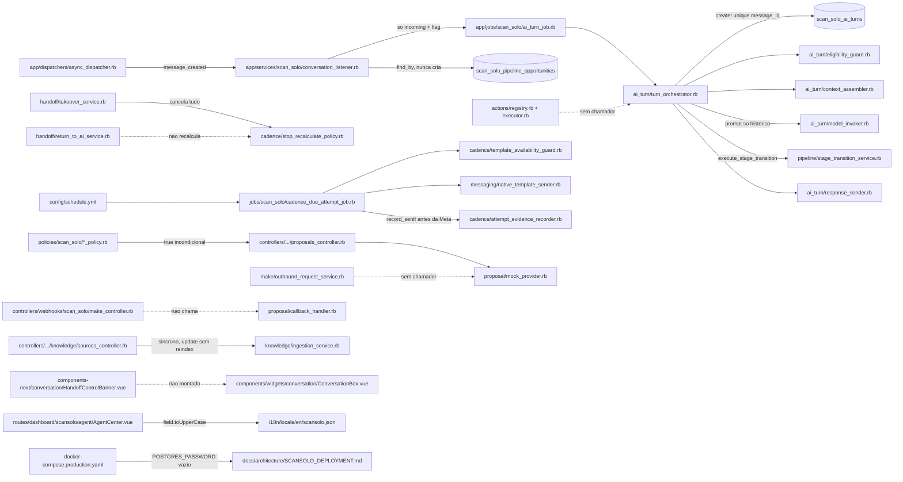
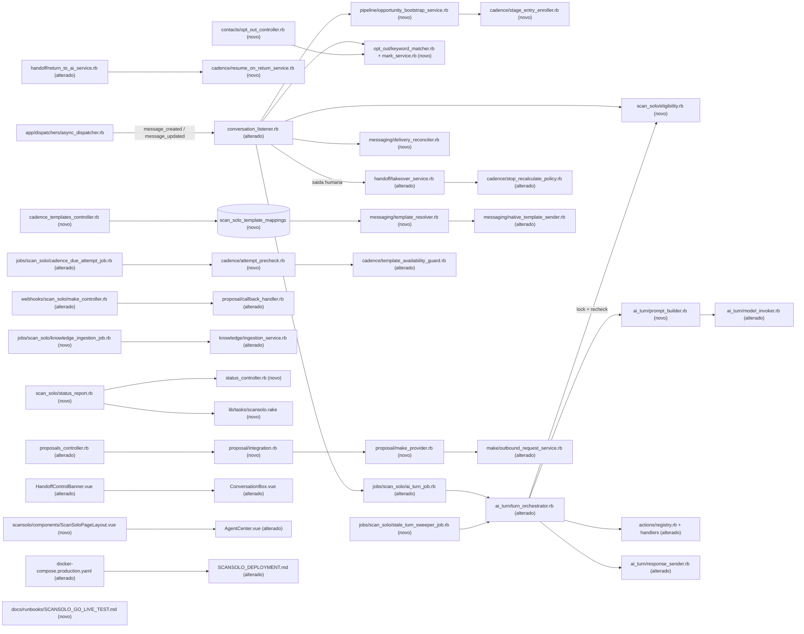

# Implementation Plan

## Request Summary
- Objective: make the existing ScanSolo layer (prior cycle `scansolo-chatwoot-platform`, RF-01..RF-100) work end-to-end in production by **wiring, fixing and hardening** existing code: AI turn context/terminal states/single reply, pipeline auto-creation + auto-enroll, AI actions through `Actions::Registry`, implicit takeover, production-safe cadences with delivery evidence, native WhatsApp template mapping, mock-proposal lockout + Make wiring, knowledge indexing state, admin policies/audit/rate limits, Captain exclusivity + inbox allowlist, reproducible production deploy, status/smoke, go-live test script.
- Scope in: RF-01..RF-46, RF-48..RF-63, UI-01..UI-15, RNF-01..RNF-10, CT-01..CT-11 (SPEC v1.2).
- Scope out: RF-47 (P2, blocked by HG-11 — not tasked, see Open Questions); LEXUS import/cutover (HG-05); handoff pause/close/reopen endpoints; human stage-transition matrix; `pt_BR/scansolo.json`; filters/pagination/Playwright/HNSW/Super Admin toggle; **any change to Nginx, TLS, certificates or DNS**; any autonomous production deploy or provider activation (HUMAN GATES HG-01..HG-11).
- Tier: complete
- Architecture references: `AGENTS.md` (= project `CLAUDE.md`), `docs/agents/architecture.md`, `docs/agents/domain_rules.md`; audit sources `docs/scansolo-production-complete/{CURRENT_STATE,ARCHITECTURE_MAP,GAP_ANALYSIS,RISK_REGISTER,DECISIONS_REQUIRED}.md`; prior cycle `.spec/features/scansolo-chatwoot-platform/{PLAN,PHASES,openapi.yaml,asyncapi.yaml}`.

### Layering and delegation rules every task preserves
From `docs/agents/architecture.md` (Layer responsibilities) and `docs/agents/domain_rules.md`:
- **Controllers** (`Api::V1::Accounts::ScanSolo::*`, inherit `BaseController`) own only the `scansolo_enabled?` 404 gate, `Current.account` scoping, Pundit `authorize`, strong params and request-boundary validation (422). Every state change is delegated to a service.
- **Services** (`app/services/scan_solo/`) are the only writers. Sole-path writers stay sole: `Pipeline::StageTransitionService` (stage), `Cadence::EnrollmentService` (enrollments), `Handoff::TakeoverService` / `Handoff::ReturnToAiService` (control state), `Proposal::CallbackHandler` (proposal callback application), `Actions::Registry`/`Executor` (every AI-originated write), `AuditLogger` (audit rows; `AuditEvent` readonly after create).
- **Jobs** (`app/jobs/scan_solo/`) never own eligibility logic — they call services (`ScanSolo::Eligibility`, `Cadence::AttemptPrecheck`).
- **Listener** (`ScanSolo::ConversationListener`) owns the enable/eligibility gate, pipeline bookkeeping and job enqueue — never AI logic; it delegates opportunity creation, opt-out and takeover to services.
- **Vue/Pinia** renders server-confirmed state only; Composition API `<script setup>`, Tailwind only, `components-next/`, copy only in `en` locale files (`en/scansolo.json`, `en.yml`).
- From `AGENTS.md`/`CLAUDE.md`: eligibility enforced once at the earliest shared entry point (the listener); rechecks allowed only on the independent-in-time paths RF-10 (pre-send) and RF-26 (cadence); misconfiguration fails loudly (`ChatwootExceptionTracker`, `find_by!`); custom exceptions under `lib/custom_exceptions/`; **no dependency on `enterprise/` under `app/**/scan_solo/**`** (`spec/lib/scansolo_no_enterprise_dependency_spec.rb` must stay green) — Captain exclusivity uses only the OSS `Inbox#active_bot?` contract that `enterprise/app/models/enterprise/inbox.rb:11` extends.

## AS IS — Componentes impactados

Recorte verificado dos componentes que este incremento toca: o listener só trata mensagens incoming e nunca cria a oportunidade, o orquestrador envia só o histórico e chama `StageTransitionService` diretamente enquanto `Registry`/`Executor`, `OutboundRequestService` e o banner de handoff não têm chamador. Cadências marcam `sent` antes da Meta, o controller de propostas usa o `MockProvider`, as policies retornam `true` e o compose de produção tem a senha do Postgres vazia.

## TO BE — Componentes propostos

Nós novos/alterados por task: `Eligibility` T03; `Integration`/`MakeProvider` T06 (completado em T32); bootstrap + `StageEntryEnroller` T08; opt-out T09 e T23; handoff/`ResumeOnReturnService` T10; listener, `TakeoverService` e marcação de origem T11; `PromptBuilder`/`ModelInvoker` T12; orquestrador/`AiTurnJob` T13; `Registry` e handlers T14; sweeper T15; `TemplateResolver`/guard/`NativeTemplateSender` T16; `CadenceTemplatesController` T17; `AttemptPrecheck`/job T18; `DeliveryReconciler` T19; `scansolo.rake` T20/T24; ingestão T21; `StatusReport`/`StatusController` T24; compose/Dockerfile T25; runbook T26; go-live T27; layout T28; `AgentCenter.vue` T29/T30/T39; banner T31; Make callback T33.

## Tasks

### Phase 1 — Fundação P0: esquema, elegibilidade, configuração, políticas

### T01 — Migrations aditivas e as duas substituições de índice (RNF-05)
- **Files**: `db/migrate/20260923000001_add_production_fields_to_scan_solo_ai_agent_configs.rb`, `db/migrate/20260923000002_create_scan_solo_contact_extensions.rb`, `db/migrate/20260923000003_add_delivery_fields_to_scan_solo_cadence_attempts.rb`, `db/migrate/20260923000004_create_scan_solo_template_mappings.rb`, `db/migrate/20260923000005_add_index_state_to_scan_solo_knowledge_sources.rb`, `db/migrate/20260923000006_replace_scan_solo_cadence_enrollment_unique_index.rb`, `db/migrate/20260923000007_replace_scan_solo_make_callbacks_correlation_index.rb`, `db/schema.rb`
- **Change**: (1) `scan_solo_ai_agent_configs`: `allowed_inbox_ids jsonb default [] null false`, `opt_out_keywords jsonb default ["PARAR","SAIR","STOP"] null false`. (2) New `scan_solo_contact_extensions` (`contact_id` bigint unique FK, `opted_out boolean default false null false`, `opted_out_at`, `opted_out_source string`) — mirrors `ScanSolo::ConversationExtension`, no column added to upstream `contacts`. (3) `scan_solo_cadence_attempts`: `message_id bigint` (indexed), `last_block_reason string`, `last_checked_at datetime`, `external_error text`. (4) New `scan_solo_template_mappings` (`account_id`, `stage string`, `step integer null`, `template_name`, `language`, `params jsonb default []`) with unique `(account_id, stage, step)` using `NULLS NOT DISTINCT` (Postgres 16 via `pgvector/pgvector:pg16`). (5) `scan_solo_knowledge_sources`: `index_status integer default 0 null false`, `index_error text`, `indexed_at datetime`, `chunk_count integer default 0 null false`. (6) Replace `idx_scansolo_cadence_enrollments_on_opportunity_and_definition` by a partial unique index `WHERE status IN (0,1)` (active/paused). (7) Replace `index_scan_solo_make_callbacks_on_correlation_id` by a partial unique index `WHERE applied = true`. Migrations 6 and 7 are reversible (`up`/`down`), delete no row; all others are pure additions.
- **Covers**: RNF-05, RF-03, RF-16, RF-27, RF-30, RF-32, RF-39, RF-44
- **Acceptance**: `bin/rails db:migrate` then `db:rollback STEP=7` then `db:migrate` succeed; only migrations 6 and 7 remove an index and each recreates it as partial; no `remove_column`, `change_column`, `delete`/`destroy` or `execute 'DELETE` in any file.
- **Tests**: `spec/db/scansolo_migrations_spec.rb` — extend: new files contain only additive DDL except the two documented index replacements; partial predicates asserted from `db/schema.rb`.
- **Risk**: Medium — index replacement on live tables; mitigated by small ScanSolo table sizes and reversible `down`.
- **Dependencies**: none

### T02 — Models: ContactExtension, TemplateMapping, novos enums e campos
- **Files**: `app/models/scan_solo/contact_extension.rb` (new), `app/models/scan_solo/template_mapping.rb` (new), `app/models/scan_solo/cadence_attempt.rb`, `app/models/scan_solo/knowledge_source.rb`, `app/models/scan_solo/ai_agent_config.rb`, `app/models/scan_solo/cadence_enrollment.rb`, `app/models/scan_solo/make_callback.rb`
- **Change**: `ContactExtension.resolve_for(contact)` (like `ConversationExtension.resolve_for`) + `opted_out?`; `TemplateMapping` with `PARAM_SOURCES = %w[contact_name contact_first_name agent_name stage_label static]`, validations (stage in cadence stages, `static` requires `value`, source allowlisted); `CadenceAttempt` enum adds `dispatched: 5` (keep existing integers) + `belongs_to :message, optional: true`; `KnowledgeSource` enum `index_status { pending indexing indexed failed }`; `AiAgentConfig::FIELDS` adds `allowed_inbox_ids`, `opt_out_keywords` (so `PublishService` copies them); `CadenceEnrollment` scope `open_for(opportunity, definition)` (active/paused); `MakeCallback` scope `applied`.
- **Covers**: RF-03, RF-16, RF-27, RF-30, RF-32, RF-44, RF-63
- **Acceptance**: publishing a draft copies `allowed_inbox_ids` and `opt_out_keywords`; `TemplateMapping` with source `phone_number` is invalid; `CadenceAttempt.results` includes `dispatched`; `KnowledgeSource.index_statuses` has the 4 values.
- **Tests**: `spec/models/scan_solo/contact_extension_spec.rb`, `spec/models/scan_solo/template_mapping_spec.rb`, `spec/models/scan_solo/cadence_attempt_spec.rb`, `spec/services/scan_solo/ai_agent/publish_service_spec.rb` (extend: new fields copied).
- **Risk**: Low
- **Dependencies**: T01

### T03 — `ScanSolo::Eligibility`: gate único (flag + allowlist + sem bot ativo)
- **Files**: `app/services/scan_solo/eligibility.rb` (new), `spec/services/scan_solo/eligibility_spec.rb`, `spec/enterprise/services/scan_solo/captain_exclusivity_spec.rb` (new)
- **Change**: `ScanSolo::Eligibility.for_inbox(account:, inbox:)` and `.for_message(message)` returning `Result(eligible?, reason)` with reasons `scansolo_disabled`, `inbox_not_allowlisted`, `inbox_has_active_bot`, `config_unavailable`. Reads the **published** config (`AiAgentConfig.published_for`) and its `allowed_inbox_ids` (empty = not eligible, fail closed) and `inbox.active_bot?` (`app/models/concerns/inbox_bot_status.rb:4`). No `Captain::` reference. This is the single definition reused by the listener (RF-01), the pre-send recheck (RF-10) and the cadence precheck (RF-26 (3)) — the only rechecks allowed by `CLAUDE.md` because they run on independent-in-time paths.
- **Covers**: RF-01, RF-02, RF-03, RNF-09
- **Acceptance**: each failing condition returns `eligible? == false` with its reason; all satisfied → `true`; `grep -rn "Captain" app/services/scan_solo` returns nothing; `spec/lib/scansolo_no_enterprise_dependency_spec.rb` stays green.
- **Tests**: `spec/services/scan_solo/eligibility_spec.rb` — 4 reasons + eligible path; `spec/enterprise/services/scan_solo/captain_exclusivity_spec.rb` — inbox with active Captain assistant → `inbox_has_active_bot`.
- **Risk**: Medium — wrong gate silences or unleashes the AI; covered per condition.
- **Dependencies**: T02

### T04 — API do Agent Config: allowlist, opt-out keywords, modelos disponíveis (CT-01 P0)
- **Files**: `app/controllers/api/v1/accounts/scan_solo/ai_agent_configs_controller.rb`, `app/views/api/v1/accounts/scan_solo/ai_agent_configs/_ai_agent_config.json.jbuilder`, `app/views/api/v1/accounts/scan_solo/ai_agent_configs/show.json.jbuilder`, `app/services/scan_solo/ai_agent/model_resolver.rb`
- **Change**: strong params add `allowed_inbox_ids: []`, `opt_out_keywords: []` (and keep `require_proposal_approval`); request-boundary validation → 422 (reusing the existing 422 path) when any inbox id is not in `Current.account.inboxes` or `model_selection` is not in the `scansolo_agent_response` model list of `config/llm.yml`; `show` renders `available_models`; `ModelResolver` exposes the list and stops silently falling back for an unknown stored model (fails loudly). Controller keeps delegating persistence (`draft_for!`/`PublishService`).
- **Covers**: RF-03, RF-16, UI-08 (server side), CT-01
- **Acceptance**: PUT draft with an inbox id of another account → 422; `model_selection: "foo"` → 422; GET returns `available_models == ["gpt-4.1-mini","gpt-4.1","gpt-5.1","gpt-5.2"]`, `allowed_inbox_ids`, `opt_out_keywords` (default `["PARAR","SAIR","STOP"]`).
- **Tests**: `spec/requests/api/v1/accounts/scan_solo/ai_agent_configs_spec.rb` — cross-account inbox 422, unknown model 422, fields round-trip, publish copies allowlist.
- **Risk**: Low
- **Dependencies**: T02

### T05 — Policies admin-only e regras de proposta (RF-48)
- **Files**: `app/policies/scan_solo/ai_agent_config_policy.rb`, `app/policies/scan_solo/knowledge_source_policy.rb`, `app/policies/scan_solo/proposal_policy.rb`, `app/policies/scan_solo/template_mapping_policy.rb` (new), `app/policies/scan_solo/contact_opt_out_policy.rb` (new), `app/policies/scan_solo/status_policy.rb` (new), `app/policies/scan_solo/application_policy.rb`
- **Change**: `ApplicationPolicy#administrator?` helper (`account_user&.administrator?`). Config: `show?` any user; `draft?`/`publish?` admin. Knowledge: `index?`/`show?` any; `create?`/`update?`/`destroy?`/`reindex?`/`retrieval_tests?` admin. Proposal: `index?`/`show?`/`generate?` any; `approve?` admin only; `send?` admin or `record.opportunity.owner_id == user.id`; `retry?` admin. New policies: template mapping (`index?` any, `update?` admin), contact opt-out (`show?` any, `destroy?` admin), status (`show?` admin).
- **Covers**: RF-48, RF-60, RF-63, UI-13 (server side)
- **Acceptance**: agent gets 403 on draft/publish/knowledge writes/reindex/retrieval tests/approve/retry; owner agent 2xx on send, non-owner agent 403; admin 2xx everywhere; no policy method returns `true` unconditionally for a write.
- **Tests**: `spec/policies/scan_solo/ai_agent_config_policy_spec.rb`, `knowledge_source_policy_spec.rb`, `proposal_policy_spec.rb`, `template_mapping_policy_spec.rb`, `contact_opt_out_policy_spec.rb`, `status_policy_spec.rb`; request specs `spec/requests/api/v1/accounts/scan_solo/ai_agent_configs_spec.rb`, `knowledge/sources_spec.rb`, `proposals_spec.rb` — agent 403 / admin 2xx matrix.
- **Risk**: Medium — existing request specs that exercise writes as agents must switch to administrator fixtures (behavior superseded by RF-48, allowed by RNF-07).
- **Dependencies**: T02

### T06 — Resolver de integração de proposta e bloqueio do mock (RF-35, RF-36)
- **Files**: `app/services/scan_solo/proposal/integration.rb` (new), `app/services/scan_solo/proposal/make_provider.rb` (new), `lib/custom_exceptions/scan_solo.rb` (new), `app/controllers/api/v1/accounts/scan_solo/base_controller.rb`, `app/services/scan_solo/proposal/generate_service.rb`, `app/services/scan_solo/proposal/send_service.rb`, `app/services/scan_solo/proposal/retry_policy.rb`, `app/services/scan_solo/actions/proposal_actions.rb`
- **Change**: `ScanSolo::Proposal::Integration.configured?` (all 3 credentials `scan_solo.make.{scenario_url,secret,inbound_signing_secret}` present), `.state` (`configured|blocked`), `.provider!` → `MockProvider` only when `Rails.env.test?`/`development?`, `MakeProvider` when configured, otherwise raises `CustomExceptions::ScanSolo::ProposalIntegrationNotConfigured`. Remove the `provider: MockProvider` defaults from Generate/Send/Retry/proposal actions (provider comes from `Integration.provider!`; explicit injection kept for specs). `MakeProvider#request_generation/#request_send` delegate to `Make::OutboundRequestService` with the version's correlation id (completed in T32). `BaseController` `rescue_from` the exception → 422 `{error: "proposal_integration_not_configured"}` raised **before** any row is created.
- **Covers**: RF-35, RF-36, CT-04
- **Acceptance**: in a production-env spec with empty credentials, generate/send/retry → 422 with the code and 0 `ProposalVersion`/0 `MakeRequest` rows; `MockProvider` never invoked; `1500.0` / `mock-proposals.scansolo.test` never persisted.
- **Tests**: `spec/services/scan_solo/proposal/integration_spec.rb`; `spec/requests/api/v1/accounts/scan_solo/proposals_spec.rb` — production env stubbed (`allow(Rails.env).to receive(:production?)`) + empty credentials.
- **Risk**: High — commercial integrity (RR-O3); covered by row-count assertions.
- **Dependencies**: T02

### T07 — Redação de log preservando UUID/correlation id (RNF-03)
- **Files**: `app/services/scan_solo/ai_turn/prompt_redactor.rb`
- **Change**: exclude UUID-shaped values (`\h{8}-\h{4}-\h{4}-\h{4}-\h{12}`) from the long-opaque-token rule; keep `sk-`, Bearer and ≥32-char non-UUID tokens redacted. Used by `config/initializers/scansolo_log_redaction.rb` unchanged.
- **Covers**: RNF-03, RNF-04
- **Acceptance**: a log line with a UUID and an `sk-...` key keeps the UUID and shows `[REDACTED]` for the key.
- **Tests**: `spec/services/scan_solo/ai_turn/prompt_redactor_spec.rb` — UUID + key in one line; 40-char hex token still redacted.
- **Risk**: Low
- **Dependencies**: none

### Phase 2 — Runtime P0: pipeline, opt-out, handoff, listener, turno de IA, ações

### T08 — Bootstrap da oportunidade, enroll por estágio e re-enroll (RF-22, RF-23, RF-24, RF-30)
- **Files**: `app/services/scan_solo/pipeline/opportunity_bootstrap_service.rb` (new), `app/services/scan_solo/cadence/stage_entry_enroller.rb` (new), `app/services/scan_solo/pipeline/stage_transition_service.rb`, `app/services/scan_solo/proposal/success_handler.rb`, `app/services/scan_solo/cadence/enrollment_service.rb`
- **Change**: `OpportunityBootstrapService.call(message:)` → `create_or_find_by!(conversation_id:)` (unique index `index_scan_solo_pipeline_opportunities_on_conversation_id`), stage `novo_lead`, contact, owner = `conversation.assignee_id`, `last_customer_interaction_at`; returns `created?`; on creation records `AuditEvent pipeline.opportunity_created` and calls `StageEntryEnroller`. `StageEntryEnroller.call(opportunity:)` for `novo_lead/em_contato/em_qualificacao/proposta_enviada`: skip when `ContactExtension` opted out; `CadenceDefinition.current_for(stage)` missing → `ChatwootExceptionTracker` + `AuditEvent cadence.definition_missing`; else `EnrollmentService`. `StageTransitionService` calls the enroller after commit (it stays the sole stage writer). `SuccessHandler` drops its own silent enroll (`success_handler.rb:36-37`) — the transition to `proposta_enviada` enrolls via the enroller. `EnrollmentService`: return the open (active/paused) enrollment for the pair, else create a new one (partial index from T01).
- **Covers**: RF-22, RF-23, RF-24, RF-30
- **Acceptance**: first bootstrap → 1 opportunity `novo_lead` + 1 Novo Lead enrollment + 1 audit; two concurrent calls → 1 row; each of 4 stage entries → 1 active enrollment; empty definitions → tracker called + 1 `cadence.definition_missing`; cancel then enroll → 2 rows (1 cancelled, 1 active); enroll twice while active → 1 row.
- **Tests**: `spec/services/scan_solo/pipeline/opportunity_bootstrap_service_spec.rb`, `spec/services/scan_solo/cadence/stage_entry_enroller_spec.rb`, `spec/services/scan_solo/cadence/enrollment_service_spec.rb` (extend re-enroll), `spec/services/scan_solo/proposal/success_handler_spec.rb` (update).
- **Risk**: Medium — stage transitions now enroll; covered by per-stage specs.
- **Dependencies**: T01, T02

### T09 — Opt-out: palavra-chave determinística, marcação e limpeza (RF-16, RF-31, RF-63)
- **Files**: `app/services/scan_solo/opt_out/keyword_matcher.rb` (new), `app/services/scan_solo/opt_out/mark_service.rb` (new), `app/services/scan_solo/opt_out/clear_service.rb` (new), `app/services/scan_solo/actions/cadence_signal_action.rb`
- **Change**: `KeywordMatcher.match?(content, keywords)` — normalize both sides (strip, downcase, `I18n.transliterate` to strip accents, remove punctuation) and compare the **whole** text for equality; no model call. `MarkService.call(contact:, source:)` sets `ContactExtension.opted_out` (+ `opted_out_at`, `opted_out_source` `keyword|model_action`) and cancels active/paused enrollments of the contact's opportunities via `StopRecalculatePolicy` `opt_out`. `ClearService.call(contact:, actor:)` sets false + `AuditEvent contact.opt_out_cleared` (only reset path). `CadenceSignalAction` `opt_out` routes through `MarkService` (source `model_action`).
- **Covers**: RF-16, RF-31, RF-63
- **Acceptance**: `Parar!`, `  sair `, `stop.`, `PÁRAR` match defaults; `não vou parar agora`, `parar de receber?` do not; marking leaves 0 active/paused enrollments; clear → marker false + 1 audit event.
- **Tests**: `spec/services/scan_solo/opt_out/keyword_matcher_spec.rb`, `mark_service_spec.rb`, `clear_service_spec.rb`; `spec/services/scan_solo/actions/cadence_signal_action_spec.rb` (extend).
- **Risk**: Low
- **Dependencies**: T02

### T10 — Handoff: pausa no takeover, recálculo no retorno, status da proposta na nota (RF-19, RF-20, RF-21, RF-29)
- **Files**: `app/services/scan_solo/cadence/stop_recalculate_policy.rb`, `app/services/scan_solo/cadence/resume_on_return_service.rb` (new), `app/services/scan_solo/handoff/return_to_ai_service.rb`, `app/services/scan_solo/handoff/handoff_service.rb`
- **Change**: `handle_takeover` pauses (not cancels) active enrollments (`pause_all_for_opportunity!`) and add trigger `handoff` to `TRIGGERS` + `PAUSING_TRIGGERS` (used by RF-15). `ResumeOnReturnService.call(opportunity:)`: resume the paused enrollment of the current stage's definition via `LifecycleService.resume!` (shifts by paused duration); if none open, enroll through `StageEntryEnroller` (skipped when opted out). `ReturnToAiService` stays the sole path to `ai_active` and calls it after the state change. `HandoffService` fills "Status da proposta" with the pt-BR label of the current version's status (P1, same file area).
- **Covers**: RF-19, RF-20, RF-21, RF-29 (return part)
- **Acceptance**: takeover → enrollments `paused`, attempts still `scheduled`; 30 h takeover then return → next attempt `scheduled_at` = original + 30 h; return with no open enrollment → new enrollment unless opted out; note with a `generated` version shows its pt-BR label.
- **Tests**: `spec/services/scan_solo/cadence/stop_recalculate_policy_spec.rb` (update: takeover pauses — superseded prior RF-56 behavior), `spec/services/scan_solo/cadence/resume_on_return_service_spec.rb`, `spec/services/scan_solo/handoff/return_to_ai_service_spec.rb`, `spec/services/scan_solo/handoff/handoff_service_spec.rb`.
- **Risk**: Medium — changes prior "cancel on takeover" semantics (explicitly superseded in SPEC Context).
- **Dependencies**: T08

### T11 — Listener: gate único, bootstrap, opt-out por palavra-chave, takeover implícito, marcação de origem (RF-01, RF-02, RF-16, RF-18, RF-22, RF-23)
- **Files**: `app/services/scan_solo/conversation_listener.rb`, `app/services/scan_solo/handoff/takeover_service.rb`, `app/services/scan_solo/ai_turn/response_sender.rb`, `app/services/scan_solo/messaging/native_template_sender.rb`
- **Change**: `message_created` incoming branch: return unless `Eligibility.for_message(message).eligible?` (single classification, before any write/enqueue); `OpportunityBootstrapService` → if created, skip `InboundMessageTransitionRule` for this message (RF-23 option A), else `record_customer_interaction!` + transition rule; `KeywordMatcher` against the published `opt_out_keywords` → `MarkService` (independent of the AI turn outcome); enqueue `AiTurnJob`. Outgoing branch: account enabled, non-private, `sender.is_a?(User)`, `additional_attributes['scansolo_origin'].blank?`, state ≠ `human_active` → `TakeoverService.call(conversation:, reason:, actor: user, trigger: 'human_reply')` (audit payload gains `trigger`). Assignment changes never reach this branch. `ResponseSender` sets `scansolo_origin: 'ai'`; `NativeTemplateSender` accepts `origin:` (`cadence`/`proposal`) and sets it. The listener stays free of AI logic.
- **Covers**: RF-01, RF-02, RF-16 (b), RF-18, RF-22, RF-23, CT-09
- **Acceptance**: each failing eligibility condition → 0 opportunities, 0 turns, 0 enqueues; all satisfied → 1 enqueue; creating message → `novo_lead`, second incoming → `em_contato` + Novo Lead cancelled + Em Contato active; `PARAR` with model requesting nothing → marker true; agent reply → `human_active` + 1 `handoff.takeover` with `trigger: human_reply`; private note, manual assignment, auto-assignment, cadence message, proposal message → state unchanged, 0 takeover events.
- **Tests**: `spec/services/scan_solo/conversation_listener_spec.rb` (rewrite for new gate), `spec/services/scan_solo/handoff/takeover_service_spec.rb` (trigger payload), `spec/integration/scan_solo/implicit_takeover_spec.rb` (new).
- **Risk**: High — central entry point; a false takeover silences the AI, a missed one causes double replies (RR-O1).
- **Dependencies**: T03, T08, T09, T10

### T12 — Prompt completo, saída estruturada, restricted_information, evidência RAG, latência (RF-05, RF-06, RF-46, RF-59)
- **Files**: `app/services/scan_solo/ai_turn/prompt_builder.rb` (new), `app/services/scan_solo/ai_turn/model_invoker.rb`, `app/services/scan_solo/ai_turn/output_validator.rb`, `app/services/scan_solo/ai_turn/context_assembler.rb`, `app/services/scan_solo/test_mode/mock_llm_provider.rb`
- **Change**: `PromptBuilder.call(config:, context:, offered_actions:)` builds a pt-BR system message with labelled sections for the 12 rule fields (role, objective, persona, tone, instructions, service_rules, service_hours, response_limits, transfer_criteria, restricted_information, qualification_playbook, required_qualification_fields — D-22 interim: hours/limits as instructions) and the 5 context blocks (history kept as chat messages, knowledge chunks with source titles, contact, opportunity with collected/missing required fields, durable memory), whole payload through `PromptRedactor`. `ModelInvoker` sends it with RubyLLM structured output `{reply: string, actions: [{action_id, params}]}` (`with_schema`), measures `latency_ms`, returns `actions`; it no longer swallows non-provider exceptions (T13 handles all). `OutputValidator` blocks case-insensitive `restricted_information` entries with violation `restricted_information`. `ContextAssembler` returns the exact chunks with `{source_id, source_title, chunk_id, similarity_score}` (retrieval outage → `[]` + `failure_reason` in snapshot). `MockLlmProvider` returns the same structured shape and records the payload for specs.
- **Covers**: RF-05, RF-06, RF-46, RF-59 (latency/tokens), D-22
- **Acceptance**: captured provider payload contains every one of the 12 rule values and 5 context blocks, redaction still applied; output containing a restricted entry → `blocked` with `restricted_information`; evidence entries equal the prompt chunks; outage → `[]` + reason.
- **Tests**: `spec/services/scan_solo/ai_turn/prompt_builder_spec.rb`, `model_invoker_spec.rb` (update), `output_validator_spec.rb` (extend), `context_assembler_spec.rb` (extend).
- **Risk**: Medium — structured output support per model `[UNVERIFIED]` for all 4 `config/llm.yml` models; invalid JSON → treated as exception → `failed` (T13).
- **Dependencies**: T02

### T13 — Orquestrador: estados terminais, retry idempotente, lock por conversa, recheck pré-envio (RF-02, RF-04, RF-07, RF-08, RF-09, RF-10, RF-11, RF-28, RNF-01)
- **Files**: `app/services/scan_solo/ai_turn/turn_orchestrator.rb`, `app/jobs/scan_solo/ai_turn_job.rb`, `app/services/scan_solo/ai_turn/response_sender.rb`, `app/services/scan_solo/ai_turn/eligibility_guard.rb`
- **Change**: `create_turn` → find existing by `message_id`: terminal → no-op; `pending` without `response_message_id` → resume same row/correlation id; else create. Whole flow in `rescue StandardError` → `failed` with `"#{e.class}: #{redacted message}"` + `ChatwootExceptionTracker.new(e, ...).capture_exception` tagged with correlation id (attachment-only message → empty query handled, terminal). Per-conversation Redis mutex (`Redis::LockManager`, key per conversation, TTL > model timeout) around model invocation + send; `AiTurnJob` re-enqueues on lock contention (bounded retry, `sidekiq_options retry: 3`). Before invoking: if trigger is no longer the latest incoming → `suppressed/superseded`. Send transaction: `ConversationExtension#with_lock`, then recheck in order `Eligibility.for_message` (`not_eligible` / `inbox_has_active_bot`), `ai_active` (`human_controlled`), published+enabled config (`config_unavailable`), no non-private `User` outgoing after trigger (`human_replied`), trigger still latest incoming (`superseded`), turn still `pending` (stale sweep); any failure → `suppressed` + rollback; then actions (T14) and `ResponseSender`. After terminal state, run `ReplyCompletenessDetector` (RF-28). `EligibilityGuard` folded into the recheck (removed if unused).
- **Covers**: RF-02, RF-04, RF-07, RF-08, RF-09, RF-10, RF-11, RF-19 (in-flight), RF-28, RNF-01
- **Acceptance**: non-provider `StandardError` in each of the 7 stages → `failed` + tracker once; job twice after a simulated crash → 1 turn, 1 correlation id, ≤ 1 message; 5 flipped checks → 0 messages with reasons `not_eligible`, `human_controlled`, `config_unavailable`, `human_replied`, `superseded`; slow-stubbed model + 3 incoming in 2 s → 1 reply, 2 `superseded`, surviving payload has all 3 texts; flag off mid-turn → suppressed; full reply → 0 scheduled attempts; partial → only next cancelled.
- **Tests**: `spec/services/scan_solo/ai_turn/turn_orchestrator_spec.rb` (extend), `spec/jobs/scan_solo/ai_turn_job_spec.rb` (retry), `spec/integration/scan_solo/burst_single_reply_spec.rb` (new), `spec/integration/scan_solo/presend_recheck_spec.rb` (new).
- **Risk**: High — concurrency/locking; Redis lock TTL must exceed model timeout or two turns can race; covered by burst spec.
- **Dependencies**: T03, T11, T12

### T14 — Ações da IA exclusivamente via Registry (RF-12, RF-13, RF-14, RF-15, RF-16a, RF-17)
- **Files**: `app/services/scan_solo/ai_turn/turn_orchestrator.rb`, `app/services/scan_solo/ai_turn/input_guardrail.rb`, `app/services/scan_solo/actions/stage_transition_action.rb`, `app/services/scan_solo/actions/handoff_action.rb`, `app/services/scan_solo/actions/registry.rb`
- **Change**: remove `SUPPORTED_ACTIONS`, `actions:` param and `execute_stage_transition`; inside the send transaction (after the recheck) call `Actions::Registry.call` per model action with `correlation_id` = turn correlation and idempotency key `"#{turn.correlation_id}:#{index}:#{action_id}"`; offered ids = `qualification_field stage_transition private_note cadence_signal human_handoff` + `proposal_generate` only when `Proposal::Integration.configured?` (`InputGuardrail#allowed_actions` keeps excluding approve/send). Any executor error (unregistered/disabled/schema) → turn `failed` with the error class, 0 messages (all-or-nothing). `StageTransitionAction` allows only forward moves to `em_qualificacao`/`qualificado`, else records rejection in `action_evidence` without changing stage. `HandoffAction` → `HandoffService` (`awaiting_human` + 9-line note) + `StopRecalculatePolicy` `handoff` (pause); the turn's own reply still sends (recheck ran before actions). A Make HTTP call from `proposal_generate` is deferred until after commit (see Assumptions). After actions, `ReplyCompletenessDetector` (T13) covers RF-17.
- **Covers**: RF-12, RF-13, RF-14, RF-15, RF-16 (a), RF-17
- **Acceptance**: one action of each offered id → one `AgentActionExecution` each with the turn correlation id; re-run → 0 new; `grep -n execute_stage_transition app/services/scan_solo` empty; unregistered id → `failed`, 0 messages, 0 side effects; 5 forbidden targets unchanged + rejection evidence; `em_contato → em_qualificacao` succeeds with `PipelineStageEvent`; handoff turn → 1 note, `awaiting_human`, enrollments `paused`, next incoming → 0 AI replies; last required field via action → remaining attempts cancelled.
- **Tests**: `spec/services/scan_solo/ai_turn/turn_orchestrator_actions_spec.rb` (new), `spec/services/scan_solo/actions/stage_transition_action_spec.rb`, `handoff_action_spec.rb` (update).
- **Risk**: High — AI writes to CRM state; guarded by registry schemas and all-or-nothing transaction.
- **Dependencies**: T06, T10, T13

### T15 — Sweeper de turnos pending (RF-08, RNF-02)
- **Files**: `app/jobs/scan_solo/stale_turn_sweeper_job.rb` (new), `config/schedule.yml`, `config/initializers/scansolo_constants.rb`
- **Change**: `ScanSolo::AI_TURN_STALE_THRESHOLD = 10.minutes`; job marks `pending` turns older than the threshold `failed/stale_pending` (row-locked); cron entry `scan_solo_stale_turn_sweeper_job` `*/5 * * * *` queue `scheduled_jobs`. The orchestrator's under-lock `pending` check (T13) guarantees no later send.
- **Covers**: RF-08, RNF-02
- **Acceptance**: turn created 11 min ago → `failed/stale_pending` after the run; a later job for its message sends 0 messages; schedule entry present.
- **Tests**: `spec/jobs/scan_solo/stale_turn_sweeper_job_spec.rb`.
- **Risk**: Low
- **Dependencies**: T13

### Phase 3 — Cadências, templates, conhecimento, APIs e status P0

### T16 — Resolver de template e guard de disponibilidade nativo (RF-32, RF-33, RF-34)
- **Files**: `app/services/scan_solo/messaging/template_resolver.rb` (new), `app/services/scan_solo/cadence/template_availability_guard.rb`, `app/services/scan_solo/messaging/native_template_sender.rb`, `spec/lib/scansolo_native_whatsapp_only_spec.rb` (new)
- **Change**: `TemplateResolver.call(account:, stage:, step:, opportunity:)` → mapping from `TemplateMapping` or convention `CadenceDefinition#template_reference_for` + `pt_BR` + no params; resolves params only from the 5 allowlisted sources into native `processed_params` (`Whatsapp::TemplateProcessorService` shape). Guard (used by cadence **and** proposal send): for `Channel::Whatsapp`, compare mapped name+language against `channel.message_templates` status and BODY `{{n}}` placeholder count → one of `template_missing`, `template_rejected`, `template_paused`, `template_pending`, `template_disabled`, `language_unavailable`, `params_mismatch` plus `message_templates_last_updated`; non-WhatsApp inboxes stay available. `NativeTemplateSender` sends name/language/`processed_params` via native `conversation.messages.create!` only.
- **Covers**: RF-32, RF-33, RF-34
- **Acceptance**: mapped step → native `template_params` with mapped name, language, processed params; unmapped → convention name + `pt_BR`; 7 fixtures → 0 native messages + matching reason + last-sync timestamp; `grep -rEn "graph.facebook.com|evolution" app/**/scan_solo` → 0.
- **Tests**: `spec/services/scan_solo/messaging/template_resolver_spec.rb`, `spec/services/scan_solo/cadence/template_availability_guard_spec.rb` (extend 7 reasons), `spec/lib/scansolo_native_whatsapp_only_spec.rb`.
- **Risk**: Medium — placeholder counting against real Meta template JSON `[UNVERIFIED]` shape; fixtures taken from native sync format.
- **Dependencies**: T02, T11

### T17 — API de mapeamento de templates (CT-03)
- **Files**: `app/controllers/api/v1/accounts/scan_solo/cadence_templates_controller.rb` (new), `app/views/api/v1/accounts/scan_solo/cadence_templates/index.json.jbuilder` (new), `app/views/api/v1/accounts/scan_solo/cadence_templates/_row.json.jbuilder` (new), `app/services/scan_solo/messaging/template_mapping_upsert_service.rb` (new), `app/services/scan_solo/messaging/template_availability_report.rb` (new), `config/routes.rb`
- **Change**: `resource :cadence_templates, only: [:show, :update]` mapped to `GET/PUT /cadence_templates`; index builds rows for every (stage, step) of active definitions + proposal-send row (`step: null`) via `TemplateAvailabilityReport` (reuses T16 guard against allowlisted WhatsApp inboxes); PUT validates at the boundary (non-allowlisted source → 422), authorizes `TemplateMappingPolicy#update?`, delegates to `TemplateMappingUpsertService`.
- **Covers**: RF-32, RF-33, UI-12 (server side), CT-03
- **Acceptance**: GET returns one row per stage/step + proposal row with availability/reason/meta status/last sync; PUT with `source: "phone_number"` → 422; agent PUT → 403.
- **Tests**: `spec/requests/api/v1/accounts/scan_solo/cadence_templates_spec.rb`.
- **Risk**: Low
- **Dependencies**: T05, T16

### T18 — Job de cadência: pré-checagens, adiamento sem consumo, dispatched (RF-04, RF-26, RF-27, RF-29, RF-31, RNF-08)
- **Files**: `app/services/scan_solo/cadence/attempt_precheck.rb` (new), `app/jobs/scan_solo/cadence_due_attempt_job.rb`, `app/services/scan_solo/cadence/attempt_evidence_recorder.rb`
- **Change**: `AttemptPrecheck.call(attempt:)` (the job owns no eligibility logic) evaluates in order under the existing row lock: (1) contact opted out → cancel enrollment `opt_out`; (2) conversation `resolved` → cancel `conversation_resolved`; (3) flag off / config absent-disabled / `Eligibility.for_inbox` false / state ≠ `ai_active` → defer; (4) T16 guard blocked → defer. Deferral keeps `scheduled`, sets `last_block_reason`, `last_checked_at`, leaves `current_step`. Sending: `NativeTemplateSender(origin: 'cadence')` → `record_dispatched!` (message id, result `dispatched`, never `sent`); if sent later than `scheduled_at`, shift remaining scheduled attempts of the enrollment by the delay; max one attempt per enrollment per run. Sending window unchanged (`SendingWindow`).
- **Covers**: RF-04, RF-26, RF-27 (dispatch), RF-29 (deferral shift), RF-31, RNF-08
- **Acceptance**: one spec per precheck with result/reason; (3)/(4) keep `scheduled`, `current_step` unchanged, 0 messages; flag off → 0 sends, 0 result changes; WhatsApp send → `dispatched` + message id; re-run never re-sends `dispatched`; step-1 deferred 26 h then sent → step-2 moved 26 h and not sent in the same run; due in-window attempt dispatched within one cron cycle.
- **Tests**: `spec/jobs/scan_solo/cadence_due_attempt_job_spec.rb` (extend), `spec/services/scan_solo/cadence/attempt_precheck_spec.rb`.
- **Risk**: Medium — changes prior `skipped` semantics (terminal → deferral) as RR-O11 requires.
- **Dependencies**: T03, T09, T16

### T19 — Reconciliador de entrega (RF-27, RF-41, CT-09)
- **Files**: `app/services/scan_solo/messaging/delivery_reconciler.rb` (new), `app/services/scan_solo/conversation_listener.rb`, `app/services/scan_solo/proposal/callback_handler.rb`
- **Change**: listener `message_updated` → `DeliveryReconciler.call(message:)` for messages referenced by `CadenceAttempt.message_id` or `ProposalVersion.sent_message_id`: WhatsApp → `sent` + `sent_at` when `source_id` present and status ≠ `failed`; `failed` → store `content_attributes['external_error']`; non-WhatsApp → persisted non-failed counts as accepted. For proposals: `CallbackHandler.apply_send_result!` stops marking `sent`/calling `SuccessHandler`; the reconciler marks version `sent` + runs `SuccessHandler` (stage `proposta_enviada` via `StageTransitionService`) or `failed` with the external error, stage unchanged. Idempotent (only `dispatched` attempts / unsent versions change).
- **Covers**: RF-27, RF-41, CT-09
- **Acceptance**: native update with `source_id` → attempt `sent` + `sent_at`; native `failed` → attempt `failed` with external error; proposal native failure → version `failed`, stage unchanged; proposal accepted → `sent` + `proposta_enviada`.
- **Tests**: `spec/services/scan_solo/messaging/delivery_reconciler_spec.rb`, `spec/services/scan_solo/proposal/callback_handler_spec.rb` (update).
- **Risk**: Medium — depends on native `message.updated` dispatch for status changes (`app/models/message.rb:249` verified).
- **Dependencies**: T11, T18

### T20 — Carga idempotente das definições de cadência (RF-25)
- **Files**: `lib/tasks/scansolo.rake` (new), `db/seeds/scansolo_cadence_definitions.rb`
- **Change**: `bundle exec rails scansolo:load_cadence_definitions` loads the seed file (idempotent `find_or_create_by!` by stage+version, offsets exactly as SPEC RF-25) and prints the 4 active definitions; no change to `db/seeds.rb` (deploy step documented in T26).
- **Covers**: RF-25
- **Acceptance**: running the task twice on an empty DB → exactly 4 active rows with offsets `[2,24,48,96]`, `[24,48,72,96,120]`, `[24,48,72,96,120,144,168]`, `[24,72,168]`.
- **Tests**: `spec/lib/tasks/scansolo_rake_spec.rb` (new) — double invocation.
- **Risk**: Low
- **Dependencies**: none

### T21 — Conhecimento: ingestão assíncrona, estado de indexação, reindex por conteúdo (RF-43, RF-44, RF-45)
- **Files**: `app/jobs/scan_solo/knowledge_ingestion_job.rb` (new), `app/services/scan_solo/knowledge/ingestion_service.rb`, `app/services/scan_solo/knowledge/reindex_service.rb`, `app/models/scan_solo/knowledge_source.rb`, `app/controllers/api/v1/accounts/scan_solo/knowledge/sources_controller.rb`, `app/views/api/v1/accounts/scan_solo/knowledge/sources/_source.json.jbuilder`, `app/javascript/dashboard/routes/dashboard/scansolo/knowledge/KnowledgeCenter.vue`, `app/javascript/dashboard/routes/dashboard/scansolo/knowledge/specs/KnowledgeCenter.spec.js`
- **Change**: `after_update_commit` on `saved_change_to_content?` and create/reindex enqueue `KnowledgeIngestionJob` (queue `low`) with `index_status: pending`; job sets `indexing`, embeds new chunks **before** replacing old ones (outage keeps previous chunks), sets `indexed` + `indexed_at` + `chunk_count`, or `failed` + pt-BR `index_error`; 0 chunks (empty/attachment-only) → `failed`, never `indexed`. Jbuilder exposes `index_status`, `index_error`, `indexed_at`, `chunk_count` (replaces `chunks_count`; update the single FE consumer `KnowledgeCenter.vue:156` and its spec fixture).
- **Covers**: RF-43, RF-44, RF-45, CT-02
- **Acceptance**: PATCH `content` → chunks reflect new text after the job; PATCH only `enabled` → 0 jobs; success → `indexed`, `chunk_count > 0`; embedding outage → `failed` + error, previous chunks preserved; attachment-only → `failed` + reason; no response shows `indexed` with 0 chunks.
- **Tests**: `spec/jobs/scan_solo/knowledge_ingestion_job_spec.rb`, `spec/services/scan_solo/knowledge/ingestion_service_spec.rb` (extend), `spec/requests/api/v1/accounts/scan_solo/knowledge/sources_spec.rb` (extend), `KnowledgeCenter.spec.js` (fixture key).
- **Risk**: Medium — ingestion moves async; the API now returns `pending` first.
- **Dependencies**: T02, T05

### T22 — API de turnos: evidência, latência, status de entrega (RF-59, CT-08)
- **Files**: `app/views/api/v1/accounts/scan_solo/ai_turns/_ai_turn.json.jbuilder`, `app/controllers/api/v1/accounts/scan_solo/ai_turns_controller.rb`
- **Change**: `knowledge_evidence` from the column (not `context_snapshot['knowledge_context']`), add `response_delivery_status` (`response_message&.status`), keep `latency_ms`, `failure_reason`, `action_evidence`; `includes(:response_message)` in index.
- **Covers**: RF-46 (exposure), RF-59, CT-08
- **Acceptance**: succeeded fixture has non-null provider, model, tokens, `latency_ms`; show returns `response_delivery_status` of the response message.
- **Tests**: `spec/requests/api/v1/accounts/scan_solo/ai_turns_spec.rb` (extend).
- **Risk**: Low
- **Dependencies**: T12

### T23 — Endpoint de opt-out do contato (CT-11, RF-63)
- **Files**: `app/controllers/api/v1/accounts/scan_solo/contacts/opt_outs_controller.rb` (new), `app/views/api/v1/accounts/scan_solo/contacts/opt_outs/show.json.jbuilder` (new), `config/routes.rb`
- **Change**: `get/delete 'contacts/:contact_id/opt_out'` scoped to `Current.account.contacts.find` (other account → 404); `show` any user, `destroy` authorizes `ContactOptOutPolicy#destroy?` and delegates to `OptOut::ClearService`; response `{contact_id, opted_out}`.
- **Covers**: RF-63, UI-15 (server side), CT-11
- **Acceptance**: admin DELETE → 200 `{opted_out: false}` + 1 `contact.opt_out_cleared`; agent → 403, marker unchanged; other-account contact → 404.
- **Tests**: `spec/requests/api/v1/accounts/scan_solo/contacts/opt_outs_spec.rb`.
- **Risk**: Low
- **Dependencies**: T05, T09

### T24 — StatusReport, endpoint de status e smoke (RF-58, RF-60, CT-07)
- **Files**: `app/services/scan_solo/status_report.rb` (new), `app/controllers/api/v1/accounts/scan_solo/status_controller.rb` (new), `app/views/api/v1/accounts/scan_solo/status/show.json.jbuilder` (new), `lib/tasks/scansolo.rake`, `config/routes.rb`
- **Change**: `StatusReport.call(account:)` computes: served `GIT_SHA` (initializer) vs expected (`EXPECTED_GIT_SHA` for the smoke); pending migrations (`ActiveRecord::Base.connection_pool.migration_context.needs_migration?`); 4 active definitions; OpenAI key present (boolean, `InstallationConfig CAPTAIN_OPEN_AI_API_KEY`); published+enabled config with non-empty allowlist; allowlisted inboxes with `active_bot?`; `Sidekiq::Cron::Job.find('scan_solo_cadence_due_attempt_job')` present; `Proposal::Integration.state`; `message_templates_last_updated` per allowlisted WhatsApp inbox. `GET /status` (admin, `StatusPolicy`) renders it — booleans/timestamps/counts only. `scansolo:smoke[account_id]` prints pass/fail per check and exits non-zero naming the failing check.
- **Covers**: RF-58, RF-60, RNF-04, CT-07
- **Acceptance**: each check forced to fail → non-zero exit naming it; response contains no credential value (only booleans); agent → 403.
- **Tests**: `spec/services/scan_solo/status_report_spec.rb`, `spec/requests/api/v1/accounts/scan_solo/status_spec.rb`, `spec/lib/tasks/scansolo_rake_spec.rb` (extend smoke).
- **Risk**: Low
- **Dependencies**: T03, T05, T06, T20

### Phase 4 — Deploy, runbooks e frontend P0

### T25 — Compose de produção, Dockerfile com GIT_SHA, imagens fixadas, `.env.example` (RF-52, RF-53, RF-54, RF-55)
- **Files**: `docker-compose.production.yaml`, `docker-compose.scansolo.yaml`, `docker/Dockerfile`, `.dockerignore`, `.env.example`, `spec/lib/scansolo_production_compose_spec.rb` (new)
- **Change**: production compose: `POSTGRES_PASSWORD=${POSTGRES_PASSWORD}`, remove `version:`, published ports only `127.0.0.1:`, pin images to explicit versions (no `latest`, no bare `redis:alpine`; tags must equal what the VPS runs — HG-08); overlay header shows only `docker compose -f docker-compose.production.yaml -f docker-compose.scansolo.yaml`, keeps `reverse-proxy`/`self-hosted-storage` behind profiles never used by documented commands, pins caddy/minio tags. Dockerfile: `ARG GIT_SHA` + `RUN test -n "$GIT_SHA" && echo "$GIT_SHA" > /app/.git_sha` replacing `git rev-parse HEAD` (`docker/Dockerfile:90`); `.git` in `.dockerignore`. `.env.example`: every `${VAR}` of the production compose + ScanSolo ENV names (`POSTGRES_PASSWORD`, `REDIS_PASSWORD`, `SCANSOLO_IMAGE_TAG`, `RATE_LIMIT_SCANSOLO_MAKE_CALLBACK`, `RATE_LIMIT_SCANSOLO_KNOWLEDGE_WRITES`, `RATE_LIMIT_SCANSOLO_RETRIEVAL_TESTS`, `RATE_LIMIT_SCANSOLO_PUBLISH`) with empty values. **No Nginx/TLS/domain file is touched.**
- **Covers**: RF-52, RF-53, RF-54, RF-55, RNF-04
- **Acceptance**: `docker compose -f docker-compose.production.yaml -f docker-compose.scansolo.yaml config --no-interpolate` shows `${POSTGRES_PASSWORD}`, every published port starts with `127.0.0.1:`, no unprofiled `vite`/`mailhog`/`caddy`/`minio`, no volume source `./`, 0 images ending `:latest` or untagged; Dockerfile has no `git rev-parse`; every compose var present and empty in `.env.example`.
- **Tests**: `spec/lib/scansolo_production_compose_spec.rb` — renders the command above (requires docker CLI in CI, see Assumptions) + Dockerfile/`.env.example` assertions.
- **Risk**: High — image pin mismatch (especially pgvector/Postgres major) can break prod data; mitigated by HG-08 VPS diff before deploy.
- **Dependencies**: none

### T26 — Runbook de deploy e rotação de chave (RF-56, RF-57)
- **Files**: `docs/architecture/SCANSOLO_DEPLOYMENT.md`, `spec/lib/scansolo_deployment_doc_spec.rb`
- **Change**: rewrite with the 9 ordered copy-pasteable steps (VPS diff of compose/.env names vs Git → `pg_dump` via `backup` profile + size check → build with `GIT_SHA` + new `SCANSOLO_IMAGE_TAG` → migrate → `scansolo:load_cadence_definitions` → restart Rails → restart Sidekiq → `scansolo:smoke` → rollback: previous tag + restart + restore command); only the production+overlay command; restart Rails and Sidekiq after saving/rotating `CAPTAIN_OPEN_AI_API_KEY`; D-21 note: flag off hides UI/API, so pre-cutover setup runs with the flag on and an **empty inbox allowlist**. No Nginx/certbot/DNS/`--profile reverse-proxy` command. Update the existing doc spec assertions that encoded the old dev-compose command (superseded, RNF-07).
- **Covers**: RF-56, RF-57
- **Acceptance**: doc spec finds the 9 steps in order, 0 `-f docker-compose.yaml`, 0 `nginx`/`certbot`/`--profile reverse-proxy` commands, the key-rotation restart step and the empty-allowlist note.
- **Tests**: `spec/lib/scansolo_deployment_doc_spec.rb` (rewrite assertions).
- **Risk**: Low
- **Dependencies**: T20, T24, T25

### T27 — Roteiro de teste controlado de go-live (RF-62)
- **Files**: `docs/runbooks/SCANSOLO_GO_LIVE_TEST.md` (new), `spec/lib/scansolo_go_live_test_doc_spec.rb` (new)
- **Change**: 12 numbered criteria (mensagem real chega; exatamente um turno; exatamente uma resposta; RAG usado; oportunidade criada; estágio correto; cadência coerente; resposta humana pausa a IA; devolver à IA funciona; nenhuma proposta mock; logs/correlation id; nenhum envio duplicado), each with "Ação", "Evidência" (SQL/rails runner query, API endpoint or screen — e.g. `GET /scan_solo/ai_turns/{correlation_id}`, `GET /scan_solo/status`) and "Passa se" (binary). Leaves a `## Gates humanos` placeholder section filled by Phase 6.
- **Covers**: RF-62, RNF-03 (criterion 11)
- **Acceptance**: doc spec finds 12 numbered criteria each with `Ação`, `Evidência`, `Passa se`.
- **Tests**: `spec/lib/scansolo_go_live_test_doc_spec.rb`.
- **Risk**: Low
- **Dependencies**: T22, T24

### T28 — FE: guard de rota por flag e layout com scroll (RF-51, UI-02)
- **Files**: `app/javascript/dashboard/routes/dashboard/scansolo/index.js`, `app/javascript/dashboard/routes/dashboard/scansolo/components/ScanSoloPageLayout.vue` (new), `app/javascript/dashboard/routes/dashboard/scansolo/{agent/AgentCenter.vue,agent/TurnEvidenceViewer.vue,knowledge/KnowledgeCenter.vue,followups/FollowUps.vue,proposals/Proposals.vue,executions/Executions.vue,pipeline/KanbanBoard.vue,pipeline/OpportunityDetail.vue}`, `app/javascript/dashboard/routes/dashboard/scansolo/specs/routeGuard.spec.js` (new), `app/javascript/dashboard/routes/dashboard/scansolo/specs/ScanSoloPageLayout.spec.js` (new)
- **Change**: route `beforeEnter` reads the current account's `scansolo_enabled` (already rendered by `app/views/api/v1/models/_account.json.jbuilder:35`) and redirects to the account dashboard before any ScanSolo component mounts; `ScanSoloPageLayout.vue` (`<script setup>`, Tailwind `flex flex-col h-full min-h-0` + inner `overflow-y-auto`, mirroring `components-next/captain/PageLayout.vue`) wraps each module root so content scrolls inside `Dashboard.vue`'s `overflow-hidden` main (Dashboard.vue untouched).
- **Covers**: RF-51, UI-02
- **Acceptance**: flag off → redirect and 0 ScanSolo API calls; every ScanSolo route renders inside the layout's `overflow-y-auto` bounded container; manual check at 1366×768 and 375×667 reaches last field and save/publish.
- **Tests**: `routeGuard.spec.js`, `ScanSoloPageLayout.spec.js` (asserts each route component root uses the layout).
- **Risk**: Low
- **Dependencies**: none

### T29 — FE: chaves i18n sem raw keys + spec de completude (UI-03, RNF-10)
- **Files**: `app/javascript/dashboard/routes/dashboard/scansolo/agent/AgentCenter.vue`, `app/javascript/dashboard/routes/dashboard/scansolo/agent/agentCenterFields.js` (new), `app/javascript/dashboard/i18n/locale/en/scansolo.json`, `app/javascript/dashboard/routes/dashboard/scansolo/specs/i18nCompleteness.spec.js` (new)
- **Change**: replace `field.toUpperCase()` (`AgentCenter.vue:157,169,181`) with a static field→key map (`modelProvider → MODEL_PROVIDER`, …); add the missing keys to `en/scansolo.json`; completeness spec loads the real `en/scansolo.json`, scans ScanSolo `.vue`/`.js` for `SCANSOLO.*` keys (static strings + the field map) and asserts each exists.
- **Covers**: UI-03, RNF-10
- **Acceptance**: 0 missing keys; the 10 keys of `GAP_ANALYSIS.md` Área 2 resolve; no `toUpperCase()` key construction remains.
- **Tests**: `i18nCompleteness.spec.js`; `AgentCenter.spec.js` (switch to real i18n messages).
- **Risk**: Low
- **Dependencies**: T28

### T30 — FE: seções do Agent Center + Canais com allowlist (UI-04)
- **Files**: `app/javascript/dashboard/routes/dashboard/scansolo/agent/AgentCenter.vue`, `app/javascript/dashboard/routes/dashboard/scansolo/agent/agentCenterFields.js`, `app/javascript/dashboard/store/scansolo/aiAgentConfig.js`, `app/javascript/dashboard/i18n/locale/en/scansolo.json`, `app/javascript/dashboard/routes/dashboard/scansolo/agent/specs/AgentCenter.spec.js`
- **Change**: 9 sections Identidade, Modelo, Comportamento, Qualificação, Segurança, Handoff, Horário, Proposta, Canais; Canais = multi-select of the account's inboxes by name (existing inboxes getter) bound to `allowed_inbox_ids`; store sends/receives the new CT-01 fields.
- **Covers**: UI-04, RF-03 (UI)
- **Acceptance**: component spec finds 9 headings and an inbox multi-select listing names (no raw ids); saving sends `allowed_inbox_ids`.
- **Tests**: `AgentCenter.spec.js` (extend).
- **Risk**: Low
- **Dependencies**: T04, T29

### T31 — FE: montar HandoffControlBanner na conversa (UI-01)
- **Files**: `app/javascript/dashboard/components/widgets/conversation/ConversationBox.vue`, `app/javascript/dashboard/components-next/conversation/HandoffControlBanner.vue`, `app/javascript/dashboard/api/scansoloHandoff.js`, `app/javascript/dashboard/i18n/locale/en/scansolo.json`, `app/javascript/dashboard/components-next/conversation/specs/HandoffControlBanner.spec.js` (new)
- **Change**: mount below `ConversationHeader` when the account is `scansolo_enabled` and the conversation inbox is in the published `allowed_inbox_ids` (read via CT-01 GET); banner shows state label and exactly one action (takeover when `ai_active`; return when `human_active`/`awaiting_human`), enabled only for administrators or the conversation assignee (mirrors `HandoffPolicy`), refetches control state after each action and when a new non-private outgoing message by a user appears in the conversation (implicit takeover).
- **Covers**: UI-01, RF-18 (UI refresh)
- **Acceptance**: component spec with real i18n renders the state label and the correct single action per state; after an agent reply the banner shows `human_active` without reload.
- **Tests**: `HandoffControlBanner.spec.js`.
- **Risk**: Medium — `ConversationBox.vue` is upstream shared UI; mount is additive and gated.
- **Dependencies**: T11, T29

### Phase 5 — P1: Make, auditoria, rate limit, execuções, UX

### T32 — MakeProvider completo e mapeamento de erros (RF-37, CT-05)
- **Files**: `app/services/scan_solo/proposal/make_provider.rb`, `app/services/scan_solo/make/outbound_request_service.rb`
- **Change**: payload per `asyncapi.yaml` (`action` `proposal.generate|proposal.send`, `account_id`, `opportunity_id`, `proposal_version_id`, `qualification` from `required_qualification_fields`, `requested_by_user_id` nullable, `requested_at`), `correlation_id` = version generate/send correlation id; `MakeRequest` persisted before HTTP (existing); map `Net::OpenTimeout`/`Net::ReadTimeout`/`Timeout::Error` → `timeout`, socket/connection/DNS errors → `network_error`, HTTP 5xx → `provider_unavailable`; version set `failed` with that reason (no raise to the caller).
- **Covers**: RF-37, CT-05
- **Acceptance**: WebMock success → `MakeRequest` `pending/sent` with the version's correlation id; each of 3 error classes → version `failed` with mapped reason.
- **Tests**: `spec/services/scan_solo/proposal/make_provider_spec.rb`, `spec/services/scan_solo/make/outbound_request_service_spec.rb` (extend).
- **Risk**: Medium — real contract is HG-03; code tested with WebMock only.
- **Dependencies**: T06

### T33 — Callback Make aplicado ao ProposalVersion (RF-38, RF-39, CT-06)
- **Files**: `app/controllers/webhooks/scan_solo/make_controller.rb`, `app/services/scan_solo/make/callback_application_service.rb` (new), `app/services/scan_solo/proposal/callback_handler.rb`
- **Change**: controller keeps only verification → delegate `CallbackApplicationService` which records `MakeCallback(applied: true)`, updates `MakeRequest` and calls `CallbackHandler.apply_generate_result!` / `apply_send_result!` in one transaction; `already_processed?` → `MakeCallback.applied.exists?(correlation_id:)`; rejected callbacks recorded `applied: false` (partial index from T01 no longer reserves the id). Send success → native template via T16 guard/resolver (`origin: 'proposal'`) → reconciler (T19).
- **Covers**: RF-38, RF-39, CT-06
- **Acceptance**: signed generate callback → version `generated` with callback value; duplicate → 200, 0 changes; schema-invalid (422) then valid same correlation → 200 applied; send callback → 1 native template message and, after acceptance, stage `proposta_enviada`; invalid signature → 401, nothing persisted.
- **Tests**: `spec/requests/webhooks/scan_solo/make_spec.rb` (extend), `spec/services/scan_solo/make/callback_application_service_spec.rb`.
- **Risk**: Medium — only unauthenticated endpoint; order of verification preserved.
- **Dependencies**: T19, T32

### T34 — Retry, dead letter, reprocessamento e campos de proposta (RF-40, RF-42, CT-04)
- **Files**: `app/controllers/api/v1/accounts/scan_solo/proposals_controller.rb`, `app/services/scan_solo/proposal/retry_policy.rb`, `app/views/api/v1/accounts/scan_solo/proposals/_proposal.json.jbuilder`, `app/views/api/v1/accounts/scan_solo/proposals/_proposal_version.json.jbuilder`, `app/views/api/v1/accounts/scan_solo/proposals/retry.json.jbuilder` (new), `config/routes.rb`
- **Change**: `post :retry` member route; boundary validation of `proposal_version_id` + `confirm_reprocess` (boolean, required); `authorize :retry?`; delegate to `RetryPolicy` (non-retryable → 422 `UnsafeRetryError`; `retry_count >= 3` without `confirm_reprocess: true` → 422; new correlation id; increments `MakeRequest.retry_count`). Representations add `failure_reason`, `correlation_id`, `retry_count`, `dead_letter`, proposal `integration_state` and `owner_id`.
- **Covers**: RF-40, RF-42, CT-04, UI-13 (server side)
- **Acceptance**: 3 failed retries → listed in executions dead letters; 4th plain retry → 422; reprocess with confirmation → new `MakeRequest`; failed version response has `failure_reason` + `correlation_id`.
- **Tests**: `spec/requests/api/v1/accounts/scan_solo/proposals_spec.rb` (extend), `spec/services/scan_solo/proposal/retry_policy_spec.rb` (extend).
- **Risk**: Low
- **Dependencies**: T32

### T35 — Eventos de auditoria administrativos (RF-50)
- **Files**: `app/services/scan_solo/ai_agent/draft_update_service.rb` (new), `app/services/scan_solo/ai_agent/publish_service.rb`, `app/services/scan_solo/knowledge/source_write_service.rb` (new), `app/services/scan_solo/knowledge/reindex_service.rb`, `app/services/scan_solo/messaging/template_mapping_upsert_service.rb`, `app/services/scan_solo/proposal/retry_policy.rb`, `app/controllers/api/v1/accounts/scan_solo/ai_agent_configs_controller.rb`, `app/controllers/api/v1/accounts/scan_solo/knowledge/sources_controller.rb`
- **Change**: move the remaining controller-side writes (draft `update!`, knowledge create/update/destroy) into services (layering rule) and record one `AuditLogger.record!` per event: `ai_agent_config.draft_updated` (with `opt_out_keywords` change flag), `ai_agent_config.published`, `knowledge_source.created/updated/deleted/reindexed`, `template_mapping.updated`, `proposal.retry_requested/reprocess_requested`; actor = `Current.user`, subject, correlation id, payload without secrets. Implicit takeover and opt-out clear already audit (T11, T09).
- **Covers**: RF-50, RNF-04
- **Acceptance**: one spec per listed event asserts exactly 1 audit row with actor, subject, action, correlation id and no secret value.
- **Tests**: `spec/services/scan_solo/ai_agent/draft_update_service_spec.rb`, `spec/services/scan_solo/knowledge/source_write_service_spec.rb`, `spec/integration/scan_solo/admin_audit_events_spec.rb` (new).
- **Risk**: Low
- **Dependencies**: T17, T21, T34

### T36 — Rate limits por conta e teto de top_k (RF-49, RNF-06)
- **Files**: `config/initializers/rack_attack.rb`, `app/controllers/api/v1/accounts/scan_solo/knowledge/retrieval_tests_controller.rb`, `.env.example`
- **Change**: `Rack::Attack.throttle` keyed by the account id parsed from `/api/v1/accounts/:id/scan_solo/...`: `scan_solo/knowledge_writes` (POST/PATCH/PUT sources + reindex) `ENV.fetch('RATE_LIMIT_SCANSOLO_KNOWLEDGE_WRITES', '20')`/min, `scan_solo/retrieval_tests` 30/min, `scan_solo/publish` 10/min; `top_k > 20` → 422 at the controller boundary.
- **Covers**: RF-49, RNF-06
- **Acceptance**: request N+1 in the window → 429; ENV override changes the limit (`with_modified_env`); `top_k: 21` → 422.
- **Tests**: `spec/requests/api/v1/accounts/scan_solo/rate_limits_spec.rb` (new), `spec/requests/api/v1/accounts/scan_solo/knowledge/retrieval_tests_spec.rb` (extend).
- **Risk**: Low
- **Dependencies**: T25

### T37 — API de execuções enriquecida (RF-61, CT-10)
- **Files**: `app/controllers/api/v1/accounts/scan_solo/executions_controller.rb`, `app/services/scan_solo/executions_feed_query.rb` (new), `app/views/api/v1/accounts/scan_solo/executions/index.json.jbuilder`
- **Change**: controller delegates to `ExecutionsFeedQuery`: attempts with `message_id`, `last_block_reason`, `last_checked_at`, `external_error`; `template_availability` (T17 report); `handoff_events` (`handoff.takeover`/`return_to_ai`/`agent_action.human_handoff` with trigger explicit/implicit/ai_action); callback errors with reason; dead letters; `recent_errors` (≤100, failed turns + failed attempts + rejected callbacks, newest first).
- **Covers**: RF-61, CT-10
- **Acceptance**: fixtures of each kind appear with the listed fields; `recent_errors.length <= 100`.
- **Tests**: `spec/requests/api/v1/accounts/scan_solo/executions_spec.rb` (extend), `spec/services/scan_solo/executions_feed_query_spec.rb`.
- **Risk**: Low
- **Dependencies**: T17, T19, T33

### T38 — FE: primitivas compartilhadas e chaves i18n P1
- **Files**: `app/javascript/dashboard/routes/dashboard/scansolo/composables/useScanSoloRole.js` (new), `app/javascript/dashboard/routes/dashboard/scansolo/components/TechnicalDetails.vue` (new), `app/javascript/dashboard/routes/dashboard/scansolo/components/ScanSoloListState.vue` (new), `app/javascript/dashboard/routes/dashboard/scansolo/scansoloLabels.js` (new), `app/javascript/dashboard/i18n/locale/en/scansolo.json`, `app/javascript/dashboard/routes/dashboard/scansolo/components/specs/TechnicalDetails.spec.js` (new)
- **Change**: `useScanSoloRole` (`isAdministrator`, `isOwner(ownerId)`); `TechnicalDetails.vue` collapsed block rendered only for administrators; `ScanSoloListState.vue` (loading/empty/error); enum→pt-BR label maps; **all** P1 copy keys for T39–T45 added here once so module tasks never edit the locale file in parallel.
- **Covers**: UI-09, UI-10 (foundations), RNF-10
- **Acceptance**: `TechnicalDetails` renders nothing for agents and a collapsed block for admins; i18n completeness spec (T29) still green.
- **Tests**: `TechnicalDetails.spec.js`, `i18nCompleteness.spec.js`.
- **Risk**: Low
- **Dependencies**: T29

### T39 — FE: Agent Center P1 — feedback, alterações não salvas, aprovação, modelos, opt-out keywords (UI-05, UI-06, UI-07, UI-08, UI-09, UI-14)
- **Files**: `app/javascript/dashboard/routes/dashboard/scansolo/agent/AgentCenter.vue`, `app/javascript/dashboard/routes/dashboard/scansolo/agent/agentCenterFields.js`, `app/javascript/dashboard/store/scansolo/aiAgentConfig.js`, `app/javascript/dashboard/routes/dashboard/scansolo/agent/specs/AgentCenter.spec.js`
- **Change**: save/publish disable both buttons + spinner until response, `useAlert` success/error with server message, publish confirmation kept; `onBeforeRouteLeave` + `beforeunload` prompt when dirty; `require_proposal_approval` toggle in **Proposta**; provider/model selects from `available_models`; **UI-14 placement: the opt-out keyword list field lives in the Segurança section** (alongside `restricted_information`/`forbidden_subjects`), editable list with defaults `PARAR`, `SAIR`, `STOP`, read-only for non-administrators (`useScanSoloRole`); loading/error states.
- **Covers**: UI-05, UI-06, UI-07, UI-08, UI-09, UI-14
- **Acceptance**: pending save → buttons disabled; resolve → success toast; reject → error toast; dirty + route change → confirm; toggle persists; select lists 4 models; keyword field shows defaults, added entry sent in draft payload; agent sees keyword field read-only.
- **Tests**: `AgentCenter.spec.js` (extend).
- **Risk**: Low
- **Dependencies**: T30, T38

### T40 — FE: Conhecimento — estados, confirmação, ids técnicos (UI-09, UI-10, UI-11)
- **Files**: `app/javascript/dashboard/routes/dashboard/scansolo/knowledge/KnowledgeCenter.vue`, `app/javascript/dashboard/store/scansolo/knowledgeSources.js`, `app/javascript/dashboard/routes/dashboard/scansolo/knowledge/specs/KnowledgeCenter.spec.js`
- **Change**: status badge, `chunk_count`, `indexed_at` (relative + absolute on hover via `timeHelper`), last error for `failed`; delete confirmation; loading/empty/error; write controls hidden for agents; technical ids inside `TechnicalDetails`.
- **Covers**: UI-09, UI-10, UI-11
- **Acceptance**: fixture per status renders its badge and, for `failed`, the error; delete requires confirmation before the API call; agent sees 0 technical ids/ISO strings.
- **Tests**: `KnowledgeCenter.spec.js` (extend).
- **Risk**: Low
- **Dependencies**: T21, T38

### T41 — FE: Follow-ups + painel de templates (UI-09, UI-10, UI-12)
- **Files**: `app/javascript/dashboard/routes/dashboard/scansolo/followups/FollowUps.vue`, `app/javascript/dashboard/routes/dashboard/scansolo/followups/TemplatesPanel.vue` (new), `app/javascript/dashboard/api/scansoloCadenceTemplates.js` (new), `app/javascript/dashboard/store/scansolo/cadenceTemplates.js` (new), `app/javascript/dashboard/routes/dashboard/scansolo/followups/specs/TemplatesPanel.spec.js` (new), `app/javascript/dashboard/routes/dashboard/scansolo/followups/specs/FollowUps.spec.js`
- **Change**: templates panel listing per stage/step and proposal send: name, language, params, availability, Meta status, block reason, last sync; edit form for administrators (PUT CT-03, 422 message toast); cancel follow-up confirmation; loading/error states; timestamps via native helpers.
- **Covers**: UI-09, UI-10, UI-12
- **Acceptance**: fixture with one available and one `PAUSED` renders both rows with correct availability/reason; agent sees no edit control; cancel requires confirmation.
- **Tests**: `TemplatesPanel.spec.js`, `FollowUps.spec.js` (extend).
- **Risk**: Low
- **Dependencies**: T17, T38

### T42 — FE: Propostas por papel e integração bloqueada (UI-09, UI-10, UI-13)
- **Files**: `app/javascript/dashboard/routes/dashboard/scansolo/proposals/Proposals.vue`, `app/javascript/dashboard/api/scansoloProposals.js`, `app/javascript/dashboard/store/scansolo/proposals.js`, `app/javascript/dashboard/routes/dashboard/scansolo/proposals/specs/Proposals.spec.js`
- **Change**: `integration_state: blocked` → generate/send/retry disabled + pt-BR explanation; `failure_reason` visible; buttons by role: generate any, approve admin, send admin or owner (`owner_id`), retry/reprocess admin (reprocess sends `confirm_reprocess: true` after confirmation); send confirmation dialog.
- **Covers**: UI-09, UI-10, UI-13
- **Acceptance**: blocked → disabled + explanation; failed version → reason; agent non-owner → generate only; agent owner → generate + send; admin → generate, approve, send, retry; send requires confirmation.
- **Tests**: `Proposals.spec.js` (extend).
- **Risk**: Low
- **Dependencies**: T34, T38

### T43 — FE: Execuções (UI-09, UI-10, RF-61)
- **Files**: `app/javascript/dashboard/routes/dashboard/scansolo/executions/Executions.vue`, `app/javascript/dashboard/store/scansolo/executions.js`, `app/javascript/dashboard/routes/dashboard/scansolo/executions/specs/Executions.spec.js`
- **Change**: render attempts with result/block reason/delivery evidence, template availability, callbacks applied/rejected, dead letters (reprocess via CT-04 retry with confirmation, admin only), handoff events explicit/implicit, recent errors; loading/error; ids in `TechnicalDetails`.
- **Covers**: UI-09, UI-10, RF-61 (UI)
- **Acceptance**: fixture of each feed kind renders; reprocess requires confirmation and is hidden for agents; agent sees 0 correlation ids.
- **Tests**: `Executions.spec.js` (extend).
- **Risk**: Low
- **Dependencies**: T37, T38, T42

### T44 — FE: Kanban, detalhe da oportunidade e evidência do turno (UI-09, UI-10)
- **Files**: `app/javascript/dashboard/routes/dashboard/scansolo/pipeline/KanbanBoard.vue`, `app/javascript/dashboard/routes/dashboard/scansolo/pipeline/OpportunityDetail.vue`, `app/javascript/dashboard/routes/dashboard/scansolo/agent/TurnEvidenceViewer.vue`, `app/javascript/dashboard/store/scansolo/aiTurns.js`, specs `pipeline/specs/KanbanBoard.spec.js`, `pipeline/specs/OpportunityDetail.spec.js`, `agent/specs/TurnEvidenceViewer.spec.js`
- **Change**: loading/empty/error; relative+absolute timestamps; enums as pt-BR labels; `ownerId`/`sourceId`/correlation ids/raw JSON (`context_snapshot`) only inside admin `TechnicalDetails`; turn viewer shows `knowledge_evidence` titles/scores, `latency_ms`, `response_delivery_status`.
- **Covers**: UI-09, UI-10, RF-59 (UI)
- **Acceptance**: agent-role specs find 0 correlation ids/ISO strings in Kanban and Turn Evidence; admin-role spec finds them in the collapsed block.
- **Tests**: the 3 specs above (extend).
- **Risk**: Low
- **Dependencies**: T22, T38

### T45 — FE: opt-out no painel do contato (UI-15)
- **Files**: `app/javascript/dashboard/routes/dashboard/conversation/ContactPanel.vue`, `app/javascript/dashboard/routes/dashboard/scansolo/components/ContactOptOutCard.vue` (new), `app/javascript/dashboard/api/scansoloContacts.js` (new), `app/javascript/dashboard/routes/dashboard/scansolo/components/specs/ContactOptOutCard.spec.js` (new)
- **Change**: card mounted in `ContactPanel.vue` only for `scansolo_enabled` accounts; loads state (`GET contacts/:id/opt_out`), shows state to everyone and, for administrators with an opted-out contact, "remover opt-out" → confirmation → `DELETE` (CT-11) → refetch + toast.
- **Covers**: UI-15
- **Acceptance**: admin + opted-out → action visible; confirm → 1 DELETE call, state shows not opted out after response; agent → state visible, 0 action controls; not-opted-out → no action; copy from real `en/scansolo.json`.
- **Tests**: `ContactOptOutCard.spec.js`.
- **Risk**: Low — additive mount in upstream `ContactPanel.vue`.
- **Dependencies**: T23, T38

### T46 — Gate de regressão: baseline de specs, isolamento, segredos (RNF-04, RNF-07, RNF-09)
- **Files**: `spec/lib/scansolo_secret_hygiene_spec.rb` (new)
- **Change**: new spec greps `.env.example` (all ScanSolo/compose values empty), jbuilder views of `scan_solo` (no credential attribute rendered) and `PromptRedactor` coverage; run the full ScanSolo suites and compare example counts with the baseline measured at commit `4af19b0bb` (`bundle exec rspec spec/**/scan_solo spec/lib/scansolo_* --dry-run` and `pnpm test` ScanSolo specs), excluding examples rewritten for superseded behavior (prior RNF-05/RNF-06/CT-06/RF-56).
- **Covers**: RNF-04, RNF-07, RNF-09
- **Acceptance**: secret-hygiene spec green; `spec/lib/scansolo_no_enterprise_dependency_spec.rb` green; Ruby and FE ScanSolo example counts ≥ baseline; `bundle exec rubocop` and `pnpm eslint` clean on changed files.
- **Tests**: `spec/lib/scansolo_secret_hygiene_spec.rb`; full ScanSolo suites.
- **Risk**: Low
- **Dependencies**: T01–T45

### Phase 6 — HUMAN GATES: checkpoints documentados (não bloqueiam o restante)

Each task below only **documents a verifiable checkpoint** in `docs/runbooks/SCANSOLO_GO_LIVE_TEST.md` (owner, what it unblocks, how to verify through `scansolo:smoke` / `GET /scan_solo/status` / screen, and an unchecked "Assinatura" line). The external action itself (Meta, Make, SMTP, LEXUS, credentials, VPS diff, sign-off) is performed by humans outside ralph; no task of Phases 1–5 depends on these, and no agent performs the gated action.

### T47 — Checkpoint HG-01, HG-06, HG-09: ativação da IA (Meta, allowlist + Captain inativo, chave OpenAI)
- **Files**: `docs/runbooks/SCANSOLO_GO_LIVE_TEST.md`, `spec/lib/scansolo_go_live_test_doc_spec.rb`
- **Change**: section entries HG-01 (Admin Meta: credenciais + App Secret no canal; verificação: webhook assinado recebido), HG-06 (Produto + Ops: valores da allowlist; verificação: `status.agent.allowed_inbox_ids` não vazio e `status.inbox_conflicts == []`), HG-09 (Ops: chave OpenAI + restart; verificação: `status.llm_key_configured == true` e um turno `succeeded`).
- **Covers**: HG-01, HG-06, HG-09 (checkpoint only)
- **Acceptance**: doc spec finds HG-01, HG-06, HG-09 each with `Dono`, `Desbloqueia`, `Verificação`, `Assinatura`.
- **Tests**: `spec/lib/scansolo_go_live_test_doc_spec.rb` (extend).
- **Risk**: Low
- **Dependencies**: T27

### T48 — Checkpoint HG-02, HG-03: templates Meta e integração Make
- **Files**: `docs/runbooks/SCANSOLO_GO_LIVE_TEST.md`, `spec/lib/scansolo_go_live_test_doc_spec.rb`
- **Change**: HG-02 (Produto + Admin Meta: templates aprovados e mapeados; verificação: `GET /scan_solo/cadence_templates` sem linha `blocked`); HG-03 (Dono do Make + Ops: 3 credenciais `scan_solo.make.*` + master key na VPS + contrato de payload/preço; verificação: `status.proposal_integration == "configured"`; resolves the `action` naming question).
- **Covers**: HG-02, HG-03 (checkpoint only)
- **Acceptance**: doc spec finds HG-02, HG-03 with the 4 fields.
- **Tests**: `spec/lib/scansolo_go_live_test_doc_spec.rb` (extend).
- **Risk**: Low
- **Dependencies**: T47

### T49 — Checkpoint HG-04, HG-05, HG-07, HG-08: SMTP, LEXUS, papéis, diff da VPS
- **Files**: `docs/runbooks/SCANSOLO_GO_LIVE_TEST.md`, `spec/lib/scansolo_go_live_test_doc_spec.rb`
- **Change**: HG-04 (Ops: SMTP no `.env` da VPS; verificação: convite de usuário entregue); HG-05 (Dono LEXUS + Ops: dono único do webhook Meta; verificação: checklist de `docs/runbooks/PRODUCTION_CUTOVER.md`; kill switch = `scansolo_enabled`); HG-07 (Produto/Gestão: usuários administradores definidos); HG-08 (Ops: diff compose/.env e tags de imagem da VPS vs Git antes do deploy — passo 1 do runbook T26).
- **Covers**: HG-04, HG-05, HG-07, HG-08 (checkpoint only)
- **Acceptance**: doc spec finds HG-04, HG-05, HG-07, HG-08 with the 4 fields.
- **Tests**: `spec/lib/scansolo_go_live_test_doc_spec.rb` (extend).
- **Risk**: Low
- **Dependencies**: T48

### T50 — Checkpoint HG-10, HG-11: sign-off do go-live e escopo PDF/crawler
- **Files**: `docs/runbooks/SCANSOLO_GO_LIVE_TEST.md`, `spec/lib/scansolo_go_live_test_doc_spec.rb`
- **Change**: HG-10 (Produto + Ops: execução dos 12 critérios e assinatura; declarar produção só após todos "Passa"); HG-11 (Produto + Dev: escopo/tecnologia de PDF e crawler; RF-47 permanece não implementado até esta decisão, e quando implementado usa só `SafeFetch` + `ssrf_filter` com allowlist de domínio).
- **Covers**: HG-10, HG-11 (checkpoint only); RF-47 deferral recorded
- **Acceptance**: doc spec finds HG-10, HG-11 with the 4 fields and the RF-47 SSRF constraint text.
- **Tests**: `spec/lib/scansolo_go_live_test_doc_spec.rb` (extend).
- **Risk**: Low
- **Dependencies**: T49

## Execution Phases
| Phase | Tasks | Parallel-safe? |
|-------|-------|----------------|
| 1 — Fundação P0: esquema, elegibilidade, configuração, políticas | T01–T07 | Partial — T01 → T02 first (shared `db/schema.rb`, models); then T03, T04, T05, T06 parallel (disjoint files); T07 independent |
| 2 — Runtime P0: pipeline, opt-out, handoff, listener, turno de IA, ações | T08–T15 | Partial — T08 and T09 and T12 parallel; T10 after T08; T11 after T08/T09/T10; T13 after T11/T12; T14 after T13 (same `turn_orchestrator.rb`); T15 after T13 |
| 3 — Cadências, templates, conhecimento, APIs e status P0 | T16–T24 | Partial — T16, T20, T21, T22, T23 parallel; T17 and T18 after T16; T19 after T18 (listener + recorder); T24 after T20 (shared `lib/tasks/scansolo.rake`); T17/T23/T24 serialize on `config/routes.rb` |
| 4 — Deploy, runbooks e frontend P0 | T25–T31 | Partial — T25 and T28 parallel; T26 after T25; T27 independent; T29 → T30 → T31 sequential (shared `AgentCenter.vue` / `en/scansolo.json`) |
| 5 — P1: Make, auditoria, rate limit, execuções, UX | T32–T46 | Partial — T32 → T33 → T34; T35 after T34; T36 parallel; T37 after T33; T38 before all FE; T40, T41, T44, T45 parallel after T38; T39 after T38; T42 → T43; T46 last |
| 6 — HUMAN GATES: checkpoints documentados | T47–T50 | No — same doc/spec file; sequential, and nothing depends on them |

## Contracts emitted
| Artifact | Path | RFs covered | Compatibility |
|---|---|---|---|
| OpenAPI 3.1 (delta over prior v1.1.0) | `.spec/features/scansolo-production-complete/openapi.yaml` | CT-01 (RF-03, RF-16, RF-48, RF-49, UI-04, UI-07, UI-08, UI-14); CT-02 (RF-43..RF-45, RF-48, RF-49); CT-03 (RF-32, RF-33, UI-12); CT-04 (RF-35, RF-36, RF-40, RF-42, RF-48, UI-13); CT-07 (RF-58, RF-60); CT-08 (RF-46, RF-59); CT-10 (RF-61); CT-11 (RF-63, UI-15) | Additive paths/fields plus **flagged intentional tightenings**: 403 for agents on config/knowledge writes/approve/retry (RF-48); `top_k` max 50 → 20 (RF-49, breaking for clients sending 21–50); unknown model → 422 (UI-08). Doc-drift corrections: generate/send documented `202` in v1.1.0 but code renders `200`. Knowledge `chunks_count` → `chunk_count` (not in prior contract; FE consumer updated in T21). **Derived** `GET contacts/{id}/opt_out` (UI-15 need; see Open Questions). |
| AsyncAPI 3.0 (delta over prior v1.1.0) | `.spec/features/scansolo-production-complete/asyncapi.yaml` | CT-05 (RF-37), CT-06 (RF-38, RF-39), CT-09 (RF-18, RF-27, RF-41) | Compatible with the code: keeps `action` `proposal.generate|proposal.send` (SPEC CT-05's `generate|send` **not applied** — would break `CallbackVerifier::SCHEMA` and prior contract; see Open Questions); adds `qualification`; `requested_by_user_id` nullable (flagged); callback address corrected to real route `/webhooks/scan_solo/make`; replay protection narrowed to applied callbacks (RF-39, supersedes prior RNF-06). |

## Risks
| Risk | Blast radius | Mitigation | Rollback |
|------|-------------|------------|----------|
| Double reply / reply after human (RR-O1) if lock, recheck or implicit takeover misbehave (T11, T13) | Customer-facing on every allowlisted conversation | Single Eligibility gate + DB row lock + Redis mutex + 5-check recheck; burst and presend integration specs; allowlist starts empty (fail closed) | Empty the inbox allowlist (instant, no deploy) or flip `scansolo_enabled` off (kill switch RF-04) |
| AI writes wrong CRM state through actions (T14) | Pipeline/contacts of the account | Registry schemas, forward-only AI stage moves, all-or-nothing transaction, action evidence | Allowlist empty; fix via human stage transitions (existing API) |
| Cadence sends while blocked/opted-out, or evidence lies (T16, T18, T19) | Customer-facing WhatsApp messages, Meta quality rating | Ordered prechecks, non-consuming deferral, `dispatched` until provider acceptance, native-only sending grep spec | Flag off stops sends without consuming attempts; attempts resume later |
| Mock or wrong proposal sent (RR-O3) (T06, T32–T34) | Commercial/financial exposure | Production `Integration.provider!` never returns `MockProvider`; 422 without credentials; sent only after native acceptance | Remove Make credentials → integration `blocked` |
| Index replacement migrations (T01) on live tables | Enrollment/callback uniqueness | Reversible `up/down`, partial indexes cover the same active rows; backup step in runbook | `db:rollback` of migrations 6/7 after restoring `pg_dump` if needed |
| Image pinning mismatch with running VPS (T25) — especially Postgres/pgvector major | Production database availability | Pin to the versions reported by the HG-08 VPS diff; runbook backup before build | Previous `SCANSOLO_IMAGE_TAG` + compose from Git history + DB restore (runbook step 9) |
| Async ingestion changes admin feedback (T21) | Knowledge screen only | Explicit `pending/indexing/failed` states + error text (UI-11) | Reindex via API; previous chunks preserved on failure |
| Structured-output support differs by model (T12) | All AI turns for that model | Invalid output → `failed` + tracker (visible), model list restricted to `config/llm.yml` | Switch `model_selection` to a verified model in Agent Center |
| Nginx/TLS/domain accidentally touched | Whole domain availability | No task lists any Nginx/TLS/DNS file; runbook spec asserts absence of those commands; `reverse-proxy` profile never activated | n/a — gate enforced by doc spec |

## Open Questions
- **CT-05 `action` values (SPEC vs architecture/code)**: SPEC CT-05 writes `action: generate|send`; the code (`ScanSolo::Make::CallbackVerifier::SCHEMA`, `MakeRequest.action` match key) and the prior `asyncapi.yaml` use `proposal.generate|proposal.send`. Plan follows the code (no breaking change). Impact: if Make (HG-03) must receive `generate|send`, both outbound payload and verifier schema change together in T32/T33 — confirm with the Make owner at HG-03.
- **UI-15 read path**: UI-15 requires showing the opt-out state, but CT-11 defines only `DELETE`. Plan adds `GET /contacts/{contact_id}/opt_out` with the same shape (T23, contract marked "derived"). Impact: without it the contact panel cannot display the marker; alternative is adding `contact_opted_out` to the existing `control_state` response.
- **CT-05 `requested_by_user_id`**: prior contract requires it; AI-initiated `proposal_generate` has no user. Plan makes it nullable. Impact: Make scenario must accept null (HG-03).
- **RF-47 (P2) not tasked**: blocked by HG-11 (scope/technology undecided); T50 records the checkpoint and the SSRF constraint. Impact: no PDF/crawl ingestion in this increment; attachment-only sources are marked `failed` (RF-45).
- **Docker CLI in CI** for the RF-52 compose-rendering spec (T25) `[UNVERIFIED]`. Impact: if CI lacks `docker compose`, the spec must be run in the deploy pipeline or the CI image extended — decide before merging Phase 4.

## Assumptions
- Architecture references `AGENTS.md`, `docs/agents/architecture.md`, `docs/agents/domain_rules.md` were read in full; the only SPEC/code contradiction found is the CT-05 `action` naming (Open Questions). The RF-10/RF-26 rechecks do not contradict "earliest shared entry point" because both run on paths independent in time from the listener, as `CLAUDE.md` allows and SPEC FLEXIBLE states.
- `CLAUDE.md` "avoid writing specs unless explicitly asked" is overridden here by explicit developer instruction and RNF-07 ("every relevant change has tests").
- Opt-out marker lives in a new `scan_solo_contact_extensions` table (not `contacts.custom_attributes`), because native agents can edit custom attributes, which would bypass RF-63's admin-only reset — evidence: `ConversationExtension` pattern in `app/models/scan_solo/conversation_extension.rb`.
- Template mapping is account-scoped (`account_id` in the unique key) because every CT-03 route is account-scoped; `NULLS NOT DISTINCT` requires Postgres ≥ 15 — evidence: `pgvector/pgvector:pg16` in `docker-compose.production.yaml:41`.
- Structured output (`RubyLLM` `with_schema`) is used for model actions instead of tool calling (SPEC FLEXIBLE allows either); support on all four `scansolo_agent_response` models is `[UNVERIFIED]`.
- A Make HTTP call triggered by the AI `proposal_generate` action is performed after the turn transaction commits (the DB rows are part of the transaction) so RF-10 rollback never leaves an orphan external request `[UNVERIFIED]` exact Rails hook (`after_commit` on the version or `ActiveRecord.after_all_transactions_commit`).
- `Redis::LockManager` (`lib/redis/lock_manager.rb`) is the per-conversation mutex; TTL set above the model timeout — verified file exists, TTL value is an implementation constant.
- Knowledge API key renamed to `chunk_count` per CT-02; the only consumer is `KnowledgeCenter.vue:156` (+ its spec), verified by grep.
- `message.updated` is dispatched for native status/`source_id` changes (`app/models/message.rb:249` verified); WhatsApp status webhook updates flow through it `[UNVERIFIED]` for every provider path.
- Image version tags in T25 are taken from the VPS diff (HG-08); until then the implementer pins to the currently documented major versions `[UNVERIFIED]`.
- ScanSolo FE copy stays pt-BR inside `en/scansolo.json` (D-19 deviation in SPEC).
