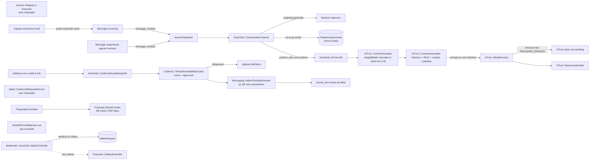
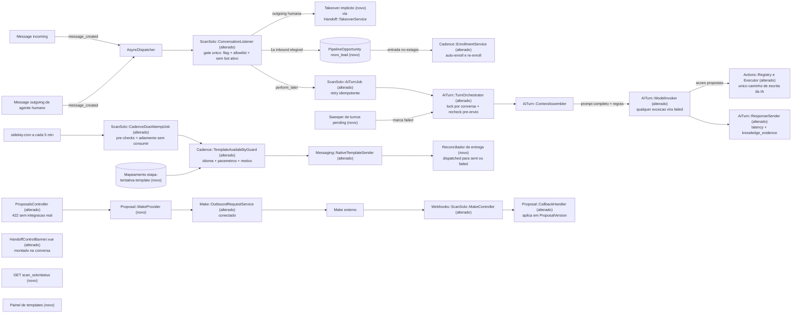

# SPEC: scansolo-production-complete

## Metadata
- Source: developer description via /plan (`.spec/inputs/scansolo-production-complete.md`); confirmed summary + ACs `.spec/features/scansolo-production-complete/.handoff/confirmed-acs.md` (source of truth)
- Service: ss-aiagentsystem (Chatwoot Community fork, ScanSolo extension layer `ScanSolo::`)
- Tier: complete
- Version: 1.2
- Architecture references: `AGENTS.md` (= project `CLAUDE.md`), `docs/agents/architecture.md`, `docs/agents/domain_rules.md`. Mandatory audit sources: `docs/scansolo-production-complete/{CURRENT_STATE,ARCHITECTURE_MAP,GAP_ANALYSIS,RISK_REGISTER,DECISIONS_REQUIRED}.md` (commit 4af19b0bb). Prior cycle (referenced, not re-specified): `.spec/features/scansolo-chatwoot-platform/{SPEC,PLAN,PHASES}.md`, `openapi.yaml`, `asyncapi.yaml`. Init chain: none.

### Architecture rules this SPEC binds to (cited)
- `docs/agents/architecture.md` — Layer responsibilities: controllers own only the `scansolo_enabled?` 404 gate, `Current.account` scoping, Pundit `authorize` and strong params, and **delegate every state change to services**; services are the "sole path" writers (stage, cadence, handoff, proposal callback); jobs never own eligibility logic (delegated to services); the listener owns enable-check, pipeline bookkeeping and job enqueue, never AI logic; Vue/Pinia renders **server-confirmed state only**.
- `docs/agents/domain_rules.md` — `ScanSolo::Pipeline::StageTransitionService` is the sole stage writer; `ScanSolo::Handoff::ReturnToAiService` is the sole path back to AI; `ScanSolo::Actions::Executor` enforces registration, JSON-schema params, idempotency key, `ConfirmationGate`, `AuditEvent agent_action.<id>`; `ScanSolo::AuditEvent` is readonly after create.
- `AGENTS.md` / `CLAUDE.md` — enforce eligibility/exclusivity **at the earliest shared entry point** (no duplicated downstream guards unless an independent path bypasses it); validate at the request boundary returning `422`; misconfiguration fails loudly; backend i18n `en.yml`, frontend `en.json` only; Vue Composition API `<script setup>`, Tailwind only, `components-next/`; ScanSolo must not depend on `enterprise/` (enforced by `spec/lib/scansolo_no_enterprise_dependency_spec.rb`).

## Context

The prior cycle (`scansolo-chatwoot-platform`, RF-01..RF-100) built the full ScanSolo layer structurally — 18 `scan_solo_*` tables, draft/publish agent, pgvector RAG, cadences via sidekiq-cron, 8-stage pipeline, handoff, proposals, Make callback, 6 dashboard modules, 73 Ruby + 11 FE specs. The audit (`CURRENT_STATE.md` §0) verified that it **does not work end-to-end in production**:

1. The LLM prompt carries only history; RAG/contact/pipeline/rules never reach the model (`app/services/scan_solo/ai_turn/turn_orchestrator.rb:154-157`, verified).
2. Nothing creates `ScanSolo::PipelineOpportunity`; pipeline, cadences, proposals stay inert (routes `index/show/update` only, `config/routes.rb:463`, verified).
3. Proposals default to `ScanSolo::Proposal::MockProvider` (R$ 1500, fake PDF); `ScanSolo::Make::OutboundRequestService` has no caller; the Make callback never reaches `ProposalVersion` (`app/controllers/webhooks/scan_solo/make_controller.rb:39-49`, verified).
4. `ScanSolo::Actions::Registry` is unreachable from the turn (`conversation_listener.rb:17`, `turn_orchestrator.rb:18` `SUPPORTED_ACTIONS = %w[stage_transition]`, verified).
5. Human replies do not pause AI; eligibility is not rechecked before send; bursts yield N replies (`conversation_listener.rb:12` returns unless `incoming?`, verified).
6. Turns can stay `pending` forever; Sidekiq retry collides with the unique `message_id` (`turn_orchestrator.rb:47-56`, verified).
7. No vertical scroll in any ScanSolo screen (`app/javascript/dashboard/routes/dashboard/Dashboard.vue:143` `overflow-hidden`, verified); 10 raw i18n keys from `field.toUpperCase()` (`AgentCenter.vue:157,169,181` vs `en/scansolo.json:76` `MODEL_PROVIDER`, verified).
8. `docker-compose.production.yaml:51` has `POSTGRES_PASSWORD=` empty (verified) and `docs/architecture/SCANSOLO_DEPLOYMENT.md:40-41` stacks the **dev** compose into the production command (verified).
9. `db/seeds/scansolo_cadence_definitions.rb` is never loaded by `db/seeds.rb` (verified: no `scansolo` reference).
10. Captain coexistence is unguarded (`enterprise/app/services/enterprise/message_templates/hook_execution_service.rb:13`, verified).

This increment **wires, fixes and hardens** existing code — it does not re-implement prior-cycle requirements. Where prior RIGID items are referenced they keep their meaning unless this SPEC explicitly supersedes them (see "Superseded prior requirements" below). External dependencies (Meta, Make, SMTP, LEXUS, credentials, product data) are modeled as explicit **HUMAN GATES** (HG-xx) that block only their own activation, never the implementation of the rest.

Decisions adopted from `DECISIONS_REQUIRED.md` (full log in "Clarifications log" below):
- **Aligned with the doc's recommended option**: D-06 (b) no immediate step 0 for inbound leads; D-07 create on first eligible inbound + auto-enroll per stage; D-10 explicit inbox allowlist on the agent config; D-15 publish/knowledge writes admin-only; D-17 ScanSolo never runs on an inbox with any active bot (covers Captain); D-18 technical IDs hidden from agents, visible to admins under "Detalhes técnicos"; D-20 production + overlay compose, `${POSTGRES_PASSWORD}`, `ARG GIT_SHA`; D-23 rate-limit thresholds as ENV-overridable operational defaults.
- **Deliberate deviations from the doc's recommended option (developer-approved)**:
  - D-09 — the doc recommends "human reply **or assignment** = takeover"; this SPEC adopts **only a manual non-private human reply** as takeover and excludes assignment, because native auto-assignment would otherwise pause the AI on every new conversation (RF-18). Opt-out = persisted contact marker set by the model action and by a deterministic keyword list (RF-16, RF-31, RF-63). Burst handling uses per-conversation serialization + supersede, not a debounce window (RF-11).
  - D-05 — the doc recommends "approval by admin or commercial manager; send by opportunity owner"; this SPEC adopts generate = any agent, approve = administrator only, send = administrator or opportunity owner (RF-48), since no "commercial manager" role exists in the account role model.
  - D-19 — the doc recommends (a) English `en` + versioned `pt_BR`; this SPEC keeps (b) pt-BR copy in `en/scansolo.json` as a fork decision, because `AGENTS.md`/`CLAUDE.md` restricts source-string changes to `en.json`/`en.yml` and the raw-key bug (UI-03) is independent of the locale strategy; a `pt_BR` split is out of scope.
  - D-21 — the doc recommends a single account flag "outbound habilitado"; this SPEC reuses the existing `Account#scansolo_enabled` as the single outbound kill switch (no new flag). Consequence: flag off also hides the ScanSolo UI/API (RF-51, `404` gate), so pre-cutover setup (config, knowledge, templates) is done with the flag **on** and relies on the empty inbox allowlist (RF-03, RF-26 (3)) to keep outbound at zero; the runbook SHALL state this (RF-56).
- **Interim default (the doc has no recommended option)**: D-22 — `service_hours`/`response_limits` are applied as model instructions and the AI keeps answering 24/7; format and out-of-hours behavior remain open for Produto and may replace this default in a later increment.

Superseded prior requirements (ACs win over prior cycle):
- Prior RNF-05 ("rate limiting on the Make callback only") → superseded by RF-49/RNF-06 (AC10).
- Prior RNF-06 ("permanent unique constraint on Make callback correlation id") → narrowed: permanence applies to **applied** callbacks only (RF-39, AC7).
- Prior CT-06 idempotency key `(opportunity_id, cadence_definition_version)` → uniqueness applies only to active/paused enrollments (RF-30, AC5 re-enroll).
- Prior RF-56 takeover "pause or cancel" → fixed to **pause + recalculate on return** (RF-19, RF-29).

### Clarifications log
| ID | Date | Ref | Decision (developer) | SPEC changes |
|---|---|---|---|---|
| Q-01 | 2026-09-23 | RF-23 | A — the creating (first eligible) inbound keeps the opportunity in `novo_lead`; the next inbound moves it to `em_contato`; the Novo Lead cadence covers leads silent after the first AI reply. | RF-23 marker removed, AC finalized; summary row updated. |
| Q-02 | 2026-09-23 | RF-16, RF-31 | B — opt-out set by the model `cadence_signal opt_out` action AND by a deterministic, administrator-configurable keyword list on inbound (e.g. PARAR/SAIR/STOP); only an administrator clears the marker, with an audit event; no auto-reset. | RF-16, RF-31 rewritten; RF-63 added; RF-48, RF-50, CT-01 (`opt_out_keywords`), CT-11 (new) updated. |
| Q-03 | 2026-09-23 | RF-48, UI-13, D-05 | A — generate: any agent; approve: administrator only; send: administrator or opportunity owner. | RF-48 policy rules + 403 request-spec AC; CT-04 authorization; UI-13 role-based buttons. |
| Q-04 | 2026-09-23 | RF-18, D-09 | A — only a manual non-private human reply triggers takeover; assignment (manual or auto) never does. Recorded as a deliberate deviation from D-09's recommended option. | Context decisions rewritten; RF-18 wording + AC (auto-assignment case). |
| N-01 | 2026-09-23 | D-22 | Interim default (no recommendation in the doc), not "recommended". | Context. |
| N-02 | 2026-09-23 | D-19, D-21 | Recorded as deliberate deviations with rationale; D-21 runbook note on empty allowlist for pre-cutover setup. | Context; RF-56 text + AC. |
| N-03 | 2026-09-23 | RF-11 | Burst AC uses a slow-stubbed model call (no debounce) for determinism. | RF-11 AC; summary row. |
| R2-01 | 2026-09-23 | RF-16 | Keyword match = whole message equals entry after normalization (trim, case-insensitive, strip accents, strip punctuation); `Parar!` matches, `não vou parar agora` does not (intent phrases left to the model). | RF-16 text + AC examples; summary row. |
| R2-02 | 2026-09-23 | UI-14, UI-15 | Minimal opt-out UI, P1 (after P0): keyword list field in Agent Center + admin-only "remover opt-out" action in the contact panel using CT-11; copy in `en.json`. | UI-14, UI-15 added; CT-01/CT-11 realize them; phasing hint; summary rows. |
| R2-03 | 2026-09-23 | CT-01, CT-11, D-05, UI-13 | Clarifier assumptions **confirmed** by the developer: (1) `opt_out_keywords` stored on the agent config (CT-01); (2) CT-11 `DELETE /contacts/{contact_id}/opt_out`, admin-only; (3) D-05 rationale verified — OSS `AccountUser` roles are only `agent`/`administrator`; (4) UI-13 retry/reprocess visible to administrators only. | No text change (already in v1.1); recorded as confirmed. |

## AS IS — Estado atual

Recorte atual do fluxo inbound → turno de IA → envio, cadências, propostas/Make e handoff, restrito às peças que este incremento toca. Os componentes existem, mas o contexto não chega ao modelo, a camada de ações, o `OutboundRequestService` e o banner não têm chamador, e nada cria a oportunidade (evidências em `CURRENT_STATE.md` §0).

## TO BE — Estado proposto

Estado proposto do mesmo recorte: o listener passa a ser o gate único de elegibilidade e cria a oportunidade (RF-01..RF-04, RF-21..RF-23), a resposta humana manual (não a atribuição) gera takeover implícito (RF-18..RF-20), o opt-out vem da ação do modelo ou de palavra-chave determinística e só um admin o limpa (RF-16, RF-31, RF-63), o orquestrador envia o contexto completo, executa ações só via Registry e recheca a elegibilidade sob lock (RF-05..RF-17), e o sweeper elimina turnos presos (RF-08). Cadências ganham pré-checagens, adiamento sem consumo, mapeamento de templates e evidência real de entrega (RF-24..RF-35, UI-12, CT-03); propostas bloqueiam o mock e conectam Make→`CallbackHandler` (RF-36..RF-42, CT-04..CT-06); o banner é montado (UI-01) e o status operacional é exposto (RF-60, CT-07).

## Scope
- **In**:
  - AI runtime fixes: full prompt context + five dormant config fields, terminal turn states, idempotent retry, pre-send recheck, burst serialization, single reply (AC1).
  - Pipeline auto-creation + per-stage auto-enroll (AC2).
  - Wiring the AI turn to the existing `Actions::Registry/Executor` (AC3).
  - Complete handoff: implicit takeover on human reply, return-to-AI recalculation, banner mount (AC4).
  - Cadence production loading, pre-send checks, non-consuming deferral, re-enroll, opt-out, delivery evidence (AC5).
  - Template mapping/availability via native WhatsApp Cloud API only (AC6).
  - Mock proposal lockout in production; Make wiring, callback application, retry/dead letter/reprocess (AC7).
  - Agent Center + cross-module UX fixes (AC8).
  - Knowledge reindex/status/evidence; PDF/crawler optional after P0 with SSRF (AC9).
  - Policies, audit, rate limits, FE guard, log redaction, inbox allowlist, Captain exclusivity (AC10).
  - Production compose/Dockerfile/runbook/smoke/rollback (AC11).
  - Minimum observability + controlled go-live test script with the 12 criteria (AC12).
- **Out**:
  - LEXUS import tool and LEXUS cutover execution (D-14; HG-05). Single-owner cutover is covered only by the kill switch RF-04 and the existing `docs/runbooks/PRODUCTION_CUTOVER.md` process.
  - Handoff `pause`/`close`/`reopen` endpoints and native assignee changes on takeover.
  - Pipeline transition matrix for human moves (D-08), except the AI-initiated restriction in RF-14.
  - New `pt_BR/scansolo.json` locale file (D-19).
  - Filters/search/pagination, Playwright E2E, HNSW index, image digest pinning beyond RF-54, Super Admin toggle for `scansolo_enabled` (GAP P2 list).
  - Any change to Nginx, TLS, certificates or domain; any production deploy/provider activation performed autonomously (prior RF-94/RF-100 remain in force).
  - Evolution or any parallel WhatsApp client.

## RIGID (Non-Negotiable)

Priority tags: **[P0]** = go-live blocker; **[P1]** = required for complete operation, after P0; **[P2]** = optional in this increment. Every RF/UI/RNF below cites the confirmed AC it realizes.

### Functional Requirements

#### A. Eligibility, kill switch and exclusivity (AC10, AC1)

- RF-01 [P0][Event-driven] (AC10): WHEN a native incoming message is persisted, THE SYSTEM SHALL classify it as ScanSolo-eligible only if (a) `Account#scansolo_enabled?` is true, (b) the message's inbox is in the published agent config's allowed-inbox list (RF-03), and (c) the inbox has no active bot as reported by the native OSS inbox bot-status check (which the Enterprise overlay extends to include an active Captain assistant); the classification SHALL be made once, at the ScanSolo listener entry point, before any opportunity creation, AI turn enqueue or cadence enrollment.
  - AC: for each of the 3 failing conditions a fixture incoming message produces 0 `PipelineOpportunity` rows, 0 `AiTurn` rows and 0 `AiTurnJob` enqueues; with all 3 satisfied, 1 enqueue.
- RF-02 [P0][Unwanted] (AC10 Captain exclusivity): IF an inbox has an active bot (Captain assistant, AgentBot or Dialogflow) at listener time or at pre-send recheck (RF-10), THEN THE SYSTEM SHALL NOT persist any ScanSolo AI outgoing message for that conversation, and SHALL record the turn (if created) as `suppressed` with reason `inbox_has_active_bot`.
  - AC: a spec with an inbox whose bot-status check returns true yields 0 ScanSolo outgoing messages; `spec/lib/scansolo_no_enterprise_dependency_spec.rb` stays green (no `Captain::` reference under `app/**/scan_solo/**`).
- RF-03 [P0][State-driven] (AC10 inbox allowlist): THE SYSTEM SHALL store an allowed-inbox list (inbox ids of the same account) on the agent config draft, copy it on publish, and treat an empty list as "AI answers in no inbox" (fail closed).
  - AC: draft update with an inbox id of another account → `422`; published config with `[]` → 0 AI turns on any inbox; with `[whatsapp_inbox_id]` → turns only for that inbox.
- RF-04 [P0][State-driven] (AC5, AC7, AC10; D-21 kill switch): WHILE `Account#scansolo_enabled?` is false, THE SYSTEM SHALL send zero ScanSolo outbound messages of any kind (AI reply, cadence attempt, proposal send) and SHALL leave scheduled cadence attempts `scheduled` (not consumed).
  - AC: flipping the flag off → an in-flight turn is suppressed at pre-send recheck; the next `CadenceDueAttemptJob` run (≤ 5 min cron, `config/schedule.yml:81` verified) sends 0 attempts and changes 0 attempt results; proposal endpoints return `404` (existing `BaseController` gate).

#### B. AI turn runtime (AC1)

- RF-05 [P0][Event-driven] (AC1): WHEN a turn invokes the model, THE SYSTEM SHALL send, in the payload delivered to the provider, all of: the conversation history already assembled by `ContextAssembler` (last 20 chat messages); the retrieved knowledge chunks with their source titles; contact context; opportunity context (stage, collected and missing required qualification fields); durable memory when present; and the agent rules `role, objective, persona, tone, instructions, service_rules, service_hours, response_limits, transfer_criteria, restricted_information, qualification_playbook, required_qualification_fields`.
  - AC: a spec capturing the provider payload with a fixture that has one value per item asserts every one of the 12 rule fields and each of the 5 context blocks appears in it; the pre-existing prompt redaction still applies to the whole payload.
- RF-06 [P0][Unwanted] (AC1 `restricted_information`): IF the model output contains, case-insensitively, any entry of the published config's `restricted_information`, THEN THE SYSTEM SHALL NOT send it and SHALL mark the turn `failed` with reason `output validation blocked: restricted_information`.
  - AC: fixture model output containing a configured restricted entry → turn `failed`, 0 outgoing messages.
- RF-07 [P0][Event-driven] (AC1 exceptions): WHEN any exception is raised after the turn row is created (context, retrieval, guardrail, model, validation, actions, send), THE SYSTEM SHALL set the turn to `failed` with `failure_reason` = exception class + redacted message, and SHALL report the exception to `ChatwootExceptionTracker` (verified at `lib/chatwoot_exception_tracker.rb:7`) tagged with the turn correlation id.
  - AC: specs raising a non-provider `StandardError` in each of the 7 stages leave the turn `failed` (never `pending`) and the tracker invoked once; an attachment-only incoming message (no text) ends in a terminal state.
- RF-08 [P0][Unwanted] (AC1 no permanent `pending`): IF a turn remains `pending` for longer than the stale-turn threshold (RNF-02), THEN THE SYSTEM SHALL mark it `failed` with reason `stale_pending` and SHALL NOT send any message for it afterwards.
  - AC: a `pending` turn created 11 minutes ago is `failed/stale_pending` after the sweeper run; a later job execution for its message sends 0 messages.
- RF-09 [P0][Event-driven] (AC1 idempotent retry): WHEN the AI turn job executes again for a message that already has a turn, THE SYSTEM SHALL no-op if the turn is terminal (`succeeded`, `suppressed`, `failed`), and SHALL resume processing on the same turn row and same correlation id if the turn is `pending` without a response message; in no case SHALL more than one AI outgoing message reference the same triggering message.
  - AC: job run twice on the same message (second run after a simulated crash before send) → exactly 1 `AiTurn` row, 1 correlation id, ≤ 1 outgoing message.
- RF-10 [P0][Event-driven] (AC1 pre-send recheck, AC4 no simultaneous reply): WHEN a turn is about to persist its outgoing message, THE SYSTEM SHALL, inside the send transaction and under a per-conversation exclusive lock, re-evaluate: RF-01 eligibility, `ai_control_state == ai_active`, published config present and enabled, no non-private human outgoing message created after the triggering message, and the triggering message is still the latest incoming message of the conversation; any failed check SHALL mark the turn `suppressed` with a specific reason and SHALL roll back the turn's action side effects.
  - AC: 5 specs, one per check flipped between model invocation and send, each yield 0 outgoing messages, 0 action side effects and the documented reason (`not_eligible`, `human_controlled`, `config_unavailable`, `human_replied`, `superseded`).
- RF-11 [P0][State-driven] (AC1 burst protection, "uma resposta por fluxo"): WHILE a turn of a conversation is invoking the model or sending, THE SYSTEM SHALL NOT let another turn of the same conversation reach model invocation or send concurrently; a turn superseded by a newer incoming message (RF-10) is suppressed with reason `superseded`, and the surviving turn's history includes every message of the burst.
  - AC: with the model call stubbed slow (no debounce window exists; the first turn is still invoking the model when messages 2 and 3 arrive), 3 incoming messages enqueued within 2 seconds on the same conversation → exactly 1 AI outgoing message, 2 turns `suppressed/superseded`, and the provider payload of the surviving turn contains all 3 message texts.

#### C. Agent actions (AC3)

- RF-12 [P0][Event-driven] (AC3): WHEN the model's result requests actions, THE SYSTEM SHALL execute each one exclusively through `ScanSolo::Actions::Registry.call` (verified at `app/services/scan_solo/actions/registry.rb:29`), with `correlation_id` = turn correlation id and a deterministic idempotency key derived from the turn correlation id and the action's position, inside the same transaction as the turn's outgoing message; the action ids offered to the model SHALL be limited to `qualification_field`, `stage_transition`, `private_note`, `cadence_signal`, `human_handoff`, plus `proposal_generate` only while RF-37 reports the proposal integration as configured.
  - AC: a fixture model result with one action of each offered id creates one `AgentActionExecution` per action with the turn's correlation id; a re-run of the same turn creates 0 new executions; `proposal_approve`/`proposal_send` are never offered (existing `InputGuardrail#allowed_actions`).
- RF-13 [P0][Unwanted] (AC3 no bypass): THE SYSTEM SHALL NOT write any AI-originated state change (contact qualification fields, stage, private note, cadence state, handoff state, proposal) through a path other than RF-12; an unregistered, disabled or schema-invalid requested action SHALL cause the turn to be `failed` with the executor's error class as reason and 0 outgoing messages (prior RF-44 all-or-nothing preserved).
  - AC: the orchestrator's direct `StageTransitionService` call (`turn_orchestrator.rb` `execute_stage_transition`) no longer exists; a spec with an unregistered action id → turn `failed`, 0 messages, 0 side effects.
- RF-14 [P0][Unwanted] (AC3 + `domain_rules.md` stage rules): IF an AI-requested `stage_transition` targets anything other than a forward move to `em_qualificacao` or `qualificado`, THEN THE SYSTEM SHALL reject it (no stage change) — the AI SHALL NOT move to `negociacao`, `ganho`, `perdido`, `proposta_enviada` or backwards.
  - AC: 5 fixtures (each forbidden target) leave the stage unchanged and record the rejection in `action_evidence`; `em_contato → em_qualificacao` succeeds with a `PipelineStageEvent`.
- RF-15 [P0][Event-driven] (AC3 + AC4): WHEN the AI executes `human_handoff`, THE SYSTEM SHALL set the conversation to `awaiting_human`, create the existing 9-line handoff private note (`Handoff::HandoffService`), pause the opportunity's active cadence enrollments, and allow that turn's own reply to be sent; subsequent incoming messages SHALL produce 0 AI replies until return-to-AI.
  - AC: after the handoff turn, 1 private note exists, state = `awaiting_human`, enrollments `paused`, and a new incoming message yields 0 AI outgoing messages.
- RF-16 [P0][Event-driven] (AC3 + AC5 opt-out; D-09, Q-02): WHEN either (a) the AI executes `cadence_signal` with `opt_out`, or (b) an RF-01-eligible incoming message matches an entry of the administrator-configurable opt-out keyword list (default entries `PARAR`, `SAIR`, `STOP`) — a match means the **whole message text equals the entry after normalizing both** (trim surrounding whitespace, case-insensitive, strip accents, strip punctuation); phrases that merely contain a keyword are NOT matched and are left to the model's intent detection via (a) — THE SYSTEM SHALL persist an opt-out marker on the contact and cancel every active/paused enrollment of the contact's opportunities (existing `StopRecalculatePolicy` `opt_out`); the keyword check SHALL be deterministic (no model call) and SHALL run even if the AI turn fails or is suppressed. The marker SHALL never be cleared automatically — only by RF-63.
  - AC: (a) after the model action, contact opt-out marker = true and 0 enrollments remain `active`/`paused`; (b) incoming message `PARAR` with the model stubbed to request no action → marker = true, 0 `active`/`paused` enrollments; (b) matching examples with default keywords: `Parar!`, `  sair `, `stop.`, `PÁRAR` → marker = true; non-matching: `não vou parar agora`, `parar de receber?` with the model stubbed to request no action → marker unchanged; (b) with the AI turn forced to `failed` → marker still set; a later non-keyword incoming message leaves the marker true.
- RF-17 [P1][Event-driven] (AC3 `qualification_field`): WHEN a `qualification_field` action records the last missing required field, THE SYSTEM SHALL evaluate the existing reply-completeness rule (RF-28) after the action is applied.
  - AC: completing the last required field via action cancels all remaining scheduled attempts of the opportunity.

#### D. Human handoff (AC4)

- RF-18 [P0][Event-driven] (AC4 "resposta humana = takeover"; deliberate deviation from D-09's recommended option, Q-04): WHEN a non-private outgoing message whose sender is a `User` is created in a conversation of a ScanSolo-enabled account whose `ai_control_state` is not `human_active`, THE SYSTEM SHALL perform takeover through the existing `Handoff::TakeoverService` (state `human_active`, `AuditEvent handoff.takeover` with the user as actor and `trigger: human_reply`); outgoing messages created by ScanSolo itself (AI reply, cadence attempt, proposal send — even when an actor user is attached), private notes, and assignment changes (manual or native auto-assignment) SHALL NOT trigger takeover — only a manual non-private human reply does.
  - AC: agent reply → state `human_active` + 1 audit event; private note, manual conversation assignment, native auto-assignment, cadence message and proposal-send message each → state unchanged and 0 `handoff.takeover` audit events.
- RF-19 [P0][Event-driven] (AC4, AC5 "takeover suspende"): WHEN takeover occurs (explicit via `POST .../handoff` or implicit via RF-18), THE SYSTEM SHALL pause (not cancel) every active enrollment of the conversation's opportunity, and any in-flight AI turn SHALL be suppressed by RF-10.
  - AC: takeover during a stubbed slow model call → 0 AI outgoing messages after the human message; enrollments `paused`, attempts still `scheduled`.
- RF-20 [P0][Event-driven] (AC4 "devolver reativa e recalcula"): WHEN return-to-AI succeeds (existing `ReturnToAiService`), THE SYSTEM SHALL set `ai_active`, and recalculate cadence per RF-29; the next eligible incoming message SHALL produce an AI turn.
  - AC: takeover → return → new incoming message → exactly 1 AI reply; cadence state matches RF-29.
- RF-21 [P1][Event-driven] (AC4 note content): WHEN the handoff note is generated and the opportunity has a proposal, THE SYSTEM SHALL fill "Status da proposta" with the current version's status instead of the fixed `não aplicável` (`handoff_service.rb:119-124`).
  - AC: opportunity with a `generated` version → note line shows the pt-BR label of `generated`.

#### E. Pipeline (AC2)

- RF-22 [P0][Event-driven] (AC2; D-07): WHEN an RF-01-eligible incoming message arrives on a conversation that has no `PipelineOpportunity`, THE SYSTEM SHALL create exactly one opportunity (account, conversation, conversation contact, stage `novo_lead`, `last_customer_interaction_at` = message time, owner = conversation assignee or none) and record `AuditEvent pipeline.opportunity_created` with the message's correlation context.
  - AC: first eligible incoming → 1 opportunity `novo_lead`; 2 concurrent jobs for the same conversation → still 1 row (existing unique index `index_scan_solo_pipeline_opportunities_on_conversation_id`, verified in `db/schema.rb:1634`); non-eligible incoming → 0 rows.
- RF-23 [P0][Event-driven] (AC2 stage progression): WHEN the opportunity is created by RF-22, THE SYSTEM SHALL keep it in `novo_lead` for that creating message; the existing first-inbound rule (`Pipeline::InboundMessageTransitionRule`, prior RF-14) SHALL apply from the next incoming message, moving the opportunity to `em_contato`. Rationale (Q-01, option A): the Novo Lead cadence (+2h/+24h/+48h/+96h) covers leads that go silent after the AI's first reply; this is the "estágio correto" for go-live criterion 6.
  - AC: creating message → stage `novo_lead` + Novo Lead enrollment; second incoming → `em_contato` + Novo Lead enrollment cancelled + Em Contato enrollment active.
- RF-24 [P0][Event-driven] (AC2 auto-enroll): WHEN an opportunity enters `novo_lead` (creation), `em_contato`, `em_qualificacao` or `proposta_enviada`, THE SYSTEM SHALL enroll it in `CadenceDefinition.current_for(stage)` unless the contact is opted out (RF-31); IF no active definition exists for that stage, THEN THE SYSTEM SHALL report the misconfiguration to `ChatwootExceptionTracker` and record `AuditEvent cadence.definition_missing` instead of skipping silently (replaces the silent return at `success_handler.rb:36-37`).
  - AC: each of the 4 stage entries creates 1 active enrollment for the stage's current definition; with the definitions table empty, the tracker is invoked and 1 audit event is recorded.

#### F. Cadences (AC5)

- RF-25 [P0][Ubiquitous] (AC5 loaded in prod): THE SYSTEM SHALL provide an idempotent, deploy-time load of the ScanSolo cadence definitions with exactly: `novo_lead` offsets `[2, 24, 48, 96]`, `em_contato` `[24, 48, 72, 96, 120]`, `em_qualificacao` `[24, 48, 72, 96, 120, 144, 168]`, `proposta_enviada` `[24, 72, 168]` (verified at `db/seeds/scansolo_cadence_definitions.rb:6-15`); sending stays restricted to 09:00–20:00 `America/Sao_Paulo`, 7 days a week (existing `Cadence::SendingWindow`, verified at `app/services/scan_solo/cadence/sending_window.rb:6-8`).
  - AC: running the load twice on an empty DB yields exactly 4 active definition rows with those offsets; the smoke check (RF-58) fails when any of the 4 stages lacks an active definition.
- RF-26 [P0][Event-driven] (AC5 pre-send checks): WHEN a cadence attempt is due, THE SYSTEM SHALL, under the existing row lock and before any send, evaluate in order: (1) contact opted out → cancel the enrollment (reason `opt_out`); (2) conversation status `resolved` → cancel the enrollment (reason `conversation_resolved`); (3) `scansolo_enabled` false, published config absent/disabled, inbox not RF-01-eligible, or `ai_control_state` ≠ `ai_active` → keep the attempt `scheduled` and record the block reason and check time without consuming the attempt; (4) template unavailable (RF-33) → same non-consuming deferral.
  - AC: one spec per condition asserting the attempt result and recorded reason; for (3) and (4) the attempt remains `scheduled`, `current_step` unchanged, 0 messages.
- RF-27 [P0][Event-driven] (AC5 evidence before "sent"): WHEN a cadence attempt's native message is created, THE SYSTEM SHALL mark the attempt `dispatched` (not `sent`) with the message id; THE SYSTEM SHALL mark it `sent` only when the native message acquires a provider `source_id` without `failed` status, and `failed` (storing the native `external_error`) when the native message status becomes `failed`; for non-WhatsApp test inboxes, a persisted non-failed message counts as provider acceptance.
  - AC: WhatsApp fixture → `dispatched` after the job; native status update with `source_id` → `sent` + `sent_at`; native `failed` → attempt `failed` with the external error; a re-run of the job never re-sends a `dispatched` attempt.
- RF-28 [P0][Event-driven] (AC5 "resposta do lead cancela/recalcula"): WHEN an incoming message arrives on an opportunity with active enrollments, THE SYSTEM SHALL, after that message's AI turn actions are applied (or immediately if no turn runs), invoke the existing `Cadence::ReplyCompletenessDetector` with its prior-cycle semantics (prior RF-65): all required fields present → cancel all scheduled attempts; otherwise cancel only the next scheduled attempt of each active enrollment.
  - AC: full-reply fixture → 0 `scheduled` attempts remain; partial-reply fixture → exactly the next attempt `cancelled`, later ones unchanged.
- RF-29 [P0][Event-driven] (AC4/AC5 return recalculation, re-enroll): WHEN return-to-AI succeeds, THE SYSTEM SHALL resume the paused enrollment for the opportunity's current stage shifting its remaining scheduled attempts by the paused duration (existing `LifecycleService.resume!`); IF no active/paused enrollment exists for the current stage's definition, THEN THE SYSTEM SHALL create a new enrollment (RF-30) unless the contact is opted out; after any deferral (RF-26 (3)/(4)) that sends an attempt later than its `scheduled_at`, the remaining scheduled attempts of that enrollment SHALL be shifted by the same delay, and at most one attempt per enrollment SHALL be sent per job run.
  - AC: 30 h takeover then return → next attempt `scheduled_at` = original + 30 h; a step-1 attempt deferred 26 h then sent → step-2 moves 26 h later and is not sent in the same run.
- RF-30 [P0][State-driven] (AC5 re-enroll): THE SYSTEM SHALL allow a new enrollment for the same (opportunity, cadence definition) pair when every previous enrollment for that pair is `cancelled` or `completed`, while keeping at most one `active`/`paused` enrollment per pair.
  - AC: cancel then enroll again → 2 rows (1 `cancelled`, 1 `active`); enrolling twice while one is `active` → 1 row (existing idempotency preserved).
- RF-31 [P0][State-driven] (AC5 opt-out): WHILE a contact carries the opt-out marker (set by RF-16 (a) model action or (b) keyword match), THE SYSTEM SHALL create no enrollment and send no cadence attempt for any of its opportunities; the AI SHALL still reply to incoming messages the contact initiates; the marker persists until an administrator clears it (RF-63), with no automatic reset.
  - AC: opted-out contact entering `em_contato` → 0 enrollments; incoming message → 1 AI reply; after RF-63 clears the marker, the next stage entry creates 1 enrollment.

#### G. WhatsApp templates (AC6)

- RF-32 [P0][Ubiquitous] (AC6 per stage/step): THE SYSTEM SHALL resolve, for each (stage, step) of a cadence definition and for the proposal send, a template mapping holding template name, language code, and an ordered parameter list whose values come only from an allowlisted set of sources (contact name, contact first name, agent config name, opportunity stage label, static text); absent a mapping, the current convention `scansolo_cadence_<stage>_v<version>_step<n>` with language `pt_BR` and no parameters SHALL apply (verified at `app/models/scan_solo/cadence_definition.rb:50-52`, `app/services/scan_solo/messaging/native_template_sender.rb:52`).
  - AC: a mapped step sends native `template_params` with the mapped name, language and resolved `processed_params`; an unmapped step sends the convention name with `pt_BR`; a mapping referencing a non-allowlisted source → `422` on save.
- RF-33 [P0][Unwanted] (AC6 never send unavailable): IF the inbox is a `Channel::Whatsapp` and its synced `message_templates` do not contain the mapped name with the mapped language and status `APPROVED`, or the template's body placeholder count differs from the mapped parameter count, THEN THE SYSTEM SHALL NOT send (cadence attempt or proposal send) and SHALL record one reason among `template_missing`, `template_rejected`, `template_paused`, `template_pending`, `template_disabled`, `language_unavailable`, `params_mismatch`, together with the channel's `message_templates_last_updated` (verified column at `app/models/channel/whatsapp.rb:8`).
  - AC: 7 fixtures, one per reason, each yield 0 native messages and the matching recorded reason and last-sync timestamp; the proposal-send path is covered by the same guard.
- RF-34 [P0][Unwanted] (AC6 native only): THE SYSTEM SHALL NOT send WhatsApp messages through any path other than native `conversation.messages.create!` + native `Whatsapp::SendOnWhatsappService`; no new HTTP client to Meta and no Evolution integration.
  - AC: grep for `graph.facebook.com` and `evolution` under `app/**/scan_solo/**` returns 0 matches.

#### H. Proposals and Make (AC7)

- RF-35 [P0][Unwanted] (AC7 mock lockout): THE SYSTEM SHALL NOT select `ScanSolo::Proposal::MockProvider` in the `production` Rails environment through any path (controller, AI action, retry, callback); mock provider use SHALL be limited to `test`/`development` and explicit test-mode injection.
  - AC: in a production-env spec, invoking generate/send/retry with no provider argument never calls `MockProvider`; a fake price `1500.0` / `mock-proposals.scansolo.test` URL is never persisted or sent.
- RF-36 [P0][State-driven] (AC7 blocked without credentials): WHILE any of the Rails credentials `scan_solo.make.scenario_url`, `scan_solo.make.secret`, `scan_solo.make.inbound_signing_secret` (verified names in `ARCHITECTURE_MAP.md` §7 / `outbound_request_service.rb:78-86`) is absent in production, THE SYSTEM SHALL reject proposal generate, send and retry with `422` and error code `proposal_integration_not_configured`, creating 0 `ProposalVersion` and 0 `MakeRequest` rows, and SHALL not offer `proposal_generate` to the AI (RF-12).
  - AC: request spec with credentials stubbed empty in production env → `422` + code; row counts unchanged.
- RF-37 [P1][Event-driven] (AC7 Make request; HG-03): WHERE the Make credentials are present, WHEN generate or send is requested, THE SYSTEM SHALL call the existing `Make::OutboundRequestService` with `correlation_id` equal to the `ProposalVersion`'s generate/send correlation id and an idempotency key, persisting the `MakeRequest` before the HTTP call; an HTTP timeout, network error or 5xx SHALL mark the version `failed` with reason `timeout`, `network_error` or `provider_unavailable` respectively.
  - AC: WebMock success → `MakeRequest` `pending` with the version's correlation id; each of the 3 error classes → version `failed` with the mapped reason.
- RF-38 [P1][Event-driven] (AC7 callback → ProposalVersion): WHEN a Make callback passes `CallbackVerifier` and matches a `MakeRequest`, THE SYSTEM SHALL apply it through the existing `Proposal::CallbackHandler` (`apply_generate_result!` / `apply_send_result!`), so that generate success sets value/currency/artifact_url on the version from the callback payload and send success triggers the native template send (RF-32/RF-33) and `SuccessHandler`; a second delivery with the same correlation id SHALL apply nothing new.
  - AC: signed generate callback → version `generated` with the callback's value; duplicate delivery → `200`, 0 changes; send callback → 1 native template message + stage `proposta_enviada`.
- RF-39 [P1][Unwanted] (AC7 rejected must not block valid): IF a callback is rejected (`malformed_json`, `schema_invalid`, `unmatched_request`), THEN THE SYSTEM SHALL record it with `applied: false` without preventing a later valid callback with the same correlation id from being applied; `invalid_signature` keeps returning `401` with nothing persisted (existing).
  - AC: schema-invalid callback (`422`) followed by a valid one with the same correlation id → second returns `200` and is applied.
- RF-40 [P1][Event-driven] (AC7 retry, dead letter, reprocess): WHEN an administrator requests retry of a `failed` version whose reason is in `timeout network_error provider_unavailable`, THE SYSTEM SHALL retry through the existing `Proposal::RetryPolicy` with a new correlation id and increment the operation's retry count; once the count reaches 3 (existing `DEAD_LETTER_RETRY_THRESHOLD`) the operation SHALL appear in the dead letter list and further retries SHALL require an explicit administrator reprocess confirmation; non-retryable reasons SHALL return `422` (`UnsafeRetryError`).
  - AC: 3 failed retries → item listed in executions dead letters; 4th plain retry → `422`; reprocess with confirmation → new `MakeRequest`.
- RF-41 [P1][Unwanted] (AC7 evidence): THE SYSTEM SHALL NOT mark a proposal version `sent` nor move the opportunity to `proposta_enviada` before the native proposal message meets the RF-27 acceptance rule.
  - AC: native message `failed` → version `failed` with the external error, stage unchanged.
- RF-42 [P1][Ubiquitous] (AC7 failure_reason): THE SYSTEM SHALL expose each version's `failure_reason` and correlation id through the proposals API.
  - AC: API response for a failed version contains both fields.

#### I. Knowledge / RAG (AC9)

- RF-43 [P0][Event-driven] (AC9 update reindexes): WHEN a knowledge source's `content` changes, THE SYSTEM SHALL reindex it (existing `IngestionService`) without a separate reindex call.
  - AC: PATCH changing `content` → chunks reflect the new text; PATCH changing only `enabled` → chunks unchanged.
- RF-44 [P0][State-driven] (AC9 indexing state): THE SYSTEM SHALL persist per source an indexing status (`pending`, `indexing`, `indexed`, `failed`), the last error message, `indexed_at` and chunk count, and expose them in the sources API.
  - AC: successful ingestion → `indexed`, `indexed_at` set, chunk count > 0; embedding outage → `failed` with the error text, previous chunks preserved.
- RF-45 [P0][Unwanted] (AC9 no silent 0 chunks): IF ingestion produces 0 chunks (empty content, attachment-only source without extractable text, or failure), THEN THE SYSTEM SHALL mark the source `failed` with a pt-BR reason and SHALL NOT report it as `indexed`.
  - AC: attachment-only source → `failed` + reason; no API response shows `indexed` with chunk count 0.
- RF-46 [P0][Event-driven] (AC9 `knowledge_evidence`): WHEN a turn includes retrieved chunks in the prompt, THE SYSTEM SHALL write `knowledge_evidence` on the turn as a list of `{source_id, source_title, chunk_id, similarity_score}` for exactly the chunks sent; on retrieval outage it SHALL write `[]` and keep the retrieval `failure_reason` in the context snapshot.
  - AC: turn with 3 retrieved chunks → 3 evidence entries matching the prompt chunks; outage → `[]` + reason.
- RF-47 [P2][Optional] (AC9 PDF/crawler after P0; HG-11): WHERE PDF extraction or URL/site crawling is implemented in this increment, THE SYSTEM SHALL implement it only after all P0 items, fetch remote content only through the existing `SafeFetch` + `ssrf_filter` stack (verified `lib/safe_fetch.rb`, `Gemfile:47`) restricted to an administrator-defined domain allowlist, and never through `enterprise/app/services/page_crawler_service.rb`.
  - AC: a crawl targeting `127.0.0.1`, `169.254.169.254` or a non-allowlisted domain fetches 0 bytes and marks the source `failed`.

#### J. Security and audit (AC10)

- RF-48 [P0][Unwanted] (AC10 policies; D-15): THE SYSTEM SHALL NOT allow a non-administrator to update the agent config draft, publish it, create/update/delete/reindex knowledge sources, run retrieval tests, edit template mappings (RF-32), edit the opt-out keyword list (RF-16), clear a contact's opt-out marker (RF-63) or retry/reprocess proposals; reads of config, sources, turns and executions stay available to account users. For proposals (D-05 deviation, Q-03): generate is allowed to any account user (administrator or agent); approve is allowed to administrators only; send is allowed to administrators and to the opportunity's owner only.
  - AC: request specs per endpoint → agent `403`, administrator `2xx`; `AiAgentConfigPolicy` and `KnowledgeSourcePolicy` no longer return `true` unconditionally; `ProposalPolicy` (today `true` for every action) → generate: agent `2xx`, administrator `2xx`; approve: agent `403` (including the opportunity owner), administrator `2xx`; send: non-owner agent `403`, owner agent `2xx`, administrator `2xx`.
- RF-49 [P1][Unwanted] (AC10 rate limiting): IF an account exceeds the per-account request thresholds of RNF-06 on knowledge create/update/reindex, retrieval tests or publish, THEN THE SYSTEM SHALL respond `429` via the existing `Rack::Attack` initializer; a retrieval-test `top_k` above 20 SHALL return `422`.
  - AC: request N+1 within the window → `429`; `top_k: 21` → `422`.
- RF-50 [P1][Event-driven] (AC10 admin audit): WHEN a config draft is updated or published, a knowledge source is created/updated/deleted/reindexed, a template mapping changes, an implicit takeover happens, the opt-out keyword list changes, a contact's opt-out marker is cleared (RF-63), or a proposal retry/reprocess is requested, THE SYSTEM SHALL write one `ScanSolo::AuditEvent` with actor, subject, action and correlation id and without secret values.
  - AC: one spec per event asserts exactly 1 audit row with those fields.
- RF-51 [P0][Unwanted] (AC10 feature guard FE/BE): THE SYSTEM SHALL NOT render any ScanSolo route for an account whose `scansolo_enabled` flag is false (frontend route guard redirects to the account dashboard); the backend `404` gate (`base_controller.rb:5-11`) is preserved.
  - AC: navigating to a ScanSolo URL with the flag off → redirect, 0 ScanSolo API calls.
- RF-63 [P0][Event-driven] (AC5 opt-out; D-09, Q-02): WHEN an administrator clears a contact's opt-out marker (CT-11), THE SYSTEM SHALL set the marker to false and record one `ScanSolo::AuditEvent contact.opt_out_cleared` with the administrator as actor and the contact as subject; the marker SHALL have no other reset path (no automatic reset, including by later incoming messages).
  - AC: admin clear → marker false + 1 audit event; agent → `403`, marker unchanged.

#### K. Deploy (AC11)

- RF-52 [P0][Ubiquitous] (AC11 compose): THE SYSTEM SHALL define production as `docker compose -f docker-compose.production.yaml -f docker-compose.scansolo.yaml` (never including `docker-compose.yaml`), with `POSTGRES_PASSWORD=${POSTGRES_PASSWORD}` in `docker-compose.production.yaml`, no port published on a non-loopback address, no `vite` or `mailhog` service, no bind mount of the source tree, and the `reverse-proxy` (Caddy) and `self-hosted-storage` profiles never activated by the documented commands; `docs/architecture/SCANSOLO_DEPLOYMENT.md` and the overlay header comment SHALL show only that command.
  - AC: a spec rendering `docker compose -f docker-compose.production.yaml -f docker-compose.scansolo.yaml config` asserts: postgres env contains `${POSTGRES_PASSWORD}` interpolation, every published port starts with `127.0.0.1:`, no service named `vite`/`mailhog`/`caddy`/`minio` without a profile, no volume source `./`; a grep of the deploy doc finds 0 occurrences of `-f docker-compose.yaml`.
- RF-53 [P0][Ubiquitous] (AC11 reproducible build + GIT_SHA): THE SYSTEM SHALL write `/app/.git_sha` from a required `GIT_SHA` build argument instead of `git rev-parse HEAD` (verified at `docker/Dockerfile:90`), failing the build when the argument is empty, so the image builds without a `.git` directory.
  - AC: `docker build` without `GIT_SHA` fails; with `GIT_SHA=abc123` the running app reports `abc123` through the existing `config/initializers/git_sha.rb`.
- RF-54 [P1][Ubiquitous] (AC11 reproducible build): THE SYSTEM SHALL pin the production compose images to explicit version tags (no `latest`, no untagged `redis:alpine`) and remove the obsolete `version:` key.
  - AC: rendered production config contains 0 image references ending in `:latest` or lacking a version tag.
- RF-55 [P0][Ubiquitous] (AC11 `.env.example`): THE SYSTEM SHALL list in `.env.example`, with empty values, every variable name the production compose and ScanSolo code read (at minimum `POSTGRES_PASSWORD`, `REDIS_PASSWORD`, `SCANSOLO_IMAGE_TAG`, `RATE_LIMIT_SCANSOLO_MAKE_CALLBACK` and the RNF-06 threshold names), and SHALL contain no secret value.
  - AC: a spec extracts `${VAR}` names from the production compose and asserts each appears in `.env.example` with an empty value.
- RF-56 [P0][Ubiquitous] (AC11 runbook): THE SYSTEM SHALL document in `docs/architecture/SCANSOLO_DEPLOYMENT.md` an ordered, copy-pasteable procedure: (1) diff VPS compose/.env names against Git, (2) `pg_dump` backup via the `backup` profile with file-size verification, (3) build with `GIT_SHA` and a new `SCANSOLO_IMAGE_TAG`, (4) run migrations, (5) load cadence definitions (RF-25), (6) restart Rails, (7) restart Sidekiq, (8) run the smoke check (RF-58), (9) rollback: previous image tag + restart + DB restore command; the procedure SHALL contain no step touching Nginx, TLS certificates or DNS. The document SHALL also state (D-21 deviation) that turning `scansolo_enabled` off hides the ScanSolo UI/API, so pre-cutover setup is done with the flag on and an **empty inbox allowlist** (RF-03, RF-26 (3)) to keep ScanSolo outbound at zero until the allowlist is filled at cutover.
  - AC: doc spec asserts the 9 steps in order, 0 occurrences of `nginx`, `certbot`, `--profile reverse-proxy` as commands, and the presence of the pre-cutover empty-allowlist note.
- RF-57 [P0][Ubiquitous] (AC1/AC11 key rotation, RR-O7): THE SYSTEM SHALL document that Rails and Sidekiq must be restarted after the OpenAI key (`CAPTAIN_OPEN_AI_API_KEY` InstallationConfig) is saved or rotated.
  - AC: runbook contains the restart step referencing the key change.
- RF-58 [P0][Event-driven] (AC11 smoke): WHEN the smoke check runs, THE SYSTEM SHALL verify and report pass/fail for: served GIT_SHA equals the built one; no pending migrations; 4 active cadence definitions (RF-25); OpenAI key configured (boolean only); published agent config enabled with a non-empty inbox allowlist; no allowlisted inbox with an active bot; `scan_solo_cadence_due_attempt_job` cron registered; proposal integration state (`configured` / `blocked`); and SHALL exit non-zero on any failure.
  - AC: a spec with each check forced to fail yields a non-zero exit and names the failing check.

#### L. Observability and go-live (AC12)

- RF-59 [P0][Event-driven] (AC12 AiTurn): WHEN a turn reaches a terminal state, THE SYSTEM SHALL have persisted status, provider, model, input/output tokens, `latency_ms` (model call duration), `failure_reason`, correlation id, `knowledge_evidence` and `action_evidence`, and the turns API SHALL expose them plus the native delivery status of the response message.
  - AC: succeeded fixture has non-null provider, model, tokens, `latency_ms`; the show endpoint returns the response message status (`sent/delivered/read/failed`).
- RF-60 [P0][Ubiquitous] (AC12 status): THE SYSTEM SHALL expose an administrator-only ScanSolo status endpoint (CT-07) summarizing the RF-58 checks plus the latest template sync time per allowlisted WhatsApp inbox, without any secret value.
  - AC: response contains only booleans/timestamps/counts for credentials; non-admin → `403`.
- RF-61 [P1][Ubiquitous] (AC12 executions): THE SYSTEM SHALL show in the Executions module: cadence attempts with result, block reason and delivery evidence; template availability per mapping; Make callbacks (applied/rejected with reason); dead letters; handoffs (explicit/implicit, actor, time); and the 100 most recent errors across failed turns, failed attempts and rejected callbacks.
  - AC: fixtures of each kind appear in the executions API with the listed fields.
- RF-62 [P0][Ubiquitous] (AC12 go-live test): THE SYSTEM SHALL provide a controlled production test script `docs/runbooks/SCANSOLO_GO_LIVE_TEST.md` (new) listing, for each of the 12 go-live criteria of the input (§14), the operator action, the evidence query/screen, and a binary pass condition: (1) real WhatsApp message arrives; (2) exactly one turn; (3) exactly one AI reply; (4) RAG used (`knowledge_evidence` non-empty); (5) opportunity created; (6) correct stage (RF-23); (7) coherent cadence enrollment; (8) human reply pauses AI; (9) return to AI works; (10) no mock proposal available (RF-35/RF-36); (11) logs/correlation id available (RNF-03); (12) no duplicate send.
  - AC: doc spec asserts 12 numbered criteria each with "Ação", "Evidência" and "Passa se" entries.

### Human Gates (external dependencies — block only their own activation)

| ID | Gate (owner) | Source | Blocks | Does NOT block |
|---|---|---|---|---|
| HG-01 | Meta credentials on the native WhatsApp inbox + App Secret on the channel (Admin Meta) | D-01, D-02, RR-S1 | Real WhatsApp traffic; go-live criteria 1–12 | All code/specs of RF-01..RF-62 |
| HG-02 | Final templates per stage/step + proposal send, approved in Meta, entered as mappings (Produto + Admin Meta) | D-03 | Real cadence sends | RF-26..RF-33 implementation (tested with fixtures) |
| HG-03 | Make scenario URL, auth, payload/price contract, signing secret in Rails credentials; master key on VPS (Dono do Make + Ops) | D-04, RR-S7 | Unlocking RF-36; real proposals | RF-35..RF-42 code (WebMock) |
| HG-04 | SMTP settings in VPS `.env` (Ops) | D-16 | User invites/password reset | Everything else |
| HG-05 | LEXUS source/mapping and cutover single-owner switch of the Meta webhook (Dono LEXUS + Ops) | D-14, D-21 | Cutover | Go-live on a number LEXUS does not operate; RF-04 kill switch is the code-side control |
| HG-06 | Inbox allowlist values and confirmation that Captain is inactive on those inboxes (Produto + Ops) | D-10, D-17 | Any AI reply (allowlist empty = fail closed) | Code of RF-01..RF-03 |
| HG-07 | Commercial users and administrator roles (Produto/Gestão) | D-15 | Who may publish/edit knowledge in prod | RF-48 implementation |
| HG-08 | VPS compose/.env diff against Git and `.env` values (Ops) | D-20, RR-D1 | Executing the deploy | RF-52..RF-58 in Git |
| HG-09 | OpenAI key present + Rails/Sidekiq restart (Ops) | RR-O7 | Real AI turns | Everything else |
| HG-10 | Execution and sign-off of the go-live test (Produto + Ops) | AC12 | Declaring production live | — |
| HG-11 | PDF/crawl scope and technology (Produto + Dev) | D-11, D-12, D-13 | RF-47 | All P0/P1 |

### UI Requirements

- UI-01 [P0][State-driven] (AC4): WHILE a conversation belongs to a ScanSolo-enabled account and an allowlisted inbox, THE SYSTEM SHALL mount the existing `HandoffControlBanner.vue` (verified at `app/javascript/dashboard/components-next/conversation/HandoffControlBanner.vue`) in the conversation view, showing the current AI-control state, a takeover action when state is `ai_active` and a return-to-AI action when state is `human_active` or `awaiting_human`, enabled only for users authorized by `HandoffPolicy`, and refreshing from the server after each action and after an implicit takeover.
  - AC: component spec with the real i18n file renders state label and the correct single action per state; after an agent reply the banner shows `human_active` without page reload.
- UI-02 [P0][Ubiquitous] (AC8 scroll): THE SYSTEM SHALL let every ScanSolo screen (Agent Center, Knowledge, Follow-ups, Proposals, Executions, Pipeline Kanban, opportunity detail, turn evidence) scroll vertically when content exceeds the viewport, with every action button reachable at 1366×768 and 375×667.
  - AC: component/layout spec asserts a scroll container (`overflow-y-auto` with bounded height) wraps each route; manual check at both viewports reaches the last form field and the save/publish buttons.
- UI-03 [P0][Unwanted] (AC8 raw keys, camelCase mapping): THE SYSTEM SHALL NOT render any raw i18n key in ScanSolo screens; camelCase field names SHALL map to the existing `SNAKE_CASE` keys (e.g. `modelProvider` → `MODEL_PROVIDER`).
  - AC: an i18n completeness spec loads the real `en/scansolo.json` (not `t: key => key`) and asserts every key referenced by ScanSolo components exists; 0 of the 10 broken keys listed in `GAP_ANALYSIS.md` Área 2 remain.
- UI-04 [P0][Ubiquitous] (AC8 sections + AC10 allowlist): THE SYSTEM SHALL organize the Agent Center form into sections Identidade, Modelo, Comportamento, Qualificação, Segurança, Handoff, Horário, Proposta and Canais, where Canais edits the inbox allowlist (RF-03) from the account's inboxes by name.
  - AC: component spec finds the 9 section headings and an inbox multi-select listing inbox names (no raw ids).
- UI-05 [P1][Event-driven] (AC8 feedback): WHEN save or publish is clicked, THE SYSTEM SHALL disable both buttons and show a loading indicator until the server responds, then show a success toast or an error toast with the server message; publish keeps its existing confirmation dialog.
  - AC: spec with a pending promise asserts disabled buttons; resolved → success toast via `useAlert`; rejected → error toast.
- UI-06 [P1][Event-driven] (AC8 unsaved changes): WHEN the user leaves the Agent Center route or closes the tab with unsaved draft changes, THE SYSTEM SHALL ask for confirmation.
  - AC: dirty form + route change → confirmation shown; clean form → no prompt.
- UI-07 [P1][Ubiquitous] (AC8 `require_proposal_approval`): THE SYSTEM SHALL expose `require_proposal_approval` as a toggle in the Proposta section.
  - AC: toggling and saving persists the value in the draft.
- UI-08 [P1][Ubiquitous] (AC8 model/provider): THE SYSTEM SHALL present provider and model as selects populated from the server list of `scansolo_agent_response` models in `config/llm.yml` (verified at `config/llm.yml:205-215` entries `gpt-4.1-mini`, `gpt-4.1`, `gpt-5.1`, `gpt-5.2`), and the server SHALL reject an unknown model with `422` instead of silently falling back.
  - AC: select lists the 4 models; PUT draft with `model_selection: "foo"` → `422`.
- UI-09 [P1][Ubiquitous] (AC8 loading/errors/toasts/confirmation): THE SYSTEM SHALL show loading, empty and error states on every ScanSolo list, toasts on every mutation result, and a confirmation dialog before deleting a knowledge source, cancelling a follow-up, sending a proposal and reprocessing a dead letter.
  - AC: spec per module asserts loading and error rendering; each of the 4 destructive actions requires confirmation before the API call.
- UI-10 [P1][Ubiquitous] (AC8 timestamps/labels/IDs; D-18): THE SYSTEM SHALL render timestamps with the native time helpers (relative text + absolute value on hover), enums as pt-BR labels, and SHALL hide technical identifiers (correlation ids, `sourceId`, `ownerId`, raw JSON) from non-administrators while showing them to administrators inside a collapsed "Detalhes técnicos" block.
  - AC: agent-role spec finds 0 correlation ids/ISO strings in Kanban, Knowledge, Executions and Turn Evidence; admin-role spec finds them inside the collapsed block.
- UI-11 [P1][State-driven] (AC8 knowledge state): WHILE a knowledge source is `pending`, `indexing` or `failed`, THE SYSTEM SHALL show its status badge, chunk count, `indexed_at` and last error in the Knowledge screen.
  - AC: fixture of each status renders the corresponding badge and, for `failed`, the error text.
- UI-12 [P1][Ubiquitous] (AC6 templates panel): THE SYSTEM SHALL provide a templates panel (Follow-ups module) listing, per stage and step and for the proposal send: mapped template name, language, parameters, availability, Meta status (`APPROVED`/`REJECTED`/`PAUSED`/…), blocking reason and last sync time, editable by administrators.
  - AC: fixture with one available and one `PAUSED` template renders both rows with correct availability and reason; agent role sees no edit control.
- UI-13 [P1][State-driven] (AC7; Q-03): WHILE the proposal integration is `blocked` (RF-36), THE SYSTEM SHALL disable generate/send/retry in the Proposals screen with a pt-BR explanation, and SHALL show `failure_reason` for failed versions; independently of integration state, THE SYSTEM SHALL render proposal action buttons by role per RF-48: generate for any user, approve only for administrators, send only for administrators and the opportunity owner, retry/reprocess only for administrators.
  - AC: blocked fixture → buttons disabled + explanation; failed version → reason visible; agent non-owner sees generate only (no approve/send/retry); agent owner sees generate + send (no approve/retry); administrator sees generate, approve, send and retry.
- UI-14 [P1][Ubiquitous] (AC5 opt-out, AC8; R2-02): THE SYSTEM SHALL provide in the Agent Center form an editable list field for the opt-out keywords (CT-01 `opt_out_keywords`), saved with the draft and applied on publish, editable only by administrators (RF-48), with labels/help text from `en.json` (no raw keys, UI-03).
  - AC: component spec renders the default entries `PARAR`, `SAIR`, `STOP`; adding an entry and saving sends it in the draft payload; agent role sees the field read-only (no edit control).
- UI-15 [P1][Event-driven] (AC5 opt-out; RF-63, R2-02): WHEN an administrator views the contact panel of a conversation in a ScanSolo-enabled account and the contact carries the opt-out marker, THE SYSTEM SHALL show the opt-out state and a "remover opt-out" action that, after a confirmation dialog, calls CT-11 and refreshes the state from the server with a success/error toast; non-administrators see the state but no action.
  - AC: admin + opted-out contact → action visible; confirm → 1 CT-11 call, state shows not opted out after the response; agent role → state visible, 0 action controls; non-opted-out contact → no action; copy resolved from the real `en.json`.

### Contracts

Base path `/api/v1/accounts/{account_id}/scan_solo` (verified `config/routes.rb:462`). Existing contracts from the prior cycle's `openapi.yaml`/`asyncapi.yaml` remain valid except where changed below.

- CT-01 (changed) `GET /ai_agent_config`, `PUT /ai_agent_config/draft`, `POST /ai_agent_config/publish` (verified `config/routes.rb:482-487`): payload adds `allowed_inbox_ids: integer[]` (same-account inboxes; else `422`), `require_proposal_approval: boolean` editable, `opt_out_keywords: string[]` (RF-16 (b); default `["PARAR", "SAIR", "STOP"]`); `GET` adds read-only `available_models: string[]` (from `scansolo_agent_response`); unknown `model_selection` → `422`; draft/publish by non-admin → `403`; publish over threshold → `429`. Realizes RF-03, RF-16, RF-48, RF-49, UI-04, UI-07, UI-08, UI-14.
- CT-02 (changed) `knowledge/sources` index/create/update/destroy/reindex and `knowledge/retrieval_tests` (verified `config/routes.rb:489-496`): source representation adds `index_status` (`pending|indexing|indexed|failed`), `index_error: string|null`, `indexed_at: datetime|null`, `chunk_count: integer`; writes and retrieval tests by non-admin → `403`; `top_k > 20` → `422`; throttled → `429`. Realizes RF-43..RF-45, RF-48, RF-49.
- CT-03 (new) `GET /cadence_templates` → list of `{stage, step|null (null = proposal send), template_name, language, params: [{source, value?}], availability: available|blocked, block_reason|null, meta_status|null, last_synced_at|null}`; `PUT /cadence_templates` (admin) with `{stage, step, template_name, language, params}` → `200` with the updated row, non-allowlisted param source → `422`, non-admin → `403`. Realizes RF-32, RF-33, UI-12.
- CT-04 (changed + new) `POST /pipeline_opportunities/{id}/proposals/generate`, `POST /proposals/{id}/send` (verified `config/routes.rb:469-479`) and new `POST /proposals/{id}/retry` (admin; body `{confirm_reprocess: boolean}` required `true` for dead-lettered operations): while blocked → `422 {error: "proposal_integration_not_configured"}`; unsafe retry → `422`; authorization (RF-48): `generate` any account user, `POST /proposals/{id}/approve` administrator only, `send` administrator or opportunity owner, `retry` administrator only — otherwise `403`; proposal representation adds `failure_reason`, `correlation_id`, `integration_state: configured|blocked`. Realizes RF-35, RF-36, RF-40, RF-42, RF-48, UI-13.
- CT-05 (changed, asyncapi `sendMakeIntegrationRequest`) Outbound Make request: `POST <scenario_url>` with `Authorization: Bearer`, `X-Idempotency-Key`, body `{correlation_id, action: generate|send, account_id, opportunity_id, proposal_version_id, qualification: {<required_qualification_fields>}}`; final field mapping and price variables are HG-03. Realizes RF-37.
- CT-06 (changed, asyncapi `receiveMakeIntegrationCallback`) `POST /webhooks/scan_solo/make` (verified `config/routes.rb:737`): `401` invalid signature (nothing persisted); `422` other rejections recorded with `applied: false` without reserving the correlation id; `200` applied once per correlation id, duplicates `200` without re-applying; on apply the matched `ProposalVersion` is updated via `CallbackHandler`. Realizes RF-38, RF-39.
- CT-07 (new) `GET /status` (admin): `{git_sha, pending_migrations: boolean, cadence_definitions: {stage: version|null}, llm_key_configured: boolean, agent: {published: boolean, enabled: boolean, model, allowed_inbox_ids}, inbox_conflicts: [inbox_id], cadence_cron_registered: boolean, proposal_integration: configured|blocked, templates_last_synced_at: {inbox_id: datetime|null}}`; never returns secret values. Realizes RF-58, RF-60.
- CT-08 (changed) `GET /ai_turns`, `GET /ai_turns/{correlation_id}` (verified `config/routes.rb:498`): adds `latency_ms`, `knowledge_evidence`, `action_evidence`, `response_delivery_status: sent|delivered|read|failed|null`, `failure_reason`. Realizes RF-46, RF-59.
- CT-09 (internal event) Native `message_created` for outgoing messages (sender `User`, non-private, not ScanSolo-originated) → implicit takeover (RF-18); native message status/`source_id` updates on messages referenced by a cadence attempt or proposal send → attempt/version reconciliation (RF-27, RF-41). Consumed through the existing `AsyncDispatcher` listener seam (verified `app/dispatchers/async_dispatcher.rb:23`).
- CT-10 (changed) `GET /executions` (verified `config/routes.rb:514`): adds template availability rows, handoff events (explicit/implicit), rejected callbacks with reason, and a `recent_errors` list (max 100). Realizes RF-61.
- CT-11 (new) `DELETE /contacts/{contact_id}/opt_out` (admin): clears the contact's opt-out marker → `200` with `{contact_id, opted_out: false}`; non-admin → `403`; contact of another account → `404`. Realizes RF-63, UI-15.

### Non-Functional Requirements

- RNF-01 [P0] (AC1, AC4, go-live 3/12): Single response — for any triggering incoming message ≤ 1 AI outgoing message, and for any burst of N incoming messages that arrive while a turn of the same conversation is in flight, exactly 1 AI outgoing message; 0 AI outgoing messages created after a human outgoing message until return-to-AI. Binary via RF-09/RF-10/RF-11 specs.
- RNF-02 [P0] (AC1): Turn liveness — every turn reaches a terminal state within 10 minutes of creation (named constant, operational default adjustable in code); the sweeper runs at least every 5 minutes.
- RNF-03 [P0] (AC10, AC12): Log redaction preserves observability — UUID-formatted values (8-4-4-4-12 hex) and correlation ids SHALL appear unredacted in logs, while API-key/Bearer-token patterns and non-UUID opaque tokens ≥ 32 chars stay redacted (current pattern at `app/services/scan_solo/ai_turn/prompt_redactor.rb:16` redacts UUIDs). Binary: spec with a UUID and an `sk-...` key in one log line.
- RNF-04 [P0] (AC10, AC11): No secret in Git, `.env.example`, API responses, logs or LLM payloads; CT-07 exposes credential presence as booleans only.
- RNF-05 [P0] (input "Mudanças destrutivas de banco exigem justificativa"): Schema changes are additive; the only non-additive changes allowed are two index replacements, each without deleting rows: (a) cadence enrollments unique `(opportunity_id, cadence_definition_id)` → partial unique for `active`/`paused` (justified by RF-30 re-enroll); (b) `scan_solo_make_callbacks.correlation_id` unique → partial unique for `applied = true` (justified by RF-39). Both migrations reversible.
- RNF-06 [P1] (AC10): Rate-limit operational defaults, ENV-overridable, per account: knowledge writes (create/update/reindex) 20/min, retrieval tests 30/min, publish 10/min; `top_k` hard cap 20. Values are safe defaults pending D-23 and may be tuned without code change.
- RNF-07 [P0] (input "Toda mudança relevante deve ter teste"): Every P0 RF/UI has ≥ 1 automated spec; no existing ScanSolo spec example is deleted or weakened (example count under `spec/**/scan_solo/**` and ScanSolo FE specs ≥ baseline at commit 4af19b0bb, excluding examples rewritten for superseded behavior listed in Context).
- RNF-08 [P0] (AC5): Cadence timeliness — a due in-window attempt that passes all checks is dispatched within ≤ 5 minutes of `scheduled_at` (existing `*/5` cron).
- RNF-09 [P0] (AC10): Isolation — no `Captain::` or `enterprise/` dependency under `app/**/scan_solo/**` (existing spec stays green); Captain exclusivity relies only on the OSS inbox bot-status contract.
- RNF-10 [P0] (AC8): i18n completeness — 0 missing keys for ScanSolo components against the real `en/scansolo.json`; new copy added only to `en.json`/`en.yml` per `AGENTS.md`.

## FLEXIBLE (Implementation Suggestions)

- **Earliest shared entry point**: put RF-01 in a single `ScanSolo::Eligibility` service called from `ConversationListener#message_created` and reused by the pre-send recheck (RF-10) and `CadenceDueAttemptJob` (RF-26 (3)) — the recheck/cadence reuse is justified because both are independent paths in time (the state can change after enqueue), which `CLAUDE.md` allows.
- **Captain guard**: use `inbox.active_bot?` (`app/models/concerns/inbox_bot_status.rb:4`, overridden by `enterprise/app/models/enterprise/inbox.rb:11-12` to include `captain_active?`) — no `Captain::` reference needed. Note ScanSolo's own `AgentBot` is a message sender, not an `agent_bot_inbox`, so it does not trip this check (`response_sender.rb:59-61`).
- **Allowlist storage**: `allowed_inbox_ids jsonb default []` on `scan_solo_ai_agent_configs`, added to `PublishService::FIELDS` and strong params.
- **Prompt**: build a system message with labelled pt-BR sections (Regras do agente / Horário / Limites de resposta / Critérios de transferência / Informações restritas / Playbook de qualificação / Contexto do contato / Oportunidade / Base de conhecimento com títulos) and keep history as chat messages; reuse `PromptRedactor` on the whole payload.
- **Actions from the model**: RubyLLM tool calling mapped 1:1 to `Registry::HANDLERS` ids with the handler JSON schemas, or a JSON structured output `{reply, actions[]}`; idempotency key `"#{turn.correlation_id}:#{index}:#{action_id}"`.
- **Per-conversation lock**: `with_lock` on the `ScanSolo::ConversationExtension` row (already 1 per conversation) around recheck+send; model invocation outside the DB lock but guarded by a Redis mutex (existing `Redis::Alfred` helpers) keyed by conversation id; superseded turns detected by comparing the trigger id with `conversation.messages.incoming.maximum(:id)`.
- **Retry**: `create_turn` → `find_or_create_by!(message_id:)` returning the existing row; job `sidekiq_options retry: 3`; sweeper as a sidekiq-cron entry in `config/schedule.yml` (`scan_solo_stale_turn_sweeper_job`, `*/5`).
- **Implicit takeover**: extend `ScanSolo::ConversationListener#message_created` with an outgoing branch; mark ScanSolo-originated messages via `additional_attributes['scansolo_origin'] = 'ai'|'cadence'|'proposal'` in `ResponseSender` and `NativeTemplateSender`.
- **Takeover pause**: change `StopRecalculatePolicy.handle_takeover` to pause (add to `PAUSING_TRIGGERS`), and call `LifecycleService.resume!`/`EnrollmentService` from `ReturnToAiService`.
- **Opportunity creation**: `ScanSolo::Pipeline::OpportunityBootstrapService` using `create_or_find_by!` on `conversation_id`; enroll via a `StageEntryEnroller` invoked from `StageTransitionService` after commit and from the bootstrap.
- **Delivery reconciliation**: new `CadenceAttempt` result `dispatched` + `message_id` column; a listener on `message_updated` (native status service) resolves `sent`/`failed`; store `last_block_reason`, `last_checked_at` on attempts.
- **Template mapping**: `scan_solo_template_mappings (stage, step nullable, template_name, language, params jsonb)` unique on `(stage, step)`; parameter placeholder count from the synced template's BODY component `{{n}}` occurrences; send params via native `Whatsapp::TemplateProcessorService` `processed_params`.
- **Make provider**: `ScanSolo::Proposal::MakeProvider` with the same `request_generation`/`request_send` interface as `MockProvider`; `ScanSolo::Proposal.provider` resolver returning `MakeProvider` when credentials exist, raising a `CustomExceptions` error mapped to `422` otherwise in production, `MockProvider` only in test/dev.
- **Callback fix**: `already_processed?` → `MakeCallback.exists?(correlation_id:, applied: true)`; rejected rows keep `correlation_id` but the partial unique index ignores them.
- **Knowledge**: `index_status`, `index_error`, `indexed_at`, `chunk_count` columns; move ingestion to `ScanSolo::KnowledgeIngestionJob` (queue `low`) so the request returns `pending`; `after_update_commit` enqueues when `saved_change_to_content?`.
- **Redaction regex**: exclude `\h{8}-\h{4}-\h{4}-\h{4}-\h{12}` before applying the long-token rule.
- **Rate limits**: `Rack::Attack.throttle('scan_solo/knowledge_writes', limit: ENV.fetch('RATE_LIMIT_SCANSOLO_KNOWLEDGE_WRITES', 20))` keyed by account id from the path; same for `RATE_LIMIT_SCANSOLO_RETRIEVAL_TESTS`, `RATE_LIMIT_SCANSOLO_PUBLISH`.
- **Frontend**: wrap ScanSolo routes in a shared layout mirroring `components-next/captain/PageLayout.vue` / `SettingsWrapper.vue` (`h-full overflow-y-auto`); map keys with a `camelToSnakeUpper` helper or a static field→key map; `useAlert` for toasts, `timeHelper.js` `dynamicTime`/`messageStamp`, `onBeforeRouteLeave` + `beforeunload` for unsaved changes; route guard in `routes/dashboard/scansolo/index.js` reading the account's `scansolo_enabled`; mount `HandoffControlBanner` in `ConversationBox.vue` below `ConversationHeader`.
- **Smoke**: `bundle exec rails scansolo:smoke` rake task sharing the checks with the CT-07 controller via a `ScanSolo::StatusReport` service.
- **Dockerfile**: `ARG GIT_SHA` + `RUN test -n "$GIT_SHA" && echo "$GIT_SHA" > /app/.git_sha`; add `.git` to `.dockerignore`.
- **Phasing hint for PLAN**: Phase 1 (P0 backend: RF-01..RF-16, RF-18..RF-20, RF-22..RF-36, RF-43..RF-46, RF-48, RF-51, RF-59..RF-60, RF-63), Phase 2 (P0 deploy/FE: RF-52..RF-58, RF-62, UI-01..UI-04), Phase 3 (P1: Make wiring, audit, rate limits, UX polish, templates panel, executions, opt-out UI UI-14/UI-15), Phase 4 (P2 optional: RF-47).

## Acceptance Criteria Summary
| ID | Criterion | Testable? |
|----|-----------|-----------|
| RF-01 | 3 failing eligibility conditions → 0 opportunity/turn/enqueue; all satisfied → 1 enqueue | Yes (spec) |
| RF-02 | Inbox with active bot → 0 ScanSolo outgoing; no-enterprise spec green | Yes (spec) |
| RF-03 | Cross-account inbox → 422; empty allowlist → 0 turns | Yes (request spec) |
| RF-04 | Flag off → in-flight suppressed, 0 cadence sends, attempts unchanged, proposals 404 | Yes (spec) |
| RF-05 | Provider payload contains 12 rule fields + 5 context blocks | Yes (spec) |
| RF-06 | Restricted entry in output → failed, 0 messages | Yes (spec) |
| RF-07 | Exception in each of 7 stages → failed + tracker; attachment-only terminal | Yes (spec) |
| RF-08 | Pending > threshold → failed/stale_pending; no later send | Yes (spec) |
| RF-09 | Double job run → 1 turn, 1 correlation id, ≤ 1 message | Yes (spec) |
| RF-10 | 5 flipped checks → 0 messages, 0 side effects, specific reasons | Yes (spec) |
| RF-11 | Slow-stubbed model, 3-message burst → 1 reply, 2 superseded, payload has all 3 texts | Yes (spec) |
| RF-12 | One execution per action with turn correlation; re-run creates 0 | Yes (spec) |
| RF-13 | Direct stage call removed; unregistered action → failed, 0 messages | Yes (spec + grep) |
| RF-14 | 5 forbidden AI targets rejected; forward move succeeds | Yes (spec) |
| RF-15 | AI handoff → note, awaiting_human, paused enrollments, 0 later AI replies | Yes (spec) |
| RF-16 | AI action or normalized whole-message keyword (`Parar!` yes, `não vou parar agora` no) → marker true, 0 active/paused enrollments; keyword works with failed turn | Yes (spec) |
| RF-17 | Last field via action cancels remaining attempts | Yes (spec) |
| RF-18 | Agent reply → human_active + audit; 5 non-triggers (incl. manual and auto assignment) unchanged | Yes (spec) |
| RF-19 | Takeover during slow model → 0 AI messages; enrollments paused | Yes (spec) |
| RF-20 | Takeover → return → 1 AI reply | Yes (spec) |
| RF-21 | Note shows current proposal status | Yes (spec) |
| RF-22 | First eligible inbound → 1 opportunity novo_lead; concurrency → 1 row | Yes (spec) |
| RF-23 | Creating message keeps novo_lead + Novo Lead enrollment; second → em_contato | Yes (spec) |
| RF-24 | 4 stage entries enroll; missing definition → tracker + audit | Yes (spec) |
| RF-25 | Double load → 4 definitions with exact offsets | Yes (spec) |
| RF-26 | One spec per pre-check; deferrals keep attempt scheduled | Yes (spec) |
| RF-27 | dispatched → sent on source_id; failed on native failure; no resend | Yes (spec) |
| RF-28 | Full reply cancels all; partial cancels next only | Yes (spec) |
| RF-29 | Return shifts by paused duration; deferred send shifts later steps | Yes (spec) |
| RF-30 | Cancel then re-enroll → 2 rows; double active enroll → 1 | Yes (spec) |
| RF-31 | Opted-out → 0 enrollments; AI still replies; enrollments resume only after RF-63 clear | Yes (spec) |
| RF-32 | Mapped/unmapped steps send correct template_params; bad source → 422 | Yes (spec) |
| RF-33 | 7 unavailability reasons → 0 sends + reason + last sync | Yes (spec) |
| RF-34 | 0 Meta HTTP / Evolution references in ScanSolo | Yes (grep spec) |
| RF-35 | Production never calls MockProvider; no mock price/URL persisted | Yes (spec) |
| RF-36 | Missing credentials → 422 code, 0 rows | Yes (request spec) |
| RF-37 | MakeRequest with version correlation; 3 error classes mapped | Yes (WebMock spec) |
| RF-38 | Callback applies to version; duplicate no-op; send callback → message + stage | Yes (request spec) |
| RF-39 | Rejected then valid same correlation → applied | Yes (request spec) |
| RF-40 | 3 retries → dead letter; 4th → 422; reprocess with confirm → new request | Yes (request spec) |
| RF-41 | Native failure → version failed, stage unchanged | Yes (spec) |
| RF-42 | failure_reason + correlation id in API | Yes (request spec) |
| RF-43 | Content PATCH reindexes; enabled-only PATCH does not | Yes (request spec) |
| RF-44 | indexed/failed status with timestamps, errors, counts | Yes (spec) |
| RF-45 | 0-chunk source → failed, never indexed | Yes (spec) |
| RF-46 | knowledge_evidence matches prompt chunks; outage → [] | Yes (spec) |
| RF-47 | SSRF/private/non-allowlisted fetch → 0 bytes, failed (optional) | Yes (spec) |
| RF-48 | Agent 403 / admin 2xx on every protected endpoint; proposals: generate any, approve admin, send admin/owner | Yes (request spec) |
| RF-49 | Over threshold → 429; top_k 21 → 422 | Yes (request spec) |
| RF-50 | 1 audit row per listed event | Yes (spec) |
| RF-51 | Flag off → FE redirect, 0 API calls | Yes (FE spec) |
| RF-52 | Rendered prod config: interpolated password, loopback ports, no dev services/bind mounts; doc has no dev compose | Yes (spec) |
| RF-53 | Build without GIT_SHA fails; with it, app reports the value | Yes (build check) |
| RF-54 | 0 latest/untagged images | Yes (spec) |
| RF-55 | Every compose var in .env.example, empty | Yes (spec) |
| RF-56 | 9 ordered runbook steps; 0 Nginx/TLS/Caddy commands; pre-cutover empty-allowlist note | Yes (doc spec) |
| RF-57 | Runbook restart step after key change | Yes (doc spec) |
| RF-58 | Each failing check → non-zero exit naming it | Yes (spec) |
| RF-59 | Terminal turn has provider/model/tokens/latency; delivery status exposed | Yes (spec) |
| RF-60 | Status has no secrets; non-admin 403 | Yes (request spec) |
| RF-61 | Executions API lists each kind with fields | Yes (request spec) |
| RF-62 | Go-live doc has 12 criteria with Ação/Evidência/Passa se | Yes (doc spec); execution = HG-10 |
| RF-63 | Admin clears opt-out → marker false + audit; agent 403 | Yes (request spec) |
| UI-01 | Banner renders state + correct action; updates after agent reply | Yes (FE spec) |
| UI-02 | Scroll container on every route; buttons reachable at 2 viewports | Yes (FE spec + manual) |
| UI-03 | Real-i18n completeness spec: 0 missing keys | Yes (FE spec) |
| UI-04 | 9 sections + inbox multi-select by name | Yes (FE spec) |
| UI-05 | Disabled during request; success/error toasts | Yes (FE spec) |
| UI-06 | Dirty form prompts on leave | Yes (FE spec) |
| UI-07 | Toggle persists require_proposal_approval | Yes (FE spec) |
| UI-08 | 4 models listed; unknown model → 422 | Yes (FE + request spec) |
| UI-09 | Loading/error states; 4 destructive confirmations | Yes (FE spec) |
| UI-10 | Agents see no technical ids/ISO; admins see collapsed details | Yes (FE spec) |
| UI-11 | Status badge, counts, error per source status | Yes (FE spec) |
| UI-12 | Templates panel rows with availability/reason; agent no edit | Yes (FE spec) |
| UI-13 | Blocked integration disables buttons; failure_reason visible; buttons per role (agent / owner / admin) | Yes (FE spec) |
| UI-14 | Keyword field shows defaults, saves in draft; agent read-only | Yes (FE spec) |
| UI-15 | Admin "remover opt-out" with confirmation calls CT-11; agent sees no action | Yes (FE spec) |
| RNF-01 | ≤ 1 AI reply per message/burst; 0 after human reply | Yes (spec) |
| RNF-02 | Terminal within 10 min; sweeper every ≤ 5 min | Yes (spec) |
| RNF-03 | UUID kept, secret redacted in same log line | Yes (spec) |
| RNF-04 | No secrets in Git/.env.example/API/logs/LLM | Yes (spec + grep) |
| RNF-05 | Only 2 reversible index replacements; no row deletion | Yes (migration review + spec) |
| RNF-06 | Default thresholds enforced; ENV override works | Yes (spec) |
| RNF-07 | ≥ 1 spec per P0; example count ≥ baseline | Yes (CI count) |
| RNF-08 | Due attempt dispatched ≤ 5 min | Yes (spec with time travel) |
| RNF-09 | No enterprise dependency | Yes (existing spec) |
| RNF-10 | 0 missing i18n keys | Yes (FE spec) |

## Distribution by Repo (if multi-repo)
| Repo | RFs | Contracts |
|------|-----|-----------|
| ss-aiagentsystem (single repo: Rails + Vue + compose/Dockerfile + docs) | RF-01..RF-63, UI-01..UI-15, RNF-01..RNF-10 | CT-01..CT-11 |
| External (not in repo; HUMAN GATES) | HG-01..HG-11 | CT-05/CT-06 counterpart on Make (HG-03) |
