# SPEC: scansolo-proposal-request-e2e

## Metadata
- Source: developer description via /plan, com 8 ACs confirmados em `.spec/features/scansolo-proposal-request-e2e/.handoff/confirmed-input.md` (levantamento de Rails, Make e Drive feito em 2026-09-30, somente leitura)
- Service: ss-aiagentsystem (fork do Chatwoot, namespace `ScanSolo::`, monólito Rails) + cenários externos Make (team 701134, pasta `scanSolo`) + Google Docs/Drive
- Tier: standard
- Version: 1.0
- Slice: 2 de 4. Estende o slice 1 `.spec/features/scansolo-agent-lead-state/SPEC.md` (já implementado) e o módulo de proposta de `.spec/features/scansolo-production-complete/SPEC.md` (CT-05/CT-06, `asyncapi.yaml`), com o `qualification` refinado em `.spec/features/scansolo-agent-qualification-continuity/asyncapi.yaml`. Não duplica os requisitos dessas features; só registra o que muda.
- Architecture references: `AGENTS.md` (idêntico a `CLAUDE.md`), `docs/agents/architecture.md`, `docs/agents/domain_rules.md`
- Init chain: ausente

### Regras de arquitetura aplicadas (citadas)
- `docs/agents/architecture.md`, "Layer responsibilities": Jobs são donos de "Queueing", e as regras ficam nos Services ("All rules, transactions, locks, audit writes"). O gatilho automático (RF-01) só enfileira. A decisão de gerar continua em `ScanSolo::Proposal::GenerateService`.
- `docs/agents/architecture.md`, "Macro flow: proposal via Make": `GenerateService -> ProposalVersion(generating)`, depois `(after commit) MakeProvider -> Make::OutboundRequestService`. `docs/agents/domain_rules.md`, "Proposal lifecycle": "Make HTTP fires after all transactions commit". Nenhuma chamada HTTP a Make nem envio de WhatsApp acontece dentro de uma transação de banco (RNF-01).
- `docs/agents/architecture.md`, "Models": nenhuma mudança de etapa fora de `StageTransitionService`. A ida para `proposta_enviada` continua em `ScanSolo::Proposal::SuccessHandler`, que delega ao `StageTransitionService` (verified at `app/services/scan_solo/proposal/success_handler.rb:160`).
- `docs/agents/domain_rules.md`, "Qualification field resolution": `FieldResolver` é o "only reader of 'field satisfied?'", e para estender o payload a regra é "add the key to … `MAKE_KEYS` if Make needs it". O payload novo (RF-04) sai só de `FieldResolver::MAKE_KEYS` (verified at `app/services/scan_solo/qualification/field_resolver.rb:105`).
- `docs/agents/domain_rules.md`, "Proposal lifecycle" e "Make callback trust": retry só para `timeout network_error provider_unavailable`, dead letter com `retry_count` ≥ 3 e callback com HMAC em `X-Make-Signature`. Este slice reaproveita essas regras sem alterá-las (RF-11).
- `AGENTS.md`, "General Guidelines": "Enforce eligibility and exclusivity rules at the earliest shared entry point" e "When an impossible or misconfigured state would indicate a setup/deployment bug, let it fail loudly". A unicidade fica no banco (RF-02), e falha dentro do Make sempre vira callback (RF-12).

## Context

O slice 1 criou o estado do lead e a conclusão da qualificação (`ScanSolo::LeadState::CompletionService`). Ele marca `concluida`, move a etapa para `qualificado` e registra a próxima ação (padrão `proposta` para as intenções `orcamento`/`convite_cotacao`), mas não dispara proposta nenhuma (verified at `app/services/scan_solo/lead_state/completion_service.rb:259-271`; chamado em `app/services/scan_solo/ai_turn/attempt_runner.rb:46`). O módulo de proposta já existe: geração, aprovação, envio, retry e callbacks assinados. A tela `scansolo/proposals` já tem os botões de gerar, aprovar, enviar e reprocessar. O fluxo Make/Drive existe, mas está desligado ou incompleto.

Achados no código e no Make (AS IS):
- Uma proposta por oportunidade já tem índice único no banco (`index_scan_solo_proposals_on_opportunity_id`, verified at `db/schema.rb:1735`). `GenerateService` faz `find_or_create_by!` da proposta e sempre cria uma versão nova (verified at `app/services/scan_solo/proposal/generate_service.rb:28-31`).
- O payload Make envia só os 10 `MAKE_KEYS` (verified at `field_resolver.rb:105`). O cenário `ScanSOLO_Proposta_Entrada` lê `qualification.projeto`, que o Rails não envia hoje. O catálogo já tem `cliente_final`, `email_envio_proposta`, `emails_copia_proposta` e `link_local` (verified at `field_resolver.rb:36,40,56,57`).
- O sucesso do `send` não marca `sent`. Hoje o callback de sucesso dispara o template WhatsApp `scansolo_proposal_send` (verified at `app/services/scan_solo/proposal/callback_handler.rb:112-128`; nome em `app/services/scan_solo/messaging/template_resolver.rb:12`). Quem marca `sent` e chama o `SuccessHandler` é o `DeliveryReconciler`, quando o WhatsApp é aceito (verified at `app/services/scan_solo/messaging/delivery_reconciler.rb:55-66`). Com isso, o WhatsApp é o canal que decide o `sent`, o que contradiz o AC3.
- `SendService` aceita versão já `sent` (verified at `app/services/scan_solo/proposal/send_service.rb:209`).
- Falha Make com `retryable: true` vira `failure_reason = provider_unavailable`. Sem essa flag, vira o `error_code` do Make (verified at `app/services/scan_solo/make/callback_application_service.rb:129`). O payload do callback fica em `MakeCallback.payload` (linha 74).
- `sent_at`, `transport_message_id` e `valid_until` são validados (verified at `app/services/scan_solo/make/callback_verifier.rb:25,36`), mas não são persistidos.
- Não há job de proposta nem sweeper para versões presas em `generating`.
- Comentários desatualizados: `context_assembler.rb:164-168` diz "No ScanSolo proposal module exists yet", e `mock_provider.rb:1-7` diz que o mock é "the sole provider".
- Make: o `Entrada` (6406463) está INATIVO, sem checagem de idempotência, sem callback de falha no `generate` e sem validação de `pv_`, e monta o JSON por concatenação. O `Gate` (6177829) está ATIVO, sem autenticação e sem tratamento de erro, e tem a rota "fluxo antigo". Os módulos de e-mail estão sem conexão (`__IMTCONN__`). O legado `Lexus_ScanSolo_Proposta_v2` (6036802) continua ativo com `guid()` quebrado. A frase de abertura do template Docs está corrompida ("Conforme solicitação realizada no dia vestigação geofísica…").

## AS IS — Estado atual

```mermaid
flowchart LR
  Runner["AttemptRunner"] -->|"conclui"| Completion["LeadState::CompletionService"]
  Completion -->|"concluida + next_action"| LS[("scan_solo_lead_states")]
  AIGen["ação IA proposal_generate"] --> Gen["Proposal::GenerateService"]
  UIGen["POST generate (tela)"] --> Gen
  Gen -->|"after commit"| MP["MakeProvider<br/>10 MAKE_KEYS"]
  MP -->|"proposal.generate"| Entrada["Make Entrada<br/>(inativo, sem idempotência)"]
  Entrada -->|"copia template"| Docs["Google Docs"]
  Entrada -->|"e-mail rascunho + Form"| Comercial["Time comercial"]
  Comercial -->|"Form de aprovação"| Gate["Make Gate<br/>(sem auth, fluxo antigo)"]
  Gate -->|"callback generate"| Hook["POST /webhooks/scan_solo/make"]
  UISend["POST send (tela)"] --> Send["Proposal::SendService"]
  Send -->|"proposal.send"| Entrada
  Entrada -->|"PDF por e-mail"| Cliente["Cliente"]
  Entrada -->|"callback send"| Hook
  Hook --> CB["Proposal::CallbackHandler"]
  CB -->|"generated ou failed"| PV[("scan_solo_proposal_versions")]
  CB -->|"send ok: template"| NTS["NativeTemplateSender"]
  NTS --> DR["DeliveryReconciler"]
  DR -->|"WhatsApp aceito: sent"| SH["SuccessHandler<br/>proposta_enviada"]
  Legacy["Lexus_ScanSolo_Proposta_v2 ativo<br/>+ cenários legados"]
```

Hoje a conclusão da qualificação não gera proposta, e o `sent` depende da entrega do WhatsApp, não do e-mail com o PDF. No Make, o `Entrada` está inativo, o `Gate` aceita chamadas sem autenticação e um cenário legado quebrado continua ativo.

## TO BE — Estado proposto

```mermaid
flowchart LR
  Runner["AttemptRunner"] -->|"conclui"| Completion["LeadState::CompletionService (alterado)"]
  Completion -->|"concluida + next_action"| LS[("scan_solo_lead_states")]
  Completion -->|"após commit, se proposta"| NEW_Job["AutoGenerateJob (novo)"]
  NEW_Job -->|"1x por oportunidade"| Gen["Proposal::GenerateService (alterado)"]
  AIGen["ação IA proposal_generate"] --> Gen
  UIGen["POST generate (tela)"] --> Gen
  Gen -->|"after commit"| MP["MakeProvider<br/>MAKE_KEYS + 4 chaves (alterado)"]
  MP -->|"proposal.generate"| Entrada["Make Entrada (alterado)<br/>idempotência, pv_, falha"]
  Entrada -->|"copia template corrigido"| Docs["Google Docs (alterado)"]
  Entrada -->|"e-mail rascunho + Form"| Comercial["Time comercial"]
  Comercial -->|"Form de aprovação"| Gate["Make Gate (alterado)<br/>auth + callback de falha"]
  Gate -->|"callback generate"| Hook["POST /webhooks/scan_solo/make"]
  UISend["POST send (tela)"] --> Send["Proposal::SendService (alterado)"]
  Send -->|"proposal.send"| Entrada
  Entrada -->|"PDF por e-mail<br/>From atendimento.comercial"| Cliente["Cliente"]
  Entrada -->|"callback send"| Hook
  Hook --> CB["Proposal::CallbackHandler (alterado)"]
  CB -->|"generated, sent ou failed"| PV[("scan_solo_proposal_versions")]
  CB -->|"send ok"| SH["SuccessHandler<br/>proposta_enviada"]
  CB -->|"após commit"| NEW_Notice["aviso WhatsApp com link (novo)"]
  NEW_Notice -->|"falha: só auditoria"| Audit[("scan_solo_audit_events")]
  NEW_Legacy["Lexus_ScanSolo_Proposta_v2 + legados<br/>(desativados)"]
```

O `AutoGenerateJob` (novo) realiza RF-01 a RF-03. O `MakeProvider` (alterado) realiza RF-04/CT-01. O `SendService` e o `CallbackHandler` (alterados) realizam RF-06 a RF-09 e RF-11. O aviso WhatsApp (novo) realiza RF-08. Os cenários Make e o template (alterados/desativados) realizam RF-12 a RF-20, e o `GenerateService` (alterado) realiza RF-05.

## Scope
- **In**:
  - Gatilho automático de geração do rascunho na conclusão da qualificação com próxima ação `proposta` (AC1).
  - Quatro chaves novas no payload `qualification` (AC2).
  - Exigência de e-mail de destino para gerar proposta (AC4).
  - Semântica do envio: o e-mail com PDF decide o `sent`, e o WhatsApp é só aviso (AC3).
  - Remetente e destinatários do e-mail (AC5).
  - Tratamento de falha em `generate`/`send` (AC6).
  - Ajustes nos cenários Make e no template, feitos numa fase separada e com aprovação do desenvolvedor (AC7).
  - Limpeza de 2 comentários desatualizados (AC8).
- **Out**:
  - Mudança de UI (a tela `scansolo/proposals` já tem gerar/aprovar/enviar/reprocessar).
  - Follow-ups e cadência. A matrícula existente em cadência pós-proposta, feita ao entrar em `proposta_enviada`, fica como está, sem alteração.
  - "Trechos" estruturados, fotos, OCR, valor e número de proposta automáticos.
  - Expor o status da proposta ao modelo e ler a planilha antiga `ScanSOLO Leads`.
  - Prioridade dinâmica de canal.
  - Versões novas automáticas: versões novas continuam só manuais.

## RIGID (Non-Negotiable)

### Functional Requirements

#### Gatilho automático da geração (AC1)
- RF-01 [Evento] (AC1): QUANDO uma transação que concluiu a qualificação (transição `em_andamento` → `concluida` feita por `ScanSolo::LeadState::CompletionService`) for confirmada com a próxima ação vigente igual a `proposta` E `ScanSolo::Proposal::Integration.configured?` for verdadeiro (verified at `app/services/scan_solo/proposal/integration.rb:4`), O SISTEMA DEVE enfileirar exatamente 1 job que chama `ScanSolo::Proposal::GenerateService` para essa oportunidade, sem ator (`requested_by_user_id` nulo).
  - AC: spec. Uma conclusão com `next_action = proposta` e credenciais presentes enfileira 1 job. Com `next_action` ≠ `proposta` são 0 jobs. Com a integração não configurada são 0 jobs. Um turno cuja tentativa sofre rollback (resposta bloqueada) também dá 0 jobs. O backfill `concluida` do slice 1 (RF-01a) enfileira 0 jobs.
- RF-02 [Indesejado] (AC1): SE já existir uma `ScanSolo::Proposal` para a oportunidade quando o job rodar, ENTÃO O SISTEMA DEVE encerrar o job sem criar versão, sem chamar Make e sem relatar erro. A unicidade vem de uma restrição única no banco, não de trava em memória nem de mutex Redis. Dois jobs concorrentes para a mesma oportunidade resultam em exatamente 1 versão.
  - AC: spec. Com proposta pré-existente: 0 versões novas e 0 `MakeRequest`. Com dois jobs executados em concorrência (threads): 1 `ProposalVersion` e 1 `MakeRequest` `proposal.generate`, e 0 exceções reportadas.
- RF-03 [Ubíquo] (AC1): O gatilho automático DEVE gerar só o rascunho (`proposal.generate`). Ele nunca chama `ApproveService` nem `SendService` e nunca muda `require_proposal_approval`. Ele também nunca gera uma segunda versão para a mesma oportunidade, mesmo que a qualificação volte a passar por conclusão.
  - AC: spec. Após o job e o callback `generate` de sucesso, a versão fica `generated` com `approved_at` nulo e 0 `MakeRequest` `proposal.send`.

#### Payload `qualification` (AC2)
- RF-04 [Ubíquo] (AC2): O SISTEMA DEVE incluir no objeto `qualification` do payload Make (`proposal.generate` e `proposal.send`) as chaves `projeto` (valor do campo canônico `cliente_final`), `email_envio_proposta`, `emails_copia_proposta` e `link_local`, além das 10 chaves atuais, com as mesmas regras: só entram valores presentes, nunca `null`, e o valor vem do estado do lead quando o campo não está `faltante`. O conjunto de chaves fica definido num único lugar do código (`FieldResolver::MAKE_KEYS` e o mapeamento `cliente_final` → `projeto`) e no contrato CT-01.
  - AC: spec. Com os 4 campos preenchidos no estado do lead, o payload traz as 14 chaves, e `qualification.projeto` é igual ao valor de `cliente_final`. Com `cliente_final` `faltante`, a chave `projeto` fica ausente. As 10 chaves atuais continuam com o mesmo valor de antes.

#### E-mail de destino obrigatório (AC4)
- RF-05 [Indesejado] (AC4): SE a oportunidade não tiver e-mail de destino (nem `email_envio_proposta` nem `email` com status diferente de `faltante`), ENTÃO `GenerateService` DEVE rejeitar a geração sem criar `ProposalVersion` nem `MakeRequest`, pelo mesmo caminho de rejeição de campos incompletos (422 no endpoint `generate`). A mensagem cita o e-mail faltante.
  - AC: spec. Sem os dois e-mails: `POST .../pipeline_opportunities/:id/proposals/generate` responde 422 e cria 0 versões. Com só `email` (status `inferido` ou `confirmado`): gera. Com só `email_envio_proposta`: gera.
- RF-05a [Estado] (AC4): ENQUANTO a próxima ação ou a intenção levar a proposta e não houver e-mail de destino, o agente DEVE pedir o e-mail ao cliente. [NEEDS CLARIFICATION M1] O mecanismo não está definido e é preciso escolher. (a) O e-mail entra como obrigatório efetivo na conclusão do slice 1 para intenções `orcamento`/`convite_cotacao`. Nesse caso a qualificação não conclui sem ele e o RF-01 nunca dispara sem e-mail. (b) A conclusão segue sem e-mail, o job do RF-01 é rejeitado pelo RF-05 e o agente pede o e-mail depois. Nesse caso falta definir se a chegada posterior do e-mail dispara a geração, porque o RF-01 só reage à conclusão. (c) Basta exigir `email` em `required_qualification_fields` na config publicada, sem código. O slice 1 define os obrigatórios como `required_qualification_fields` para toda intenção (M1 do slice 1), e a opção (a) muda essa regra.
  - AC: a definir após M1.

#### Envio: ação única, e-mail é o canal formal (AC3, AC5)
- RF-06 [Indesejado] (AC3): SE uma versão já estiver `sent`, ou tiver um `send` em andamento (`send_correlation_id` presente e callback de `send` ainda não aplicado), ENTÃO `SendService` DEVE rejeitar um novo pedido de envio com 422 e criar 0 `MakeRequest`. Cada envio tem exatamente 1 chamada `proposal.send` e 1 `idempotency_key`. O reenvio depois de falha acontece só pelo `RetryPolicy` existente.
  - AC: spec. `POST .../proposals/:id/send` numa versão `sent` responde 422 e cria 0 `MakeRequest`. Um segundo `send` antes do callback responde 422. Um envio válido cria 1 `MakeRequest` com `idempotency_key` = `correlation_id`.
- RF-07 [Evento] (AC3): QUANDO o callback `proposal.send` com `status: success` for aplicado, O SISTEMA DEVE, na mesma transação, marcar a versão como `sent` e mover a oportunidade para `proposta_enviada` via `SuccessHandler`. Isso independe de qualquer mensagem WhatsApp. Oportunidades `ganho`/`perdido` continuam intocadas (regra existente do `SuccessHandler`).
  - AC: spec. Depois do callback de sucesso, com o inbox sem template disponível ou com o WhatsApp falhando: versão `sent`, etapa `proposta_enviada` e 1 `PipelineStageEvent`.
- RF-08 [Evento] (AC3): QUANDO a transação do RF-07 for confirmada, O SISTEMA DEVE enviar 1 aviso WhatsApp curto com o link da proposta para a conversa da oportunidade, usando o template existente `scansolo_proposal_send` pelo mecanismo nativo de template. [NEEDS CLARIFICATION M5] Não está definido qual link vai no aviso: `artifact_url` do callback `generate` (Doc ou PDF?) ou outro link do Make. Também falta definir quem garante que o cliente abre o link sem login Google.
  - AC: spec. 1 mensagem nativa com origem `proposal` é criada depois do commit. O parâmetro/fallback contém o link.
- RF-09 [Indesejado] (AC3): SE o aviso WhatsApp do RF-08 falhar (template indisponível, erro ao criar a mensagem ou entrega marcada `failed`), ENTÃO O SISTEMA DEVE registrar 1 `AuditEvent` com o motivo e o `proposal_version_id`, e NUNCA deve mudar o status da versão nem a etapa da oportunidade. O `DeliveryReconciler` deixa de mudar status de `ProposalVersion`.
  - AC: spec. Com o guard de template bloqueado: versão `sent`, 1 auditoria de falha e etapa `proposta_enviada`. Uma mensagem de aviso com status `failed` reconciliada não altera a versão `sent`.
- RF-10 [Ubíquo] (AC5): O e-mail ao cliente (feito pelo Make) DEVE sair de `atendimento.comercial@scansolo.com.br`, com To = `email_envio_proposta` quando presente, senão `email`, e Cc = `comercial@scansolo.com.br` sempre, mais os endereços de `emails_copia_proposta` quando presentes. O Rails não envia e-mail. Ele só fornece os campos pelo RF-04.
  - AC: execução de teste do cenário `Entrada` (ação `send`), em ambiente acordado com o desenvolvedor, com `email_envio_proposta` e `email` presentes. O e-mail recebido tem From `atendimento.comercial@scansolo.com.br`, To = `email_envio_proposta`, Cc contendo `comercial@scansolo.com.br` e as cópias, e anexo PDF. Sem `email_envio_proposta`, o To é o `email`.

#### Falhas (AC6)
- RF-11 [Evento] (AC6): QUANDO um callback `proposal.generate` ou `proposal.send` com `status: failure` for aplicado, O SISTEMA DEVE mover a versão para `failed` com `failure_reason` pelo mapeamento existente: `error_code` do Make quando `retryable: false`, `provider_unavailable` quando `retryable: true` (verified at `callback_application_service.rb:129`). O `error_code` original fica recuperável no `MakeCallback.payload`. Falhas retentáveis seguem o `RetryPolicy` existente (3 tentativas e depois dead letter com `confirm_reprocess`), sem alteração.
  - AC: spec. O callback `generate` de falha (`error_code: docs_copy_failed`, `retryable: false`) resulta em `failed`/`docs_copy_failed`. O callback `send` de falha com `retryable: true` resulta em `failed`/`provider_unavailable`, e `RetryPolicy.retryable?` é verdadeiro.
- RF-11a [Estado]: ENQUANTO uma versão estiver `generating` aguardando o callback do `Gate` (que só chega depois que o time comercial preenche o Form, o que pode levar dias), O SISTEMA DEVE manter a versão como está. [NEEDS CLARIFICATION M3] Não está definido se existe um limite de tempo em `generating` que leve a `failed`/alerta (sweeper) ou se a versão pode ficar indefinidamente `generating`. O levantamento sugere manter como está, e esse padrão só vale se confirmado.
  - AC: a definir após M3.
- RF-11b [Opcional] (AC6): ONDE o callback `send` de sucesso trouxer `sent_at` e `transport_message_id`, O SISTEMA DEVE [NEEDS CLARIFICATION M2] persistir ou não esses valores. Hoje são validados e descartados. Se forem persistidos, falta definir onde (colunas na versão ou só em `MakeCallback.payload`, que já os guarda) e se `sent_at` do Make substitui o instante do callback.
  - AC: a definir após M2.

#### Ajustes no Make e no template (AC7, fase separada)
Regras comuns a RF-12 a RF-20: cada alteração num cenário é feita via Make MCP, só depois da aprovação explícita do desenvolvedor para essa alteração, e só depois de exportar o blueprint do cenário como backup (id do cenário e data no nome do arquivo). Credenciais e segredos ficam no data store `ScanSOLO_Config` (158313), nunca como texto literal no blueprint.
- RF-12 [Indesejado] (AC6, AC7): SE qualquer módulo de Docs, Drive ou e-mail falhar dentro do `Entrada` ou do `Gate`, ENTÃO o cenário DEVE enviar ao Rails um callback `failure` assinado (`X-Make-Signature`) para a ação correspondente (`proposal.generate` ou `proposal.send`), com `proposal_version_id`, `error_code`, `error_message` e `retryable`. Nenhuma falha termina sem callback.
  - AC: execução de teste forçando a falha de cada módulo Docs/Drive/e-mail (um por vez). Cada execução gera 1 `MakeCallback` `applied` com `status: failure`, e a versão fica `failed`.
- RF-13 [Indesejado] (AC7): SE o `Entrada` receber `proposal.generate` para um `proposal_version_id` que já tem `pv_{id}` no `ScanSOLO_Proposta_Map` (158314), ENTÃO o cenário NÃO DEVE copiar o template de novo nem enviar outro e-mail ao comercial. SE receber `proposal.send` para um `pv_{id}` já `enviada`, ENTÃO NÃO DEVE enviar outro e-mail ao cliente.
  - AC: duas execuções com o mesmo payload `generate` dão 1 documento copiado e 1 e-mail ao comercial. Duas execuções `send` para o mesmo `pv_` dão 1 e-mail ao cliente.
- RF-14 [Indesejado] (AC7): SE o `Entrada` receber `proposal.send` para um `proposal_version_id` sem `pv_{id}` no Map (ou com Map em status que não permite envio), ENTÃO DEVE responder com callback `proposal.send` `failure`, `retryable: false`, sem exportar PDF nem enviar e-mail.
  - AC: execução `send` com `proposal_version_id` inexistente no Map dá 1 callback `failure` `retryable: false`, 0 e-mails e versão `failed`.
- RF-15 [Ubíquo] (AC7): Todo corpo JSON de callback do `Entrada` e do `Gate` DEVE ser montado por um módulo de serialização JSON do Make, com escape, e nunca por concatenação de texto.
  - AC: execução com `error_message`/valores contendo `"`, `\` e quebra de linha gera callback aceito pelo `CallbackVerifier` (HTTP 200, `MakeCallback` `applied`), e não `malformed_json`.
- RF-16 [Indesejado] (AC7): SE o `Gate` receber uma submissão sem a credencial válida configurada em `ScanSOLO_Config`, ENTÃO NÃO DEVE preencher documento, gerar PDF, atualizar o Map nem chamar o Rails.
  - AC: execução sem a credencial ou com credencial errada: 0 alterações no Map, 0 callbacks e 0 PDFs. Com a credencial válida o fluxo segue.
- RF-17 [Ubíquo] (AC7): O `Gate` DEVE deixar de ter a rota "fluxo antigo". Uma submissão cujo `doc_id` não esteja no Map não produz documento, PDF, e-mail nem callback.
  - AC: inspeção do blueprint após a alteração mostra 0 rotas além da rota `doc_{id}` encontrado. A execução com `doc_id` desconhecido dá 0 efeitos.
- RF-18 [Ubíquo] (AC5, AC7): Os módulos de e-mail do `Entrada` e do `Gate` DEVEM usar a conexão da conta `atendimento.comercial@scansolo.com.br`. Nenhum módulo fica com conexão `__IMTCONN__`.
  - AC: o blueprint exportado após a alteração tem 0 ocorrências de `__IMTCONN__`.
- RF-19 [Ubíquo] (AC7): Os cenários `Lexus_ScanSolo_Proposta_v2` (6036802), `CRM_Agente_Proposta` (6019491), `Aprovacao_Finalizar_Proposta` (5497443) e `Aprovacao_Confirmada` (6177833) DEVEM ficar inativos, cada um com blueprint exportado antes da desativação.
  - AC: a listagem do Make mostra os 4 como inativos, e existem 4 arquivos de backup.
- RF-20 [Ubíquo] (AC7): A frase de abertura do template Docs `ScanSOLO Proposta Georadar` (`1iXxNeqPgdJXoPiOTC8KEv2xnU7MuvfRkSOUWit_1V70`) DEVE ser corrigida para um texto aprovado pelo desenvolvedor, sem palavra truncada, e os placeholders existentes devem ser mantidos.
  - AC: um documento gerado a partir do template não contém a sequência `dia vestigação`, e todos os placeholders listados no levantamento continuam presentes no template.
- RF-21 [Indesejado] (AC7): SE a HG-03 (credenciais Rails `scan_solo.make.{scenario_url, secret, inbound_signing_secret}` iguais aos valores de `ScanSOLO_Config`) não estiver concluída, ENTÃO nenhum cenário DEVE passar de inativo para ativo. O `Entrada` só é ativado depois da HG-03.
  - AC: registro da fase Make mostra a data de ativação do `Entrada` posterior à confirmação da HG-03 pelo desenvolvedor.

#### Limpeza (AC8)
- RF-22 [Ubíquo] (AC8): Os comentários em `app/services/scan_solo/ai_turn/context_assembler.rb:164-168` e `app/services/scan_solo/proposal/mock_provider.rb:1-7` DEVEM descrever o estado real. O módulo de proposta existe, e o status da proposta fica fora do contexto do modelo por decisão (não por ausência de módulo). O `MockProvider` é o provedor de dev/test, e o `MakeProvider` é o de produção. O comportamento dos dois arquivos não muda.
  - AC: o diff dos dois arquivos altera só linhas de comentário, e os comentários não contêm "No ScanSolo proposal module exists yet" nem "the sole provider".

#### Versões geradas pela IA
- RF-23 [Estado] (AC1): ENQUANTO já existir proposta para a oportunidade, versões novas DEVEM ser só manuais. [NEEDS CLARIFICATION M4] A ação de IA `proposal_generate` (automática, oferecida quando a integração está configurada; verified at `app/services/scan_solo/ai_turn/input_guardrail.rb:47`) hoje cria uma versão nova a cada chamada. Não está definido se ela conta como "manual" ou se deve virar no-op, ser rejeitada quando já existe proposta ou deixar de ser oferecida.
  - AC: a definir após M4.

### Contracts
- CT-01 (altera CT-05 de `scansolo-production-complete`, refinado em `scansolo-agent-qualification-continuity/asyncapi.yaml`): request Rails → Make (`POST <scan_solo.make.scenario_url>`, `Authorization: Bearer`, `X-Idempotency-Key`; verified at `app/services/scan_solo/make/outbound_request_service.rb:87-90`). Os campos do topo não mudam. `qualification` passa a aceitar as chaves opcionais `projeto`, `email_envio_proposta`, `emails_copia_proposta` e `link_local`, todas `QualificationValue` (string/number/boolean), presentes só quando têm valor. Publicado em `.spec/features/scansolo-proposal-request-e2e/asyncapi.yaml` (novo), que substitui só o schema `qualification` das versões anteriores.
- CT-02 (confirma CT-06, sem mudança de schema): callback Make → Rails `POST /webhooks/scan_solo/make` (verified at `config/routes.rb:748`), `X-Make-Signature` = HMAC-SHA256 hex. Os schemas de sucesso/falha são os existentes (verified at `callback_verifier.rb:25,36,45`). Muda só a semântica: o sucesso de `proposal.send` passa a significar "e-mail com PDF aceito pelo provedor de e-mail" e leva a versão a `sent` (RF-07).
- CT-03 (Make, interno): o `Gate` recebe a submissão do Form de aprovação (campos `doc_id, numero_proposta, titulo_servico, revisao, url_logo, prazo_total, valor_numerico, valor_extenso, nome_cliente, email_cliente, nome_empresa`) somente com a credencial do RF-16.

### Non-Functional Requirements
- RNF-01: 0 chamadas HTTP a Make e 0 envios de WhatsApp dentro de uma transação de banco aberta. O job do RF-01 e o aviso do RF-08 são disparados só depois do commit.
- RNF-02: Uma conclusão de qualificação gera no máximo 1 job de geração automática, e uma oportunidade tem no máximo 1 versão criada pelo gatilho automático, com garantia por restrição única no banco.
- RNF-03: A suíte de specs do slice roda com 0 requisições HTTP externas reais (WebMock/MockProvider) e 0 credenciais de produção.
- RNF-04: 100% das alterações em cenários Make têm um blueprint exportado antes da mudança e uma aprovação do desenvolvedor registrada. Nenhum segredo aparece em texto literal em blueprint, payload de audit ou log.
- RNF-05: Falhas de Docs, Drive ou e-mail no Make resultam em callback `failure` em 100% dos casos testados no RF-12 (0 falhas silenciosas).

### Dependências (gates humanos)
- HG-03: credenciais Rails `scan_solo.make.*` iguais a `ScanSOLO_Config`.
- Token da API Chatwoot em `ScanSOLO_Config`.
- Conta `atendimento.comercial@scansolo.com.br` conectada no Make.
- Template WhatsApp `scansolo_proposal_send` aprovado (HG-02).
- O time comercial continua preenchendo o Form de aprovação.

## FLEXIBLE (Implementation Suggestions)
- Job `ScanSolo::ProposalAutoGenerateJob` (fila `medium`), enfileirado com `ActiveRecord.after_all_transactions_commit` a partir do `CompletionService`, no mesmo padrão do `AfterCommitProvider` de `proposal_actions.rb`. Para a unicidade, usar o índice único existente `index_scan_solo_proposals_on_opportunity_id`: `Proposal.create!` com rescue de `ActiveRecord::RecordNotUnique` → no-op. Só se isso não bastar, uma coluna/índice novo.
- `MAKE_KEYS` como hash `{ 'projeto' => 'cliente_final', ... }` ou uma constante `MAKE_KEY_ALIASES = { 'cliente_final' => 'projeto' }` ao lado de `MAKE_KEYS`, sem um segundo leitor fora do `FieldResolver`.
- RF-05: incluir o e-mail de destino em `proposal_gate_missing_labels` (rótulo "E-mail para envio") para reaproveitar a mensagem 422 existente.
- RF-07/RF-08: `CallbackHandler.apply_successful_send!` faz `update!(status: :sent)` + `SuccessHandler.call`, e o aviso vai em `after_all_transactions_commit`. Tipo de auditoria sugerido: `proposal.whatsapp_notice_failed`. No `DeliveryReconciler`, remover `reconcile_version` ou restringi-lo a registrar a falha do aviso.
- RF-06: em `SendService`, trocar `reject_unless_generated!` para aceitar só `generated`/`approved` e rejeitar quando `send_correlation_id` já estiver presente sem `send_callback_applied_at`.
- Make: usar o módulo "Create JSON" (ou `JSON > Create JSON` com estrutura de dados) nos callbacks, e um "Error handler" com rota de callback em cada módulo Docs/Drive/Gmail. A autenticação do `Gate` pode ser um campo oculto/segredo compartilhado enviado pelo Apps Script do Form e comparado com `ScanSOLO_Config`. Guardar os backups de blueprint fora do repositório (ou em pasta ignorada pelo git), com nome `<scenarioId>-<AAAAMMDD>.json`.
- Códigos de erro sugeridos para o Make: `docs_copy_failed`, `drive_export_failed`, `email_failed`, `proposal_not_found`.

## Acceptance Criteria Summary
| ID | Criterion | Testable? |
|----|-----------|-----------|
| RF-01 | 1 job só com `concluida` + `proposta` + integração configurada, 0 nos demais casos | Sim (spec) |
| RF-02 | Proposta existente ou jobs concorrentes → 1 versão, 0 erros | Sim (spec) |
| RF-03 | Auto-geração não aprova nem envia | Sim (spec) |
| RF-04 | Payload com 14 chaves, `projeto` = `cliente_final` | Sim (spec) |
| RF-05 | Sem e-mail de destino → 422, 0 versões | Sim (spec) |
| RF-05a | Agente pede e-mail | Não (M1) |
| RF-06 | `send` repetido/em andamento → 422, 0 `MakeRequest` | Sim (spec) |
| RF-07 | Callback send ok → `sent` + `proposta_enviada`, sem WhatsApp | Sim (spec) |
| RF-08 | 1 aviso WhatsApp com link após commit | Parcial (M5: qual link) |
| RF-09 | Falha do aviso → auditoria, versão segue `sent` | Sim (spec) |
| RF-10 | From/To/Cc do e-mail | Sim (execução Make) |
| RF-11 | Callback failure → `failed` com mapeamento existente + retry | Sim (spec) |
| RF-11a | Versão presa em `generating` | Não (M3) |
| RF-11b | Persistência de `sent_at`/`transport_message_id` | Não (M2) |
| RF-12 | Toda falha Docs/Drive/e-mail → callback failure | Sim (execução Make) |
| RF-13 | Idempotência do `Entrada` por `pv_` | Sim (execução Make) |
| RF-14 | `send` sem `pv_` → failure não retentável | Sim (execução Make) |
| RF-15 | JSON com escape aceito pelo verifier | Sim (execução Make) |
| RF-16 | `Gate` sem credencial → 0 efeitos | Sim (execução Make) |
| RF-17 | Rota "fluxo antigo" removida | Sim (blueprint) |
| RF-18 | 0 `__IMTCONN__` | Sim (blueprint) |
| RF-19 | 4 cenários legados inativos + backups | Sim (listagem Make) |
| RF-20 | Template sem `dia vestigação`, placeholders mantidos | Sim (documento gerado) |
| RF-21 | Nenhuma ativação antes da HG-03 | Sim (registro da fase) |
| RF-22 | Só comentários alterados | Sim (diff) |
| RF-23 | Versões novas só manuais vs ação IA | Não (M4) |
| RNF-01..05 | Ver thresholds acima | Sim |

## Distribution by Repo (if multi-repo)
| Repo | RFs | Contracts |
|------|-----|-----------|
| ss-aiagentsystem (Rails) | RF-01–RF-09, RF-11, RF-11a, RF-11b, RF-22, RF-23 | CT-01, CT-02 |
| Make team 701134 + Google Docs (operacional, via Make MCP) | RF-10, RF-12–RF-21 | CT-02 (emissor), CT-03 |

## Open markers
- M1 (RF-05a): como a exigência de e-mail do AC4 interage com os obrigatórios e a conclusão do slice 1, e se a chegada posterior do e-mail dispara a geração.
- M2 (RF-11b): persistir ou não `sent_at`/`transport_message_id` (e `valid_until`).
- M3 (RF-11a): limite ou sweeper para versões presas em `generating`, ou manter como está.
- M4 (RF-23): a ação de IA `proposal_generate` numa oportunidade com proposta existente conta como "manual"?
- M5 (RF-08): qual link vai no aviso WhatsApp e quem garante que o cliente consegue acessá-lo.
