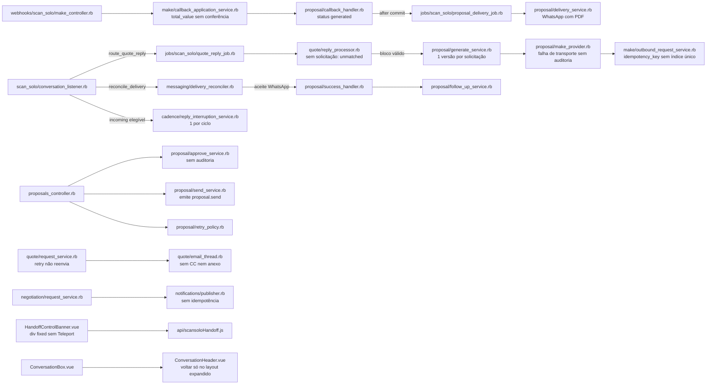
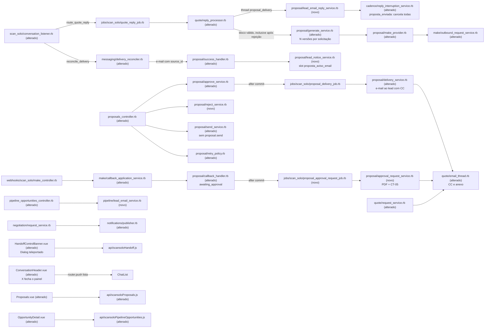

# Implementation Plan

## Request Summary
- Objective: reintroduzir a aprovação humana explícita entre a geração da proposta (callback do Make) e a entrega, e trocar a entrega ao lead do WhatsApp com PDF para e-mail com `comercial@` em cópia, seguida de um aviso curto pelo WhatsApp. O callback de sucesso passa a deixar a versão em `awaiting_approval` e a pedir a aprovação ao Luciano por e-mail na thread do orçamento (PDF anexo + link da tela). Aprovar e Rejeitar vivem só na tela de Propostas, de forma idempotente e auditada. A rejeição reabre a solicitação, e um novo bloco CT-04 na mesma thread gera a versão seguinte. `proposta_enviada` só acontece com o e-mail confirmado (`source_id`). A resposta do lead por e-mail na thread da proposta é correlacionada e, em `proposta_enviada`, toda resposta do lead cancela todas as tentativas de cadência. Completam o escopo: robustez (conferência de `total_value`, auditoria de falhas e callbacks rejeitados, `/send` legado sem `proposal.send`, retry do e-mail de solicitação, notificação de negociação idempotente, índice único em `make_requests.idempotency_key`), o destrave da UI do "Assumir conversa" (entregável cedo e de forma independente) e as fases de operador no Make/Meta/instância.
- Scope in: RF-01..RF-29, UI-01..UI-08, CT-01..CT-09, RNF-01..RNF-11, HG-03 (reordenado), HG-D (ampliado), HG-E, HG-F, HG-G.
- Scope out: agente de IA (prompt, base de conhecimento, ações, guardrails, configuração publicada), API oficial do WhatsApp e serviços nativos `Whatsapp::*`/`Channel::Whatsapp`, aprovação por resposta de e-mail, envio de e-mail pelo Make, correlação de e-mail do lead fora da thread da proposta, novo papel/fluxo de handoff, remoção física da rota `send` (Phase 20 da OC), mudanças em definições de cadência (`OC/RF-44`) e no acompanhamento (`OC/RF-31`).
- Tier: complete
- SPEC: v1.1 (0 marcadores; clarificações Q-01..Q-06 aplicadas). Feature alterada: `.spec/features/scansolo-operacao-centralizada/` (OC, SPEC v1.3, PLAN/PHASES com as Phases 1–15 concluídas e 16–20 pendentes).
- Architecture references: `AGENTS.md` (= `CLAUDE.md`), `docs/agents/architecture.md`, `docs/agents/domain_rules.md` (também consultados: `docs/agents/data_model.md`, `docs/agents/api_contracts.md`). Contratos base: `.spec/features/scansolo-operacao-centralizada/openapi.yaml` (v1.7.0) e `asyncapi.yaml` (v1.5.0).

### Regras de arquitetura preservadas (valem para todas as tasks)
- Base de comparação da feature: o commit `docs(spec)` que adiciona este plano (último commit só de `.spec/` antes do 1º commit de código desta feature). Até ele existir, `29cfe766cf`. Todo `git diff <base>` das tasks usa esse commit.
- `docs/agents/architecture.md` "Layer responsibilities":
  - Controllers: gate 404 `scansolo_enabled` (herdado do `BaseController`), Pundit (403) e validação de borda (422) — `reason_required`, `lead_email_missing`, `invalid_email` (T26, T27).
  - Services: toda escrita e regra, 1 service por transição ("sole path"): `ApproveService`, `RejectService`, `ApprovalRequestService`, `DeliveryService`, `LeadNoticeService`, `LeadEmailReplyService`, `LeadEmailService`.
  - `ConversationListener`: só classifica e delega (T21 só acrescenta origens; a correlação do e-mail do lead é roteada pelo `ReplyProcessor` já chamado pelo `QuoteReplyJob`).
  - Models: enums, associações, validações e predicados de leitura (T05).
- `docs/agents/domain_rules.md` "Proposal lifecycle": só o callback escreve `value`/`currency`/`artifact_url` (`CallbackHandler`, T16). "Pipeline stages": `proposta_enviada` só via `SuccessHandler` → `StageTransitionService` (T20, T21). "Quote request and reply": `late_reply` e `unmatched` mantidos, com as exceções de RF-06 e RF-16 (T25). "Cadence stop / recalculate": ≤ 1 por ciclo fora de `proposta_enviada` (T13).
- RNF-01: download do PDF, e-mails (pedido de aprovação e proposta ao lead), aviso WhatsApp e HTTP ao Make só depois do commit (`ActiveRecord.after_all_transactions_commit` ou job). `Quote::EmailThread.post!` já levanta `CustomExceptions::ScanSolo::DeliveryInsideTransaction` em transação aberta (verified at `app/services/scan_solo/quote/email_thread.rb:22`).
- `AGENTS.md` "General Guidelines": regra no ponto de entrada mais cedo (aprovação: controller + service sob lock; e-mail do lead validado no controller); falha alta em estado impossível (migração com chaves duplicadas aborta, RF-24; inbox de orçamento mal configurado levanta `QuoteInboxMisconfigured`); reuso de dependências existentes (`ConversationReplyMailer` com `cc_emails` e anexos nativos, `SafeFetch`, ActiveStorage, `NativeTemplateSender`, `TemplateAvailabilityGuard`, `components-next/dialog/Dialog.vue`).
- `AGENTS.md` Enterprise: `docs/agents/architecture.md` declara `enterprise/` sem uso pelo ScanSolo. `ConversationHeader.vue`/`ConversationBox.vue` são OSS e não têm par em `enterprise/` (verificado: `grep -rn "ConversationBox\|ConversationHeader" enterprise` vazio). T34 confere 0 referências a `enterprise/`/`Captain::`.
- RNF-05 / RF-10: 0 linhas de diff em `app/services/scan_solo/ai_turn/prompt_builder.rb`, `input_guardrail.rb`, `output_validator.rb`, `context_assembler.rb`, `app/services/scan_solo/actions/registry.rb`, `app/services/scan_solo/actions/proposal_actions.rb`, `db/seeds` de conhecimento, `app/services/whatsapp/`, `app/models/channel/whatsapp.rb`. A migração altera 0 valores de `scan_solo_ai_agent_configs`.
- i18n (`AGENTS.md`): backend em `config/locales/en.yml` (seção `scan_solo`, textos em pt-BR como na OC); frontend em `app/javascript/dashboard/i18n/locale/en/scansolo.json`. Não existem arquivos `pt_BR` ScanSolo (ver Open Questions Q2).
- Estilo (`docs/agents/coding_guidelines.md`): `class ScanSolo::…` compacta, 1 classe por arquivo, ≤ 150 colunas, `def self.call(**) = new(**).call`, header comment com RF/CT/RNF. Vue com `<script setup>`, Tailwind, `components-next/`, sem strings soltas.
- RNF-10: um spec existente só muda de expectativa por mudança prevista neste SPEC, e a task cita o requisito (ex.: specs de `OC/RF-28`/`OC/RF-29`/`OC/RF-30` substituídos). 0 `skip`/`pending`/`xit` novos.
- Validação:
  - Specs Ruby e rubocop no container de teste: `docker exec scansolo-phase2-test sh -c 'cd /app && bundle exec rspec <paths>'` (rubocop: `bundle exec rubocop --force-exclusion <paths>`).
  - Depois de T04: `docker exec scansolo-phase2-test sh -c 'cd /app && RAILS_ENV=test bundle exec rails db:migrate'`.
  - Vitest: `pnpm test <paths>`. ESLint: `pnpm eslint <arquivos>` com os `.vue` explícitos (a varredura por diretório ignora `.vue`).
  - Playwright (RNF-11): `cd tests/playwright && npx playwright test <spec> --repeat-each=3 --retries=0 --workers=1` contra a stack local (`BASE_URL`).
  - Gate de regressão: `./scripts/ralph-test.sh`.

### Componentes reaproveitados (resumo; cada task cita os seus)
- Chatwoot nativo: `Message` (`after_create_commit` → `SendReplyJob` → `Email::SendOnEmailService` → `ConversationReplyMailer#email_reply`, `prepare_mail(true)` com `cc_emails`, verified at `app/mailers/conversation_reply_mailer.rb:38-44,181-187`; anexos via `process_attachments_as_files_for_email_reply`, `app/mailers/conversation_reply_mailer_helper.rb:28`); `source_id` = Message-ID no sucesso e `Messages::StatusUpdateService` `failed` na exceção (`app/services/email/send_on_email_service.rb:11-16`); `Mailbox::ConversationFinderStrategies::InReplyToStrategy` (threading); `ContactInboxWithContactBuilder` (reusa o contato pelo e-mail, `app/builders/contact_inbox_with_contact_builder.rb:67-107`); ActiveStorage; `SafeFetch`; `Dialog.vue` (`open`/`close`, eventos `confirm`/`close`, Teleport).
- ScanSolo: `Quote::EmailThread`, `Quote::EmailComposer`, `Quote::Mailbox`, `Quote::ReplyProcessor`, `Proposal::*` (`GenerateService`, `CallbackHandler`, `DeliveryService`, `SuccessHandler`, `FollowUpService`, `RetryPolicy`, `MakeProvider`), `Make::*`, `Messaging::DeliveryReconciler`/`TemplateResolver`/`NativeTemplateSender`, `Cadence::TemplateAvailabilityGuard`/`ReplyInterruptionService`/`AttemptEvidenceRecorder`, `AuditLogger`, `Notifications::Publisher`. Telas: `Proposals.vue`, `OpportunityDetail.vue`, `KanbanBoard.vue`, `TemplatesPanel.vue`, `HandoffControlBanner.vue`.

## AS IS — Componentes impactados

Hoje o callback de sucesso grava `generated` e enfileira a entrega WhatsApp com PDF sem aprovação, e `proposta_enviada` depende do aceite do WhatsApp. O e-mail do lead cai em `unmatched`, a solicitação aceita uma única versão e o diálogo de "Assumir conversa" é um overlay sem Teleport que pode travar a lista.

## TO BE — Componentes propostos

T01/T02/T03 alteram `HandoffControlBanner.vue` e `ConversationHeader.vue`. T04/T05 criam as colunas e modelos; T16 altera o `CallbackHandler` e cria `ApprovalRequestService` + job; T17 altera o `CallbackApplicationService`; T18 reescreve o `ApproveService` e cria o `RejectService`; T19 reescreve o `DeliveryService` para e-mail; T20 cria o `LeadNoticeService` e altera o `SuccessHandler`; T21 altera `DeliveryReconciler` e listener; T22 o `RetryPolicy`; T23 o `SendService`; T24 cria o `LeadEmailReplyService`; T25 altera `GenerateService`/`ReplyProcessor`; T09–T15 cobrem `OutboundRequestService`, `MakeProvider`, `RequestService`, `Publisher`, `ReplyInterruptionService`, `EmailThread` e `EmailComposer`; T26/T27 os controllers; T28–T31 o frontend.

## Tasks

### T01 — `HandoffControlBanner`: diálogo teleportado, fechamento em erro e no takeover implícito (UI-04, UI-05, UI-06, UI-08)
- **Files**: `app/javascript/dashboard/components-next/conversation/HandoffControlBanner.vue`, `app/javascript/dashboard/components-next/conversation/specs/HandoffControlBanner.spec.js`, `app/javascript/dashboard/i18n/locale/en/scansolo.json` (só a chave `SCANSOLO.HANDOFF_BANNER.ERROR`)
- **Change**:
  - Trocar o `div fixed inset-0` (`HandoffControlBanner.vue:177-212`) por `<Dialog ref="reasonDialog">` de `components-next/dialog/Dialog.vue` (Teleport para o `body`), com o `input` do motivo no slot, `confirm-button-label` = `TAKEOVER_BUTTON`, `:is-loading="pending"`. "Cancelar" e Esc emitem `close` → limpar o motivo, 0 requisições.
  - `requestTakeover` → `reasonDialog.value.open()`. `confirmTakeover`: `try { POST; await fetchControlState(); close() } catch { useAlert(t('SCANSOLO.HANDOFF_BANNER.ERROR')); close() } finally { pending = false }` — o diálogo fecha também na falha do POST ou do GET (UI-05).
  - `watch(controlState, state => { if (state !== 'ai_active') reasonDialog.value?.close() })` — takeover implícito com o diálogo aberto fecha o diálogo (UI-05).
  - O mesmo `catch` + alerta em `returnToAi`. Nenhuma chamada nova a handoff/atribuição/status em mount/unmount (UI-08).
  - `defineExpose` mantém `fetchControlState`, `confirmTakeover`, `returnToAi`.
- **Covers**: UI-04, UI-05, UI-06 (vitest), UI-08, RNF-08
- **Tests**: `HandoffControlBanner.spec.js`: diálogo renderizado fora do banner (`document.body`, `attachTo`); Esc → fechado e 0 chamadas; confirmar → 1 `takeover` e rótulo humano; POST rejeitado → diálogo fechado, `pending` falso e `useAlert` chamado; `controlState` → `human_active` com o diálogo aberto → fechado; remontar com outra `conversation` (troca de `:key`) → 0 overlays residuais no `body` e 0 chamadas a `returnToAi`/`takeover`. Specs existentes do banner que dependiam do `data-testid="takeover-reason-dialog"` dentro do banner mudam o seletor (UI-04).
- **Risk**: Low — componente isolado, montado com `:key` por conversa.
- **Dependencies**: none

### T02 — `ConversationHeader`: botão X fecha só o painel em todos os layouts (UI-07, UI-08)
- **Files**: `app/javascript/dashboard/components/widgets/conversation/ConversationHeader.vue`, `app/javascript/dashboard/components/widgets/conversation/specs/ConversationHeader.spec.js` (novo)
- **Change**: quando `showBackButton` é falso (layout não expandido), renderizar um botão `data-testid="conversation-close-button"` com ícone `i-lucide-x`, `aria-label`/`title` = `t('CONVERSATION.HEADER.CLOSE')` (chave existente, `en/conversation.json:147`), posicionado com utilitários lógicos (`ms-*`/`me-*`), que faz `router.push(backButtonUrl.value)` (computed existente, `ConversationHeader.vue:43`). Sem chamada à API, sem mudança de assignee/status/handoff. `ConversationBox.vue` não muda (o `BackButton` continua no expandido).
- **Covers**: UI-07, UI-08, RNF-08
- **Tests**: `ConversationHeader.spec.js` (router e store mockados): layout não expandido → botão X visível; clique → 1 `router.push` com a URL da lista e 0 chamadas axios; com `showBackButton` → sem X (sem regressão do expandido).
- **Risk**: Low — arquivo OSS sem par enterprise; mudança só visual + navegação.
- **Dependencies**: none

### T03 — E2E Playwright: assumir conversa, trocar de conversa e voltar (UI-06, UI-08, RNF-11)
- **Files**: `tests/playwright/tests/e2e/scansolo/handoff-takeover-navigation.spec.ts` (novo)
- **Change**: spec com seed via API (usuário admin e `api_access_token` de `tests/playwright/.env`, padrão dos specs existentes): conta ScanSolo com inbox allowlisted publicado, 1 conversa em `ai_active` e 1 2ª conversa. Fluxo: abrir a 1ª → "Assumir conversa" → motivo → confirmar → estado humano → clicar na 2ª conversa da lista (sem menu) → abre → clicar no X → lista → voltar para a 1ª → rótulo "humano". Antes/depois, ler via API `ai_control_state`, `assignee_id` e `status` das 2 conversas e comparar (UI-08).
- **Covers**: UI-06, UI-08, RNF-11
- **Tests**: `cd tests/playwright && npx playwright test tests/e2e/scansolo/handoff-takeover-navigation.spec.ts --repeat-each=3 --retries=0 --workers=1` → 3/3 verdes; `pnpm --dir tests/playwright lint` sem erro.
- **Risk**: Medium — depende de stack local e seed; flakiness mitigada por `expect` com espera de rede e sem retry mascarando falha.
- **Dependencies**: T01, T02

### T04 — Migrações: colunas de aprovação/entrega, N versões por solicitação e `idempotency_key` único
- **Files**: `db/migrate/20261007100001_add_approval_and_email_delivery_to_scan_solo_proposals.rb`, `db/migrate/20261007100002_allow_many_scan_solo_proposal_versions_per_quote_request.rb`, `db/migrate/20261007100003_add_unique_idempotency_key_to_scan_solo_make_requests.rb` (novos), `db/schema.rb`, `spec/db/scansolo_migrations_spec.rb`, `spec/db/scan_solo_proposal_approval_migrations_spec.rb` (novo)
- **Change**:
  - 100001: em `scan_solo_proposal_versions`: `rejected_at` datetime, `add_reference :rejected_by, polymorphic: true` (como `approved_by`), `rejection_reason` text, `approval_requested_at` datetime, `approval_request_message_id` bigint, `notice_message_id` bigint (índice), `notice_failure_reason` string, `artifact_sha256` string. Em `scan_solo_proposals`: `email_conversation_id` bigint com índice único (1 conversa de e-mail de proposta por oportunidade, CT-06).
  - 100002: `remove_index` do único `index_scan_solo_proposal_versions_on_quote_request_id` e `add_index` não único com o mesmo nome; `add_index :scan_solo_proposal_versions, :quote_request_id, unique: true, where: 'status IN (0, 2, 5)', name: 'index_scan_solo_proposal_versions_one_open_per_quote_request'` (RF-07: `generating 0`, `approved 2`, `awaiting_approval 5`). Valores existentes intocados (RF-26).
  - 100003: `up` conta `SELECT idempotency_key FROM scan_solo_make_requests GROUP BY idempotency_key HAVING count(*) > 1`; se houver → `raise ActiveRecord::MigrationError, "duplicate idempotency_key: #{keys.join(', ')}"` antes de qualquer DDL (0 registros alterados); senão `add_index :scan_solo_make_requests, :idempotency_key, unique: true`. `down` remove o índice.
  - `spec/db/scansolo_migrations_spec.rb`: contagem 35 → 38 (RNF-07, comentário citando as 3 migrações).
- **Covers**: RF-07, RF-24, RF-26, RNF-02, RNF-05, RNF-07
- **Tests**: `scan_solo_proposal_approval_migrations_spec.rb`: (a) após migrar, 2 versões `rejected` + 1 `generating` na mesma solicitação → válidas; 2ª não terminal → `RecordNotUnique`; (b) fixture com 2 `MakeRequest` de mesma chave (índice removido no `before` via `ActiveRecord::Migration.suppress_messages`) → `migrate(:up)` levanta com as 2 chaves na mensagem e contagem/valores iguais; sem duplicatas → índice único presente; (c) contagem e `status` de `scan_solo_proposal_versions` iguais antes/depois (RF-26). `db:migrate` no container sem erro.
- **Risk**: Medium — troca de índice em tabela existente e migração que pode abortar em produção (intencional, RF-24).
- **Dependencies**: none

### T05 — Modelos: status novos, associações e predicados
- **Files**: `app/models/scan_solo/proposal_version.rb`, `app/models/scan_solo/proposal.rb`, `app/models/scan_solo/quote_request.rb`, `app/models/scan_solo/pipeline_opportunity.rb`, `spec/models/scan_solo/proposal_version_spec.rb`, `spec/models/scan_solo/quote_request_spec.rb`, `spec/models/scan_solo/pipeline_opportunity_spec.rb`
- **Change**:
  - `ProposalVersion`: `enum status: { generating: 0, generated: 1, approved: 2, sent: 3, failed: 4, awaiting_approval: 5, rejected: 6 }`; `NON_TERMINAL_STATUSES = %w[generating awaiting_approval approved]`; `belongs_to :rejected_by, polymorphic: true, optional: true`, `:approval_request_message`, `:notice_message` (`Message`, optional); `belongs_to :quote_request, inverse_of: :proposal_versions`. `approval_required?` fica só para serialização (CT-01 não remove campo).
  - `QuoteRequest`: `has_one :proposal_version` → `has_many :proposal_versions` (`dependent: :restrict_with_exception`); `generation_open?` = `proposal_versions.where.not(status: :rejected).none?` (RF-07: 1ª versão ou só rejeitadas).
  - `Proposal`: `belongs_to :email_conversation, class_name: 'Conversation', optional: true`.
  - `PipelineOpportunity#lead_email_valid?` = `contact.email.present? && contact.email.match?(URI::MailTo::EMAIL_REGEXP)` (RF-08; usado por T19, T26 e jbuilders).
- **Covers**: RF-06, RF-07, RF-08, RF-26, CT-01
- **Tests**: códigos 0–6 conferidos por `ProposalVersion.statuses`; `generation_open?` → true sem versões, true só com `rejected`, false com `failed`/`sent`/`awaiting_approval`; `lead_email_valid?` com nil, `"x@"` e válido. Specs existentes que usavam `quote_request.proposal_version` passam a `proposal_versions` (RF-06).
- **Risk**: Low.
- **Dependencies**: T04

### T06 — `ProposalPolicy`: administrador ou `commercial_user_id` publicado (Q-01)
- **Files**: `app/policies/scan_solo/proposal_policy.rb`, `spec/policies/scan_solo/proposal_policy_spec.rb`
- **Change**: `approve?`, `reject?` (novo) e `retry?` = `administrator? || commercial_user?`, com `commercial_user?` = `ScanSolo::AiAgentConfig.published_for(account)&.commercial_user_id == user.id`. `send?` inalterado.
- **Covers**: RF-04, RF-05, RF-15, CT-02, CT-03, HG-F (regra)
- **Tests**: admin → true; `agent` = `commercial_user_id` publicado → true; outro `agent` → false; `commercial_user_id` só no rascunho → false.
- **Risk**: Medium — amplia permissão; restrita ao usuário publicado.
- **Dependencies**: none

### T07 — Slot de template `proposta_aviso_email` (CT-07)
- **Files**: `app/models/scan_solo/template_mapping.rb`, `spec/models/scan_solo/template_mapping_spec.rb`, `spec/requests/api/v1/accounts/scan_solo/cadence_templates_spec.rb`, `spec/services/scan_solo/executions_feed_query_spec.rb`
- **Change**: `SINGLE_TEMPLATES` ganha `'proposta_aviso_email' => 'scansolo_proposta_aviso_email'` (após `proposta_acompanhamento`). `proposta_enviada` → `scansolo_proposal_send` inalterado. `TemplateAvailabilityReport` e `cadence_templates` herdam o slot pela constante.
- **Covers**: CT-07, HG-E (destino do mapeamento)
- **Tests**: `TemplateMapping` com `stage: 'proposta_aviso_email', step: nil` válido; `GET/PUT cadence_templates` aceita o slot; `executions_feed_query_spec` ganha a linha do slot (expectativa alterada citando CT-07).
- **Risk**: Low.
- **Dependencies**: none

### T08 — Textos backend e exceções de domínio
- **Files**: `config/locales/en.yml`, `lib/custom_exceptions/scan_solo.rb`, `spec/lib/custom_exceptions/scan_solo_spec.rb` (novo, se o padrão do repo não tiver spec de exceções, apenas cobertura indireta por T26)
- **Change**:
  - `en.yml`, sob `scan_solo.proposal`: `approval_request.{subject_suffix, intro, number, version, value, lead, lead_email_missing, link, approval_only_in_screen}` (CT-05); `lead_email.{subject, greeting, body, number, closing}` (CT-06, sem link do documento); `lead_email_thread_contact_name` não é necessário (reusa o contato do lead).
  - `lib/custom_exceptions/scan_solo.rb`: `CustomExceptions::ScanSolo::ProposalActionRejected` com `attr_reader :code` (códigos `not_awaiting_approval`, `not_current_version`, `already_sent`, `approval_required`) e `CustomExceptions::ScanSolo::LeadEmailRejected` com `code` (`invalid_email`, `contact_conflict`), no padrão de `QuoteRequestResendRejected`.
- **Covers**: CT-02, CT-03, CT-04, CT-05, CT-06, CT-09, RNF-08
- **Tests**: `spec/lib/scansolo_branding_spec.rb` e o spec de i18n existente continuam verdes; `I18n.t` das chaves novas sem `translation missing`.
- **Risk**: Low.
- **Dependencies**: none

### T09 — `OutboundRequestService`: chave de idempotência única sem 2ª requisição HTTP (RF-24)
- **Files**: `app/services/scan_solo/make/outbound_request_service.rb`, `spec/services/scan_solo/make/outbound_request_service_spec.rb`
- **Change**: `MakeRequest.create!` com `rescue ActiveRecord::RecordNotUnique` → devolve `ScanSolo::MakeRequest.find_by!(idempotency_key:)` sem `deliver!` (0 HTTP). Comentário de header citando RF-24.
- **Covers**: RF-24, RNF-02
- **Tests**: 2 chamadas com a mesma `idempotency_key` → 1 `MakeRequest` e 1 requisição WebMock (`assert_requested … times: 1`).
- **Risk**: Low.
- **Dependencies**: T04

### T10 — `MakeProvider`: auditoria `proposal.generation_failed` na falha de transporte (RF-20)
- **Files**: `app/services/scan_solo/proposal/make_provider.rb`, `spec/services/scan_solo/proposal/make_provider_spec.rb`
- **Change**: no `rescue DeliveryError`, além de `failed` + motivo (comportamento atual), `AuditLogger.record!(subject: opportunity, event_type: 'proposal.generation_failed', correlation_id: proposal_version.audit_correlation_id, payload: { proposal_version_id:, reason: e.reason, generate_correlation_id: correlation_id })` — só quando `action == 'proposal.generate'`.
- **Covers**: RF-20, RNF-06
- **Tests**: timeout WebMock → versão `failed`/`timeout` e 1 auditoria com os 2 correlation ids; HTTP 500 → `provider_unavailable` e 1 auditoria.
- **Risk**: Low.
- **Dependencies**: none

### T11 — `Quote::RequestService`: retry do job reenvia o e-mail de solicitação 1 vez (RF-22)
- **Files**: `app/services/scan_solo/quote/request_service.rb`, `spec/services/scan_solo/quote/request_service_spec.rb`
- **Change**: `open_request!`, sob o lock da oportunidade, devolve a solicitação existente quando `request_message_id` é nulo (antes devolvia `nil`, `request_service.rb:85`), e cria a nova só quando não há nenhuma. `call` segue para `deliver!` (fora da transação, RNF-01). Com `request_message_id` presente continua só o aviso ao cliente.
- **Covers**: RF-22, RNF-01
- **Tests**: 1ª execução com `EmailThread.post!` levantando → solicitação sem `request_message_id`; 2ª → 1 mensagem, `request_message_id` gravado, 1 solicitação e 1 conversa; 3ª → 0 mensagens novas.
- **Risk**: Low — reexecuções concorrentes do mesmo job não são cobertas (ver Risks).
- **Dependencies**: none

### T12 — `Notifications::Publisher`: ≤ 1 publicação por `correlation_id` (RF-23)
- **Files**: `app/services/scan_solo/notifications/publisher.rb`, `spec/services/scan_solo/notifications/publisher_spec.rb`
- **Change**: em `call`, antes dos adaptadores, reivindicação sob `opportunity.with_lock`: se já existe `AuditEvent` `negotiation.notification_claimed` com `subject: opportunity` e `correlation_id: payload[:correlation_id]` → retorna sem publicar; senão grava essa auditoria (commit) e só então publica fora da transação (o adaptador usa `EmailThread.post!`, RNF-01).
- **Covers**: RF-23, RNF-02
- **Tests**: 2 `Publisher.call` com o mesmo `correlation_id` → 1 e-mail de negociação e 1 `notification_claimed`; `correlation_id` diferente → 2 e-mails.
- **Risk**: Low — uma falha do adaptador não é republicada no mesmo `correlation_id` (consistente com "no máximo 1").
- **Dependencies**: none

### T13 — `ReplyInterruptionService`: em `proposta_enviada` cancela todas as tentativas (RF-18)
- **Files**: `app/services/scan_solo/cadence/reply_interruption_service.rb`, `spec/services/scan_solo/cadence/reply_interruption_service_spec.rb`
- **Change**: quando `opportunity.proposta_enviada?`, para cada matrícula ativa criada antes da mensagem (sob `enrollment.with_lock`), cancela **todas** as tentativas `scheduled` via `AttemptEvidenceRecorder.record_cancelled!`, com 1 `AuditEvent` `cadence.attempt_interrupted_by_reply` por tentativa (payload com `attempt_id` e `message_id`). Nas outras etapas, o caminho atual (≤ 1 por ciclo). Assinatura `call(opportunity:, message:)` inalterada, então o listener (WhatsApp) e T24 (e-mail) usam o mesmo ponto.
- **Covers**: RF-18, RNF-06
- **Tests**: `proposta_enviada` + 3 `scheduled` + 1 mensagem → 3 `cancelled` e 3 auditorias; tentativa `sent` inalterada; `em_contato` + 3 `scheduled` → 1 `cancelled` (regra atual); 2ª mensagem → 0 cancelamentos novos.
- **Risk**: Medium — muda o ritmo da cadência pós-proposta; restrito a `proposta_enviada`.
- **Dependencies**: none

### T14 — `Quote::EmailThread`: CC, anexos e atributos de origem
- **Files**: `app/services/scan_solo/quote/email_thread.rb`, `spec/services/scan_solo/quote/email_thread_spec.rb`
- **Change**: `post!(conversation:, recipient:, email:, cc: [], attachments: [], additional_attributes: {})`: `content_attributes` ganha `cc_emails: cc` quando presente; cada blob vira `message.attachments.new(account_id:, file_type: :file, file: blob)` antes do `save!` (mesma criação, para o `SendReplyJob` já enxergar os anexos); `additional_attributes` gravado na mensagem. `open!` inalterado (o `ContactInboxWithContactBuilder` reusa o contato do lead pelo e-mail).
- **Covers**: CT-05, CT-06, RNF-01
- **Tests**: `post!` com 1 blob PDF e `cc: ['comercial@scansolo.com.br']` → 1 mensagem com 1 anexo (mesmo checksum), `content_attributes.cc_emails` e `additional_attributes`; com `perform_enqueued_jobs` + ActionMailer `:test` → 1 e-mail com `Cc` e 1 anexo `application/pdf`; dentro de transação → `DeliveryInsideTransaction`. Specs existentes (sem os kwargs novos) inalterados.
- **Risk**: Low — kwargs opcionais.
- **Dependencies**: none

### T15 — `Quote::EmailComposer`: e-mail de pedido de aprovação (CT-05) e e-mail da proposta ao lead (CT-06)
- **Files**: `app/services/scan_solo/quote/email_composer.rb`, `spec/services/scan_solo/quote/email_composer_spec.rb`
- **Change**:
  - `approval_request(proposal_version:)`: número, versão, valor/moeda, nome e empresa do lead, aviso "falta e-mail do lead" quando `!opportunity.lead_email_valid?` (RF-08), link `"#{ENV.fetch('FRONTEND_URL', nil)}/app/accounts/#{account_id}/scansolo/proposals"` e a frase de que a aprovação só vale pela tela. Sem assunto (posta na thread do orçamento, `Re:` nativo).
  - `lead_proposal(proposal_version:)`: assunto com o número da proposta e corpo i18n, sem link do documento (o PDF segue anexo).
  - Tudo de `scan_solo.proposal.*` (T08), valores escapados como no `build` existente; nada de token/URL de API (RNF-09).
- **Covers**: CT-05, CT-06, RF-08, RNF-08, RNF-09
- **Tests**: texto/HTML contêm número, versão, valor e link; com contato sem e-mail → aviso presente; `lead_proposal` com 0 URLs no corpo e o número no assunto.
- **Risk**: Low.
- **Dependencies**: T05, T08

### T16 — Callback → `awaiting_approval`, PDF armazenado e pedido de aprovação (RF-01, RF-02, RF-20, RF-25)
- **Files**:
  - `app/services/scan_solo/proposal/callback_handler.rb`, `app/services/scan_solo/proposal/approval_request_service.rb` (novo), `app/jobs/scan_solo/proposal_approval_request_job.rb` (novo)
  - Specs: `spec/services/scan_solo/proposal/callback_handler_spec.rb`, `spec/services/scan_solo/proposal/approval_request_service_spec.rb` (novo), `spec/jobs/scan_solo/proposal_approval_request_job_spec.rb` (novo), `spec/services/scan_solo/proposal/mock_provider_spec.rb`
- **Change**:
  - `CallbackHandler.apply_generate_result!(…, artifact_sha256: nil, template_version: nil)`: no sucesso grava `status: :awaiting_approval` (no lugar de `generated`), `artifact_sha256`; auditoria `proposal.generated` com `template_version` quando presente; `after_all_transactions_commit { ScanSolo::ProposalApprovalRequestJob.perform_later(id) }` substitui o `ProposalDeliveryJob`. Na falha: além do comportamento atual, 1 `AuditEvent` `proposal.generation_failed` (`reason`, `generate_correlation_id`, correlation da solicitação). Nada de mensagem ao lead, etapa ou matrícula (RF-01).
  - `ApprovalRequestService.call(proposal_version:, redownload: false)`:
    1. Elegível: `awaiting_approval` (inicial) ou, com `redownload`, `failed` com `artifact_download_failed`/`artifact_checksum_mismatch` (RF-15 c).
    2. Fora de transação: sem documento (ou `redownload`) → `document.purge` se houver + `SafeFetch.fetch(artifact_url, allowed_content_types: ['application/pdf'])` → `document.attach(…, filename: "#{proposal_number}.pdf")` (código movido de `DeliveryService#store_document`). `SafeFetch::Error` → `fail!('artifact_download_failed')`.
    3. `artifact_sha256` presente e ≠ `Digest::SHA256.hexdigest` do blob → `document.purge` + `fail!('artifact_checksum_mismatch')` (RF-25).
    4. Sob `proposal_version.with_lock`: reivindica se `approval_requested_at` nulo (e, no `redownload`, volta a `awaiting_approval` com `failure_reason: nil`); senão retorna (idempotência, RF-02).
    5. Fora do lock: `settings = Quote::Mailbox.resolve!` (falha alta se mal configurado); `EmailThread.post!(conversation: quote_request.email_conversation, recipient: settings.recipient, email: EmailComposer.approval_request(...), attachments: [document.blob])`; grava `approval_request_message`; 1 `AuditEvent` `proposal.approval_requested` com o `correlation_id` da solicitação.
    - `fail!`: `failed` + motivo + 1 `proposal.delivery_failed` (RF-01), 0 e-mails ao Luciano.
  - `ProposalApprovalRequestJob` (`queue_as :medium`) chama o service. Sem cron (RNF-03).
- **Covers**: RF-01, RF-02, RF-20 (callback `failure`), RF-25, CT-05, RNF-01, RNF-02, RNF-03, RNF-06
- **Tests**:
  - `callback_handler_spec.rb` (expectativas de `OC/RF-29` substituídas por RF-01): sucesso → `awaiting_approval`, 1 job de pedido de aprovação, 0 `ProposalDeliveryJob`, 0 mensagens na conversa WhatsApp, etapa inalterada, 0 `PipelineStageEvent`, 0 matrículas; `failure` → 1 `proposal.generation_failed`.
  - `approval_request_service_spec.rb` (WebMock): 1 blob `application/pdf`; 1 mensagem `outgoing` na `email_conversation` da solicitação com 1 anexo `<número>.pdf`, `to_emails` = [`quote_recipient_email` publicado] e o link no corpo; 2ª execução → 1 mensagem; HTTP 500 → `failed`/`artifact_download_failed`, 1 auditoria e 0 e-mails; `artifact_sha256` igual → e-mail; diferente → `failed`/`artifact_checksum_mismatch` e 0 e-mails; contato sem e-mail → corpo com o aviso; RNF-01: envio dentro de transação levanta.
- **Risk**: High — muda o caminho central do callback. Mitigado por specs de contagem e pela `Entrada` inativa até T41.
- **Dependencies**: T04, T05, T14, T15

### T17 — `CallbackVerifier`/`CallbackApplicationService`: `total_value` conferido e rejeições auditadas (RF-19, RF-20, RF-25, CT-08)
- **Files**: `app/services/scan_solo/make/callback_verifier.rb`, `app/services/scan_solo/make/callback_application_service.rb`, `spec/services/scan_solo/make/callback_application_service_spec.rb`, `spec/requests/webhooks/scan_solo/make_spec.rb`
- **Change**:
  - `CallbackVerifier::SCHEMA`: no resultado de sucesso, propriedades opcionais `artifact_sha256` (`string`, `pattern: '^[0-9a-f]{64}$'`) e `template_version` (`string`). Demais regras e `proposal.send` histórico intactos.
  - `CallbackApplicationService#call`: para `proposal.generate` + `success`, antes da transação, comparar em centavos `callback_result['total_value']` com `version.quote_request.commercial['total_value']` (só versões com solicitação); divergente → `reject!` com `rejection_reason: 'total_value_mismatch'` (versão `generating`, nada gravado) e webhook 422.
  - `reject!` (todo motivo com assinatura válida: `malformed_json`, `schema_invalid`, `unmatched_request`, `total_value_mismatch`) grava o `MakeCallback` e 1 `AuditEvent` `make.callback_rejected` (`subject` = o `MakeCallback`; `correlation_id` da solicitação quando a versão é identificável, senão o do payload ou UUID; payload com `rejection_reason` e, no mismatch, os 2 valores). Assinatura inválida continua 401 sem nenhuma escrita (o controller retorna antes, `make_controller.rb:11`).
  - `apply_generate!` repassa `artifact_sha256` e `template_version` ao `CallbackHandler` (T16).
- **Covers**: RF-19, RF-20, RF-25, CT-08, RNF-06
- **Tests**: `make_spec.rb`: pedido 12500.00 e callback 12000.00 → 422, versão `generating`, `value` nulo, 1 `MakeCallback` `total_value_mismatch` e 1 auditoria; 12500.0 → 200 e `awaiting_approval`; schema inválido → 422 e 1 `make.callback_rejected`; assinatura inválida → 401, 0 `AuditEvent` e 0 `MakeCallback`; callback com `artifact_sha256`/`template_version` → 200; sem os campos → 200.
- **Risk**: Medium — webhook público; a ordem de verificação não muda.
- **Dependencies**: T16

### T18 — Aprovação auditada e rejeição com motivo (RF-04, RF-05)
- **Files**: `app/services/scan_solo/proposal/approve_service.rb`, `app/services/scan_solo/proposal/reject_service.rb` (novo), `spec/services/scan_solo/proposal/approve_service_spec.rb`, `spec/services/scan_solo/proposal/reject_service_spec.rb` (novo)
- **Change**:
  - `ApproveService.call(proposal_version:, actor:)`, sob `proposal_version.with_lock`: `approved`/`sent` → retorna a versão (idempotente, sem auditoria nem entrega); não vigente → `ProposalActionRejected('not_current_version')`; ≠ `awaiting_approval` → `not_awaiting_approval`; senão `update!(status: :approved, approved_at:, approved_by: actor)` + 1 `AuditEvent` `proposal.approved` (ator, correlation da solicitação) + `after_all_transactions_commit { ProposalDeliveryJob.perform_later(id) }`. Não consulta `require_proposal_approval`. O parâmetro `correlation_id` deixa de ser usado pelo service (continua exigido no controller, CT-02).
  - `RejectService.call(proposal_version:, actor:, reason:)`, numa transação com lock da solicitação e da versão: não vigente → `not_current_version`; ≠ `awaiting_approval` → `not_awaiting_approval`; senão versão `rejected` com `rejected_at`, `rejected_by`, `rejection_reason` (strip), solicitação `awaiting_reply`, 1 `AuditEvent` `proposal.rejected` (motivo e ator). 0 entregas.
- **Covers**: RF-04, RF-05, RF-06 (reabertura), RNF-02, RNF-06
- **Tests**: `approve_service_spec.rb` (expectativas de `OC/RF-78` substituídas por RF-04): 1ª → `approved`, 1 auditoria, 1 job; 2ª → 0 auditorias/jobs novos; 2 threads concorrentes → 1 auditoria e 1 job; com `require_proposal_approval = false` publicado o comportamento é o mesmo; não vigente → `not_current_version`. `reject_service_spec.rb`: motivo → `rejected`, solicitação `awaiting_reply`, 1 auditoria, 0 jobs de entrega; versão `approved` → `not_awaiting_approval`.
- **Risk**: Medium — transição central; lock + checagem de status sob lock.
- **Dependencies**: T05, T08

### T19 — Entrega por e-mail ao lead com CC e PDF (RF-08, RF-11, RF-12, RF-14)
- **Files**: `app/services/scan_solo/proposal/delivery_service.rb`, `app/jobs/scan_solo/proposal_delivery_job.rb`, `spec/services/scan_solo/proposal/delivery_service_spec.rb`
- **Change**: reescrever `DeliveryService.call(proposal_version:, redeliver: false)` (o WhatsApp com PDF de `OC/RF-29` sai):
  1. `claim!` sob lock: `approved` e `sent_message_id` nulo, ou (`redeliver`) `failed` com `approved_at` presente → `update!(status: :approved, failure_reason: nil, send_requested_at:)`; senão retorna (RF-12).
  2. `!opportunity.lead_email_valid?` → `fail!('lead_email_missing')` (RF-08). Documento ausente → `fail!('email_delivery_failed')` (ver Q1).
  3. `settings = Quote::Mailbox.resolve!`; sob `proposal.with_lock`, `proposal.email_conversation ||= EmailThread.open!(inbox: settings.inbox, recipient: contact.email, subject: composer.subject, marker: 'proposal_delivery')` (1 por oportunidade, reutilizada, RF-17/CT-06).
  4. Fora de transação: `EmailThread.post!(conversation:, recipient: contact.email, cc: [settings.recipient], email: EmailComposer.lead_proposal(...), attachments: [document.blob], additional_attributes: { 'scansolo_origin' => 'proposal_email', 'scansolo_proposal_version_id' => id })` → `update!(sent_message: message)`; exceção na criação → `fail!('email_delivery_failed')`.
  - `fail!`: `failed` + motivo + 1 `proposal.delivery_failed`, mantém valor/`artifact_url`/PDF, etapa intacta, 0 avisos (RF-14). Nenhum `MakeRequest` (RF-11).
  - `store_document` sai (movido para T16). Header comment atualizado (RF-11, RF-12, RF-14, CT-06).
- **Covers**: RF-08, RF-11, RF-12, RF-14, RF-17, CT-06, RNF-01, RNF-02
- **Tests**: `delivery_service_spec.rb` (expectativas de `OC/RF-29`/CT-10 substituídas por RF-11): após aprovação → 1 mensagem `outgoing` no inbox de orçamento com `to_emails` = [`contact.email`], `cc_emails` = [`quote_recipient_email`], 1 anexo com o checksum do blob da versão; com ActionMailer `:test` → `Cc` = `comercial@scansolo.com.br`; 0 mensagens WhatsApp; 0 `MakeRequest`; 2 execuções → 1 e-mail; versão 2 após rejeição da 1 → mesma conversa de proposta; contato sem e-mail → `failed`/`lead_email_missing` e etapa inalterada; RNF-01.
- **Risk**: High — envio ao cliente final. Mitigado por claim sob lock, `sent_message_id`, CC fixo do publicado e HG-G.
- **Dependencies**: T05, T14, T15

### T20 — Aviso WhatsApp sem PDF depois de `sent` (RF-11, RF-12, RF-14, CT-07)
- **Files**: `app/services/scan_solo/proposal/lead_notice_service.rb` (novo), `app/services/scan_solo/proposal/success_handler.rb`, `spec/services/scan_solo/proposal/lead_notice_service_spec.rb` (novo), `spec/services/scan_solo/proposal/success_handler_spec.rb`
- **Change**:
  - `LeadNoticeService.call(proposal_version:)`, sob lock da versão: só `sent`, e só se `notice_message` for nulo ou `failed` (≤ 1 aviso aceito, RF-12/RF-15 a). `TemplateResolver.call(stage: 'proposta_aviso_email', step: nil, …)` + `TemplateAvailabilityGuard` na conversa WhatsApp da oportunidade; bloqueado → `notice_failure_reason = guard.reason` + 1 `proposal.lead_notice_failed`; senão `NativeTemplateSender.call(origin: 'proposal_notice', template_params: template.sender_params)` (sem `document`, sem link) → `notice_message`.
  - `SuccessHandler#call`: o `after_all_transactions_commit` passa a chamar `LeadNoticeService` e depois o `FollowUpService` existente (OC/RF-31 mantido).
- **Covers**: RF-11, RF-12, RF-13, RF-14, CT-07, RNF-01, RNF-02
- **Tests**: `lead_notice_service_spec.rb`: versão `sent` → 1 mensagem WhatsApp com `scansolo_origin: proposal_notice` e sem `media_url` em `processed_params`; 2ª chamada → continua 1; guard `template_missing` → 1 `proposal.lead_notice_failed`, versão `sent`; versão `approved` → 0. `success_handler_spec.rb`: depois do commit, 1 aviso e 1 acompanhamento.
- **Risk**: Medium — nova mensagem ao cliente; depende de HG-E (sem template, só auditoria).
- **Dependencies**: T05, T07

### T21 — Reconciliação do e-mail: `sent` só com `source_id`, falhas e aviso (RF-13, RF-14)
- **Files**: `app/services/scan_solo/messaging/delivery_reconciler.rb`, `app/services/scan_solo/conversation_listener.rb`, `spec/services/scan_solo/messaging/delivery_reconciler_spec.rb`, `spec/services/scan_solo/conversation_listener_spec.rb`
- **Change**:
  - Listener: `TEMPLATE_ORIGINS = %w[cadence proposal manual_lead proposal_email proposal_notice]` (a atualização nativa de `source_id`/`failed` do e-mail chega pelo `message_updated`). Nada mais muda no listener.
  - `DeliveryReconciler#outcome`: e-mail (`Channel::Email`) e WhatsApp só contam como aceitos com `source_id` presente; outros canais mantêm a regra atual.
  - `reconcile_version` (lookup por `sent_message_id` inalterado): aceito → `sent` + `proposal.sent` + `SuccessHandler` (agora disparado pelo e-mail); `failed` antes de `sent` → `failed`/`external_error` + `proposal.delivery_failed`; `failed` depois de `sent` → `proposal.delivery_failed_after_sent`, etapa/matrícula mantidas.
  - Novo: `ProposalVersion.where(notice_message_id: message.id)` com `outcome == :failed` → `notice_failure_reason = external_error` + 1 `proposal.lead_notice_failed`, sem mudar o status (idempotente por `notice_failure_reason` já igual).
- **Covers**: RF-12, RF-13, RF-14, RNF-02, RNF-06
- **Tests**: `delivery_reconciler_spec.rb` (expectativas de `OC/RF-30` substituídas por RF-13): e-mail sem `source_id` → `approved`, etapa inalterada, 0 avisos; `source_id` → `sent`, `proposta_enviada`, 1 `PipelineStageEvent`, 1 matrícula e 1 aviso enfileirado após o commit; 2 reconciliações → 1 aviso; e-mail `failed` → versão `failed`, 0 avisos; `failed` após `sent` → 1 auditoria, etapa mantida; aviso `failed` → 1 `lead_notice_failed`, versão `sent`. Listener: mensagem `proposal_email` atualizada chama o reconciliador.
- **Risk**: Medium — reconciliador compartilhado com cadência; a regra de canal não-WhatsApp só muda para e-mail.
- **Dependencies**: T19, T20

### T22 — `RetryPolicy`: reenvio na mesma versão por causa (RF-15, Q-05)
- **Files**: `app/services/scan_solo/proposal/retry_policy.rb`, `spec/services/scan_solo/proposal/retry_policy_spec.rb`
- **Change**:
  - `ARTIFACT_REASONS = %w[artifact_download_failed artifact_checksum_mismatch]`.
  - `retryable?` = `failed?` e uma de: (a) `approved_at.present?` (falha de entrega de e-mail, qualquer motivo); (c) motivo em `ARTIFACT_REASONS`; (b) motivo em `SAFE_RETRYABLE_REASONS` (comportamento atual).
  - (a) auditoria `proposal.retry_requested` `operation: 'email_delivery'` + `DeliveryService.call(redeliver: true)` — mesmo PDF, mesma conversa, 0 Make, aviso só pelo RF-13 se ainda não houver aviso aceito (T20).
  - (c) auditoria `operation: 'artifact_download'` + `ApprovalRequestService.call(redownload: true)` — 0 Make; no sucesso volta a `awaiting_approval` e envia o CT-05.
  - (b) caminho atual (`retry_generate!`, dead letter, `confirm_reprocess`).
  - `delivery_stage?`/`retry_delivery!` antigos (WhatsApp) saem.
- **Covers**: RF-15, RF-07 (mesma versão), RNF-02
- **Tests**: (a) `failed`/`email_delivery_failed` com aviso aceito → 1 e-mail novo com o mesmo blob, 0 avisos, 0 downloads, 0 `MakeRequest`; sem aviso aceito → 0 avisos até o `source_id` e 1 depois; (b) timeout → `generating`, mesmo `id`, 1 `MakeRequest`; (c) `artifact_download_failed` → 1 download WebMock, `awaiting_approval`, 1 CT-05, 0 `MakeRequest`. Expectativas de CT-10 da OC substituídas (RF-15).
- **Risk**: Medium.
- **Dependencies**: T16, T19, T20

### T23 — `/send` legado sem `proposal.send` (RF-21, CT-04)
- **Files**: `app/services/scan_solo/proposal/send_service.rb`, `spec/services/scan_solo/proposal/send_service_spec.rb`
- **Change**: `SendService.call(proposal_version:, **)`: não vigente → `not_current_version`; `sent` → `ProposalActionRejected('already_sent')`; ≠ `approved` → `approval_required`; `approved` → `DeliveryService.call(proposal_version:)` (idempotente) e retorna a versão. Remove `provider.request_send`, `send_correlation_id` e `approval_required?`. `MakeProvider.request_send`/`CallbackHandler.apply_send_result!` ficam (callbacks históricos; remoção só na Phase 20 da OC).
- **Covers**: RF-21, CT-04
- **Tests**: `sent` → `already_sent` e 0 `MakeRequest`; `awaiting_approval` → `approval_required`; `approved` com entrega feita → 0 e-mails novos. Expectativas antigas de `proposal.send` substituídas citando RF-21.
- **Risk**: Low.
- **Dependencies**: T19

### T24 — Correlação da resposta do lead por e-mail (RF-16)
- **Files**: `app/services/scan_solo/proposal/lead_email_reply_service.rb` (novo), `spec/services/scan_solo/proposal/lead_email_reply_service_spec.rb` (novo)
- **Change**: `LeadEmailReplyService.call(message:)`: `proposal = ScanSolo::Proposal.find_by!(email_conversation_id: message.conversation_id)`; remetente = `message.sender&.email` comparado sem caixa com `opportunity.contact.email` (Q-04). Diferente → retorna sem efeito. Igual, sob `opportunity.with_lock` e só se ainda não houver `proposal.lead_email_reply` para o `message_id`: `record_customer_interaction!(at: message.created_at)`, `Cadence::ReplyInterruptionService.call(opportunity:, message:)` (RF-18) e 1 `AuditEvent` `proposal.lead_email_reply` com o correlation da solicitação. 0 `QuoteReply`, 0 oportunidades, 0 turnos de IA.
- **Covers**: RF-16, RF-18, RNF-06
- **Tests**: reply do lead → 0 `QuoteReply`, 0 `PipelineOpportunity` novas, 0 `AiTurn`, `last_customer_interaction_at` = `message.created_at`, 1 auditoria; reprocessar → 1 auditoria; reply de `comercial@` → 0 efeitos (interação, cancelamentos e auditoria); em `proposta_enviada` com 3 `scheduled` → 3 `cancelled`.
- **Risk**: Low.
- **Dependencies**: T05, T13

### T25 — Nova versão após rejeição e roteamento das 3 threads (RF-03, RF-06, RF-07, RF-17)
- **Files**: `app/services/scan_solo/proposal/generate_service.rb`, `app/services/scan_solo/quote/reply_processor.rb`, `spec/services/scan_solo/proposal/generate_service_spec.rb`, `spec/services/scan_solo/quote/reply_processor_spec.rb`, `spec/requests/api/v1/accounts/scan_solo/proposals_spec.rb` (só o caso de `generate`)
- **Change**:
  - `GenerateService#reject_if_no_validated_reply!`: `quote_request.replied? && quote_request.generation_open?` (T05) no lugar de `!exists?(quote_request_id:)`; o lock da solicitação e o índice parcial (T04) garantem 1 versão não terminal.
  - `ReplyProcessor.call`: ordem (1) solicitação pela `email_conversation_id` → `apply`; (2) `scansolo_thread == 'proposal_delivery'` → `Proposal::LeadEmailReplyService.call(message:)`; (3) marcador de negociação → ignora; (4) `unmatched`.
  - `ReplyProcessor.request_generation!`: `return unless quote_request.generation_open?`. O resto de `apply` não muda: com versão vigente `generating`/`awaiting_approval`/`approved`/`sent`/`failed` a solicitação está `replied` → `late_reply` (RF-03); depois da rejeição ela está `awaiting_reply` → bloco válido gera a versão `version_number + 1` (`is_current` passa pelo callback existente) e bloco inválido → correção (`OC/RF-18`).
- **Covers**: RF-03, RF-06, RF-07, RF-17, RNF-02
- **Tests**: `reply_processor_spec.rb`: `awaiting_approval` + "Aprovado, pode enviar" → `awaiting_approval`, `approved_at` nulo, 1 `late_reply`, 0 versões, 0 e-mails ao lead, 0 WhatsApp; idem com bloco válido; `failed`/`artifact_download_failed` + bloco válido → `late_reply`, 0 versões, 0 `MakeRequest`; versão 1 `rejected` + bloco válido `9.000,00` → versão 2 `generating`, `is_current` só nela, mesma `quote_request_id`, 1 `MakeRequest` com `commercial.total_value` 9000.0, versão 1 legível; bloco inválido → 0 versões e 1 correção; 2 replies válidos concorrentes → 1 versão; reply na thread de proposta → `LeadEmailReplyService`; na de negociação → ignorado. `proposals_spec.rb`: `POST generate` com versão `awaiting_approval` → 422 e 0 versões.
- **Risk**: Medium — muda a regra "1 versão por solicitação".
- **Dependencies**: T05, T24

### T26 — API de Propostas: approve, reject, send, retry e leitura (CT-01..CT-04)
- **Files**:
  - `config/routes.rb` (`post :reject` no membro de `proposals`), `app/controllers/api/v1/accounts/scan_solo/proposals_controller.rb`
  - `app/views/api/v1/accounts/scan_solo/proposals/_proposal.json.jbuilder`, `_proposal_version.json.jbuilder`, `reject.json.jbuilder` (novo)
  - Specs: `spec/requests/api/v1/accounts/scan_solo/proposals_spec.rb`, `spec/policies/scan_solo/coverage_audit_spec.rb`
- **Change**:
  - `before_action :set_proposal` inclui `:reject`. `rescue_from CustomExceptions::ScanSolo::ProposalActionRejected` → `422 { error: e.code }`.
  - `approve`: `authorize(:approve?)`; exige `proposal_version_id` e `correlation_id`; se a versão está `awaiting_approval` e `!opportunity.lead_email_valid?` → `422 lead_email_missing` (RF-08, borda); senão `ApproveService`.
  - `reject`: `authorize(:reject?)`; `reason.to_s.strip.blank?` → `422 reason_required`; `RejectService`.
  - `send_proposal`: `SendService` (T23), mesmos params.
  - `retry`: `authorize(:retry?)` (T06), `RetryPolicy` (T22).
  - `index`/`show`: preload `versions: [:approved_by, :rejected_by, :sent_message, :notice_message, { document_attachment: :blob }]`, `opportunity: [:contact, :quote_request]`.
  - `_proposal_version`: `approved_by { id, name } | null`, `rejected_at`, `rejected_by { id, name } | null`, `rejection_reason`, `delivery { email_status, notice_status }` (`email_status`: nulo se `sent_message` não é de inbox de e-mail; `failed`/`sent` (com `source_id`)/`pending`; `notice_status`: mensagem `failed`/`sent`/`pending`, `blocked` com `notice_failure_reason` sem mensagem, senão nulo). `_proposal`: `lead_email_present` = `opportunity.lead_email_valid?`. Campos atuais intactos.
- **Covers**: CT-01, CT-02, CT-03, CT-04, RF-04, RF-05, RF-08, RF-15, RF-21, RF-26, RNF-02
- **Tests**: `proposals_spec.rb`: approve 1º → 200, `approved`, `approved_by_id`, 1 auditoria, 1 job; 2º → 200 e contagens iguais; 2 POSTs concorrentes; `commercial_user_id` publicado `agent` → 200; outro `agent` → 403 e 0 auditorias; contato sem e-mail → 422 `lead_email_missing`; reject com motivo → 200 + `awaiting_reply`; `"  "` → 422 `reason_required`; `approved` → 422 `not_awaiting_approval`; `send` → 422 `already_sent`/`approval_required` e 0 `MakeRequest`; `retry` por outro `agent` → 403; `GET` com fixtures legadas `generated`/`approved`/`sent` → 0 erros e campos novos presentes (RF-26); `scansolo_enabled` desligado → 404. Coverage audit inclui `reject`.
- **Risk**: Medium — contrato público alterado (sinalizado em Contracts emitted).
- **Dependencies**: T06, T18, T22, T23

### T27 — E-mail do lead editável e `lead_email` na leitura (RF-09, CT-09, CT-01)
- **Files**:
  - `app/controllers/api/v1/accounts/scan_solo/pipeline_opportunities_controller.rb`, `app/services/scan_solo/pipeline/lead_email_service.rb` (novo)
  - `app/views/api/v1/accounts/scan_solo/pipeline_opportunities/_pipeline_opportunity.json.jbuilder`, `_detail.json.jbuilder`
  - Specs: `spec/requests/api/v1/accounts/scan_solo/pipeline_opportunities_spec.rb`, `spec/services/scan_solo/pipeline/lead_email_service_spec.rb` (novo)
- **Change**:
  - `update_params` = `params.permit(:owner_id, :email)`. Com `email` presente: formato inválido (`URI::MailTo::EMAIL_REGEXP`, vazio incluso) → `422 invalid_email` na borda; senão `LeadEmailService.call(opportunity:, email:)` grava `Contact.email` (falha de unicidade nativa, `app/models/contact.rb:51` → `LeadEmailRejected('contact_conflict')` → 422). `owner_id` como hoje. Resposta = show.
  - `_pipeline_opportunity`: `lead_email` (`contact.email`). `_detail`: `proposal` ganha `rejection_reason` (UI-02). `proposal_status` herda os valores novos.
- **Covers**: RF-09, CT-09, CT-01, UI-02 (dados)
- **Tests**: PATCH `lead@empresa.com.br` → 200 e `contact.email`; `"x@"` → 422 `invalid_email`; e-mail de outro contato → 422 `contact_conflict` e contato inalterado; depois do PATCH, approve antes 422 → 200 (RF-08); `GET` index/show com `lead_email`.
- **Risk**: Low — escreve no `Contact` nativo pelo caminho com validação nativa.
- **Dependencies**: T05, T08

### T28 — Frontend base: textos, API, stores, rótulos e papel comercial
- **Files**: `app/javascript/dashboard/i18n/locale/en/scansolo.json`, `app/javascript/dashboard/api/scansoloProposals.js`, `app/javascript/dashboard/api/scansoloPipelineOpportunities.js`, `app/javascript/dashboard/store/scansolo/proposals.js`, `app/javascript/dashboard/store/scansolo/pipelineOpportunities.js`, `app/javascript/dashboard/routes/dashboard/scansolo/scansoloLabels.js`, `app/javascript/dashboard/routes/dashboard/scansolo/composables/useScanSoloRole.js`, `app/javascript/dashboard/store/scansolo/specs/proposals.spec.js` (novo), `app/javascript/dashboard/store/scansolo/specs/pipelineOpportunities.spec.js`
- **Change**:
  - API: `reject(proposalId, proposalVersionId, reason)`; `updateLeadEmail(id, email)` → `PATCH` com `{ email }`.
  - Stores: `rejectProposal` (upsert da versão), `approveProposal` mantido; `updateLeadEmail` no store de oportunidades.
  - Rótulos: `PROPOSAL_STATUS_LABELS` + `awaiting_approval` ("Aguardando aprovação"), `rejected` ("Rejeitada"); `PROPOSAL_COMMERCIAL_STATUS_LABELS` + `awaiting_approval`, `rejected` ("Proposta rejeitada"); `REASON_LABELS` + `lead_email_missing`, `email_delivery_failed`, `artifact_download_failed`, `artifact_checksum_mismatch`; `PROPOSAL_ACTION_ERROR_LABELS` (`not_awaiting_approval`, `not_current_version`, `lead_email_missing`, `reason_required`); `LEAD_EMAIL_ERROR_LABELS` (`invalid_email`, `contact_conflict`); rótulo do slot `proposta_aviso_email`.
  - `useScanSoloRole`: `isCommercialUser(commercialUserId)` comparando com o usuário atual; `canApproveProposals` = admin ou comercial publicado.
  - `scansolo.json`: textos de Aprovar/Rejeitar, diálogo de motivo, aviso "falta e-mail do lead", link para a tela do lead, editar e-mail, status de entrega.
- **Covers**: UI-01, UI-02, UI-03 (rótulos), CT-02, CT-03, CT-09, RNF-08
- **Tests**: store specs com a API mockada (reject e updateLeadEmail); `i18nCompleteness.spec.js` verde com as chaves novas.
- **Risk**: Low.
- **Dependencies**: T26, T27

### T29 — Tela de Propostas: Aprovar e Rejeitar (UI-01)
- **Files**: `app/javascript/dashboard/routes/dashboard/scansolo/proposals/Proposals.vue`, `app/javascript/dashboard/routes/dashboard/scansolo/proposals/specs/Proposals.spec.js`
- **Change**: buscar o config publicado (`useScansoloAiAgentConfigStore`) para o papel comercial. Versão vigente `awaiting_approval` + usuário autorizado → botões "Aprovar" (`data-testid="approve-button"`) e "Rejeitar". Aprovar desabilitado com aviso e link (`scansolo_pipeline_opportunity_detail`) quando `!leadEmailPresent`, e enquanto `documentUrl` for nulo (Q1). Rejeitar abre `Dialog.vue` com `textarea` de motivo obrigatório (`disable-confirm-button` com motivo vazio). Status "Aguardando aprovação", "Aprovada", "Rejeitada" + motivo, "Enviada", falha com motivo (`REASON_LABELS`) e `delivery`. Erros 422 por código via `useAlert`. "Enviar" e toggle seguem ocultos; "Reenviar" passa a usar admin ou comercial (RF-15).
- **Covers**: UI-01, RF-04, RF-05, RF-08, RF-15
- **Tests**: `Proposals.spec.js`: fixture `awaiting_approval` → Aprovar/Rejeitar visíveis; Aprovar → 1 POST approve; Rejeitar + motivo → 1 POST reject; motivo vazio → confirmar desabilitado e 0 requisições; sem e-mail → Aprovar desabilitado + aviso; `sent` → 0 botões; 0 "Enviar"; `agent` não comercial → 0 Aprovar/Rejeitar. Os casos existentes "no approve action for a generated version" e "no send action" seguem verdes; a expectativa de RF-55 sobre aprovação muda só para `awaiting_approval` (UI-01).
- **Risk**: Low.
- **Dependencies**: T28

### T30 — Tela do lead: e-mail editável e status da proposta (UI-02)
- **Files**: `app/javascript/dashboard/routes/dashboard/scansolo/pipeline/OpportunityDetail.vue`, `app/javascript/dashboard/routes/dashboard/scansolo/pipeline/specs/OpportunityDetail.spec.js`
- **Change**: bloco "E-mail do lead" com o valor (`leadEmail`), ação editar (input + salvar → `updateLeadEmail`), aviso "falta e-mail do lead" quando vazio, erro 422 por `LEAD_EMAIL_ERROR_LABELS`. Status da proposta com "Aguardando aprovação" e "Rejeitada" + `rejectionReason`.
- **Covers**: UI-02, RF-08, RF-09
- **Tests**: fixture sem e-mail → aviso visível; salvar → 1 PATCH e aviso oculto no sucesso; 422 `invalid_email` → mensagem i18n; `rejected` com motivo → texto visível.
- **Risk**: Low.
- **Dependencies**: T28

### T31 — Kanban e Templates: rótulos novos (UI-03, CT-07)
- **Files**: `app/javascript/dashboard/routes/dashboard/scansolo/pipeline/specs/KanbanBoard.spec.js`, `app/javascript/dashboard/routes/dashboard/scansolo/followups/specs/TemplatesPanel.spec.js` (os componentes leem os mapas de T28; alterar `KanbanBoard.vue`/`TemplatesPanel.vue` só se o spec mostrar dependência de lista fixa)
- **Change**: casos de spec para `proposalStatus` `awaiting_approval`/`rejected` e para a linha do slot `proposta_aviso_email`.
- **Covers**: UI-03, CT-07
- **Tests**: fixtures `awaiting_approval` e `rejected` → "Aguardando aprovação" e "Proposta rejeitada"; linha `proposta_aviso_email` com o rótulo do slot.
- **Risk**: Low.
- **Dependencies**: T28

### T32 — Provas ponta a ponta e RNF transversais
- **Files**: `spec/integration/scan_solo/proposta_aprovacao_email_spec.rb` (novo), `spec/integration/scan_solo/operacao_centralizada_spec.rb`, `spec/integration/scan_solo/legacy_compatibility_spec.rb`, `spec/integration/scan_solo/acceptance_traceability_spec.rb`
- **Change**:
  - `proposta_aprovacao_email_spec.rb` (MockProvider/WebMock, ActionMailer `:test`, `perform_enqueued_jobs`): (a) reply válido → callback assinado → `awaiting_approval` → PDF + CT-05 na thread do orçamento → reply "aprovado" = `late_reply` → approve pela API → e-mail ao lead com CC e PDF → `SendReplyJob` grava `source_id` → `sent` + `proposta_enviada` + aviso WhatsApp + acompanhamento; (b) reject → reply com novo bloco → versão 2 → approve → mesma conversa de proposta; (c) reply do lead na thread da proposta → interrupção total da cadência; reply de `comercial@` → sem efeito; (d) busca por `correlation_id` da solicitação devolve a cadeia (`proposal.generated`, `approval_requested`, `approved`/`rejected`, `sent`, `lead_email_reply`, `cadence.attempt_interrupted_by_reply`) (RNF-06); (e) 0 HTTP real, 0 SMTP real (RNF-04); (f) 0 entradas novas em `config/schedule.yml` (RNF-03).
  - `operacao_centralizada_spec.rb` cenário (b): a entrega WhatsApp com PDF após o callback passa a ser `awaiting_approval` + aprovação + e-mail (citando RF-01/RF-11/RF-13; RNF-10).
  - `legacy_compatibility_spec.rb`: fixtures `generated`/`approved`/`sent` legadas e `MakeCallback` `proposal.send` → `GET` de proposals/pipeline com 0 erros (RF-26).
  - `acceptance_traceability_spec.rb`: ids RF-01..RF-26 e UI-01..UI-08 desta feature.
- **Covers**: RF-01..RF-26 (provas), RNF-01, RNF-02, RNF-03, RNF-04, RNF-06, RNF-10
- **Tests**: os próprios arquivos.
- **Risk**: Low — só spec.
- **Dependencies**: T17, T21, T22, T25, T26, T27

### T33 — Documentação de arquitetura e contratos
- **Files**: `docs/agents/domain_rules.md`, `docs/agents/architecture.md`, `docs/agents/data_model.md`, `docs/agents/api_contracts.md`
- **Change**: `domain_rules.md` "Proposal lifecycle" (status 0–6, aprovação obrigatória, Approve/Reject, entrega por e-mail, aviso, `sent` pelo `source_id`), "Proposal retry and dead letter" (casos a/b/c), "Quote request and reply" (N versões, `proposal_delivery`), "Cadence stop / recalculate" (`proposta_enviada`); `architecture.md` "Macro flow: quote to proposal" e "Layer responsibilities" (listener: novas origens); `data_model.md` colunas e índices novos; `api_contracts.md` approve/reject/send/retry, PATCH `email`, campos de leitura, webhook (`total_value_mismatch`, campos opcionais) com ponteiros para `.spec/features/scansolo-proposta-aprovacao-email/openapi.yaml` e `asyncapi.yaml`. Editar só as seções citadas e preservar as alterações locais já existentes nesses arquivos (git status mostra `docs/agents/*.md` modificados antes deste plano).
- **Covers**: documentação de CT-01..CT-09
- **Tests**: `api_contracts.md` descreve `approve` como ativo (não mais desativado) e `send` bloqueado sem `proposal.send`; aponta os 2 contratos.
- **Risk**: Low.
- **Dependencies**: T26, T27

### T34 — Gates de qualidade e regressão
- **Files**: nenhum arquivo novo; só corrige quebras residuais nos arquivos já alterados.
- **Change**: rodar e corrigir:
  - `bundle exec rubocop --force-exclusion` nos `.rb` alterados, no stack do `ralph-test.sh` (`docker compose -f docker-compose.yaml -f local/docker-compose.override.yml exec -T rails ...`), sem depender de `scansolo-phase2-test`; `<base>` = `939175833b`; `pnpm eslint` nos `.js/.vue` alterados (`.vue` explícitos); `pnpm test` nos specs tocados; `./scripts/ralph-test.sh`.
  - RNF-05/RF-10: `git diff <base> --stat -- app/services/scan_solo/ai_turn/ app/services/scan_solo/actions/ app/services/whatsapp/ app/models/channel/whatsapp.rb db/seeds` vazio; `grep -n "scan_solo_ai_agent_configs" db/migrate/20261007*` vazio.
  - RNF-07: `grep -nE "remove_column|rename_column|drop_table|change_column" db/migrate/20261007*` vazio (o único `remove_index` é o de 100002).
  - RNF-03: `git diff <base> -- config/schedule.yml` vazio.
  - RNF-09: `grep -rnE "Bearer|secret|api_access_token|hook\.make" app/services/scan_solo/proposal app/services/scan_solo/quote config/locales/en.yml` só nomes, sem literais.
  - RNF-10: `git diff <base> -- spec app/javascript tests/playwright | grep -E '^\+\s*(skip|pending|xit|xdescribe|xcontext)\b|\b(it|describe|test)\.(skip|todo)\('` vazio; cada spec existente alterado citado em alguma task.
  - RF-21: `grep -rn "request_send\|'proposal.send'" app/services app/controllers --exclude-dir=actions` sem nenhuma ocorrência fora de `make_provider.rb`, `callback_handler.rb`, `callback_verifier.rb`, `callback_application_service.rb` (histórico; nenhum deles precisa aparecer). `actions/proposal_actions.rb` e `actions/registry.rb` são exceções históricas congeladas pelo RNF-05 (ação de IA `proposal_send`, `requires_confirmation`, que só devolve um hash); a proteção real é `grep -rnE "request_send|MakeProvider|OutboundRequestService|Net::HTTP|Faraday|HTTParty" app/services/scan_solo/actions` vazio.
  - Enterprise: `grep -rnE "enterprise/|Captain::"` nos arquivos alterados vazio.
- **Covers**: RNF-03, RNF-04, RNF-05, RNF-07, RNF-08, RNF-09, RNF-10, RF-10, RF-21
- **Tests**: rubocop 0 offenses; eslint 0 erros; `./scripts/ralph-test.sh` exit 0.
- **Risk**: Low.
- **Dependencies**: T01..T33

### T35 — GATE HUMANO HG-F: usuário do Luciano autorizado
- **Files**: `.spec/features/scansolo-operacao-centralizada/make/REGISTRO.md`
- **Change**: tarefa de operador, não executada pelo `ralph.sh`. Confirmar na instância de produção que o usuário do Luciano é administrador da conta **ou** está publicado como `commercial_user_id` (Configuração ScanSolo → publicar). Registrar data, conta e qual das 2 condições vale.
- **Covers**: HG-F, RF-04, RF-05, RF-15
- **Tests**: `GET /api/v1/accounts/<id>/scan_solo/ai_agent_config` → `published.commercial_user_id` = id do Luciano, ou o papel `administrator` dele; linha datada no `REGISTRO.md`.
- **Risk**: Low.
- **Dependencies**: T34

### T36 — GATE HUMANO HG-G: SMTP do inbox de orçamento com CC e PDF
- **Files**: `.spec/features/scansolo-operacao-centralizada/make/REGISTRO.md`
- **Change**: tarefa de operador. Com o inbox `quote_inbox_id` publicado, enviar 1 e-mail real de teste pela instância (mensagem no inbox com `cc_emails` e 1 PDF anexo) para um endereço de teste com cópia para `comercial@scansolo.com.br`; conferir recebimento do `To`, do `Cc` e do anexo íntegro, e o `source_id` gravado na mensagem. Registrar.
- **Covers**: HG-G, RF-11, CT-06
- **Tests**: `REGISTRO.md` com data, id da mensagem, `source_id` não nulo e confirmação de recebimento pelos 2 destinatários.
- **Risk**: Low.
- **Dependencies**: T34

### T37 — GATE HUMANO HG-E: template Meta do aviso e mapeamento do slot
- **Files**: `.spec/features/scansolo-operacao-centralizada/make/REGISTRO.md`
- **Change**: tarefa de operador. Criar na Meta o template "proposta enviada para seu e-mail" (sem cabeçalho de documento, sem link, `pt_BR`), aguardar aprovação, sincronizar no inbox WhatsApp e mapear o slot `proposta_aviso_email` na tela de Templates (CT-07). `scansolo_proposal_send` não muda.
- **Covers**: HG-E, CT-07, RF-11
- **Tests**: `GET .../cadence_templates` → linha `proposta_aviso_email` `availability: available`; nome/status Meta registrados.
- **Risk**: Medium — prazo de aprovação da Meta; sem ele o aviso só gera `proposal.lead_notice_failed` (não bloqueia a entrega por e-mail).
- **Dependencies**: T34

### T38 — GATE HUMANO HG-D ampliado: backup de 8 cenários e estrutura de 2 data stores (RF-27; substitui OC/T36)
- **Files**: `.spec/features/scansolo-operacao-centralizada/make/backups/<scenarioId>-<AAAAMMDD>.json` (8 novos), `.spec/features/scansolo-operacao-centralizada/make/backups/datastore-<id>-structure-<AAAAMMDD>.json` (2 novos), `.spec/features/scansolo-operacao-centralizada/make/REGISTRO.md`
- **Change**: tarefa de operador via Make MCP (team 701134, pasta `scanSolo` 247121), sem alterar cenário: exportar os blueprints de 6406463 `Entrada`, 6177829 `Aprovacao_Gate_Processor`, 6019491 `CRM_Agente_Proposta`, 6036802 `Lexus_ScanSolo_Proposta_v2`, 6177833, 5497443, 5325058 `Aprovacao_envia_proposta` e 5237984 `Proposta_automatizada`; exportar só a estrutura (sem registros) de `ScanSOLO_Config` (158313) e `ScanSOLO_Proposta_Map` (158314); grep de segredos/valores; registrar e pedir a aprovação explícita do desenvolvedor para T39/T40.
- **Covers**: RF-27, HG-D, RNF-07, RNF-09
- **Tests**: `ls .../make/backups/*-2026*.json | wc -l` → 10 (8 + 2); `grep -lE "Bearer [A-Za-z0-9]|\"secret\"\s*:\s*\"[^{]|hook\.[a-z0-9]+\.make\.com/[A-Za-z0-9]" .../make/backups/*.json` vazio; `REGISTRO.md` com a aprovação datada.
- **Risk**: Low — só leitura.
- **Dependencies**: T34

### T39 — Make: desativar os legados, sem apagar (RF-28; OC/T37)
- **Files**: `.spec/features/scansolo-operacao-centralizada/make/REGISTRO.md`
- **Change**: com o backup e a aprovação de T38, desativar (nunca apagar) 6177829, 6036802, 6019491, 5497443 e 6177833 (`OC/RF-51`); confirmar 5325058 e 5237984 inativos e não apagados. Registrar estado anterior e data.
- **Covers**: RF-28, RNF-07
- **Tests**: listagem Make MCP: os 7 legados com `isActive: false` e os 8 cenários existentes.
- **Risk**: Low.
- **Dependencies**: T38

### T40 — Make: `Entrada` adaptada ao CT-05/CT-06 + CT-08, inativa (RF-28; OC/T38)
- **Files**: `.spec/features/scansolo-operacao-centralizada/make/REGISTRO.md`
- **Change**: com o backup e a aprovação de T38, mantendo o cenário **inativo**: aplicar `OC/RF-47..RF-50` (template, PDF no Drive, callback `success` com `artifact_url` de download direto e `valid_until`, error handlers com callback `failure` assinado via "Create JSON", idempotência `pv_{id}`), garantir `total_value` = `commercial.total_value` recebido (RF-19) e, opcionalmente, `artifact_sha256` (hex 64) e `template_version` (RF-25). Sem e-mail, Form ou qualquer envio ao cliente/comercial pelo Make.
- **Covers**: RF-28, CT-08, RNF-07
- **Tests**: "Run once" com o exemplo do `asyncapi.yaml` desta feature → callback com `total_value` igual, 0 e-mails enviados pelo Make; 2 execuções do mesmo `pv_` → mesmo `artifact_url`; cenário `isActive: false`.
- **Risk**: Medium — gerador oficial; mitigado por backup e cenário inativo até T41.
- **Dependencies**: T38

### T41 — GATE HUMANO HG-03: Rails em produção antes de ativar a `Entrada` e smoke (RF-29; substitui OC/T39)
- **Files**: `.spec/features/scansolo-operacao-centralizada/make/REGISTRO.md`
- **Change**: tarefa de operador.
  1. Registrar o deploy em produção do Rails com as Phases 3–14 desta feature (commit e horário).
  2. HG-03: fingerprint das credenciais `scan_solo.make.{scenario_url, secret, inbound_signing_secret}` contra o `ScanSOLO_Config` (como em OC/T39, só hashes truncados). Pré-condições: T35, T36, T37 concluídas.
  3. Só então ativar a `Entrada` (horário > deploy e > HG-03).
  4. Smoke com contato de teste: resposta CT-04 → callback → `awaiting_approval` → e-mail ao Luciano com PDF → Aprovar na tela → e-mail ao lead com CC → `proposta_enviada` → aviso WhatsApp → resposta do lead por e-mail na thread → auditoria `proposal.lead_email_reply`.
- **Covers**: RF-29, HG-03, RNF-07
- **Tests**: `REGISTRO.md` com deploy < HG-03 < ativação; listagem Make com a `Entrada` ativa; `GET` das auditorias pelo `correlation_id` do smoke.
- **Risk**: High — ativa a geração real. Mitigado pela ordem deploy → HG-03 → ativação e pelo smoke controlado.
- **Dependencies**: T35, T36, T37, T39, T40

## Execution Phases
| Phase | Tasks | Parallel-safe? |
|-------|-------|----------------|
| 1 — UI: destrave do "Assumir conversa" | T01, T02 | Yes (banner × header; arquivos disjuntos) |
| 2 — E2E Playwright do takeover | T03 | No (única; depende de T01 e T02) |
| 3 — Fundação de dados: migrações | T04 | No (única; `db/schema.rb`) |
| 4 — Modelos, política, slot do aviso, textos e exceções | T05, T06, T07, T08 | Yes (arquivos disjuntos) |
| 5 — Robustez e infraestrutura de e-mail | T09, T10, T11, T12, T13, T14, T15 | Yes (1 arquivo de service por task; T15 depende de T05/T08 da fase 4) |
| 6 — Callback em `awaiting_approval` e pedido de aprovação | T16, T17 | No (T17 usa a assinatura nova do `CallbackHandler` de T16) |
| 7 — Aprovar/Rejeitar, entrega por e-mail e aviso | T18, T19, T20 | Yes (services disjuntos) |
| 8 — Reconciliação, reenvio e `/send` legado | T21, T22, T23 | Yes (reconciler/listener × retry_policy × send_service) |
| 9 — Nova versão após rejeição e resposta do lead | T24, T25 | No (T25 roteia para o service de T24) |
| 10 — API de Propostas e e-mail do lead | T26, T27 | Yes (controllers, rotas e views disjuntos) |
| 11 — Frontend base | T28 | No (i18n e stores compartilhados) |
| 12 — Frontend: telas | T29, T30, T31 | Yes (componentes/specs disjuntos sobre T28) |
| 13 — Provas ponta a ponta e documentação | T32, T33 | Yes (specs × docs) |
| 14 — Gates de qualidade | T34 | No (depende de todo o código) |
| 15 — GATE HUMANO HG-F, HG-G, HG-E — fora do `ralph.sh` | T35, T36, T37 | Yes (operacionais e independentes) |
| 16 — GATE HUMANO HG-D ampliado: backup Make — fora do `ralph.sh` | T38 | No (bloqueia toda mudança no Make) |
| 17 — Make: legados desativados e `Entrada` adaptada (inativa) — fora do `ralph.sh` | T39, T40 | Yes (cenários distintos, mesma aprovação) |
| 18 — GATE HUMANO HG-03: deploy → ativação da `Entrada` → smoke — fora do `ralph.sh` | T41 | No |

Deployabilidade:
- Phases 1–2 (UI do takeover) não dependem de nenhuma outra e podem ir a produção sozinhas, antes de tudo.
- Phase 3 é aditiva (o índice de `quote_request_id` só fica menos restritivo; a de `idempotency_key` aborta com duplicatas — rodar a consulta de duplicatas em produção antes do deploy).
- Phases 4–5 não mudam o fluxo comercial (constantes, políticas, services sem chamador novo e correções de robustez isoladas).
- Phases 6–10 precisam ir juntas ao mesmo deploy: a Phase 6 sozinha deixaria versões em `awaiting_approval` sem tela para aprovar. Como a `Entrada` está inativa (OC/T39 não executada), nenhum callback real chega antes da Phase 18, então o deploy intermediário não tem efeito em produção.
- Phases 11–12 entregam a tela; 13–14 validam. As Phases 15–18 são de operador e não são executadas pelo `ralph.sh`; a ativação da `Entrada` (T41) só depois do deploy das Phases 3–14 (RF-29).

## Contracts emitted
| Artifact | Path | RFs covered | Compatibility |
|---|---|---|---|
| OpenAPI 3.1 (delta), v1.0.0 sobre OC v1.7.0 | `.spec/features/scansolo-proposta-aprovacao-email/openapi.yaml` | CT-01 → RF-26, RF-08, UI-01, UI-02, UI-03; CT-02 → RF-04, RF-08; CT-03 → RF-05; CT-04 → RF-21; retry → RF-15; CT-09 → RF-09; CT-07 (slot de template) | Aditivo nas leituras (campos novos; os atuais mantêm nome, tipo e sentido). Mudanças intencionais e sinalizadas, nunca silenciosas: (1) `ProposalVersionStatus` ganha `awaiting_approval`/`rejected` (extensão de enum; único consumidor é o frontend da casa, atualizado em T28); (2) `approve` deixa de ser "desativado" (OC CT-11) e volta ativo com 422 `{ error: <code> }` no lugar do erro de `RecordInvalid` e política ampliada (admin ou comercial publicado); (3) `send` passa a 422 `already_sent`/`approval_required` e nunca emite `proposal.send`; (4) `retry` ganha os casos (a)/(c) sem Make e a mesma política; (5) PATCH de oportunidade aceita `email`. `require_proposal_approval`/`approval_required` continuam serializados. |
| AsyncAPI 3.0 (delta), v1.0.0 sobre OC v1.5.0 | `.spec/features/scansolo-proposta-aprovacao-email/asyncapi.yaml` | CT-05 → RF-02, RF-08; CT-06 → RF-11, RF-12, RF-13, RF-14, RF-17; CT-07 → RF-11, RF-12, RF-14; CT-08 → RF-01, RF-19, RF-20, RF-25; resposta do lead → RF-16, RF-18; negociação → RF-23; eventos nativos → RF-13, RF-14 | CT-08: `ProposalGeneratedResult` só ganha 2 campos **opcionais** (`artifact_sha256`, `template_version`) — o schema atual não usa `additionalProperties: false`, então emissores antigos e novos continuam válidos; a conferência de `total_value` era documentada no OC v1.5.0 e passa a ser aplicada (422 `total_value_mismatch`). Request `proposal.generate` sem mudança. Canais novos (CT-05, CT-06, CT-07, resposta do lead) não alteram canais existentes. `scansolo_origin` ganha `proposal_email` e `proposal_notice` (aditivo). Semântica alterada e sinalizada: `nativeMessageUpdated` com e-mail de proposta passa a disparar `sent`; o callback de sucesso leva a `awaiting_approval` em vez da entrega WhatsApp (OC/RF-29 substituído). |

Validação cruzada:
- Rastreabilidade: cada operação/canal cita RF/UI/CT na `description`. Campos sem RF explícito: `CurrentProposalSummary.rejection_reason` (lastreado em UI-02, "Rejeitada (com motivo)"); `ProposalVersion.delivery.notice_status = blocked` (lastreado em CT-01). Nenhum campo inventado.
- Erros documentados: `not_awaiting_approval`, `not_current_version`, `lead_email_missing` (CT-02); `reason_required` (CT-03); `already_sent`, `approval_required` (CT-04); `invalid_email`, `contact_conflict` (CT-09); 403/404 por Pundit e gate; webhook 401/422 com `total_value_mismatch`.

## Risks
| Risk | Blast radius | Mitigation | Rollback |
|------|-------------|------------|----------|
| Deploy parcial das Phases 6–10 deixa versões em `awaiting_approval` sem tela/entrega | Propostas geradas entre deploys | Phases 6–10 no mesmo deploy; `Entrada` inativa até T41 (nenhum callback real antes) | Reverter o deploy; versões `awaiting_approval` ficam e são aprovadas após o redeploy |
| Migração de `idempotency_key` aborta em produção por duplicatas | Deploy | Rodar antes `SELECT idempotency_key, count(*) … HAVING count(*) > 1`; a migração falha alto sem alterar dados (RF-24) | Corrigir as duplicatas com decisão do desenvolvedor e rodar de novo |
| Versões legadas `generated` sem entrega após o deploy (o `DeliveryService` só pega `approved`) | Oportunidades com geração concluída e não entregue antes do deploy | Contar `status = 1` antes do deploy (esperado 0, `Entrada` inativa); se houver, avaliar com o desenvolvedor | Reverter T19 |
| E-mail ao lead com destinatário/CC errado | Cliente final | CC só do `quote_recipient_email` publicado, To só do `Contact.email` validado, HG-G antes da ativação, idempotência por versão | Desativar a `Entrada`; reverter T19 |
| Aprovar antes do PDF armazenado (janela entre callback e download) | Versões recém-geradas | Tela desabilita "Aprovar" sem `document_url`; o service falha alto com `email_delivery_failed` (Q1) | Retry (a) depois do download |
| Cancelamento total da cadência em `proposta_enviada` | Oportunidades em `proposta_enviada` com matrícula ativa | Restrito à etapa; 1 auditoria por tentativa | Reverter T13 |
| Reexecução concorrente do `QuoteRequestJob` envia 2 e-mails de solicitação (RF-22 cobre o retry sequencial) | Solicitações com falha de envio | Lock da oportunidade na decisão; jobs do mesmo id raramente concorrem | Reverter T11 |
| Troca do índice de `quote_request_id` | Geração de versões | Índice parcial único em status não terminais (RF-07) + lock da solicitação | `rails db:rollback STEP=2` (o `down` de 100002 falha se já houver 2 versões na mesma solicitação — exige decisão do desenvolvedor) |
| Botão X no `ConversationHeader` (OSS) | Todas as contas | Só navegação para a URL da lista, sem API; vitest + E2E | Reverter T02 |
| Alteração do cenário Make oficial | Geração de proposta | Backup de 8 cenários + estrutura de data stores, aprovação, inativa até T41, smoke | Reimportar o blueprint de `make/backups/` e desativar |

Rollout:
1. Phases 1–2 (UI) em deploy próprio, quando quiser.
2. Consultas pré-deploy (duplicatas de `idempotency_key`; versões `generated`/`generating`).
3. Deploy das Phases 3–14 juntas (com `db:migrate`), conferindo o tracker e `GET /scan_solo/proposals` com o histórico.
4. Phase 15 (operador): HG-F, HG-G e HG-E (HG-E pode levar dias; não bloqueia a entrega por e-mail).
5. Phases 16–17 no Make (backup, aprovação, legados inativos, `Entrada` adaptada e inativa).
6. Phase 18: deploy registrado → HG-03 → ativação → smoke.

## Open Questions
- Q1 (janela de aprovação antes do PDF): o RF-01 grava `awaiting_approval` no callback e baixa o PDF depois do commit, então existe uma janela curta em que a tela mostraria "Aprovar" sem PDF. O SPEC não diz o que fazer. Default adotado sem bloquear o plano: a tela desabilita "Aprovar" enquanto `document_url` for nulo (T29) e, se mesmo assim a entrega rodar sem documento, o `DeliveryService` falha alto com `email_delivery_failed` (T19), recuperável pelo retry (a). Alternativa: o servidor também rejeitar a aprovação sem PDF (`422 not_awaiting_approval` ou código novo), o que pediria um código no CT-02. Impacto: só o caso de clique nos primeiros segundos.
- Q2 (arquitetura × SPEC, i18n): o SPEC (CT-05, RNF-08) cita "arquivos `pt_BR` ScanSolo", mas o `AGENTS.md` manda atualizar só `en.yml`/`en.json`, e não existem arquivos `pt_BR` ScanSolo (o módulo usa `en.yml`/`en/scansolo.json` com textos em pt-BR, como na OC). O plano segue a arquitetura: só `en.yml` e `en/scansolo.json`. Confirmar se isso basta.

## Assumptions
- As tasks T38–T41 desta feature substituem a execução das OC/T36–T39 (Phases 16–18 da OC): mesmo `REGISTRO.md` e mesma pasta `make/backups/` da OC, para manter 1 registro. As Phases 16–18 do PHASES da OC não devem ser executadas em separado. A verificação de não uso da OC (T41 da OC, Phase 19) deve tratar `approve` como rota ativa (RF-55 substituído por esta feature); só `send` continua candidata à remoção.
- O `ContactInboxWithContactBuilder` reusa o `Contact` do lead pelo e-mail (`find_contact_by_email`, verificado em `app/builders/contact_inbox_with_contact_builder.rb:69,104-107`), então a conversa de proposta pertence ao mesmo contato da conversa WhatsApp, e a resposta do lead chega com `message.sender` = esse contato (mailboxes criam ou acham o contato pelo remetente, `app/mailboxes/mailbox_helper.rb:92-106`, `imap_mailbox.rb:109-112`). A comparação do RF-16 usa `message.sender.email` sem caixa [UNVERIFIED para o caminho IMAP com remetente diferente do `From` — coberto pelo spec de T24].
- `ConversationReplyMailer#email_reply` usa `prepare_mail(true)` (CC habilitado) e lê `content_attributes[:cc_emails]` (verificado, `conversation_reply_mailer.rb:43,181-187`); `cc_emails` como array é aceito pelo `mail` [UNVERIFIED — spec de T14 confere o cabeçalho `Cc`].
- O `DeliveryReconciler` hoje aceita mensagem de canal não-WhatsApp logo na criação (`delivery_reconciler.rb:50`); a mudança para exigir `source_id` em e-mail (T21) é necessária para o RF-13.
- Rejeitar de novo uma versão já `rejected` responde 422 `not_awaiting_approval` (o SPEC só exige idempotência para "Aprovar").
- Depois de uma rejeição a solicitação volta a `awaiting_reply`, então o reenvio manual da solicitação (OC/CT-12, `ResendService.available?` = `open?`) fica disponível; isso reenviaria o e-mail de solicitação na mesma thread, sem efeito no fluxo da proposta.
- Se a oportunidade estiver `ganho`/`perdido` no momento do `sent`, o `SuccessHandler` já retorna antes da transição; o aviso e o acompanhamento seguem essa mesma regra (não são enviados).
- O `MockProvider` (dev/test) chama o `CallbackHandler` direto, sem passar pelo `CallbackApplicationService`; por isso a conferência de `total_value` (T17) vale só para callbacks reais do Make, como o SPEC define (webhook).
- `docs/agents/*.md` já têm alterações locais não commitadas (git status); T33 edita só as seções citadas sem descartar essas alterações.
- `db:migrate` no banco de teste pode gravar `installation_configs` e causar duplicate-key em specs (memória do projeto); se acontecer, recriar o banco de teste antes de rodar a suíte.
