# SPEC: scansolo-proposta-aprovacao-email

## Metadata
- Source: developer description via /plan. Fonte de verdade: `.spec/features/scansolo-proposta-aprovacao-email/.handoff/confirmed-input.md` (AC-01..AC-13 confirmados em 2026-10-07). Descrição detalhada: `.spec/inputs/scansolo-proposta-aprovacao-email.md` (fluxo, regras rígidas, decisões D1–D4, estado atual, contrato Rails↔Make, fases Make e ajuste de UI).
- Service: ss-aiagentsystem (fork do Chatwoot, monólito Rails 7.2 + Vue 3, namespace `ScanSolo::`). Há requisitos operacionais em sistemas externos: Make (team 701134, pasta `scanSolo` 247121) e Meta WhatsApp Business (template do aviso).
- Tier: complete
- Version: 1.1
- Clarificações aplicadas (2026-10-07, `.handoff/clarifier-answers.md`): Q-01/M-01 (b), Q-02/M-02 (a), Q-03 (b), Q-04 (a), Q-05 (b), Q-06/M-03 (a), mais 2 interpretações confirmadas (inbox = `quote_inbox_id`; 1 conversa de e-mail da proposta por oportunidade, reutilizada entre versões).
- Feature alterada: `.spec/features/scansolo-operacao-centralizada/SPEC.md` v1.3 (abreviada aqui como **OC**). Os ids dessa feature aparecem com o prefixo `OC/` (ex.: `OC/RF-28`). Os ids sem prefixo são desta feature.
- Architecture references: `AGENTS.md` (idêntico a `CLAUDE.md`), `docs/agents/architecture.md`, `docs/agents/domain_rules.md`
- Init chain: ausente

### Requisitos da OC substituídos ou alterados

| Id OC | Situação | Substituído por |
|---|---|---|
| `OC/RF-28` (sem aprovação adicional) | **Substituído.** A aprovação explícita volta a ser obrigatória. | RF-01 a RF-07 |
| `OC/RF-29` (entrega WhatsApp com PDF logo após o callback) | **Substituído.** O callback só leva a `awaiting_approval`, e a entrega passa a ser por e-mail depois da aprovação. | RF-01, RF-11, RF-12 |
| `OC/RF-30` (`sent` no aceite do WhatsApp) | **Substituído.** `sent` passa a depender do envio confirmado do e-mail. O caso de falha assíncrona depois de `sent` continua valendo para a mensagem de e-mail. | RF-13, RF-14 |
| `OC/RF-55` (Aprovar/Enviar e toggle fora da operação; remoção em 2 etapas) | **Substituído em parte.** "Aprovar" volta com nova semântica (RF-04) e "Rejeitar" é novo (RF-05). "Enviar" e o toggle `require_proposal_approval` continuam ocultos. A rota `approve` deixa de ser candidata à remoção. A rota `send` fica bloqueada (RF-21) e só sai pela Phase 20. | RF-04, RF-05, RF-21, UI-01 |
| `OC/RF-23` (resposta tardia → pendente) | Alterado: continua valendo, exceto depois de uma rejeição (RF-06). | RF-03, RF-06 |
| `OC/RF-32` / `OC/CT-10` (falha de entrega e reenvio) | Alterado: os motivos e o reenvio passam a valer para o e-mail. | RF-14, RF-15 |
| `OC/RF-43` (≤ 1 cancelamento por ciclo) | Alterado só na etapa `proposta_enviada`. | RF-18 |
| `OC/UI-02`, `OC/UI-04`, `OC/UI-06`, `OC/CT-02`, `OC/CT-09` (b), `OC/CT-11` | Alterados conforme UI-01 a UI-03, CT-01, CT-02, CT-04, CT-07 e CT-09. | — |
| `OC/CT-05`, `OC/CT-06` (`.spec/features/scansolo-operacao-centralizada/asyncapi.yaml`) | **Reaproveitados sem mudança de transporte.** Só entram a conferência de `total_value` e 2 campos opcionais. | CT-08 |

Os demais requisitos da OC continuam valendo sem alteração, inclusive `OC/RF-31` (1 acompanhamento pós-proposta depois de `sent`) e `OC/RF-34` (pós-proposta sem mudança de regras).

### Regras de arquitetura aplicadas (citadas)
- `docs/agents/architecture.md`, "Layer responsibilities": os controllers são donos do gate `scansolo_enabled` (404), do Pundit (403) e da "request-boundary 422 validation". Os services são donos de "Every write and business rule; one 'sole path' service per state change". O `ConversationListener` faz "Eligibility classification, routing to services/jobs" e "delegates every write". Por isso aprovar e rejeitar (CT-02/CT-03) validam a entrada no controller e delegam a 1 service por transição. A correlação do e-mail do lead (RF-16) é roteada pelo listener e escrita por service.
- `docs/agents/architecture.md`, "Macro flow: quote to proposal": hoje `CallbackHandler ─after commit─> ProposalDeliveryJob ─> DeliveryService (WhatsApp template + PDF)`. Esta feature insere a aprovação entre o callback e a entrega (RF-01, RF-04).
- `docs/agents/domain_rules.md`, "Proposal lifecycle": "Only the provider callback writes commercial `value`" e a etapa `Deliver`/`Sent` (`DeliveryReconciler` → `SuccessHandler` → `FollowUpService`). O RF-13 mantém o `SuccessHandler` como único caminho para `proposta_enviada` e troca só o gatilho.
- `docs/agents/domain_rules.md`, "Pipeline stages and transitions": `Proposal message accepted | any non-terminal | proposta_enviada | Proposal::SuccessHandler`. Toda mudança de etapa passa por `StageTransitionService`.
- `docs/agents/domain_rules.md`, "Quote request and reply": "Request already `replied` → `QuoteReply` `late_reply` (pending)" e "Other threads → `QuoteReply` `unmatched` (pending)". O RF-06 abre a exceção da rejeição, e o RF-16 tira a thread de proposta do lead do caminho `unmatched`.
- `docs/agents/domain_rules.md`, "Cadence stop / recalculate": "Every customer reply cancels the next `scheduled` attempt … at most once per outgoing cycle (`ReplyInterruptionService`)". O RF-18 amplia isso para todas as tentativas, só em `proposta_enviada`.
- `AGENTS.md`, "General Guidelines": "Enforce eligibility and exclusivity rules at the earliest shared entry point", "Validate request parameters at the controller or request boundary … `422`" e "When an impossible or misconfigured state would indicate a setup/deployment bug, let it fail loudly". Daí vêm o RF-08 (bloqueio no ponto de aprovação), o CT-03 (motivo obrigatório → 422) e o RF-24 (migração falha se houver duplicidade).
- `AGENTS.md`, "Prefer existing repo dependencies/client libraries": o e-mail usa o canal nativo (`Email::SendOnEmailService` → `ConversationReplyMailer`, com `cc_emails` e anexos nativos, verified at `app/mailers/conversation_reply_mailer.rb:181-187` e `app/mailers/conversation_reply_mailer_helper.rb:16,28`). O diálogo de UI usa `components-next/dialog/Dialog.vue` (Teleport, verified at `app/javascript/dashboard/components-next/dialog/Dialog.vue:7,118`).

## Context

O fluxo comercial oficial (input §1) passa a ter uma aprovação humana explícita entre a geração e a entrega, e a entrega passa a ser por e-mail. A sequência é esta: o lead é qualificado no WhatsApp, o sistema pede o orçamento por e-mail a `comercial@scansolo.com.br` e o Luciano responde com o bloco CT-04. O Make gera o PDF, a proposta volta para o Luciano aprovar, e só depois da aprovação ela segue por e-mail ao lead (com `comercial@` em cópia) e um aviso curto pelo WhatsApp. O pipeline vai para "Proposta enviada" só com o envio de e-mail confirmado, e as respostas do lead por WhatsApp ou e-mail interrompem a cadência.

Estado atual verificado no código:
1. **Sem aprovação no fluxo automático.** O `CallbackHandler`, ao aplicar o sucesso de `proposal.generate`, grava `generated` e enfileira a entrega logo depois do commit (verified at `app/services/scan_solo/proposal/callback_handler.rb:32-41`). O `DeliveryService` envia o template WhatsApp com PDF (verified at `app/services/scan_solo/proposal/delivery_service.rb:114-138`). O `ApproveService` só grava `approved_at`/`approved_by`, sem auditoria (verified at `app/services/scan_solo/proposal/approve_service.rb:228-237`). O enum de versão é `generating 0, generated 1, approved 2, sent 3, failed 4` (verified at `app/models/scan_solo/proposal_version.rb:75`).
2. **Sem entrega por e-mail.** O mailer nativo já aceita `cc_emails` em `content_attributes` e envia os anexos da mensagem (verified at `app/mailers/conversation_reply_mailer.rb:181-187`, `app/mailers/conversation_reply_mailer_helper.rb:16,28`). O envio nativo grava `source_id` = Message-ID no sucesso e marca a mensagem `failed` na exceção (verified at `app/services/email/send_on_email_service.rb:11-16`).
3. **E-mail do lead não correlacionado.** Toda mensagem recebida no inbox de orçamento vai para o `ReplyProcessor`, que, sem `QuoteRequest` na conversa, grava um `QuoteReply` `unmatched` (verified at `app/services/scan_solo/quote/reply_processor.rb:22-28` e `app/services/scan_solo/conversation_listener.rb:59-60`).
4. **Uma versão por solicitação.** `scan_solo_proposal_versions.quote_request_id` tem índice único (verified at `db/schema.rb:1735`), e a geração exige que a solicitação não tenha versão (verified at `app/services/scan_solo/proposal/generate_service.rb:50-51`). Uma resposta depois de `replied` vira `late_reply` (verified at `reply_processor.rb:36`). A solicitação é 1 por oportunidade (verified at `db/schema.rb:1783`).
5. **Cadência.** A resposta do cliente cancela só a próxima tentativa, 1 por ciclo (verified at `app/services/scan_solo/cadence/reply_interruption_service.rb:3-10`).
6. **Robustez.** O `/send` legado aceita versão `sent` (verified at `app/services/scan_solo/proposal/send_service.rb:46-47`) e emite `proposal.send` ao Make (`:31`). O retry do `QuoteRequestJob` não reenvia o e-mail quando `deliver!` falhou depois do commit, porque `open_request!` devolve `nil` com a solicitação já existente (verified at `app/services/scan_solo/quote/request_service.rb:31,37,85`). O callback rejeitado só grava `MakeCallback`, sem `AuditEvent` (verified at `app/services/scan_solo/make/callback_application_service.rb:44-53`). O `total_value` do callback é gravado sem conferência (`:60`). `scan_solo_make_requests.idempotency_key` não tem índice único (verified at `db/schema.rb:1665-1673`). A notificação de negociação é publicada sem chave de idempotência (verified at `app/services/scan_solo/negotiation/request_service.rb:54`).
7. **UI "Assumir conversa".** O diálogo de motivo do `HandoffControlBanner` é um `div` `fixed inset-0` sem Teleport nem z-index (verified at `app/javascript/dashboard/components-next/conversation/HandoffControlBanner.vue:177-212`). Ele não fecha no takeover implícito nem quando o POST/GET falha (`confirmTakeover` só fecha no sucesso, `:108-120`). O botão de voltar do `ConversationHeader` só aparece no layout expandido (verified at `app/javascript/dashboard/components/widgets/conversation/ConversationBox.vue:107`).

Configuração já existente e reaproveitada: `quote_inbox_id`, `commercial_user_id` e `quote_recipient_email` (default `comercial@scansolo.com.br`), na configuração publicada (verified at `db/schema.rb:1485-1487`). O toggle `require_proposal_approval` (`db/schema.rb:1482`) continua oculto e passa a ser ignorado, porque a aprovação é sempre obrigatória.

Restrições fixas (input §8): não alterar a API oficial do WhatsApp nem o agente de IA (prompt, base de conhecimento, configuração publicada, treinamento). Reaproveitar o que existe, sem enterprise. As fases Make são gates humanos, fora do `ralph.sh`.

## AS IS — Estado atual

```mermaid
flowchart LR
  Luciano["Luciano<br/>comercial@"] -->|"reply com bloco CT-04"| QInbox["Inbox e-mail de orçamento"]
  QInbox --> Listener["ConversationListener"]
  Listener -->|"route_quote_reply"| RP["Quote::ReplyProcessor"]
  RP -->|"sem solicitação"| Unm["QuoteReply unmatched"]
  RP -->|"solicitação já replied"| Late["QuoteReply late_reply"]
  RP -->|"bloco válido, 1 versão por solicitação"| Gen["Proposal::GenerateService"]
  Gen --> MP["MakeProvider"]
  MP -->|"proposal.generate"| Make["Make Entrada"]
  Make -->|"callback assinado"| Hook["POST /webhooks/scan_solo/make"]
  Hook --> CAS["Make::CallbackApplicationService<br/>rejeição sem AuditEvent"]
  CAS --> CBH["Proposal::CallbackHandler<br/>generated, total_value sem conferência"]
  CBH -->|"após commit"| DS["Proposal::DeliveryService<br/>WhatsApp com PDF"]
  DS --> DR["Messaging::DeliveryReconciler"]
  DR -->|"aceite WhatsApp: sent"| SH["Proposal::SuccessHandler<br/>proposta_enviada"]
  UIProp["Tela Propostas<br/>sem Aprovar"] -.->|"POST send legado"| Send["Proposal::SendService<br/>aceita versão sent"]
  Send -->|"proposal.send"| Make
  Lead["Lead"] -->|"WhatsApp"| WA["Inbox WhatsApp"]
  WA --> Listener
  Listener --> RIS["Cadence::ReplyInterruptionService<br/>cancela só a próxima"]
  Lead -.->|"e-mail"| QInbox
  Banner["HandoffControlBanner<br/>div fixed sem Teleport"] -->|"POST handoff"| TK["Handoff::TakeoverService"]
```

Hoje o callback de geração dispara a entrega pelo WhatsApp sem aprovação, e o pipeline muda no aceite do WhatsApp. Um e-mail do lead vira `unmatched`, e uma nova resposta do Luciano não gera nova versão. O diálogo de "Assumir conversa" é um overlay sem Teleport, que pode ficar aberto e travar a lista.

## TO BE — Estado proposto

```mermaid
flowchart LR
  Luciano["Luciano<br/>comercial@"] -->|"reply com bloco CT-04"| QInbox["Inbox e-mail de orçamento"]
  QInbox --> Listener["ConversationListener (alterado)"]
  Listener -->|"route_quote_reply"| RP["Quote::ReplyProcessor (alterado)"]
  RP -->|"sem solicitação"| Unm["QuoteReply unmatched"]
  RP -->|"thread de proposta do lead"| NEW_LeadReply["Correlação da resposta do lead (novo)"]
  RP -->|"versão aguardando ou aprovada"| Late["QuoteReply late_reply"]
  RP -->|"bloco válido, inclusive após rejeição"| Gen["Proposal::GenerateService (alterado)<br/>N versões por solicitação"]
  Gen --> MP["MakeProvider"]
  MP -->|"proposal.generate"| Make["Make Entrada"]
  Make -->|"callback assinado"| Hook["POST /webhooks/scan_solo/make"]
  Hook --> CAS["Make::CallbackApplicationService (alterado)<br/>confere total_value e audita"]
  CAS --> CBH["Proposal::CallbackHandler (alterado)<br/>awaiting_approval"]
  CBH -->|"após commit"| NEW_ApprReq["Pedido de aprovação por e-mail (novo)<br/>PDF + link da tela"]
  NEW_ApprReq -->|"thread do orçamento"| QInbox
  UIProp["Tela Propostas (alterado)<br/>Aprovar e Rejeitar"] --> NEW_Approve["Aprovação auditada (novo)"]
  UIProp --> NEW_Reject["Rejeição com motivo (novo)"]
  NEW_Reject -->|"reabre a solicitação"| RP
  NEW_Approve -->|"após commit"| NEW_EmailDel["Entrega por e-mail (novo)<br/>To lead, CC comercial@"]
  NEW_EmailDel --> QInbox
  NEW_EmailDel --> DR["Messaging::DeliveryReconciler (alterado)"]
  DR -->|"e-mail com source_id: sent"| SH["Proposal::SuccessHandler<br/>proposta_enviada"]
  SH -->|"após commit"| NEW_Notice["Aviso WhatsApp sem PDF (novo)<br/>slot proposta_aviso_email"]
  UIProp -.->|"POST send legado"| Send["Proposal::SendService (alterado)<br/>sem proposal.send"]
  Lead["Lead"] -->|"WhatsApp"| WA["Inbox WhatsApp"]
  WA --> Listener
  Lead -->|"reply ao e-mail da proposta"| QInbox
  NEW_LeadReply --> RIS["Cadence::ReplyInterruptionService (alterado)<br/>proposta_enviada: cancela todas"]
  Listener --> RIS
  Detail["OpportunityDetail (alterado)<br/>e-mail do lead editável"] -->|"PATCH email"| Contact[("Contact.email")]
  Banner["HandoffControlBanner (alterado)<br/>Dialog teleportado"] -->|"POST handoff"| TK["Handoff::TakeoverService"]
  Header["ConversationHeader (alterado)<br/>X fecha o painel"] -->|"router.push lista"| List["ChatList"]
```

O callback (alterado) e o pedido de aprovação (novo) realizam RF-01 a RF-03 e CT-05. Aprovação e rejeição (novas) realizam RF-04 a RF-08, UI-01, CT-01 a CT-03. A entrega por e-mail, o aviso WhatsApp e o `DeliveryReconciler` (alterado) realizam RF-11 a RF-15, CT-06 e CT-07. A correlação da resposta do lead (nova) e o `ReplyInterruptionService` (alterado) realizam RF-16 a RF-18. `CallbackApplicationService`/`SendService` (alterados) realizam RF-19 a RF-24 e CT-04/CT-08. `OpportunityDetail` realiza RF-09, UI-02 e CT-09. `HandoffControlBanner`/`ConversationHeader` realizam UI-04 a UI-08.

## Scope
- **In**:
  - Estado `awaiting_approval` depois do callback de geração. Pedido de aprovação ao Luciano por e-mail, na thread do orçamento, com o PDF anexo e o link da tela (AC-01, AC-02).
  - Aprovar e Rejeitar na tela de Propostas, de forma idempotente e auditada. Rejeição com motivo, e nova versão a partir de um novo bloco CT-04 na mesma thread (AC-03, AC-04).
  - Bloqueio por falta de e-mail do lead e edição do e-mail na tela do lead (AC-05).
  - Entrega por e-mail com CC para `comercial@` e aviso WhatsApp sem PDF, idempotentes por versão. `proposta_enviada` só com o e-mail confirmado (AC-06, AC-07).
  - Correlação da resposta do lead por e-mail e interrupção de toda a cadência em `proposta_enviada` (AC-08, AC-09).
  - Robustez: conferência de `total_value`, auditoria de falhas de geração e de callbacks rejeitados, `/send` legado bloqueado, retry do e-mail de solicitação, notificação de negociação idempotente e índice único em `make_requests.idempotency_key` (AC-10, AC-11, input §4).
  - Destrave da UI do "Assumir conversa" (AC-12, AC-UI-01..06).
  - Fases de operador Make: Phase 16 ampliada e Phase 17, com a ativação da `Entrada` só depois do deploy do Rails (AC-13).
- **Out**:
  - Mudança no agente de IA (prompt, base de conhecimento, treinamento, configuração publicada, ações oferecidas). A IA não pede e-mail ao lead (D3).
  - Mudança na API oficial do WhatsApp ou nos serviços nativos `Channel::Whatsapp`/`Whatsapp::*`.
  - Aprovação por resposta de e-mail do Luciano, em qualquer forma.
  - Envio de e-mail ou escolha de destinatário, URL ou tenant pelo Make. O Make só gera o documento.
  - Correlação de e-mail do lead fora da thread da proposta (e-mail novo, sem `In-Reply-To`/`References` da thread): continua com o comportamento atual (`unmatched`).
  - Novo usuário, papel ou fluxo paralelo de handoff. Mudança de ownership/assignment pela navegação.
  - Remoção física da rota `send` e do código legado (Phase 20 da OC).
  - Mudança nas definições de cadência (`OC/RF-44`) e no acompanhamento pós-proposta (`OC/RF-31`).

## RIGID (Non-Negotiable)

### Functional Requirements

#### Aprovação da proposta (AC-01, AC-02, AC-03, AC-04)
- RF-01 [Evento] (AC-01; substitui `OC/RF-29`): QUANDO um callback `proposal.generate` com `status: success` for aplicado (verificado pelo `CallbackVerifier` e com `total_value` conferido pelo RF-19), O SISTEMA DEVE gravar valor, moeda, `artifact_url` e `valid_until` na versão e movê-la para `awaiting_approval` (novo valor de status). Depois do commit, deve baixar o PDF de `artifact_url` para o ActiveStorage ligado à versão. Nesse passo, NÃO DEVE criar nenhuma mensagem para o lead (WhatsApp ou e-mail), NÃO DEVE mudar a etapa da oportunidade e NÃO DEVE matricular cadência. Se o download falhar, a versão vai para `failed` com `artifact_download_failed` e 1 `AuditEvent` `proposal.delivery_failed`, e nenhum pedido de aprovação é enviado.
  - AC: spec (WebMock no `artifact_url`). Callback de sucesso → versão `awaiting_approval`, 1 blob `application/pdf` ligado à versão, 0 mensagens na conversa WhatsApp da oportunidade, 0 mensagens de e-mail para o lead, etapa inalterada, 0 `PipelineStageEvent` e 0 matrículas novas. Download com HTTP 500 → `failed`/`artifact_download_failed`, 1 auditoria e 0 e-mails ao Luciano.
- RF-02 [Evento] (AC-02): QUANDO o PDF de uma versão `awaiting_approval` estiver armazenado, O SISTEMA DEVE enviar exatamente 1 e-mail de pedido de aprovação (CT-05) na conversa de e-mail da solicitação de orçamento da versão (mesma thread do pedido de orçamento), para o destinatário comercial da configuração publicada (`quote_recipient_email`, verified at `db/schema.rb:1487`). O e-mail leva o PDF anexo e o link da tela de Propostas e grava 1 `AuditEvent` `proposal.approval_requested` com o `correlation_id` da solicitação. O envio é idempotente por versão: um retry de job ou um download repetido não gera um 2º e-mail.
  - AC: spec. Após o RF-01: 1 mensagem `outgoing` na `email_conversation` da solicitação, com 1 anexo `<proposal_number>.pdf`, `to_emails` = [`quote_recipient_email` publicado] e o link `<FRONTEND_URL>/app/accounts/<account_id>/scansolo/proposals` no corpo. Reexecutar o job → continua 1 mensagem. 0 mensagens criadas dentro de transação aberta (RNF-01).
- RF-03 [Ubíquo] (AC-02; regra rígida 1): Uma resposta do Luciano por e-mail NUNCA DEVE mudar o status de uma versão para `approved` nem disparar a entrega, qualquer que seja o texto (inclusive "aprovado", "ok", "pode enviar"). ENQUANTO a versão vigente da solicitação estiver `generating`, `awaiting_approval`, `approved`, `sent` ou `failed`, uma nova mensagem recebida na thread do orçamento DEVE seguir a regra existente de resposta tardia (`QuoteReply` `late_reply`, `OC/RF-23`), sem ser lida como bloco CT-04. Isso inclui a versão `failed` antes da aprovação (falha de geração, `artifact_download_failed` ou `artifact_checksum_mismatch`): ela só volta ao fluxo pelo `retry` do RF-15, nunca por resposta do Luciano.
  - AC: spec. Versão `awaiting_approval` + reply "Aprovado, pode enviar" na thread → versão `awaiting_approval`, `approved_at` nulo, 1 `QuoteReply` `late_reply`, 0 versões novas, 0 e-mails ao lead e 0 mensagens WhatsApp. O mesmo reply com bloco CT-04 válido → idem. Versão `failed`/`artifact_download_failed` + reply com bloco CT-04 válido → 1 `QuoteReply` `late_reply`, 0 versões novas e 0 `MakeRequest` novos.
- RF-04 [Evento] (AC-03): QUANDO um usuário autorizado (CT-02: administrador da conta **ou** o usuário `commercial_user_id` da configuração publicada, verified at `db/schema.rb:1486`) acionar "Aprovar" na versão vigente em `awaiting_approval`, O SISTEMA DEVE, numa transação: mover a versão para `approved`, gravar `approved_at` e `approved_by` = usuário e registrar 1 `AuditEvent` `proposal.approved` com o ator e o `correlation_id` da solicitação. Depois do commit, deve disparar a entrega do RF-11. Repetir "Aprovar" numa versão já `approved` (ou depois disso `sent`) DEVE devolver sucesso sem nova auditoria e sem 2ª entrega. A aprovação vale independentemente de `require_proposal_approval`.
  - AC: request spec. 1º POST → 200, status `approved`, `approved_by_id` = usuário, 1 auditoria `proposal.approved` e 1 job de entrega. 2º POST → 200, 1 auditoria no total, 1 e-mail ao lead no total e 1 aviso WhatsApp no total. 2 POSTs concorrentes (2 threads) → as mesmas contagens. Com `require_proposal_approval = false` publicado: o callback → `awaiting_approval` e 0 entregas sem o POST. POST pelo `commercial_user_id` publicado com papel `agent` → 200. POST por outro `agent` → 403, versão `awaiting_approval` e 0 auditorias.
- RF-05 [Evento] (AC-03): QUANDO um usuário autorizado (mesma regra do RF-04) acionar "Rejeitar" na versão vigente em `awaiting_approval` com um motivo não vazio, O SISTEMA DEVE mover a versão para `rejected` (novo valor de status), gravar o motivo, o usuário e a data, registrar 1 `AuditEvent` `proposal.rejected` com o motivo e o ator, e devolver a solicitação de orçamento ao status `awaiting_reply`. A versão rejeitada nunca é entregue. Sem motivo (vazio ou só espaços) → 422 `reason_required` e nada muda.
  - AC: request spec. POST com motivo → 200, versão `rejected` com motivo e `rejected_by_id`, solicitação `awaiting_reply`, 1 auditoria e 0 entregas. Motivo `"  "` → 422 `reason_required`, versão `awaiting_approval` e 0 auditorias. Rejeitar uma versão `approved` → 422 `not_awaiting_approval`. POST por `agent` que não é o `commercial_user_id` publicado → 403 e versão inalterada.
- RF-06 [Evento] (AC-04; altera `OC/RF-23`): QUANDO uma solicitação estiver `awaiting_reply` ou `correction_requested` depois de uma rejeição e chegar na mesma thread do orçamento uma resposta com bloco CT-04 válido, O SISTEMA DEVE gravar os novos dados comerciais na solicitação e pedir uma nova geração (`OC/CT-05`), criando uma nova `ProposalVersion` com `version_number` = anterior + 1, ligada à mesma solicitação, que passa a ser a única versão vigente (`is_current`). A versão rejeitada perde o `is_current` e fica no histórico. Um bloco inválido segue o pedido de correção existente (`OC/RF-18`).
  - AC: spec. Versão 1 `rejected` + reply com bloco válido (`Valor total: 9.000,00`) → versão 2 `generating`, `is_current` só na versão 2, `quote_request_id` igual nas 2, 1 `MakeRequest` novo com `payload.commercial.total_value` = 9000.0, e versão 1 `rejected` e legível. Bloco inválido → 0 versões novas e 1 e-mail de correção.
- RF-07 [Ubíquo] (AC-04): Cada solicitação de orçamento DEVE ter no máximo 1 versão vigente (`is_current`) e no máximo 1 versão em status não terminal (`generating`, `awaiting_approval`, `approved`). Uma nova geração NUNCA DEVE ser criada enquanto houver versão não terminal na solicitação. Uma nova versão só nasce depois de uma rejeição (RF-06). O `retry` de uma versão `failed` (RF-15) atua na mesma versão e nunca cria versão nova.
  - AC: spec. Solicitação com versão `awaiting_approval` + `POST .../proposals/generate` → 422 e 0 versões. 2 replies válidos concorrentes depois da rejeição → 1 versão nova.

#### E-mail do lead (AC-05)
- RF-08 [Estado] (AC-05; D3): ENQUANTO o contato da oportunidade não tiver e-mail, ou tiver um e-mail inválido, "Aprovar" DEVE ser rejeitado com 422 `lead_email_missing`, sem mudar a versão (continua `awaiting_approval`) e sem auditoria de aprovação. As telas de Propostas e do lead DEVEM exibir o aviso "falta e-mail do lead" (UI-01, UI-02), e o e-mail de pedido de aprovação (CT-05) DEVE trazer o mesmo aviso. SE o e-mail for removido entre a aprovação e o envio, ENTÃO a entrega DEVE falhar com `lead_email_missing` pelo RF-14.
  - AC: request spec. Contato sem e-mail → 422 `lead_email_missing`, versão `awaiting_approval` e 0 auditorias `proposal.approved`. Depois do PATCH do CT-09 com e-mail válido → o mesmo POST dá 200 e dispara a entrega. Spec: o e-mail removido depois da aprovação → versão `failed`/`lead_email_missing` e etapa inalterada.
- RF-09 [Evento] (AC-05): QUANDO um usuário preencher ou corrigir o e-mail do lead na tela do lead (`OpportunityDetail`), O SISTEMA DEVE gravar o e-mail no `Contact` nativo da oportunidade pelo CT-09. E-mail malformado → 422 `invalid_email`. E-mail já usado por outro contato da conta → 422 `contact_conflict` (regra nativa de unicidade, verified at `app/models/contact.rb:51`).
  - AC: request spec. PATCH `{ email: "lead@empresa.com.br" }` → 200 e `contact.email` gravado. `"x@"` → 422 `invalid_email`. E-mail de outro contato → 422 `contact_conflict` e contato inalterado.
- RF-10 [Ubíquo] (AC-05; input §8): O agente de IA NÃO DEVE ser alterado para pedir, validar ou exigir o e-mail do lead. Prompt, ações oferecidas, guardrails, base de conhecimento e configuração publicada ficam iguais.
  - AC: o diff não toca `PromptBuilder`, `InputGuardrail`, `OutputValidator`, `Actions::Registry`, `ContextAssembler` nem `db/seeds` de conhecimento. A suíte existente desses componentes passa sem alteração de expectativa.

#### Entrega ao lead (AC-06, AC-07)
- RF-11 [Evento] (AC-06; D2; substitui `OC/RF-29`): QUANDO a transação que aprovou a versão (RF-04) for confirmada, O SISTEMA DEVE, depois do commit, enviar 1 e-mail ao lead (CT-06) pelo inbox de e-mail de orçamento publicado (`quote_inbox_id`), para o e-mail do contato, com o destinatário comercial publicado (`quote_recipient_email`) em CC e o PDF armazenado anexo, na conversa de e-mail da proposta da oportunidade (1 por oportunidade, criada na 1ª entrega e reutilizada pelas versões seguintes). QUANDO o e-mail for confirmado e a versão passar a `sent` (RF-13), O SISTEMA DEVE, depois desse commit, enviar 1 aviso curto pelo WhatsApp (CT-07), sem PDF e sem link do documento, na conversa WhatsApp da oportunidade. Nenhum aviso é enviado antes de `sent`. Nenhum `MakeRequest` é criado na entrega. Interpretação confirmada pelo desenvolvedor: o "inbox de e-mail do agente" do D2 é o inbox `quote_inbox_id` publicado, o mesmo do orçamento. É também por ele que o e-mail do lead hoje vira `unmatched` (input §4).
  - AC: spec (ActionMailer `:test`). Após o RF-04: 1 mensagem `outgoing` no inbox de orçamento com `content_attributes.to_emails` = [`contact.email`], `cc_emails` = [`quote_recipient_email`], 1 anexo PDF igual ao blob da versão (mesmo checksum), e 1 e-mail entregue com `Cc` = `comercial@scansolo.com.br`. Com a mensagem ainda sem `source_id` → 0 mensagens WhatsApp. Depois do `source_id` (RF-13) → 1 mensagem WhatsApp do aviso sem `media_url` no `processed_params`. 0 `MakeRequest` novos. Versão 2 aprovada depois da versão 1 rejeitada → o e-mail sai na mesma conversa de e-mail da proposta (1 conversa de proposta na oportunidade).
- RF-12 [Ubíquo] (AC-06): A entrega DEVE ser idempotente por versão: no máximo 1 e-mail ao lead e 1 aviso WhatsApp por versão, mesmo com aprovação repetida, retry de job ou reconciliação repetida. O reenvio explícito do RF-15 é a única exceção. O aviso depende do e-mail confirmado (RF-11): e-mail sem confirmação ou `failed` → 0 avisos. A falha do aviso não altera nem repete o e-mail.
  - AC: spec. Rodar o job de entrega 2 vezes → 1 e-mail. Reconciliar o `source_id` 2 vezes → 1 aviso. Aviso bloqueado pelo guard → versão continua `sent`, 0 e-mails novos e 0 avisos novos numa reconciliação repetida. E-mail `failed` → 0 avisos.
- RF-13 [Evento] (AC-07; substitui `OC/RF-30`): QUANDO a mensagem de e-mail da proposta ao lead tiver `source_id` presente e status ≠ `failed` (resultado do envio nativo, verified at `app/services/email/send_on_email_service.rb:13`), O SISTEMA DEVE marcar a versão `sent`, registrar 1 `AuditEvent` `proposal.sent` e mover a oportunidade para `proposta_enviada` pelo `SuccessHandler` → `StageTransitionService`, o que mantém a matrícula de `proposta_enviada` e o acompanhamento de `OC/RF-31`. Depois do commit dessa transição, deve disparar o aviso WhatsApp do RF-11. O resultado do aviso WhatsApp NUNCA DEVE marcar `sent` nem mudar a etapa. SE, depois de `sent`, a mesma mensagem de e-mail passar a `failed`, ENTÃO a versão vai para `failed` com 1 auditoria `proposal.delivery_failed_after_sent`, sem reverter a etapa nem a matrícula.
  - AC: spec. E-mail criado sem `source_id` → versão `approved`, etapa inalterada e 0 avisos WhatsApp. `source_id` gravado → `sent`, etapa `proposta_enviada`, 1 `PipelineStageEvent`, 1 matrícula `proposta_enviada` e 1 aviso WhatsApp enfileirado depois do commit. Depois de `sent`, e-mail `failed` → versão `failed`, 1 auditoria e etapa `proposta_enviada`.
- RF-14 [Indesejado] (AC-07): SE o envio do e-mail ao lead falhar (mensagem `failed`, exceção no envio nativo ou `lead_email_missing`), ENTÃO O SISTEMA DEVE marcar a versão `failed` com o motivo (`external_error` da mensagem, `email_delivery_failed` ou `lead_email_missing`), registrar 1 `AuditEvent` `proposal.delivery_failed`, manter valor, `artifact_url` e PDF, não mudar a etapa, não enviar acompanhamento e não enviar o aviso WhatsApp. SE o aviso WhatsApp for bloqueado pelo guard ou terminar `failed`, ENTÃO O SISTEMA DEVE registrar 1 `AuditEvent` `proposal.lead_notice_failed` com o motivo, sem mudar o status da versão.
  - AC: spec. SMTP com exceção → mensagem `failed`, versão `failed`/motivo, 1 auditoria, etapa `qualificado`, 0 acompanhamentos e 0 avisos WhatsApp. Versão `sent` + guard do aviso `template_missing` → 1 auditoria `proposal.lead_notice_failed` e versão `sent`.
- RF-15 [Evento] (AC-07; altera `OC/RF-32`/`OC/CT-10`): QUANDO um usuário autorizado (mesma regra do RF-04: administrador ou `commercial_user_id` publicado) pedir o reenvio/reprocessamento (`POST .../proposals/:id/retry`, verified at `config/routes.rb:487`) da versão vigente `failed`, O SISTEMA DEVE agir na mesma versão, sem criar versão nova, conforme a causa:
  (a) falha de entrega de e-mail (`email_delivery_failed`, `external_error` da mensagem ou `lead_email_missing`): reenviar só o e-mail ao lead, com o mesmo PDF armazenado, na mesma conversa de e-mail da proposta, sem nova geração no Make. O reenvio exige e-mail do lead (RF-08). O aviso WhatsApp sai quando esse e-mail for confirmado (RF-13), e só se ainda não houver aviso aceito para a versão.
  (b) falha de geração (callback `failure` ou erro de transporte, RF-20): regenerar pelo Make com o caminho atual (`RetryPolicy`, incluindo o dead letter e `confirm_reprocess`), voltando a versão a `generating`; o callback de sucesso segue o RF-01.
  (c) `artifact_download_failed` ou `artifact_checksum_mismatch`: baixar de novo o PDF de `artifact_url`, sem nova geração no Make; no sucesso, a versão volta a `awaiting_approval` e segue o RF-02.
  Durante esses casos, as respostas do Luciano na thread do orçamento continuam `late_reply` (RF-03).
  - AC: request spec. (a) Versão `failed`/`email_delivery_failed` com aviso aceito → `retry` → 1 nova mensagem de e-mail com o mesmo blob, 0 avisos novos, 0 downloads e 0 `MakeRequest` novos. (a) Sem aviso aceito → 0 avisos até o `source_id` do novo e-mail e 1 aviso depois. (b) Versão `failed` por timeout → `retry` → versão `generating`, mesmo `id`, 1 `MakeRequest` novo. (c) Versão `failed`/`artifact_download_failed` → `retry` → 1 download (WebMock), versão `awaiting_approval`, 1 e-mail de pedido de aprovação e 0 `MakeRequest` novos. `retry` por `agent` que não é o `commercial_user_id` publicado → 403.

#### Resposta do lead (AC-08, AC-09)
- RF-16 [Evento] (AC-08): QUANDO uma mensagem `incoming` chegar ao inbox de orçamento numa conversa de e-mail de proposta do lead (RF-11), casada pelo threading nativo `In-Reply-To`/`References` (verified at `app/services/mailbox/conversation_finder_strategies/in_reply_to_strategy.rb:15-28`), e com remetente igual ao e-mail do contato da oportunidade, O SISTEMA DEVE ligá-la à oportunidade dessa conversa. Ela NÃO DEVE criar `QuoteReply` (nem `unmatched` nem `late_reply`), NÃO DEVE criar oportunidade, NÃO DEVE ser lida como bloco CT-04 e NÃO DEVE disparar turno de IA. O sistema deve atualizar `last_customer_interaction_at` da oportunidade para o horário da mensagem, aplicar o RF-18 e registrar 1 `AuditEvent` `proposal.lead_email_reply` com o `correlation_id` da solicitação. SE o remetente for outro (inclusive o `quote_recipient_email` em CC respondendo a todos), ENTÃO a mensagem fica na conversa sem efeito: 0 `QuoteReply`, 0 oportunidades, 0 turnos de IA, `last_customer_interaction_at` inalterado, 0 cancelamentos de cadência e 0 auditorias `proposal.lead_email_reply`.
  - AC: spec. Reply do lead na thread da proposta → 0 `QuoteReply`, 0 `PipelineOpportunity` novas, 0 `AiTurn`, `last_customer_interaction_at` = `message.created_at` e 1 auditoria. Reply de `comercial@scansolo.com.br` na mesma thread → mensagem gravada na conversa, 0 `QuoteReply`, `last_customer_interaction_at` inalterado, 0 tentativas canceladas e 0 auditorias. E-mail do lead sem `In-Reply-To`/`References` da thread → comportamento atual (`unmatched`), conforme o Scope Out.
- RF-17 [Ubíquo] (AC-08): A conversa de e-mail da proposta do lead DEVE ficar identificável como tal e separada das threads de orçamento e de notificação de negociação, de forma que o `ReplyProcessor` nunca confunda uma com a outra.
  - AC: spec. Reply na thread do orçamento → regra do RF-03/RF-06. Reply na thread da proposta → RF-16. Reply na thread de negociação → ignorado (`OC/RF-42`). Cada caso com 0 efeitos dos outros.
- RF-18 [Evento] (AC-09; altera `OC/RF-43` só em `proposta_enviada`): QUANDO a oportunidade estiver em `proposta_enviada` e chegar uma resposta do lead, seja pelo WhatsApp (mensagem `incoming` elegível) ou por e-mail (RF-16, só com remetente = e-mail do contato), O SISTEMA DEVE cancelar todas as tentativas `scheduled` de todas as matrículas abertas da oportunidade criadas antes da mensagem, com 1 `AuditEvent` `cadence.attempt_interrupted_by_reply` por tentativa cancelada. Tentativas `sent`/`dispatched` não mudam. Nas outras etapas vale a regra atual de `OC/RF-43` (≤ 1 por ciclo).
  - AC: spec. `proposta_enviada` com 3 tentativas `scheduled` + 1 mensagem WhatsApp do lead → 3 `cancelled` e 3 auditorias. O mesmo com reply por e-mail do lead → idem. Reply por e-mail de `comercial@` na thread da proposta → 0 `cancelled`. `em_contato` com 3 `scheduled` + 1 mensagem → 1 `cancelled` (regra atual). Tentativa `sent` → inalterada.

#### Robustez (AC-10, AC-11, input §4)
- RF-19 [Indesejado] (AC-10): SE um callback `proposal.generate` de sucesso trouxer `total_value` diferente de `commercial.total_value` da solicitação da versão (comparação em centavos), ENTÃO O SISTEMA DEVE rejeitá-lo: a versão continua `generating`, nenhum valor é gravado, 1 `MakeCallback` é gravado com `applied: false` e `rejection_reason: total_value_mismatch`, 1 `AuditEvent` `make.callback_rejected` é registrado com os 2 valores e o webhook responde 422.
  - AC: request spec do webhook. Pedido 12500.00 e callback 12000.00 → 422, versão `generating`, `value` nulo, 1 `MakeCallback` `total_value_mismatch` e 1 auditoria. Callback 12500.0 → 200 e `awaiting_approval`.
- RF-20 [Indesejado] (AC-10): SE a geração falhar, seja por callback `failure` aplicado ou por erro de transporte do `OutboundRequestService` (`timeout`, `network_error`, `provider_unavailable`, `provider_rejected`), ENTÃO O SISTEMA DEVE registrar 1 `AuditEvent` `proposal.generation_failed` com o motivo, o `correlation_id` da geração e o `correlation_id` da solicitação, além do comportamento atual (`failed` + `RetryPolicy`). SE um callback com assinatura válida for rejeitado por qualquer motivo (`malformed_json`, schema, `MakeRequest` ausente, `total_value_mismatch`), ENTÃO O SISTEMA DEVE registrar 1 `AuditEvent` `make.callback_rejected` com o `rejection_reason`. Um callback com assinatura inválida continua com o comportamento atual: 401, sem `AuditEvent` e sem nenhuma gravação no banco, só log/métrica.
  - AC: spec. Falha `retryable: true` → 1 auditoria `proposal.generation_failed`. Timeout WebMock → 1 auditoria. Callback com schema inválido → 422 e 1 auditoria `make.callback_rejected`. Assinatura inválida → 401, 0 `AuditEvent` e 0 `MakeCallback`.
- RF-21 [Indesejado] (AC-11; altera `OC/CT-11`): SE `POST .../proposals/:id/send` (verified at `config/routes.rb:486`) for chamado, ENTÃO O SISTEMA NUNCA DEVE emitir `proposal.send` ao Make. Versão `sent` → 422 `already_sent`. Versão em status diferente de `approved` → 422 `approval_required`. Versão `approved` → dispara a mesma entrega idempotente do RF-11. A ação `proposal.send` sai do fluxo, e os callbacks históricos de `proposal.send` continuam aceitos pelo schema.
  - AC: request spec. Versão `sent` → 422 `already_sent` e 0 `MakeRequest`. Versão `awaiting_approval` → 422 `approval_required`. Versão `approved` com entrega já feita → 200 e 0 e-mails novos. A suíte inteira tem 0 `MakeRequest` com `action: proposal.send`.
- RF-22 [Indesejado] (input §4): SE o `QuoteRequestJob` for reexecutado para uma solicitação já criada e sem `request_message_id` (envio falhou depois do commit), ENTÃO O SISTEMA DEVE enviar o e-mail de solicitação nessa reexecução, exatamente 1 vez, sem criar outra solicitação nem outra conversa.
  - AC: spec. 1ª execução com `EmailThread.post!` levantando erro → solicitação sem `request_message_id`. 2ª execução → 1 mensagem, `request_message_id` gravado e 1 solicitação. 3ª execução → 0 mensagens novas.
- RF-23 [Ubíquo] (input §4): A notificação de negociação (`OC/RF-37`, `OC/CT-07`) DEVE ser publicada no máximo 1 vez por `correlation_id` do pedido de negociação, mesmo com retry de job ou reprocessamento do turno.
  - AC: spec. Publicar 2 vezes com o mesmo `correlation_id` → 1 e-mail de negociação. `correlation_id` diferente → 2.
- RF-24 [Ubíquo] (input §4): `scan_solo_make_requests.idempotency_key` DEVE ser único no banco. Uma 2ª criação com a mesma chave NÃO DEVE gerar uma 2ª requisição HTTP ao Make. SE já houver chaves duplicadas no banco, ENTÃO a migração DEVE falhar e listar as chaves, sem apagar nem alterar registros.
  - AC: spec de migração. Banco sem duplicatas → índice único criado. Fixture com 2 chaves iguais → a migração aborta com as chaves na mensagem e 0 registros alterados. Spec: 2 chamadas com a mesma chave → 1 `MakeRequest` e 1 requisição WebMock.
- RF-25 [Opcional] (input §5): ONDE o callback de sucesso trouxer `artifact_sha256`, O SISTEMA DEVE compará-lo ao SHA-256 do PDF baixado; se divergir, a versão vai para `failed` com `artifact_checksum_mismatch` e 1 auditoria, sem pedido de aprovação. ONDE trouxer `template_version`, O SISTEMA DEVE gravá-lo na auditoria `proposal.generated`. Sem esses campos, o comportamento é o do RF-01.
  - AC: spec. `artifact_sha256` igual → `awaiting_approval`. Diferente → `failed`/`artifact_checksum_mismatch` e 0 e-mails ao Luciano. Callback sem os campos → 200.

#### Compatibilidade de dados (AC-04, AC-11)
- RF-26 [Ubíquo]: A mudança de "1 versão por solicitação" para "N versões por solicitação" DEVE preservar todos os registros. Os valores de status existentes (`generating 0, generated 1, approved 2, sent 3, failed 4`) mantêm os códigos, e os novos (`awaiting_approval`, `rejected`) usam códigos novos. Versões históricas `generated`, `approved` (com `approved_at`) e `sent` continuam legíveis nas APIs e telas.
  - AC: spec de migração. Contagem e valores de `scan_solo_proposal_versions` iguais antes e depois. Os códigos 0–4 são os mesmos. `GET` de proposals com fixture legada → 0 erros e status/datas inalterados.

#### Fases Make de operador (AC-13; fora do `ralph.sh`)
Regra comum a RF-27 a RF-29: toda alteração em cenário Make só acontece depois do backup do blueprint (`<scenarioId>-<AAAAMMDD>.json`) e da aprovação explícita do desenvolvedor registrada (HG-D da OC). Os data stores são exportados só com a estrutura, nunca com valores.
- RF-27 [Ubíquo] (AC-13): A Phase 16 (T36) DEVE exportar o blueprint dos 8 cenários da pasta `scanSolo` (247121, team 701134): 6406463 `Entrada`, 6177829 `Aprovacao_Gate_Processor`, 6019491 `CRM_Agente_Proposta`, 6036802 `Lexus_ScanSolo_Proposta_v2`, 6177833, 5497443, 5325058 `Aprovacao_envia_proposta` e 5237984 `Proposta_automatizada`. Também deve exportar a estrutura (sem valores) dos data stores `ScanSOLO_Config` (158313) e `ScanSOLO_Proposta_Map` (158314).
  - AC: 8 arquivos `.json` de blueprint e 2 arquivos de estrutura de data store em `make/backups/`. Um grep de segredos/valores nos 10 arquivos volta vazio. O `REGISTRO.md` tem a aprovação datada.
- RF-28 [Ubíquo] (AC-13): A Phase 17 DEVE manter T37 (desativar, nunca apagar, os legados de `OC/RF-51`) e T38 (adaptar a `Entrada` a `OC/CT-05`/`OC/CT-06`, sem enviar e-mail nem nada ao cliente, inativa). Os cenários 5325058 e 5237984 continuam inativos e não são apagados.
  - AC: a listagem do Make mostra os legados inativos e os 8 cenários ainda existentes. A execução de teste da `Entrada` adaptada envia 0 e-mails.
- RF-29 [Indesejado] (AC-13): SE o Rails com o fluxo de aprovação (RF-01 a RF-15) não estiver em produção, ENTÃO a `Entrada` NÃO DEVE ser ativada (HG-03). Sem isso, a entrega atual (`OC/RF-29`) enviaria a proposta sem aprovação.
  - AC: o `REGISTRO.md` mostra o deploy do Rails (commit/versão) com horário anterior à confirmação da HG-03 e à ativação da `Entrada`.

### UI Requirements
- UI-01 [Estado] (AC-03, AC-05; altera `OC/UI-06`): ENQUANTO a versão vigente estiver em `awaiting_approval`, a tela de Propostas (`scansolo_proposals_index`, verified at `app/javascript/dashboard/routes/dashboard/scansolo/scansoloModules.js:31-33`) DEVE exibir as ações "Aprovar" e "Rejeitar" para o usuário autorizado (administrador ou `commercial_user_id` publicado, CT-02) e ocultá-las para os demais. "Rejeitar" abre um diálogo (`components-next/dialog/Dialog.vue`) com motivo obrigatório; confirmar sem motivo fica desabilitado. Sem e-mail do lead, "Aprovar" fica desabilitado, com o aviso "falta e-mail do lead" e um link para a tela do lead. A tela exibe os status "Aguardando aprovação", "Aprovada", "Rejeitada" (com motivo) e "Enviada", e mostra a falha de entrega com o motivo. "Enviar" e o toggle `require_proposal_approval` continuam ocultos. Os erros 422 aparecem pelo código (i18n).
  - AC: teste de componente. Fixture `awaiting_approval` → "Aprovar" e "Rejeitar" visíveis. Clique em "Aprovar" → POST do CT-02. "Rejeitar" + motivo → POST do CT-03, e motivo vazio → botão desabilitado e 0 requisições. Fixture sem e-mail → "Aprovar" desabilitado e aviso visível. Fixture `sent` → 0 botões de ação. 0 botões "Enviar". Usuário `agent` que não é o comercial publicado → 0 botões "Aprovar"/"Rejeitar".
- UI-02 [Ubíquo] (AC-05): A tela do lead (`OpportunityDetail`, rota `scansolo_pipeline_opportunity_detail`, verified at `app/javascript/dashboard/routes/dashboard/scansolo/index.js:60-66`) DEVE exibir o e-mail do lead com ação de editar (CT-09) e, quando ele estiver vazio, o aviso "falta e-mail do lead". O status da proposta inclui "Aguardando aprovação" e "Rejeitada" (com motivo).
  - AC: teste de componente. Fixture sem e-mail → aviso visível. Salvar e-mail → PATCH do CT-09 e aviso oculto no sucesso. 422 `invalid_email` → mensagem i18n.
- UI-03 [Ubíquo] (altera `OC/UI-02`): O status de proposta do card do Kanban DEVE incluir os rótulos "Aguardando aprovação" e "Proposta rejeitada".
  - AC: teste de componente. Fixtures `awaiting_approval` e `rejected` → rótulos corretos.
- UI-04 [Evento] (AC-12, AC-UI-01): QUANDO o usuário clicar em "Assumir conversa", A UI DEVE abrir o diálogo de motivo com `components-next/dialog/Dialog.vue` (teleportado para o `body`, acima da `ChatList` e da Sidebar), fechável por "Cancelar" e Esc. Ao confirmar, deve chamar o takeover existente (`POST .../handoff`) e mostrar o estado humano.
  - AC: vitest. O diálogo é renderizado fora do banner (Teleport). Esc → fechado e 0 requisições. Confirmar → 1 POST de takeover e rótulo de estado humano.
- UI-05 [Indesejado] (AC-12): SE o POST de takeover ou o GET de estado falhar, ou se `controlState` sair de `ai_active` com o diálogo aberto (takeover implícito), ENTÃO A UI DEVE fechar o diálogo e liberar os botões (`pending` falso). Na falha, deve mostrar um alerta de erro (i18n).
  - AC: vitest. POST rejeitado → diálogo fechado, `pending` falso e alerta exibido. `controlState` passa a `human_active` com o diálogo aberto → diálogo fechado.
- UI-06 [Ubíquo] (AC-12, AC-UI-02, AC-UI-06): Depois de "Assumir conversa", com a conversa em IA ou já humana, o usuário DEVE conseguir abrir outra conversa clicando na lista, sem passar pelo menu.
  - AC: vitest do banner (troca de conversa após assumir, sem overlay residual). E2E Playwright: IA atendendo → humano assume → clica em outra conversa na lista → abre → volta para a 1ª → estado "humano" exibido.
- UI-07 [Evento] (AC-12, AC-UI-03): QUANDO o usuário clicar no botão de fechar (X) do cabeçalho da conversa, A UI DEVE fechar só o painel da conversa, navegando para a URL da lista atual (`backButtonUrl` do `ConversationHeader`, verified at `app/javascript/dashboard/components/widgets/conversation/ConversationHeader.vue:43`), em todos os layouts, não só no expandido.
  - AC: vitest. Clique no X → 1 `router.push` para a URL da lista e 0 requisições à API.
- UI-08 [Ubíquo] (AC-12, AC-UI-04, AC-UI-05, AC-UI-06): Fechar o painel e navegar entre conversas NUNCA DEVEM chamar `return_to_ai`, `handoff`, atribuição ou mudança de status, nem alterar `ai_control_state`, assignee, time ou status da conversa. O handoff não depende do estado visual.
  - AC: vitest. Fechar → 0 chamadas a `ScanSoloHandoffAPI.returnToAi`/`takeover`. E2E: depois de fechar e reabrir, `ai_control_state`, `assignee_id` e `status` (via API) iguais aos de antes.

### Contracts
- CT-01 (altera `OC/CT-02` e a leitura de proposals): o enum de `ProposalVersion.status` ganha `awaiting_approval` e `rejected` (códigos novos; 0–4 inalterados). `GET .../scan_solo/proposals` e `.../proposals/:id` passam a devolver por versão `approved_at`, `approved_by` `{ id, name } | null`, `rejected_at`, `rejected_by` `{ id, name } | null`, `rejection_reason`, `failure_reason` e `delivery` `{ email_status: "pending"|"sent"|"failed"|null, notice_status: "pending"|"sent"|"failed"|"blocked"|null }`, além de `lead_email_present: boolean` por proposta. O `index`/`show` de `pipeline_opportunities` passa a incluir `lead_email` (string|null) e os novos valores em `proposal_status`. Os campos atuais não mudam.
- CT-02 (altera semântica): `POST /api/v1/accounts/:account_id/scan_solo/proposals/:id/approve` (verified at `config/routes.rb:485`). Body `{ proposal_version_id: integer, correlation_id: string }` (parâmetros atuais, verified at `app/controllers/api/v1/accounts/scan_solo/proposals_controller.rb:34-39`). 200 com a versão (também no repeat idempotente). 422 `{ error: <code> }` com `code` ∈ `not_awaiting_approval, not_current_version, lead_email_missing`. 403 quando o usuário não é administrador da conta nem o `commercial_user_id` da configuração publicada (a mesma política vale para `reject` e `retry`). 404 com `scansolo_enabled` desligado.
- CT-03 (novo): `POST /api/v1/accounts/:account_id/scan_solo/proposals/:id/reject`. Body `{ proposal_version_id: integer, reason: string }`. 200 com a versão. 422 com `code` ∈ `reason_required, not_awaiting_approval, not_current_version`. 403 pela mesma política do CT-02. 404 com `scansolo_enabled` desligado.
- CT-04 (altera `OC/CT-11`): `POST .../proposals/:id/send` (verified at `config/routes.rb:486`): 422 `already_sent` / `approval_required`, ou 200 com a entrega do RF-11. Nunca emite `proposal.send`. Remoção só pela Phase 20 da OC.
- CT-05 (novo, e-mail de pedido de aprovação): inbox = `quote_inbox_id` publicado. Conversa = `email_conversation` da solicitação (mesma thread do CT-03 da OC, threading nativo). To = `quote_recipient_email` publicado. Anexo = PDF da versão (`<proposal_number>.pdf`). O corpo (i18n `en.yml` + `pt_BR` ScanSolo) traz o número da proposta, a versão, o valor e a moeda, o nome/empresa do lead, o aviso "falta e-mail do lead" quando aplicável (RF-08), o link `<FRONTEND_URL>/app/accounts/<account_id>/scansolo/proposals` e a frase de que a aprovação só vale pela tela, nunca por resposta de e-mail.
- CT-06 (novo, e-mail da proposta ao lead): inbox = `quote_inbox_id` publicado (From = e-mail do canal). To = `contact.email` da oportunidade. CC = `quote_recipient_email` publicado (via `content_attributes.cc_emails`). Anexo = PDF armazenado da versão (`<proposal_number>.pdf`). Assunto e corpo vêm do i18n e trazem o número da proposta, sem link público permanente do documento. A conversa de e-mail da proposta do lead é 1 por oportunidade, marcada como thread de proposta (RF-17), criada na 1ª entrega e reutilizada por todas as versões seguintes; cada mensagem de e-mail fica ligada à sua versão. As respostas do lead nela seguem o RF-16. A confirmação é a mensagem com `source_id` e status ≠ `failed` (RF-13).
- CT-07 (novo, aviso WhatsApp sem PDF): mensagem curta "proposta enviada para seu e-mail" pela conversa WhatsApp da oportunidade, via `NativeTemplateSender` + `TemplateAvailabilityGuard`, com `scansolo_origin` próprio, sem cabeçalho de documento e sem link. Disparo: depois do commit da versão `sent` (RF-11, RF-13). Template: novo slot `proposta_aviso_email`, resolvido pelo `TemplateMapping` para um template Meta novo (HG-E). O slot `proposta_enviada` → `scansolo_proposal_send` não muda.
- CT-08 (reaproveita `OC/CT-05` e `OC/CT-06` de `.spec/features/scansolo-operacao-centralizada/asyncapi.yaml`, sem mudança de transporte): o request `proposal.generate` não muda. O Make só gera o documento e não envia e-mail, nem escolhe destinatário, URL ou tenant. Callback de sucesso: `total_value` tem que ser igual a `commercial.total_value` do pedido (RF-19), e os campos opcionais `artifact_sha256` (hex, 64 caracteres) e `template_version` (string) são aceitos (RF-25). `proposal.send` continua aceito pelo schema só para callbacks históricos, e nenhum request novo o emite.
- CT-09 (altera): `PATCH /api/v1/accounts/:account_id/scan_solo/pipeline_opportunities/:id` passa a aceitar `email` (string), além de `owner_id` (hoje só `owner_id`, verified at `app/controllers/api/v1/accounts/scan_solo/pipeline_opportunities_controller.rb:88-89`). O valor é gravado em `Contact.email`. 422 `invalid_email` / `contact_conflict`. 200 com o JSON do show.

### Non-Functional Requirements
- RNF-01: 0 e-mails (pedido de aprovação, proposta ao lead), 0 mensagens WhatsApp (aviso), 0 downloads de PDF e 0 chamadas HTTP ao Make dentro de transação de banco aberta. Verificável por spec que falha ao detectar transação aberta no ponto de envio (padrão `CustomExceptions::ScanSolo::DeliveryInsideTransaction`, verified at `app/services/scan_solo/quote/email_thread.rb:162`).
- RNF-02: Idempotência garantida pelo banco. Por versão: ≤ 1 pedido de aprovação, ≤ 1 auditoria `proposal.approved`, ≤ 1 e-mail ao lead (fora o RF-15), ≤ 1 aviso WhatsApp aceito (inclusive com RF-15), e 0 avisos antes de a versão estar `sent`. Por solicitação: ≤ 1 versão não terminal. Por `correlation_id` de negociação: ≤ 1 notificação. Por `idempotency_key`: ≤ 1 `MakeRequest`. Em specs de concorrência com 2 threads, nenhuma contagem passa disso.
- RNF-03: O pedido de aprovação é enviado no mesmo job do download do PDF ou num job enfileirado por ele, sem cron novo. O mesmo vale para a entrega depois da aprovação: 0 entradas novas em `config/schedule.yml`.
- RNF-04: As specs da feature rodam com 0 requisições HTTP externas reais (WebMock), 0 SMTP real (ActionMailer `:test`), 0 chamadas reais à Meta e 0 credenciais de produção.
- RNF-05: Preservação do agente e do WhatsApp. O diff tem 0 linhas em `PromptBuilder`, `InputGuardrail`, `OutputValidator`, `Actions::Registry`, base de conhecimento e serviços nativos `Whatsapp::*`/`Channel::Whatsapp`. A migração altera 0 valores em `scan_solo_ai_agent_configs`.
- RNF-06: Auditoria encadeada. Cada passo (geração pedida/falhou, callback aplicado/rejeitado, aprovação pedida, aprovada, rejeitada, entrega por e-mail enviada/falhou, aviso falhou, `sent`, resposta do lead por e-mail, interrupção de cadência) grava 1 `AuditEvent`, e todos, exceto `make.callback_rejected` sem versão identificável, carregam o `correlation_id` da solicitação de orçamento. Uma busca por esse `correlation_id` devolve a cadeia completa.
- RNF-07: Compatibilidade com o histórico (`OC/RNF-10`): 0 colunas removidas, 0 valores de enum removidos e 0 registros apagados. O índice único de `proposal_versions.quote_request_id` vira não único sem perda de dados. Os cenários Make legados ficam inativos, nunca apagados.
- RNF-08: Todos os textos novos de UI e e-mail vêm de i18n (`en.json`/`en.yml` e os arquivos `pt_BR` ScanSolo, input §8), com 0 strings soltas em template Vue (ESLint `vue/no-bare-strings-in-template`). Os componentes usam `components-next/`, Tailwind e `<script setup>`, sem CSS próprio.
- RNF-09: 0 segredos, tokens ou URLs de webhook em corpo de e-mail, payload de auditoria, log ou blueprint exportado. Os links dos e-mails usam só `FRONTEND_URL` (verified at `app/services/scan_solo/quote/email_composer.rb:59`) e ids internos.
- RNF-10: Regra de testes existentes (`OC/RNF-11`): um teste existente só muda de expectativa por mudança prevista neste SPEC (ex.: os testes de `OC/RF-28`/`OC/RF-29`/`OC/RF-30` substituídos), e cada diff cita o requisito. 0 `skip`/`pending`/`xit` novos.
- RNF-11: A suíte E2E Playwright do UI-06/UI-08 roda em `tests/playwright` (infra existente, verified at `tests/playwright/package.json`) e passa em 3 execuções seguidas sem retry.

### Gates humanos e dependências externas
- HG-03 (OC, reordenado): credenciais `scan_solo.make.*` = `ScanSOLO_Config`, **e** o Rails com RF-01 a RF-15 em produção antes de ativar a `Entrada` (RF-29).
- HG-D (OC, ampliado): Phase 16 com 8 cenários + estrutura de 2 data stores (RF-27). Aprovação do desenvolvedor antes de T37/T38.
- HG-E (novo): template Meta novo do aviso "proposta enviada para seu e-mail" (sem cabeçalho de documento), aprovado, sincronizado no inbox WhatsApp e mapeado no `TemplateMapping` para o slot `proposta_aviso_email`. Não depende de nenhum documento aprovado.
- HG-F (novo): o usuário do Luciano no Chatwoot é administrador da conta **ou** está publicado como `commercial_user_id` na configuração ScanSolo.
- HG-G (novo): o inbox de orçamento (`quote_inbox_id`) com SMTP que aceite CC e anexo PDF, verificado com 1 envio real de teste antes da ativação.

## FLEXIBLE (Implementation Suggestions)
- **Status**: acrescentar `awaiting_approval: 5` e `rejected: 6` ao enum de `ProposalVersion`, com as colunas `rejected_at`, `rejected_by` (polimórfico, como `approved_by`) e `rejection_reason`. `approved_by` já existe (`db/schema.rb:1717-1718`). O índice único `index_scan_solo_proposal_versions_on_quote_request_id` vira não único, e um índice único parcial `(quote_request_id) WHERE status IN (0,5,2)` garante o RF-07.
- **Callback**: em `CallbackHandler.apply_generate_result!`, gravar `awaiting_approval` no lugar de `generated`. Depois do commit, enfileirar um job (ex.: `ProposalApprovalRequestJob`) que baixa o PDF (reaproveitando o `store_document` do `DeliveryService` via `SafeFetch`) e posta o CT-05 com `Quote::EmailThread.post!` + anexo. Idempotência por coluna (ex.: `approval_request_message_id`). A conferência de `total_value` cabe no `CallbackApplicationService#apply_generate!`, antes do handler, para reaproveitar o caminho `reject!` + auditoria.
- **Aprovar/Rejeitar**: reescrever `Proposal::ApproveService` (lock na versão, auditoria, `after_all_transactions_commit` → `ProposalDeliveryJob`) e criar `Proposal::RejectService`. Validar `reason` e `lead_email` no controller (422) e repetir o check sob o lock no service só onde há corrida real.
- **Entrega**: refatorar o `DeliveryService` em 2 passos independentes, `EmailDelivery` e `LeadNotice`, com colunas `email_message_id` e `notice_message_id` na versão. O `sent_message_id` passa a apontar para a mensagem de e-mail, o que mantém o `DeliveryReconciler` (lookup por `sent_message_id`, `delivery_reconciler.rb:40`). Acrescentar uma origem nova (ex.: `proposal_email`) a `ConversationListener::TEMPLATE_ORIGINS`, para que a atualização nativa do `source_id`/`failed` do e-mail seja reconciliada. O aviso usa outra origem (ex.: `proposal_notice`), reconciliada só para auditoria.
- **Thread da proposta**: `Quote::EmailThread.open!` com `marker: 'proposal_delivery'`, `recipient: contact.email` (o `ContactInboxWithContactBuilder` reaproveita o contato do lead por e-mail na conta). Guardar `proposal_email_conversation_id` na `Proposal` ou na versão. No `ReplyProcessor.call`, desviar primeiro pelo marcador `scansolo_thread == 'proposal_delivery'` para um `Proposal::LeadEmailReplyService` (RF-16), antes do caminho `unmatched`.
- **Rejeição → nova versão**: no `ReplyProcessor.apply`, tratar `replied` + última versão `rejected` como "aberta". Ou o `RejectService` devolve a solicitação para `awaiting_reply`, e o `GenerateService` troca o check `!exists?(quote_request_id:)` por "sem versão não terminal".
- **Cadência**: parâmetro `all_pending: opportunity.proposta_enviada?` no `ReplyInterruptionService`, chamado também pelo `LeadEmailReplyService`.
- **Negociação idempotente**: chave `negotiation_notification:<correlation_id>` verificada por `AuditEvent` existente sob lock da oportunidade, ou coluna dedicada.
- **QuoteRequestJob retry**: em `RequestService#call`, com a solicitação existente e `request_message_id` nulo, chamar `deliver!` sob o lock da oportunidade.
- **`make_requests`**: migração que conta duplicatas com `GROUP BY idempotency_key HAVING count(*) > 1` e levanta erro antes do `add_index ... unique: true`.
- **Frontend**: `Proposals.vue` com `Dialog.vue` para o motivo, constantes de status em `scansoloLabels.js`, `OpportunityDetail.vue` com campo de e-mail (store Pinia `store/scansolo/`). Em `HandoffControlBanner.vue`, trocar o `div fixed` por `<Dialog ref>` + `watch(controlState)` fechando quando sair de `ai_active`, e `catch` com `useAlert`. Em `ConversationBox.vue:107`, mostrar o `BackButton` também fora do layout expandido, com um ícone de X.
- **Playwright**: novo spec em `tests/playwright/tests/e2e/` com seed via API (conversa allowlisted `ai_active` + 2ª conversa).

## Acceptance Criteria Summary
| ID | Criterion | Testable? |
|----|-----------|-----------|
| RF-01 | Callback de sucesso → `awaiting_approval`, PDF armazenado, 0 envios ao lead, etapa inalterada | Sim (spec) |
| RF-02 | 1 e-mail ao Luciano na thread do orçamento com PDF + link, idempotente | Sim (spec) |
| RF-03 | Resposta do Luciano por e-mail nunca aprova | Sim (spec) |
| RF-04 | Aprovar: idempotente, auditado, grava usuário, 1 entrega | Sim (request spec + concorrência) |
| RF-05 | Rejeitar com motivo obrigatório, auditado, reabre a solicitação | Sim (request spec) |
| RF-06 | Novo bloco após rejeição → nova versão vigente | Sim (spec) |
| RF-07 | ≤ 1 versão não terminal por solicitação | Sim (spec) |
| RF-08 | Sem e-mail do lead → 422 `lead_email_missing` + aviso | Sim (request spec) |
| RF-09 | E-mail editável na tela do lead | Sim (request spec) |
| RF-10 | Agente de IA inalterado | Sim (diff + suíte) |
| RF-11 | E-mail ao lead com CC `comercial@`; aviso WhatsApp sem PDF só após `sent` | Sim (spec) |
| RF-12 | ≤ 1 e-mail e ≤ 1 aviso por versão | Sim (spec) |
| RF-13 | `sent`/`proposta_enviada` só com e-mail confirmado | Sim (spec) |
| RF-14 | Falha de e-mail auditada, sem mudar a etapa | Sim (spec) |
| RF-15 | Retry na mesma versão: e-mail, regeneração Make ou novo download | Sim (request spec) |
| RF-16 | Reply do e-mail do contato correlacionado; outros remetentes sem efeito | Sim (spec) |
| RF-17 | Threads de orçamento, proposta e negociação separadas | Sim (spec) |
| RF-18 | Resposta em `proposta_enviada` cancela todas as tentativas | Sim (spec) |
| RF-19 | `total_value` divergente → rejeitado + auditado | Sim (request spec) |
| RF-20 | Falhas de geração e callbacks rejeitados auditados | Sim (spec) |
| RF-21 | `/send` legado sem `proposal.send`, bloqueia `sent`/não aprovada | Sim (request spec) |
| RF-22 | Retry do `QuoteRequestJob` reenvia o e-mail 1 vez | Sim (spec) |
| RF-23 | Notificação de negociação ≤ 1 por `correlation_id` | Sim (spec) |
| RF-24 | `idempotency_key` único, migração falha com duplicatas | Sim (spec de migração) |
| RF-25 | `artifact_sha256`/`template_version` opcionais | Sim (spec) |
| RF-26 | N versões por solicitação sem perda de histórico | Sim (spec de migração) |
| RF-27 | Phase 16: 8 blueprints + estrutura de 2 data stores | Sim (arquivos + registro) |
| RF-28 | Phase 17: T37/T38, 5325058 e 5237984 inativos | Sim (listagem Make) |
| RF-29 | `Entrada` ativada só depois do deploy do Rails | Sim (registro) |
| UI-01 | Aprovar/Rejeitar na tela de Propostas, bloqueio sem e-mail | Sim (componente) |
| UI-02 | E-mail do lead editável e aviso na tela do lead | Sim (componente) |
| UI-03 | Rótulos novos no card | Sim (componente) |
| UI-04 | Diálogo teleportado, Esc/Cancelar | Sim (vitest) |
| UI-05 | Diálogo fecha em erro e no takeover implícito | Sim (vitest) |
| UI-06 | Troca de conversa após assumir | Sim (vitest + Playwright) |
| UI-07 | X fecha só o painel | Sim (vitest) |
| UI-08 | Navegação não altera handoff/assignment/status | Sim (vitest + Playwright) |
| RNF-01..11 | Thresholds acima | Sim |

## Distribution by Repo (if multi-repo)
| Repo | RFs | Contracts |
|------|-----|-----------|
| ss-aiagentsystem (Rails + Vue) | RF-01–RF-26, UI-01–UI-08 | CT-01, CT-02, CT-03, CT-04, CT-05, CT-06, CT-07, CT-08 (receptor do callback), CT-09 |
| Make team 701134 (operador, fases 16–17, com backup + aprovação) | RF-27–RF-29 | CT-08 (emissor do callback, `OC/CT-05`/`OC/CT-06`) |
| Meta WhatsApp Business (operacional) | HG-E (aviso do RF-11) | CT-07 |
| Instância Chatwoot (configuração operacional) | HG-F, HG-G | CT-05, CT-06 |

## Marcadores resolvidos (v1.1)
- **M-01 / Q-01** → (b): administrador ou `commercial_user_id` publicado aprova, rejeita e pede retry (`app/policies/scan_solo/proposal_policy.rb:14-20` muda). Aplicado em RF-04, RF-05, RF-15, CT-02, CT-03, UI-01, HG-F.
- **M-02 / Q-02** → (a): novo slot `proposta_aviso_email` via `TemplateMapping`, template Meta novo; `scansolo_proposal_send` intacto. Aplicado em CT-07, HG-E.
- **Q-03** → (b): aviso WhatsApp só depois de `sent` (disparo pelo reconciler/`SuccessHandler`). Aplicado em RF-11, RF-12, RF-13, RF-14, RF-15, RNF-02, TO BE.
- **Q-04** → (a): só o remetente = e-mail do contato conta como resposta do lead. Aplicado em RF-16, RF-18.
- **Q-05** → (b): `retry` cobre falhas pré-aprovação na mesma versão. Aplicado em RF-03, RF-07, RF-15.
- **M-03 / Q-06** → (a): assinatura inválida → 401 sem `AuditEvent` nem gravação. Aplicado em RF-20; RNF-06 inalterado.
