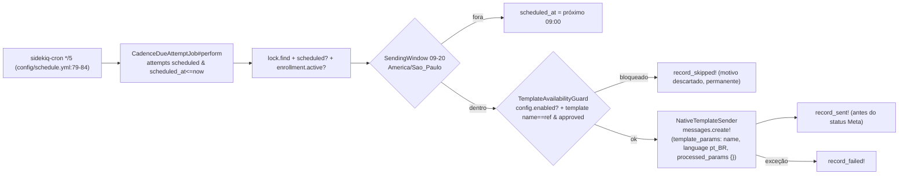

# ScanSolo Production Complete — Mapa de Arquitetura

Gerado em 2026-09-23 a partir do commit 4af19b0bb (branch feat/scansolo-production-complete). Documento factual — não implementa nada.

Documentos relacionados: [CURRENT_STATE](CURRENT_STATE.md) · [GAP_ANALYSIS](GAP_ANALYSIS.md) · [DECISIONS_REQUIRED](DECISIONS_REQUIRED.md) · [RISK_REGISTER](RISK_REGISTER.md)

Legenda dos diagramas:
- `[NÃO CONECTADO]`: código existe mas não tem chamador em produção.
- `[MOCK]`: é o caminho padrão em produção, mas usa um provider fictício.
- `[AUSENTE]`: não existe no repo.

Observação: `docs/agents/*.md` descreve o Chatwoot upstream (Captain, Firecrawl enterprise etc.) e não cobre a camada ScanSolo. Este mapa é a referência ScanSolo.

---

## 1. Visão geral

```
                 ┌────────────────────── Chatwoot OSS (upstream, reutilizado) ─────────────────────┐
 Meta Cloud API ─┤ Webhooks::WhatsappController → WhatsappEventsJob → IncomingMessage*Service     │
 Website widget ─┤ Public API / widget → Message                                                  │
                 │                         │ Message#after_create → Dispatcher                    │
                 │                         ▼                                                      │
                 │                 AsyncDispatcher (app/dispatchers/async_dispatcher.rb:23)       │
                 └─────────────────────────┬──────────────────────────────────────────────────────┘
                                           │ message_created
            ┌──────────────────────────────▼──────────────────────────────┐
            │ ScanSolo (app/**/scan_solo/**, gated por Account#scansolo_enabled) │
            │  ConversationListener → AiTurnJob → TurnOrchestrator         │
            │  Knowledge (ingestão/recuperação pgvector)                   │
            │  Cadence (cron → CadenceDueAttemptJob → NativeTemplateSender)│
            │  Pipeline / Handoff / Proposal / Make                        │
            │  API: /api/v1/accounts/:id/scan_solo/*  (Api::V1::Accounts::ScanSolo::BaseController) │
            │  Webhook: POST /webhooks/scan_solo/make                      │
            └──────────────────────────────────────────────────────────────┘
                                           │ saída sempre via conversation.messages.create!
                                           ▼
                     SendReplyJob / Whatsapp::SendOnWhatsappService (nativo)
```

**Isolamento:**
- `spec/lib/scansolo_no_enterprise_dependency_spec.rb:9-19` proíbe `Captain::` no código ScanSolo.
- O Captain (enterprise) continua ativo em paralelo, através de `enterprise/app/services/enterprise/message_templates/hook_execution_service.rb:2-15`. **Não há guard de coexistência.**

---

## 2. Turno de IA (inbound → resposta)

```mermaid
sequenceDiagram
  participant M as Message (incoming)
  participant AD as AsyncDispatcher
  participant L as ScanSolo::ConversationListener
  participant J as ScanSolo::AiTurnJob (queue medium)
  participant O as TurnOrchestrator
  participant CA as ContextAssembler
  participant R as Knowledge::RetrievalService
  participant MI as ModelInvoker (RubyLLM)
  participant OV as OutputValidator
  participant RS as ResponseSender
  M->>AD: message_created
  AD->>L: message_created(event)
  L->>L: return unless incoming? && scansolo_enabled? (:12-13)
  L->>L: pipeline bookkeeping (só se já existir opportunity) (:22-29)
  L->>J: perform_later(message.id)  [actions: [] sempre]
  J->>O: call(message, llm_provider: nil, actions: [])
  O->>O: create_turn (unique message_id; RecordNotUnique → nil) (:47-56)
  O->>O: EligibilityGuard (ai_control_state == ai_active) (:58-62)
  O->>O: AiAgentConfig.published_for + enabled (:64-68)
  O->>CA: call(message)
  CA->>R: call(account, query: message.content.to_s) top_k 5
  CA-->>O: {history, contact, pipeline, proposal=N/A, knowledge, memory}
  O->>O: InputGuardrail (forbidden_subjects)
  O->>O: build_prompt = SÓ histórico + PromptRedactor (:154-157)
  O->>MI: call(config, prompt)
  MI->>MI: Llm::Config.initialize! (memoizado) → ModelResolver → Llm::FeatureRouter
  MI-->>O: content/tokens ou failure_reason (só PROVIDER_ERRORS)
  O->>OV: regex preço/proposta/entrega
  O->>RS: transaction { execute_actions (só stage_transition); messages.create!(sender: AgentBot) }
  RS->>RS: turn.update!(succeeded, tokens, response_message_id)
```

Pontos de atenção (evidência):

1. **O contexto recuperado não entra no prompt.**
   - `knowledge_context`, `contact_context` e `pipeline_context` são gravados em `context_snapshot` (`turn_orchestrator.rb:74-75`).
   - Mas `build_prompt` usa só `conversation_history` (`:154-157`).
   - As instruções do sistema são `role/objective/persona/tone/instructions/service_rules` (`model_invoker.rb:74-77`).
2. **A camada de ações está `[NÃO CONECTADO]`.**
   - `ScanSolo::Actions::{Registry,Executor,ConfirmationGate,QualificationFieldAction,HandoffAction,CadenceSignalAction,StageTransitionAction,ProposalActions,PrivateNoteAction}` estão em `app/services/scan_solo/actions/`.
   - `Registry` não tem chamador.
   - O listener enfileira sem `actions` (`conversation_listener.rb:17`), e o orchestrator só aceita `stage_transition` (`turn_orchestrator.rb:18`).
3. **A elegibilidade é verificada uma única vez, antes do LLM.** Não é rechecada antes de `ResponseSender` (`turn_orchestrator.rb:30-41,114-121`).
4. **Não há serialização por conversa.** Uma rajada de N mensagens gera N turnos.
5. **Turno pendente:**
   - Uma exceção fora de `PROVIDER_ERRORS` (`model_invoker.rb:16`) ou fora de `OUTAGE_ERRORS` (`retrieval_service.rb:13`) deixa o turno `pending`.
   - O retry do Sidekiq recai em `create_turn` → `RecordNotUnique` → `nil`.
6. **O remetente é um `AgentBot`** achado ou criado pelo nome do config (`response_sender.rb:59-61`). Se o config for renomeado, um novo bot é criado.
7. **O turno é marcado `succeeded`** ao criar a mensagem. A falha posterior no WhatsApp (janela de 24h, `send_on_whatsapp_service.rb:15-17`) não volta ao turno.

---

## 3. Knowledge / RAG

```
Admin UI (KnowledgeCenter.vue) ──POST /scan_solo/knowledge/sources──▶ SourcesController#create (síncrono)
   │                                                                        │ save source (content, file anexado)
   │                                                                        ▼
   │                                   IngestionService (ingestion_service.rb:19-46)
   │                                     split \n{2,} → ~500 chars → EmbeddingService por chunk
   │                                     (Llm::FeatureRouter scansolo_knowledge_embedding → RubyLLM.embed)
   │                                     transaction { destroy chunks; create chunks vector(1536) }
   │                                   arquivo anexado: IGNORADO (lê só source.content :20)  [AUSENTE: parse PDF]
   ├──POST sources/:id/reindex──▶ ReindexService → IngestionService
   ├──PATCH sources/:id (enabled/content) ──▶ update SEM reingestão
   ├──DELETE ──▶ destroy (chunks dependent: :destroy)
   └──POST knowledge/retrieval_tests ──▶ RetrievalService (top_k sem limite superior)

Turno: ContextAssembler → RetrievalService.call(account, query) → nearest_neighbors cosine (scan exato, sem HNSW)
       → context_snapshot['knowledge_context']  ──✗──▶ prompt  (NÃO enviado)
```

**`[AUSENTE]`:**
- Fontes do tipo URL e crawl de site (o enum é só `document/faq/company_info`, `knowledge_source.rb:38`).
- Crawler com allowlist, profundidade, canonicalização, dedup e SSRF.
- Status e erro de indexação.
- Job assíncrono de ingestão.
- Escrita de `knowledge_evidence`.

**Infra OSS reutilizável:**
- `lib/safe_fetch.rb` e `lib/safe_fetch/{fetcher,private_network_request,request_options}.rb`, com o gem `ssrf_filter` (`Gemfile:47`).
- `reverse_markdown` (`Gemfile:197`).
- `firecrawl-sdk` (`Gemfile:215`), hoje usado pelo enterprise.
- `enterprise/app/services/page_crawler_service.rb`: licença enterprise e sem SSRF, então não serve.

---

## 4. Cadências



**Entradas de enrollment:**
- `EnrollmentService` é chamado só de `success_handler.rb:39` (proposta_enviada) e de `lifecycle_service.rb:18` (API manual `POST cadence_enrollments`).
- **`[AUSENTE]`: enroll automático em novo_lead, em_contato e em_qualificacao.**

**Paradas:**
- `StageTransitionService` → `StopRecalculatePolicy` (`stop_recalculate_policy.rb:33-42`).
- `TakeoverService` (`takeover_service.rb:41`).
- API pause/resume/cancel.
- `ReplyCompletenessDetector` está `[NÃO CONECTADO]`.

**Definições:**
- `CadenceDefinition.current_for(stage)` (`cadence_definition.rb:38-40`).
- O seed `db/seeds/scansolo_cadence_definitions.rb` **não é carregado** por `db/seeds.rb`.
- Nomes de template derivados: `scansolo_cadence_<stage>_v<version>_step<N>` (`cadence_definition.rb:50-52`).

---

## 5. Handoff — máquina de estados

```
                 POST .../handoff (TakeoverService)                  [AUSENTE: gatilho por resposta humana nativa]
   ai_active ─────────────────────────────────────────────▶ human_active
       ▲          nota privada 9 campos, AuditEvent,               │
       │          cancela TODAS as cadências                        │
       └──────────── POST .../return_to_ai (ReturnToAiService) ◀────┘
                     AuditEvent; NÃO re-inscreve cadências

   Estados no enum sem transição exposta: handoff_requested, awaiting_human, paused, closed
   (conversation_extension.rb:20-27)   [AUSENTE: endpoints pause/close/reopen]
   HandoffAction (IA pede handoff)     [NÃO CONECTADO]
   HandoffControlBanner.vue            [NÃO MONTADO]
   Conversation#assignee               [NÃO ALTERADO pelo takeover]
```

A IA roda só em `ai_active` (`eligibility_guard.rb:18-20`). O cron de cadência **não** consulta `ai_control_state` (`cadence_due_attempt_job.rb:22-42`).

---

## 6. Propostas / Make

```
ProposalsController#generate ─▶ GenerateService(provider: MockProvider [MOCK])
                                   │ gate: required_qualification_fields
                                   ▼
                         MockProvider.request_generation → CallbackHandler.apply_generate_result!
                           value 1500.0 BRL, artifact_url https://mock-proposals.scansolo.test/<id>.pdf
ProposalsController#approve ─▶ ApproveService
ProposalsController#send    ─▶ SendService(provider: MockProvider [MOCK])
                                   ▼
                         CallbackHandler (send ok) → messages.create!(template scansolo_proposal_send, pt_BR)
                                   → SuccessHandler → stage proposta_enviada + enroll cadence proposta_enviada

[NÃO CONECTADO] Make::OutboundRequestService
   credentials scan_solo.make.scenario_url / scan_solo.make.secret, Bearer, X-Idempotency-Key, timeout 10s
   grava MakeRequest(status, retry_count)
POST /webhooks/scan_solo/make ─▶ Webhooks::ScanSolo::MakeController
   CallbackVerifier: HMAC X-Make-Signature (credentials scan_solo.make.inbound_signing_secret) → JSON schema → match MakeRequest
   apply!: MakeCallback.create! + MakeRequest.update!(status)   ──✗──▶ CallbackHandler/ProposalVersion (não chamado)
   rejeição: MakeCallback com correlation_id (queima o id para callbacks válidos posteriores)
RetryPolicy [NÃO CONECTADO: sem rota/UI];  DeadLetterQuery (retry_count>=3, inalcançável) → Executions
```

---

## 7. Fontes de configuração

Só nomes, nunca valores.

| Fonte | Chaves / nomes | Consumidor |
|---|---|---|
| `config/llm.yml` | `scansolo_agent_response` (`:205-215`), `scansolo_knowledge_embedding` (`:219-223`) | `Llm::FeatureRouter`, `ModelResolver`, `EmbeddingService` |
| `config/llm_models.json` | registro de modelos RubyLLM | `lib/llm/config.rb:38` |
| `InstallationConfig` (Super Admin, grupo captain, `super_admin/app_configs_controller.rb:70`) | `CAPTAIN_OPEN_AI_API_KEY`, `CAPTAIN_OPEN_AI_ENDPOINT` | `lib/llm/config.rb:43-49` |
| `GlobalConfig` | `WHATSAPP_APP_SECRET`, `INACTIVE_WHATSAPP_NUMBERS` | `whatsapp_controller.rb` |
| `Channel::Whatsapp.provider_config` | `webhook_verify_token`, `app_secret`/`app_secret_key`/`client_secret`/`api_secret`, token da API | webhook e envio nativos |
| Rails credentials | `scan_solo.make.scenario_url`, `scan_solo.make.secret`, `scan_solo.make.inbound_signing_secret` | `OutboundRequestService`, `CallbackVerifier` |
| ENV | `RATE_LIMIT_SCANSOLO_MAKE_CALLBACK` (`rack_attack.rb:351`), `SAFE_FETCH_ALLOW_PRIVATE_NETWORK` (`lib/safe_fetch.rb:36-38`), `POSTGRES_HOST/USERNAME/PASSWORD`, `REDIS_PASSWORD`, `ACTIVE_STORAGE_SERVICE`, `SCANSOLO_IMAGE_TAG`, `SCANSOLO_DOMAIN`, `STORAGE_*` | Rails e compose. `SCANSOLO_*`/`STORAGE_*`/`RATE_LIMIT_SCANSOLO_*` ausentes de `.env.example` |
| DB | `accounts.scansolo_feature_flags` (bit `scansolo_enabled`, `account.rb:47-49`), `AiAgentConfig` publicado, `CadenceDefinition` | runtime |
| Constantes | `ScanSolo::PIPELINE_STALE_THRESHOLD = 48.hours` (`config/initializers/scansolo_constants.rb:6`) | pipeline |

---

## 8. Tabelas (`db/schema.rb:1432-1679`)

| Tabela | Papel | Restrições notáveis |
|---|---|---|
| `scan_solo_ai_agent_configs` | draft e snapshots publicados | um draft por conta (índice parcial) |
| `scan_solo_ai_turns` | evidência por turno | unique `message_id`; `latency_ms`, `cost_estimate`, `knowledge_evidence` nunca escritos |
| `scan_solo_knowledge_sources` / `_chunks` | RAG | `embedding vector(1536)`, sem índice ANN |
| `scan_solo_conversation_extensions` | `ai_control_state` | — |
| `scan_solo_pipeline_opportunities` / `_stage_events` | pipeline e timeline | uma por conversa; eventos readonly |
| `scan_solo_cadence_definitions` / `_enrollments` / `_attempts` | cadências | unique (stage,version) / (opportunity,definition) / (enrollment,step) |
| `scan_solo_proposals` / `_proposal_versions` | propostas | uma versão corrente; correlation ids únicos |
| `scan_solo_make_requests` / `_make_callbacks` | Make | unique `make_callbacks.correlation_id` permanente |
| `scan_solo_agent_actions` / `_agent_action_executions` | camada de ações | só alcançada em specs |
| `scan_solo_audit_events` | auditoria append-only | readonly |

---

## 9. Rotas

**Autenticadas:** `config/routes.rb:462-515`, prefixo `/api/v1/accounts/:account_id/scan_solo`.

| Recurso | Endpoints |
|---|---|
| pipeline_opportunities | `GET` index/show, `PATCH` update (owner), `POST :id/stage_transitions`, `POST :id/proposals/generate` |
| proposals | `GET` index/show, `POST :id/approve`, `POST :id/send` |
| ai_agent_config | `GET`, `PUT draft`, `POST publish` |
| knowledge/sources | index/create/update/destroy, `POST :id/reindex`; `POST knowledge/retrieval_tests` |
| ai_turns | index/show (por correlation_id) |
| cadence_enrollments | index/create, `POST :id/pause`, `:id/resume`, `:id/cancel` |
| conversations | `GET :conversation_id/control_state`, `POST :conversation_id/handoff`, `POST :conversation_id/return_to_ai` |
| executions | index |

**Públicas:**
- `POST /webhooks/scan_solo/make` (`routes.rb:737`).
- O webhook nativo `webhooks/whatsapp/:phone_number`.

**`[AUSENTE]`:**
- Endpoint de health/status do agente.
- CRUD de templates ScanSolo.
- Criação de oportunidade.
- pause/close/reopen de handoff.
- Retry manual de proposta.
- Import LEXUS.

---

## 10. Frontend

| Módulo (sidebar) | Rota / componente | Store (`ST/`) | API client (`app/javascript/dashboard/api/`) |
|---|---|---|---|
| Pipeline | `pipeline/KanbanBoard.vue`, `pipeline/OpportunityDetail.vue` (rota órfã) | `pipelineOpportunities.js` | `scansoloPipelineOpportunities.js` |
| Agente de IA | `agent/AgentCenter.vue`, `agent/TurnEvidenceViewer.vue` (rota órfã) | `aiAgentConfig.js`, `aiTurns.js` | `scansoloAiAgentConfig.js`, `scansoloAiTurns.js` |
| Conhecimento | `knowledge/KnowledgeCenter.vue` | `knowledgeSources.js` | `scansoloKnowledgeSources.js`, `scansoloKnowledgeRetrievalTests.js` |
| Follow-ups | `followups/FollowUps.vue` | `cadenceEnrollments.js` | `scansoloCadenceEnrollments.js` |
| Propostas | `proposals/Proposals.vue` | `proposals.js` | `scansoloProposals.js` |
| Execuções e auditoria | `executions/Executions.vue` | `executions.js` | `scansoloExecutions.js` |
| (conversa) | `components-next/conversation/HandoffControlBanner.vue` **não montado** | — | `scansoloHandoff.js` |

**Registro:**
- `FE/index.js:19-54`, `FE/scansoloModules.js:5-42` e `FE/scansoloSidebarItems.js:5-12`.
- Sidebar gated em `Sidebar.vue:58-59,601-610`.
- As rotas são filhas planas de `AppContainer` (`dashboard.routes.js:35`), renderizadas dentro de `<main class="... overflow-hidden">` (`Dashboard.vue:142-156`). É a causa do bug de scroll.
- `pages/ScanSoloComingSoonPage.vue` é código morto.

**i18n:** `app/javascript/dashboard/i18n/locale/en/scansolo.json`, importado em `en/index.js:33,82`. Não existe arquivo pt_BR.

---

## 11. Topologia de deploy

```
VPS (reportado pelo usuário: Nginx/TLS no host, fora do Git)
 └─ Nginx :443 ──▶ 127.0.0.1:3000 (rails)
 docker-compose.production.yaml
   base (build docker/Dockerfile → scansolo-chatwoot:${SCANSOLO_IMAGE_TAG:-local}, env_file .env)
   rails     127.0.0.1:3000  entrypoint docker/entrypoints/rails.sh
   sidekiq   (config/sidekiq.yml; cron inclui scan_solo_cadence_due_attempt_job)
   postgres  pgvector/pgvector:pg16  127.0.0.1:5432  POSTGRES_PASSWORD= (vazio no Git; corrigido à mão na VPS)
   redis     redis:alpine  127.0.0.1:6379  --requirepass $REDIS_PASSWORD
 docker-compose.scansolo.yaml (overlay)
   healthchecks + log json-file; profiles: self-hosted-storage (minio), reverse-proxy (caddy 80/443 — conflita com Nginx do host), backup (pg_dump)
 docker-compose.yaml (DEV) — documentado como primeiro -f no comando de produção (SCANSOLO_DEPLOYMENT.md:40-41): merge de portas públicas, bind mount ./:/app, vite, mailhog
 Dockerfile: RUN git rev-parse HEAD > /app/.git_sha (:90) — exige .git real no contexto; sem ARG GIT_SHA
```
